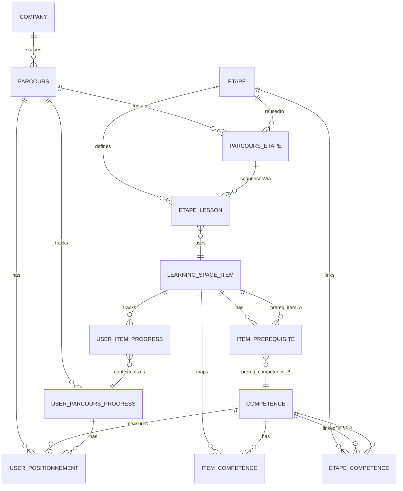

# 01 Parcours & Learning Space

**Version:** MVP Juillet 2026  
**Status:** 🟢 Spécification complète — Prête Review  
**Effort estimé:** 140-170h  
**Timeline:** Semaines 1-3 (Phase 1 & 2)

---

## 📖 Vue d'Ensemble

### Objectif Métier

Construire l'infrastructure centrale d'apprentissage de la plateforme SBO en deux piliers interconnectés :

1. **Parcours d'Apprentissage** : Structure pédagogique séquencée (étapes → leçons principales → contenus complémentaires) avec positionnement initial auto-généré et progression stricte.
2. **Learning Space** : Agrégateur visuel de contenus micro-learning accessibles à la demande (consommables standalone) avec pré-requis optionnels.

**Impact stratégique :**
- Offre une **progression structurée** (parcours) ET une **flexibilité autonome** (Learning Space)
- Calibre l'expérience dès l'entrée via positionnement auto-déclaratif (basé compétences sélectionnées)
- Contrôle accès Learning Space via pré-requis items ou niveaux compétences (optionnel)
- Crée la fondation pour analytics détaillée (Option C) et progression pondérée (Option B)
- Supporte futures évolutions (adaptive learning V2

**Lien SBO :** Pilier **Learn** — Individualisation + Progression + Autonomie

---

### Qui l'Utilise (Rôles)

- **Apprenant (Learner)** : Découvre parcours, se positionne, suit progression séquencée, accède à Learning Space pour contenu libre (avec pré-requis optionnels)
- **Coach** : Configure parcours, crée étapes, assigne leçons, paramètre pré-requis items, surveille progression apprenants, intervient sur blocages
- **Admin** : Gère modération parcours/contenus, contrôle accès (abonnement), publie/dépublie, paramètre visibilité
- **Auteur Contenu** : Crée items (micro-learning, masterclass), configure pré-requis, les ajoute à Learning Space, lie à compétences, publie

---

### Scope — IN / OUT

#### ✅ IN (MVP Juillet)

**Parcours**
- Création/édition/suppression parcours (BO)
- Métadonnées (titre, description, durée, niveau, image)
- **Scope entreprise** : Parcours peut être global OU spécifique à une entreprise (tenant)
- Séquencement étapes (réutilisables entre parcours, via drag & drop BO)
- **Métabox compétences du parcours** = AGRÉGATION automatique des compétences des étapes liées (read-only)
- **AUTO-GENERATED Positionnement Initial** : Système crée questionnaire basé compétences agrégées du parcours (1 Q par compétence)
- **Progression paramétrisable** : Mode `STRICT` (étape N+1 après 100% N) / `FLEXIBLE` (N+1 accessible avant 100%) / `FREE` (accès libre) — configurable via metabox BO
- Publication/dépublication parcours

**Étapes (NEW — Entity à part entière)**
- **Page Étape dédiée en BO** (car réutilisables sur plusieurs parcours)
- Création/édition/suppression étape indépendante du parcours
- Métadonnées (titre, description)
- Liaison étape ↔ compétences (via métabox, affects questionnaire positionnement)
- Assignation à parcours (peut être utilisée dans 0, 1, ou plusieurs parcours)
- Version tracking (v1, v2…) pour réutilisation cohérente

**Leçons & Contenus (Liés à Étapes, pas au Parcours)**
- Leçons Principales par étape (ordre strict, obligatoires pour validation étape)
- Contenus Complémentaires par étape (ordre libre, obligatoires pour validation étape)
- **Métabox compétences sur contenus** (héritées par étape, puis par parcours)

**Positionnement (MVP — 3 Touchpoints, Partiellement dans Parcours)**
- **Touchpoint 1 : Onboarding Global (Account Creation)** — À l'inscription, questionnaire initial (Cahier #3 Onboarding)
- **Touchpoint 2 : Onboarding Parcours (Parcours Entry)** — Au 1er accès parcours, modale auto-déclarative spécifique parcours (THIS CAHIER)
  - Questions Dreyfus (1-5) AUTO-GÉNÉRÉES basé compétences du parcours (no manual selection)
  - Résultats enregistrés (BDD + fiche user BO, onglet "Positionnement par Parcours")
  - Skip option (parcours démarre, no enregistrement)
  - No repeat: modale ne s'affiche qu'une fois par apprenant/parcours
- **Touchpoint 3 : Mission/Projet (In-Context)** — Lors missions/projets assignés (Cahier #9 Missions, V2+)
- **MVP Scope** : Touchpoints 1 & 2 (Onboarding global + parcours entry). Touchpoint 3 = V2+

**Pré-requis Items (MVP — Simple)**
- **Type A : Item Prerequisite** : "Must complete item X before accessing item Y"
- **Type B : Competency Prerequisite** : "Minimum Dreyfus level N in Competency X"
- Coach configure pré-requis optionnels en BO (per item)
- If no prerequisite configured → item accessible (no blocking)
- FO: Items avec pré-requis affichées avec badge "🔒 Complétez d'abord [prerequisite]"
- Pré-requis validation au item access (check completion + competency level)

**Learning Space (FO)**
- Page d'agrégation affichant TOUS les contenus accessibles (filtre abonnement + pré-requis)
- Items : Micro-learning (6 types) + Missions Apprenantes + Masterclass
- Filtres : Thématique, Type, Durée, Niveau Dreyfus, Statut complétion
- Recherche textuelle (titre + description)
- Contrôle accès : vérif abonnement + pré-requis avant affichage
- Cartes contenu : Titre + Thématique + Type + Durée + Niveau + Statut + Bouton d'accès
- Pagination ou infinite scroll
- Complétion tracking (timestamp + UserID + ContentID)

**Learning Space (BO)**
- CRUD complets pour 9 types contenu
- Publication/dépublication
- Association compétences via métabox (passeport)
- **Configuration pré-requis items** (NEW)
- Tagging (catégorie, tags, niveau Dreyfus, XP)

**Vue Parcours (FO)**
- Affichage progression (étapes complétées vs à faire)
- Leçons principales en ordre strict (avec verrou étapes suivantes)
- Contenus complémentaires en ordre libre
- Visualisation clair : "Étape X/Y", "Leçons X/Y complétées"
- Indicateur "Peut avancer à l'étape suivante" vs "Complétez d'abord..."

**Analytics MVP**
- Events basiques : page view, item start, item complete, quest answer, progression step
- Agrégations simples : nb items completed, temps par item, score positionnement
- Dashboard coach : vue apprenant simple (progression %)

#### ❌ OUT (Déféré / Partiellement IN)

- **Positionnement Avancé (FT-186)** : Touchpoint 2 (Parcours Entry) = MVP ✅. Touchpoints 1 (Global Onboarding) & 3 (Mission/Projet) = V2+ / Cahier #3, #9
- **Adaptive Learning** : Rééquilibre dynamique parcours basé réponses positionnement → V2 Octobre (Option C)
- **JIT Learning** : Suggestions contextuelles temps-réel → V2 Octobre (Option C)
- **Missions Apprenantes Intégrées** : Structure missions dans parcours → Cahier #3 V2
- **Masterclass/Classes Virtuelles** : Synchrone + Direct Messaging → Cahier #11 V1
- **Lien Gamification XP** : Récompenses XP pour complétion → Cahier #7 Gamification
- **Recommandations Dynamiques** : Moteur heuristique → Cahier #2 (Items)
- **Import Notion Workflow** : CSV bulk import → DÉFÉRÉ (post-MVP, post-V1) — content bootstrap "nice-to-have"
- **Marketplace Experts** : Consultation experts externes → DÉFÉRÉ Octobre 2026+

---

### Dépendances Critiques

**Dépend de:**
- **Référentiel Compétences** (Cahier #2) : Définitions compétences pour auto-génération questionnaire + niveaux Dreyfus pour métabox Learning Space
- **Passeport Compétences** (Cahier #0) : Modèle données compétences, structure Dreyfus, relations User ↔ Compétences

**Bloque:**
- **Items d'Apprentissage & Veille** (Cahier #2) : Définit quels types contenu existent, métabox, structure Learning Space, pré-requis linking
- **Gamification** (Cahier #7) : Dépend infrastructure progression parcours + tracking events
- **Missions Apprenantes** (Cahier #9) : Dépend structure parcours étapes, dépend tracking completion
- **Coaching** (Cahier #6) : Dépend suivi progression, feedback apprenant


## 📱 Écrans à Concevoir

### Front-Office (React)

| Écran | Rôle | Description | Priorité |
|-------|------|-------------|----------|
| **Page d'Accueil Parcours (Découverte)** | Apprenant | Liste filtrable des parcours accessibles avec image, titre, description, durée, niveau. Bouton "Commencer" ou "Reprendre". Pagination. Statut personnel (Pas commencé / En progrès / Terminé) visible. | P0 |
| **Modale Positionnement Initial (Auto-Généré)** | Apprenant | Questionnaire Dreyfus 1-5 avec questions AUTO-GÉNÉRÉES basé compétences parcours. Affichage progression "Question 3/8". Boutons "Valider réponses" et "Passer". Submit enregistre et ferme modale. | P0 |
| **Vue Parcours (Progression)** | Apprenant | Affichage séquence étapes avec statut (✓ Complétée / ◯ En cours / ◯ Verrouillée). Pour chaque étape: titre + description courte + nb leçons principales/complémentaires. Clic ouvre détail étape. Barre progression globale parcours %. | P0 |
| **Détail Étape (Leçons)** | Apprenant | Liste leçons principales (ordre strict, chacune avec verrou "Complétez [leçon N-1] avant"). Contenu complémentaires en section libre. Chaque item: titre + durée + type (icône) + statut + badge "🔒 Pré-requis" si applicable. Clic ouvre contenu. | P0 |
| **Page Learning Space** | Apprenant | Agrégateur de tous items accessibles : micro-learning (6 types) + missions + masterclass. Filtres (Thématique / Type / Durée / Niveau / Statut). Recherche textuelle. Cartes: Titre + Thématique + Type + Durée + Niveau + Statut + "🔒 Pré-requis" badge + "Commencer". | P0 |
| **Détail Item (Lecteur)** | Apprenant | Affichage contenu spécifique au type (vidéo / article / flashcard / etc.). Header: Titre + Thématique + Durée + Niveau. Footer: Bouton "Marquer comme complété", infos complémentaires, nav next/prev. Tracking automatic (XP, temps, completion). | P1 |

### Back-Office (WordPress Admin)

| Écran | Rôle | Description | Priorité |
|-------|------|-------------|----------|
| **Tableau Bord Parcours** | Coach / Admin | Liste tous parcours avec colonnes: Titre / Statut (Publié/Brouillon) / Durée / Nb Étapes / Scope (Global/Entreprise) / Actions (Éditer / Publier / Supprimer). Bouton "+ Créer Parcours". Filtrage statut + scope. | P0 |
| **Formulaire Création Parcours (Métadonnées)** | Coach / Admin | Champs: Titre + Description (rich text) + Image (upload) + Durée (heures) + Niveau (Débutant/Intermédiaire/Avancé/Expert) + **Scope (Global / Spécifique Entreprise avec sélecteur tenant)**. Metabox: **Progression Mode (STRICT / FLEXIBLE / FREE)** — configurable. Métabox Compétences affiche AGRÉGATION (lecture seule, calculated from étapes). Bouton "Suivant" → Séquenceur Étapes. | P0 |
| **Gestion Étapes (NEW Entity)** | Coach / Admin | Page dédiée "Gestion Étapes" listant toutes étapes créées (utilisables dans 0, 1, ou +plusieurs parcours). Colonnes: Titre / Description / Nb Contenus / Nb Parcours Utilisant / Version / Actions (Éditer / Dupliquer / Supprimer). Bouton "+ Créer Étape". Recherche + filtrage. | P0 |
| **Formulaire Création/Édition Étape (NEW)** | Coach / Admin | Champs: Titre + Description. Metabox Compétences (multi-select, attachées à cette étape). Version auto-incrémentée si réutilisée. Système trace "Utilisée dans X parcours". | P0 |
| **Séquenceur Étapes (Drag & Drop)** | Coach / Admin | Interface drag-drop pour réordonner étapes dans parcours. Chaque étape: Titre + Description + Métabox Compétences (affichée read-only, inherited de l'entité étape) + Boutons (Éditer Leçons / Éditer Complémentaires / Remplacer Étape / Supprimer Assignation). Metabox Progression Mode affiche règle: "Passage à Étape N+1 après 100% Étape N (STRICT)" ou "FLEXIBLE" ou "FREE" selon config. | P0 |
| **Gestion Leçons Principales** | Coach / Admin | Popup/modal pour ajouter items Learning Space à une étape comme Leçons Principales. Recherche/sélection items (autocomplete, affiche titre + type + durée). Items ajoutées affichées en liste avec ordre (drag-drop réordonnage). Indication claire "Ordre strict - Obligatoires". | P0 |
| **Gestion Contenus Complémentaires** | Coach / Admin | Popup/modal pour ajouter items comme Contenus Complémentaires. Recherche/sélection items. Items affichées en liste (ordre libre). Indication "Obligatoires pour validation étape - Ordre libre". | P0 |
| **Tableau Bord Items Learning Space** | Auteur / Admin | Liste tous items avec colonnes: Titre / Type / Statut (Publié/Brouillon) / Compétences / Pré-requis / Créateur / Actions (Éditer / Voir Aperçu / Supprimer). Filtrage type, statut, compétence. | P0 |
| **Formulaire Item Learning Space** | Auteur / Admin | Création/édition item: Titre + Description + Type (dropdown 9 types) + Contenu (selon type). Métabox Passeport: Compétences (multi-select) + Niveau Dreyfus (radio 1-5) + Points XP. **NEW: Pré-requis Configuration** (Type A: select items OR Type B: select competency + min level). Tags. Publish/Save. | P0 |
| **Fiche Apprenant (Profil)** | Coach / Admin | Onglet existant "Passeport" complété avec section "Positionnement Parcours": Liste parcours commencés avec date positionnement + résultats (niveaux initiaux par compétence pour ce parcours). Vue historique. | P1 |

---

## ⚙️ Fonctionnalités (MVP)

### Core

1. **Création & Configuration Parcours** - Coach/Admin crée parcours avec métadonnées, lie compétences (questionnaire AUTO-généré), séquence étapes, sélectionne **progression mode (STRICT/FLEXIBLE/FREE)** via metabox, définit scope (Global/Entreprise spécifique)
2. **Gestion Entité Étape (NEW)** - Création/édition/suppression étapes en tant qu'entité réutilisable (visible dans BO "Gestion Étapes" page). Étapes peuvent être assignées à 0, 1, ou plusieurs parcours
3. **Séquencement Étapes & Leçons** - Définition ordre étapes (drag-drop), ajout leçons principales (ordre strict) et complémentaires (ordre libre) par étape (via liage Étape ↔ Item)
4. **Positionnement Initial Auto-Généré** - Questionnaire Dreyfus auto-généré basé compétences **agrégées du parcours** (pas compétences étape), modale au 1er accès, enregistrement résultats
5. **Progression Étapes Paramétrisable** - Mode configurable **STRICT** (N+1 après 100% N) / **FLEXIBLE** (N+1 accessible avant 100%) / **FREE** (accès libre). Règle s'applique à toutes étapes parcours
6. **Pré-requis Items (Simple MVP)** - 2 types : item prerequisite (item X required before Y) + competency prerequisite (min level required). Coach configure en BO per item, auto-check FO.
7. **Learning Space (Agrégateur)** - Page FO affichant micro-learning (9 types) + missions + masterclass avec filtres/recherche/contrôle accès
8. **Contrôle Accès Learning Space** - Vérification abonnement + pré-requis avant affichage item
9. **CRUD Items Learning Space** - Création/édition/publication items (9 types) avec métabox compétences + niveaux Dreyfus + pré-requis config (via ItemPrerequisite table)
10. **Suivi Complétion Items** - Enregistrement timestamp complétion par apprenant + affichage statut (Pas commencé / En progrès / ✓)
11. **Publication / Dépublication Parcours** - Activation/désactivation parcours pour apprenants, sans supprimer données progression
12. **Recherche & Filtrage Learning Space** - Texte libre + filtres par thématique/type/durée/niveau/statut
13. **Agrégation Automatique Compétences Parcours** - Métabox "Compétences du Parcours" affiche automatiquement union de toutes compétences des étapes liées (read-only)

### Secondary

12. **Dashboard Coach Suivi** - Vue coach : liste apprenants assignés + progression % + indicateurs blocages
13. **Notifications Progression** - Alertes coach quand apprenant bloqué >48h sur même étape
14. **Export Progression (BO)** - Télécharger CSV progression apprenant/parcours pour analyses externes
15. **Vue Prévisualisation Item** - Admin/Coach peuvent voir aperçu item avant publication (pas visible apprenant)

---

## 🚀 Possible Évolutions (V2+)

### V2 (Septembre 2026)
- **Positionnement Multi-Touchpoints** (FT-186) : Positionnement initial + onboarding + missions pour profiling progressif
- **Adaptive Learning** : Rééquilibre dynamique parcours basé réponses positionnement initial
- **JIT Learning** : Suggestions contextuelles items Learning Space en temps-réel
- **Parcours Optionnels** : Étapes/leçons optionnelles vs obligatoires (personnalisation parcours)
- **Branching Parcours** : Chemins alternatifs basés positionnement/compétences

### V3 (Q1 2027)
- **Microlearning Séquencé** : Intégration micro-learning dans parcours (pas juste en Learning Space)
- **Parcours Collaboratifs** : Apprentissage en groupe avec jalons collectifs

### V4 (2028+)
- **Gamification Avancée** : Badges par parcours/étape, leaderboards
- **Marketplace Experts** : Parcours création experts

---

## 👥 User Journeys (Format 3)

### User Journey #1 : Apprenant → Découverte Parcours & Positionnement Initial

**Acteur :** Apprenant (utilisateur inscrit post-onboarding, 1er accès aux parcours)  
**Déclencheur :** Apprenant clique "Parcours" dans menu principal ou suit lien d'invitation parcours  
**Objectif :** Découvrir parcours disponible, comprendre son niveau initial via positionnement AUTO-généré, démarrer apprentissage

#### Étapes Détaillées

1. **Apprenant accède page d'accueil Parcours**
   - Clique "Parcours" (menu nav) ou ouvre lien parcours direct
   - Système charge liste parcours accessibles (filtre abonnement apprenant)
   - Affichage page en ~600ms (cache local si offline)
   - Feedback: Page affiche titre "Mes Parcours", description plateforme, liste cartes (image + titre + durée + niveau + bouton "Commencer")
   - Durée: ~600ms

2. **Système affiche liste parcours personnalisée**
   - Filtre appliqué automatiquement : parcours où apprenant a accès (abonnement)
   - Code couleur cartes : 🟢 "Peut commencer" / 🟠 "En progrès" / ✓ "Complété"
   - Chaque carte: Thumbnail image, Titre, Description (50 chars), Durée "12h", Niveau "Débutant", Bouton "Commencer" ou "Reprendre"
   - Pagination 6 parcours/page
   - Feedback: Instantané, cartes chargées avec skeleton avant images complètes
   - Durée: Instant

3. **Apprenant clique "Commencer" sur parcours (1ère visite)**
   - Clique bouton CTA principal sur carte parcours
   - Système valide : apprenant n'a jamais accédé ce parcours (vérif BDD)
   - Affichage modale positionnement (fullscreen modal, overlay 80% opacity)
   - Feedback: Modal glisse depuis bas (iOS) ou fade-in (desktop), 300ms animation
   - Durée: ~300ms

4. **Modale Positionnement affiche questionnaire AUTO-GÉNÉRÉ**
   - Title "Bienvenue ! Positionnons-nous 🎯" + description "X questions rapides pour calibrer ton parcours"
   - Questions Dreyfus 1-5 AUTO-GÉNÉRÉES basé compétences du parcours sélectionnées en BO
   - Exemple pour parcours "IA Fundamentals" (coach a sélectionné 3 compétences) : 3 questions Dreyfus
   - Q1 (pour "Fondamentaux IA"): "Quel est ton niveau en IA actuellement ?" avec échelle "1=Novice ... 5=Expert"
   - Affichage progress bar "Question 1/3", boutons sous les questions
   - Feedback: Questions chargées instantanément, sélection réponse change couleur bouton (🔵 → 🟠)
   - Durée: Instant

5. **Apprenant répond questions questionnaire AUTO-GÉNÉRÉ**
   - Clique réponses (boutons radio) pour chaque question
   - Peut revenir en arrière et modifier réponses (boutons Précédent/Suivant)
   - Feedback visuel: Réponse sélectionnée mise en avant (couleur + checkmark)
   - Système stocke réponses en session memory (pas BDD avant submit)
   - Durée: ~5-8 secondes par Q (humain réfléchit)

6. **Apprenant soumet positionnement ou skip**
   - Option A : Clique "Valider Positionnement" → Système enregistre réponses en BDD, calcule niveaux initiaux, ferme modale
   - Option B : Clique "Passer" → Modale ferme, parcours démarre config par défaut (aucune enregistrement)
   - Feedback (Option A): "Positionnement enregistré ! ✓", modal fade-out ~500ms, parcours affiche
   - Feedback (Option B): Modal ferme immédiatement, parcours affiche sans message
   - Durée: ~500ms transition

7. **Système enregistre résultats positionnement AUTO-GÉNÉRÉ (BDD)**
   - Calcule niveau initial pour chaque compétence du parcours (based réponses Dreyfus)
   - Enregistre: UserID, ParcoursID, CompétenceID, NiveauDreyfus (1-5), Timestamp, ReponsesBrutes (JSON)
   - Crée/met-à-jour fiche User BO onglet "Profil Apprenant": section "Positionnement" avec tableau résultats
   - Exemple affichage BO : "Parcours: IA 101 | Positionnement: 2026-05-09 14:23 | Compétences: [Fondamentaux IA:3, Data Analysis:2, ML:1]"
   - Feedback: Aucun (backend), apprenant voit seulement modale fermée
   - Durée: ~200ms (BDD insert)

8. **Vue Parcours affiche après positionnement**
   - Affiche progression globale : "Étape 1/5 en cours"
   - Affiche étape courante avec titre + description
   - Leçons principales listées en ordre strict (verrou 🔒 sur leçons suivantes)
   - Contenus complémentaires affichés en section libre (avec badges "🔒 Pré-requis" si applicable)
   - Chaque item: Titre + Type (icône) + Durée + Statut (pas commencé / en progrès / ✓)
   - Bouton CTA "Commencer Leçon 1"
   - Feedback: Page charge ~800ms avec pagination, barre progression animée (slide 0% → X%)
   - Durée: ~800ms

9. **Apprenant clique leçon principale 1**
   - Clique "Commencer" sur première leçon principale
   - Système vérifie : leçon est déverrouillée (étape 1 en progrès)
   - Vérifie AUSSI : aucun pré-requis item (si aucun n'est configuré)
   - Affichage contenu leçon (type spécifique : article, vidéo, etc.)
   - Enregistrement evento "lesson_start" (timestamp + UserID + LessonID + ParcoursID)
   - Feedback: Transition vers lecteur contenu (~500ms), affichage header parcours (breadcrumb + progress)
   - Durée: ~500ms

#### Conditions de Succès ✅
- [ ] Page parcours charge en <800ms avec liste filtrée (abonnement)
- [ ] Modale positionnement affiche au 1er clic "Commencer" (vérif 1ère visite)
- [ ] Questionnaire AUTO-GÉNÉRÉ (basé compétences parcours, pas sélection manuelle)
- [ ] Questions chargent et s'affichent ordre correct
- [ ] Réponses enregistrées en BDD avec timestamp + UserID + ParcoursID
- [ ] Niveaux initiaux calculés correctement (algo Dreyfus 1-5)
- [ ] Fiche User BO onglet "Profil Apprenant" affiche résultats positionnement
- [ ] Modale ne réapparaît PAS si apprenant revient parcours plus tard
- [ ] Skip option fonctionne (parcours démarre, aucune enregistrement positionnement)
- [ ] Pré-requis items affichés correctement (badges "🔒 Pré-requis" visibles)
- [ ] Étapes/leçons s'affichent sans scroll lag (mobile 60fps)
- [ ] Événements tracking corrects (lesson_start + timestamp)

#### Erreurs & Edge Cases ❌

**Cas 1 : Apprenant tente d'accéder parcours sans abonnement correct**
- Scénario: Apprenant essaie d'accéder parcours "IA Premium" mais abonnement = "Starter" (accès limité)
- Comportement attendu:
  - Parcours n'apparaît PAS dans liste page accueil
  - Si accès direct via URL : redirection vers page parcours + message "Contenu réservé à [Tier] abonnés"
  - Affichage bouton "Upgrade Abonnement" avec CTA vers plans
- Feedback: Message clair rouge/orange, pas d'erreur technique
- Impact: Sécurité accès, revenu subscription

**Cas 2 : Apprenant quitte modale positionnement sans répondre**
- Scénario: Apprenant ouvre modale positionnement, voit questions, clique "Fermer" (X button) avant répondre
- Comportement attendu:
  - Modale peut PAS être fermée via X (X button désactivé ou absent)
  - Apprenant DOIT cliquer "Valider" ou "Passer" pour continuer
  - Feedback: Toast message "Veuillez répondre ou cliquer Passer pour continuer"
- Impact: Data integrity (positionnement toujours enregistré ou explicitement skipped)

**Cas 3 : Apprenant revient après avoir fait positionnement**
- Scénario: Apprenant visite parcours jour 1 (fait positionnement 3/5), revient jour 5 (reprendre)
- Comportement attendu:
  - Modale positionnement n'apparaît PAS (vérif BDD : "positionnement_done" = true)
  - Affichage directement vue parcours étape 1
  - Résultats positionnement restent en BDD (visibles BO, optionnel FO V2)
- Feedback: Aucun (transparente pour apprenant)
- Impact: UX fluidité, évite répétition

**Cas 4 : Apprenant offline quand clique "Commencer"**
- Scénario: Apprenant perd connexion après avoir chargé page parcours
- Comportement attendu:
  - Clique "Commencer" → essai requête API
  - Erreur réseau → message "Vérifiez votre connexion Internet"
  - Modale positionnement n'apparaît PAS (offline, pas d'API call)
  - Apprenant peut essayer à nouveau une fois reconnecter
- Feedback: Erreur réseau spécifique, pas générique "Erreur serveur"
- Impact: Expérience dégradée mais récupérable

**Cas 5 : Parcours sans compétences (questionnaire AUTO-GÉNÉRÉ = vide)**
- Scénario: Coach crée parcours mais oublie sélectionner compétences (champ = null/empty)
- Comportement attendu:
  - Modale positionnement n'apparaît PAS (auto-gen questionnaire = 0 questions)
  - Parcours démarre directement (comme si apprenant cliqué "Passer")
  - BO affiche warning "Parcours sans compétences - positionnement désactivé"
- Feedback: Aucun côté apprenant, warning visible coach en édition parcours
- Impact: Graceful degradation (pas blocage si config incomplète)

**Cas 6 : Apprenant clique item avec pré-requis non satisfait**
- Scénario: Item "Flashcard: IA Concepts" a pré-requis "Niveau ≥3 en Fondamentaux IA", apprenant est à niveau 2 (from positionnement)
- Comportement attendu:
  - Item affichée grisée avec badge "🔒 Pré-requis : Atteindre Niveau 3 en Fondamentaux IA"
  - Clic sur item → modale "Pré-requis non satisfait" avec détails manquants
  - Suggestion : "Complétez d'abord [items recommandés] pour progresser"
- Feedback: Clair explication pré-requis, pas d'erreur
- Impact: Guidage apprenant, respect pré-requis structure

---

### User Journey #2 : Coach → Configuration Parcours & Suivi Progression

**Acteur :** Coach/Responsable Formation (utilisateur BO avec permissions édition parcours)  
**Déclencheur :** Coach accède Back-Office, clique "Parcours" ou "Créer Nouveau Parcours"  
**Objectif :** Créer parcours structuré, séquencer étapes et leçons, configurer pré-requis items, activer pour apprenants

#### Étapes Détaillées

1. **Coach accède tableau bord Parcours (BO)**
   - Ouvre URL BO ou clique menu "Parcours"
   - Système charge liste parcours existants (filtre : ses parcours ou tous si admin)
   - Colonne: Titre / Statut (Publié/Brouillon) / Durée / Nb Étapes / Actions
   - Affichage ~600ms avec pagination 20/page
   - Bouton "+ Créer Parcours" prominent
   - Feedback: Page charge avec tableau, chaque ligne parcours avec actions (Éditer, Publier, Supprimer)
   - Durée: ~600ms

2. **Coach clique "+ Créer Parcours"**
   - Clique bouton CTA "+ Créer Parcours"
   - Système ouvre formulaire création (new page ou modal full-width)
   - Affichage instantanée, form vierge
   - Feedback: Form affichée avec focus sur champ "Titre Parcours"
   - Durée: Instant

3. **Coach remplit métadonnées parcours**
   - Remplit formulaire :
     - Titre: "Fondamentaux IA" (texte)
     - Description: "Parcours intro IA pour managers" (rich text editor)
     - Image: Upload ou sélect stock (preview thumbnail)
     - Durée: "12" (heures, nombre)
     - Niveau: Dropdown "Débutant" (sélect parmi Débutant/Intermédiaire/Avancé/Expert)
   - Système valide champs : titre obligatoire, durée = nombre, image optionnelle
   - Feedback: Champ description affiche rich text toolbar (bold, italic, link), image preview actualise on upload
   - Durée: ~2-3 min (humain remplit)

4. **Coach sélectionne compétences (AUTO-GÉNÈRE questionnaire positionnement)**
   - Scrolls vers bas formulaire
   - Sélecteur "Compétences liées" (multi-select) : affiche liste compétences du référentiel
   - Coach sélectionne 3-5 compétences (ex: "Fondamentaux IA", "Data Analysis", "Decision Making")
   - **IMPORTANT : Coach ne sélectionne PAS questionnaire (AUTO-GÉNÉRÉ)**
   - Note affichée : "Le questionnaire positionnement sera AUTO-GÉNÉRÉ basé ces compétences (1 question par compétence)"
   - Feedback: Chaque compétence sélectionnée affiche tag (removable), preview "3 questions seront auto-générées"
   - Durée: ~1-2 min

5. **Coach clique "Suivant" → Séquenceur Étapes**
   - Clique bouton "Suivant" (bottom right)
   - Formulaire métadonnées sauvegardé en BDD (draft status)
   - Système ouvre interface séquenceur étapes (drag-drop)
   - Page 2 formulaire affiche :
     - "Séquence Parcours - Ajouter Étapes"
     - Zone vide "Glissez étapes ici" avec bouton "+ Ajouter Étape"
     - Règle affichée: "Le passage à l'Étape N+1 est conditionné par la complétion de TOUS les items de l'Étape N"
   - Feedback: Page transition ~300ms, zone drag-drop prête (bordure pointillée)
   - Durée: ~300ms

6. **Coach ajoute étapes & structure parcours**
   - Clique "+ Ajouter Étape"
   - Modal popup apparaît : champs "Titre Étape" + "Description Étape"
   - Coach remplit : Étape 1: "Fondamentaux IA - Définitions" (titre), "Comprendre concepts clés IA" (desc)
   - Clique "Créer Étape" → modal ferme
   - Étape 1 apparaît dans zone drag-drop avec boutons (⋯ Ajouter Leçons, Ajouter Complémentaires, ❌ Supprimer)
   - Coach répète pour Étapes 2-5 (ex: Étape 2: "ML Basics", Étape 3: "Applications Pratiques", etc.)
   - Feedback: Chaque étape ajoutée affiche avec numéro auto-assigné (Étape 1, 2, 3…), champs valides avant save
   - Durée: ~1-2 min par étape

7. **Coach ajoute Leçons Principales pour Étape 1**
   - Clique bouton "⋯ Ajouter Leçons Principales" sur Étape 1
   - Modal ouvre : "Sélectionner Leçons Principales pour Étape 1"
   - Champ search : "Cherchez items Learning Space..."
   - Coach tape "IA" → système affiche dropdown autocomplete avec items matchés (titre + type + durée)
   - Coach sélectionne "Leçon: Qu'est-ce que l'IA ?" (item type=Leçon)
   - Item apparaît en liste "Leçons Principales (ordre strict)"
   - Coach ajoute 2e leçon : "Leçon: Historique IA" (sélect dropdown)
   - Items affichées en ordre : 1) Qu'est-ce que l'IA, 2) Historique IA
   - Coach peut drag-drop réordonner items (ex: swap positions)
   - Feedback: Autocomplete search instant (<100ms), items sélectionnées affichées avec petite icone (déverrouille après complétion précédente)
   - Durée: ~2-3 min

8. **Coach ajoute Contenus Complémentaires pour Étape 1**
   - Clique "⋯ Ajouter Contenus Complémentaires" (même étape)
   - Modal : "Sélectionner Contenus Complémentaires pour Étape 1 (ordre libre)"
   - Coach cherche & sélectionne items : "Ressource: IA Glossary", "Flashcard: Key Concepts"
   - Items affichées en section "Contenus Complémentaires" (ordre loose, label clair "Pas d'ordre imposé")
   - Feedback: Items affichées sans numérotation (vs Leçons numérotées), section séparée
   - Durée: ~1-2 min

9. **Coach configure pré-requis optionnels pour contenus (NEW)**
   - Dans section contenus complémentaires, Coach peut cliquer "⚙️ Configurer Pré-requis"
   - Modal "Pré-requis pour [Item Name]" affiche 2 options :
     - **Type A : Item Prerequisite** : "User must complete item X first" (dropdown items list)
     - **Type B : Competency Prerequisite** : "User must reach Dreyfus N in Competency X" (select competency + level 1-5)
   - Coach peut config 0, 1, ou 2 pré-requis (if none → item fully accessible)
   - Feedback: Pré-requis affichée en badge "🔒 Pré-requis: [config]" sur item card
   - Durée: ~1-2 min optionnel

10. **Coach publie parcours**
    - Retourne page 1 formulaire (recap métadonnées)
    - Clique bouton "Publier Parcours" (bottom right)
    - Validation : minimum 1 étape, minimum 1 leçon par étape
    - Si valide: parcours publié, redirection dashboard + message "Parcours publié ✓"
    - Statut dans tableau = "Publié" (vs "Brouillon")
    - **NOTE:** Questionnaire positionnement AUTO-GÉNÉRÉ (basé compétences sélectionnées) → ready pour apprenants
    - Feedback: Success message vert, parcours visible immédiatement pour apprenants (filtre abonnement appliqué)
    - Durée: ~500ms

#### Conditions de Succès ✅
- [ ] Formulaire métadonnées valide et sauvegarde en BDD (draft)
- [ ] Sélecteur compétences multi-select affiche all options from referentiel
- [ ] **Questionnaire positionnement AUTO-GÉNÉRÉ** (pas sélection manuelle)
- [ ] Auto-gen preview affiche "X questions seront créées"
- [ ] Interface séquenceur étapes drag-drop (ou alt reorder UI)
- [ ] Leçons principales maintiennent ordre strict (numbered 1, 2, 3…)
- [ ] Contenus complémentaires ordre libre (no numbering)
- [ ] Pré-requis items configurable (Type A + Type B options)
- [ ] Bouton publish valide : min 1 étape, min 1 leçon/étape
- [ ] Parcours publié visible immédiatement en FO (apprenant du tier correct)
- [ ] Auto-gen positionnement questionnaire active pour apprenants
- [ ] Coach peut modifier & republier parcours sans perdre progression apprenant existant

#### Erreurs & Edge Cases ❌

**Cas 1 : Coach essaie publier parcours sans compétences (questionnaire AUTO-GÉNÉRÉ = empty)**
- Scénario: Coach crée parcours "Test" (métadonnées complètes), oublie sélectionner compétences, clique "Publier"
- Comportement attendu:
  - Validation warning : "Aucune compétence - questionnaire positionnement sera vide. Continuer ?"
  - Si Coach confirme : parcours publie MAIS modale positionnement ne s'affiche PAS (0 questions)
  - BO affiche warning "Positionnement désactivé (0 compétences)"
- Feedback: Warning clair, pas d'erreur blocante
- Impact: Graceful degradation

**Cas 2 : Coach efface accidentellement étape avec leçons déjà assignées**
- Scénario: Coach crée Étape 1 (5 leçons), puis clique "❌ Supprimer Étape"
- Comportement attendu:
  - Confirmation modal : "Êtes-vous sûr ? 5 leçons seront supprimées."
  - Si "Oui" : étape + ses leçons supprimées (BDD cascade delete)
  - Si "Non" : action annulée, étape conservée
- Feedback: Confirmation dialog clair, liste items à supprimer
- Impact: Prévention accidents

**Cas 3 : Coach configure pré-requis circulaires**
- Scénario: Coach configure Item A prerequisite = Item B, Item B prerequisite = Item A (circular)
- Comportement attendu:
  - Système détecte circulation au save/publish
  - Warning message : "Pré-requis circulaire détectée : Item A → Item B → Item A"
  - Coach forcé corriger avant publish
- Feedback: Clair détection + graphe circulaire visuelle (optional)
- Impact: Data integrity

---

### User Journey #3 : Admin → Gestion Accès & Modération Parcours

**Acteur :** Admin Plateforme (permissions complètes : modération, publication, contrôle accès)  
**Déclencheur :** Admin accède BO, vérifie intégrité parcours/items, gère accès par abonnement  
**Objectif :** Valider parcours avant publication, modifier visibilité/accès, traiter modération items Learning Space

#### Étapes Détaillées

1. **Admin accède tableau bord Gestion (BO)**
   - Ouvre URL BO "Admin > Gestion"
   - Système affiche dashboard : "Parcours en Brouillon", "Items en Attente Modération", "Accès Configurations"
   - Trois sections : Parcours à Valider / Items à Valider / Configurations Accès
   - Feedback: Page charge ~500ms, 3 sections affichées avec compteurs (ex: "5 parcours en attente")
   - Durée: ~500ms

2. **Admin valide & publie parcours créé par Coach**
   - Clique section "Parcours en Brouillon"
   - Affichage liste : Parcours "IA 101" (Auteur: Coach Jean, Créé: 2026-05-09, Status: Brouillon, Pré-requis Config: "3 items configurés")
   - Clique "Valider" → modal apparaît
   - Modal : Checklist validation :
     - [ ] Titre + Description complètes
     - [ ] Compétences assignées
     - [ ] **Questionnaire positionnement AUTO-généré** (basé compétences)
     - [ ] Minimum 1 étape
     - [ ] Leçons principales assignées
     - [ ] Pré-requis items configured (optional check)
   - Admin coche items, clique "Approuver"
   - Feedback: Parcours status change "Brouillon" → "Approuvé"
   - Durée: ~1-2 min

3. **Admin configure visibilité Parcours par Abonnement**
   - Parcours approuvé affichée dans section "Accès Configurations"
   - Clique parcours "IA 101"
   - Modal : "Configurer Accès pour IA 101"
   - Checkboxes abonnement : Starter / Professional / Enterprise / All
   - Admin sélectionne "Starter, Professional" (Enterprise excluded)
   - Feedback: Sélections multi-check affichées, preview "Accessible à [tiers list]"
   - Durée: ~1 min

4. **Admin publie parcours (final step)**
   - Clique bouton "Publier pour Apprenants"
   - Confirmation: "Parcours sera visible à tous apprenants du tier Starter+ à partir de maintenant"
   - Admin confirme
   - Parcours status : "Publié"
   - **AUTO-GEN positionnement questionnaire activate** pour apprenants
   - Feedback: Toast success "Parcours IA 101 publié ✓", parcours quitte dashboard validation, visible immédiatement FO
   - Durée: ~300ms

5. **Admin modère item Learning Space signalé**
   - Section "Items en Attente Modération" affichée
   - Item "Masterclass: IA in 2026" (Auteur: Expert Sarah, Pré-requis: "Niveau 3 Foundational IA") affichée avec flag "🚩 Signalé par Coach Jean : contenu obsolète"
   - Clique item
   - Modal "Modération Item" :
     - Titre, description, contenu preview
     - Raison signalement : "Contenu obsolète - données 2024"
     - **Pré-requis config visible** (check relevance)
     - Actions: "Approuver", "Demander Correction", "Rejeter"
   - Admin clique "Demander Correction"
   - Feedback: Notification système envoyée auteur, item restant en attente
   - Durée: ~2-3 min

#### Conditions de Succès ✅
- [ ] Dashboard admin affiche complets (parcours en attente + items + configs)
- [ ] Checklist validation parcours complet et précis (inclut AUTO-gen positionnement check)
- [ ] Configuration accès par tier sauvegardée en BDD
- [ ] Parcours publié visible immédiatement FO (apprenants tier correct)
- [ ] Auto-gen positionnement questionnaire activate quand parcours publié
- [ ] Modération items fonctionne (notifications auteur, status tracking)
- [ ] Pré-requis items visible en moderation view
- [ ] Dépublication réversible (conserve données progression apprenant)
- [ ] Accès contrôle basé abonnement validé FO (items grisés si pas accès)

#### Erreurs & Edge Cases ❌

**Cas 1 : Admin publie parcours avec item Learning Space inexistant**
- Scénario: Parcours "IA 101" assigné item "Leçon: Basics", mais item a été supprimée par auteur
- Comportement attendu:
  - Validation BLOQUE la publication : "Item manquant : Leçon Basics - impossible de publier"
  - Admin alerté, demandé corriger avant publication
  - Option "Retirer item du parcours"
- Feedback: Warning clair, détails item manquant
- Impact: Intégrité référentielle

**Cas 2 : Admin change tier accès parcours APRÈS publication (apprenants en cours)**
- Scénario: Parcours "IA 101" était "All Tiers", admin restreint à "Professional+" (Starter excluded)
- Comportement attendu:
  - Apprenants "Starter" CONSERVENT accès (enrolé avant restriction)
  - Nouveaux apprenants "Starter" voient blocage "Contenu réservé Professional"
  - Message notification à apprenants Starter impactés : "Accès Parcours IA 101 expirant [date]" (grace period)
- Feedback: Clair confirmation du changement, impact statement
- Impact: Data fairness, communication transparent

---

### User Journey #4 : Auteur Contenu → Création Item Learning Space & Pré-requis Config

**Acteur :** Auteur/Expert Contenu (permission création items Learning Space)  
**Déclencheur :** Auteur ouvre BO, accède formulaire création item  
**Objectif :** Créer item (micro-learning, masterclass, etc.), configurer pré-requis optionnels, ajouter métabox compétences, publier

#### Étapes Détaillées

1. **Auteur accède tableau bord Items Learning Space (BO)**
   - Clique "Items" (menu BO) ou "Learning Space"
   - Système charge liste items existants
   - Tableau : Titre / Type / Auteur / Status (Publié/Brouillon) / Pré-requis / Actions (Éditer, Voir Aperçu, Supprimer)
   - Bouton "+ Créer Item"
   - Feedback: Tableau chargé ~600ms, chaque item listée avec actions
   - Durée: ~600ms

2. **Auteur clique "+ Créer Item"**
   - Ouvre formulaire création (new page ou modal full)
   - Affichage instantanée
   - Feedback: Form vierge, focus sur champ "Titre"
   - Durée: Instant

3. **Auteur remplit métadonnées item**
   - Remplit formulaire :
     - Titre: "Flashcard: 10 AI Concepts" (texte)
     - Description: "Quick reference flashcards..." (texte court)
     - Type: Dropdown select "Flashcard" (choisir parmi 9 types)
     - Contenu: Input spécifique type (ex: pour Flashcard = JSON pairs [Q1:A1, Q2:A2])
     - Thématique: Select "IA & Machine Learning" (parent category)
     - Tags: Multi-input "AI, concepts, quick-ref"
   - Système valide : titre obligatoire, type obligatoire
   - Feedback: Type selection affiche "Contenu format pour Flashcard : JSON" (helper text)
   - Durée: ~2-3 min

4. **Auteur ajoute Métabox Passeport (Compétences & Niveaux)**
   - Scrolls vers bas
   - Section "Métabox Passeport Compétences"
   - Sélecteur multi "Compétences associées" (search autocomplete)
   - Auteur sélectionne : "AI Fundamentals", "Concept Understanding"
   - Pour chaque compétence, auteur sélectionne "Niveau Dreyfus" (radio 1-5)
   - Exemple : "AI Fundamentals" → Niveau 2 (Apprenant)
   - Input "Points XP" (nombre) : ex: "50"
   - Feedback: Chaque compétence affiche avec niveau badge (color-coded), points affichés
   - Durée: ~2 min

5. **Auteur configure pré-requis optionnels (NEW)**
   - Scrolls vers bas (nouvelle section)
   - Section "Pré-requis Optionnels (MVP - Simple)"
   - Dropdown menu : "Aucun pré-requis" / "Item Prerequisite" / "Competency Prerequisite"
   - **Option A - Item Prerequisite** :
     - Auteur sélectionne "Require completion of item X first"
     - Dropdown liste autres items
     - Auteur choisit ex: "Require: Leçon - AI Basics first"
   - **Option B - Competency Prerequisite** :
     - Auteur sélectionne "Require Dreyfus level N in Competency X"
     - Sélecteur : Competency (dropdown) + Level (1-5 radio)
     - Auteur choisit ex: "Require Level 3+ in AI Fundamentals"
   - **If aucun pré-requis config** → item fully accessible (no blocking)
   - Feedback: Pré-requis affichée en text "Pré-requis configuré : [config]", removable button (clear)
   - Durée: ~1-2 min (optionnel)

6. **Auteur sauvegarde item (Brouillon)**
   - Clique bouton "Enregistrer Brouillon" (bottom left)
   - Système sauvegarde en BDD : status = "Brouillon"
   - Redirection aperçu item (preview reader)
   - Feedback: Toast "Item sauvegardé en brouillon" (vert), item affichée en lecteur
   - Durée: ~300ms

7. **Auteur vérifie aperçu item**
   - Aperçu affichée : contenu item exact tel qu'apprenant le verrait
   - Flashcard affichée avec flip animation, Q/A visible
   - Header : Titre "Flashcard: 10 AI Concepts", Thématique "IA", Type "Flashcard", Durée auto-calculée
   - Métabox passeport visible (optionnel pour apprenant): "Compétences: AI Fundamentals (Débutant), Points: 50"
   - **Pré-requis visible en footer (if configured)** : "🔒 Pré-requis : Level 3+ AI Fundamentals"
   - Feedback: Lecteur full-rendered, items interactifs (ex: flashcard flip works)
   - Durée: ~1-2 min (auteur review)

8. **Auteur corrige & republish**
   - Remarque que contenu flashcard a typo
   - Clique "Éditer" (back to form)
   - Modifie contenu JSON (typo fix)
   - Clique "Enregistrer Brouillon"
   - Retour aperçu, item updated
   - Feedback: Form input actif, sauvegarde immédiate, aperçu refresh
   - Durée: ~1-2 min (edit)

9. **Auteur soumet item pour modération**
   - Clique bouton "Soumettre pour Modération" (bottom right)
   - Système valide : titre, type, contenu complètes (pré-requis optionnel, OK if empty)
   - Status change "Brouillon" → "En Attente Modération"
   - Notification système envoyée admins : "Item en attente modération : Flashcard: 10 AI... [Pré-requis: Level 3+ AI] (if configured)"
   - Feedback: Toast "Envoyé pour modération ✓", item quitte draft dashboard
   - Durée: ~300ms

10. **Admin approuve item (parallel flow)**
    - [Admin modération flow]
    - Admin approuve item
    - Status "En Attente Modération" → "Publié"
    - Auteur reçoit notification : "Item approuvé ! Visible maintenant."
    - Item visible immédiatement en FO Learning Space (filtre: publié + abonnement + pré-requis)
    - Feedback: Item apparaît Learning Space FO, apprenant peut voir (si pré-requis satisfied)
    - Durée: ~1-2 min (admin approval)

#### Conditions de Succès ✅
- [ ] Formulaire création item valide et sauvegarde en BDD (draft)
- [ ] Type dropdown affichée avec tous 9 types
- [ ] Sélecteur compétences multi-select avec autocomplete
- [ ] Niveaux Dreyfus assignables per compétence (radio 1-5)
- [ ] Points XP numérique input
- [ ] **Pré-requis optionnels configurable** (Type A + Type B)
- [ ] If no pré-requis → item fully accessible (no blocking)
- [ ] Aperçu item affichée correctly (lecteur type-spécifique)
- [ ] Pré-requis visible en aperçu (footer, if configured)
- [ ] Soumission modération change status + notifie admin
- [ ] Item publié visible FO Learning Space immédiatement (filtre accès+status+pré-requis)
- [ ] Auteur peut éditer item en brouillon sans perdre données
- [ ] Pré-requis configuration ne bloque soumission (optionnel MVP)

#### Erreurs & Edge Cases ❌

**Cas 1 : Auteur crée item sans assigner compétences**
- Scénario: Auteur crée "Flashcard: Concepts" mais oublie sélectionner compétences métabox
- Comportement attendu:
  - Item peut être sauvegardé (optionnel), mais soumission modération BLOQUE
  - Message warning : "Minimum 1 compétence requise pour publication"
  - Coach/Admin peut ajouter compétences manuellement si auteur pas disponible (admin override)
- Feedback: Warning clair, option "Ajouter Compétence Maintenant"
- Impact: Items Learning Space toujours liées à compétences (tracking)

**Cas 2 : Auteur config pré-requis circulaires**
- Scénario: Auteur crée Item A avec pré-requis Item B, mais Item B déjà a pré-requis Item A
- Comportement attendu:
  - Système détecte circulation au submit/publish
  - Warning : "Pré-requis circulaire : Item A ← → Item B"
  - Auteur forcé corriger avant publication
- Feedback: Clair detection + graph circulaire
- Impact: Data integrity

**Cas 3 : Auteur configure pré-requis item qui sera supprimée**
- Scénario: Item A configure pré-requis = Item B, mais Item B supprimée par admin post-publish
- Comportement attendu:
  - Item A affichée grisée FO : "🔒 Pré-requis manquant"
  - Apprenant voit : "Pré-requis supprimé - Contactez support"
  - Auteur notifiée: "Pré-requis Item B de votre Item A a été supprimée"
- Feedback: Non-blocking (graceful), notification cleanup
- Impact: Data consistency

---

## 🗄️ Modèle de Données

### Entités Principales

#### 1. **Parcours** (Learning paths — Tenement-aware)
| Colonne | Type | Description |
|---------|------|-------------|
| `id` | UUID | Primary key |
| `title` | String(255) | Titre parcours (ex: "IA Fundamentals") |
| `description` | Text | Description longue (markdown/rich text) |
| `image_url` | String(500) | URL image de présentation |
| `duration_hours` | Int | Durée estimée en heures |
| `level` | Enum(Beginner, Intermediate, Advanced, Expert) | Niveau du parcours |
| `scope` | Enum(Global, CompanySpecific) | Parcours visible globally OU limité à 1 entreprise |
| `company_id` | UUID FK (nullable) | Référence entreprise (si scope=CompanySpecific) |
| `progression_mode` | Enum(STRICT, FLEXIBLE, FREE) | Mode progression (STRICT=étape N+1 après 100% N, FLEXIBLE=N+1 avant 100%, FREE=accès libre) |
| `status` | Enum(Draft, Approved, Published, Archived) | Status publication |
| `auto_generated_questionnaire` | Boolean | Positionnement AUTO-généré (true MVP) |
| `created_by_id` | UUID FK | Coach/Admin créateur |
| `created_at` | DateTime | Timestamp création |
| `updated_at` | DateTime | Timestamp modification |
| `published_at` | DateTime | Timestamp publication (nullable) |

#### 2. **Etape** (Learning steps — Independent, reusable entity)
| Colonne | Type | Description |
|---------|------|-------------|
| `id` | UUID | Primary key |
| `title` | String(255) | Titre étape (ex: "Fondamentaux IA") |
| `description` | Text | Description étape |
| `version` | Int | Version (auto-incremented if reused, v1, v2…) |
| `created_by_id` | UUID FK | Coach/Admin créateur |
| `created_at` | DateTime | Timestamp |
| `updated_at` | DateTime | Timestamp modification |

#### 3. **ParcoursEtape** (Junction: Parcours ↔ Étape — Many-to-Many)
| Colonne | Type | Description |
|---------|------|-------------|
| `id` | UUID | Primary key |
| `parcours_id` | UUID FK | Référence parcours |
| `etape_id` | UUID FK | Référence étape (reusable across parcours) |
| `order` | Int | Numéro étape dans ce parcours (1, 2, 3…) |
| `created_at` | DateTime | Timestamp |

#### 4. **EtapeLesson** (Assignments of items to steps)
| Colonne | Type | Description |
|---------|------|-------------|
| `id` | UUID | Primary key |
| `etape_id` | UUID FK | Référence étape parent |
| `item_id` | UUID FK | Référence item Learning Space |
| `lesson_type` | Enum(Principal, Complementary) | Type (ordre strict vs libre) |
| `order` | Int | Ordre au sein l'étape (pour Principal) |
| `is_required` | Boolean | Obligatoire pour valider étape |
| `created_at` | DateTime | Timestamp |

#### 5. **EtapeCompetence** (Competencies linked to steps — Inherited by parcours via aggregation)
| Colonne | Type | Description |
|---------|------|-------------|
| `id` | UUID | Primary key |
| `etape_id` | UUID FK | Référence étape |
| `competence_id` | UUID FK | Référence compétence |
| `created_at` | DateTime | Timestamp |

#### 6. **LearningSpaceItem** (Micro-learning + Masterclass items)
| Colonne | Type | Description |
|---------|------|-------------|
| `id` | UUID | Primary key |
| `title` | String(255) | Titre item |
| `description` | Text | Description courte |
| `item_type` | Enum(Astuces, Flashcard, Ressource, Guide, VideoConc, VideoGeste, MicroL, Mission, Masterclass) | Type contenu (9 types MVP) |
| `content` | LongText (JSON) | Contenu (format type-spécifique : JSON) |
| `theme_id` | UUID FK | Catégorie/Thématique |
| `tags` | JSON Array | Tags (ex: ["AI", "concepts"]) |
| `status` | Enum(Draft, AwaitingModeration, Published, Rejected, Archived) | Status publication |
| `created_by_id` | UUID FK | Auteur |
| `created_at` | DateTime | Timestamp |
| `updated_at` | DateTime | Timestamp |
| `published_at` | DateTime | Timestamp publication (nullable) |

#### 7. **ItemPrerequisite** (Item prerequisites — Type A + Type B)
| Colonne | Type | Description |
|---------|------|-------------|
| `id` | UUID | Primary key |
| `item_id` | UUID FK | Item qui a besoin pré-requis |
| `prerequisite_type` | Enum(ItemPrerequisite, CompetencyPrerequisite) | Type A (item) ou Type B (compétence) |
| `prerequisite_item_id` | UUID FK (nullable) | Type A : item doit être complété first (if NULL = not Type A) |
| `prerequisite_competence_id` | UUID FK (nullable) | Type B : compétence requise (if NULL = not Type B) |
| `minimum_dreyfus_level` | Int (nullable) | Type B : niveau Dreyfus minimum (1-5) (if NULL = not Type B) |
| `created_at` | DateTime | Timestamp |

#### 8. **UserParcoursProgress** (Learner progression tracking)
| Colonne | Type | Description |
|---------|------|-------------|
| `id` | UUID | Primary key |
| `user_id` | UUID FK | Référence apprenant |
| `parcours_id` | UUID FK | Référence parcours |
| `current_parcours_etape_id` | UUID FK | ParcoursEtape actuelle (nullable après complétion) |
| `progress_percent` | Int (0-100) | % parcours complété |
| `status` | Enum(NotStarted, InProgress, Completed, Paused) | Status apprenant |
| `started_at` | DateTime | Timestamp début |
| `completed_at` | DateTime | Timestamp fin (nullable) |
| `positioning_done` | Boolean | Questionnaire positionnement complété |
| `positioning_touched_at` | DateTime | Timestamp last positionnement update (nullable) |

#### 9. **UserPositioningResult** (Positioning questionnaire answers — AUTO-GENERATED)
| Colonne | Type | Description |
|---------|------|-------------|
| `id` | UUID | Primary key |
| `user_id` | UUID FK | Référence apprenant |
| `parcours_id` | UUID FK | Référence parcours |
| `answers_json` | JSON | Réponses brutes {CompetenceID: DreyfusLevel, …} |
| `calculated_levels` | JSON | Niveaux calculés par compétence {CompID: 3, CompID: 4…} |
| `completed_at` | DateTime | Timestamp réponses |

#### 10. **UserItemProgress** (Item completion tracking)
| Colonne | Type | Description |
|---------|------|-------------|
| `id` | UUID | Primary key |
| `user_id` | UUID FK | Référence apprenant |
| `item_id` | UUID FK | Référence item Learning Space |
| `parcours_id` | UUID FK (nullable) | Parcours contexte (nullable si Learning Space standalone) |
| `status` | Enum(NotStarted, InProgress, Completed) | Status complétion |
| `started_at` | DateTime | Timestamp début |
| `completed_at` | DateTime | Timestamp fin (nullable) |
| `time_spent_minutes` | Int | Durée totale passée (minutes) |

#### 11. **Competence** (Skills/Competencies — Référentiel)
| Colonne | Type | Description |
|---------|------|-------------|
| `id` | UUID | Primary key |
| `name` | String(255) | Nom compétence |
| `description` | Text | Description |
| `dreyfus_definition_1_to_5` | JSON | Définition Dreyfus pour chaque level (1-5) |
| `created_at` | DateTime | Timestamp |

#### 12. **ItemCompetence** (Item-to-competency mappings with Dreyfus levels)
| Colonne | Type | Description |
|---------|------|-------------|
| `id` | UUID | Primary key |
| `item_id` | UUID FK | Référence item Learning Space |
| `competence_id` | UUID FK | Référence compétence |
| `dreyfus_level` | Int(1-5) | Niveau Dreyfus touchée par item |
| `xp_reward` | Int (nullable) | Points XP gagnés (optionnel, pour gamification) |

#### 13. **Company** (Tenant — For company-specific scoping)
| Colonne | Type | Description |
|---------|------|-------------|
| `id` | UUID | Primary key |
| `name` | String(255) | Nom entreprise |
| `slug` | String(100) | Slug unique (ex: "acme-corp") |
| `created_at` | DateTime | Timestamp |

### Relations

```
Company (1) ──→ (many) Parcours (if scope=CompanySpecific)

Parcours (1) ──→ (many) ParcoursEtape (junction)
Parcours (1) ──→ (many) UserParcoursProgress

Etape (1) ──→ (many) ParcoursEtape (can be reused across parcours)
Etape (1) ──→ (many) EtapeLesson
Etape (1) ──→ (many) EtapeCompetence

ParcoursEtape (1) ──→ (many) EtapeLesson
EtapeLesson (many) ──→ LearningSpaceItem

EtapeCompetence (many) ──→ Competence
(Note: Parcours competencies = AGGREGATION of all EtapeCompetence linked to that parcours' étapes)

LearningSpaceItem (1) ──→ (many) EtapeLesson
LearningSpaceItem (1) ──→ (many) UserItemProgress
LearningSpaceItem (1) ──→ (many) ItemCompetence
LearningSpaceItem (1) ──→ (many) ItemPrerequisite

ItemPrerequisite (many) ──→ LearningSpaceItem (prerequisite_item_id FK, Type A)
ItemPrerequisite (many) ──→ Competence (prerequisite_competence_id FK, Type B)

Competence (1) ──→ (many) ItemCompetence
Competence (1) ──→ (many) EtapeCompetence
Competence (1) ──→ (many) UserPositioningResult (for questionnaire)

UserParcoursProgress (1) ──→ (many) UserPositioningResult
UserItemProgress (many) ──→ UserParcoursProgress (via parcours_id context)
```

### Schéma Simplifié (Mermaid)



---

## ✅ Critères d'Acceptation MVP

### Fonctionnalités Core
- [x] Parcours creation/édition/suppression BO
- [x] Séquenceur étapes (drag-drop ou alt UI)
- [x] Leçons principales (ordre strict) + Complémentaires (ordre libre)
- [x] Positionnement initial AUTO-GÉNÉRÉ (basé compétences parcours)
- [x] Pré-requis Items optionnels (Type A + Type B simple)
- [x] Learning Space page FO avec filtres + recherche
- [x] CRUD items Learning Space BO (9 types)
- [x] Métabox passeport (compétences + niveaux + XP)

### Expérience Utilisateur
- [x] Load time <800ms (page + parcours list)
- [x] Modale positionnement <300ms transition
- [x] Learning Space filtres instant (<100ms search)
- [x] Pré-requis items affichées clair (badges "🔒")
- [x] Responsive design (mobile/tablet/desktop 60fps)

### Données & Intégrité
- [x] Positionnement results enregistrées en BDD
- [x] Progression apprenant tracked (UserParcoursProgress + UserItemProgress)
- [x] Pré-requis items validated au access (item + competency checks)
- [x] Soft-delete items (no orphaned references)
- [x] Parcours sans compétences démarre sans error (no positionnement)
- [x] Pré-requis optional (if not configured = no blocking)

### Sécurité
- [x] Auth/authorization vérifiée FO (token-based)
- [x] Accès Learning Space items par tier abonnement + pré-requis
- [x] Admin peut modifier contenu sans apprenant accès immédiat (moderation gate)
- [x] Items supprimés ne sont PAS visibles apprenants

### Performance & Scalabilité
- [x] Database indexed : Parcours.id, UserParcoursProgress.user_id, LearningSpaceItem.status, ItemPrerequisite.item_id
- [x] API pagination (20-50 items/page)
- [x] Handles 500+ concurrent learners (load test required)

---

## 🔗 Dépendances Inter-Modules

### Dépend De

| Module | Raison | Détails |
|--------|--------|---------|
| **Passeport Compétences** (#0) | Définit entité Competence + structure Dreyfus (1-5 levels) | Source de vérité pour les compétences (name, description, level definitions) |
| **Référentiel Compétences** (Cahier #2 or Tool) | Definitions compétences + Dreyfus levels pour auto-gen questionnaire | Used to auto-generate positionnement questions (1 question per competence selected for parcours) |
| **Items d'Apprentissage & Veille** (#2) | Définit types items (9), métabox structure, Learning Space architecture, pré-requis linking | Cahier #1 defines framework, Cahier #2 implements items + uses pré-requis structure |

**Important Clarification:**
- **Referential Competences (definitions)** vs **Passport Competences (user mappings)** are TWO DIFFERENT SYSTEMS
  - Referential = where coach selects "which competences apply to this parcours?" → AUTO-generates questionnaire
  - Passport = where user has competency levels (from positionnement + assessments) → checked for pré-requis

### Bloque

| Module | Raison | Impact |
|--------|--------|--------|
| **Items d'Apprentissage** (#2) | Nécessite structure Parcours définie (étapes réutilisables, leçons, pré-requis framework) | Peut créer items mais pas intégrer parcours/pré-requis avant completion Cahier #1 |
| **Gamification** (#7) | Nécessite infrastructure progression (tracking events, étapes completion, XP rewards) | XP assignment, badges triggering basés progress parcours étapes |
| **Missions Apprenantes** (#9) | Dépend structure étapes + progression tracking + pré-requis validation | Missions can être liées parcours (V2) + avoir pré-requis (item/competency) |
| **Coaching** (#6) | Dépend suivi progression apprenant + pré-requis tracking + positionnement results | Coach dashboards + intervention basés progress étapes + pré-requis blocages + positionnement scores |

### Architectural Notes for Future Phases

**Company/Tenant Management (À considérer V2+):**
- Parcours can be Global or Company-specific (nouveau champ `scope` + `company_id`)
- Items Learning Space are global (shared across all companies)
- Users must be scoped to Company → filters which parcours/items visible
- Étapes are global (reusable) BUT Parcours usage can be company-specific
- **Future work:** User ↔ Company relationships, Company-level dashboard/settings, Multi-tenancy BO admin flows

### Ordre Implémentation

```
✅ Phase 1 (Semaine 1-2) [BLOQUANT FOUNDATION]
  ├─ DB Schema setup (Parcours + Étapes + Lessons + UserProgress + ItemPrerequisite NEW)
  ├─ API endpoints CRUD parcours (with auto-gen positionnement)
  └─ BO formulaires creation (métadonnées + séquenceur + pré-requis config)

   ↓ Dépendance CRITIQUE

⏳ Phase 1.5 (Semaine 2)
  ├─ Learning Space Item types definition (9 types)
  ├─ Métabox passeport structure
  ├─ Pré-requis item configuration BO (NEW)
  └─ BO formulaire creation items + pré-requis

   ↓ Dépendance

⏳ Phase 2 (Semaine 2-3) [INTEGRATION]
  ├─ FO page Parcours list + détail
  ├─ FO Positionnement modale (AUTO-GEN)
  ├─ FO Learning Space page (filtres/recherche + pré-requis blocking)
  ├─ Progression tracking (events + BDD)
  └─ Pré-requis validation FO (item + competency checks)

   ↓ Dépendances

⏳ Phase 2+ (Semaine 3+)
  ├─ Cahier #2 Items & Veille (dépend Cahier #1 framework + pré-requis)
  ├─ Cahier #7 Gamification (dépend progression infrastructure)
  └─ Cahier #6 Coaching (dépend progress tracking + pré-requis)
```

---

## 📊 Analytics & Métriques

### Quoi Tracker (Events)

| Événement | Contexte | Paramètres |
|-----------|----------|-----------|
| `parcours_page_view` | Apprenant accède page parcours list | user_id, timestamp |
| `parcours_started` | Apprenant clique "Commencer" | user_id, parcours_id, timestamp |
| `positionnement_modal_shown` | Modale positionnement affichée (AUTO-GEN) | user_id, parcours_id, timestamp |
| `positionnement_completed` | Apprenant soumet questionnaire AUTO-GEN | user_id, parcours_id, answers_json, timestamp |
| `positionnement_skipped` | Apprenant clique "Passer" | user_id, parcours_id, timestamp |
| `etape_unlocked` | Apprenant avance à étape N+1 | user_id, parcours_id, etape_id, timestamp |
| `lesson_started` | Apprenant commence leçon | user_id, item_id, parcours_id, item_type, timestamp |
| `lesson_completed` | Apprenant complète leçon | user_id, item_id, time_spent_minutes, timestamp |
| `learning_space_page_view` | Apprenant accède Learning Space | user_id, timestamp |
| `learning_space_item_started` | Item Learning Space commencé | user_id, item_id, item_type, has_prerequisite, timestamp |
| `learning_space_item_blocked` | Item accès bloqué (pré-requis) | user_id, item_id, prerequisite_type, timestamp |
| `learning_space_item_completed` | Item complété | user_id, item_id, time_spent_minutes, xp_earned, timestamp |
| `parcours_completed` | Parcours terminé (100% étapes) | user_id, parcours_id, total_time_hours, timestamp |

### Dashboards par Rôle

#### Dashboard Apprenant
- **Progression Parcours** : % complété, étapes restantes, temps estimé
- **Items Complétés** : Nombre items finis vs total in Learning Space
- **Compétences Progression** : Radar Dreyfus (baseline initial from positionnement vs current)
- **Pré-requis Blocages** : Items waiting (nb, which ones)
- **XP Earned** : Total points earned (V2 gamification)

#### Dashboard Coach
- **Apprenants Assignés** : Liste avec status progression (%)
- **Positionnement Insights** : Distribution initial levels (histogram Dreyfus 1-5 par compétence)
- **Blocages 48h+** : Apprenants stalled >48h (which items/pré-requis blocking), action needed
- **Completion Rate** : % apprenants ayant complété parcours
- **Pré-requis Blocking** : Items most blocked by pré-requis (coaching opportunity)
- **Popular Items** : Top 5 items most consumed

#### Dashboard Admin
- **Parcours Metrics** : Nb published, avg completion %, avg duration, avg positionnement score
- **Item Moderation** : Items pending, rejected, approved counts, avg review time
- **Pré-requis Impact** : % items with pré-requis, avg items completed per tier
- **User Engagement** : DAU/MAU, avg session duration, completion funnel
- **System Health** : API response times, error rates, DB performance

---

## 🔧 Technical Considerations & Integration Gap #1

### Gap 1 : Parcours ↔ Learning Space ↔ Items Navigation Flow (CRITICAL FOR FO UX)

⚠️ **CRITICAL INTEGRATION POINT** — This gap defines FO navigation architecture. Must be locked BEFORE FO development begins.

**Description :** 
Items are embedded in Étapes. When apprenant is viewing an item detail (from Cahier #2), navigation between:
1. Item detail view → Back to Étape view
2. Completing current item → Auto-advance to next item in Étape (or next Étape if all items done)
3. Breadcrumb/navigation context

...must be clearly specified.

**Current State in Cahier #1 :**
- Learning Space shows étapes + items (list)
- Clicking item → opens item detail (FO component)
- Missing: How does apprenant get back? How does étape track item completion? Does next item auto-load?

**Current State in Cahier #2 :**
- User Journeys assume item displays in "isolation" (full-screen detail)
- No reference to étape context or back navigation
- Missing: breadcrumb, back button, auto-advance logic

**What Must Be Defined :**

#### **A. Navigation Structure (FO Layout)**
```
Current Structure (TBD):
┌─ Parcours List (all parcours)
│  └─ Parcours Detail (overview + button "Start/Continue")
│     └─ Learning Space (full-screen)
│        ├─ Left sidebar : Étapes + Items list (tree view)
│        │  ├─ Étape 1
│        │  │  ├─ Item 1 (flashcard)
│        │  │  ├─ Item 2 (video)
│        │  │  └─ Item 3 (lesson)
│        │  ├─ Étape 2
│        │  │  └─ Item 4 (guide)
│        │  └─ [etc.]
│        │
│        └─ Main content area : ITEM DETAIL (dynamic)
│           └─ Item type-specific renderer (lesson phases, video player, etc.)
│           └─ Footer : [Prev Item] [Back to Étape] [Next Item] [Mark Done]

Question A1 : Should Learning Space sidebar stay visible when item detail opens?
  Option A1a : YES (sidebar stays, item detail on right) → Mobile problematic
  Option A1b : NO (sidebar closes, item full-screen with back button) → Better mobile UX
  Recommendation : A1b (full-screen item detail, sidebar hidden, back button visible)

Question A2 : When apprenant opens item detail, should breadcrumb show?
  Option A2a : Breadcrumb > Parcours > Étape > Item Type > Item Name
  Option A2b : Simple back button "← Back to Étape X"
  Recommendation : A2a (full breadcrumb for orientation)
```

#### **B. Item Completion & Auto-Advance Logic**
```
Scenario 1 : Apprenant finishes Item 1 in Étape X
  ├─ Option B1a : Show button "Next Item (Item 2)" → Auto-open Item 2 detail
  ├─ Option B1b : Mark Item 1 done, show toast "Item complete!", apprenant must manually click Item 2
  └─ Recommendation : B1a (auto-advance better UX, but respect if apprenant navigates back)

Scenario 2 : Apprenant finishes LAST item in Étape X
  ├─ Option B2a : Auto-open next Étape
  ├─ Option B2b : Show button "Continue to Étape Y (Next Étape)"
  ├─ Option B2c : Return to Learning Space, highlight Étape Y
  └─ Recommendation : B2c (respect apprenant choice, don't force auto-jump between étapes)

Scenario 3 : Apprenant has pré-requis incomplete (e.g., item blocked by previous item)
  ├─ Item detail shows message "Requirement : Complete Item X first"
  ├─ "Next" button DISABLED (greyed out)
  ├─ Suggestion link : "Go to Item X"
  └─ Implementation : ItemCompletion must track, FO must check pré-requis before rendering next button
```

#### **C. Étape Progression Logic**
```
Question C1 : When is Étape marked "Complete"?
  Option C1a : When ALL items in Étape are completed
  Option C1b : When apprenant explicitly clicks "Mark Étape Complete"
  Option C1c : When apprenant reaches last item (regardless of completion)
  Recommendation : C1a (auto-mark, avoids friction)

Question C2 : Does completing all items in Étape auto-unlock next Étape?
  Option C2a : YES, Étape pré-requis only (no item-level pré-requis between étapes)
  Option C2b : NO, next Étape manually activated by coach/admin
  Recommendation : C2a (better UX, coach can override if needed)

Question C3 : If Parcours has "sequential étapes" mode :
  - Étape 1 → MUST complete before unlocking Étape 2
  Option C3a : Lock Étape 2 UI (greyed out, tooltip "Complete Étape 1 first")
  Option C3b : Hide Étape 2 entirely until Étape 1 done
  Recommendation : C3a (transparency better than hiding)
```

#### **D. Data Model Impact on FO Navigation**
```
ItemPrerequisite (from Cahier #1) must be query-able in FO:
  - GET /api/items/{item_id}/prerequisites → Check if blocked
  - If blocked → FO shows "Requirement: Complete Item X" + link
  
ItemCompletion (from Cahier #2) must track:
  - completed_at (when did apprenant finish this item?)
  - time_spent_seconds (how long did item take?)
  - FO uses this to decide "Next Item Available?"
  
Étape entity must track:
  - items_in_étape (count)
  - items_completed_by_user (count)
  - étape_completion_percentage
  - FO sidebar shows "[3/5 items done in Étape X]"
```

---

### **Status : 🔴 GAP #1 UNRESOLVED — CRITICAL FOR BOTH CAHIERS**

**Who Must Resolve :**
- **Cahier #1 (Parcours)** : Define Learning Space layout + Étape progression logic
- **Cahier #2 (Items)** : Implement item detail FO component with back navigation + breadcrumb
- **FO Architecture** : Navigation state management (which item is open? sidebar visible?)

**Impact if Unresolved :**
- ❌ FO Development blocked (don't know layout)
- ❌ User Journey #1-6 (Parcours browsing) incomplete
- ❌ Item detail wireframes cannot be finalized (needs breadcrumb, back button, auto-advance layout)
- ❌ ItemCompletion tracking incomplete (doesn't know when Étape is "done")

**Next Step :** Pierre must clarify **A2, B1, B2, C1, C2, C3** above. Once locked → update Cahier #1 User Journeys + FO wireframes, AND update Cahier #2 Item detail design docs.

**Recommendation :** Schedule 30-min sync with Pierre to lock Navigation Flow before FO development sprint.

---

## 📅 Planning & Budget Estimé

### Effort Total: 170-210 heures

#### Breakdown par Composant

| Composant | Effort (h) | Timeline | Notes |
|-----------|-----------|----------|-------|
| **DB Schema + Migrations** | 20-25 | Sem 1 (J1-2) | Parcours + Étape (NEW independent) + ParcoursEtape (junction) + EtapeCompetence + Items + User Progress + ItemPrerequisite + Company |
| **API Endpoints (Parcours CRUD)** | 20-25 | Sem 1 (J2-3) | Create, Update, Delete, Publish + **progression_mode selection** + **company scoping** |
| **API Endpoints (Étape CRUD - NEW)** | 15-20 | Sem 1.5 (J3) | Create, Update, Delete Étape as independent entity, track reusage count |
| **API Endpoints (Items CRUD + Pré-requis)** | 25-30 | Sem 1.5 (J3-4) | Create, Update, Delete, Publish, Search + **pré-requis validation** |
| **API Auto-Gen Positionnement** | 8-10 | Sem 1.5 (J4) | Generate questionnaire basé compétences parcours + calculation logic |
| **BO Formulaires (Création Parcours)** | 20-25 | Sem 2 (J1-2) | Métadonnées + **Progression Mode metabox** + **Scope (Global/Company)** + Séquenceur étapes (affiche étapes disponibles) + Auto-gen preview |
| **BO Page Gestion Étapes (NEW)** | 15-18 | Sem 2 (J1-2) | List all étapes + reusage count + edit/delete/duplicate actions |
| **BO Formulaires (Édition Étape - NEW)** | 10-12 | Sem 2 (J2) | Titre + Description + Métabox Compétences + Version tracking |
| **BO Séquenceur Étapes UI** | 12-15 | Sem 2 (J2-3) | Drag-drop étapes dans parcours + read-only competencies display |
| **BO Formulaires (Items + Pré-requis)** | 22-28 | Sem 2 (J2-3) | Type-spécifique content, métabox, **pré-requis config UI (Type A + B)**, workflow moderation |
| **BO Gestion Leçons/Complémentaires** | 10-12 | Sem 2 (J3) | Modal pour ajouter items à étapes + order management |
| **FO Page Parcours List** | 15-18 | Sem 2 (J3-4) | Filtrage, responsive, pagination, scope aware |
| **FO Positionnement Modale (Auto-Gen)** | 12-15 | Sem 2 (J3-4) | Questions AUTO-GEN display, answer capture, validation, skip option |
| **FO Learning Space Page + Pré-requis** | 25-30 | Sem 2-3 (J4-1) | Filtres, recherche, infinite scroll, access control (abonnement + pré-requis) |
| **FO Lecteur Item** | 15-18 | Sem 3 (J1-2) | Type-specific rendering, breadcrumb, back navigation |
| **Progression Tracking + Pré-requis Validation** | 22-28 | Sem 3 (J2-3) | Events, BDD, pré-requis checks (item + competency), analytics aggregation, étape progress |
| **Étape-level Aggregation Logic** | 8-10 | Sem 3 (J2) | Parcours competencies = aggregation of étape competencies (read-only display) |
| **Testing** | 25-30 | Sem 3 (J3-4) | Unit + Integration + E2E tests (include pré-requis, étape reusage, company scoping, auto-gen scenarios) |
| **DevOps & Deployment** | 10-15 | Sem 3 (J4) | Migration scripts, staging deploy, monitoring, company data setup |
| **TOTAL** | **170-210h** | **3-4 weeks** | Parallel streams possible (DB → [API + BO formulaires] → [FO pages]). +15h vs baseline due to Étape entity independence + company scoping |

#### Dépendances Critiques

- DB Schema DOIT être fait avant API (includes ItemPrerequisite table)
- API endpoints DOIVENT être prêts avant FO pages (data flow)
- BO séquenceur étapes + pré-requis config BLOQUE Learning Space items (structure dependency)
- Positionnement modale AUTO-GEN CRITIQUE pour acceptance criteria

#### Précisions Nécessaires (À valider avec Pierre) — LOCKED ✅

- [x] **Questionnaire Positionnement** → AUTO-GÉNÉRÉ (locked)
- [x] **Pré-requis MVP** → Simple Type A (item) + Type B (competency level) (locked)
- [x] **Item Types MVP** → Tous 9 types (locked)
- [ ] **Import Notion Workflow** → TODO pour plus tard (enregistré mémoire, à revoir)

---

## 🚀 Prochaines Étapes

1. ✅ Validation structure cahier #1 avec clarifications Pierre
2. ⏳ Déboguer fichiers sources manquants (FT-X refs)
3. ⏳ Créer Cahier #2 (Items & Veille) — dépend Cahier #1 approuvé
4. ⏳ Créer Cahier #4 (Analytics) — PRIORITÉ après Cahier #1
5. ⏳ Archiver Import Notion TODO en mémoire

---

## 📞 Questions Bloquantes — ALL LOCKED ✅

**Toutes questions ont reçu réponses et clarifications Pierre :**

1. **Questionnaire Positionnement — Configuration** ✅ LOCKED
   - **Réponse Pierre :** "Coach sélectionne compétences du parcours → système AUTO-GÉNÈRE questionnaire"
   - **Impact :** Pas de sélection questionnaire manuelle, auto-gen simplifiée

2. **Pré-requis Items MVP — Scope** ✅ LOCKED
   - **Réponse Pierre :** "Simple selection dans BO (item completion OU competency level minimum). Si rien rentré = pas de pré-requis."
   - **Impact :** Type A (item prereq) + Type B (competency prereq), optionnel (no blocking if empty)

3. **Item Types MVP — Tous les Types** ✅ LOCKED
   - **Réponse Pierre :** "Tous les types en MVP"
   - **Impact :** Effort 155-190h confirmé

4. **Import Notion Workflow** ✅ ARCHIVED
   - **Réponse Pierre :** "TODO pour plus tard (enregistrer mémoire, à revoir quand demandé)"
   - **Impact :** Retiré de Cahier #1, archivé pour revue future

---

**Status** : 🟢 **CAHIER #1 COMPLET — PRÊT FINAL REVIEW**  
**Next** : Pierre validation finale → Cahier #2 Items & Veille
