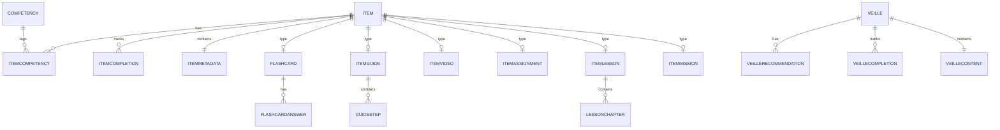

# 02 Items d'Apprentissage & Veille

**Version:** V1 Septembre 2026  
**Status:** 🟢 Spécification en cours  
**Effort estimé:** À confirmer après validation  
**Timeline:** Phase 2-3 (Semaine 3-6)

---

## 📖 Vue d'Ensemble

### Objectif Métier
Fournir une **gestion complète des contenus d'apprentissage** (13 types d'items) et une **plateforme de veille continue** (5 types de veille) permettant à la Learning Society de :
- Offrir des contenus variés adaptés aux styles d'apprentissage (micro-learning vs. lessons structurées vs. AFEST missions)
- Intégrer du contenu externe curé (Perplexity API) avec du contenu propriétaire (Dossiers, Mag, Tutoriels, Actualités)
- Permettre aux coaches de recommander des contenus spécifiques
- Assurer la qualité et la cohérence du contenu via validation admin

### Qui l'Utilise (Rôles)
- **Auteur** : Crée et publie des items (tous types learning + propriétaire veille)
- **Apprenant** : Consomme les items dans son parcours, découvre contenu veille recommandé
- **Coach** : Recommande contenu veille externe, guide apprenants sur items
- **Admin** : Valide contenu externe Perplexity, gère settings veille, archive items

### Scope — IN / OUT

#### ✅ IN (V1 Septembre 2026)

**Items Learning (13 types):**
- Astuces (quick tips)
- Flashcard (spaced repetition)
- Ressource (documents, liens)
- Guide (step-by-step)
- VideoConc (conception videos)
- VideoGeste (gesture/demo videos)
- Masterclass (expert sessions)
- Assignement (homework/tasks)
- Leçons (structured lessons)
- Mission Apprenantes (AFEST tasks)
- Projet Final (capstone projects)

**Items Veille (5 types):**
- Dossier (curated content bundles)
- Mag du mois (monthly digest)
- Tutoriel vidéo (video tutorials)
- Actu de la semaine (weekly updates)
- Contenu Perplexity (external API-sourced)

**Fonctionnalités:**
- Création/édition items (BO WordPress)
- Affichage items dans parcours (FO React)
- Validation contenu Perplexity (Admin BO)
- Recommandation veille par Coach
- Tagging compétences automatique (items learning)
- Versioning & historique items
- Soft-delete (archivage)

#### ❌ OUT (V2+)
- Marketplace contenu (V2)
- Recommandation IA items (V2 — requires Mistral ready)
- Auto-tagging veille (V2 — Mistral)
- Gamification items (levels, badges) — handled in Module 7
- Mobile app native (V2)

### Dépendances Critiques

**Dépend de:**
- **Cahier #1** (Parcours & Learning Space) : Items embedded dans étapes Learning Space
- **Passeport Compétences** : Tagging compétences, color-coding par niveau Dreyfus

**Bloque:**
- **Module 10** (Journal de Bord) : Peut référencer items/veille
- **Module 8** (Analytics) : Tracking consommation items

**Note:** Missions Apprenantes est maintenant intégrée dans ce cahier comme type d'item et subsystème pédagogique (voir section dédiée ci-dessous)

---

## 📱 Écrans à Concevoir

### Front-Office (React)

| Écran | Rôle | Description | Priorité |
|-------|------|-------------|----------|
| **Items Détail [Type X]** | Apprenant | Affichage spécifique par type (Flashcard quiz, Video player, Lesson steps, etc.) avec navigation par breadcrumb et retour contextuel (Learning Space, Parcours/Étape, Veille, URL direct). Comportement: breadcrumb affiche source + chemin; clic retour → retour contexte source avec état préservé (filtres Learning Space resetés, position scroll Parcours/Veille maintenue, timestamps navigation tracés) | P0 |
| **Veille Feed** | Apprenant | Timeline des items veille (Dossier, Mag, Tutoriel, Actu, Perplexity) avec filtres | P0 |
| **Item Recommendations** | Apprenant | Recommandations coach "Tu devrais lire/regarder cet item" | P1 |
| **Contenu Détail Perplexity** | Apprenant | Affichage article/contenu sourced Perplexity (avec source attribution) | P0 |

### Back-Office (WordPress Admin)

| Écran | Rôle | Description | Priorité |
|-------|------|-------------|----------|
| **Éditeur Item [Type X]** | Auteur | Formulaire création/édition spécifique à chaque type (13 éditeurs) | P0 |
| **Validation Perplexity** | Admin | Queue validation contenu Perplexity (titre, description, mapping compétences, déduplication check) | P0 |
| **Veille Settings** | Admin | Config Perplexity API (clé, fréquence sync, catégories sources, mappings compétences) | P0 |
| **Item Library** | Auteur | Liste tous items (filtrer par type, compétence, statut publication) | P0 |
| **Contenu Propriétaire** | Auteur | Gestion Dossier, Mag, Tutoriels, Actualités (CRUD complet) | P0 |

---

## ⚙️ Fonctionnalités (MVP V1)

### Core Learning Items

1. **Création Items Learning (13 types)** - Chaque type a sa propre interface éditeur avec champs spécifiques
   - Astuces : Titre + texte court + compétence(s) + durée
   - Flashcard : Question + réponses + compétence + explication
   - Ressource : Titre + URL/fichier + description + compétence
   - Guide : Titre + étapes ordonnées + images + compétence
   - VideoConc : Titre + URL video + transcription + compétence
   - VideoGeste : Titre + URL video + description geste + compétence
   - Masterclass : Titre + expert info + description + compétence
   - Assignement : Titre + description + compétence + deadline
   - Leçons : Titre + chapitres + contenu riche + compétence
   - Mission Apprenantes : Titre + objectif AFEST + compétence + deliverable
   - Projet Final : Titre + description + compétence + durée estimée

2. **Affichage Items Learning dans Parcours** - Items affichés dans la Learning Space/étapes avec comportement approprié au type
   - UX adaptée par type (quiz interactif pour Flashcard, video player pour VideoConc, etc.)
   - Tracking completion (read, watched, submitted)
   - Progress indicator

3. **Tagging Compétences (Items Learning)** - Auteur sélectionne compétences liées + niveau Dreyfus minimum
   - Auto-valide contre Passeport référentiel
   - Color-coding (🟢 Vert, 🟠 Orange, 🔴 Rouge)

4. **Versioning & Historique** - Tracking tous changements items (qui, quand, quoi)
   - Permet revert si besoin
   - Audit trail

### Core Veille

5. **Contenu Propriétaire Veille (4 types)** - Auteur crée/publie Dossier, Mag, Tutoriels, Actualités
   - Chaque type a ses propres champs (ex: Mag = éditorial + articles sélectionnés)
   - Scheduling publication
   - Compétences tagging optionnel

6. **Intégration Perplexity API** - Admin configure, système syncs contenu externe automatiquement
   - Fetch articles/content from Perplexity
   - Store in DB avec source attribution
   - Deduplication (pas doubles)
   - Auto-translate si besoin

7. **Validation Contenu Perplexity (Admin)** - Queue validation avant publish à apprenants
   - Vérifier contenu approprié + utile
   - Mapper compétences auto-tagging
   - Accept/reject workflow
   - Notifications approx queue

8. **Recommandation Veille par Coach** - Coach recommande un item veille à apprenant(s)
   - Message "Je te recommande de lire/regarder cet article"
   - Notification apprenant
   - Tracking si lu/ignoré

9. **Veille Feed Apprenant** - Timeline découverte contenu
   - Filtres par type (Dossier, Mag, Tutoriel, Actu, Perplexity)
   - Filtres par compétence
   - Search
   - Historique (lus, sauvegardés)

### Secondary

10. **Soft-delete Items** - Archivage au lieu suppression (data integrity)
11. **Bulk Operations** - Auteur peut publier/archiver items en masse
12. **Export Items** - CSV export de items library (analytics, backup)
13. **Notifications** - Apprenant notifié : nouvelle veille publiée, recommendation coach, assignment due

---

## 📚 Micro-Learning Resources (Missions Apprenantes Context)

### Overview
During mission execution, learners have access to contextual micro-learning resources (articles, tips, video links, documents) curated by coaches/admins. These resources are linked to missions via a simple tagging/linking system in the Back-Office. No AI-powered suggestions in MVP — just manual coach curation.

### Scope (MVP)
- ✅ Coach/Admin can link resources to missions (via BO interface / metabox)
- ✅ Learner sees available resources in mission sidebar/panel during execution
- ✅ Simple list of linked content (no AI ranking or smart suggestions)
- ✅ Resources types: Articles, PDFs, Video links, Tips, Guides
- ❌ AI-powered content matching (deferred to JIT Learning v2.0 / Cahier #20)
- ❌ Real-time suggestions based on learner progress
- ❌ Adaptive content sequencing
- ❌ Natural language search/discovery

### Implementation Model
- **Admin/Coach** : Selects pre-existing items (Astuce, Ressource, Guide, Video) from Item Library and links them to mission via metabox
- **Learner** : Sees sidebar "Ressources pour cette Mission" with linked items + link to access
- **Data Model** : Simple `mission_resources` junction table (mission_id, item_id, order_priority)

---

### User Journey #25 : Coach → Link Micro-Learning Resources to Mission

**Acteur :** Coach / Admin  
**Déclencheur :** Coach creates or edits a mission and wants to curate support resources  
**Objectif :** Attach relevant learning resources to help learners complete mission successfully

#### Étapes Détaillées

1. **Coach accesses mission editor in BO**
   - Navigates to "Missions" dashboard → selects mission or creates new
   - Affiche formulaire mission (titre, description, deliverables, etc.)
   - Feedback : Mission form loaded
   - Durée : Instant

2. **Coach scrolls to "Ressources pour Mission" metabox**
   - Metabox visible below main mission content
   - Label : "Ressources d'Aide (Optionnel) — Articles, guides, vidéos à disposition pendant la mission"
   - Feedback : Metabox visible with + button "Ajouter ressource"
   - Durée : Instant

3. **Coach clicks "+ Ajouter ressource"**
   - Opens modal / side-panel with searchable Item Library
   - Filters : Type (Astuce, Ressource, Guide, Video), Competency, Status (Published only)
   - Search : Title keyword search
   - Feedback : Modal lists matching items, coach can scroll/filter
   - Durée : ~1-2 min

4. **Coach selects resource item**
   - Clique item → Affiche preview (titre, description, type icon, competencies)
   - Clique "Ajouter à mission" button
   - Système ajoute item à junction table (mission_resources)
   - Feedback : Success toast "Ressource ajoutée"
   - Durée : ~30s

5. **Coach reorders resources (optional)**
   - Mission can have 3-8 linked resources (recommended 3-5)
   - Coach sees list of linked items with drag-drop reorder handles
   - Feedback : Live reorder, order_priority updates
   - Durée : ~1-2 min

6. **Coach publishes mission**
   - Clique "Publier mission"
   - Système valide : mission titre, description, deliverables (non-empty), at least 1 resource linked
   - Crée/updates mission record
   - Feedback : Success "Mission publiée"
   - Durée : ~500ms

#### Conditions de Succès ✅
- [x] Coach can search and find items by title/type/competency
- [x] Coach can add 1+ resources to mission (required)
- [x] Resources displayable as list (title + icon + competency tags)
- [x] Resources persist in DB with correct mission_id + order
- [x] Mission publication blocked if 0 resources (validation error: "Ajoutez au moins 1 ressource")
- [x] Learner sidebar shows linked resources (title, clickable link)

#### Erreurs & Edge Cases ❌

**Cas 1 : Coach tries to link archived/unpublished item**
- Scénario : Coach searches item library, finds old archived resource
- Comportement attendu :
  - Filter defaults to "Published" only (Archives hidden by default)
  - If coach manually includes archived, system prevents with warning : "Ressource archivée, impossible de lier"
- Feedback : Clear error message
- Impact : Prevent learners seeing dead links

**Cas 2 : Coach links same resource twice**
- Scénario : Accidentally adds same item twice to mission
- Comportement attendu :
  - System prevents duplicate (unique constraint on mission_id + item_id)
  - Warning : "Ressource déjà ajoutée à cette mission"
  - Item not added again
- Feedback : Toast warning
- Impact : Clean resource list, no duplicates

**Cas 3 : Learner accesses resource link during offline**
- Scénario : Learner clicks resource link but no internet
- Comportement attendu :
  - Link remains visible in sidebar
  - Click attempts to open → "Ressource indisponible (connexion perdue)"
  - Can retry once back online
- Feedback : Graceful error, retry option
- Impact : UX resilience

---

### User Journey #26 : Learner → Access Micro-Learning Resources During Mission

**Acteur :** Apprenant  
**Déclencheur :** Learner is executing mission and needs help/support  
**Objectif :** Quickly find and reference curated learning resources to complete mission successfully

#### Étapes Détaillées

1. **Learner starts mission**
   - Accepts mission → Affiche mission detail page with stepper (Préparation → Action → Analyse)
   - Mission sidebar visible with mission context (title, deliverables, deadline)
   - Feedback : Page loaded, mission step visible
   - Durée : ~1s

2. **Learner notices "Ressources pour cette Mission" panel**
   - Below mission context, collapsible panel : "📚 Ressources d'Aide (3 items)"
   - Panel shows :
     - Astuce : "Guide complet REST API" [icon]
     - Ressource : "PDF — Best Practices" [icon]
     - Video : "REST Basics 2min" [icon]
   - Feedback : List clear, clickable items with icons
   - Durée : Instant

3. **Learner clicks resource link**
   - Clique "Guide complet REST API"
   - Opens resource in new tab (or modal, depending on type)
     - Astuce : Opens inline detail + text
     - Ressource (PDF) : Opens PDF viewer / download link
     - Video : Opens video player (embedded)
   - Feedback : Smooth open, no page reload
   - Durée : ~500ms

4. **Learner consumes resource**
   - Reads article / watches video / downloads PDF
   - Contexte : Returns to mission tab to continue work
   - Feedback : Resource accessible, readable, player functional
   - Durée : 2-15 min (depends on resource)

5. **Learner continues mission**
   - Uses learned content to complete deliverables
   - Progresses through Action phase
   - Resources remain accessible throughout (panel always visible)
   - Feedback : Resource panel persistent, easy re-access
   - Durée : Variable

6. **Learner completes mission**
   - Submits deliverables → system validates
   - Moves to Analyse phase (FAST questionnaire)
   - Resources still accessible for reference during reflection
   - Feedback : Progress visible in stepper
   - Durée : ~500ms

#### Conditions de Succès ✅
- [x] Resources panel visible and not intrusive (collapsible if needed)
- [x] Learner can open resource link without leaving mission page
- [x] Resource displays correctly by type (PDF, video, article)
- [x] Back navigation to mission is smooth
- [x] Resources accessible throughout mission (Preparation → Action → Analysis)
- [x] Resource access tracked for analytics (optional metric: resource_opened, time_spent_on_resource)

#### Erreurs & Edge Cases ❌

**Cas 1 : Resource link broken / server down**
- Scénario : Learner clicks resource link, server timeout or 404
- Comportement attendu :
  - Attempt to open → show error toast : "Ressource indisponible momentanément. Réessayez ou contactez support."
  - Retry button provided
  - Mission NOT blocked (can continue without resource)
- Feedback : Graceful degradation
- Impact : Learner can proceed even if resource unavailable

**Cas 2 : Learner on slow connection**
- Scénario : Learner clicks PDF resource, internet slow
- Comportement attendu :
  - Loading spinner shown while fetching
  - If >10s, show "Chargement en cours..." with cancel option
  - Once loaded, display PDF
- Feedback : Transparent loading, no hang
- Impact : UX clarity

**Cas 3 : Resource is very large (10MB+ PDF)**
- Scénario : Coach links large document by mistake
- Comportement attendu :
  - BO upload validation : max 10MB warning shown to coach
  - Learner opens PDF → loads but slow
  - Browser can still handle (just takes longer)
- Feedback : Coach alerted during upload
- Impact : Encourage coach to optimize file sizes

---

## 🚀 Possible Évolutions (V2+)

### V2 (Octobre-Décembre 2026)
- **Recommandation IA items** : Mistral suggest best item type per apprenant
- **Auto-tagging veille** : Mistral auto-tags compétences articles Perplexity
- **Marketplace contenu** : Experts vendent leurs items (déféré)
- **Mobile apps** : React Native pour items consumption

### V3+ (2027+)
- **AI-generated items** : Mistral génère Astuces/Flashcards from lesson content
- **Peer content** : Apprenants partagent leurs items (community)

---

## 🎯 Missions Apprenantes (Apprentissage par l'Action Réfléchie)

### Philosophie & Architecture

Les **Missions Apprenantes** transforment les tâches de travail en apprentissage via une **double boucle pédagogique**:

1. **Boucle Préparatoire (RIEC — Ante-Action)**: Avant la tâche, installer l'apprentissage via questionnaire RIEC (Résultat, Indicateurs, Étapes, Coopération) pour conscientiser et sécuriser
2. **Boucle de Consolidation (FAST — Post-Action)**: Après la tâche, extraire la compétence acquise via questionnaire FAST (Faits, Analyse, Solutions, Transfert) pour métacognition
3. **Just-in-Time Learning (Pendant l'Action)**: Proposer ressources théoriques au moment exact où l'apprenant hésite

### 3 Tracks Utilisateur

#### Track 1: **Mission Intégrée (Matching Automatique)**
- Apprenant matché sur tâche car son passeport indique besoin ou opportunité
- Workflow: Cadrage (Manager RIEC) → Engagement (Apprenant) → Réalisation (avec JIT) → Bilan (FAST) → Validation (Manager)
- Impact: Compétences évoluent automatiquement au Passeport après validation

#### Track 2: **Lab d'Expertise (Upskilling Volontaire)**
- Expert lance défi pour valider niveau "Expert" (Dreyfus 5)
- Workflow: Défi créé → Co-construction RIEC → Action coachée (shadowing/chat) → Analyse croisée FAST avec feedback expert → Certification badge
- Impact: Certification formelle "Expert" avec preuve dans le Passeport

#### Track 3: **Bouton SOS (Apprentissage Réactif)**
- Apprenant bloque sur tâche classique, appelle à l'aide
- Workflow: Alerte SOS → Diagnostic express (micro-RIEC) → Intervention (contenu JIT ou expert) → Résolution → Ancrage (FAST ultra-court)
- Impact: Prévention blocages, capitalisation solutions

### Écrans par Profil

#### Apprenant (Interface "Focus")
- **Radar de Mission**: Stepper visuel [PRÉPARER (RIEC)] → [AGIR (TASK)] → [ANALYSER (FAST)]
- **Panneau Aide au Travail (JIT)**: Tiroir latéral avec fiches réflexes, vidéos 30s, bouton appel expert
- **Formulaire FAST**: 4 zones texte (F, A, S, T), V2 + dictée vocale + preuves multimédia

#### Manager/Coach (Interface "Vision & Coaching")
- **Heatmap Compétences**: Vue équipe montrant qui monte en compétence sur quelles missions
- **Éditeur RIEC**: Remplissage objectif (R, I) pour les missions assignées
- **Vue Feedback Double**: Affiche FAST apprenant + possibilité surligner et commenter (feedback pédagogique)
- **Bibliothèque Modèles Excellence**: Transformer excellent FAST en exemple type pour autres

#### Admin (Interface "Configuration")
- **Moteur de Règles**: Lier Compétence X → Tâche Y → Contenu Formation Z
- **Paramètres Workflow**: Configurer si FAST bloquant pour clôture tâche
- **Statistiques Impact**: Graphiques évolution Passeport Compétences entreprise

### Questionnaires Pédagogiques (Contenu Détaillé)

#### RIEC (Ante-Action) - Préparation
| Volet | Question | Objectif |
|-------|----------|----------|
| **R** — Résultat | "Quel est le résultat final attendu (produit/service)?" | Visualiser valeur finale et qualité |
| **I** — Indicateurs | "Quels signaux faibles/indices observer?" | Savoir en temps-réel si sur bonne voie |
| **E** — Étapes | "Quelles étapes pour le 'film' dans ta tête?" | Anticiper déroulé détaillé |
| **C** — Coopération | "Qui/quoi peut t'aider? Quoi enregistrer pour après toi?" | Identifier ressources + impact équipe |

#### FAST (Post-Action) - Métacognition
| Volet | Question | Objectif |
|-------|----------|----------|
| **F** — Faits | "Que s'est-il passé concrètement?" | Décrire réalité objective |
| **A** — Analyse | "Qu'a bien ou mal fonctionné?" | Critiquer action vs plan |
| **S** — Solutions | "Que faire différemment prochaine fois?" | Générer alternatives |
| **T** — Transfert | "Comment réutiliser dans autres situations?" | Généraliser apprentissage |

### Roadmap: V1 (MVP) vs V2

| Fonctionnalité | V1 (MVP Desktop) | V2 (Desktop + Mobile) |
|---|---|---|
| RIEC | Formulaire statique collaboratif | Saisie prédictive IA + vocale mobile |
| FAST | 4 champs texte | Preuves multimédia (photos/vidéos) |
| JIT | Bibliothèque PDF/Vidéo | Suggestions contextuelles IA |
| Passeport | Mise à jour manuelle validation | Mise à jour automatique + score XP |
| Notifications | Alertes simples | Push intelligentes + rappels |

### Intégration avec Passeport & Parcours

- **Lien Passeport**: Chaque mission apprenante est liée à 1+ compétences. Après validation FAST, la compétence du Passeport évolue (niveau Dreyfus peut augmenter selon rubrique FAST)
- **Lien Parcours**: Missions peuvent être optionnelles (Track 1 matching) ou obligatoires (Track 2 défi expert). Tracker completion au niveau étape.
- **Données Partagées**: UserID, CompetenceID, ParcoursID, EtapeID — même infrastructure que parcours + Learning Space

---

## 👥 User Journeys (Format 3)

### **User Journey #1 : Auteur → Crée une Astuce**

**Acteur :** Auteur (expert métier, contenu creator)  
**Déclencheur :** Auteur va dans BO → "Créer nouvel item" → sélectionne type "Astuce"  
**Objectif :** Créer et publier une astuce courte sur une compétence spécifique

#### Étapes Détaillées

1. **Auteur accède au formulaire création Astuce**
   - Clique "Nouvel item" → sélectionne "Astuce" dans dropdown type
   - Système affiche form vide avec champs : Titre, Texte, Compétence(s), Durée, Niveau Dreyfus minimum
   - Feedback : Form chargé instantanément, focus sur champ Titre
   - Durée : Instant

2. **Auteur remplit titre astuce**
   - Tape titre ex: "5 astuces pour déboguer en Python"
   - Système affiche counter "60/200 caractères"
   - Système auto-sauvegarde draft à chaque keystroke (debounce 2s)
   - Feedback : Real-time counter, green checkmark si valid length
   - Durée : ~30s

3. **Auteur remplit texte astuce**
   - Clique champ "Texte" → rich text editor (Markdown + formatting toolbar)
   - Tape contenu astuce (bullets, bold, links, etc.)
   - Système auto-sauvegarde draft
   - Feedback : WYSIWYG editor, live preview pane côté droit
   - Durée : ~2-5 min (dépend complexity)

4. **Auteur sélectionne compétence(s) liée(s)**
   - Clique field "Compétence" → dropdown avec recherche (filtre Passeport)
   - Cherche "Debugging" → résultats affichés avec niveau Dreyfus (1-5)
   - Sélectionne 1 ou plusieurs compétences
   - Chaque sélection affiche : compétence name + color badge (🟢/🟠/🔴)
   - Système valide chaque compétence existe dans Passeport référentiel
   - Feedback : Dropdown fluide, selected badges affichés, visual feedback
   - Durée : ~1 min

5. **Auteur spécifie durée & niveau minimum**
   - Remplit "Durée" : select entre "< 5 min", "5-10 min", "10+ min"
   - Remplit "Niveau minimum" : select Dreyfus 1-5 (apprenant doit avoir ce niveau pour astuce utile)
   - Système pré-remplit "Novice" par défaut
   - Feedback : Dropdowns clairs, descriptions (ex: "< 5 min = quick tip")
   - Durée : ~30s

6. **Auteur prévisualise avant publication**
   - Clique bouton "Aperçu" → modal affiche rendu final (ce que apprenant verra)
   - Vérifie formatting, titre, compétences color-coding
   - Peut retour à l'éditeur ("Revenir éditer") ou procéder publish
   - Feedback : Modal clean, ferme avec ESC ou bouton Close
   - Durée : ~1 min

7. **Auteur publie astuce**
   - Clique bouton "Publier" → système valide tous champs obligatoires
   - Si OK → crée item en DB avec status "Published", created_at timestamp
   - Système envoie webhook analytics (item created event)
   - Feedback : Toast "Astuce publiée ! Visible aux apprenants dès maintenant"
   - Durée : ~500ms

8. **Système affiche item published dans libraire**
   - Auteur redirigé vers item detail page
   - Affiche astuce published avec bouton "Éditer", "Archiver", "Partager"
   - Analytics : Item count +1, draft items -1
   - Feedback : Success page, copy-paste item link
   - Durée : Instant

#### Conditions de Succès ✅
- [x] Form validation : tous champs obligatoires présents avant publish
- [x] Draft auto-save toutes les 2s sans erreur
- [x] Compétence selected validée contre Passeport (no stale refs)
- [x] Item créé en DB avec created_by = auteur ID
- [x] Item visible dans Learning Space items list apprenant côté FO
- [x] Item affichable sans erreur (rendering spécifique Astuce)
- [x] Audit log enregistre création (qui, quand)

#### Erreurs & Edge Cases ❌

**Cas 1 : Auteur quitte sans sauvegarder**
- Scénario : Auteur remplit form, ferme navigateur sans cliquer "Publier"
- Comportement attendu :
  - Draft auto-sauvegardé en DB (status = "Draft")
  - Auteur retour BO → "Mes brouillons" list affiche l'astuce en "Draft"
  - Clique pour continuer édition
  - Message "Draft sauvegardé à [time]"
- Feedback : Banner "Brouillon automatiquement sauvegardé"
- Impact : No data loss, meilleure UX

**Cas 2 : Compétence sélectionnée disparaît du Passeport**
- Scénario : Astuce taguée "Python Debugging" (compétence ID 123), puis compétence supprimée du Passeport
- Comportement attendu :
  - Item restent publiés (backward compat)
  - Mais affichage = warning badge "Compétence archivée"
  - Admin notifié de stale ref
  - Auteur peut re-tagging nouvelle compétence
- Feedback : Warning icon + tooltip "Cette compétence n'existe plus"
- Impact : Pas cassé, mais needs cleanup

**Cas 3 : Auteur publie astuce identique (déduplication)**
- Scénario : Deux auteurs créent "5 astuces pour déboguer en Python"
- Comportement attendu :
  - Système détecte similarité titre (fuzzy match)
  - Warning "Astuce similaire existe déjà : [link]"
  - Auteur peut procéder ou merger content
- Feedback : Yellow banner before publish "Vérifiez pas de doublon"
- Impact : Qualité content (no duplicates)

**Cas 4 : Erreur upload image dans texte rich**
- Scénario : Auteur insère image > 5MB ou format pas supporté
- Comportement attendu :
  - Système rejette : "Max 5MB, formats : JPG, PNG, GIF"
  - Image pas insérée dans editor
  - Reste du contenu OK
- Feedback : Error toast + instruction "Redimensionnez l'image"
- Impact : Upload success rate

---

### **User Journey #2 : Auteur → Crée une Flashcard**

**Acteur :** Auteur  
**Déclencheur :** Auteur sélectionne type "Flashcard"  
**Objectif :** Créer quiz/flashcard pour spaced repetition

#### Étapes Détaillées

1. **Auteur accède au formulaire Flashcard**
   - Clique "Nouvel item" → "Flashcard"
   - Système affiche form avec champs : Titre, Question, Réponses (multi), Explication, Compétence(s), Niveau minimum
   - Feedback : Form vide, focus sur Titre
   - Durée : Instant

2. **Auteur remplit question & réponses**
   - Remplit "Question" : ex: "Qu'est-ce que REST ?"
   - Section "Réponses" : Auteur ajoute réponses (buttons "+ Ajouter réponse")
   - Réponse 1 : "Representational State Transfer" [COCHER] (correct answer)
   - Réponse 2 : "Real Time Evaluation Service"
   - Réponse 3 : "Resource Entity Sharing Tool"
   - Une SEULE réponse peut être marquée correcte (radio button)
   - Feedback : Ordre réponses peut être mélangé (réordonner avec drag-drop)
   - Durée : ~2-3 min

3. **Auteur ajoute explication (feedback correct/incorrect)**
   - Remplit "Explication" : ex: "REST est une architecture pour APIs où données représentées comme ressources..."
   - Affichée après apprenant répond
   - Peut inclure links, formatting
   - Feedback : Rich text editor (small, 500 chars)
   - Durée : ~2 min

4. **Auteur sélectionne compétences & niveau**
   - Même flow que Astuce (#1 step 4-5)
   - Tagging + niveau Dreyfus
   - Feedback : Visual color badges
   - Durée : ~1 min

5. **Auteur prévisualise flashcard**
   - Clique "Aperçu" → affiche card front (question) + réponses buttons
   - Clique une réponse → card flip affiche "Correct ! Explication : ..."
   - Peut essayer autres réponses
   - Feedback : Interactive preview, card flip animation
   - Durée : ~1-2 min

6. **Auteur publie flashcard**
   - Clique "Publier"
   - Système valide : question + ≥2 réponses + 1 réponse correcte + explication
   - Crée item en DB
   - Feedback : Success toast
   - Durée : ~500ms

#### Conditions de Succès ✅
- [x] Question & réponses non-vides
- [x] Exactement 1 réponse marquée correcte
- [x] Flashcard rendable côté FO (card flip work)
- [x] Explication affichée après réponse
- [x] Analytics track answer rate par réponse option

#### Erreurs & Edge Cases ❌

**Cas 1 : Auteur oublie marquer réponse correcte**
- Scénario : Crée flashcard 3 réponses, aucune cochée correcte
- Comportement attendu :
  - Warning "Sélectionnez la réponse correcte"
  - Bouton "Publier" disabled (red)
  - Focus champ "Réponses"
- Feedback : Clear error message
- Impact : Data quality (no broken flashcards)

**Cas 2 : Apprenant voit trop facile / trop difficile**
- Scénario : Flashcard niveau Dreyfus 1 mais contenu très complexe, vs niveau 5 très basique
- Comportement attendu :
  - Analytics track : % correct answers
  - Si <30% correct, Admin alert "Flashcard trop difficile ?"
  - Si >95% correct, Admin alert "Trop facile ?"
  - Auteur peut réviser
- Feedback : Dashboard metric (difficulty calibration)
- Impact : Content quality

---

### **User Journey #3 : Auteur → Crée une Ressource (Document/Lien)**

**Acteur :** Auteur  
**Déclencheur :** Auteur sélectionne type "Ressource"  
**Objectif :** Partager document, PDF, lien externe comme ressource

#### Étapes Détaillées

1. **Auteur accède formulaire Ressource**
   - Form champs : Titre, Description, Type ressource (PDF/Link/Document), URL ou upload, Compétence(s), Niveau min
   - Feedback : Clear radio buttons "Lien" vs "Upload fichier"
   - Durée : Instant

2. **Auteur choisit type ressource**
   - Option A : "Lien" → remplit URL (ex: https://rest-api-guide.com)
   - Option B : "Upload" → file picker (drag-drop supported)
   - Système valide URL format si lien
   - Système valide file format (PDF, DOCX, XLSX, PNG, etc.)
   - Feedback : URL validation real-time, file preview pour PDFs
   - Durée : ~30s-2 min

3. **Auteur ajoute titre & description**
   - Titre : "Guide complet REST API 2024"
   - Description : "Document officiel des meilleures pratiques REST avec examples"
   - Feedback : Preview sous-titre dans list view
   - Durée : ~1 min

4. **Auteur taggue compétences**
   - Même que flow précédent
   - Durée : ~1 min

5. **Auteur publie ressource**
   - Clique "Publier"
   - Système crée item + stocke URL ou fichier (S3 ou local)
   - Feedback : Toast "Ressource publiée"
   - Durée : ~500ms

#### Conditions de Succès ✅
- [x] URL validée (HTTPS, reachable)
- [x] Fichier stocké securely (access control)
- [x] Ressource accessible apprenant côté FO

#### Erreurs & Edge Cases ❌

**Cas 1 : URL cassée (404)**
- Scénario : Auteur link à site qui n'existe plus
- Comportement attendu :
  - Admin tool : "Vérifier links morts" — crawl tous resources URLs
  - Si 404 détecté → Admin notifié
  - Badge "⚠️ Lien cassé" affichée apprenant
  - Auteur peut update ou archiver
- Feedback : Health check status
- Impact : Link quality monitoring

---

### **User Journey #4 : Auteur → Crée un Guide (Step-by-Step)**

**Acteur :** Auteur  
**Déclencheur :** Auteur sélectionne type "Guide"  
**Objectif :** Créer guide structuré avec étapes ordonnées, screenshots

#### Étapes Détaillées

1. **Auteur accède formulaire Guide**
   - Form champs : Titre, Objectif, Étapes (ordered list), Compétence(s), Durée, Niveau min
   - Feedback : Étapes affichées comme table avec numéros auto-incrémentés
   - Durée : Instant

2. **Auteur crée structure étapes**
   - Clique "+ Ajouter étape" 5 fois
   - Chaque étape : numéro + titre + description + image optionnel
   - Ex: 
     - Étape 1 : "Ouvrir navigateur" + description + screenshot
     - Étape 2 : "Aller URL xyz" + description + screenshot
     - ...
   - Auteur peut drag-drop réordonner étapes
   - Feedback : Live reordering, numbers auto-update
   - Durée : ~5-10 min

3. **Auteur rempli images/screenshots**
   - Pour chaque étape, optionnel upload image
   - Drag-drop ou file picker
   - Système resize/optimize images
   - Feedback : Image preview inline
   - Durée : ~5-10 min (si images)

4. **Auteur taggue compétences**
   - Même flow
   - Durée : ~1 min

5. **Auteur publie guide**
   - Clique "Publier"
   - Validation : titre + ≥2 étapes
   - Crée item en DB
   - Feedback : Toast "Guide publié"
   - Durée : ~500ms

#### Conditions de Succès ✅
- [x] Étapes affichées dans ordre correct côté FO
- [x] Images chargent sans erreur
- [x] Apprenant peut naviguer étapes (prev/next buttons)

---

### **User Journey #5 : Auteur → Crée une VideoConception**

**Acteur :** Auteur  
**Déclencheur :** Auteur sélectionne type "VideoConc"  
**Objectif :** Publier vidéo de conception/explication (avec transcription)

#### Étapes Détaillées

1. **Auteur accède formulaire VideoConc**
   - Form champs : Titre, Description, URL video (YouTube/Vimeo/custom), Transcription, Compétence(s), Durée vidéo (auto-detect), Niveau min
   - Feedback : URL input avec validation
   - Durée : Instant

2. **Auteur remplit URL video**
   - Paste YouTube/Vimeo link
   - Système valide + embed iframe
   - Fetch metadata : titre, duration, thumbnail (override si besoin)
   - Feedback : Video preview inline + duration detected "22 min 14 sec"
   - Durée : ~1 min

3. **Auteur ajoute transcription (optionnel)**
   - Textarea pour transcription complète (ou auto-fetched si YouTube caption)
   - Permet search dans transcription + highlighting
   - Feedback : Character counter
   - Durée : ~5-30 min (dépend auto vs manual)

4. **Auteur taggue compétences & publie**
   - Same as before
   - Durée : ~2 min total

#### Conditions de Succès ✅
- [x] Video embeds correctement (player functional)
- [x] Transcription searchable côté FO

---

### **User Journey #6 : Auteur → Crée une VideoGeste**

Similaire à VideoConc mais pour demo/gesture videos (même flow, différent contexte).

---

### **User Journey #7 : Auteur → Crée une Masterclass**

**Acteur :** Auteur/Expert  
**Déclencheur :** Auteur sélectionne type "Masterclass"  
**Objectif :** Créer session expert interactive

#### Étapes Détaillées

1. **Auteur accède formulaire Masterclass**
   - Champs : Titre, Expert bio, Description, Date/Time (ou "on demand"), Duration, Compétences, Niveau min, Meeting link (Zoom/Meet)
   - Feedback : Date picker pour scheduling
   - Durée : Instant

2. **Auteur remplit expert info**
   - Nom expert, bio, photo, credentials
   - Feedback : Profile card preview
   - Durée : ~1 min

3. **Auteur sélectionne meeting platform**
   - Radio buttons : Google Meet / Zoom / On-Demand (vidéo recorded)
   - Si live : paste meeting link
   - Si on-demand : upload vidéo
   - Feedback : Link validation
   - Durée : ~1 min

4. **Auteur taggue compétences & publie**
   - Durée : ~2 min

#### Conditions de Succès ✅
- [x] Meeting link reachable (validation)
- [x] Live masterclass : Apprenant reçoit reminder J-1
- [x] Recording stocké et accessible post-session

---

### **User Journey #8 : Auteur → Crée un Assignement (Devoir)**

**Acteur :** Auteur (Coach/Manager)  
**Déclencheur :** Auteur sélectionne type "Assignement"  
**Objectif :** Créer devoir/tâche pour apprenant avec deadline

#### Étapes Détaillées

1. **Auteur accède formulaire Assignement**
   - Champs : Titre, Description, Deadline, Compétence(s), Evaluation criteria, Niveau min
   - Feedback : Date picker pour deadline
   - Durée : Instant

2. **Auteur remplit description & criteria**
   - Description : "Réalisez une présentation 10 min sur sujet X"
   - Criteria : Checklist d'évaluation (ex: "Présentation <10 min", "Couvre points A, B, C", etc.)
   - Feedback : Criteria affichées comme checklist
   - Durée : ~2 min

3. **Auteur définit deadline**
   - Date picker : ex: "15 mai 2026, 23h59"
   - Système envoie reminder apprenant J-1 et J day
   - Feedback : Countdown affichée "Due in 5 days"
   - Durée : ~30s

4. **Auteur taggue compétences & publie**
   - Durée : ~2 min

#### Conditions de Succès ✅
- [x] Assignement affichée dans parcours avec deadline badge
- [x] Apprenant peut soumettre (upload file ou text)
- [x] Coach notifié "New submission"

---

### **User Journey #9 : Auteur → Crée une Leçon EDRA (Structured Lesson)**

⚠️ **NOTE SPÉCIALE :** Le type "Leçon" est **unique** parmi les 13 types d'items car il est soumis au modèle pédagogique **EDRA** (Engagement-Découverte-Réflexion-Activité). Les 4 phases sont **obligatoires et séquentielles** pour les phases E, D, R. Phase A (Activité) est optionnelle.

**Acteur :** Auteur  
**Déclencheur :** Auteur sélectionne type "Leçon"  
**Objectif :** Créer leçon structurée suivant modèle EDRA avec 4 phases pédagogiques, validation quiz phase D, et réflexion phase R

#### Étapes Détaillées

1. **Auteur accède formulaire Leçon (Sélection modèle EDRA)**
   - Interface affiche : "Type EDRA — Structure à 4 phases"
   - Metabox 1 : Phase E (Engagement)
   - Metabox 2 : Phase D (Découverte) + Quiz obligatoire
   - Metabox 3 : Phase R (Réflexion)
   - Metabox 4 : Phase A (Activité) — optionnel
   - Système affiche note : "Phases E, D, R obligatoires. Phase A optionnelle."
   - Champs communs : Titre, Objectif global, Compétence(s), Durée estimée, Niveau min
   - Feedback : Interface EDRA-specific (4 sections visibles, phases en couleur E=bleu, D=vert, R=orange, A=jaune)
   - Durée : Instant

2. **Auteur remplit Phase E — Engagement (Problématisation)**
   - Metabox `_lesson_phase_e_content` (WYSIWYG + image optionnel)
   - Contenu : 1 segment unique présentant problème/défi concret lié à pratique apprenant
   - Exemple : "Vous gérez une équipe hétérogène avec niveaux différents. Comment adapter votre management ?"
   - Objectif : Créer curiosité, justifier apprentissage à venir
   - Système valide : Contenu non vide, <500 mots recommandé
   - Feedback : Character count, preview
   - Durée : ~2-5 min

3. **Auteur remplit Phase D — Découverte (Apports & Validation)**
   - **3a. Structure segments découverte**
     - Metabox `_lesson_phase_d_segments` (Repeater)
     - Auteur clique "+ Ajouter segment" (D1, D2, D3, ...)
     - Chaque segment : numéro auto-incrémenté + contenu WYSIWYG + audio URL optionnel (MP3/OGG)
     - Segments progressifs (D1 : concept basique, D2 : approfondissement, D3 : application)
     - Feedback : Live segment numbering, audio preview
     - Durée : ~10-20 min (dépend nombre segments)
   
   - **3b. Ajoute contenu segments**
     - Texte + images (PAS vidéo en MVP)
     - Rich editor markdown + formatting
     - Système valide : Chaque segment 1000-3000 mots recommandé
     - Feedback : WYSIWYG, word count per segment
     - Durée : ~30-60 min (dépend densité)
   
   - **3c. Ajoute audio optionnel par segment**
     - Pour chaque segment, upload MP3/OGG optionnel
     - URL field : `segment_audio_url`
     - Système valide format + accessibility
     - Feedback : Audio player preview
     - Durée : ~5-10 min (si audio)
   
   - **3d. Crée QUIZ OBLIGATOIRE phase D**
     - Metabox `_lesson_quiz_questions` (Repeater : 7 questions)
     - Auteur crée 7 questions pool en BO
     - Format mélange QCM + Vrai/Faux
     - Chaque question : `question_text`, `question_type` (enum: qcm / vrai_faux), `options` (array pour QCM), `correct_answer` (integer index)
     - **CRITIQUE :** Système affichera seulement 3 questions aléatoires au FO (3 parmi 7)
     - Apprenant doit obtenir 3/3 (100%) pour passer à phase R
     - Tentatives : Illimitées par défaut (configurable, champ `_lesson_max_quiz_attempts`)
     - Réponses enregistrées en BDD : UserID, LeçonID, QuestionID, responses, timestamp
     - Feedback : Quiz builder modal, preview des 3 questions affichées
     - Durée : ~10-15 min (7 questions)
   
   - Durée totale phase D : ~60-90 min

#### Conditions de Succès Phase D ✅
- [x] Phase D contient ≥1 segment découverte (S1)
- [x] Quiz phase D contient exactement 7 questions (pool BO)
- [x] Format quiz = mélange QCM + Vrai/Faux
- [x] Quiz responses enregistrées en BDD (UserID, LeçonID, QuestionID, timestamp)

4. **Auteur remplit Phase R — Réflexion (Ancrage & Journal de Bord)**
   - Metabox `_lesson_phase_r_questions` (Repeater : questions ouvertes)
   - Auteur crée 3-5 questions réflexives ouvertes
   - Chaque question : `question_text`, `question_type` (enum: open_text / structured)
   - Objectif : Apprenant projette acquis théoriques dans contexte pratique personnel
   - Exemples questions : 
     - "Comment appliquez-vous ce concept dans votre rôle actuel ?"
     - "Quel est l'obstacle principal que vous anticipez ?"
     - "Définissez un premier pas action pour cette semaine"
   - Système valide : Contenu non vide
   - Feedback : Question editor, preview
   - Durée : ~5-10 min
   - **Important :** Réponses apprenants enregistrées en BDD (UserID, LeçonID, question_id, texte brut ou JSON, timestamp)

#### Conditions de Succès Phase R ✅
- [x] Phase R contient ≥1 question réflexive
- [x] Réponses apprenants enregistrées en BDD
- [x] Intégration optionnelle tls-journal-reflexif documentée (si apprenant veut sauver dans Journal)

5. **Auteur remplit Phase A — Activité (Pratique OPTIONNEL)**
   - Metabox `_lesson_phase_a_content` (WYSIWYG optionnel)
   - Si auteur souhaite ajouter exercice/pratique : checkbox `_lesson_has_activity` (Boolean)
   - Si oui : Contenu exercice (simulation, cas pratique, exercice guidé)
   - Optionnel : Checkbox `_lesson_activity_requires_correction` si besoin correction par coach
   - Si correction nécessaire : Lien tls-corrections plugin (pas détails ici)
   - **CRITIQUE :** Si Phase A absente, système n'affiche PAS d'erreur ni section vide (purement optionnel)
   - Feedback : Phase A section grisée si non activée
   - Durée : ~10-20 min (si présente)

#### Conditions de Succès Phase A ✅
- [x] SI phase A présente : contenu non vide + exercice clair
- [x] SI phase A absente : aucune erreur validation, leçon peut être publiée

6. **Auteur taggue compétences & valide publication**
   - Select compétences : mapping vers Passeport
   - Système valide : E + D + R complètes, quiz 7 questions présent, phase A absence ne bloque pas
   - Feedback : Validation checklist
   - Durée : ~2 min

#### Conditions de Succès Globales ✅
- [x] Leçon EDRA ne peut être publiée que si E + D + R complètes
- [x] Phase D quiz = 7 questions BO, 3 aléatoires FO, 3/3 requis pour progression
- [x] Apprenant bloqué après D jusqu'à 3/3 quiz, puis accès R
- [x] Phase A absent = aucune erreur/section vide, publication autorisée
- [x] Quiz responses + Phase R responses enregistrées en BDD
- [x] Leçon affichée en FO avec sequencing phases (E → D+quiz → R → A si présente)
- [x] Templates rédaction Notion à jour avant publication

#### Erreurs & Edge Cases ❌

**Cas 1 : Auteur crée phase D sans quiz**
- Scénario : Auteur remplit D1, D2, D3 mais oublie ajouter 7 questions quiz
- Comportement attendu :
  - Système bloque publication : "Quiz phase D obligatoire (7 questions minimum)"
  - Affiche toast rouge : "⚠️ Phase D incomplète"
  - Highlight metabox quiz en rouge
  - Bouton "Publish" désactivé
- Feedback : Error message clair, guide vers correction
- Impact : Validation stricte prévient leçons sans validation

**Cas 2 : Quiz phase D avec <7 questions ou >7 questions**
- Scénario : Auteur crée 5 questions seulement
- Comportement attendu :
  - Système affiche : "Besoin exactement 7 questions (pool BO)"
  - Counter : "5/7 questions"
  - Bouton "+ Ajouter question" active jusqu'à 7
  - Si auteur essaie >7 : bouton "+ Ajouter" désactivé
- Feedback : Live counter, validation stricte
- Impact : Assure qualité quiz et variance

**Cas 3 : Apprenant échoue quiz (obtient 2/3 au lieu 3/3)**
- Scénario : Apprenant répond mal, obtient 66% au lieu 100%
- Comportement attendu :
  - Toast rouge : "Quiz non validé (3/3 requis)"
  - Bouton "Continuer à phase R" désactivé
  - Bouton "Refaire quiz" offert (nombre tentatives = config `_lesson_max_quiz_attempts`)
  - Par défaut : illimitées
  - Apprenant peut refaire quiz, 3 nouvelles questions aléatoires (des 7)
  - Réponse précédente enregistrée en BDD
- Feedback : Clear messaging, retry loop transparent
- Impact : Validation pédagogique garantie

**Cas 4 : Phase A absente — vérifier aucun problème UX**
- Scénario : Leçon avec E + D + R mais pas Phase A
- Comportement attendu :
  - FO affiche : E → D (+ quiz) → R
  - Aucune section vide "Phase A"
  - Aucun message "Phase A manquante"
  - Leçon publication autorisée
  - Analytics ne track pas "Phase A" si absente
- Feedback : UX fluide, pas d'artefacts UI
- Impact : Phase A vraiment optionnel, aucun UX friction

**Cas 5 : Apprenant veut sauver réponses phase R dans Journal**
- Scénario : Phase R integre optionnellement tls-journal-reflexif plugin
- Comportement attendu :
  - Après réponse R, widget : "💾 Sauver réponses dans mon Journal réflexif ?"
  - Si oui : Copie réponses R → tls-journal-reflexif entry
  - Si non : Réponses restent juste en BDD ItemLesson
  - Link bidirectionnel documenté dans cahier plugin integration
- Feedback : Optionnel, non-intrusive
- Impact : Intégration pédagogique claire

---

### **User Journey #11 : Auteur → Crée une Mission Apprenante (AFEST Task)**

**Acteur :** Auteur/Manager  
**Déclencheur :** Auteur sélectionne type "Mission Apprenante"  
**Objectif :** Créer mission pratique AFEST avec livrables

#### Étapes Détaillées

1. **Auteur accède formulaire Mission Apprenante**
   - Champs : Titre, Objectif, Contexte, Compétence(s), Durée estimée, Livrables attendus, Niveau min, RIEC/FAST questionnaire (optionnel)
   - Feedback : Mission builder interface
   - Durée : Instant

2. **Auteur remplit objectif & contexte**
   - Objectif : "Implémenter feature X en production"
   - Contexte : Description contexte projet
   - Compétences : Select compétences (ex: Git, Python, Code review)
   - Feedback : Visual feedback
   - Durée : ~2 min

3. **Auteur définit livrables attendus**
   - Multi-checkbox : "Code en Git", "Pull request reviewed", "Tests >80%", "Documentation", etc.
   - Apprenant doit cocher tous livrables pour "complete"
   - Feedback : Checklist visible apprenant
   - Durée : ~2 min

4. **Auteur optionnel ajoute RIEC/FAST questionnaire**
   - Checkbox "Inclure questionnaire réflexif ?"
   - Si oui : 4-5 questions auto-remplissage RIEC/FAST
   - Apprenant répond post-mission
   - Feedback : Questionnaire builder
   - Durée : ~5 min (optionnel)

5. **Auteur publie mission**
   - Durée : ~2 min

#### Conditions de Succès ✅
- [x] Mission affichée dans parcours avec deliverables checklist
- [x] Apprenant peut marquer livrables complete
- [x] RIEC/FAST questionnaire envoyé post-completion
- [x] Auto-update Passeport avec réponses questionnaire

---

### **User Journey #12 : Auteur → Crée un Projet Final (Capstone)**

Similar à Mission Apprenante mais plus long, multi-phase, avec évaluation.

---

### **User Journey #13 : Auteur → Crée un Dossier (Proprietary Veille)**

**Acteur :** Auteur/Curator (Learning Society)  
**Déclencheur :** Auteur sélectionne type "Dossier" (veille)  
**Objectif :** Créer curated content bundle (articles sélectionnés)

#### Étapes Détaillées

1. **Auteur accède formulaire Dossier**
   - Champs : Titre, Éditorial intro, Articles sélectionnés (multi-select), Compétence(s), Niveau min, Published date
   - Feedback : Article selector avec search
   - Durée : Instant

2. **Auteur remplit éditorial**
   - Rich text : intro texte (pourquoi ce dossier, quoi apprendre, etc.)
   - Feedback : Preview
   - Durée : ~2 min

3. **Auteur sélectionne articles**
   - Clique "+ Ajouter article" → modal list articles (filtrés par compétence ou search)
   - Sélectionne N articles (ex: 5-10)
   - Drag-drop pour ordonner
   - Feedback : Visual list, preview chaque article
   - Durée : ~5-10 min

4. **Auteur taggue compétences & publie**
   - Durée : ~2 min

#### Conditions de Succès ✅
- [x] Dossier affichée comme "card" dans Veille feed
- [x] Apprenant peut lire éditorial + tous articles du dossier
- [x] Analytics track : dossier opened, articles read

---

### **User Journey #14 : Auteur → Crée Mag du Mois**

Similaire à Dossier mais format magazine monthly.

---

### **User Journey #15 : Auteur → Crée Tutoriel Vidéo (Veille)**

Similaire à VideoConc mais contexte "veille content sourcing".

---

### **User Journey #16 : Auteur → Crée Actualité Semaine**

Similaire à Dossier mais weekly news format.

---

### **User Journey #17 : Admin → Valide Contenu Perplexity**

**Acteur :** Admin  
**Déclencheur :** Nouveau contenu Perplexity dans queue validation  
**Objectif :** Vérifier qualité et mapper compétences avant publication

#### Étapes Détaillées

1. **Admin accède Dashboard Perplexity Validation**
   - Affiche queue : "3 nouveaux articles en attente validation"
   - List : article titre + source + date sourced + status (pending/approved/rejected)
   - Feedback : Queue interface, sorted par date
   - Durée : Instant

2. **Admin examine article détail**
   - Clique article → affiche :
     - Titre + description
     - Contenu preview (première 500 chars)
     - Source attribution (ex: "Forbes article by John Smith")
     - Detected compétences (AI-tagged, optionnel)
   - Buttons : "Approuver", "Rejeter", "Re-tag compétences"
   - Feedback : Side panel, lis contenu complet si besoin
   - Durée : ~2-5 min per article

3. **Admin valide qualité article**
   - Vérifie : contenu approprié, utile, pas marketing
   - Si OK → "Approuver"
   - Si problème → "Rejeter" + message (ex: "Trop promotionnel")
   - Feedback : Clear approve/reject buttons
   - Durée : ~2 min

4. **Admin remappes compétences si besoin**
   - Clique "Re-tag compétences" → modal selector
   - Sélectionne compétences liées (multi-select)
   - Système pré-suggests based AI-tagging
   - Admin peut accept ou override
   - Feedback : Search + visual badges
   - Durée : ~1 min

5. **Admin approuve article**
   - Article move from "pending" → "published"
   - Système envoie item à apprenants (veille feed)
   - Analytics : item created event
   - Feedback : Toast "Article publié"
   - Durée : ~500ms

#### Conditions de Succès ✅
- [x] Article affiche côté FO dans Veille feed
- [x] Compétences correctement taggées
- [x] Source attribution visible apprenant
- [x] Rejected articles archivées (not deleted)

#### Erreurs & Edge Cases ❌

**Cas 1 : Article text contient copyright issues**
- Scénario : Contenu copié verbatim du source, pas paraphrasé
- Comportement attendu :
  - System détecte (plagiarism check tools)
  - Warning : "Copyright risk détecté"
  - Admin peut accept if source attributed, ou reject
- Feedback : Orange warning banner
- Impact : Legal compliance

---

### **User Journey #18 : Coach → Recommande Contenu Veille**

**Acteur :** Coach  
**Déclencheur :** Coach veut recommander un article/dossier à apprenant(s)  
**Objectif :** Envoyer recommandation personnalisée avec contexte

#### Étapes Détaillées

1. **Coach accède Recommandation interface**
   - FO : Dans Veille feed ou item détail, clique bouton "Recommander"
   - Ou BO : Dashboard Coach → "Recommander contenu"
   - Feedback : Modal "Recommander à qui ?"
   - Durée : Instant

2. **Coach sélectionne apprenants cible**
   - Dropdown multi-select apprenants (search by name)
   - Ou "Tous mes apprenants"
   - Ou "Apprenants ayant besoin [Compétence X]"
   - Feedback : Selected list, count
   - Durée : ~1 min

3. **Coach ajoute message personnalisé**
   - Textarea : "Je te recommande cet article car ..."
   - Optionnel : deadline pour lire (date picker)
   - Feedback : Character counter
   - Durée : ~1 min

4. **Coach envoie recommandation**
   - Clique "Envoyer"
   - Système crée recommendations records en DB
   - Système envoie push notification/email à apprenants
   - Feedback : Toast "Recommandé à 5 apprenants"
   - Durée : ~500ms

5. **Apprenant reçoit notification**
   - "Coach [name] te recommande de lire : [article]"
   - Clique → ouvre article détail
   - Apprenant peut mark as "read" ou "ignore"
   - Feedback : Notification badge + link
   - Durée : Depends apprenant

#### Conditions de Succès ✅
- [x] Tous apprenants sélectionnés reçoivent notification
- [x] Recommandation affiche dans apprenant's feed avec badge "Coach recommendation"
- [x] Analytics track : recommendations sent, read rate

---

### **User Journey #19 : Apprenant → Découvre Veille Feed**

**Acteur :** Apprenant  
**Déclencheur :** Apprenant navigue vers section "Veille" ou reçoit notification veille  
**Objectif :** Découvrir et consommer contenu veille (propriétaire + Perplexity)

#### Étapes Détaillées

1. **Apprenant accède Veille feed**
   - FO menu : "Veille" → affiche timeline contenu (newest first)
   - Affiche mix : Dossier, Mag, Tutoriel, Actu, Articles Perplexity
   - Cards : image + titre + source + date + compétence badges
   - Feedback : Responsive grid, pagination ou infinite scroll
   - Durée : Instant

2. **Apprenant filtre contenu**
   - Filter buttons : "Tous", "Dossiers", "Mag", "Tutoriels", "Actu", "Perplexity"
   - Ou filtre par compétence (dropdown)
   - Or search par titre/keywords
   - Feedback : Real-time filter update
   - Durée : ~30s

3. **Apprenant clique article intéressé**
   - Clique card → ouvre article détail
   - Affiche : titre + source attribution + contenu principal + lien externe (si applicable)
   - Buttons : "Marquer comme lu", "Sauvegarder", "Partager"
   - Feedback : Smooth navigation
   - Durée : ~1 sec

4. **Apprenant lit/consomme contenu**
   - Lit article (optionnel : scroll tracking)
   - Peut retourner feed ("< Retour veille")
   - Peut voir "Articles similaires" suggestions (optionnel V2)
   - Feedback : Reading time estimate ("5 min read")
   - Durée : 5-60 min (dépend article)

5. **Apprenant marque comme lu**
   - Clique "Marquer comme lu" → item archivé dans history
   - Notification Coach (analytics)
   - Feedback : Checkmark badge, removed from "unread"
   - Durée : Instant

6. **Apprenant sauvegarde pour later**
   - Clique "Sauvegarder" → item ajouté à collection "Mes sauvegardes"
   - Optionnel : ajouter note personnelle
   - Feedback : Toast "Sauvegardé"
   - Durée : Instant

#### Conditions de Succès ✅
- [x] Feed charge <2s
- [x] Filtering smooth
- [x] Articles readable (layout responsive)
- [x] Read history tracked

#### Erreurs & Edge Cases ❌

**Cas 1 : Apprenant accède Perplexity article → lien cassé**
- Scénario : Apprenant clique "Lire l'article complet" → 404 externe
- Comportement attendu :
  - Affiche message "Source n'est plus disponible"
  - Suggest contenu alternatif (articles similaires)
  - Admin notifié (link health check)
- Feedback : Error message clair
- Impact : Source availability monitoring

---

### **User Journey #20 : Apprenant → Consomme Item dans Parcours**

**Acteur :** Apprenant  
**Déclencheur :** Apprenant ouvre item (type Learning Space) dans parcours  
**Objectif :** Consommer item adapté au type (flashcard quiz vs video vs assignment)

#### Étapes Détaillées

1. **Apprenant navigue vers item dans parcours**
   - FO : Affiche parcours → sélectionne étape → items list dans learning space
   - Item affichée avec icon (type-specific : 📝 Astuce, 🎥 Vidéo, etc.)
   - Item badges : durée, compétence, niveau Dreyfus
   - Clique item → ouvre détail
   - Feedback : Instant load
   - Durée : ~30s-1 min navigation

2. **Item affichée selon type (type-specific rendering)**

   **Si Astuce :**
   - Texte formaté + images
   - "Durée : 3 min" + checkmark "Marquer comme lu"
   - Feedback : Instant read
   - Durée : ~3 min

   **Si Flashcard :**
   - Card front affiche question + 3-4 boutons réponse
   - Apprenant clique réponse → card flip
   - Feedback : "Correct ! Explication : ..." (green) ou "Incorrect" (red + correct answer shown)
   - Peut retry
   - Durée : ~1-2 min

   **Si Ressource :**
   - Link ou embedded document
   - Clique → ouvre externe ou viewer
   - Feedback : "Ouvert dans nouvel onglet"
   - Durée : Depends contenu

   **Si Vidéo :**
   - Embedded player (YouTube/Vimeo/custom)
   - Transcription optionnel (searchable)
   - Controls : play, pause, subtitle, speed
   - Feedback : Fluid video player
   - Durée : vidéo duration

   **Si Assignement :**
   - Description + deadline badge
   - Button "Soumettre travail"
   - Clique → upload file ou text editor
   - Feedback : "Remis avec succès"
   - Durée : depends assignment work

3. **Apprenant marque item complet**
   - Button "Marquer comme complété"
   - Système enregistre completion status
   - Système unlock prochain item (si préreq met)
   - Feedback : ✅ checkmark, "Étape X prochain disponible"
   - Durée : Instant

4. **Apprenant progresse parcours**
   - Progress bar update : "Étape 3 of 5 complète"
   - Feedback : Visual progress
   - Durée : Instant

#### Conditions de Succès ✅
- [x] Item affiche correctement (rendering by type)
- [x] Completion tracked en DB
- [x] Prochain item unlock if ready
- [x] XP awarded (if applicable, Module 7)

---

### **User Journey #21 : Apprenant → Consomme Item & Navigation Retour (Breadcrumbs)**

**Acteur :** Apprenant  
**Déclencheur :** Apprenant accède à un item depuis différentes sources (Learning Space, Parcours, Veille, URL direct)  
**Objectif :** Consommer item avec navigation breadcrumb et retour contexuel vers source, préservant l'état approprié

#### Étapes Détaillées

1. **Apprenant accède item depuis Learning Space**
   - FO : Dashboard → "Tous les items" section
   - Affiche grille/liste items avec filtres actifs (type, compétence, niveau)
   - Clique item card → navigation vers Item Detail page
   - Système enregistre : `source_context = "learning_space"`, `source_id = null`, `previous_page_state = {filters: {...}, scroll_position: Y}`
   - Feedback : Page charge item detail, breadcrumb visible au top : "Accueil > Tous les items > [Item Title]"
   - Durée : ~1s load

2. **Apprenant consomme item selon type**
   - Item detail page affichée (type-specific rendering : Astuce, Flashcard, Video, etc.)
   - Navigation buttons : "Marquer complet", "Ajouter favori", "Partager"
   - Item affiche contenu full
   - Feedback : Smooth rendering, content loaded
   - Durée : 2-15 min (depends item type)

3. **Apprenant voit breadcrumb + bouton retour contexuel**
   - Breadcrumb en haut : "Accueil > Tous les items > [Item Title]"
   - Clic "Tous les items" OR bouton "< Retour" → retour Learning Space
   - Système applique : `previous_page_state` restauré (filtres remis, scroll position restauré)
   - Feedback : Instant retour, page état preserved
   - Durée : Instant

#### ÉTAPES DÉTAILLÉES — 4 CAS D'ACCÈS

##### **Cas A : Apprenant accède depuis Learning Space (filtres+scroll)**
   - Source context : `source_context = "learning_space"`
   - Item detail breadcrumb : "Accueil > Tous les items > [Item Title]"
   - Clic retour :
     - Retour Learning Space
     - Filtres réappliqués (ex: "Type: Astuce, Compétence: Python")
     - Scroll position restauré (back to previous Y offset)
     - Item card highlighting (visual indicator apprenant revient d'où)
   - Edge case : Si filtres changés en arrière-plan → warn "Filtres mis à jour"

##### **Cas B : Apprenant accède depuis Parcours/Étape (lesson step locked)**
   - Source context : `source_context = "parcours"`, `source_id = lesson_step_id`
   - Item detail breadcrumb : "Mon Parcours > [Parcours Name] > [Étape Name] > [Item Title]"
   - Clic retour :
     - Retour Parcours/Étape page
     - Scroll position préservé (top of étape items list)
     - Si item en "STRICT" mode (must complete before next) :
       - Système vérifie completion status
       - Si complété → unlock next étape button visible
       - If not → "À compléter pour déverrouiller suivant"
     - Next/Prev navigation : Buttons "< Item Précédent" et "Item Suivant >" disponibles (within same étape leçons only)

##### **Cas C : Apprenant accède depuis Veille Feed (articles, dossiers)**
   - Source context : `source_context = "veille"`, `source_veille_type = "Mag" | "Dossier" | "Tutoriel" | etc.`
   - Item detail breadcrumb : "Veille > [Veille Type] > [Item Title]"
   - Clic retour :
     - Retour Veille feed
     - Marquer automatiquement comme "lu" (tracking event)
     - Scroll position preserved (back to article position in feed)
     - Next/Prev navigation : "< Article Précédent" et "Article Suivant >" (within same veille collection only)

##### **Cas D : Apprenant accède via URL directe (email, partage, lien sauvegardé)**
   - Source context : `source_context = null` (direct access)
   - Système détecte source par referrer header :
     - Si referrer = mail domain → assume "email discovery"
     - Si referrer = internal shared link → assume "shared by coach"
     - Si referrer = null/unknown → default fallback
   - Item detail breadcrumb : "Accueil > [Item Title]" (simple, no context breadcrumb)
   - Clic retour :
     - Option 1 : "< Retour" button → Accueil
     - Option 2 : Si referrer valide → auto-detect source + breadcrumb (ex: "Retour Parcours")
   - Edge case : Fallback = Accueil (safe default)

#### Étapes Détaillées (Suite)

4. **Apprenant clique breadcrumb intermédiaire**
   - Exemple : Dans "Accueil > Tous les items > [Item Title]", clique "Tous les items"
   - Système restaure previous_page_state (filters, scroll)
   - Feedback : Smooth transition, content preserved
   - Durée : ~500ms

5. **Apprenant marque item complet & progression**
   - Button "Marquer comme complété"
   - Système enregistre : `ItemViewContext.completed_at = now()`
   - Parcours : Unlock next if en STRICT mode
   - Analytics : Event emitted (item_completed, user_id, item_id, time_spent)
   - Feedback : ✅ checkmark, optional XP animation
   - Durée : Instant

#### Conditions de Succès ✅
- [x] Breadcrumb affichée avec contexte correct (source-specific)
- [x] Clic retour breadcrumb → contexte restored (filters, scroll, unlock status)
- [x] Next/Prev navigation disabled outside source context (ex: next/prev only within parcours items)
- [x] ItemViewContext table populated avec source_context, source_id, previous_page_state
- [x] Navigation timestamps tracked (opened_at, completed_at, navigation_back_at)
- [x] Mobile responsive breadcrumb (truncate long titles, hamburger nav if needed)

#### Erreurs & Edge Cases ❌

**Cas 1 : Apprenant change filtre pendant consumption**
- Scénario : En Learning Space, apprenant filtre "Type: Flashcard", clique item, puis filter list change
- Comportement attendu :
  - Retour Learning Space → filtre restauré (Flashcard still active)
  - If list changed server-side → warn "Liste mise à jour depuis votre départ"
  - Apprenant peut re-appliquer filtre ou voir nouvelle list
- Feedback : Toast "Filtres restaurés" ou "Attention : liste modifiée"
- Impact : Seamless filter preservation

**Cas 2 : Source context lost (parcours deleted, étape archived)**
- Scénario : Apprenant accède item via parcours lien, puis admin archive parcours
- Comportement attendu :
  - Item detail page still accessible (item itself not deleted)
  - Breadcrumb shows "Parcours archivé > ..."
  - Clic retour → fallback to "Accueil" (safe default)
  - Système logs warning : "Source context no longer available"
- Feedback : Graceful error "Le parcours n'existe plus, retour à l'accueil"
- Impact : UX resilience

**Cas 3 : Deep-link from external source (no referrer)**
- Scénario : Apprenant clique lien item depuis email, referrer header absent
- Comportement attendu :
  - Breadcrumb simple : "Accueil > [Item Title]"
  - Système assume "discovery" or "shared"
  - Next/Prev navigation disabled (no context)
  - Retour → Accueil
- Feedback : Simple breadcrumb, no context confusion
- Impact : Clear navigation even from outside

**Cas 4 : Mobile breadcrumb overflow**
- Scénario : Apprenant sur mobile, breadcrumb très long "Accueil > Mon Parcours > Étape 5 > Leçon 3 > [Long Item Title]"
- Comportement attendu :
  - Truncate breadcrumb : "... > Étape 5 > [Item]"
  - Clic "..." → full breadcrumb in dropdown
  - Chevron nav : swipe left/right for next/prev
  - Back button visible (standard mobile UX)
- Feedback : Touch-friendly, readable
- Impact : Mobile usability

**Cas 5 : Next/Prev boundary (last item in parcours étape)**
- Scénario : Apprenant consomme dernier item dans étape, clique "Item Suivant"
- Comportement attendu :
  - "Item Suivant" button disabled (grey, tooltip "Dernier item")
  - If étape completed → "Aller à étape suivante" button visible
  - If étape incomplete → "Complétez tous les items" message
- Feedback : Clear disabled state, guidance message
- Impact : Prevent confusion at boundaries

---

## 🗄️ Modèle de Données

### Entités Principales

#### 1. **Item (Base Entity)**
| Colonne | Type | Description |
|---------|------|-------------|
| `id` | UUID | Primary key |
| `type` | ENUM | "Astuce", "Flashcard", "Ressource", "Guide", "VideoConc", "VideoGeste", "Masterclass", "Assignement", "Leçon", "Mission", "ProjetFinal" |
| `title` | String (255) | Item titre |
| `description` | Text | Item description courte |
| `content` | LONGTEXT | Content principal (type-specific) |
| `author_id` | UUID | FK → User (qui créé) |
| `status` | ENUM | "Draft", "Published", "Archived" |
| `created_at` | DateTime | Timestamp |
| `updated_at` | DateTime | Timestamp |
| `deleted_at` | DateTime | Soft-delete (NULL = active) |

#### 2. **ItemMetadata (Type-Specific Fields)**
| Colonne | Type | Description |
|---------|------|-------------|
| `id` | UUID | Primary key |
| `item_id` | UUID | FK → Item |
| `duration_minutes` | Integer | Estimated duration (optionnel) |
| `difficulty_level` | ENUM | "Beginner", "Intermediate", "Advanced" (Dreyfus 1-5) |
| `language` | String | "FR", "EN", etc. |
| `thumbnail_url` | String | Item preview image |

#### 3. **ItemCompetency (Tagging)**
| Colonne | Type | Description |
|---------|------|-------------|
| `id` | UUID | Primary key |
| `item_id` | UUID | FK → Item |
| `competency_id` | UUID | FK → Competency (Passeport) |
| `minimum_level` | Integer | Dreyfus 1-5 (préreq) |
| `relevance_score` | Float | 0-1 (how relevant, optionnel) |

#### 4. **Flashcard (Type-Specific)**
| Colonne | Type | Description |
|---------|------|-------------|
| `id` | UUID | Primary key |
| `item_id` | UUID | FK → Item |
| `question` | Text | Question texte |
| `explanation` | Text | Explication réponse correcte |
| `correct_answer_index` | Integer | Index réponse correcte (0-3) |

#### 5. **FlashcardAnswer (Réponses Flashcard)**
| Colonne | Type | Description |
|---------|------|-------------|
| `id` | UUID | Primary key |
| `flashcard_id` | UUID | FK → Flashcard |
| `text` | String | Texte réponse |
| `order` | Integer | Ordre affichage (pour shuffle côté FO) |

#### 6. **ItemResource (Type Ressource)**
| Colonne | Type | Description |
|---------|------|-------------|
| `id` | UUID | Primary key |
| `item_id` | UUID | FK → Item |
| `resource_type` | ENUM | "Link", "File", "Document" |
| `resource_url` | String | URL (si Link) |
| `file_path` | String | S3 path (si File) |
| `file_size_bytes` | Integer | File size |
| `mime_type` | String | "application/pdf", etc. |

#### 7. **ItemGuide (Type Guide)**
| Colonne | Type | Description |
|---------|------|-------------|
| `id` | UUID | Primary key |
| `item_id` | UUID | FK → Item |
| `objective` | Text | Objectif du guide |

#### 8. **GuideStep (Étapes Guide)**
| Colonne | Type | Description |
|---------|------|-------------|
| `id` | UUID | Primary key |
| `guide_id` | UUID | FK → ItemGuide |
| `step_number` | Integer | Order (1, 2, 3, ...) |
| `title` | String | Titre étape |
| `description` | Text | Description détaillée |
| `image_url` | String | Screenshot/image S3 (optionnel) |

#### 9. **ItemVideo (VideoConc, VideoGeste, Masterclass)**
| Colonne | Type | Description |
|---------|------|-------------|
| `id` | UUID | Primary key |
| `item_id` | UUID | FK → Item |
| `video_url` | String | YouTube/Vimeo/custom URL |
| `duration_seconds` | Integer | Vidéo duration |
| `transcription` | LONGTEXT | Transcription complète (optionnel) |
| `thumbnail_url` | String | Video thumbnail |

#### 10. **ItemAssignment (Type Assignement)**
| Colonne | Type | Description |
|---------|------|-------------|
| `id` | UUID | Primary key |
| `item_id` | UUID | FK → Item |
| `deadline` | DateTime | Deadline submission |
| `evaluation_criteria` | JSON | Array criterias ["A", "B", "C"] |

#### 11. **ItemLesson (Type Leçon EDRA)**
| Colonne | Type | Description |
|---------|------|-------------|
| `id` | UUID | Primary key |
| `item_id` | UUID | FK → Item |
| `objective` | Text | Learning objective (global leçon) |
| `has_activity` | Boolean | Phase A (Activité) présente ? |
| `activity_requires_correction` | Boolean | Phase A doit être corrigée par coach ? |
| `max_quiz_attempts` | Integer | Max tentatives quiz phase D (NULL = illimité) |

#### 12. **LessonPhaseE (Phase Engagement)**
| Colonne | Type | Description |
|---------|------|-------------|
| `id` | UUID | Primary key |
| `lesson_id` | UUID | FK → ItemLesson |
| `content` | LONGTEXT | Contenu problématisation (WYSIWYG) |
| `image_url` | String | Image optionnel (S3 path) |

#### 13. **LessonPhaseD (Phase Découverte — Segments)**
| Colonne | Type | Description |
|---------|------|-------------|
| `id` | UUID | Primary key |
| `lesson_id` | UUID | FK → ItemLesson |
| `segment_number` | Integer | Ordre segment (1, 2, 3, ...) |
| `title` | String | Titre segment optionnel |
| `content` | LONGTEXT | Contenu découverte (WYSIWYG texte + images, NO vidéo) |
| `audio_url` | String | Audio MP3/OGG optionnel (S3 path) |

#### 14. **LessonQuiz (Quiz Obligatoire Phase D)**
| Colonne | Type | Description |
|---------|------|-------------|
| `id` | UUID | Primary key |
| `lesson_id` | UUID | FK → ItemLesson |
| `question_number` | Integer | Order (1-7, exactement 7 questions) |
| `question_text` | Text | Texte question |
| `question_type` | ENUM | "qcm" ou "vrai_faux" |
| `options` | JSON | Array options (pour QCM seulement) |
| `correct_answer` | Integer | Index réponse correcte |
| **⚠️ MVP Constraint:** Exactement 7 questions stockées en BO, seulement 3 affichées aléatoires en FO, apprenant doit obtenir 3/3 (100%) pour progresser phase R |

#### 15. **LessonQuizResponse (Enregistrement Réponses Quiz)**
| Colonne | Type | Description |
|---------|------|-------------|
| `id` | UUID | Primary key |
| `lesson_quiz_id` | UUID | FK → LessonQuiz |
| `user_id` | UUID | FK → User (apprenant) |
| `attempt_number` | Integer | Tentative (1, 2, 3, ...) |
| `user_answer` | String/Integer | Réponse utilisateur |
| `is_correct` | Boolean | Réponse correcte ? |
| `timestamp` | DateTime | Quand répondu |

#### 16. **LessonPhaseR (Phase Réflexion)**
| Colonne | Type | Description |
|---------|------|-------------|
| `id` | UUID | Primary key |
| `lesson_id` | UUID | FK → ItemLesson |
| `question_number` | Integer | Ordre question réflexive |
| `question_text` | Text | Question ouvertes |
| `question_type` | ENUM | "open_text" ou "structured" |

#### 17. **LessonReflectionResponse (Enregistrement Réponses Réflexion)**
| Colonne | Type | Description |
|---------|------|-------------|
| `id` | UUID | Primary key |
| `lesson_phase_r_id` | UUID | FK → LessonPhaseR |
| `user_id` | UUID | FK → User (apprenant) |
| `answer_text` | LONGTEXT | Réponse apprenant (texte brut ou JSON) |
| `timestamp` | DateTime | Quand répondu |
| `saved_to_journal` | Boolean | Sauvegardé dans Journal réflexif ? |

#### 18. **LessonPhaseA (Phase Activité OPTIONNEL)**
| Colonne | Type | Description |
|---------|------|-------------|
| `id` | UUID | Primary key |
| `lesson_id` | UUID | FK → ItemLesson |
| `content` | LONGTEXT | Contenu exercice/activité (WYSIWYG) |
| `requires_submission` | Boolean | Apprenant doit soumettre livrables ? |
| `correction_plugin` | String | "tls-corrections" si correction coaching |

#### 13. **ItemMission (Type Mission Apprenante)**
| Colonne | Type | Description |
|---------|------|-------------|
| `id` | UUID | Primary key |
| `item_id` | UUID | FK → Item |
| `context` | Text | Contexte mission |
| `deliverables` | JSON | Array ["Code en Git", "Tests", ...] |
| `has_riec_questionnaire` | Boolean | RIEC/FAST quiz included ? |

#### 14. **ItemCompletion (Tracking Apprenant)**
| Colonne | Type | Description |
|---------|------|-------------|
| `id` | UUID | Primary key |
| `item_id` | UUID | FK → Item |
| `user_id` | UUID | FK → User (apprenant) |
| `started_at` | DateTime | Quand apprenant started |
| `completed_at` | DateTime | Quand completed (NULL = not done) |
| `time_spent_seconds` | Integer | Total time spent |

#### 14bis. **ItemViewContext (Navigation & Breadcrumb Tracking)**
| Colonne | Type | Description |
|---------|------|-------------|
| `id` | UUID | Primary key |
| `item_id` | UUID | FK → Item |
| `user_id` | UUID | FK → User (apprenant) |
| `source_context` | ENUM | "learning_space", "parcours", "veille", NULL (direct access) |
| `source_id` | UUID | FK → Parcours/Étape (if source_context=parcours) or Veille (if source_context=veille), NULL if learning_space or direct |
| `source_veille_type` | ENUM | Type de veille accédée ("Dossier", "Mag", "Tutoriel", "Actu", "Perplexity"), NULL si non-applicable |
| `previous_page_state` | JSON | Snapshot state pour retour (filters: {...}, scroll_position: Y, ...) |
| `opened_at` | DateTime | Timestamp quand apprenant a ouvert item |
| `completed_at` | DateTime | Timestamp quand apprenant a complété item |
| `navigation_back_at` | DateTime | Timestamp quand apprenant a cliqué retour |
| `time_spent_seconds` | Integer | Total temps consumption (completed_at - opened_at) |

#### 15. **Veille (Base Entity pour contenu veille)**
| Colonne | Type | Description |
|---------|------|-------------|
| `id` | UUID | Primary key |
| `type` | ENUM | "Dossier", "Mag", "Tutoriel", "Actu", "Perplexity" |
| `title` | String (255) | Titre veille |
| `description` | Text | Description |
| `content` | LONGTEXT | Contenu principal ou éditorial |
| `source` | String | Source attribution (ex: "Forbes", "Medium", "Perplexity") |
| `source_url` | String | Lien source externe |
| `created_by` | UUID | FK → User (creator ou API) |
| `status` | ENUM | "Draft", "PendingValidation", "Published", "Rejected", "Archived" |
| `created_at` | DateTime | Timestamp |
| `updated_at` | DateTime | Timestamp |

#### 16. **VeilleContent (Contenu Veille Perplexity)**
| Colonne | Type | Description |
|---------|------|-------------|
| `id` | UUID | Primary key |
| `veille_id` | UUID | FK → Veille |
| `source_api` | String | "perplexity" |
| `external_id` | String | ID from Perplexity API |
| `raw_content` | LONGTEXT | Raw content from API |
| `translated` | Boolean | Is translated from original ? |
| `original_language` | String | "EN", "FR", etc. |

#### 17. **VeilleRecommendation (Coach Recommendations)**
| Colonne | Type | Description |
|---------|------|-------------|
| `id` | UUID | Primary key |
| `veille_id` | UUID | FK → Veille |
| `recommended_by` | UUID | FK → User (Coach) |
| `recommended_to` | UUID | FK → User (Apprenant) |
| `message` | Text | Coach message |
| `deadline` | DateTime | Deadline to read (optionnel) |
| `read_at` | DateTime | Quand apprenant marked read |
| `created_at` | DateTime | Timestamp |

#### 18. **VeilleCompletion (Tracking Apprenant)**
| Colonne | Type | Description |
|---------|------|-------------|
| `id` | UUID | Primary key |
| `veille_id` | UUID | FK → Veille |
| `user_id` | UUID | FK → User |
| `started_at` | DateTime | Quand started reading |
| `completed_at` | DateTime | Quand marked as read |
| `saved_at` | DateTime | Si sauvegardé (optionnel) |

### Relations

**Core Relations:**
```
Item (1) ──→ (many) ItemCompetency ──→ (many) Competency
Item (1) ──→ (1) ItemMetadata
Item (1) ──→ (many) ItemCompletion ──→ (many) User
Item (1) ──→ (1) Flashcard ──→ (many) FlashcardAnswer
Item (1) ──→ (1) ItemGuide ──→ (many) GuideStep
Item (1) ──→ (1) ItemVideo
Item (1) ──→ (1) ItemAssignment
Item (1) ──→ (1) ItemMission

Veille (1) ──→ (1) VeilleContent
Veille (1) ──→ (many) VeilleRecommendation ──→ (many) User
Veille (1) ──→ (many) VeilleCompletion ──→ (many) User
```

**ItemLesson EDRA Relations (Specifique Type Leçon):**
```
Item (1) ──→ (1) ItemLesson
  ├─ ItemLesson (1) ──→ (1) LessonPhaseE
  ├─ ItemLesson (1) ──→ (many) LessonPhaseD (Segments découverte)
  ├─ ItemLesson (1) ──→ (many) LessonQuiz (7 questions obligatoires)
  │   └─ LessonQuiz (1) ──→ (many) LessonQuizResponse (Suivi réponses + tentatives)
  ├─ ItemLesson (1) ──→ (many) LessonPhaseR (Questions réflexion)
  │   └─ LessonPhaseR (1) ──→ (many) LessonReflectionResponse (Réponses apprenants)
  └─ ItemLesson (1) ──→ (0..1) LessonPhaseA (Optionnel)
```

### Schéma Simplifié (Mermaid)


---

## 🔧 WordPress Metabox Configuration — Type Leçon EDRA

⚠️ **IMPORTANTE :** Cette section documente l'architecture **metabox WordPress** exacte pour le type **"Leçon"** (CPT `item` avec `type=leçon`). Chaque metabox correspond à une phase EDRA ou configuration globale.

### CPT & Taxonomies

```
Custom Post Type: item
Type field: ENUM including "leçon"
Associated plugin: tls-learning-space (TLS Learning Space)
```

### Metaboxes Structure (Type Leçon UNIQUEMENT)

#### **Metabox 1: Phase E — Engagement**
```
ID: _lesson_phase_e_content
Label: "Phase E — Engagement (Problématisation)"
Type: WYSIWYG Editor (WordPress built-in)
Fields:
  - content (LONGTEXT) : Contenu éditeur WYSIWYG + image upload
  - image_url (URL optionnel) : Image contextuelle (S3 path)
Display: Rich text editor avec buttons Bold, Italic, Link, List, Image insert
Validation: Contenu non vide pour publication
Requirements: ~1-2 min lecture, <500 mots recommended
```

#### **Metabox 2: Phase D — Découverte (Segments)**
```
ID: _lesson_phase_d_segments
Label: "Phase D — Découverte (Contenu & Segments)"
Type: Repeater (ACF ou custom)
Fields per Segment:
  - segment_number (Integer, auto-increment) : Numéro segment (D1, D2, D3, ...)
  - segment_title (String, optionnel) : Titre segment
  - segment_content (LONGTEXT, WYSIWYG) : Contenu découverte (texte + images ONLY, NO vidéos)
  - segment_audio_url (URL, optionnel) : Audio MP3/OGG (S3 path ou embed)
Display: Repeater UI avec + button "Ajouter segment", drag-drop reorder, delete
Validation: ≥1 segment requis, contenu non vide
Requirements: 5-15 min lecture, 1000-3000 mots par segment recommended
```

#### **Metabox 3: Phase D — Quiz Obligatoire**
```
ID: _lesson_quiz_questions
Label: "Phase D — Quiz Validation (7 Questions)"
Type: Repeater (ACF ou custom)
Fields per Question:
  - question_number (Integer, auto) : Numéro 1-7 (exactement 7)
  - question_text (Text, required) : Texte question
  - question_type (ENUM: "qcm" | "vrai_faux") : Type question
  - options (JSON Array, conditionally required) : Si QCM, array ["Réponse A", "Réponse B", "Réponse C"] (2-4 options)
  - correct_answer (Integer, required) : Index réponse correcte (0, 1, 2, ...)
Display: Repeater UI, conditional show/hide pour "options" si question_type = "qcm"
Validation: EXACTEMENT 7 questions, question_type not empty, si QCM alors options + correct_answer required
Notes: 
  - 7 questions stockées en BO
  - FO affichera seulement 3 questions aléatoires (random selection des 7)
  - Apprenant doit obtenir 3/3 (100%) pour passer à phase R
  - Réponses enregistrées en BDD avec UserID, LeçonID, QuestionID, attempt_number, timestamp
```

#### **Metabox 4: Phase R — Réflexion (Questions Ouvertes)**
```
ID: _lesson_phase_r_questions
Label: "Phase R — Réflexion (Questions Ouvertes)"
Type: Repeater (ACF ou custom)
Fields per Question:
  - question_number (Integer, auto) : Numéro question (1, 2, 3, ...)
  - question_text (Text, required) : Question réflexive
  - question_type (ENUM: "open_text" | "structured") : Format réponse attendue
Display: Repeater UI avec + button "Ajouter question réflexive"
Validation: ≥1 question réflexive pour publication
Requirements: 3-5 questions recommended, encourager meta-cognition
Integration: Optionnel intégration tls-journal-reflexif pour save réponses dans Journal apprenant
```

#### **Metabox 5: Phase A — Activité (OPTIONNEL)**
```
ID: _lesson_phase_a_content
Label: "Phase A — Activité (Pratique OPTIONNEL)"
Type: Conditional Group (show/hide basé sur checkbox)
Master Checkbox: _lesson_has_activity (Boolean, default: false)
  Si TRUE, affiche:
    - activity_content (LONGTEXT, WYSIWYG) : Contenu exercice/pratique
    - activity_requires_correction (Boolean) : Besoin correction coach ?
    - correction_plugin_ref (String, optionnel) : "tls-corrections" si applicable
Display: WYSIWYG editor (optionnel), checkbox pour correction
Validation: Si Phase A présente, contenu non vide. Si Phase A absente, aucune erreur, publication autorisée
Notes: Phase A PUREMENT OPTIONNEL, ne bloque JAMAIS publication
```

#### **Metabox 6: Configuration Quiz & Tentatives**
```
ID: _lesson_max_quiz_attempts
Label: "Quiz — Max Tentatives Phase D"
Type: Number Input
Value: NULL (defaut) = illimité, ou Integer (ex: 5)
Display: Number field avec label "Laisser vide pour illimité"
Validation: Integer > 0 ou NULL
Notes: Par défaut illimité recommandé pour pédagogie
```

### Acceptance Criteria pour Metabox Configuration

- [ ] Phase E metabox visible, éditeur WYSIWYG fonctionnel
- [ ] Phase D segments repeater fonctionnel, audio optionnel
- [ ] Phase D quiz repeater avec exactement 7 questions, validation stricte
- [ ] Phase R questions repeater visible, ≥1 question requise
- [ ] Phase A checkbox toggle affiche/cache contenu optionnel
- [ ] Validation publication : E + D (7 Q) + R obligatoires, A optionnel
- [ ] Quiz responses enregistrées en BDD avec user_id, lesson_id, question_id, attempt, timestamp
- [ ] Phase R responses enregistrées en BDD avec user_id, lesson_id, question_id, answer_text, timestamp
- [ ] Templates rédaction Notion accessible avant création leçon

---

## ✅ Critères d'Acceptation MVP

### Fonctionnalités Core
- [x] 13 item types créables en BO
- [x] Items affichés correctement en FO par type
- [x] Flashcard quiz functional
- [x] Veille feed affichée et filtrable
- [x] Perplexity API integration (sync content)
- [x] Admin validation queue for Perplexity content
- [x] Coach recommandation workflow
- [x] Completion tracking pour items & veille

### Leçon EDRA — Fonctionnalités Spécifiques
⚠️ **TYPE "LEÇON" UNIQUEMENT — Modèle Pédagogique EDRA**

- [x] Leçon EDRA : 4 phases (E, D, R, A) avec phase A optionnel
- [x] Phase E (Engagement) : metabox WYSIWYG + image, validation non-vide pour publication
- [x] Phase D (Découverte) : Repeater segments, audio optionnel, contenu texte+images (NO vidéo)
- [x] Phase D Quiz : Exactement 7 questions pool en BO, seulement 3 aléatoires affichées FO, 3/3 (100%) requis pour progression
- [x] Quiz responses : Enregistrées en BDD (UserID, LeçonID, QuestionID, attempt_number, is_correct, timestamp)
- [x] Phase R (Réflexion) : Repeater questions ouvertes, ≥1 question requise
- [x] Phase R responses : Enregistrées en BDD (UserID, LeçonID, question_id, answer_text, timestamp)
- [x] Phase A (Activité) : Purement optionnel, ne bloque pas publication, aucune section vide si absente
- [x] Apprenant flow : E → D+quiz (3/3 validation) → R → A (si présente)
- [x] Publication blockers : E + D (7Q) + R obligatoires, A optionnel
- [x] Max quiz attempts : Configurable (NULL = illimité, recommandé)
- [x] Intégration optionnelle : tls-journal-reflexif pour sauvegarde réponses R dans Journal apprenant
- [x] Templates rédaction Notion : Accessibles avant création leçon (TLS Learning Space plugin)

### Expérience Utilisateur
- [x] Item creation <5 min (formulaire rapide)
- [x] Item loading <1s (cache)
- [x] Veille feed load <2s
- [x] Mobile responsive (FO items)
- [x] Rich text editor functional (guide, lesson)

### Données & Intégrité
- [x] Item validation : required fields before publish
- [x] Competency tagging validated contre Passeport
- [x] Soft-delete archiving (no data loss)
- [x] Audit trail pour creation/modification items
- [x] Perplexity content deduplicated

### Performance & Scalabilité
- [x] Database indexed : item_id, user_id, competency_id, status
- [x] Handles 1000+ items, 10k users consuming simultaneously
- [x] Perplexity API sync async (background job, non-blocking)
- [x] Image optimization (compress, resize)

### Sécurité
- [x] Author authorization (only owner can edit item)
- [x] Admin-only validation (Perplexity)
- [x] Soft-delete prevents data leak
- [x] File upload validation (type, size)
- [x] XSS prevention (rich text sanitization)

---

## 🔗 Dépendances Inter-Modules

### Dépend De
- **Cahier #1** (Parcours & Learning Space) : Items embedded dans étapes
- **Passeport Compétences** : Validation competency tagging, color-coding par niveau

### Bloque
| Module | Raison | Impact |
|--------|--------|--------|
| **Module 9** (Missions Apprenantes) | Dépend "Mission Apprenante" item type | Must exist for missions V1 |
| **Module 10** (Journal de Bord) | Items/veille peuvent être referenced | Optional link, not blocking |
| **Module 8** (Analytics) | Tracking item/veille consumption | Enables dashboards |

### Ordre Implémentation
```
✅ Phase 1 (Semaine 1-2)
  └─ Passeport Compétences (foundation)

↓ Dépendances

⏳ Phase 2 (Semaine 3-4)
  └─ Cahier #1 (Formation & Learning Paths)
  
↓ Dépendances

⏳ Phase 2-3 (Semaine 3-6)
  └─ Cahier #2 (Items d'apprentissage & Veille) ← YOU ARE HERE

↓ Dépendances

⏳ Phase 3 (Semaine 5-6)
  ├─ Module 9 (Missions Apprenantes)
  └─ Module 10 (Journal de Bord)
```

---

## 📊 Analytics & Métriques

### Quoi Tracker (Events)

| Événement | Contexte | Valeur |
|-----------|----------|--------|
| `item_created` | Auteur publie item | item_id, author_id, type, competencies |
| `item_started` | Apprenant commence item | item_id, user_id, timestamp |
| `item_completed` | Apprenant finit item | item_id, user_id, time_spent, timestamp |
| `flashcard_answered` | Apprenant répond flashcard | flashcard_id, user_id, correct_flag |
| `veille_published` | Admin approuve Perplexity content | veille_id, type |
| `veille_recommended` | Coach recommande content | veille_id, coach_id, count_recipients |
| `veille_read` | Apprenant lit veille | veille_id, user_id, timestamp |

### Dashboards par Rôle

#### Dashboard Auteur
- **Mes Items** : Count par type, status (Draft/Published/Archived)
- **Engagement** : Completion rate per item (% apprenants qui complètent)
- **Compétences** : Items per competency
- **Recent items** : Liste 10 derniers créés

#### Dashboard Coach
- **Apprentices** : List managed apprenants
- **Recommendations sent** : Count + read rate
- **Item recommendations effectiveness** : Quels items most recommended, read rate
- **Recommendations by competency** : Breakdown

#### Dashboard Admin
- **Perplexity content** : Queue size, validated count, rejection rate
- **Content health** : Link health checks, deduplication stats
- **Item library** : Total items, types distribution, competencies coverage
- **Veille content** : Total veille items, types distribution

#### Dashboard Analytics (General)
- **Item consumption** : Total completions par type, par competency
- **Veille engagement** : Veille reads, saves, shares
- **Peak usage times** : When most items consumed
- **Skill progression** : Item completion vs Passeport level changes

---

## 🔧 Technical Considerations & Integration Gaps

⚠️ **Critical Integration Points — Developer & Architect Must Address**

### Gap 1 : Parcours ↔ Learning Space ↔ Items Navigation Flow

**Description :** Items are embedded dans étapes (Cahier #1). Navigation between items within étape, and progression to next étape after completing item, must be clearly defined.

**Current State in Cahier #2 :**
- User Journeys assume items display in "isolation" (detail view)
- Missing: How apprenant navigates back to étape, how item completion triggers étape progress
- Metaboxes don't include étape_id or location context

**What Cahier #1 Must Clarify :**
- Étape > Items relationship (1 étape can have multiple items? OR 1 item per étape?)
- Back button / breadcrumb navigation from item detail → étape view
- Completion trigger : does finishing item auto-complete étape? Or apprenant marks étape "done" separately?

**Impact on Cahier #2 :**
- User Journeys #1-20 assume "item detail" full-screen context
- FO Item display must include navigation context (breadcrumb: Parcours > Étape > Item type)
- ItemCompletion tracking (entity #14) must link to Étape progression

**Status :** ⏳ **BLOCKED pending Cahier #1 finalization** — Once Cahier #1 navigation spec is locked, update Cahier #2 UI wireframes for item detail breadcrumb & back navigation.

---

### Gap 2 : ItemCompetency Versioning & Evolution

**Description :** Competency tagging (Item → Competency relation) must support versioning if Passeport Compétences evolves (new competencies added, existing ones renamed/merged).

**Current State in Cahier #2 :**
- ItemCompetency simple FK relation (no versioning)
- If Passeport competencies change → existing items keep old competency IDs (orphaned)
- Search/filter by competency may break if competency renamed

**What's Needed :**
- ItemCompetency must include `competency_version` or timestamp
- When competency definition changes → create new entry with new version
- Analytics & search queries must handle competency evolution gracefully

**Data Model Addition :**
```
ItemCompetency {
  id, item_id, competency_id,
  + competency_version (String, e.g. "v1", "v2")  
  + effective_from (DateTime)
  + effective_to (DateTime, NULL = current)
}
```

**Status :** ✅ **DOCUMENTED** — Data model adjusted to support versioning. Implementation logic deferred to Cahier #1 (Passeport module).

---

### Gap 5 : Item Versioning & History (Full Audit Trail)

**Description :** Items can be edited multiple times (content updates, competency retags, etc.). Must maintain full history for audit, rollback, and analytics (e.g., "how many times was this item updated?").

**Current State in Cahier #2 :**
- ItemCompletion tracks "started_at, completed_at" (not content changes)
- Item + ItemLesson + metabox entities assume "latest version only"
- No revision history documented

**What's Needed :**
- ItemVersion entity : captures each edit (old vs new content, who changed, when, why)
- Soft-delete policy : archived items must be retrievable (for audit)
- Audit trail : creation_timestamp, update_timestamp, created_by, last_edited_by (all entities)

**Data Model Addition :**
```
ItemVersion {
  id, item_id, version_number (1, 2, 3, ...),
  item_snapshot (JSON : all item fields at that version),
  changed_by (User FK),
  change_reason (Text, e.g. "Grammar fix", "Competency retag"),
  created_at (DateTime)
}

Item entity updated: 
  + created_by, + last_edited_by, + created_at, + updated_at
```

**Status :** ✅ **DOCUMENTED** in data model section (soft-delete + audit timestamps). ItemVersion structure defined above.

---

### Gap 7 : LessonQuiz ↔ ItemCompletion Interaction

**Description :** When apprenant completes Leçon → must ItemCompletion be marked "completed"? Or only after phase R? Does quiz failure mean item is "incomplete"?

**Current State in Cahier #2 :**
- ItemCompletion = item-level tracking (started_at, completed_at, time_spent)
- LessonQuizResponse = quiz-attempt tracking (per question, per attempt)
- Missing: How do they interact?

**What's Needed :**
- **Scenario A :** ItemCompletion.completed_at = when apprenant completes phase R (quiz is pre-requisite)
  - Quiz failure → item remains "in_progress", no completed_at set
  - Benefit : Clear "item fully understood" marker
  - Cost : Quizzes effectively "gate" item completion
  
- **Scenario B :** ItemCompletion = "reached end of item" regardless of quiz pass
  - Quiz failure → still marks item "done" but with flag "quiz_failed"
  - Benefit : Apprenant can proceed even if retrying quiz
  - Cost : Completion != mastery

**Recommendation :** **Scenario A** — Quiz is validation gate. Item not "completed" until quiz passed + phase R done.

**Implementation :**
```
ItemCompletion {
  ...existing fields...,
  + phase_e_completed_at (DateTime),
  + phase_d_completed_at (DateTime, NULL until quiz 3/3),
  + phase_r_completed_at (DateTime),
  + phase_a_completed_at (DateTime, optionnel),
  + quiz_passed (Boolean, false by default)
}

Logic : completed_at = phase_r_completed_at (phase R is final gate)
```

**Status :** ✅ **DOCUMENTED** — Recommended Scenario A. ItemCompletion fields expanded in data model.

---

### Gap 8 : MissionRIECQuestionnaire Scope & Auto-Update

**Description :** Missions can include optional RIEC/FAST questionnaire (Gap mentioned in Mission Apprenante journey #11). Questionnaire responses should auto-update Passeport compétences levels (via RIEC scoring).

**Current State in Cahier #2 :**
- User Journey #11 mentions "RIEC/FAST questionnaire" optionnel
- No detail on questionnaire structure, scoring, Passeport integration

**What's Needed :**
- **Gap 8a :** Define RIEC/FAST questionnaire structure
  - How many questions? (4-6 typical)
  - Scoring logic : how responses map to competency levels?
  - Example : Response "Je maîtrise seul" = Dreyfus level 4, Response "Besoin support" = level 2
  
- **Gap 8b :** Define auto-update logic
  - When questionnaire completed → trigger update to Passeport competency levels
  - If apprenant already has level 4 in competency X → only update if questionnaire suggests higher?
  - Audit trail : log "RIEC questionnaire caused level change from 3 → 4"

**Note :** This is **Mission-specific**, not Items-specific. Deferred to Module #9 (Missions Apprenantes) cahier.

**Status :** ⏳ **DEFERRED** — Detailed in User Journey #11 (Mission module). Cahier #2 doesn't implement RIEC, just notes integration point.

---

### Gap 10 : Soft-Delete & Archival Policy

**Description :** Items can be deleted by authors. Must implement "soft-delete" (logical deletion, not physical) to preserve audit trail and allow recovery.

**Current State in Cahier #2 :**
- Item entity mentions `status` (Draft, Published, Archived)
- No detail on what happens when status = "Archived"
- User Journeys don't mention delete/archive workflows

**What's Needed :**
- **Soft-Delete Definition :**
  - Don't remove rows from DB. Instead : set `status = "Archived"` + `archived_at = NOW()` + `archived_by = current_user_id`
  - All FO queries filter out status = "Archived" (logical deletion for end-users)
  - Admin can still view archived items, restore if needed
  
- **Cascading Policy :**
  - If item archived → all ItemCompletion, LessonQuizResponse, etc. remain in DB (historical record)
  - If user tries to consume archived item → show message "This item is no longer available"
  - ItemCompetency links also soft-deleted (don't affect other items' competency tags)

- **Data Model Addition :**
```
Item entity:
  + status (ENUM: "Draft", "Published", "Archived", "Rejected")
  + archived_at (DateTime, optionnel)
  + archived_by (User FK, optionnel)
  + archive_reason (Text, optionnel)
```

**Status :** ✅ **DOCUMENTED** — Item.status + soft-delete timestamps included in data model. Acceptance criteria note soft-delete requirement.

---

## Summary : Gaps Integration Status

| Gap | Title | Status | Owner |
|-----|-------|--------|-------|
| **1** | Parcours ↔ Learning Space Navigation | ⏳ Blocked on Cahier #1 | Cahier #1 |
| **2** | ItemCompetency Versioning | ✅ Data model updated | Cahier #2 + #1 |
| **5** | Item Versioning & Audit Trail | ✅ Documented | All modules |
| **7** | LessonQuiz ↔ ItemCompletion Flow | ✅ Scenario A chosen | Cahier #2 |
| **8** | MissionRIECQuestionnaire Scope | ⏳ Deferred to Module #9 | Module #9 (Missions) |
| **9** | Notification System | ⏳ Deferred to Module #6 | Module #6 (Coaching) |
| **10** | Soft-Delete & Archival | ✅ Documented | All modules |

---

## 📅 Planning & Budget

(Omitted per Pierre's request — budget to be determined separately)

---

## 🚀 Prochaines Étapes

1. **Validation Cahier #2 structure** → Pierre review
2. **Intégration Cahier #1 + #2** → Global review avant corrections
3. **Clarifications bloquantes** (si besoin) :
   - [ ] Perplexity API scope : catégories sources, fréquence sync ?
   - [ ] Auto-tagging compétences Perplexity : Mistral ou règles manuelles ?
   - [ ] Versioning items : Garder historique détaillé ou juste latest ?
4. **Design System** : Components pour item rendering (chaque type)
5. **DB Migration** : Schema création
6. **API endpoints** : CRUD par item type

---

**Status :** 🟢 **Cahier #2 Spécification Complète — En attente validation Pierre**
