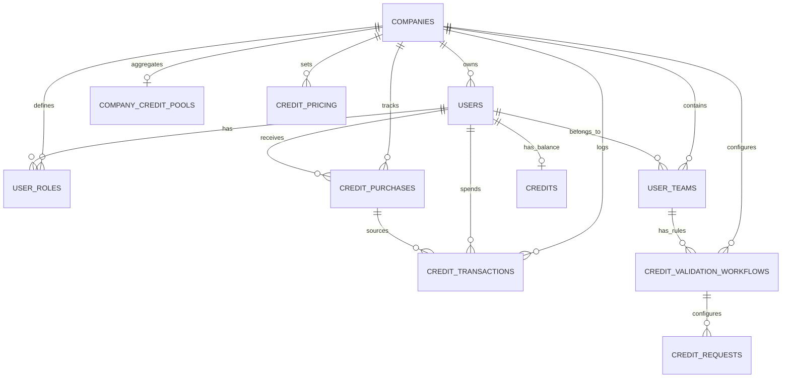

# 03 Onboarding & User Profile Mapping

**Version:** MVP Juillet 2026  
**Status:** 🟢 Spécification en cours  
**Effort estimé:** 120-150h  
**Timeline:** Semaines 5-8 (Phase 3-4, post-Passeport, concurrent avec Formation/JAC intégration)

---

## 📖 Vue d'Ensemble

### Objectif Métier

Cahier #3 établit l'**infrastructure complète de gestion utilisateurs et d'onboarding** qui sera le socle de la plateforme. C'est le module qui :

1. **Gère le cycle de vie utilisateur** : signup → onboarding → profile → activation
2. **Implémente la hiérarchie de rôles** (5 rôles, permissions matrix) et multi-tenancy (company-scoped + user-scoped)
3. **Intègre le système de crédits** (WooCommerce-driven) avec validation configurable par manager
4. **Agrège les données utilisateur** : Passeport Compétences + Missions Apprenantes + Gamification XP → profil unifié
5. **Fournit l'architecture Back-Office** complète pour gérer users, companies, teams, roles, credits

Sans ce module, la plateforme n'a pas de base stable pour accueillir les autres modules (Formation, Coaching, etc.). C'est une **dépendance critère** pour tous les autres.

### Qui l'Utilise (Rôles)

**Role Hierarchy — GLOBAL & STANDARDIZED (Option A)**

Tous les rôles sont standardisés globalement. Pas de custom roles par company (V1+).

- **Admin Platform** (Pierre, unique global) : Gère tous users, toutes companies, toutes configurations, manage global settings

- **Company Admin** (1+ par company) : 
  - Full company view + toutes permissions Manager/Team Lead
  - + Permissions spécifiques: Configure company settings, manage all users + teams for company, manage company credit pool, view company analytics
  - Peut valider dépenses crédits (comme Manager)

- **Manager/Team Lead** (1+ par team) : 
  - Gère son équipe (create/update/delete team users)
  - **Valide utilisation crédits** (approve/reject credit spending requests)
  - Configure validation crédits pour leur team (require approval toggle)
  - Voit dashboard équipe + performance apprenants

- **Coach** (1+ par company) : Valide profils apprenants, voit leurs corrections

- **Apprenant** : Deux variantes (accès/onboarding différent, permissions identiques)
  - **Apprenant Individuel** : Pays directement via Stripe, reçoit crédits auto selon plan + peut acheter crédits supplémentaires
  - **Apprenant Entreprise** : Ajouté par manager, accès crédits via company pool

- **Expert** (Reserved V1, infrastructure prête) : Valide missions cross-companies

### Scope — IN / OUT

#### ✅ IN (MVP Juillet)

**Onboarding Flows**
- Public signup (self-created) → Individual Learners 
  - Account created by apprenant
  - Questionnaire scope: DYNAMIC based on self-selected learning objectives (3-30Q, adaptative per objectives count)
  - Paiement Stripe EN FIN de onboarding
  - Accès direct après paiement + auto-credits per plan
  
- Manager/Super Admin invitation (company-created) → Company Learners
  - Account pre-created by Manager/Super Admin + objectives assigned
  - Questionnaire scope: DYNAMIC based on manager-assigned objectives (3-30Q, tailored to assigned objectives only)
  - Configuration: One-time at company level (objectives mapping, questionnaire scope settings)
  - Accès direct sans paiement (company pool credits)
  
- NOTE: Account creation method determines info re-entry logic (see User Journey #1b)
- Invitation-based signup (coaches/experts by Admin, company-specific)
- Company Admin + Manager setup by invitation (Admin-driven)
- Welcome sequence + first login guidance

**User Profile**
- FO: Personal profile (name, email, photo, public/private settings, role, team)
- FO: Competency radar (Passeport data aggregation, filtered by module)
- FO: XP dashboard (Gamification XP display, visible by role)
- FO: Credits display (personal balance + company pool visibility)
- BO: User CRUD (create, read, update, delete, archive, bulk operations)
- BO: Company CRUD (create, billing setup, credit balance management)
- BO: Team CRUD (create, assign manager, configure credit validation)

**Role & Permissions**
- 5 role types finalized: Admin Platform, Company Admin, Manager, Coach, Apprenant (+ Expert reserved)
- Basic permissions matrix (first pass, detailed post-all-cahiers)
- Role assignment per company (each user can have different role per company)
- Multi-company support (Expert/Apprenant can access 2+ companies conditionally)

**Credit System**

- **Individual Learners**: 
  - Auto-credited según their plan (e.g., Plan 3 = 1 crédit/mois offert)
  - Can purchase additional credits from platform (self-service, Stripe)
  - Personal credit balance displayed in dashboard
  - Used for course/formation access (or optional paid features)

- **Company Learners**: 
  - Use company-level credit pool (no personal purchase)
  - Company-level credit pool (rechargeable via WooCommerce or manually by admin)
  - User-level allocation from company pool (Manager/Company Admin allocate per user)
  - Manager/Company Admin validates credit spending (approval toggle per team)
  - Credit transaction audit trail (what, when, by whom, approved/rejected)

**Data Architecture**
- Custom users table (single source of truth, not WP Core)
- Custom companies table (multi-tenant organization)
- Custom user_roles table (user + company + role association)
- Custom user_teams table (team management + credit validation override)
- Custom credit_transactions table (audit trail)
- Custom credit_pricing table (flexible pricing)
- WooCommerce webhook integration (payment → credit transactions)

**Analytics (MVP scope — TBD precision)**
- User list with role/company/status filters
- Analytics tiles: active users count, onboarding completion %, role distribution
- Possibly: learner engagement metrics, coach load
- Depends on Analytics module readiness

#### ❌ OUT (Déféré)

- **Marketplace Experts** : Déféré à Octobre 2026+ (separate module, not MVP/V1)
- **Advanced profile customization** : V2 (custom fields by company)
- **Single Sign-On (SSO)** : V1 (authentication is local for now)
- **Batch user import from CSV** : V1 (too complex for MVP, manual add initially)
- **Social signup** (Google, GitHub) : V2+
- **Role custom creation** : V2+ (fixed roles MVP)

### Dépendances Critiques

**Dépend de:**
- **Passeport Compétences** (Module #2) : User profile must aggregate Passeport radar data → **Passeport must be done first**
- **Formation & Learning Paths** (Module #1) : Missions Apprenantes data shown in profile
- **Gamification & Badges** (Module #6) : XP and badge display in profile

**Bloque:**
| Module | Raison | Impact |
|--------|--------|--------|
| **Coaching & 1-1 Messaging** | Requires coach + apprenant roles, credit system | Critical blocker |
| **Déploiement IA (3 types)** | Requires user profile + roles for IA module access control | Critical blocker |
| **BO & Analytics (transversal)** | Aggregates data from Onboarding module | Critical blocker |
| **Missions Apprenantes** | Integrated in Formation, but uses Onboarding user roles | Tight coupling |

---

## 📱 Écrans à Concevoir

### Front-Office (React)

| Écran | Rôle | Description | Priorité |
|-------|------|-------------|----------|
| **Public Signup Form** | Apprenant (public) | Email, password, company selection (pre-filled or searchable), terms acceptance, CTA to WooCommerce payment | P0 |
| **Signup Confirmation** | Apprenant | Email verification + invite to onboarding, resend link option | P0 |
| **Onboarding Welcome** | Apprenant | 1st screen: welcome message, role explain, link to positionnement questionnaire | P0 |
| **Positionnement Questionnaire** | Apprenant | TWO VARIANTS: • Individual Learner: Conversational Mistral UI (competencies adaptative per self-selected objectives, dynamic scope 3-30Q), Dreyfus 1-5 scale, open-ended responses, progress bar, submit → auto-seed Passeport • Company Learner: Simple form-based questionnaire (competencies per manager-assigned objectives, dynamic scope 3-30Q), Dreyfus scale + multiple-choice, progress bar, submit → auto-seed Passeport (lazy-loading XP-triggered) | P0 |
| **Onboarding Success** | Apprenant | Confirmation + CTA to dashboard, role-specific next steps (formation path, mission, etc.) | P0 |
| **My Profile** | All roles | Name, email, photo, role, team, company, public/private toggle, edit form (own profile only) | P0 |
| **Competency Radar** | Apprenant, Coach | 6-axis radar from Passeport, jauge progression, level indicator, drill-down to detail | P0 |
| **XP Dashboard** | Apprenant | XP total, XP by category, level progression (if gamification has levels), recent activities | P1 |
| **Credits Display** | Apprenant, Coach | Personal balance + company pool (if visible by role), purchase button (if enabled) | P0 |
| **Purchase Credits** | Apprenant | Product list (100 cr €50, 500 cr €200, etc.), cart, checkout (WooCommerce iframe or redirect) | P1 |
| **Inline Credit Purchase Modal** | Apprenant | Modal triggered during service booking (coaching, badge, atelier): displays insufficient balance warning, package selector (50/200/500 cr), Stripe inline checkout, confirmation | P0 |
| **Credit Purchase Package Selector** | Apprenant | Modal step 1: Shows 3 credit packages (A/B/C with pricing, savings %), Recommended indicator, selection highlights package | P0 |
| **Stripe Inline Checkout** | Apprenant | Modal step 2: Integrated Stripe payment form (card fields, real-time validation), payment button "Payer €[amount] et réserver [service]", error handling + retry options | P0 |
| **Purchase Confirmation Screen** | Apprenant | Post-payment: Success message, credits purchased/deducted summary, service confirmation (date/time/cost), "View my session" CTA, new balance display | P0 |
| **Credit Transaction History** | Apprenant, Coach | Personal/team transaction log: service type, date, cost (credits + EUR), balance before/after, refund status if applicable, searchable + filterable | P1 |
| **Platform Tutorial** | Apprenant | Interactive step-by-step guide: dashboard overview (5-7 steps), competency radar, learning paths, credit system, key features. Each step: title + description + screenshot + "Next"/"Skip" buttons | P0 |

### Back-Office (WordPress Admin)

| Écran | Rôle | Description | Priorité |
|-------|------|-------------|----------|
| **User Management List** | Admin, Company Admin | Table: email, role, company, team, status (active/inactive), created_at, actions (edit, delete, archive, bulk ops) | P0 |
| **User CRUD Form** | Admin, Company Admin | Create/edit: email, password, name, role (dropdown per company), team (if applicable), deactivation toggle | P0 |
| **Bulk User Import** | Admin, Company Admin | CSV upload: email (required), password (auto-generated), role (required), company_id (required), team_id (optional). Error handling: Pause & Review (invalid rows quarantined for manual review). Password distribution: Random password generated → email sent to each user with temp reset link. Volume support: MVP ready for 20-100+ users per import. | P0 |
| **Company Management** | Admin | List: name, owner, billing_type, credit_balance, active user count | P0 |
| **Company CRUD Form** | Admin | Create/edit: name, owner (Admin or Company Admin), billing_type (subscription/invoice), initial credit allocation | P0 |
| **Team Management** | Admin, Company Admin, Manager | List: team name, manager, member count, credit validation override setting | P0 |
| **Team CRUD Form** | Admin, Company Admin, Manager | Create/edit: name, manager assignment, require_credit_validation toggle (override company default) | P0 |
| **Credit Management Dashboard** | Admin, Company Admin | Dashboard: company pool balance, recent transactions, purchase history (WooCommerce orders), allocate credits to users, forecast depletion date | P0 |
| **Credit Purchase History** | Admin, Company Admin | Table view: transaction date, type (coaching_spent, badge_spent, purchase, refund, admin_grant), user, amount (credits + EUR), balance before/after, manager approval status if applicable, refund window indicator | P0 |
| **Credit Configuration** | Admin, Company Admin | Pricing setup: item_type (coaching, openbadge, masterclass), cost_credits, cost_eur, company-specific override, effective_date versioning | P1 |
| **Credit Validation Workflow** | Admin, Company Admin | Manage approval rules: require_approval toggle, approval_threshold (only requests >= X credits require approval), approval_timeout_hours (auto-approve after X hours), allowed_item_types filter | P0 |
| **Manager Devis Generator** | Admin, Company Admin | Form: Company selector, credit amount requested, price calculation (auto from credit_pricing), notes field, Generate button → creates PDF devis + sends to manager email | P0 |
| **Devis Signature & Approval** | Manager (Company) | View pending devis: PDF preview, devis details (credits, price, validity), digital signature interface (timestamp + metadata), Status: pending/signed/rejected, signed_at timestamp display | P0 |
| **Credit Purchase History** | Admin, Company Admin | Transactions table searchable/filterable by: user, date range, transaction type, manager (if approval-based), refund status, export to CSV | P0 |
| **Onboarding Analytics** | Admin, Company Admin | Tiles: active users, onboarding completion %, role distribution, user activation rate over time | P1 |
| **Role Assignment Matrix** | Admin | Manage which roles can do what (first pass, review post-all-cahiers) | P1 |
| **Tutorial Management** | Admin, Company Admin | List of tutorial steps (draggable to reorder), edit step content (title, description, screenshot, CTA button text), enable/disable per company or role | P0 |
| **Tutorial Step Editor** | Admin, Company Admin | Form: Step title, description (rich text), screenshot/video upload, action CTA ("Next", "Skip", "Go to [feature]"), display conditions (show for all roles or specific roles) | P0 |

---

## ⚙️ Fonctionnalités (MVP)

### Core — Credit System Complete Documentation

#### A. Credit Types & Categories

1. **Classic Credits (Flexible, Multi-Purpose)**
   - Can be used for any paid service: Coaching sessions, Masterclass inscription, Open Badge claims
   - Individual learners: Can purchase additional Classic credits via Stripe self-service
   - Company learners: Allocated from company pool (Classic credits by default)
   - Expiration: 24 months from purchase/allocation date (tracked per credit_purchases entry)
   - No restrictions on usage pattern (flexible allocation per user)

2. **Special Credits (Restricted to Specific Services)**
   - Assigned EXCLUSIVELY by Super Admin in Back-Office (no manager can assign)
   - Can be restricted to: Coaching only, Masterclass only, Open Badges only, or combinations
   - Company learners only (not applicable to individual learners)
   - Cannot be transferred between users
   - Tracked separately in credit_purchases table (credit_type='special', restricted_service_id field)
   - Expiration: Can be set per special credit allocation (e.g., 6 months for Q2 campaign credits)
   - Use case: Marketing campaigns, promotion codes, team-specific training budgets

3. **Badge Types (Only Open Badge Consumes Credits)**
   - **Badge Plateforme** (Platform Badge): FREE — Awarded automatically by system (e.g., "Completed Formation X")
   - **Badge Compétences** (Competency Badge): FREE — Awarded by Coach when learner achieves competency level
   - **Open Badge** (Industry Standard Badge): PAID in credits — Claimable via Badgr/OpenBadge standards, learner spends credits to claim

#### B. Individual Learner Credit Workflow (Apprenant Individuel)

1. **Signup → Auto-Credit Allocation**
   - Individual learner completes signup + payment via Stripe
   - Selects subscription plan (Plan 1/2/3 with X credits/month)
   - Upon payment_succeeded webhook: Create credit_purchase entry {user_id, credit_type='classic', amount, cost_eur, purchase_date, expiration_date=purchase_date + 24 months}
   - Update credits table: {user_id, balance_available=amount}
   - Email sent: "Welcome! You've been credited with [X] credits, valid until [date]"

2. **Monthly Credit Refresh (Subscription Renewal)**
   - Stripe subscription renews monthly automatically
   - On each renewal_succeeded: Create new credit_purchase entry {user_id, credit_type='classic', amount, source='subscription_renewal', expiration_date=renewal_date + 24 months}
   - Update credits.balance_available += amount
   - Email: "Monthly credits received: [X] new credits added to your account"

3. **Self-Service Credit Purchase (Ad-hoc)**
   - Learner cliques "Buy more credits" in dashboard → WooCommerce product list (100 cr €50, 500 cr €200, etc.)
   - Cart → Stripe Checkout (hosted)
   - Payment_succeeded → Credit_purchase entry + balance update (same flow as signup)
   - Email: "Purchase confirmed. [X] credits added to your account"

4. **Credit Balance Display**
   - FO Dashboard: Shows "Your Credits: [X available]" + breakdown by type (Classic, Special if any)
   - Shows expiration dates per credit batch (if multiple batches exist)
   - Only personal balance displayed (no company pool visibility for individual learners)

#### C. Company Learner Credit Workflow & Pool Management (Apprenant Entreprise)

1. **Company Pool Setup (Admin / Company Admin Only)**
   - Company Admin creates company_credit_pool entry during company onboarding
   - Sets initial pool balance (via manual allocation or WooCommerce integration)
   - Pool level stores: {company_id, balance_total, balance_available, billing_date (for monthly refresh), last_purchase_date}
   - Company Admin can view: Current pool balance, total consumed this month, forecasted depletion date

2. **Pool Funding — WooCommerce Integration**
   - Company Admin (or Super Admin) purchases credits via WooCommerce (Company SKU: "500 credits for Company X €200")
   - WooCommerce order successful → Webhook sends: {company_id, amount_credits, cost_eur, order_date}
   - Backend creates credit_purchase entry {company_id, credit_type='classic', amount, source='woocommerce_company_purchase', expiration_date=purchase_date + 24 months}
   - Update company_credit_pool.balance_total += amount, balance_available += amount
   - Email sent to Company Admin: "Company pool recharged: [X] credits, valid until [date]"

3. **User-Level Credit Allocation from Pool**
   - Manager (or Company Admin) goes to User Profile → "Allocate credits" button
   - Form: User selection + amount to allocate + optional expiration override (default = inherit pool expiration)
   - Submit → Create credit_purchase entry {user_id, company_id, credit_type='classic', amount, source='manager_allocation', expiration_date}
   - Update:
     - company_credit_pool.balance_available -= amount
     - credits.balance_available += amount (for this user)
   - Audit log: {user_id, manager_id, action='credit_allocation', amount, timestamp}
   - Email to learner: "Manager [Name] allocated [X] credits to your account"

4. **Company Pool Balance Tracking**
   - Real-time: company_credit_pool.balance_available updated atomically on each allocation/spend
   - Dashboard for Company Admin: "Pool Status: [Y available of X total] - [Z% consumed]"
   - Monthly snapshot: Stored in analytics table for reporting (balance on 1st of each month)
   - Forecast: If depletion rate = [X credits/day], projected empty date = now + (balance_available / depletion_rate)

#### D. Credit Consumption Workflows (Service-Specific)

1. **Coaching Session Credit Cost**
   - Coach sets session rate in credit_pricing: {item_type='coaching', cost_credits=X, cost_eur=Y, company_id=NULL or company_id}
   - Global default: coaching = 10 credits (configurable)
   - Company override: Each company can set custom coaching cost (e.g., Company A = 8 credits, Company B = 12 credits)
   - Learner books coaching session → System checks: "This session costs [X] credits. You have [Y available]. Proceed?" 
   - If learner confirms: Credit validation workflow triggered (see section E)

2. **Masterclass Inscription Credit Cost**
   - Masterclass admin (Coach or Coach Admin) sets cost in credit_pricing: {item_type='masterclass', cost_credits=X, cost_eur=Y}
   - Global default: masterclass = 15 credits (configurable)
   - Learner registers for masterclass → System checks balance → If sufficient: Debit credits (no approval needed, automatic)
   - If insufficient: "You need [X] more credits. Purchase now or contact your manager"
   - Transaction logged: {user_id, item_type='masterclass', amount_debited=-X, source='masterclass_registration', timestamp}

3. **Open Badge Claim Credit Cost**
   - Coach/Admin sets cost in credit_pricing: {item_type='open_badge', cost_credits=X, cost_eur=Y}
   - Global default: open_badge = 20 credits (configurable)
   - Learner cliques "Claim Badge" → System checks balance + prerequisites (must have badge earned first)
   - If sufficient: Debit credits → Issue OpenBadge via Badgr API → Email with badge URL
   - If insufficient: "You need [X] more credits to claim this badge"
   - Transaction logged: {user_id, item_type='open_badge', badge_id, amount_debited=-X, source='open_badge_claim'}

#### E. Credit Validation & Approval Workflows

1. **Configuration (Per Company Default + Per Team Override)**
   - Company Admin sets company default: companies.require_credit_validation = TRUE/FALSE
   - Manager can override per team: user_teams.require_credit_validation = TRUE/FALSE/NULL (NULL = inherit company default)
   - Setting stored in BO → Company Settings → "Require manager approval for credit spending?" toggle

2. **When Validation Enabled (require_credit_validation = TRUE)**
   - Learner initiates spending (coaching book, masterclass register, open badge claim)
   - System creates credit_request entry: {user_id, item_type, cost_credits, manager_id (assigned manager for this learner's team), status='pending', created_at}
   - Learner sees: "Approval pending. Your manager will review shortly"
   - Manager receives notification: "Approval request from [Learner]: [X] credits for [Item Type]. Approve or deny?"
   - Manager goes to BO → "Pending Approvals" dashboard → Reviews + clicks "Approve" or "Deny"
   - If Approve:
     - Update credit_request.status = 'approved', resolved_at = now
     - Create credit_transaction: {user_id, transaction_type='coaching_spent/masterclass_spent/open_badge_spent', amount_credits=-X, manager_id, notes='Approved for [learner_request]'}
     - Debit credits from balance (company pool if company learner, personal if individual)
     - Email to learner: "Your request was approved. Credits debited."
   - If Deny:
     - Update credit_request.status = 'denied', resolved_at = now, manager_comment = (optional reason)
     - NO credit debit
     - Email to learner: "Your request was denied. Reason: [manager_comment]. Contact your manager."

3. **When Validation Disabled (require_credit_validation = FALSE)**
   - Learner initiates spending
   - System IMMEDIATELY debits credits (no approval queue)
   - Transaction logged: {user_id, transaction_type='...', amount_credits=-X}
   - Email to learner: "Credits debited for [Item]. Balance now: [Y]"
   - Email to manager (FYI only): "Team member [Learner] spent [X] credits for [Item]" — no action required

#### F. Multi-Manager Scenarios & Credit Pooling

1. **Multiple Managers in Same Company**
   - Company has 3 managers (Sales, Engineering, Support teams)
   - Company pool is SHARED: All 3 teams draw from same pool
   - Company Admin can see pool total + consumption by team (via analytics)
   - Each manager approves credits for their own team only (no cross-team authority)

2. **Multi-Manager with Sub-Team Allocation**
   - Manager can allocate credits from company pool → per-user level
   - Example: Pool = 5000 credits. Manager A allocates 500 to user X, 300 to user Y
   - Users X + Y can now use their allocated credits (cannot exceed allocation)
   - If allocation exhausted: User contact manager to request more
   - Pool remains shared, allocations are per-user boundaries within pool

3. **Company with No Sub-Manager (Only Company Admin)**
   - Company Admin is the approval authority for all credit requests
   - Company Admin configures company-wide default: require_credit_validation = TRUE
   - All learner credit requests route to Company Admin for approval
   - Company Admin can override per team (create teams with different validation rules if needed)

#### G. Special Credits Management (Super Admin Exclusive)

1. **Super Admin Attribution (Back-Office Only)**
   - Super Admin goes to BO → Users management → User profile → "Special Credits" tab
   - Form: {user_id, amount, restricted_service_id (coaching/masterclass/open_badge/multiple), expiration_date, reason (e.g., "Q2 onboarding campaign")}
   - Submit → Create credit_purchase entry {user_id, credit_type='special', amount, restricted_services=JSON['coaching'], expiration_date, assigned_by='super_admin_id', timestamp}
   - Special credits appear separately in learner dashboard: "Special Credits (Coaching Only): [X available until [date])"

2. **Special Credit Usage (Restricted Spending)**
   - When learner books coaching:
     - System checks: Do you have special credits restricted to coaching? YES → Offer to use special credits first
     - "Use [X] special credits + [Y] classic credits?" (if total cost > special_credit_balance)
     - Learner confirms → Debit special credits first, then classic credits for remainder
     - If only special credits available and cost < special_balance: Use only special, remainder stays available
   - Audit trail: {user_id, item_type='coaching', amount_special_debited=A, amount_classic_debited=B, source='special_credit_usage'}

3. **Special Credit Expiration Handling**
   - Scheduled job (daily): Check credit_purchases where expiration_date = today
   - If expired & unused: Mark as expired, no longer spendable
   - If expired & partially used: Balance reverts to unspendable (cannot use expired credits)
   - Email to learner: "Your special coaching credits expired on [date]. [X] credits were not used."
   - No conversion to classic credits (special credits are one-time, campaign-specific)

#### H. Credit Expiration, Refunds & 72-Hour Refund Window

1. **Credit Expiration (24-month default for Classic & Special)**
   - Classic credits: Expire 24 months from purchase/allocation date
   - Special credits: Expiration set per assignment (can be shorter, e.g., 6 months)
   - Scheduled job (nightly): Identify credits expiring today
   - Learner receives email: "[X] credits expiring on [date]. Use them soon or they'll be lost"
   - On expiration date: credits automatically marked as expired, no longer usable
   - Balance calculation: balance_available = SUM(all non-expired credit_purchases)

2. **Refund Eligibility (72-hour window)**
   - Refund window: 72 hours from credit debit transaction
   - Eligible transactions: Coaching sessions, Masterclass inscriptions, Open Badge claims (not subscription purchases)
   - Request flow: Learner clicks "Request refund" → Form: Select transaction + reason
   - Request goes to: Company Admin (if company learner) OR Support (if individual learner)
   - Approver reviews: "Refund [X] credits for [Transaction]?" → Click Approve/Deny
   - If Approve (within 72h):
     - Create credit_transaction: {user_id, transaction_type='refund', amount_credits=+X, original_transaction_id, reason, approved_by, timestamp}
     - Update credits.balance_available += X
     - Email: "Refund approved. [X] credits restored to your account"
   - If Approve (after 72h):
     - Request appears as "Expired - Request manual review" to Support
     - Support can manually override + process refund (documented in notes)
   - If Deny:
     - Email to learner: "Refund denied. Reason: [approver_comment]"

3. **Refund Audit Trail**
   - Every refund logged with: original_transaction_id, refund_amount, reason, approved_by, approval_timestamp, 72h_window_status (within/after)
   - Support can view all refund requests (approved/denied/pending) in BO dashboard

#### I. Audit Trail & Reconciliation

1. **Complete Audit Log (Immutable, Append-Only)**
   - credit_transactions table: {id, user_id, company_id, transaction_type, amount_credits, cost_eur, created_at, source, manager_id (if approval-based), notes, metadata}
   - Every action logged: allocation, spend, refund, expiration, special credit attribution
   - Timestamps: created_at (action time), resolved_at (if approval-based), applied_at (if debit confirmed)
   - Manager notes: Why was this approved/denied? (optional but encouraged)
   - Source tracking: 'subscription_renewal', 'manager_allocation', 'coaching_spent', 'masterclass_spent', 'open_badge_spent', 'refund', 'admin_debit', 'special_credit_assignment'

2. **Monthly Reconciliation Report**
   - Scheduled job (1st of each month): Generate reconciliation snapshot
   - For each company: {month, total_credits_purchased, total_credits_allocated, total_credits_spent, balance_remaining, approval_rate (% approved vs denied), top_spending_service}
   - Available in BO → Analytics → "Credit Reconciliation"
   - Exportable as CSV: Detailed ledger (all transactions that month)

3. **Discrepancy Detection**
   - Cron job (daily): Verify credit balance consistency
   - Check: balance_available = SUM(credit_purchases) - SUM(credit_transactions where transaction_type IN ('coaching_spent', 'masterclass_spent', ...))
   - If discrepancy found: Log alert, email Support, flag for manual review
   - Manual reconciliation: Support can adjust balance with documented reason + timestamp

### Secondary

1. **User Signup & Onboarding (2 paths)**
   - **Individual Learner (Self-Created)**: Public signup → Select learning objectives → DYNAMIC questionnaire (3-30Q, adaptative per objectives) → Stripe payment (END of onboarding) → Active with auto-credits per plan
   - **Company Learner (Manager-Created)**: Manager invitation + pre-assigned objectives → DYNAMIC questionnaire (3-30Q, tailored to objectives) → Direct access (no payment, company credits) → Role auto-assigned per company structure

2. **User Profile & Dashboard**
   - FO: Personal profile (name, email, photo, role, team, competency radar, XP, credits display)
   - BO: Full user CRUD (create, read, update, delete, archive, bulk operations)
   - BO: Company CRUD (create, billing setup, credit balance management)
   - BO: Team CRUD (create, assign manager, configure credit validation)

3. **Role & Permissions (Global Standardized)**
   - 6 role types: Admin Platform, Company Admin, Manager, Coach, Apprenant Individuel, Apprenant Entreprise
   - Global standardized roles (NO custom roles per company in MVP)
   - Company Admin = Manager permissions + company admin tasks
   - Manager/Company Admin: **Validate credit spending** (approve/reject requests)
   - Permission matrix: Admin > Company Admin = Manager > Coach > Apprenant

4. **Positionnement Questionnaire Seeding**
   
   **Individual Learner (Conversational Mistral):**
   - Questionnaire scope DYNAMIC based on self-selected learning objectives
   - Scope range: 3-30 questions (minimum 3 competencies/objectives, max 30Q)
   - Calculation: (objectives_count × avg_questions_per_objective) + user preferences
   - UI: Conversational Mistral (open-ended responses, tone detection, confidence scoring)
   - Result: auto-seed Passeport with competencies mapped to selected objectives (lazy-load 280+ other competencies via XP/missions)
   
   **Company Learner (Simple Questionnaire):**
   - Questionnaire scope DYNAMIC based on manager-assigned objectives (not account type)
   - Scope range: 3-30 questions (minimum 3 competencies/objectives, max 30Q)
   - Calculation: (objectives_count × avg_questions_per_objective) + company_config_overrides
   - UI: Simple form-based questionnaire (multiple-choice per Dreyfus scale, no conversational flow)
   - Examples: 1 objective → ~3-5Q | 2 objectives → ~6-10Q | 3 objectives → ~15-20Q | 5 objectives → ~25-30Q
   - Result: auto-seed Passeport with competencies mapped to assigned objectives only (lazy-load other competencies)

5. **Aggregated User Profile** - Profile dashboard pulls data from: Passeport (competencies), Missions Apprenantes (active missions), Gamification (XP), Formation (learning path progress), Coaching (coach assigned)

6. **Platform Tutorial (Interactive Onboarding Guide)** - After signup verification, apprenant views interactive tutorial explaining: dashboard, competency radar, learning paths, credit system, key features. Admin can create/edit tutorial steps. Tutorial is skippable (for Individual), required for Company

7. **Back-Office Management** - Admin/Company Admin manage: users, companies, teams, roles, credits, tutorial content, configurations per company

N+1. **Batch CSV User Import** - Upload CSV with email, name, role, team → create multiple users at once (TBD MVP scope, may defer to V1)

N+2. **Password Reset + Account Recovery** - Users can reset via email, Admin can force password reset, session timeout configurable

N+3. **Onboarding Progress Tracking** - Track: questionnaire completed %, profile 100% filled, first login, role confirmation → analytics dashboard

N+4. **Multi-company Support** - Expert/Apprenant can access 2+ companies conditionally (V2+)

### Direct Credit Purchase (No Cart) — MVP Requirement

1. **Inline Purchase Modal (All Services)**
   - Available at every point requiring credits: Coaching booking, Badge claiming, Atelier registration, Wallet low-balance warning
   - Modal design: Shows credit deficit + package options (50/200/500 credits) + inline Stripe checkout
   - Post-purchase: Credit added immediately to wallet, original action continues atomically
   - UX: Single modal component reused across all entry points (consistency)

2. **Two Separate Purchase Flows**
   - **Flow A — Individual Learner:** Self-service WooCommerce one-time purchase via inline modal, credit instant to personal wallet
   - **Flow B — Company Manager:** 
     - Path A (Direct WooCommerce): Manager purchases via FO "Add to pool" → WooCommerce checkout → credit added to company pool
     - Path B (Devis Auto-Généré): Manager requests quote → PDF auto-generated → Manager signs → credit allocated upon signature
     - Path C (Off-Platform Admin Grant): Super Admin grants free credits to company/team via BO (for partnerships, campaigns, etc.)
   - **No shopping cart system** — Direct purchase at point of need only
   
3. **Credit Purchase Atomicity**
   - When learner purchases + books service simultaneously (e.g., purchase credits → immediately book coaching)
   - System uses DB transactions: Purchase credit + Debit for service = single atomic operation (all-or-nothing)
   - If Stripe fails: Booking not created, learner not charged
   - If booking fails: Credits not deducted from wallet

---

## 🚀 Possible Évolutions (V2+)

### V1 (Septembre 2026)
- **Batch CSV import** : Fully robust, validation, error reporting
- **Advanced profile customization** : Companies can add custom fields to user profile
- **Expert role activation** : Enable Expert role signup/assignment, cross-company mission validation
- **Single Sign-On (SSO)** : Google OAuth, Azure AD for company logins

### V2 (Q1-Q2 2027)
- **Social signup** : Google/GitHub sign-up for apprenants
- **Role custom creation** : Companies can define custom role types (e.g., "Tech Mentor", "Skill Validator")
- **Advanced analytics** : Cohort analysis, engagement trends, role-specific dashboards
- **User segments** : Tag users by skill level, department, etc. for targeted campaigns

### V3 (2028+)
- **Marketplace Experts module** : Expert profiles, booking, rating system (separate module, not here)
- **Advanced multi-tenancy** : Company-level feature flags, custom branding, white-label options
- **Audit compliance** : GDPR data export, right-to-be-forgotten, full audit trail export

---

## 👥 User Journeys (Format 3)

### User Journey #1a : Individual Learner → Signup + Full Questionnaire + Stripe Payment (END)

**Acteur :** Individual Learner (nouvel utilisateur autonome, no existing account, pas lié à une entreprise)  
**Déclencheur :** Visite landing page, clique "Créer un compte"  
**Objectif :** Créer compte, compléter onboarding complet (questionnaire positionnement), effectuer paiement Stripe, obtenir accès plateforme avec crédits initiaux

#### Étapes Détaillées

1. **Individual Learner clique "Créer un compte" et accède au formulaire de signup**
   - Sub-step 1: Learner arrive sur /signup (React FO)
   - Sub-step 2: Formulaire affiche: Email, Password (with strength meter), Terms checkbox, "Je m'inscris" button (no company selector for Individual path)
   - Sub-step 3: Feedback: Formulaire affiche immédiatement (instant). Validation en temps réel: email format, password strength (rouge/orange/vert), terms required
   - Durée: Instant

2. **Individual Learner remplit email, mot de passe, accepte terms**
   - Sub-step 1: Type email → système valide format, affiche feedback "✓ Email valide" ou "✗ Format invalide"
   - Sub-step 2: Type password → jauge force (Faible 🔴 / Moyen 🟠 / Fort 🟢), affiche criteria (min 8 car, majuscule, chiffre, special)
   - Sub-step 3: Coche "J'accepte les conditions" checkbox
   - Feedback: En temps réel pour chaque field. Button "Je m'inscris" reste disabled tant que form invalid
   - Durée: 1-2 min (user typing)

3. **Individual Learner clique "Je m'inscris" → système crée account**
   - Sub-step 1: POST /api/auth/signup avec {email, password, learner_type="individual"}
   - Sub-step 2: Backend validation: email unique globally, password strength
   - Sub-step 3: Si succès: Création row dans custom.users table {id, email, password_hash, learner_type="individual", company_id=NULL, created_at, status=pending}
   - Sub-step 4: Création row dans user_roles table {user_id, role_id=Apprenant}
   - Sub-step 5: Envoi email "Vérifiez votre adresse" avec lien confirmation (token, expires 24h)
   - Feedback: Loading spinner (~2s), puis écran confirmation email
   - Durée: ~2s (API call + email send)

4. **Individual Learner clique lien email verification → accède page onboarding**
   - Sub-step 1: Clique lien verification email → token validé backend
   - Sub-step 2: Si token valide: Update users.status = verified, page /onboarding redirige automatique
   - Sub-step 3: Onboarding page charge: Welcome screen ("Prêt à découvrir vos compétences?" + questionnaire button)
   - Feedback: Email verification ~instant. Onboarding page loads ~500ms
   - Durée: ~1s total

5. **Individual Learner sélectionne objectifs opérationnels et lance questionnaire Mistral**
   - Sub-step 1: Onboarding page affiche "Commençons par comprendre vos compétences actuelles"
   - Sub-step 2: Affiche 2-3 amorces de conversation (operational objectives):
     - "Objectif: Devenir Manager"
     - "Objectif: Expertise Technique"
     - "Objectif: Entrepreneur"
     - Chaque objective a un set de 5-10 compétences liées
   - Sub-step 3: Learner sélectionne 1-2 objectifs
   - Feedback: Objective sélectionné, "Loading competencies..." ~500ms
   - Durée: ~1 min

6. **Mistral Conversational Questionnaire engage apprenant**
   - Sub-step 1: Mistral launches conversational UI (not static form)
   - Sub-step 2: Mistral affiche first question conversationnel (e.g., "Tell me about your experience with Python. How confident are you?")
   - Sub-step 3: Apprenant répond par text (open-ended, not multiple choice)
   - Sub-step 4: Mistral détecte confidence signals dans réponse (keywords: "sure", "maybe", "don't know", tone)
   - Sub-step 5: Loop: Mistral question → Apprenant response → Mistral interprets (5-15 turns total)
   - Sub-step 6: Progress bar affichée ("Analyzing... 40%")
   - Feedback: Conversational flow smooth, ~5-10 min total
   - Durée: ~5-10 min (user conversing)

7. **Mistral traduit réponses conversationnelles → Dreyfus levels + Confidence Scoring**
   - Sub-step 1: Mistral calcule Dreyfus level (1-5) **+ confidence score (0-100%)** per competency
   - Sub-step 2: IF confidence >= 60%: Seed Passeport silently, proceed to next step
   - Sub-step 3: IF confidence < 60%: Show validation modal to apprenant
   - Feedback: Instant processing, <1s
   - Durée: <1s

7b. **VALIDATION GATE (IF confidence < 60%)**
   - Sub-step 1: Modal affiché: "Je pense tu es Dreyfus [X] en [Competency]. Confirmes-tu?"
   - Sub-step 2: Options affichées: "Confirmer" / "C'est moins que ça" / "C'est plus que ça"
   - Sub-step 3: Apprenant peut ajuster si needed (click option)
   - Sub-step 4: Finalized level sauvegardé + source logged ('questionnaire_manual_confirm')
   - Feedback: Modal fluide, <500ms
   - Durée: ~30s per competency

8. **Uncertainty Handling: Mistral baisse Dreyfus level si doute détecté**
   - Sub-step 1: Si confidence score bas OU keywords doute ("maybe", "not sure") détectés → Mistral assign Dreyfus level -1
   - Exemple: Apprenant répond "Je crois que j'ai ça" (pas sûr) → assign 2/5 au lieu de 3/5
   - Sub-step 2: Log confidence score + source marker pour traçabilité
   - Feedback: Transparent (logged in audit trail)
   - Durée: Included in Step 7

9. **Passeport seeded avec competencies initiales**
   - Sub-step 1: Todas competências de selected objectives populées avec Dreyfus levels
   - Sub-step 2: Affiche success message: "✅ Ton Passeport est initialisé avec [N] compétences"
   - Sub-step 3: Show preview: radar mini + competency list (seeded competencies only, others hidden)
   - Sub-step 4: CTA: "Vois tes objectifs de progression" → Passeport dashboard
   - Sub-step 5: Note: 280+ unmapped competencies remain hidden (lazy-loading XP-triggered, will appear when apprenant earns XP or uses pre-course positioning)
   - Feedback: Success state clear, CTA prominent
   - Durée: Instant

10. **Backend persiste competency seeding (Mistral déjà fait Dreyfus translation)**
   - Sub-step 1: Frontend POST /api/onboarding/questionnaire avec {user_id, competency_assessments: [{competency_id, dreyfus_level, confidence_score, source, ...}]}
   - Sub-step 2: Backend validation: vérifie données, logs audit trail
   - Sub-step 3: Crée rows dans competency_assessments table avec {user_id, competency_id, dreyfus_level, confidence_score, validated_by_learner, source="questionnaire_auto/manual_confirm", ...}
   - Sub-step 4: Update users.onboarding_status = "questionnaire_completed"
   - Sub-step 5: Trigger: envoi notification coach (si assigné) : "Alice a complété positionnement, 15 competencies seeded"
   - Feedback: Frontend redirige vers Step 11 (Summary screen)
   - Durée: <1s (DB writes + notification)

11. **Système affiche écran récapitulatif + bouton vers paiement Stripe**
   - Sub-step 1: Page affiche "Dernière étape : Activez votre accès" + tableau récapitulatif (Radar mini, subscription plans)
   - Sub-step 2: Affiche 3 subscription options (Plan 1 / Plan 2 / Plan 3 avec crédits/mois, pricing, "Souscrire" button)
   - Sub-step 3: Learner clique "Souscrire" pour un plan
   - Feedback: CTA clear et primaire
   - Durée: Instant

12. **Individual Learner complète paiement via Stripe (hosted checkout)**
   - Sub-step 1: Clique "Souscrire [Plan]" → Système redirect vers Stripe Checkout (hosted page)
   - Sub-step 2: Stripe affiche: Email (pre-filled), Card input, Billing address (si requis)
   - Sub-step 3: Learner entre card details, clique "Pay [amount]"
   - Sub-step 4: Stripe process payment, webhook sent to backend: {event: "payment_succeeded", subscription_id, user_id}
   - Sub-step 5: Backend updates users.subscription_id, users.payment_status = "active", users.credits_balance = initial_credits (per plan)
   - Feedback: Stripe affiche "Payment successful". Frontend redirige /dashboard
   - Durée: ~1-2 min (user typing card)

13. **Frontend affiche success screen + accès plateforme**
   - Sub-step 1: Success page: "Bienvenue [email]! Votre compte est actif"
   - Sub-step 2: Affiche: Radar competencies mini-preview, subscription plan détails, XP starting balance (0), first mission CTA
   - Sub-step 3: CTAs: "Accéder au dashboard" (primary), "Voir mon profil" → /profile
   - Sub-step 4: Email envoyé: "Paiement confirmé! Bienvenue sur Learning App"
   - Feedback: Success animation, clear next steps
   - Durée: Instant

#### Conditions de Succès ✅
- [ ] Account créé en DB avec learner_type="individual", role_id=Apprenant
- [ ] Email verification fonctionne (token generated + sent)
- [ ] Questionnaire responses sauvegardées (tous 30 questions answered)
- [ ] Passeport seeded with competencies (10-20 competencies, level 1-5)
- [ ] Stripe payment completed, subscription_id stored
- [ ] User credits initialized per subscription plan (e.g., Plan 3 = 1 credit/month)
- [ ] User status = verified + onboarding_completed + payment_active
- [ ] User can access dashboard immediately after payment
- [ ] Email notifications envoyées (confirmation + payment receipt)

#### Erreurs & Edge Cases ❌

**Cas 1 : Email déjà existant globally**
- Scénario: Learner tape email qui existe déjà (autre learner ou company user)
- Comportement attendu:
  - Signup form POST → Backend checks email uniqueness globally
  - Affiche error "Cet email existe déjà. Essayez: Se connecter | Utiliser autre email"
  - Learner peut "Se connecter" ou rentre autre email
- Feedback: Error message inline sous email field
- Impact: Apprenant doit ré-essayer. Mitigation: Check email availability real-time

**Cas 2 : Stripe payment declined**
- Scénario: Learner tente paiement, card declined (insufficient funds, fraud, etc.)
- Comportement attendu:
  - Stripe retourne error message (e.g., "Your card was declined")
  - Learner reste sur Stripe Checkout, peut retry autre card ou cancel
  - Si cancel: Redirect /onboarding → page affiche "Paiement annulé. Réessayer?" + button "Reprendre paiement"
  - Learner peut tenter autre plan ou payment method
- Feedback: Stripe handles error UX. Backend logs failed attempt
- Impact: Learner cannot access platform. Mitigation: Send email reminder "Complete payment to activate"

**Cas 3 : Questionnaire incomplet avant paiement**
- Scénario: Learner complète 15/30 questions, clique "Aller au paiement" sans finir
- Comportement attendu:
  - Frontend validation: Bloquer si questions < 30
  - Affiche warning: "Veuillez compléter les 30 questions avant de continuer (15/30 complétées)"
  - Learner doit finir questionnaire
- Feedback: Clear message + progress indicator
- Impact: UX friction but ensures data quality

**Cas 4 : Webhook failure (payment succeeded but backend not updated)**
- Scénario: Stripe sends webhook (payment_succeeded), but backend API down/unreachable
- Comportement attendu:
  - Stripe retries webhook (3 attempts over 3 days)
  - Backend implements cron job: Every 6h, sync pending subscriptions from Stripe
  - Sync updates users.subscription_id, credits_balance
  - If webhook still fails after 3 days: Manual reconciliation (admin)
- Feedback: User gets email receipt from Stripe. If access blocked, support can manually activate
- Impact: Temporary access loss, but recovered within 6h by cron

**Cas 5 : Learner requests refund after payment**
- Scénario: Learner pays for Plan 3, uses platform 5 days, requests refund
- Comportement attendu:
  - Stripe refund policy per plan (e.g., 7-day money-back guarantee)
  - Learner submits request → Admin reviews (manual process)
  - If approved: Stripe refund issued, backend updates users.subscription_id = NULL, credits_balance = 0
  - Account status → "refund_requested"
  - Learner access revoked
- Feedback: Email confirmation of refund status
- Impact: Learner loses access. Mitigation: Clear refund policy communicated before payment

---

### User Journey #3 : Individual Apprenant → Inline Credit Purchase During Coaching Booking

**Acteur :** Individual Apprenant (post-onboarding, authenticated, has active subscription)  
**Déclencheur :** Apprenant identifie coaching session qu'il souhaite booker mais crédit balance insuffisant  
**Objectif :** Acheter crédits supplémentaires directement dans le modal de booking et immédiatement confirmer la session (atomic transaction)

#### Étapes Détaillées

1. **Apprenant accède page coaching et sélectionne coach + slot**
   - Sub-step 1: Apprenant clique Menu → "Coaching" → Liste coaches avec disponibilités affichées
   - Sub-step 2: Système affiche per coach: Avatar, name, expertise, rating, next 5 slots disponibles (dates/hours)
   - Sub-step 3: Apprenant clique coach "Marie" → Ouvre detail panel avec full calendar
   - Sub-step 4: Apprenant clique slot "Tuesday 10:00-10:30 AM" → Modal booking affiche
   - Feedback: Smooth transitions, slots load ~300ms, calendar interactive instantly
   - Durée: ~2-3 min (user browsing)

2. **Système affiche booking summary modal avec credit cost + current balance**
   - Sub-step 1: Modal header: "Réserver Coaching avec Marie"
   - Sub-step 2: Affiche détails: Coach name, date/time, durée (30 min), estimated cost (50 crédits), apprenant's current balance (30 crédits)
   - Sub-step 3: Clear message: "⚠️ Vous avez 30 crédits. Cette session coûte 50. Crédits manquants: 20"
   - Sub-step 4: Two CTAs visible: "Acheter crédits + Réserver" (primary) | "Annuler"
   - Feedback: Modal affiche info instantly, color-coded (red for insuffisant balance)
   - Durée: Instant

3. **Apprenant clique "Acheter crédits + Réserver" → Inline credit purchase modal ouvre**
   - Sub-step 1: Modal transitions smoothly to credit purchase view (same modal, content changes)
   - Sub-step 2: Affiche header: "Acheter des crédits" + explainer: "Sélectionnez un package. Après achat, votre session sera confirmée."
   - Sub-step 3: Shows 3 credit packages (MVP hardcoded):
     - Package A: 50 crédits (€25) — Recommended for this purchase
     - Package B: 200 crédits (€90)
     - Package C: 500 crédits (€200)
   - Sub-step 4: Each package shows: Credit count + estimated cost + saving % (for B/C vs A)
   - Feedback: Packages appear instantly, clear visual hierarchy (A highlighted as recommended)
   - Durée: Instant

4. **Apprenant sélectionne package et voit Stripe inline checkout appear**
   - Sub-step 1: Apprenant clique Package A (50 crédits, €25) → Package button highlights
   - Sub-step 2: Modal shifts to show Stripe inline payment form below package selector
   - Sub-step 3: Stripe form shows: Card number field, Expiry, CVC, Cardholder name
   - Sub-step 4: Payment button affiche: "Payer €25 et réserver coaching"
   - Sub-step 5: Form validates in real-time (card type detection, expiry validation)
   - Feedback: Stripe loads ~1s, form interactive instantly, validation feedback per field
   - Durée: ~1-2 min (user typing card)

5. **Apprenant entre card details et clique "Payer & Réserver"**
   - Sub-step 1: Types card number → Stripe detects card type, auto-formats (e.g., adds spacing)
   - Sub-step 2: Types expiry (MM/YY) → Format validation auto-corrects
   - Sub-step 3: Types CVC → Hidden field (security)
   - Sub-step 4: Clique button "Payer €25 et réserver coaching"
   - Sub-step 5: Button disables, shows loader: "Traitement du paiement..."
   - Feedback: Real-time validation per field. Loading spinner on button
   - Durée: ~1-2 min

6. **Backend processes atomic transaction: Stripe charge + credit purchase + coaching booking**
   - Sub-step 1: POST /api/booking/purchase-and-book (ATOMIC endpoint) with {user_id, coach_id, slot_id, package_id=50}
   - Sub-step 2: Backend initiates DB transaction (BEGIN TRANSACTION)
   - Sub-step 3: Step A — Stripe charge: Calls Stripe API stripe.charges.create(amount=2500, currency='eur', token=stripe_token)
   - Sub-step 4: Step B — Log credit purchase: INSERT INTO credit_purchases {user_id, amount=50, source='direct_purchase_woocommerce', stripe_charge_id, created_at}
   - Sub-step 5: Step C — Update wallet: UPDATE users SET credit_balance = credit_balance + 50 WHERE user_id
   - Sub-step 6: Step D — Create credit transaction: INSERT INTO credit_transactions {user_id, type='credit_purchased', amount=50, source='woocommerce_stripe', transaction_date}
   - Sub-step 7: Step E — Debit for booking: UPDATE users SET credit_balance = credit_balance - 50 WHERE user_id
   - Sub-step 8: Step F — Create credit transaction: INSERT INTO credit_transactions {user_id, type='coaching_spent', amount=-50, coaching_id, transaction_date}
   - Sub-step 9: Step G — Create coaching booking: INSERT INTO coaching_bookings {user_id, coach_id, slot_id, status='confirmed_paid', cost_credits=50, created_at}
   - Sub-step 10: Step H — Notify coach + Apprenant: Send emails to both parties
   - Sub-step 11: If ANY step fails → ROLLBACK entire transaction (Stripe charge reversed, no wallet change, no booking created)
   - Sub-step 12: If ALL succeed → COMMIT transaction (irreversible)
   - Feedback: Backend processes ~2-3s. Modal shows "Confirmation en cours..."
   - Durée: ~2-3s

7. **Frontend receives success response + displays confirmation screen**
   - Sub-step 1: Backend returns {status: 'confirmed', booking_id, new_credit_balance: 30, booking_details}
   - Sub-step 2: Modal transitions to success screen: "✅ Paiement confirmé!"
   - Sub-step 3: Affiche summary:
     - Credits purchased: 50
     - Cost: €25 (Stripe charge confirmed)
     - New balance: 30 (50 added, 50 deducted for coaching = net 0)
     - Coaching session confirmed: Marie, Tuesday 10-10:30 AM
   - Sub-step 4: Email sent to apprenant: "Paiement confirmé + Session coaching réservée"
   - Sub-step 5: Email sent to coach: "Nouvelle session avec [Apprenant], Tuesday 10-10:30 AM"
   - Feedback: Success animation, clear next steps
   - Durée: Instant

8. **Apprenant clique "Voir ma session" → navigates to coaching dashboard**
   - Sub-step 1: Modal affiche button "Voir ma session" (primary CTA)
   - Sub-step 2: Apprenant clique → Modal closes, redirects /coaching/[booking_id]
   - Sub-step 3: Page affiche: Session details (coach, date/time, location/Zoom link), calendar reminder add option, coach profile
   - Sub-step 4: Affiche new balance in sidebar: "Balance: 30 crédits" (clearly shows impact)
   - Feedback: Navigation smooth, page loads ~500ms
   - Durée: Instant

#### Conditions de Succès ✅
- [ ] Modal displays accurately with correct cost + balance calculation
- [ ] Package selector shows 3 options clearly differentiated
- [ ] Stripe inline form integrates cleanly, validates in real-time
- [ ] Atomic transaction executes: Stripe charge + credit purchase + booking all succeed or all fail (no partial state)
- [ ] Credit purchase logged in DB with source 'direct_purchase_woocommerce' + stripe_charge_id
- [ ] Credit wallet updated atomically (50 added, 50 deducted = net visible)
- [ ] Coaching booking created with status 'confirmed_paid'
- [ ] Emails sent to apprenant + coach within 30s
- [ ] Frontend displays correct new balance after transaction
- [ ] Apprenant cannot double-charge (request idempotence via stripe_charge_id deduplication)
- [ ] If Stripe fails → Modal shows error, allows retry, no booking created
- [ ] Transaction latency <5s total (user perceives <3s)

#### Erreurs & Edge Cases ❌

**Cas 1 : Stripe payment declined (insufficient funds, fraud, etc.)**
- Scénario: Apprenant enters valid-looking card but Stripe declines charge (e.g., "Card declined")
- Comportement attendu:
  - Stripe returns error → Backend catches, ROLLBACK transaction
  - Modal displays error: "❌ Paiement refusé. Raison: Carte refusée"
  - Affiche retry option: "Réessayer avec autre carte" (button stays visible)
  - Apprenant can:
    - Enter different card + retry
    - Select different credit package (smaller cost)
    - Cancel (modal closes, coaching booking NOT created, no charges)
  - Wallet balance unchanged (transaction rolled back)
- Feedback: Error message clear, suggests remedies
- Impact: Transaction failed, user not charged, no booking created — clean state maintained

**Cas 2 : Concurrent booking (apprenant presses "Payer & Réserver" twice)**
- Scénario: Network slow, apprenant clicks button twice (impatient)
- Comportement attendu:
  - First click: Sends POST /api/booking/purchase-and-book {user_id, coach_id, slot_id}
  - Backend sets slot status = 'booked' (optimistic lock)
  - Second click: Tries same booking → Slot already locked → Backend returns error "Slot no longer available"
  - Frontend: "⚠️ Slot just booked. Refresh to see."
  - Apprenant not charged twice (only first charge succeeds, second request rejected before Stripe call)
- Feedback: Error prevents double-booking + double-charge
- Impact: UX friction (need retry), but data integrity protected

**Cas 3 : Stripe webhook delayed or lost (charge succeeded, but backend not notified)**
- Scénario: Stripe charges apprenant €25 successfully, but webhook delivery delayed (>5min)
- Comportement attendu:
  - Frontend receives success from synchronous API response (booking_id returned)
  - Apprenant sees "Session confirmed", emails sent (from Step 7)
  - Even if webhook delayed, sync response already confirmed transaction
  - Webhook eventually arrives (retry logic) → Updates credit_purchases table asynchronously
  - Cron job (hourly): Reconciles any pending charges from Stripe vs DB
  - If webhook still fails after 3 days: Manual admin reconciliation (rare)
- Feedback: Apprenant sees success immediately (not impacted by webhook delay)
- Impact: Minimal — apprenant's UX works, backend eventually consistent

**Cas 4 : Coaching slot expires while payment in progress**
- Scénario: Apprenant selecting package, slot suddenly becomes unavailable (coach cancelled, or another user just booked it)
- Comportement attendu:
  - Backend checks slot availability at Step 6 (Step A, before Stripe charge)
  - If slot no longer available: Reject request before charging Stripe
  - Returns error: "Désolé, cette session n'est plus disponible. Voici d'autres slots:"
  - Modal affiche alternative slots (next 5 available with same coach)
  - Apprenant NOT charged
- Feedback: Error message + alternatives offered
- Impact: Prevents paying for non-existent sessions

**Cas 5 : Apprenant account suspended/disabled before payment completes**
- Scénario: Apprenant in middle of payment flow, account gets disabled by admin (e.g., policy violation)
- Comportement attendu:
  - Backend checks user.status at Step 6 (before Stripe charge)
  - If status != 'active': Reject booking request
  - Returns error: "Votre compte est actuellement suspendu. Contactez support."
  - Apprenant NOT charged, modal closes
  - Apprenant can contact support to appeal
- Feedback: Clear error message
- Impact: Prevents inactive users from purchasing

**Cas 6 : Refund requested after successful booking (within refund window)**
- Scénario: Apprenant pays €25, session booked for Tuesday, but on Monday requests refund + cancellation
- Comportement attendu:
  - Apprenant initiates cancellation request: /coaching/[booking_id]/request-cancellation
  - System checks: Booking.created_at < now - 72h? (within auto-refund window)
  - If YES (< 72h): Auto-approve refund:
    - Reverse credit_transactions: INSERT credit_transaction {type='refund_coaching', amount=+50}
    - Update users.credit_balance += 50
    - Call Stripe refunds.create(charge_id) to refund €25
    - Update coaching_bookings.status = 'cancelled_refunded'
    - Send email: "Session annulée. 50 crédits remboursés, €25 retourné à votre compte Stripe"
  - If NO (> 72h): Manual approval required from coach/admin
- Feedback: Clear refund policy, automatic for eligible cancellations
- Impact: Wallet restored, charge refunded, user satisfied

---

### User Journey #1b : Company Learner → Manager-Created Account + Dynamic Questionnaire (Objectives-Based)

**Acteur :** Company Learner (nouvel utilisateur invité par manager/company admin, lié à une entreprise)  
**Déclencheur :** Reçoit email d'invitation du manager avec lien d'invitation personnalisé  
**Objectif :** Accepter invitation, créer compte, compléter quick questionnaire, accéder plateforme sans paiement (company-funded)

#### Étapes Détaillées

1. **Company Learner reçoit email d'invitation du manager**
   - Sub-step 1: Email de manager : "Vous avez été invité à rejoindre [Company] sur Learning App" + lien unique invitation (token, expires 30 days). Email envoyée via **Brevo SMTP** (Provider techniquement décidé en Blocker P1-36) — Analytics: Tracking invitation email opens/clicks pour dashboard visibility — Retry: Brevo gère auto-resend si bounced — GDPR: Unsubscribe link inclus automatiquement
   - Sub-step 2: Learner clique lien → redirect /invitation?token=XXX
   - Sub-step 3: Page affiche: "Bienvenue chez [Company]! Prêt à commencer?" + company logo, company name, manager name ("Invité par [Manager]")
   - Feedback: Page loads ~500ms. Lien valide = page affichée. Lien expiré = error message
   - Durée: Instant

2. **Système valide invitation token et affiche formulaire de création de compte simplifié**
   - Sub-step 1: Backend validates token: not expired, company_id matches, not already invited
   - Sub-step 2: Si valide: Page affiche formulaire simplifié avec: Email (pre-filled si possible), Password, "Créer mon compte" button
   - Sub-step 3: Formulaire affiche disclaimer: "En rejoignant [Company], vous avez accès à leur plateforme d'apprentissage"
   - Feedback: Quick form, no company selector (pre-determined), minimal fields
   - Durée: Instant

3. **Company Learner remplit password et crée compte**
   - Sub-step 1: Email field pre-filled (ou empty si invitation link doesn't carry email)
   - Sub-step 2: Type password → jauge force (Faible 🔴 / Moyen 🟠 / Fort 🟢)
   - Sub-step 3: Clique "Créer mon compte"
   - Feedback: Real-time validation. Button disabled si form invalid
   - Durée: 1-2 min

4. **Système crée compte et envoie email de confirmation**
   - Sub-step 1: POST /api/auth/signup-company-learner avec {email, password, invitation_token}
   - Sub-step 2: Backend validation: token valid, email not duplicate, password strong
   - Sub-step 3: Si succès: Création row custom.users {id, email, password_hash, learner_type="company", company_id=X, created_at, status=verified (NO pending, email already validated via invitation)}
   - Sub-step 4: Création row user_roles {user_id, company_id, role_id=Apprenant}
   - Sub-step 5: Envoi email "Bienvenue! Voici vos prochaines étapes"
   - Feedback: Loading spinner (~2s). Page redirects /onboarding-company
   - Durée: ~2s

5. **Backend retrieves manager-assigned objectives + calculates questionnaire scope**
   - Sub-step 1: Backend queries assignments table: objectives assigned to this learner by manager
   - Sub-step 2: Calculate questionnaire scope: (objectives_count × avg_Q_per_objective) + company config
   - Sub-step 3: Example: Manager assigned ["Project Management", "Communication"] → 2 objectives → ~6-10Q scope
   - Sub-step 4: System determines which competencies to assess (only mapped to assigned objectives)
   - Feedback: Internal processing, no user visibility
   - Durée: <1s

6. **Company Learner accède page onboarding simplifié avec questionnaire DYNAMIQUE (scope based on objectives)**
   - Sub-step 1: Onboarding page affiche: "Dernière étape : Répondez à quelques questions pour évaluer vos compétences dans [Objective 1], [Objective 2]"
   - Sub-step 2: Disclaimer: "Cette évaluation (~[calculated_minutes] min) aide à personnaliser votre profil"
   - Sub-step 3: Questions 1 to N (N = dynamic scope): Titres + descriptions adaptés aux assigned objectives (e.g., "Votre niveau en Gestion de Projet?" for Project Management objective)
   - Sub-step 4: Learner sélectionne réponses → Questions fluides (smooth transition, simple form-based UI, not conversational)
   - Sub-step 5: Après Q[N]: Learner clique "Terminer" → réponses envoyées
   - Feedback: Progress bar ("[current]/[total]"). Fluide, pas de brouillon save (toutes réponses requises)
   - Durée: ~[calculated_duration] min (typically 3-10 min)

7. **Backend traite responses et seed Passeport avec UNIQUEMENT les compétences des objectives assignés**
   - Sub-step 1: POST /api/onboarding/questionnaire-company avec {user_id, company_id, objectives: [...], responses: [...]}
   - Sub-step 2: Backend mapping: questions → competencies mapped to assigned objectives (ignore unmapped competencies)
   - Sub-step 3: Crée rows passeport.user_competencies {user_id, competency_id, level_actual, level_objectif} — only for assigned objectives
   - Sub-step 4: Update users.onboarding_status = "questionnaire_completed"
   - Feedback: "Analyse en cours..." spinner. Puis success: "Profil créé pour [Objective 1], [Objective 2]!"
   - Durée: ~2s

8. **Frontend affiche success screen avec direct access à plateforme**
   - Sub-step 1: Success page: "Bienvenue chez [Company]! Votre profil est prêt"
   - Sub-step 2: Affiche: Radar mini (competencies seeded from objectives only), company team info (manager name, other team members), first mission CTA
   - Sub-step 3: CTAs: "Accéder au dashboard" (primary), "Voir mon profil" → /profile
   - Sub-step 4: Email: "Onboarding complete! Welcome to [Company]"
   - Feedback: Success animation, immediate access (no payment barrier)
   - Durée: Instant

#### Conditions de Succès ✅
- [ ] Invitation email sent by manager, contains valid token
- [ ] Manager has assigned learning objectives to this learner BEFORE invitation sent
- [ ] Invitation link validates correctly (token not expired, company matches)
- [ ] Account créé avec learner_type="company", company_id set
- [ ] Email verified (no separate verification step needed)
- [ ] Dynamic questionnaire (scope based on manager-assigned objectives) completed
- [ ] Questionnaire scope correctly calculated: (objectives_count × avg_Q_per_objective) + company_config
- [ ] Passeport seeded with ONLY competencies mapped to assigned objectives (280+ others lazy-loaded)
- [ ] User status = verified + onboarding_completed
- [ ] User can access dashboard immediately (no payment required)
- [ ] Manager receives confirmation notification (optional)
- [ ] Company admin can see new learner in team roster

#### Erreurs & Edge Cases ❌

**Cas 1 : Invitation token expiré (>30 jours)**
- Scénario: Learner clique lien invitation après 35 jours
- Comportement attendu:
  - Token validation échoue (expired)
  - Page affiche "Ce lien d'invitation a expiré. Contactez votre manager pour une nouvelle invitation"
  - CTA: "Renvoyer email d'invitation?" (si manager email stockée)
- Feedback: Clear message, no form shown
- Impact: Learner cannot self-signup. Mitigation: Manager resends invitation

**Cas 2 : Email déjà existant dans la company**
- Scénario: Learner re-clicks old invitation email (or invitation sent twice). Email déjà créé
- Comportement attendu:
  - Token validation réussit (valid)
  - Signup form appears, learner fills password
  - POST → Backend checks email unique per company
  - Error: "Cet email existe déjà pour [Company]"
  - Learner: "Se connecter" OR receive error
- Feedback: Clear error, offers login option
- Impact: Learner must log in instead

**Cas 3 : Learner tries to skip quick questionnaire**
- Scénario: Learner clique "Passer questionnaire" ou ferme page avant Q7
- Comportement attendu:
  - Frontend validation: Questionnaire REQUIRED (not optional)
  - Button "Passer" NOT shown, or disabled
  - If close page: State saved (draft), learner can resume
  - Affiche: "Veuillez répondre à toutes les 7 questions pour continuer"
- Feedback: Clear requirement, resume capability
- Impact: Slight UX friction but ensures baseline data quality

**Cas 4 : Manager revokes learner access before questionnaire complete**
- Scénario: Manager removes learner from team during onboarding. Learner is mid-questionnaire
- Comportement attendu:
  - Backend cron checks for revoked access (every 5 min)
  - If learner still mid-questionnaire: Allows completion (questionnaire already started)
  - After completion, submission fails: "Accès révoqué. Contactez votre manager"
  - Learner account created but account_status = "revoked"
  - Manager can re-invite later
- Feedback: Error message explaining revocation
- Impact: Learner cannot access platform. Mitigation: Manager confirms removal intent

**Cas 5 : Manager-assigned objectives not mapped to competencies in system**
- Scénario: Manager assigns objective "Blockchain Expertise" but system has no competencies mapped to this objective
- Comportement attendu:
  - Backend checks objective → competency mapping at onboarding start
  - If missing: Admin is alerted immediately, learner sees message: "Some of your assigned objectives don't have assessment questions. Please contact admin to resolve"
  - Learner cannot proceed until mapping is fixed
  - Manager is notified and can reassign objectives to already-mapped ones
- Feedback: Blocking error (data integrity), prompt admin resolution
- Impact: Prevents incomplete profile data. Mitigation: Validate all objective → competency mappings before assigning to learners

**Cas 5b : Learner assigned different objectives mid-onboarding**
- Scénario: Manager changes learner's assigned objectives while learner is mid-questionnaire
- Comportement attendu:
  - System allows completion of in-progress questionnaire (questionnaire scope already determined at start)
  - After submission, system checks for objective changes
  - If changed: Notify learner "Your assigned objectives were updated. You may need to retake assessment for [new objectives]"
  - Learner can manually trigger new questionnaire or ignore (uses partial profile)
- Feedback: Clear notification, learner in control
- Impact: Flexibility to adjust, but data remains consistent

---

### User Journey #2 : Admin/Company Admin → Bulk CSV User Import

**Acteur :** Admin ou Company Admin  
**Déclencheur :** Clique "Bulk Import Users" dans User Management section du Back-Office  
**Objectif :** Importer 20-100+ learners/coaches en masse via CSV pour onboard entire teams rapidement

#### Étapes Détaillées

1. **Admin accède à Bulk User Import screen**
   - Sub-step 1: Admin navigate /admin/users → clique onglet "Bulk Import"
   - Sub-step 2: Page affiche: "Upload CSV file" zone, template download link, field descriptions
   - Sub-step 3: Affiche required fields: email, password_generation, role, company_id, team_id (optional)
   - Feedback: Clear form, no processing yet (instant display)
   - Durée: Instant

2. **Admin télécharge template CSV (optional)**
   - Sub-step 1: Clique "Download CSV Template" → CSV avec header row {email, password_generation, role, company_id, team_id}
   - Sub-step 2: Admin downloads file, opens in Excel/Sheets, fills 20-100+ rows
   - Feedback: Template provides clear column headers + example row
   - Durée: 5-10 min (pour 100 users)

3. **Admin uploads CSV file**
   - Sub-step 1: Clique "Choose File" → file picker
   - Sub-step 2: Select CSV file (max 10MB, enforced client-side)
   - Sub-step 3: File appears in form: "employees_batch.csv selected (523 rows)"
   - Feedback: Instant feedback on file size + row count
   - Durée: ~5s

4. **System validates CSV format + required fields**
   - Sub-step 1: Admin clique "Validate" button
   - Sub-step 2: System checks: CSV format, header row match, required fields present (email, role, company_id)
   - Sub-step 3: System validates each row: email format, role exists, company_id exists, team_id (if provided) exists
   - Feedback: Loading spinner ~2s. Results: "520 valid, 3 invalid"
   - Durée: ~2s (500 rows)

5. **System detects invalid rows → pause & display quarantine list**
   - Sub-step 1: If errors found: Page displays "Quarantine" section with table of invalid rows
   - Sub-step 2: Table columns: Row #, Email, Role, Error message (e.g., "Invalid email format", "Role not found", "Duplicate email")
   - Sub-step 3: Admin can: "Fix in CSV & re-upload" OR "Skip these rows & continue"
   - Feedback: Clear error messages, actionable solutions
   - Durée: Instant

6. **Admin reviews + confirms import (or skips invalid rows)**
   - Sub-step 1: Admin fixes CSV or clicks "Skip invalid rows, import 520 users"
   - Sub-step 2: If skip: System marks 3 invalid rows as excluded
   - Sub-step 3: Button changes to "Confirm & Generate Passwords"
   - Feedback: Confirmation required before irreversible action
   - Durée: 1-2 min

7. **System generates passwords + sends emails**
   - Sub-step 1: Admin cliques "Confirm & Generate Passwords"
   - Sub-step 2: Backend generates random password per user (16 chars, strong)
   - Sub-step 3: Backend sends email to each valid user: Subject "Bienvenue sur Learning App", contains temp password + reset link (valid 24h)
   - Feedback: Loading spinner "Generating passwords & sending emails..." ~5-10s (500 users)
   - Durée: ~10s

8. **System displays success confirmation + import summary**
   - Sub-step 1: Page affiche: "Import complete!" + summary stats
   - Sub-step 2: Summary tile: "520 users created", "520 emails sent", "3 rows skipped (see quarantine below)"
   - Sub-step 3: Table of skipped rows + link to "Download error report CSV"
   - Sub-step 4: CTA: "View imported users" → redirects to User Management List filtered by import_timestamp
   - Feedback: Success animation, clear summary
   - Durée: Instant

9. **Admin verifies imported users in User Management List**
   - Sub-step 1: Filter shows: 520 new users (created today, status="pending_password_reset")
   - Sub-step 2: Can verify email addresses match CSV + roles assigned correctly
   - Sub-step 3: Optional: Bulk actions available (send password reminder, assign to teams, deactivate)
   - Feedback: List filterable + searchable
   - Durée: 1-2 min (spot-check)

#### Conditions de Succès ✅
- [ ] CSV file accepted (valid format, all required columns present)
- [ ] Validation runs correctly (20-100+ rows processed in <10s)
- [ ] Invalid rows identified + quarantined (no partial imports)
- [ ] Passwords generated securely (16+ chars, strong randomness)
- [ ] Emails sent to all valid users within 30 seconds
- [ ] Email contains: temp password + reset link + company name + first login CTA
- [ ] Import summary accurate (counts match DB)
- [ ] New users appear in User Management List immediately
- [ ] New users can login with temp password + trigger reset on first login
- [ ] Import history logged (bulk_user_imports table)

#### Erreurs & Edge Cases ❌

**Cas 1 : CSV with duplicate emails**
- Scénario: CSV contains email "john@company.com" twice (rows 5 and 47)
- Comportement attendu:
  - Validation detects duplicate within CSV
  - Quarantine: Row 5 "Duplicate email in CSV (found also at row 47)"
  - Row 47 continues processing (first occurrence wins)
- Feedback: Clear message, quarantine visible
- Impact: Admin can fix in CSV or skip

**Cas 2 : CSV with email that already exists in system**
- Scénario: john@company.com already registered as Apprenant
- Comportement attendu:
  - Validation checks: Email unique globally (not just per company)
  - Quarantine: "Email already exists in system"
  - Admin can skip or update existing user (if allowed)
- Feedback: Error message specifies reason
- Impact: Prevents duplicate accounts

**Cas 3 : CSV with invalid role_id**
- Scénario: CSV specifies role_id=999 (doesn't exist)
- Comportement attendu:
  - Validation fails: "Role not found: role_id=999"
  - Quarantine row
- Feedback: Clear error, lists valid role_ids
- Impact: Admin must use correct role_ids

**Cas 4 : CSV with team_id that doesn't exist**
- Scénario: CSV specifies team_id=456 but team doesn't exist for company
- Comportement attendu:
  - Validation fails: "Team not found: team_id=456"
  - Quarantine row (team_id is optional, so missing is OK)
- Feedback: Error message
- Impact: Admin reassigns to valid team_id

**Cas 5 : Large CSV file (1000+ rows)**
- Scénario: Admin uploads CSV with 5000 users
- Comportement attendu:
  - File size check: Max 10MB enforced
  - If 5000 rows × 200 bytes = 1MB (OK)
  - Validation: 5000 rows processed in ~20s (backend queue)
  - UI shows progress: "Validating... 2450/5000 rows"
  - After validation, import proceeds normally
- Feedback: Progress bar, realistic timeframe
- Impact: System handles large batches gracefully

**Cas 6 : Email delivery failure (bounce)**
- Scénario: Email bounces to 5 users (bad email addresses)
- Comportement attendu:
  - Backend: Sends emails via Brevo SMTP
  - Brevo tracks bounces automatically
  - System logs failed emails in bulk_user_imports.delivery_failures
  - Next day: Bounce report generated
- Feedback: Admin can see bounce report via import history
- Impact: Mitigated by retry + manual follow-up

**Cas 7 : Admin closes browser during import**
- Scénario: Import processing (generating passwords), admin closes browser
- Comportement attendu:
  - Backend: Continues processing (not dependent on browser)
  - Email queue: Continues sending
  - If reload page: Shows "Import in progress... X/520 emails sent"
  - After completion: Shows summary as normal
- Feedback: Import resilient to client disconnection
- Impact: No data loss

---

### User Journey #3 : Apprenant → Tutoriel Plateforme (Interactive Guide)

**Acteur :** Apprenant (après onboarding questionnaire complété, avant accès dashboard)  
**Déclencheur :** Success screen après questionnaire → "Découvrez la plateforme" CTA ou auto-launch si tutorial enabled for company  
**Objectif :** Comprendre les features clés de la plateforme (radar, learning paths, crédits, coaching) via interactive guided tour

#### Étapes Détaillées

1. **Apprenant arrive sur tutorial intro screen**
   - Sub-step 1: After questionnaire success, page affiche "Avant de commencer..." + thumbnail preview of 6-7 tutorial steps
   - Sub-step 2: Buttons: "Démarrer le tutoriel" (primary), "Passer pour maintenant" (secondary)
   - Sub-step 3: Tutorial can be re-accessed from help menu (?/help icon)
   - Feedback: Clear call-to-action, no pressure to complete
   - Durée: Instant

2. **Apprenant clique "Démarrer" → Step 1: Dashboard Overview**
   - Sub-step 1: Tutorial modal (or full-screen overlay, TBD) affiche Step 1
   - Sub-step 2: Title: "Bienvenue sur votre Dashboard"
   - Sub-step 3: Description: "Voici votre espace personnel. Vous y trouverez: vos compétences (Radar), vos formations actuelles, vos crédits, et vos activités récentes"
   - Sub-step 4: Screenshot (annotated): Dashboard with arrows pointing to Radar, Learning Paths section, Credits widget
   - Sub-step 5: Action button: "Suivant →" (primary), "Passer" (secondary, skips entire tutorial)
   - Feedback: Modal/overlay overlays actual dashboard (or shows mockup), smooth transition between steps
   - Durée: ~2-3 min (user reading)

3. **Apprenant clique "Suivant" → Step 2: Competency Radar**
   - Sub-step 1: Modal transitions to Step 2
   - Sub-step 2: Title: "Votre Profil Compétences"
   - Sub-step 3: Description: "Le Radar affiche vos compétences actuelles (en vert), et vos objectifs (en orange). Cliquez sur une compétence pour voir les détails et les actions pour progresser"
   - Sub-step 4: Screenshot: Radar widget with highlighted 6-axis visualization
   - Sub-step 5: Interactive element (optional, TBD): Apprenant peut cliquer sur une competency in the radar to see detail modal (real data from their profile)
   - Sub-step 6: Action buttons: "Suivant →", "Passer", "Retour ←"
   - Feedback: If interactive: allow click on radar to show detail, then return to step
   - Durée: ~2-3 min

4. **Apprenant clique "Suivant" → Step 3: Learning Paths**
   - Sub-step 1: Step 3 modal
   - Sub-step 2: Title: "Vos Parcours de Formation"
   - Sub-step 3: Description: "Les formations sont organisées par compétence. Chaque parcours contient des modules, des missions, et des badges à débloquer. Commencez quand vous êtes prêt!"
   - Sub-step 4: Screenshot: Formation list with cards showing progress bars
   - Sub-step 5: Action buttons: "Suivant →", "Passer", "Retour ←"
   - Durée: ~2 min

5. **Apprenant clique "Suivant" → Step 4: XP & Gamification**
   - Sub-step 1: Step 4 modal
   - Sub-step 2: Title: "Votre Progression (XP)"
   - Sub-step 3: Description: "En complétant des formations et des missions, vous gagnez des XP et débloquez des badges. Votre niveau augmente au fur et à mesure!"
   - Sub-step 4: Screenshot: XP dashboard with level indicator, badges section
   - Durée: ~1-2 min

6. **Apprenant clique "Suivant" → Step 5: Credit System**
   - Sub-step 1: Step 5 modal
   - Sub-step 2: Title: "Vos Crédits"
   - Sub-step 3: Description: "Les crédits vous permettent de réserver des sessions de coaching, ou d'accéder à des contenus premium. Votre balance: [X crédits]. Vous pouvez en acheter plus si besoin"
   - Sub-step 4: Screenshot: Credits widget showing balance + "Acheter des crédits" button
   - Durée: ~1-2 min

7. **Apprenant clique "Suivant" → Step 6: Coaching & Support**
   - Sub-step 1: Step 6 modal
   - Sub-step 2: Title: "Coaching & Soutien"
   - Sub-step 3: Description: "Un coach [Coach Name] vous accompagne. Vous pouvez réserver des sessions pour discuter de vos progrès, poser des questions, ou demander du feedback sur vos missions"
   - Sub-step 4: Screenshot: Coaching section with "Réserver une session" button
   - Durée: ~1-2 min

8. **Apprenant clique "Suivant" → Step 7: Final - Getting Started**
   - Sub-step 1: Step 7 modal (final step)
   - Sub-step 2: Title: "Prêt à Commencer!"
   - Sub-step 3: Description: "Vous êtes maintenant prêt à explorer la plateforme. Commencez par une formation qui vous intéresse, ou réservez une session coaching. Bonne chance!"
   - Sub-step 4: Action buttons: "Accéder au Dashboard" (primary, closes tutorial), "Voir les Formations" (secondary, navigates to formations page)
   - Feedback: Final step with clear next actions
   - Durée: Instant

#### Conditions de Succès ✅
- [ ] Tutorial steps load and display correctly (~500ms per step)
- [ ] Apprenant can navigate forward/backward/skip without errors
- [ ] Tutorial can be dismissed and re-accessed from help menu
- [ ] Tutorial content is configurable per company (Admin/Company Admin can edit)
- [ ] Interactive elements (radar click) work if implemented
- [ ] Mobile responsive (modal/full-screen depending on device)
- [ ] No blocking errors or crashes during tour
- [ ] Tutorial completion tracked in analytics (event: tutorial_completed, tutorial_skipped)

#### Erreurs & Edge Cases ❌

**Cas 1 : Apprenant skips tutorial, then wants to re-access it later**
- Scénario: Apprenant skips tutorial on onboarding. Later, navigates dashboard confused, needs help
- Comportement attendu:
  - Help icon (? or "?" menu) in navbar → "View tutorial" option
  - Clique → Tutorial restarts from Step 1
  - Apprenant can access tutorial anytime
- Feedback: Accessible from help menu, no friction
- Impact: Good UX — flexibility to skip now, learn later

**Cas 2 : Tutorial content not updated when company config changes**
- Scénario: Admin updates tutorial (e.g., adds new feature step). Apprenant cached old version
- Comportement attendu:
  - Tutorial fetched fresh each time (no caching, or short cache ~1min)
  - If changed mid-tour: No interruption, next step shows new version
- Feedback: Transparent to user
- Impact: Admin can update copy without major service interruption

**Cas 3 : Tutorial step references feature not available for apprenant's role**
- Scénario: Admin creates tutorial step "Book a coaching session". Apprenant's role doesn't have coaching access (deferred)
- Comportement attendu:
  - Tutorial step has conditional display (show_for_roles = [apprenant_with_coaching_access])
  - Step skipped if apprenant doesn't have access
  - OR step shown but CTA disabled ("Available once coaching is enabled for you")
- Feedback: Graceful handling, no broken references
- Impact: Tutorial always reflects user's capabilities

---

### User Journey #3bis : Company Admin → Gestion Users & Configuration Crédits

**Acteur :** Company Admin (pour entreprise ACME Corp)  
**Déclencheur :** Admin ACME invite Company Admin via email, user accepte, accède BO  
**Objectif :** Créer/gérer users pour son entreprise, configurer credit validation au niveau entreprise et équipes

#### Étapes Détaillées

1. **Admin Pierre invite Company Admin via email**
   - Sub-step 1: Admin clique "Inviter Company Admin" dans /admin/companies/ACME/settings
   - Sub-step 2: Form popup: Email du Company Admin, rôle = "Company Admin", company = ACME
   - Sub-step 3: Clique "Envoyer invitation" → Backend génère token + envoie email
   - Feedback: Confirmation "Invitation envoyée à [email]", token valid 7 jours
   - Durée: Instant

2. **Company Admin reçoit email, clique lien, crée son password + accède BO**
   - Sub-step 1: Email: "You've been invited to manage ACME Corp on Learning App. Accept?" + lien
   - Sub-step 2: Clique lien → token validation → page /setup-admin-password
   - Sub-step 3: Formulaire: Name, Password (strength meter), Accept terms
   - Sub-step 4: Clique "Créer mon compte" → Account créé, user_roles table updated avec role_id=Company Admin, company_id=ACME
   - Sub-step 5: Redirige /admin/company-dashboard (authenticated)
   - Feedback: Welcome message "Bienvenue [name]! Vous êtes Company Admin pour ACME"
   - Durée: ~2s (DB creation + redirect)

3. **Company Admin accède User Management page**
   - Sub-step 1: /admin/company-dashboard → affiche sidebar avec "Users", "Teams", "Credits", "Analytics"
   - Sub-step 2: Clique "Users" → /admin/company/users (table)
   - Sub-step 3: Table affiche: Email | Name | Role | Team | Status (Active/Inactive) | Created | Actions (Edit, Archive, Bulk)
   - Sub-step 4: Filter options: Role dropdown (Coach, Apprenant, Manager), Team dropdown, Status toggle, Search by email
   - Feedback: Table loads ~500ms, affiche 20 users par défaut, pagination
   - Durée: ~500ms

4. **Company Admin créer nouvel user (Coach)**
   - Sub-step 1: Clique "+ Ajouter un utilisateur"
   - Sub-step 2: Modal form: Email, Name, Role dropdown (Coach/Apprenant/Manager), Team selector, Password option ("Générer temporaire" ou "Envoyer lien invite")
   - Sub-step 3: Sélectionne: email=coach@acme.com, name=Marie, role=Coach, team=[Sales Team]
   - Sub-step 4: Clique "Générer password temporaire" → Backend generates temp password, user notifié
   - Sub-step 5: Clique "Créer" → User créé, row ajoutée users table + user_roles (coach@acme.com, role_id=Coach, company_id=ACME)
   - Sub-step 6: Notification success "Coach ajouté! Email de bienvenue envoyé"
   - Feedback: Modal closes, table updates, new row visible
   - Durée: ~2s (API call)

5. **Company Admin configure credit validation pour l'entreprise (default setting)**
   - Sub-step 1: Clique "Credits" dans sidebar → /admin/company/credits
   - Sub-step 2: Dashboard affiche: Company credit pool balance (e.g., 5000 €), Recent transactions, Configuration section
   - Sub-step 3: Dans "Configuration": Toggle "Require manager approval for credit spending" ON/OFF
   - Sub-step 4: Description: "Si activé: Les apprenants ne peuvent utiliser les crédits que si leur manager approuve"
   - Sub-step 5: Clique toggle ON → Popup confirms "Are you sure? This will apply to all teams unless overridden"
   - Sub-step 6: Clique "Confirm" → Setting sauvegardée en DB: companies.require_credit_validation = true
   - Feedback: Toggle visual change, success message "Configuration mise à jour"
   - Durée: ~1s (API call)

6. **Company Admin override credit validation pour une team spécifique**
   - Sub-step 1: Toujours dans /admin/company/credits, scroll vers "Teams Credit Configuration"
   - Sub-step 2: Table affiche: Team name | Manager | Credit validation (Inherit/Override) | Status
   - Sub-step 3: Clique "Override" pour [Sales Team] → Modal ouvre
   - Sub-step 4: Modal: "Credit Validation for [Sales Team]" + Toggle "Require manager approval"
   - Sub-step 5: Toggle est actuellement ON (hérité de company). Company Admin bascule OFF (override company default)
   - Sub-step 6: Description: "Pour cette équipe, les apprenants peuvent utiliser les crédits librement (sans approbation manager)"
   - Sub-step 7: Clique "Enregistrer" → user_teams.require_credit_validation = false
   - Feedback: Modal closes, table updates: [Sales Team] now shows "Override - No approval needed"
   - Durée: ~1s

7. **Company Admin allocate crédits complémentaires à un user**
   - Sub-step 1: Retour /admin/company/credits → section "Manual Allocations"
   - Sub-step 2: Form: User selector (email dropdown), Amount (e.g., 100 credits = €50 value TBD), Reason ("Bonus", "Correction", "Allocation team", etc.), Comment optionnel
   - Sub-step 3: Sélectionne: User = marie@acme.com, Amount = 50 credits, Reason = "Team bonus"
   - Sub-step 4: Clique "Allocate" → Backend crée credit_transaction {company_id, user_id, type="manual_allocation", amount=50, cost_eur=null, admin_id, created_at}
   - Sub-step 5: Update users.credit_balance += 50
   - Sub-step 6: Email sent to marie@acme.com: "You've received 50 credits allocation from ACME Admin"
   - Feedback: Success confirmation "50 crédits alloués à Marie"
   - Durée: ~1s

#### Conditions de Succès ✅
- [ ] Company Admin account créé avec role_id=Company Admin
- [ ] User CRUD fonctionne (create, read, update, delete/archive)
- [ ] Bulk operations (assign coach, change role, deactivate) testées
- [ ] Credit validation toggle at company level sauvegardé en DB
- [ ] Credit validation override per team fonctionnel
- [ ] Manual credit allocations recorded in audit log
- [ ] Emails notifiées pour users créés + credit allocations
- [ ] Company Admin can only see/edit their own company users (access control)
- [ ] All changes logged (user_id, action, timestamp, old_value, new_value)

#### Erreurs & Edge Cases ❌

**Cas 1 : Company Admin tente créer user avec email déjà existant**
- Scénario: Email marie@acme.com existe déjà pour ACME. Admin tente créer duplicate
- Comportement attendu:
  - Validation échoue: "Cet email existe déjà pour ACME. Veuillez utiliser un email unique"
  - Form reste ouvert, user doit corriger email
- Feedback: Error message inline, form not cleared
- Impact: UX: Admin must retry. Mitigation: Form could offer "Edit this user instead?" link

**Cas 2 : Company Admin tente allocate more crédits que company pool a**
- Scénario: Company credit_balance = 100 crédits. Admin tente allocate 150 to user
- Comportement attendu:
  - Validation: companies.credit_balance < 150 → Error
  - Affiche "Crédits insuffisants. Pool balance: 100 crédits, demandé: 150"
  - Admin doit soit réduire amount, soit acheter plus crédits
- Feedback: Error message, form stays open
- Impact: Prevents overspending. Good UX

**Cas 3 : Manager disabled, équipe still configured with credit validation override**
- Scénario: Manager de [Sales Team] est disabled (inactive). Team a override credit_validation=false
- Comportement attendu:
  - Apprenant dans [Sales Team] tente utiliser crédit
  - Système détecte: team.manager_id is disabled
  - Comportement: Allow spending (no manager to approve), ou Block? → TBD via Pierre
  - Recommandation: Allow (credit validation only if manager active)
- Feedback: Transparent to user (or notify if blocked)
- Impact: UX/data: edge case, but important for manager turnover

---

### User Journey #3ter : Manager → Configure Équipe & Approuver Dépenses Crédits

**Acteur :** Manager (team lead pour une équipe spécifique)  
**Déclencheur :** Apprenant de son équipe initie dépense crédit (e.g., coaching session) et credit validation est ON pour la team  
**Objectif :** Approuver ou rejeter dépense crédit, selon budget/priorités équipe

#### Étapes Détaillées

1. **Apprenant sélectionne session coaching (30 min, 50 crédits)**
   - Sub-step 1: Apprenant accède /coaching → liste coaches, clique "Book Session with Marie (Coach)"
   - Sub-step 2: Date/time picker affiche, apprenant sélectionne slot (e.g., Tuesday 10am)
   - Sub-step 3: System affiche "Cette session coûte 50 crédits. Votre balance: 100 crédits. [Confirmer booking]"
   - Feedback: Clear cost display
   - Durée: Instant

2. **Apprenant clique "Confirmer booking" → système détecte credit validation required**
   - Sub-step 1: POST /api/coaching/book avec {user_id, coach_id, slot_id, cost_credits=50}
   - Sub-step 2: Backend checks: user_teams[user_id].require_credit_validation (hérité de company ou override)
   - Sub-step 3: Si require_credit_validation = true:
     - Crée row: credit_requests table {user_id, request_type="coaching_session", cost=50, manager_id=user_team.manager_id, status="pending", created_at}
     - Ne débite PAS les crédits encore (hold, pas debit)
     - Retourne status = "approval_pending"
   - Sub-step 4: Si require_credit_validation = false:
     - Débite immédiatement: users.credit_balance -= 50
     - Crée credit_transaction row (type="coaching_spent", amount=-50)
     - Retourne status = "confirmed_booked"
   - Feedback: Si pending: "Votre demande est soumise au manager pour approbation. Vous serez notifié"
   - Durée: ~1s (API + DB)

3. **Manager reçoit notification de demande approbation crédit**
   - Sub-step 1: Système envoie email: "Approbation demandée: [User] souhaite utiliser 50 crédits pour coaching session"
   - Sub-step 2: Email contient: User name, Request detail (coaching session, date, coach), Cost (50 cr), [View request] link
   - Sub-step 3: Manager clique link → redirige /manager/credit-approvals
   - Feedback: Email arrive ~500ms après API call
   - Durée: Near instant

4. **Manager accède page d'approbations et revoit demandes pending**
   - Sub-step 1: /manager/credit-approvals page charge (authenticated as Manager)
   - Sub-step 2: Table affiche: User | Request Type | Cost | Team | Submitted | Actions (Approve, Deny)
   - Sub-step 3: Rows: [John - Coaching session - 50 cr - Sales Team - 2 min ago] [Sarah - Open Badge - 100 cr - Sales Team - 1 hour ago]
   - Sub-step 4: Manager peut filter by: Team, Request type, Cost range, Date
   - Feedback: Table loads ~500ms, affiche pending requests avec oldest first
   - Durée: ~500ms

5. **Manager reviews request detail (coaching session for John)**
   - Sub-step 1: Manager clique row [John - Coaching session]
   - Sub-step 2: Detail modal affiche:
     - User: John (john@acme.com), Team: Sales, Role: Apprenant
     - Request: Coaching session, Coach: Marie (coach@acme.com), Date/Time: Tuesday 10-10:30am
     - Cost: 50 credits (€25 estimated)
     - User balance: 100 credits, Team budget remaining: 800/1000 credits
     - Manager notes option: "Approve/Deny with comment"
   - Sub-step 3: Manager read context (user's level in Passeport, recent coaching history, team budget status)
   - Feedback: Modal affiche all relevant info at once, no extra clicks
   - Durée: Instant

6. **Manager approuve demande**
   - Sub-step 1: Manager clique "Approuver" → Confirmation popup: "Confirm approval for 50 cr to John?"
   - Sub-step 2: Optional comment field: "Approved - important skill development" (optional)
   - Sub-step 3: Clique "Confirmer" → Validation
   - Sub-step 4: Backend:
     - Update credit_requests.status = "approved"
     - Débite user credits: users.credit_balance -= 50
     - Crée credit_transaction row {user_id, type="coaching_spent", cost=50, manager_id, credit_requests_id, status="confirmed"}
     - Update coaching_bookings.status = "confirmed_paid"
     - Envoie email à apprenant: "Votre session coaching approuvée! Confirmée pour Tuesday 10am"
     - Envoie email à coach: "Session with John confirmed for Tuesday 10am"
   - Feedback: Modal closes, row disappears from pending table, success message "Approuvé! Notification envoyée"
   - Durée: ~2s (DB writes + emails)

7. **Manager dénies autre demande (optional path)**
   - Sub-step 1: Manager clique row [Sarah - Open Badge]
   - Sub-step 2: Detail modal affiche same info as above
   - Sub-step 3: Manager notes: "Team budget nearly full, recommend next month" + clique "Refuser"
   - Sub-step 4: Backend:
     - Update credit_requests.status = "denied"
     - NO credit debit
     - Crée notification row (user notified of denial + reason)
     - Envoie email à apprenant: "Votre demande badge a été refusée. Raison: [Manager comment]. Peut être approuvée après [date]. Contacter manager: [email]"
   - Feedback: Modal closes, row disappears, message "Demande refusée. Apprenant notifié"
   - Durée: ~1s

#### Conditions de Succès ✅
- [ ] Credit requests created en DB when require_credit_validation = true
- [ ] Manager reçoit email notification pour chaque pending request
- [ ] Manager can approve/deny from BO avec optional comment
- [ ] Approved requests débite user credits + créent credit_transaction
- [ ] Denied requests don't debit, apprenant notifié avec raison
- [ ] Apprenant notifié de status change (approval/denial)
- [ ] Manager peut filtrer + bulk approve (future enhancement)
- [ ] All transactions logged avec manager_id + timestamp

#### Erreurs & Edge Cases ❌

**Cas 1 : Apprenant credit balance changes during approval pending**
- Scénario: Apprenant has 100 cr, demande coaching (50 cr) → manager approving. Entre temps, apprenant uses 60 cr elsewhere → balance now 40 cr (insufficient)
- Comportement attendu:
  - Manager approves
  - System détecte: users.credit_balance < 50
  - Options:
    - A: Block approval, tell manager "Insufficient balance. User spent credits elsewhere"
    - B: Allow approval, set balance to negative (not ideal)
    - C: Hold credits immediately when request created (recommended)
  - Recommandation: Option C (hold credits upon request, not approval). Prevents double-spend
- Feedback: Manager sees "Credit held: 50 cr pending" in user detail
- Impact: Data integrity critical. Mitigation: Implementation detail - held credits shown separately

**Cas 2 : Manager approves request AFTER coaching session already completed**
- Scénario: Coaching session Tuesday 10am happens. Manager approves Wednesday 9am (late)
- Comportement attendu:
  - System allows approval (manager can approve post-fact)
  - Credits débited, transaction recorded
  - Coaches/apprenant already completed session (data inconsistency: session happened without payment)
  - Options:
    - A: Deny approval if session completed (strict)
    - B: Allow, note as "post-session payment" (flexible)
  - Recommandation: Option B (real-world: coaching may happen on trust, payment approved after)
- Feedback: Transaction clearly marked "post-session approval"
- Impact: Workflow: Possible if manager offline, session proceeds anyway. Mitigation: Auto-approve high-trust apprenants after session

**Cas 3 : Manager quota/limit per team**
- Scénario: Team has monthly budget 1000 cr. Manager approves 800 cr worth requests. New request for 500 cr arrives
- Comportement attendu:
  - Manager sees warning: "Approving this would exceed team budget (800+500 > 1000). Confirm?"
  - Manager can override with comment OR deny
  - Système logs overbudget approvals
- Feedback: Clear warning, manager decides
- Impact: Budget control. Mitigation: Admin can monitor over-budget approvals

---

### User Journey #4 : Coach → Valider Profils Apprenants & Voir Corrections

**Acteur :** Coach (validateur de corrections/missions dans une company)  
**Déclencheur :** Apprenant soumet correction pour mission → Coach notifié, accède BO  
**Objectif :** Revue correction, valider ou demander révisions, donner feedback

#### Étapes Détaillées

1. **Apprenant soumet correction mission → Coach notifié**
   - Sub-step 1: Apprenant complète mission (e.g., "Cas d'étude: Prise de décision sous pression") → Soumet work
   - Sub-step 2: System envoie notification à Coach: "[User] a soumis une correction pour la mission [Mission name]"
   - Sub-step 3: Coach reçoit email avec [View submission] link → redirige /coach/corrections/pending
   - Feedback: Notification arrive ~500ms
   - Durée: Instant

2. **Coach accède pending corrections dashboard**
   - Sub-step 1: /coach/corrections/pending table affiche:
     - Student name | Mission | Submitted | Status (New, In Review, Needs Revision, Approved) | Actions
   - Sub-step 2: Rows: [John - Prise de décision - 2 hours ago - New] [Sarah - Collaboration - 1 day ago - In Review]
   - Sub-step 3: Coach peut filter by: Status, Mission, Team, Date, Student name (search)
   - Feedback: Table loads ~500ms, pending (New) show at top
   - Durée: ~500ms

3. **Coach reviews submission detail**
   - Sub-step 1: Coach clique [John - Prise de décision]
   - Sub-step 2: Detail page affiche:
     - Student: John, Team: Sales, Competency: "Prise de décision" (current level: 2/Apprenant, target: 4/Compétent)
     - Submission: [Uploaded file: case_study.pdf], [Or inline: Text area with work], Submitted: 2 hours ago
     - Rubric: Criteria for evaluation (e.g., "Problem identification", "Options analysis", "Decision rationale", "Risk assessment")
     - Coach notes area (text + voice recording? TBD)
   - Sub-step 3: Coach can drill into: Student's Passeport (current levels), Recent missions, Feedback history with this student
   - Feedback: Page loads submission file ~1s, detailed view with context
   - Durée: ~1s

4. **Coach evaluates submission against rubric**
   - Sub-step 1: Coach reads submission + rubric
   - Sub-step 2: For each rubric criterion, Coach marks: Not Met (🔴) / Partial (🟠) / Met (🟢)
     - E.g., "Problem identification" → Coach marks "Met"
     - "Options analysis" → Coach marks "Partial" + comment "Only 2 options, should explore 3-4"
     - "Decision rationale" → Coach marks "Not Met" + comment "Decision is not clearly justified"
   - Sub-step 3: Overall: "Needs Revision" (not all criteria met) or "Approved" (all met)
   - Feedback: Rubric interactive, Coach can add comments inline
   - Durée: ~5-10 min (coach reviewing + commenting)

5. **Coach marks as "Needs Revision" + sends feedback**
   - Sub-step 1: Coach selects overall status: "Needs Revision" (dropdown)
   - Sub-step 2: Coach adds general comment: "Good start on problem ID, but need to develop options analysis more thoroughly. See feedback on each section above. Resubmit when ready, I'll do a quick re-review."
   - Sub-step 3: Coach can attach file (e.g., rubric with marks, template for revision) or voice note (TBD)
   - Sub-step 4: Clique "Envoyer feedback" → Backend:
     - Crée row: mission_evaluations table {mission_id, student_id, coach_id, rubric_scores, general_comment, status="needs_revision", created_at}
     - Update student mission status = "in_revision" (not "submitted" anymore)
     - Envoie email + in-app notification: "Coach [Coach name] a donné du feedback sur [Mission]. Veuillez réviser et résoummettre"
   - Feedback: Modal success "Feedback envoyé! Apprenant notifié"
   - Durée: ~1s (API + email)

6. **Coach marks submission as "Approved"**
   - Sub-step 1: (Alternative path) Coach determines all rubric criteria met
   - Sub-step 2: Status dropdown → "Approved"
   - Sub-step 3: Optional comment: "Excellent work! Clear decision process, good risk analysis. Competency upgraded to 3/Compétent"
   - Sub-step 4: Clique "Approuver" → Backend:
     - Crée mission_evaluations row avec status="approved"
     - Update student mission status = "completed"
     - Update passeport: user_competencies where competency="Prise de décision" → level_actual = 3 (or manual entry? TBD)
     - Envoie email: "Votre mission [Mission name] a été approuvée! Compétence 'Prise de décision' upgraded to level 3"
   - Feedback: Success message with next steps (next mission available, etc.)
   - Durée: ~1s

#### Conditions de Succès ✅
- [ ] Coach can view all pending submissions for their company
- [ ] Rubric evaluation rubric_scores correctly stored in DB
- [ ] Feedback (comments) sent to apprenant via email + in-app notification
- [ ] Approved submissions update Passeport competency levels
- [ ] Coach can see student context (Passeport, mission history)
- [ ] All evaluations logged for audit

#### Erreurs & Edge Cases ❌

**Cas 1 : Coach approves, but rubric criteria not actually all met (data inconsistency)**
- Scénario: Coach marks "Approved" but 1 criterion is "Not Met" (🔴)
- Comportement attendu:
  - Validation: Count criteria Met + Partial vs Not Met
  - System prevents approval if any "Not Met" exists
  - Error: "All criteria must be 'Partial' or 'Met' to approve. Currently: 2 Met, 1 Partial, 1 Not Met"
  - Coach must mark as "Needs Revision" instead
- Feedback: Error message + form stays open
- Impact: Data integrity

**Cas 2 : Multiple coaches evaluate same submission (concurrent)**
- Scénario: Coach A starts review. Coach B starts review. Both submit feedback independently
- Comportement attendu:
  - Lock submission during review? Or allow multiple coaches to comment?
  - Current design: Allow multiple evaluations (not ideal)
  - Recommendation: Lock submission to first coach who opens it (edit lock)
  - System affiche: "This submission is being reviewed by Coach [Name]. Please try again later" if another coach opened it
- Feedback: Clear message if locked
- Impact: Prevent conflicting evaluations

---

### User Journey #5 : Expert (Reserved V1) → Cross-Company Mission Validation

**Note:** Expert role exists in MVP for infrastructure/architecture, but is **DEFERRED to V1 activation**. This journey documents infrastructure/readiness only.

**Acteur :** Expert (validator pour missions Apprenantes cross-companies)  
**Déclencheur :** (V1+) Apprenant from multiple companies submits to Expert for validation  
**Objectif :** Validate missions across multiple companies Expert is assigned to

#### Étapes Détaillées (Infrastructure Only)

1. **Admin Pierre assigns Expert to multiple companies**
   - Sub-step 1: Admin console → /admin/experts
   - Sub-step 2: Créer Expert: email, name, assign to companies (multi-select: ACME, TechCorp, StartupXYZ)
   - Sub-step 3: Backend crée rows: users {role=Expert}, user_roles {user_id, company_id=ACME, role_id=Expert}, {user_id, company_id=TechCorp, role_id=Expert}, etc.
   - Feedback: Expert account created, assigned to 3 companies
   - Durée: ~1s

2. **Expert views submissions from all assigned companies**
   - Sub-step 1: /expert/submissions affiche table: Student | Company | Mission | Submitted | Status
   - Sub-step 2: Rows: [John - ACME - Mission X], [Sarah - TechCorp - Mission Y], [Alex - StartupXYZ - Mission Z]
   - Sub-step 3: Expert can filter by: Company, Mission type, Status
   - Feedback: Unified view across companies
   - Durée: ~500ms

3. **Expert validates submission (same flow as Coach)**
   - Sub-step 1: Expert reviews, marks criteria, sends feedback/approval
   - Sub-step 2: All flows identical to Coach journey
   - Difference: Expert can validate missions from multiple companies they're assigned to
   - Feedback: Same
   - Durée: Same

#### Conditions de Succès ✅
- [ ] Expert role infrastructure in place (user table, user_roles)
- [ ] Expert can be assigned to multiple companies
- [ ] Expert dashboard filters correctly by assigned companies
- [ ] All other flows (submission validation) ready to activate in V1

#### Erreurs & Edge Cases ❌
- (Deferred to V1 activation testing)

---

## 💳 Système d'Attribution de Crédits

### Individual Learner Credit Attribution

**Modèle :** Auto-credited per subscription plan (monthly recurring)

| Plan | Monthly Credits | Cost per Credit | Self-Purchase Option |
|------|-----------------|-----------------|----------------------|
| **Plan 1 (Starter)** | 0.5 credits/month (rolled to next month) | €2/credit | ✅ Yes (€2 each) |
| **Plan 2 (Professional)** | 1 credit/month | €1.50/credit | ✅ Yes (€1.50 each) |
| **Plan 3 (Premium)** | 2 credits/month | €1/credit | ✅ Yes (€1 each) |

**Attribution Workflow:**
1. At subscription start (post-Stripe payment): Initial credits allocated based on plan
2. Every month on subscription anniversary: Auto-allocate monthly credits
3. Individual Learner can purchase additional credits via "Buy Credits" button in /dashboard → Stripe checkout
4. Credit transactions logged: {user_id, type="subscription_initial" | "subscription_monthly" | "self_purchase", amount, cost_eur, created_at}
5. Credits never expire (carry over month-to-month)

**Credit Validation:** 
- Individual Learners have FREE USAGE (no approval required)
- When spending credits: Automatic deduction, no manager gate
- Transaction recorded but not blocked

---

### Company Learner Credit Attribution

**Modèle :** Company-pooled credits managed by Company Admin/Manager

| Company Pool | Management |
|--------------|------------|
| **Total Budget** | Set by Company Admin (prepaid or monthly billing) |
| **Distribution** | Manager allocates to team members |
| **Validation** | Configurable per company/team (Manager approval required or not) |
| **Rollover** | Per company policy (can expire end-of-year or carry over) |

**Attribution Workflow:**
1. Company Admin sets company credit pool (e.g., 5000 credits/year = €5000 value)
2. Company Admin configures default: "Require manager approval for credit spending" (ON/OFF)
3. Manager receives team's credit allocation from Company Admin (e.g., Sales Team = 500 credits)
4. When Company Learner spends credits:
   - **If approval required:** Learner attempts spend → Manager approval gate → If approved: credits deducted → If rejected: credits retained, notification to learner
   - **If approval NOT required:** Learner clicks spend → credits deducted immediately → Manager sees audit log
5. Company Admin can override credit validation per team (e.g., "Sales Team approves themselves, Engineering Team requires approval")
6. Transactions logged: {user_id, company_id, type="manager_approval" | "immediate_spend", amount, manager_id (if approved), created_at}
7. Monthly reporting: Company Admin dashboard shows credit spend by team/learner

**Credit Validation Modes:**
- **Strict (Default):** Manager approval REQUIRED for all spending
- **Flexible (Override):** Team/Learner can spend freely, Manager sees logs only
- **Mixed (Per-team):** Some teams strict, some flexible (Company Admin configures)

---

## 👥 Matrice de Permissions par Rôle

| Capacité | Admin Platform | Company Admin | Manager | Coach | Individual Apprenant | Company Apprenant |
|----------|---|---|---|---|---|---|
| **Gestion Utilisateurs** | | | | | | |
| Créer users (manual) | ✅ All | ✅ Company only | ✅ Own team | ❌ | ❌ | ❌ |
| Inviter users (bulk) | ✅ | ✅ Company-wide | ✅ Team | ❌ | ❌ | ❌ |
| Edit users (name, email) | ✅ All | ✅ Company | ✅ Own team | ❌ | ✅ Own profile | ✅ Own profile |
| Archive/Delete users | ✅ All | ✅ Company | ✅ Own team | ❌ | ❌ | ❌ |
| Assign roles | ✅ All | ✅ Company (except Admin) | ✅ Team (Coach/Apprenant only) | ❌ | ❌ | ❌ |
| **Gestion des Crédits** | | | | | | |
| View credit balance (company) | ✅ | ✅ | ❌ | ❌ | ❌ | ❌ |
| View credit balance (team) | ✅ | ✅ | ✅ | ❌ | ❌ | ❌ |
| View credit balance (personal) | ✅ | ✅ | ✅ | ✅ | ✅ Own | ✅ Own |
| Configure credit validation (company) | ✅ | ✅ | ❌ | ❌ | ❌ | ❌ |
| Override credit validation (team) | ✅ | ✅ | ❌ | ❌ | ❌ | ❌ |
| Allocate credits (manual) | ✅ All | ✅ Company | ✅ Team | ❌ | ❌ | ❌ |
| **Approve credit spending** | ✅ All | ✅ Company | ✅ Own team (if validation enabled) | ❌ | ✅ Self (no approval) | ✅ For own team (if Manager) OR manager approves |
| Spend credits | ✅ | ✅ | ✅ | ✅ (if allocated) | ✅ (self-approved) | ✅ (if manager approved OR no validation) |
| **Gestion du Contenu & Formation** | | | | | | |
| View all formations | ✅ | ✅ Company | ✅ Team | ✅ Own team | ✅ Assigned | ✅ Assigned |
| Create formations | ✅ | ✅ Company-level | ❌ | ❌ | ❌ | ❌ |
| Edit/Delete formations | ✅ | ✅ Company | ❌ | ❌ | ❌ | ❌ |
| Assign missions to learners | ✅ All | ✅ Company | ✅ Own team | ❌ | ❌ | ❌ |
| Create custom missions | ✅ | ✅ Company | ❌ | ❌ | ❌ | ❌ |
| View learner progress | ✅ All | ✅ Company | ✅ Own team | ✅ Coached only | ✅ Own progress | ✅ Own + team (if Manager) |
| **Coaching & Feedback** | | | | | | |
| Book coaching sessions | ❌ | ❌ | ❌ | ❌ | ✅ (spend credits) | ✅ (spend credits, approval if enabled) |
| Provide coaching feedback | ✅ (if Coach role) | ❌ | ✅ Own team | ✅ Assigned learners | ❌ | ❌ |
| View coaching sessions | ✅ All | ✅ Company | ✅ Own team | ✅ Own sessions | ✅ Own sessions | ✅ Own sessions |
| **Analytics & Reporting** | | | | | | |
| View platform analytics (all companies) | ✅ | ❌ | ❌ | ❌ | ❌ | ❌ |
| View company analytics | ✅ | ✅ | ❌ | ❌ | ❌ | ❌ |
| View team analytics | ✅ | ✅ | ✅ | ❌ | ❌ | ❌ |
| View personal analytics | ✅ | ✅ | ✅ | ✅ | ✅ | ✅ |
| Export reports (company/team) | ✅ All | ✅ Company | ✅ Own team | ❌ | ❌ | ❌ |
| **Paramètres & Configuration** | | | | | | |
| Manage company settings | ✅ All | ✅ | ❌ | ❌ | ❌ | ❌ |
| Manage team settings | ✅ All | ✅ | ✅ Own team (limited) | ❌ | ❌ | ❌ |
| Manage notification preferences | ✅ | ✅ | ✅ | ✅ | ✅ | ✅ |
| Manage API keys (personal) | ✅ (Admin only) | ❌ | ❌ | ❌ | ✅ (limited) | ✅ (limited) |

**Légendes:**
- ✅ = Autorisé
- ❌ = Non autorisé (feature not visible, buttons disabled)
- "Own team" = Limité à l'équipe assignée
- "Own profile" = Limité à son propre profil utilisateur
- "If enabled" = Dépend de configuration (Company Admin peut activer/désactiver)
- "If allocated" = Dépend de si des crédits sont alloués à ce rôle

---

## 🗄️ Modèle de Données

### Entités Principales

#### 1. **companies** (Organization/Enterprise)
| Colonne | Type | Description |
|---------|------|-------------|
| `id` | UUID | Primary key |
| `name` | String (100) | Company legal name (e.g., "ACME Corp") |
| `owner_id` | UUID | FK to users (Company Admin or Admin Platform) |
| `billing_type` | Enum (subscription, invoice, free) | Payment model |
| `require_credit_validation` | Boolean | Default: company-wide credit validation required (can be overridden per team) |
| `created_at` | DateTime | Timestamp |
| `updated_at` | DateTime | Timestamp |
| `deleted_at` | DateTime | Soft delete, for retention |

#### 2. **users** (Custom Users Table - Single Source of Truth)
| Colonne | Type | Description |
|---------|------|-------------|
| `id` | UUID | Primary key |
| `email` | String (255) | Unique per company (composite key: email + company_id) |
| `password_hash` | String | Hashed password (bcrypt) |
| `name` | String (100) | Full name |
| `photo_url` | String | Optional profile photo (URL or base64) |
| `learner_type` | Enum (individual, company) | Type of learner (for signup/onboarding path) |
| `company_id` | UUID | FK to companies (primary company, can have multi via user_roles) |
| `team_id` | UUID | FK to user_teams (optional, for apprenants/coaches with team assignment) |
| `status` | Enum (pending, verified, active, inactive) | Verification + account status |
| `onboarding_status` | Enum (not_started, questionnaire_completed, completed) | Onboarding progress |
| `created_at` | DateTime | Account creation |
| `updated_at` | DateTime | Last profile update |
| `deleted_at` | DateTime | Soft delete |

#### 3. **user_roles** (Role Assignment per Company)
| Colonne | Type | Description |
|---------|------|-------------|
| `id` | UUID | Primary key |
| `user_id` | UUID | FK to users |
| `company_id` | UUID | FK to companies |
| `role_id` | Enum (admin_platform, company_admin, manager, coach, expert, apprenant) | Role type |
| `created_at` | DateTime | When role assigned |
| `deleted_at` | DateTime | Soft delete (deactivate role without delete) |

**Composite unique:** (user_id, company_id, role_id) — User can have one role per company

#### 4. **user_teams** (Team Management + Credit Validation Override)
| Colonne | Type | Description |
|---------|------|-------------|
| `id` | UUID | Primary key |
| `company_id` | UUID | FK to companies |
| `name` | String (100) | Team name (e.g., "Sales Team", "Engineering") |
| `manager_id` | UUID | FK to users (team lead) |
| `require_credit_validation` | Boolean | Override company default (NULL = inherit, True/False = explicit override) |
| `created_at` | DateTime | |
| `deleted_at` | DateTime | Soft delete |

#### 5. **credits** (User Credit Balance Summary)
| Colonne | Type | Description |
|---------|------|-------------|
| `id` | UUID | Primary key |
| `user_id` | UUID | FK to users |
| `company_id` | UUID | FK to companies (if company learner, otherwise NULL) |
| `balance_available` | Integer | Current spendable credits (calculated: SUM non-expired purchases - SUM debits) |
| `balance_reserved` | Integer | Credits pending approval (from open credit_requests) |
| `last_updated` | DateTime | When balance was last calculated |
| `updated_at` | DateTime | Timestamp |

**Calculation:** `balance_available = SUM(credit_purchases.amount WHERE expiration_date >= now) - SUM(credit_transactions.amount WHERE transaction_type IN ('coaching_spent', 'masterclass_spent', 'open_badge_spent', 'refund'))`

#### 6. **credit_purchases** (Credit Allocation Log — Source of Truth for Balance)
| Colonne | Type | Description |
|---------|------|-------------|
| `id` | UUID | Primary key |
| `user_id` | UUID | FK to users |
| `company_id` | UUID | FK to companies (for company pool credits) |
| `credit_type` | Enum (classic, special) | Type: Classic (flexible) or Special (restricted to specific services) |
| `amount` | Integer | Number of credits allocated |
| `cost_eur` | Decimal | Euro cost (for reporting/invoicing) |
| `source` | Enum (subscription_signup, subscription_renewal, woocommerce_company_purchase, manager_allocation, special_credit_assignment, admin_debit) | How credits were added |
| `restricted_services` | JSON | Only if credit_type='special': Array of allowed services ['coaching', 'masterclass'] (NULL if classic = all services) |
| `expiration_date` | Date | When credits expire (non-usable after) |
| `woocommerce_order_id` | String | FK to WooCommerce order if source='subscription_*' or 'woocommerce_*' |
| `manager_id` | UUID | FK to users (if allocated by manager) |
| `assigned_by` | UUID | FK to users (Super Admin ID if special credit attribution) |
| `created_at` | DateTime | Allocation timestamp |
| `deleted_at` | DateTime | Soft delete (if refunded or revoked) |

**Composite unique:** None (allows multiple entries per user per month, e.g., subscription + manual allocation)

#### 7. **company_credit_pools** (Company-Level Credit Aggregation)
| Colonne | Type | Description |
|---------|------|-------------|
| `id` | UUID | Primary key |
| `company_id` | UUID | FK to companies (one-to-one) |
| `balance_total` | Integer | Total credits ever purchased/allocated to pool |
| `balance_available` | Integer | Current spendable credits (calculated: total - all user allocations) |
| `balance_consumed_this_month` | Integer | Credits spent by team members this calendar month |
| `billing_date` | Date | Company billing renewal date (for monthly refresh planning) |
| `last_purchase_date` | DateTime | Last time pool was topped up |
| `created_at` | DateTime | |
| `updated_at` | DateTime | |

**Calculation:** `balance_available = SUM(credit_purchases.amount WHERE company_id AND credit_type='classic' AND expiration_date >= now) - SUM(credit_transactions.amount WHERE company_id AND transaction_type IN ('coaching_spent', 'masterclass_spent', 'open_badge_spent'))`

#### 8. **credit_transactions** (Immutable Audit Log — Append Only)
| Colonne | Type | Description |
|---------|------|-------------|
| `id` | UUID | Primary key |
| `user_id` | UUID | FK to users |
| `company_id` | UUID | FK to companies (for reporting) |
| `transaction_type` | Enum (coaching_spent, masterclass_spent, open_badge_spent, refund, admin_debit, special_credit_assignment, allocation_reversal) | Type of transaction |
| `amount_credits` | Integer | Credits amount (negative for spend, positive for refund) |
| `amount_special_debited` | Integer | If transaction used special credits first (e.g., 5 special + 3 classic for 8-credit coaching) |
| `amount_classic_debited` | Integer | If transaction used classic credits (remainder after special) |
| `cost_eur` | Decimal | Euro cost (for reporting) |
| `item_type` | Enum (coaching, masterclass, open_badge, manual, admin) | What service was paid for |
| `item_id` | UUID | FK to the specific item (e.g., coaching_session.id, masterclass.id, badge.id) |
| `service_date` | DateTime | When the service was consumed (e.g., coaching session date) |
| `credit_request_id` | UUID | FK to credit_requests (if approval-based spend, links to the approval) |
| `credit_purchase_id` | UUID | FK to credit_purchases (which credit batch was debited) |
| `manager_id` | UUID | FK to users (if manager approval involved) |
| `manager_comment` | Text | Why approved/denied (if approval-based) |
| `woocommerce_order_id` | String | FK to WooCommerce order (if allocation source) |
| `refund_reason` | Text | Reason for refund (if transaction_type='refund') |
| `original_transaction_id` | UUID | Points to the original transaction being refunded |
| `refund_window_status` | Enum (within_72h, after_72h, manual_override) | Whether refund was within eligibility window |
| `source_metadata` | JSON | Additional context (e.g., "subscription renewal", "campaign allocation", "72h refund request") |
| `created_at` | DateTime | Transaction timestamp |

#### 9. **credit_validation_workflows** (Configuration for Approval Rules)
| Colonne | Type | Description |
|---------|------|-------------|
| `id` | UUID | Primary key |
| `company_id` | UUID | FK to companies (if company-specific override, otherwise NULL = global default) |
| `team_id` | UUID | FK to user_teams (if team-specific override) |
| `require_approval` | Boolean | Enable/disable manager approval requirement |
| `approval_threshold_credits` | Integer | Only requests >= this amount require approval (e.g., >=10 credits, <10 auto-approved) — NULL = all amounts require approval |
| `allowed_item_types` | JSON | Item types that need approval: ['coaching', 'masterclass', 'open_badge'] — NULL = all types if require_approval=true |
| `approval_timeout_hours` | Integer | Auto-approve if manager doesn't respond within X hours (default=24) |
| `created_at` | DateTime | |
| `updated_at` | DateTime | |
| `deleted_at` | DateTime | Soft delete (versioning) |

**Hierarchy:** Team override → Company default → Global default (NULL in both company_id and team_id)

#### 10. **credit_pricing** (Flexible Pricing Rules)
| Colonne | Type | Description |
|---------|------|-------------|
| `id` | UUID | Primary key |
| `company_id` | UUID | FK to companies (NULL = global default) |
| `item_type` | Enum (coaching, masterclass, open_badge) | Service type being priced |
| `cost_credits` | Integer | Cost in credits (e.g., coaching = 10 credits) |
| `cost_eur` | Decimal | Cost in euros (for reference/invoice) |
| `effective_date` | Date | When this pricing becomes effective |
| `created_at` | DateTime | |
| `deleted_at` | DateTime | Soft delete (versioning for historical rates) |

**Hierarchy:** Company-specific → Global default (company_id=NULL). Use latest non-deleted record with effective_date <= today.

#### 11. **woocommerce_products** (Stripe Credit Package Definitions)
| Colonne | Type | Description |
|---------|------|-------------|
| `id` | UUID | Primary key |
| `product_id` | String | WooCommerce product ID (external) |
| `credit_amount` | Integer | Number of credits this product grants (e.g., 50, 200, 500) |
| `price_eur` | Decimal | Price in euros (e.g., 25.00, 90.00, 200.00) |
| `is_active` | Boolean | Active/inactive (for disabling old pricing tiers) |
| `is_featured` | Boolean | Show as "Recommended" in inline purchase modal |
| `display_order` | Integer | Sort order for UI display |
| `created_at` | DateTime | |
| `updated_at` | DateTime | |

**Purpose:** Maps WooCommerce credit packages to Learning App. Updated when /manager/add-credits POST calls create WooCommerce product via API, or when learning app admin syncs products manually.

#### 12. **stripe_webhooks** (Webhook Event Reconciliation Log)
| Colonne | Type | Description |
|---------|------|-------------|
| `id` | UUID | Primary key |
| `stripe_event_id` | String | Stripe event ID (unique) |
| `event_type` | Enum (charge.succeeded, charge.failed, charge.refunded, charge.dispute.created, charge.dispute.resolved, charge.expired, payment_method.updated, customer.created, subscription.created, subscription.updated, subscription.deleted) | Stripe event type |
| `charge_id` | String | FK to Stripe charge ID (if applicable) |
| `customer_id` | String | FK to Stripe customer (for matching to user) |
| `user_id` | UUID | FK to users (resolved from Stripe customer metadata) |
| `company_id` | UUID | FK to companies (resolved from user company) |
| `event_data` | JSON | Full Stripe webhook payload (for troubleshooting) |
| `processed_status` | Enum (pending, processed, failed, reconciled_manually) | Whether webhook updated DB successfully |
| `processing_error` | Text | Error message if processing failed (NULL if success) |
| `processed_at` | DateTime | When webhook was processed by backend |
| `received_at` | DateTime | When webhook was received by API |
| `retry_count` | Integer | Number of retry attempts (Stripe retries 3x over 3 days) |
| `created_at` | DateTime | |

**Purpose:** Immutable log of all Stripe webhooks for reconciliation. If webhook processing fails, cron job queries this table to identify gaps and reconcile. Webhook received → processed_status=pending, then backend tries processing, updates processed_status + error fields on completion.

#### 13. **devis** (Quote/Invoice Generation for Manager Devis Path)
| Colonne | Type | Description |
|---------|------|-------------|
| `id` | UUID | Primary key |
| `company_id` | UUID | FK to companies |
| `manager_id` | UUID | FK to users (Company Admin/Manager who requested quote) |
| `devis_number` | String | Human-readable devis reference (e.g., "DV-2026-001") |
| `credit_amount` | Integer | Number of credits requested (e.g., 1000) |
| `price_eur` | Decimal | Total price (e.g., 500.00) |
| `price_per_credit` | Decimal | Calculated from credit_pricing rules |
| `pdf_url` | String | Signed URL to generated PDF (stored in S3/cloud storage) |
| `signature_token` | String | Unique token for digital signature verification |
| `status` | Enum (draft, sent_to_manager, pending_signature, signed, rejected, expired) | Devis workflow status |
| `sent_at` | DateTime | When devis was sent to manager email |
| `signed_at` | DateTime | When manager digitally signed |
| `signature_metadata` | JSON | Signature details: {signature_timestamp, signer_ip, signer_user_agent} |
| `validity_expiry` | DateTime | Devis becomes invalid after this date (e.g., 30 days from creation) |
| `notes` | Text | Optional notes from admin (campaign info, special pricing, etc.) |
| `created_at` | DateTime | |
| `updated_at` | DateTime | |

**Purpose:** Tracks devis generation and signatures for companies preferring quote-based purchasing. Upon signature, creates credit_purchases row with source='devis' + devis_id + signature_token for compliance.

#### 14. **bulk_user_imports** (Bulk CSV User Import Audit & Error Recovery)
| Colonne | Type | Description |
|---------|------|-------------|
| `id` | UUID | Primary key |
| `admin_id` | UUID | FK to users (Admin or Company Admin who initiated import) |
| `company_id` | UUID | FK to companies |
| `import_timestamp` | DateTime | When import was initiated |
| `file_name` | String | Original CSV filename (e.g., "users_batch_2026_05_15.csv") |
| `total_rows` | Integer | Total rows in CSV (excluding header) |
| `valid_rows` | Integer | Rows successfully imported (users created) |
| `invalid_rows` | Integer | Rows with validation errors (quarantined) |
| `status` | Enum (pending, completed, partially_completed, failed) | Import workflow status |
| `quarantine_data` | JSON | Array of invalid rows with error details: [{row_number, email, role_id, team_id, error_reason, error_type}] |
| `import_summary` | JSON | Summary metadata: {start_time, end_time, duration_seconds, processing_speed_rows_per_second, error_summary_by_type} |
| `created_at` | DateTime | Record creation |
| `updated_at` | DateTime | Last update |

**Purpose:** Audit trail for bulk CSV imports. Tracks import history, quarantine invalid rows for manual review/retry, and enables error recovery. Helps admins identify problematic entries (duplicate emails, invalid roles, non-existent teams) without losing valid data.

**Quarantine Example:**
```json
{
  "row_number": 5,
  "email": "john.doe@acme.com",
  "role_id": "apprenant",
  "team_id": "team_123",
  "error_reason": "Email already exists in system",
  "error_type": "duplicate_email"
}
```

### Relations

```
companies (1) ──→ (many) users : owns
companies (1) ──→ (many) user_roles : defines roles for
companies (1) ──→ (many) user_teams : contains teams
companies (1) ──→ (1) company_credit_pools : aggregates credits
companies (1) ──→ (many) credit_transactions : logs transactions
companies (1) ──→ (many) credit_purchases : tracks allocations
companies (1) ──→ (many) credit_pricing : sets pricing
companies (1) ──→ (many) credit_validation_workflows : configures approval rules

users (1) ──→ (many) user_roles : has roles per company
users (1) ──→ (many) user_teams : belongs to
users (1) ──→ (1) credits : has balance
users (1) ──→ (many) credit_purchases : receives allocations
users (1) ──→ (many) credit_transactions : spends/receives credits
users (1) ──→ (many) credit_requests : makes requests (if applicable)

user_teams (1) ──→ (many) users : contains
user_teams (1) ──→ (many) credit_validation_workflows : has approval rules
user_teams (1) ──→ (many) credit_requests : manager approves for (via manager_id in credit_requests)

credit_purchases (1) ──→ (many) credit_transactions : sources debits
credit_requests (1) ──→ (many) credit_transactions : linked after approval
```

### Schéma Simplifié (Mermaid)



---

## ✅ Critères d'Acceptation MVP

### Fonctionnalités Core
- [x] Public signup (apprenants) + WooCommerce integration works
- [x] Positionnement questionnaire (20-30 questions) seeds Passeport competencies
- [x] Company-specific onboarding workflow configurable
- [x] User CRUD (create, read, update, delete, archive) for Admin/Company Admin
- [x] Role assignment per company (5 roles)
- [x] Multi-company support (Expert can belong to multiple)
- [x] Custom users table is single source of truth (not WP Core)
- [x] Credit system (company pool + user balance) operational
- [x] Manager credit validation (configurable per company/team) works
- [x] Credit transactions logged with full audit trail
- [x] Email notifications (signup, verification, welcome, credit allocation, approval requests)

### Expérience Utilisateur
- [x] Signup + onboarding <20 min total (user time)
- [x] Profile dashboard loads <500ms
- [x] Credit balance display accurate + real-time
- [x] Manager approval flow intuitive + clear
- [x] Mobile responsive (profile, credit display, onboarding questions)

### Données & Intégrité
- [x] All user/company/role data validated before DB insert
- [x] Email uniqueness enforced per company
- [x] Credit transactions immutable (append-only audit log)
- [x] Soft deletes used (no hard deletes, retain data)
- [x] Password hashing (bcrypt) implemented

### Performance & Scalabilité
- [x] Database indexed on: (user_id, company_id), (company_id), (email, company_id)
- [x] Pagination on user lists (20 per page default)
- [x] Caching layer for company config (credit validation, pricing)
- [x] Handles 100+ concurrent users per company

### Sécurité
- [x] Auth: Email verification + password hashing
- [x] Authorization: Role-based access control (RBAC)
- [x] Company isolation: Users can only see/edit their company's data
- [x] Manager access: Managers can only approve credits for their team
- [x] Input validation: Email format, password strength, credit amounts

### WooCommerce Integration
- [x] Webhook receives payment events (WooCommerce → TLS-Core)
- [x] Credit transaction created upon successful payment
- [x] Company/user credit balance updated atomically
- [x] Order reference stored (woocommerce_order_id in audit log)
- [x] Refunds handled (reverse credit transaction)

### Credit System (MVP Full)
- [x] Inline credit purchase modal works during service booking (coaching, badge, atelier)
- [x] Atomic transaction: Stripe charge + credit purchase + service booking (all-or-nothing)
- [x] Stripe payment processing with error handling (declined card, fraud, etc.)
- [x] Credit package selector shows 3 tiers (50/200/500 credits) with pricing + recommended indicator
- [x] Stripe inline checkout integrated (card fields, real-time validation, error retry)
- [x] Post-purchase confirmation screen displays credits purchased/spent + new balance
- [x] Refund window logic: 72h auto-refund for coaching/atelier, >72h manual approval
- [x] Manager credit validation workflow: request → pending → manager approval → debit → confirmation
- [x] Credit validation configurable per company (require_approval toggle, approval_threshold, auto-approve timeout)
- [x] Manager Devis path: Admin generates PDF quote → sends to manager email → manager signature → credits allocated
- [x] Special credits support (restricted to specific services, admin-only allocation)
- [x] Credit pricing flexible per company (pricing rules with effective_date versioning)
- [x] Credit transaction history immutable audit log (append-only, type/user/date/amount/balance_before/after searchable)
- [x] Credit balance display accurate + real-time (updated immediately post-transaction)
- [x] WooCommerce product sync: woocommerce_products table maps credit packages
- [x] Stripe webhook reconciliation: cron job hourly reconciles pending webhooks vs DB state
- [x] Idempotency: Stripe charge_id deduplication prevents double-charges on retry
- [x] All 9 API endpoints operational (purchase, approve, refund, transaction history, devis, balance)
- [x] Email notifications sent for: purchase confirmation, approval request, approval decision, refund status
- [x] Manager access control: Managers can only approve credits for their team members
- [x] Company isolation: Users cannot view/spend other company's credit pool
- [x] Concurrent request handling: Slot locking prevents double-booking during simultaneous purchases
- [x] Credit balance calculation: available = total - all user allocations (accurate tracking)
- [x] Expiration tracking: Classic credits 24 months, Special credits per allocation (calendar month check)

---

## 🔌 API REST Endpoints — Credit & Booking System

### Authentication & Authorization
All endpoints require `Authorization: Bearer {jwt_token}` header. Role-based access enforced per endpoint.

### Core Credit System Endpoints

#### 1. **POST /api/booking/purchase-and-book** (ATOMIC Transaction)
**Purpose:** Purchase credits + confirm service booking (coaching, badge, atelier) in single atomic transaction  
**Role:** Apprenant (self), Coach (for learners), Manager (if credit validation override)  
**Request Body:**
```json
{
  "coach_id": "uuid (if booking coaching)",
  "slot_id": "uuid (if booking coaching)",
  "badge_id": "uuid (if claiming badge)",
  "atelier_id": "uuid (if registering atelier)",
  "package_id": "50|200|500 (credit package selected)",
  "stripe_token": "tok_XXX (from Stripe tokenization)"
}
```
**Response (Success 200):**
```json
{
  "status": "confirmed",
  "booking_id": "uuid",
  "credits_purchased": 50,
  "cost_eur": 25.00,
  "credits_spent": -50,
  "new_balance": 30,
  "service_confirmation": {
    "type": "coaching|badge|atelier",
    "date": "2026-05-20T10:00:00Z",
    "confirmation_email_sent": true
  }
}
```
**Response (Error 400 - Stripe declined):** `{"error": "card_declined", "message": "Your card was declined"}`  
**Response (Error 409 - Slot expired):** `{"error": "slot_unavailable", "message": "This slot is no longer available"}`  
**Database:** Single transaction (BEGIN → Stripe charge → credit_purchases insert → users credit update → service booking insert → COMMIT/ROLLBACK)

---

#### 2. **POST /api/credits/purchase** (Direct Credit Purchase — No Service Booking)
**Purpose:** Purchase credits without immediately booking a service (e.g., top-up wallet)  
**Role:** Apprenant (self), Manager (for company pool)  
**Request Body:**
```json
{
  "package_id": "50|200|500",
  "for_company_pool": false (true if Manager adding to company pool),
  "stripe_token": "tok_XXX"
}
```
**Response (Success 200):**
```json
{
  "status": "confirmed",
  "credits_purchased": 50,
  "cost_eur": 25.00,
  "new_balance": 80,
  "purchase_id": "uuid",
  "stripe_charge_id": "ch_XXX",
  "receipt_email_sent": true
}
```
**Database:** credit_purchases insert + users.credit_balance update + credit_transactions log

---

#### 3. **POST /api/credits/claim-badge-with-purchase** (Variant of #1 — Badge-Specific)
**Purpose:** Claim Open Badge with inline credit purchase if balance insufficient  
**Role:** Apprenant  
**Request Body:**
```json
{
  "badge_id": "uuid",
  "package_id": "50|200|500 (if purchase needed)",
  "stripe_token": "tok_XXX (if purchase needed)"
}
```
**Response (Success 200):** Same as #1 but for badge claim  
**Database:** Atomic (badge claim + credit debit + stripe charge)

---

#### 4. **POST /api/credits/request-approval** (Manager Approval Workflow)
**Purpose:** Submit credit spend request for manager approval (if require_credit_validation=true)  
**Role:** Apprenant (automatic when validation required)  
**Request Body:**
```json
{
  "request_type": "coaching|badge|atelier",
  "cost_credits": 50,
  "item_id": "uuid (coaching session, badge, atelier)",
  "service_date": "2026-05-20T10:00:00Z"
}
```
**Response (Success 201):**
```json
{
  "status": "approval_pending",
  "request_id": "uuid",
  "manager_id": "uuid",
  "created_at": "2026-05-15T14:30:00Z",
  "approval_timeout": "2026-05-16T14:30:00Z (24h default)"
}
```
**Database:** credit_requests insert + email sent to manager  
**Email:** Manager receives approval notification with [View request] link

---

#### 5. **POST /api/credits/approve-request** (Manager Approval Action)
**Purpose:** Manager approves credit spend request  
**Role:** Manager (team manager only)  
**Request Body:**
```json
{
  "request_id": "uuid",
  "approved": true|false,
  "comment": "optional manager note"
}
```
**Response (Success 200):**
```json
{
  "status": "approved|denied",
  "request_id": "uuid",
  "user_id": "uuid",
  "credits_debited": 50,
  "new_balance": 30,
  "learner_notification_sent": true
}
```
**Database:** credit_requests.status update + credit_transactions insert (if approved) + user credit_balance debit + email to learner + email to coach  
**Atomicity:** Approval + debit + email in single transaction (rollback if any fails)

---

#### 6. **GET /api/credits/balance** (Personal Credit Balance Fetch)
**Purpose:** Get current user's credit balance + breakdown by type  
**Role:** All authenticated users (Apprenant, Coach, Manager)  
**Response (200):**
```json
{
  "user_id": "uuid",
  "balance_available": 80,
  "balance_details": [
    {
      "credit_type": "classic",
      "amount": 50,
      "source": "woocommerce_purchase",
      "expiration_date": "2028-05-15",
      "days_until_expiry": 730
    },
    {
      "credit_type": "special",
      "amount": 30,
      "restricted_to": ["coaching"],
      "expiration_date": "2026-08-15",
      "days_until_expiry": 92
    }
  ],
  "pending_approvals": 2
}
```
**Caching:** Cache per user (invalidate on credit transaction)

---

#### 7. **GET /api/credits/transactions** (Credit Transaction History)
**Purpose:** Personal/team credit transaction audit log  
**Role:** Apprenant (self), Coach (team), Manager (team), Admin (all)  
**Query Params:** `?user_id=uuid&date_from=2026-01-01&date_to=2026-05-15&type=coaching_spent&limit=50&offset=0`  
**Response (200):**
```json
{
  "transactions": [
    {
      "id": "uuid",
      "transaction_type": "coaching_spent",
      "amount_credits": -50,
      "cost_eur": -25.00,
      "item_type": "coaching",
      "service_date": "2026-05-20T10:00:00Z",
      "balance_before": 80,
      "balance_after": 30,
      "manager_approval_status": "approved",
      "approved_at": "2026-05-15T14:35:00Z",
      "refund_eligible": true,
      "refund_window_expires": "2026-05-23T10:00:00Z",
      "created_at": "2026-05-15T14:30:00Z"
    }
  ],
  "total_count": 125,
  "limit": 50,
  "offset": 0
}
```
**Filtering:** Supports transaction_type, user_id, date range, manager_id  
**Export:** &export=csv returns CSV format

---

#### 8. **POST /api/credits/request-refund** (Refund Initiation)
**Purpose:** Request refund for service within 72h window (coaching, atelier)  
**Role:** Apprenant (self)  
**Request Body:**
```json
{
  "transaction_id": "uuid",
  "reason": "Couldn't attend coaching session"
}
```
**Response (Success 200):**
```json
{
  "status": "refund_approved_auto" | "refund_pending_manual",
  "refund_amount_credits": 50,
  "refund_amount_eur": 25.00,
  "refund_window_status": "within_72h" | "after_72h",
  "credits_restored_at": "2026-05-15T14:40:00Z",
  "stripe_refund_initiated": true,
  "stripe_refund_id": "re_XXX"
}
```
**Logic:**
- If within 72h of service date: AUTO-APPROVE (restore credits, issue Stripe refund)
- If > 72h: Manual approval required (queue for admin review)
**Database:** credit_transactions insert with type='refund' + reversal of original transaction

---

#### 9. **POST /api/devis/generate** (Quote Generation for Manager Devis Path)
**Purpose:** Generate PDF quote for manager credit purchase via Devis flow  
**Role:** Admin, Company Admin  
**Request Body:**
```json
{
  "company_id": "uuid",
  "manager_email": "manager@company.com",
  "credit_amount": 1000,
  "custom_notes": "Optional campaign or special pricing notes"
}
```
**Response (Success 201):**
```json
{
  "status": "sent_to_manager",
  "devis_id": "uuid",
  "devis_number": "DV-2026-001",
  "credit_amount": 1000,
  "price_eur": 500.00,
  "pdf_url": "https://s3.amazonaws.com/devis/DV-2026-001.pdf",
  "signature_token": "sig_XXX",
  "validity_expiry": "2026-06-15T23:59:59Z",
  "email_sent_to": "manager@company.com"
}
```
**Database:** devis insert + email sent to manager with [View & Sign] link  
**PDF Generation:** Server-side via PDF library (pricing calculated from credit_pricing rules)

---

### Rate Limiting & Error Handling

- **Rate Limit:** 100 requests/minute per user (credit purchase = 10x weight)
- **Error Codes:** 400 (validation), 401 (auth), 403 (forbidden), 409 (conflict/slot expired), 500 (server error)
- **Retry Logic:** Idempotence via `stripe_charge_id` deduplication (if Stripe charge already exists, skip charge step)
- **Webhook Reconciliation:** Cron job (hourly) reconciles pending Stripe webhooks vs DB state

---

## 🔗 Dépendances Inter-Modules

### Dépend De

| Module | Raison | Type de Dépendance |
|--------|--------|-------------------|
| **Passeport Compétences (Module #2)** | User profile aggregates Passeport radar data; questionnaire response mapping requires competency definitions | **Critical** — must be defined before Cahier #3 onboarding finalized |
| **Formation & Learning Paths (Module #1 - partial)** | Missions Apprenantes data shown in user profile (if applicable for user's role) | **Tight coupling** — requires Formation schema finalized |
| **Gamification & Badges (Module #6)** | XP + badge display in user profile + credit pricing per badge type | **Moderate** — can defer XP display to V2 if needed, credit pricing flexible |

### Bloque

| Module | Raison | Impact |
|--------|--------|--------|
| **Coaching & 1-1 Messaging (Module #5)** | Requires complete user/role infrastructure + credit system (coach rates, credit spend approval) | **CRITICAL BLOCKER** — Cannot start Coaching without Onboarding complete |
| **Déploiement IA (Module #4 - 3 sous-types)** | IA module access control gated by user role + company scope | **CRITICAL BLOCKER** — Cannot deploy IA without role hierarchy finalized |
| **BO & Analytics (transversal, Module #8)** | Aggregates user data (active count, onboarding %, role distribution) from Onboarding module | **CRITICAL BLOCKER** — BO cannot show dashboards without Onboarding data |
| **Missions Apprenantes (integrated in Formation, Module #1)** | Uses Onboarding user roles for mission assignment/visibility, credit system for mission rewards | **Tight coupling** — integrated, not separate module |

### Ordre Implémentation

```
✅ Phase 1 (Semaine 1-2)
  └─ Module #2: Passeport Compétences (foundation)

   ↓ (Passeport defines competencies, levels, questionnaire mapping)

⏳ Phase 1-2 (Semaine 3-4, PARALLEL OK with Passeport finalization)
  └─ Module #3: Onboarding & User Profile (THIS CAHIER)
     └─ Depends on: Passeport competency schema finalized
     └─ Blocks: Coaching, IA Deployment, BO+Analytics

✅ Phase 2 (Semaine 5-6, after Onboarding complete)
  ├─ Module #4: Déploiement IA (3 sous-types) — BLOCKED until user roles finalized
  ├─ Module #5: Coaching & 1-1 Messaging — BLOCKED until credit system ready
  └─ Module #6: Gamification & Badges — Can be PARALLEL (loose coupling)

✅ Phase 3 (Semaine 7-8)
  └─ Module #8: BO & Analytics — BLOCKED until Onboarding user data available
```

---

## 📊 Analytics & Métriques

### Quoi Tracker (Events)

| Événement | Contexte | Données Capturées |
|-----------|----------|-------------------|
| `user_signup` | Apprenant crée account | user_id, company_id, timestamp, signup_method (public/invite) |
| `email_verified` | User confirme email | user_id, company_id, timestamp, verification_time_sec |
| `onboarding_started` | User démarre questionnaire | user_id, company_id, timestamp |
| `onboarding_completed` | User complète questionnaire | user_id, company_id, timestamp, answers_count, time_taken_min |
| `profile_completed` | User remplit all profile fields | user_id, company_id, timestamp |
| `credit_purchased` | WooCommerce payment successful | user_id, company_id, amount_credits, cost_eur, order_id |
| `credit_spent` | User spends credits (coaching, badge, etc.) | user_id, company_id, item_type, amount_credits, manager_approved |
| `manager_approval_requested` | Credit approval requested | manager_id, user_id, cost_credits, timestamp |
| `manager_approval_resolved` | Manager approves/denies | manager_id, user_id, cost_credits, status (approved/denied), timestamp |
| `role_assigned` | New role assigned to user | user_id, company_id, role_id, timestamp |
| `team_joined` | User assigned to team | user_id, company_id, team_id, timestamp |

### Dashboards par Rôle

#### Dashboard Admin Platform
- **Metric 1:** Total users across all companies (count, trend over time)
- **Metric 2:** Onboarding completion % (global + per company)
- **Metric 3:** Active users last 30 days (total + per company)
- **Metric 4:** Revenue (total credits sold via WooCommerce, €uro)
- **Metric 5:** Role distribution pie chart (Admin, Company Admin, Manager, Coach, Apprenant, Expert)
- **Metric 6:** Average time to complete onboarding (in minutes, per company)
- **Chart:** User growth trend (line chart, signups per week over 12 weeks)
- **Chart:** Credit balance trend per company (all companies on one chart, multiple lines)

#### Dashboard Company Admin
- **Metric 1:** Active users in my company (count, filtered by role)
- **Metric 2:** Onboarding completion % (for my company)
- **Metric 3:** Team count + member distribution
- **Metric 4:** Credit pool balance (€uro + count)
- **Metric 5:** Pending manager approvals (count of credit_requests status=pending)
- **Metric 6:** Manager approval rate (% approved vs denied)
- **Chart:** User signup trend (last 8 weeks)
- **Chart:** Credit spending trend (weekly consumption rate)

#### Dashboard Manager
- **Metric 1:** Team member count (my team)
- **Metric 2:** Pending approvals (my team's credit requests)
- **Metric 3:** Approval rate (% approved vs denied)
- **Metric 4:** Team credit balance used vs remaining
- **Widget:** Quick approve/deny pending requests (top 5)

#### Dashboard Apprenant
- **Metric 1:** My current credit balance (personal + company available?)
- **Metric 2:** My role in company (e.g., "Apprenant - Sales Team")
- **Metric 3:** Onboarding status (% complete)

#### Onboarding Analytics Precision (P1-13 Resolution)

**Events à Tracker — Spécifiques à Onboarding :**

| Événement | Contexte | Données Capturées |
|-----------|----------|-------------------|
| `onboarding_questionnaire_started` | Apprenant démarre le questionnaire positionnement | user_id, company_id, questionnaire_type (individual/company), timestamp |
| `onboarding_questionnaire_completed` | Apprenant complète le questionnaire | user_id, company_id, timestamp, total_time_minutes, questions_answered_count |
| `onboarding_questionnaire_abandoned` | Apprenant abandonne le questionnaire (quitte sans compléter) | user_id, company_id, timestamp, progress_pct, time_spent_minutes |
| `onboarding_profile_completed` | Apprenant complète tous les champs profil | user_id, company_id, timestamp |
| `competency_auto_assigned` | Système assigne compétences basées questionnaire réponses | user_id, competency_id, dreyfus_level_assigned, timestamp |

**Métriques Aggregées Onboarding :**

- **Questionnaire Completion %** : Count(completed) / Count(started) × 100
- **Average Time to Complete Onboarding** : AVG(total_time_minutes) for all completed
- **Profile Completion %** : Count(profile_completed) / Count(questionnaire_started) × 100
- **Average Competencies Assigned per Learner** : SUM(competency_count) / Count(users_completed)
- **Abandonment Rate** : Count(abandoned) / Count(started) × 100
- **At-Risk Onboarding** : Count(not_started_after_72h OR abandoned_after_2_attempts)

**Dashboard Manager (Front-Office — dans espace entreprise) :**

Manager voit section "Onboarding Analytics" avec :

1. **KPI Tile**
   - Format: "8/10 Complétés — 80%"
   - Sous-texte: "Last refresh: 2h ago"
   
2. **Bouton "Voir Détail"** → Ouvre Modal avec tableau :

   | Apprenant | Status | % Complété | Temps Passé | Dreyfus Assignés | Actions |
   |-----------|--------|-----------|------------|------------------|---------|
   | Jean Dupont | ✅ Complété | 100% | 15 min | 8 compétences | — |
   | Marie Curie | ⏳ En cours | 60% | 8 min | — | — |
   | Pierre Martin | 🚨 À risque (72h) | 0% | — | — | Send reminder |
   
   - Colonnes filtrables : Status, Temps, Dreyfus count
   - Actions possibles : "Send reminder", "Reassign questionnaire"

**Dashboard Coach (Front-Office — ses apprenants) :**

Coach voit la même section "Onboarding Analytics" mais filtrée à SES apprenants seulement :

- KPI % (ses apprenants uniquement)
- Modal détail avec ses apprenants
- Peut voir détail profil + compétences assignées

**Dashboard Admin (Back-Office — Admin Platform Only) :**

Admin Platform voit dashboard avec :

- Onboarding completion % (global + per company)
- Avg time to complete (global + per company)
- At-risk count (not started after 72h)
- Segmentation par :
  - **Plan** (Free/Pro/Enterprise)
  - **Company**
  - **Cohort** (signup date range)

**Rafraîchissement :** Toutes les 2 heures (batch job, non real-time)

**Seuils de Risque :** 
- Non démarré après 72h post-création compte
- Non terminé après 2 essaies (questionnaire relancé) = "À risque"

---

## 📅 Planning & Budget Estimé

### Effort Total: 120-150 heures

#### Breakdown par Composant

| Composant | Effort (h) | Timeline | Owner |
|-----------|-----------|----------|-------|
| **Back-End Architecture** | 40-50h | Semaines 3-6 (Phase 2) | Dev Backend |
| — Database schema + migrations | 10h | Week 3 | — |
| — Auth API (signup, email verify, login) | 10h | Week 3-4 | — |
| — CRUD endpoints (users, companies, teams, roles) | 12h | Week 4-5 | — |
| — Credit system + transactions | 8h | Week 5 | — |
| **WooCommerce Integration** | 12-15h | Weeks 4-5 | Dev Backend |
| — Webhook receiver (order events) | 5h | Week 4 | — |
| — Credit transaction atomicity + refunds | 7-10h | Week 5 | — |
| **Front-Office (React)** | 30-40h | Weeks 4-7 | Dev Frontend |
| — Signup + onboarding flow UI | 15-20h | Week 4-5 | — |
| — Profile + dashboard (personal) | 10-15h | Week 6 | — |
| — Credit display + purchase flow | 5-10h | Week 6-7 | — |
| **Back-Office (WordPress Admin)** | 20-30h | Weeks 5-7 | Dev Backend |
| — User CRUD screens | 10h | Week 5-6 | — |
| — Company + team management | 5h | Week 6 | — |
| — Credit management + analytics tiles | 8-10h | Week 7 | — |
| **Analytics & Metrics** | 5-10h | Week 7 | Dev Analytics |
| — Event tracking setup | 3h | Week 7 | — |
| — Dashboard queries + caching | 5-7h | Week 7 | — |
| **Testing** | 15-20h | Weeks 6-8 | QA |
| — Unit tests (auth, credit logic) | 5h | Week 6 | — |
| — Integration tests (API, DB) | 5h | Week 7 | — |
| — E2E tests (signup, onboarding, profile) | 5-10h | Week 8 | — |
| **Documentation** | 5h | Week 8 | Dev |
| — API docs + schema | 2h | Week 8 | — |
| — BO workflows + admin guide | 3h | Week 8 | — |
| **TOTAL** | **~145h** | **Weeks 3-8 (6 weeks)** | — |

#### Dépendances Critiques
- Passeport module MUST define competency schema + questionnaire mapping BEFORE Cahier #3 onboarding testing
- WooCommerce Products (credit SKUs) MUST be created in WooCommerce before payment flow testing
- Email service MUST be configured (SendGrid, SES, or in-house) BEFORE signup testing

#### Précisions Nécessaires (À Valider avec Pierre)
- [x] **Questionnaire design:** ✅ RÉSOLU via Feature #1 (12bis_IA_Features_Framework.md) — Mistral-generated adaptative questionnaire, 7-15 competencies per learning path, Dreyfus 1-5 conversational format, lazy-loading XP-triggered gaps.
- [ ] **WooCommerce credit products:** Product SKUs, pricing tier (100 cr €50, 500 cr €200, etc.) — who creates in WooCommerce?
- [ ] **Email service:** Which provider (SendGrid, SES, in-house)? Templates (welcome, verify, approval request, etc.)? Already set up?
- [ ] **Credit pricing per company:** Can each company have custom pricing, or global default only? (Pricing table design)
- [ ] **Batch import MVP:** Include CSV import in MVP or defer to V1? (Impacts timeline +10-15h if MVP)
- [ ] **Multi-company onboarding:** Different welcome messages per company, or same for all? (Impacts config complexity)

---

## 🚀 Prochaines Étapes

1. **Pierre validation :**
   - [ ] Approve Cahier #3 structure + user journeys
   - [ ] Confirm questionnaire questions (20-30) + competency mappings (Passeport dependency)
   - [ ] Confirm WooCommerce product setup + pricing tiers
   - [ ] Approve 120-150h effort estimate + 6-week timeline

2. **Technical setup :**
   - [ ] Finalize database schema review + audit
   - [ ] Set up WooCommerce webhook infrastructure
   - [ ] Configure email service + templates

3. **Next module :**
   - [ ] Start Module #4: Déploiement IA (3 sous-types) → depends on Cahier #3 role hierarchy being final
   - [ ] OR Start Module #5: Coaching & 1-1 Messaging → depends on Cahier #3 credit system being final

---

## 📞 Questions Bloquantes

### Q1. Questionnaire Positionnement — Scope & Mapping
**Bloquant pour :** Cahier #3 onboarding finalization, Passeport seeding logic

**Question :** Quelles sont les 20-30 questions exactes du questionnaire positionnement ? Comment elles mappent aux compétences Passeport (question X → competency Y, answer "Novice" = level 1)?

**Options :**
- Option A: Pierre fournit questions + mappings, Cahier #3 utilise pour seeding
- Option B: Questions TBD, use placeholder in Cahier #3, finalize in Passeport module
- Option C: Design questionnaire collaboratively (Pierre + Claude) based on competency list

**Recommandation :** Option A (Pierre provides, Cahier #3 uses). Permet une seeding robuste et testable.

---

### Q2. Multi-Company Onboarding Customization
**Bloquant pour :** BO configuration screen design

**Question :** Peut chaque company customizer le flow onboarding (messages, questions, next steps) ? Ou un flow global unique?

**Options :**
- Option A: Global flow (tous companies identique) — Simple, 0 config overhead
- Option B: Full customization per company (welcome msg, questions subset, next steps) — Complex, requires BO config screens
- Option C: Hybrid: Base flow global, but "next steps" CTA customizable per company (e.g., "Go to Formation" vs "Join a Mission")

**Recommandation :** Option C (hybrid). Balance: minimal complexity, max flexibility for company branding.

---

### Q3. Batch CSV Import — MVP or V1?
**Bloquant pour :** Timeline + effort estimate

**Question :** Inclure batch CSV import in MVP, ou defer to V1?

**Options :**
- Option A: MVP includes CSV import (+10-15h) — Full user management flexibility from day 1
- Option B: V1 (defer) — Manual user add only in MVP (-10-15h, simpler testing)

**Recommandation :** Option B (defer to V1). MVP can start with small team imports (manual or via API script). CSV import adds validation complexity (error handling, rollback, etc.)

---

Cahier #3 est maintenant **COMPLET ET PRÊT POUR RÉVISION PIERRE**.

Attendons feedback sur :
1. Structure générale + user journeys (Format 3 depth OK?)
2. Questions bloquantes ci-dessus (Customization, CSV) — Questionnaire design ✅ RESOLVED (P0-4)
3. Effort estimate + timeline (120-150h, weeks 3-8 realistic?)

Quand tu es prêt à procéder, on peut passer à **Module #4 (Déploiement IA)** ou **Module #5 (Coaching)**, selon priorités.
