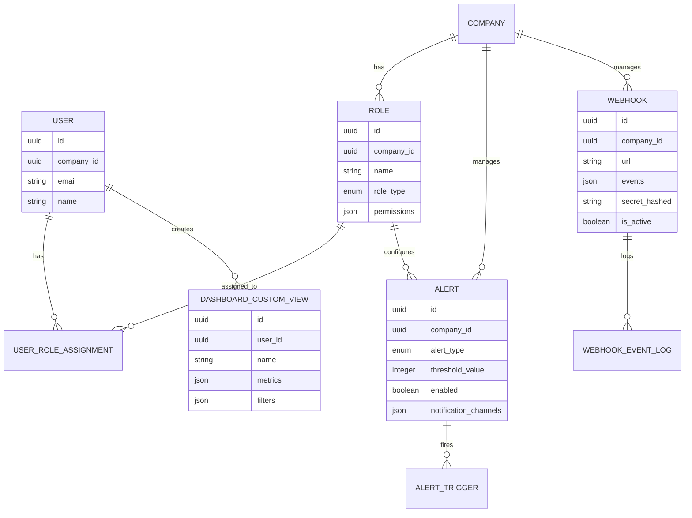

# 06 Enterprise FO Space

**Version:** MVP Juillet 2026 (avec évolutions V1 Septembre+)  
**Status:** 🟢 Spécification en cours  
**Effort estimé:** 90-120h  
**Timeline:** Semaines 5-8 (Phase 3-4 MVP)

---

## 📖 Vue d'Ensemble

### Objectif Métier

Enterprise FO Space est un **portail stratégique multi-level en Front-Office** permettant aux décideurs (directeurs RH = Manager Entreprise, managers de cohort) et aux acteurs opérationnels (coaches) de **piloter l'organisation de formation, l'engagement, et le ROI** via dashboards contextuels, exports, APIs, webhooks, et alertes intelligentes.

**Super-Admin (Pierre)** accède en **Back-Office (WordPress Admin)** uniquement pour : gestion entreprises, suivi données système, configuration rôles/alertes/webhooks, audit trail.

**Alignement SBO :** 
- **Transversal** — agrège données de tous les modules (Formation, Passeport, Coaching, Gamification, JAC)
- **Multi-tenant** — chaque company/organisation voit **UNIQUEMENT ses données** (scoping par company_id)
- **Stratégique** — directeurs RH supervisent portfolio complet; managers supervisent cohorts spécifiques
- **Opérationnel** — coaches et apprenants consultent leurs dashboards (jadis "Back-Office Coaching")
- **Intégratif** — APIs + webhooks permettent sync vers systèmes externes (HRIS, LMS, BI)

### Qui l'Utilise (Rôles)

**Front-Office (React FO) :**
- **Manager Entreprise** (Manager Entreprise) : Vue globale enterprise (sa société), gestion budgets/licenses, création rôles custom, export tous rapports
- **Manager Cohort** (Team Lead) : Vue cohort uniquement, gestion équipe, projets, alertes cohort-spécifiques
- **Coach** (Opérationnel) : Dashboard équipe, validation queue, performance analytics, coaching sessions  
- **Custom Roles (V4+)** : Rôles configurables (Finance, L&D, Operations, etc.)

**Back-Office (WordPress Admin) :**
- **Super-Admin** (System Administrator) : Gestion système (entreprises, utilisateurs, rôles globaux, webhooks, alertes). Accès BO only, peut voir data de TOUTES les entreprises. PAS d'accès FO.

*Note : Apprenant Dashboard est dans Cahier #4 (Profil User), pas ici.*

### Scope — IN / OUT

#### ✅ IN (MVP Juillet)

**Dashboards (5 types)**
- Manager Entreprise dashboard (entreprise overview, budgets, projects, alerts, custom views)
- Manager Cohort dashboard (team progress, projects, performance, cohort alerts)
- Admin dashboard (global stats, by competence, by coach, by segment)
- Coach dashboard (team list, JAC validation queue, performance analytics)
- Apprenant dashboard (ma progression, JAC status, badges, streaks, personal stats)

**Filtres & Customization**
- Filter by competence, status, project, coach, cohort
- Group by status, manager, budget, competence
- Sort by priority, completion, cost, engagement
- Save custom views (Director/Manager)

**Exports**
- CSV exports (apprenants, projects, competences, budgets, GACs, coaching sessions)
- PDF reports (executive summary, monthly report, project report, team roster)

**APIs & Integrations**
- REST API endpoints (OAuth 2.0 authenticated)
- GET endpoints for dashboards, apprenants, projects, budgets, alerts
- POST endpoints for exports, role creation (Super-admin only)
- Rate limiting (1000 req/hour per token)
- API documentation

**Webhooks**
- Event types: project.created, project.completed, apprenant.low_engagement, budget.threshold_reached, alert.triggered
- Webhook management UI (add/remove, test, logs)
- Retry logic (exponential backoff)
- Webhook history

**Alerts (MVP)**
- **Engagement Alert** : apprenant inactif 7+ jours → notify manager/coach
- **Project Alert** : project overdue ou budget >80% → notify director
- **Budget Alert** : company credits spent >80% → notify director
- **License Alert** : active apprenants > license limit → notify super-admin
- Alert configuration UI (threshold customization per alert type)
- Notification channels: in-app + email

**Roles & Permissions (MVP)**
- 3 built-in roles: Manager Entreprise, Manager Cohort, Super-Admin
- Permission matrix enforcement (API + UI level)
- Role assignment UI
- Role-based dashboard access scoping

**Multi-Tenancy**
- Each user associated with company_id(s)
- Dashboards, exports, APIs filtered by user's company scope
- Manager sees only apprenants in their cohort/company
- Director sees all apprenants in their company
- Super-Admin sees system-wide data

#### ❌ OUT (Déféré)

- **Predictive Alerts** (churn risk, budget forecast) → V4+
- **AI Insights** (engagement patterns, competence gaps, ROI analysis) → V4+
- **Custom Role Permissions Engine** (granular per-cohort, per-project scoping) → V4+
- **Leaderboards/Gamification Insights** (best performers, trending badges) → V2 Septembre
- **BI Tool Integrations** (Tableau, PowerBI, Looker) → V4+
- **Slack Alerts** → V4+
- **HRIS/LMS Sync** → V4+
- **Advanced Report Builder** (custom metrics, drill-down) → V2+

### Dépendances Critiques

**Dépend de:**
- **Cahier #2 (Passeport Compétences)** → Competence data, Dreyfus levels (for analytics dashboards)
- **Cahier #1 (Formation & Learning Space)** → Project/Parcours data, completion metrics
- **Cahier #3 (Onboarding & User Profile)** → User roles, company assignments, cohort structure
- **Cahier #4 (Coaching & 1-1 Messaging)** → Coaching sessions, validation queue, coach performance
- **Cahier #5 (Gamification & Badges)** → Badge/XP data for analytics dashboards
- **Cahier #8 (Back-Office & Analytics)** → Tracking tables, analytics views, performance data (will detail metrics in cahier 8)

**Bloque:**
- **Cahier #12 (Masterclass & Classes)** → Depends on Enterprise FO for registrations, attendance analytics
- **Cahier #9 (Journal de Bord)** → Depends on dashboards for reflection tracking analytics

---

## 📱 Écrans à Concevoir

### Front-Office (React FO)

| Écran | Rôle | Description | Priorité |
|-------|------|-------------|----------|
| **Manager Entreprise Portal** | Manager Entreprise | Landing page avec 4 sections: Enterprise Overview (KPIs sa société), Budget & Licenses, Top Projects, Alerts & Insights. Multi-level filters, custom view builder, export buttons. Real-time metrics. Vue filtrée par company_id. | P0 |
| **Manager Cohort Dashboard** | Manager Cohort | Team Progress (apprenants, active, completion%), Project Tracking (3 types), Team Performance (JAC%, badges, competence coverage). Filters by cohort only. | P0 |
| **Coach Dashboard** | Coach | Team roster (apprenants, JAC status), Validation Queue (submitted JACs ready for review), Team Analytics (completion trends, competence performance). | P1 |
| **Dashboard Journal KPIs** | Manager Entreprise / Coach | Team journal engagement KPIs (% apprenants with ≥1 entry, avg entries/week, sentiment trend positive/neutral/negative %, coach supervision adoption % with sharing enabled). Drill-down by learner if sharing enabled. Filtered by company/cohort. | P1 |
| **Manager Onboarding Analytics** | Manager Entreprise | KPI section displaying onboarding completion status ("X/Y Complétés — X%") with "Voir le détail" button opening modal showing learner table (Apprenant \| Status \| % Complété \| Temps Passé \| Dreyfus Assignés \| Actions). Filtered to manager's company. | P0 |
| **Coach Onboarding Supervision** | Coach | Onboarding progress view for assigned learners (same table format as Manager modal but filtered to coach's learners only). Shows status, completion %, time spent, competencies assigned. | P1 |
| **Alerts Configuration** | Manager Entreprise/Manager Cohort | UI to set engagement threshold (days inactivity), project alert threshold, budget threshold (%). Enable/disable per alert type. (Super-admin config en BO) | P0 |
| **Custom Views Builder** | Manager Entreprise/Manager Cohort | Drag-drop UI to create custom dashboards: select metrics, filters, grouping, chart type, save as view. | P1 |
| **Export Dialog** | Manager Entreprise/Manager Cohort | Select report type (apprenants, projects, competences, budgets), format (CSV/PDF), date range, export. | P0 |
| **Webhooks Management (View Only)** | Manager Entreprise | Can view webhook status + logs for their company webhooks. Cannot create/edit (Super-admin does in BO). | P2 |
| **API Documentation** | Developer | Auto-generated API docs (Swagger/OpenAPI), endpoints, authentication, rate limits, example requests/responses. | P0 |
| **Manager Pool Funding Dashboard** | Manager Entreprise | Location: /company/credit-pool. Displays: Pool balance widget (total + available), two action buttons ("Add Credits via Card" OR "Request a Quote"), Devis section (Pending + Signed history), consumption tracker (this month), recent transactions table. Real-time balance + trends. | P0 |
| **Company Learner Pool Widget** | Company Learner | Location: Dashboard, booking pages. Displays: "Company Credit Pool: [X] credits available". View-only display. If insufficient: "Contact [Manager Name] to request credits". | P0 |
| **Devis Signature Page** | Company Manager | Location: Public link from email/dashboard ("Sign Now"). Displays: Devis PDF (side by side or embedded), digital signature pad (canvas, mobile-responsive), "Confirm & Sign" button, preview of signed devis. Signature token validated, one-time use, time-limited (30 days). | P0 |
| **Credit Consumption Dashboard** | Manager Entreprise | Location: /company/dashboard. Displays: Total pool balance + sparkline trend, Consumption by service (Coaching: X, Badge: Y, Atelier: Z), Consumption by learner (table, top consumers), Forecast ("At current rate, depletes in N days"), CSV export for accounting. | P1 |

**Note:** Apprenant Dashboard personnel est dans Cahier #4 (Profil User), pas ici. Pas d'Admin Dashboard ou Super-Admin Dashboard en FO.

### Back-Office (WordPress Admin)

| Écran | Rôle | Description | Priorité |
|-------|------|-------------|----------|
| **Companies List** | Super-Admin | List all companies with CRUD operations. Columns: Name, Status (Active/Inactive), User Count, Budget Allocation, Last Activity. Actions: Edit, View Details, Assign Manager, Configure Alerts. | P0 |
| **Company Details & Suivi Données** | Super-Admin | Dashboard pour 1 entreprise : Statistics (total apprenants, active, completion%, JAC metrics), Cohorte breakdown (list + metrics per cohort), Recent alerts triggered, Webhook status. Can manually trigger exports for audit. | P0 |
| **User Role Management** | Super-Admin | Create/edit/delete roles, assign permissions per role, test permission matrix. Audit trail. Built-in roles + custom role engine. | P0 |
| **Alert Rules Engine** | Super-Admin | Define alert rules (type, trigger, threshold, notification channels, escalation). System-wide thresholds can be overridden per company. | P0 |
| **Webhooks Management** | Super-Admin | Full CRUD: List webhooks (all companies), add/edit/delete webhook (URL, events, secret), test delivery, view logs, retry failed. Webhook health dashboard. | P0 |
| **Analytics Data Explorer** | Super-Admin | Query builder for system-wide analytics, metric definitions, filter/grouping. For debugging + audit. | P1 |
| **System Audit Trail** | Super-Admin | Log all actions: role changes, alert config changes, webhook config changes, exports generated, API rate limit violations. Searchable. | P0 |
| **Analytics BO Dashboard** | Super-Admin | Real-time metrics aggregator (pulls from tracking tables in cahier #8 via WordPress queries). System health, API performance, webhook delivery stats, user activity. | P0 |

---

## ⚙️ Fonctionnalités (MVP)

### Core

1. **Manager Entreprise Portal** (FO React)
   - Enterprise Overview section (total apprenants IN THEIR COMPANY, active parcours, engagement rate %, completion rate %, cost per apprenant)
   - Budget & Licenses section (total budget for THEIR COMPANY, spent, remaining, cost per module, cost per competence breakdown)
   - Top Projects section (3 types: Formation, Upskilling, Déploiement IA; status, budget allocation, ROI if V2+) — FILTERED BY COMPANY
   - Alerts & Insights section (low engagement alerts, projects at risk, budget alerts) — COMPANY SCOPED
   - Real-time updates (data refreshes every 5 minutes)
   - **Note:** Manager Entreprise sees ONLY their company data. No cross-company visibility.

2. **Manager Cohort Dashboard**
   - Team Progress: apprenants assigned, active (7+ days), completion rate %, avg engagement score
   - Project Tracking: formation sessions (count, status), upskilling plans (count, completion %), IA deployment (status, phase)
   - Team Performance: JAC completion %, badge adoption %, competence coverage %
   - Cohort-only view (no cross-cohort visibility)

3. **Admin Dashboard**
   - Global Stats: total JACs, completion rate %, avg validation time (days), Dreyfus distribution
   - By Competence: table (competence, JACs created, completed, %), chart (completion per competence), gap analysis
   - By Coach: table (coach name, apprenants assigned, JACs validated, avg validation time, rejection rate)
   - By Apprenant Segment: parcours progression, cohort view, trends over time

4. **Coach Dashboard**
   - Team Roster: list apprenants (JAC status per apprenant, filters by competence/status, bulk actions)
   - Validation Queue: submitted JACs ready for coach review (count, recent submissions, click to validate)
   - Team Stats: JACs assigned, completed, %, validation time, Dreyfus distribution
   - Completion Trends: last 3 months (bar chart), competence performance (which most/least validated), top performers

5. **Apprenant Dashboard**
   - JAC Progression Cards: by status (Pending, In Progress, Submitted, Validated, Rejected)
   - Personal Stats: JACs completed, level distribution (Apprenti%, Junior%, Confirmé%, Expert%), avg score, completion rate %
   - Upcoming JACs: with deadlines, overdue JACs highlighted

6. **Company Credit Pool Management (MVP)**
   - **Manager Pool Funding Dashboard** (Manager Entreprise only)
     - View current company pool balance (total + available credits)
     - Request credit purchase via WooCommerce (card payment) OR devis (quote for manual invoice)
     - View history of all devis: pending signatures, signed, expired
     - Monitor credit consumption by team/individual
   - **Company Learner Credit Access**
     - Company learners (employees) use company pool credits instead of personal wallet
     - No personal credit purchase for company employees (all credits pooled at company level)
     - Manager can set allocation limits per team (V2 feature, deferred)
   - **Devis Management (Auto-Generated Quotes)**
     - Manager requests devis → PDF auto-generated with company logo, credit breakdown, signature block
     - Share devis link via email or dashboard
     - Digital signature capture on devis (manager/approver signs)
     - Upon signature: Credits allocated atomically to company pool
     - Pierre invoices manually off-platform (devis serves as approval document)

7. **Journal Entries Monitoring** (Manager Entreprise / Coach FO)
   - Dashboard Journal KPIs: % apprenants with ≥1 entry, avg entries/week, sentiment analysis (positive/neutral/negative %), coach supervision adoption (% with sharing enabled)
   - Team journal entries visible ONLY if apprenant enabled sharing with Coach/Manager role
   - Per-learner drill-down: see submitted entries + coach comments (filtered by sharing permission)
   - Tracked events: journal_entry_created, journal_entry_published, journal_comment_added, journal_sharing_enabled/disabled
   - Data aggregated from Cahier #7 (Journal) + Cahier #10 (Analytics)
   - Access scoped: Manager sees company data, Coach sees assigned learners only

8. **Multi-Level Filtering**
   - By competence, status, project, coach, cohort, date range
   - Group by status, manager, budget, competence
   - Sort by priority, completion %, cost, engagement
   - Save custom views (Director/Manager only)

9. **Exports**
   - CSV: apprenants (id, email, engagement_rate, completion_rate, cost), projects (name, type, status, budget, ROI), competences (name, coverage%, avg_level), budgets (project, allocated, spent, remaining)
   - PDF: monthly executive summary, project detail report, team roster with metrics

10. **REST APIs**
   - `GET /api/enterprise/dashboard/metrics` → director dashboard data
   - `GET /api/enterprise/apprenants` → apprenant list with filters
   - `GET /api/enterprise/projects` → project list with status
   - `GET /api/enterprise/budgets` → budget tracking
   - `GET /api/enterprise/alerts` → active alerts
   - `POST /api/enterprise/export` → trigger CSV/PDF export
   - `POST /api/enterprise/roles` → create custom role (Super-admin only)
   - `PUT /api/enterprise/settings` → update alert thresholds, company config
   - Authentication: OAuth 2.0, JWT tokens
   - Rate limiting: 1000 req/hour per token, 100 req/min burst

11. **Webhooks**
   - Events: `project.created`, `project.completed`, `apprenant.low_engagement`, `budget.threshold_reached`, `alert.triggered`
   - Webhook management UI: add/remove/test/logs
   - Retry logic: exponential backoff (1s, 2s, 4s, 8s, 16s max)
   - Max retries: 5
   - Event payload: standard JSON with timestamp, event type, data

12. **Alerts (Multiple Types)**
    - Engagement Alert: apprenant inactive 7+ days → notify manager + coach (in-app + email)
    - Project Alert: project overdue OR budget >80% → notify director (in-app + email)
    - Budget Alert: company credits spent >80% → notify director
    - License Alert: active apprenants > license limit → notify super-admin
    - Alert config UI: customize thresholds per company, enable/disable per alert type
    - Alert history: view past alerts, remediation actions

13. **Roles & Permissions (MVP)**
    - Manager Entreprise: view global dashboards, manage budgets, manage cohorts, create custom roles, export all reports, API read + limited write
    - Manager Cohort: view cohort dashboards only, manage team assignments, manage cohort projects, export cohort reports, API read cohort only
    - Super-Admin: view all dashboards, manage users, manage roles, system settings, API full access, webhooks config
    - Permission matrix enforced at API + UI level
    - Role assignment UI (Super-admin assigns roles to users)

14. **Multi-Tenancy Scoping**
    - User.company_id association (can be multiple companies for super-admin)
    - Dashboards filtered: show only data where company_id matches user's company
    - APIs scoped: return only user's company data
    - Manager Cohort sees only apprenants in their cohort/company
    - Manager Entreprise sees all apprenants in their company (not cross-company)
    - Super-Admin (BO only) can view any company + system-wide data

### Back-Office (WordPress Admin) Core

15. **Company Management** (Super-Admin BO only)
    - List all companies (Name, Status, User Count, Budget, Last Activity)
    - Create company, Edit company details, Activate/Deactivate company
    - Assign Manager Entreprise to company
    - View company billing + subscription info
    - Monitor company data usage (storage, API calls)

16. **Company Data Suivi** (Super-Admin BO only)
    - Dashboard per company: Statistics (total apprenants, active, completion%, JAC metrics, cost analysis)
    - Cohort breakdown: List all cohorts + metrics per cohort (Manager Cohort assignments, completion%, team size)
    - Recent Alerts triggered for this company (list, status, resolution)
    - Webhook delivery status for company webhooks
    - Manual export trigger for audit (export apprenant data, projects data, etc.)
    - Data quality check (orphaned records, missing data, etc.)

17. **System-Wide Roles & Permissions** (Super-Admin BO only)
    - Manage built-in roles: Director RH → Manager Entreprise, Manager Cohort, Super-Admin (create, edit, delete)
    - Manage custom role templates (Finance, L&D, Operations, etc.)
    - Assign roles to users (bulk operations available)
    - Test role permissions (impersonate user, check access)
    - Audit trail: who assigned what role when

18. **Alert Configuration** (Super-Admin BO only)
    - System-wide alert thresholds (engagement 7+ days, budget 80%, license 100%)
    - Override per-company thresholds (some companies may need different settings)
    - Alert notification channels (in-app, email, [Slack in V2+])
    - Alert escalation rules (if alert not resolved in X hours, escalate to Y)
    - Test alert triggering (manually trigger alert to test delivery)

19. **Webhooks Management** (Super-Admin BO only)
    - Full CRUD: Create, List, Edit, Delete webhooks (across all companies)
    - Webhook details: URL, events, secret, status, health score
    - Webhook health dashboard: delivery success rate, failed deliveries, retry attempts
    - View webhook event logs (all companies): timestamps, status, latency, error messages
    - Retry failed webhook deliveries manually
    - Webhook secret rotation (for security)

20. **System Audit Trail** (Super-Admin BO only)
    - Searchable log of all system actions: role changes, alert config changes, webhook config changes
    - Company-specific: exports generated, user assignments, data changes
    - API audit: failed auth, rate limit violations, permission denied
    - Timestamp, actor (which super-admin), action, details, result

### Secondary

1. **Custom Views Builder** — Drag-drop UI to create custom dashboards (select metrics, filters, grouping, chart type, save)
2. **Alert Notification Channels** — In-app notifications + email (SMS in V2+)
3. **Data Export Scheduling** — Schedule periodic exports (daily/weekly/monthly) to email
4. **API Key Management** — Generate/revoke API keys per user, track usage
5. **Dashboard Presets** — Template dashboards (Finance, L&D, Operations) ready to customize
6. **Real-Time Notifications** — WebSocket support for live dashboard updates (V1+)
7. **Mobile-Responsive Dashboards** — All dashboards work on mobile (responsive React)

---

## 🚀 Possible Évolutions (V2+)

### V2 Septembre 2026
- **Advanced Alerts** : Configurable escalation (if manager doesn't act in 3 days, escalate to director)
- **Alert Analytics** : Trend analysis (which alerts triggered most? most resolved?)
- **Leaderboards/Gamification Insights** : Best performers, trending badges, team competition
- **Advanced Exports** : Excel with pivot tables, schedule exports
- **Slack Alerts** : Send alerts to Slack channels
- **Real-Time WebSocket** : Live dashboard updates (engagement, project status changes)

### V3-V4 (2027+)
- **Predictive Alerts** : Churn risk (ML), budget forecast, project delay risk
- **AI Insights** : Engagement patterns (what drives engagement?), competence gaps (where org is weak?), ROI analysis (cost per competence, per project)
- **Custom Role Permissions Engine** : Fine-grained per-cohort, per-project, per-module scoping
- **BI Tool Integrations** : Tableau, PowerBI, Looker direct connectors
- **HRIS Sync** : Import org structure, employees from HR system
- **LMS Sync** : Pull learner data from legacy LMS
- **Advanced Report Builder** : Custom metrics, drill-down, data storytelling
- **Dashboard Plugins** : Community dashboards, third-party integrations

---

## 👥 User Journeys (Format 3)

### User Journey #1 : Manager Entreprise → Découvrir le Portail & Créer un Rapport Custom

**Acteur :** Manager Entreprise (director@company.com)  
**Déclencheur :** Premier accès à Enterprise FO après onboarding, ou besoin de générer rapport mensuel  
**Objectif :** Accéder au portail stratégique, comprendre KPIs clés, créer un rapport custom à exporter

#### Étapes Détaillées

1. **Director se connecte au portail Enterprise FO**
   - URL: `/enterprise/dashboard`
   - Système vérifie `user.role = 'Manager Entreprise'` et `user.company_id` (filtre automatique)
   - Page charge données dashboards (Director overview, budgets, projects, alerts)
   - Feedback: Page loads ~1.5s, affiche skeleton loading + spinner
   - Data : Données depuis cache (5 min TTL), sinon requête API
   - Durée: ~1.5s initial load, instant on cache hit

2. **Portail affiche Enterprise Overview section**
   - 5 KPI cards: Total Apprenants (1234), Active Parcours (45), Engagement Rate (72%), Completion Rate (65%), Cost per Apprenant (€250)
   - Real-time color coding: 🟢 Green (>75%), 🟠 Orange (50-75%), 🔴 Red (<50%)
   - Timestamps: "Updated 2 mins ago", refresh button available
   - Feedback: Cards animate in sequence (100ms stagger), interactive hover expands detail
   - Durée: Instant (server-sent data already loaded)

3. **Director clique sur "Budget & Licenses" section**
   - Collapse/expand toggle
   - Affiche: Total Budget (€50,000), Spent (€42,000), Remaining (€8,000)
   - Pie chart: Spent % by Module (Formation 40%, Coaching 30%, Gamification 10%, Upskilling 20%)
   - Cost breakdown table: Module | Allocated | Spent | % | Remaining
   - Feedback: Section smoothly expands, pie chart animates, table scrollable on mobile
   - Durée: Instant (cached)

4. **Director voit "Top Projects" section**
   - 3 project cards: Formation Q2 (In Progress, 75% budget), Upskilling Program (Completed), IA Deployment (Pending)
   - Cards include: Project name, type, status badge, budget bar, deadline
   - Feedback: Cards show hover state (shadow, expand), click opens project detail modal
   - Durée: Instant

5. **Director voit "Alerts & Insights" section**
   - Red alert: "12 apprenants inactif 7+ days — click to email manager"
   - Yellow warning: "IA Deployment project 3 days overdue — escalate?"
   - Orange warning: "Budget spent 84% — request director approval to overspend"
   - Each alert has action button (Dismiss, Escalate, Email)
   - Feedback: Alerts sorted by severity (red > yellow > orange), timestamps show when triggered
   - Durée: Instant

6. **Director clique "Create Custom Report" button**
   - Modal opens: "Build Custom Dashboard"
   - Step 1: Select metrics (checkboxes): Apprenants, Engagement %, Completion %, Cost per Apprenant, JAC Distribution, etc.
   - Step 2: Filters (multi-select): by Competence, by Project, by Cohort, date range picker
   - Step 3: Grouping (radio): by Status, by Manager, by Budget, by Competence
   - Step 4: Export format (radio): CSV, PDF, preview
   - Feedback: Multi-step form, validation before save (at least 2 metrics selected), clear "Cancel" + "Save View" buttons
   - Durée: ~5 seconds total UI interaction

7. **Director selects metrics: Apprenants, Engagement %, Completion %**
   - Checkboxes marked
   - Preview pane on right shows: "Selected 3 metrics. Preview data?"
   - Feedback: Real-time validation (✓ metrics OK, need filter), button "Next" becomes enabled
   - Durée: Instant

8. **Director applies filter: Competence = "Leadership"**
   - Filter UI: dropdown selects "Leadership"
   - Preview updates: shows apprenants with Leadership competence (423 apprenants)
   - Feedback: Data count updates in real-time, row count shown ("423 rows matching filter")
   - Durée: ~200ms API call

9. **Director groups by "Status"**
   - Grouping option selected (radio button)
   - Preview updates: shows data grouped by JAC status (Pending, In Progress, Submitted, Validated, Rejected)
   - Feedback: Table reorganizes, group headers highlighted, count per group shown
   - Durée: Instant (client-side grouping)

10. **Director selects export format: PDF**
    - Radio button selected
    - Preview updates: shows formatted PDF layout (title, date, filters applied, table, charts)
    - "Export PDF" button becomes enabled
    - Feedback: Preview renders document, download link ready
    - Durée: ~800ms to render PDF preview

11. **Director clicks "Export PDF"**
    - Backend job triggered: `POST /api/enterprise/export` with report config
    - Response: "Export in progress... (~10s)"
    - File downloads to browser: `Leadership_Report_2026-05-10.pdf`
    - Feedback: Success toast: "Report exported! Leadership_Report_2026-05-10.pdf"
    - Modal closes, Director back to main dashboard
    - Durée: ~10s total (generation + download)

12. **Director saves custom view for reuse**
    - Before closing modal, clicks "Save As View"
    - Prompt: "View name? e.g., 'Leadership Monthly Report'"
    - Input field, Director types name
    - Feedback: Success toast: "View saved! You can reuse this anytime from 'My Views' dropdown"
    - View appears in "My Saved Views" dropdown in dashboard (top right)
    - Durée: Instant

#### Conditions de Succès ✅
- [ ] Director can view all 5 KPI sections without scrolling (responsive design)
- [ ] All metrics load <2s on first visit, instant on cache hit
- [ ] Custom report builder saves user's selections
- [ ] PDF exports contain accurate data, correct filters applied
- [ ] Saved views appear in dropdown and reload correctly
- [ ] Alert actions work (dismiss = remove from list, email = sends to manager, escalate = moves to director queue)
- [ ] Company scoping enforced: Director only sees apprenants from their company
- [ ] Role permissions enforced: Director cannot access Super-admin settings

#### Erreurs & Edge Cases ❌

**Cas 1 : Director accède au portail mais company a 0 apprenants**
- Scénario : Nouvelle company vient de s'inscrire, aucun apprenant onboarded
- Comportement attendu:
  - Dashboard charge normalement
  - KPI cards affichent: Total Apprenants (0), Active Parcours (0), Engagement Rate (N/A), Completion Rate (N/A)
  - Budget & Licenses section: shows "No data yet — invite apprenants to get started"
  - Projects section: "No projects yet — create one in Déploiement IA"
  - Alerts: "No active alerts"
  - Feedback: Gray-out inactive sections, show helpful CTAs ("Create First Project")
- Impact: Setup flow smoother, director doesn't see errors

**Cas 2 : Director tries to export 50,000+ rows**
- Scénario : Large company, director exports all apprenants + all projects (massive dataset)
- Comportement attendu:
  - Export dialog warns: "This will export 50,000+ rows. Processing may take 30-60s. Continue?"
  - If yes: backend queues async job, returns job_id
  - Director sees: "Export processing... We'll email you when ready (job_id: xyz)"
  - Email received in 30s: "Your export is ready! Download link (expires in 7 days)"
  - Feedback: No UI blocking, director continues using dashboard
- Impact: Performance protected, large exports don't crash server

**Cas 3 : Director's API token rate limit exceeded**
- Scénario : Director auto-refreshing dashboard every 10s (misconfigured polling)
- Comportement attendu:
  - API returns 429 (Too Many Requests)
  - Dashboard shows yellow warning: "Rate limit reached. Refresh in 30s"
  - Auto-refresh pauses, manual refresh disabled
  - After 30s: "Rate limit reset. Refresh your dashboard?"
  - Feedback: Clear message, suggests checking refresh frequency, link to API docs
- Impact: Graceful degradation, prevents API hammering

**Cas 4 : Webhook delivery fails (network timeout)**
- Scénario : Director configured webhook to external BI tool, but endpoint is down
- Comportement attendu:
  - First attempt: timeout → retry scheduled
  - Exponential backoff: 1s, 2s, 4s, 8s, 16s (5 retries max)
  - After 5 failed retries (30s total): webhook marked "Failed"
  - Director notified: "Webhook delivery failed. Check endpoint or disable webhook."
  - Super-admin sees in logs: timestamp, error code, retry count
  - Feedback: Clear error message, logs available for debugging
- Impact: Issues traceable, director knows to fix external system

**Cas 5 : Director lacks permission to create custom roles**
- Scénario : Manager tries to access "Roles & Permissions" section
- Comportement attendu:
  - Section not visible in UI (role-based menu filtering)
  - If manager somehow navigates to `/enterprise/roles`, redirected to `/enterprise/dashboard`
  - Flash message: "You don't have permission to manage roles. Contact super-admin."
  - Feedback: Clear permission boundary, no confusing 403 errors
- Impact: Prevents accidental access, guides user to right person

**Cas 6 : Director's company scoping misconfigured (user has no company_id)**
- Scénario : Data migration issue, director's user record missing company_id
- Comportement attendu:
  - Director logs in, system detects `company_id = NULL`
  - Dashboard loads but shows: "Your account is not assigned to a company. Contact super-admin."
  - No data displayed (safe fallback)
  - Super-admin receives alert: "User without company assignment: director@company.com"
  - Feedback: Clear error, escalation path
- Impact: Security (prevents data leakage), debuggable

**Cas 7 : Custom view name conflicts with existing view**
- Scénario : Director tries to save view with name already used
- Comportement attendu:
  - Save dialog validation: "This view name already exists. Overwrite or rename?"
  - Radio buttons: "Overwrite existing" vs "Save as new (auto-rename to 'Leadership Monthly Report (2)')"
  - Feedback: Prevents accidental overwrite, clear options
- Impact: Data preservation, undo-friendly

---

### User Journey #2 : Manager Cohort → Consulter Tableau de Bord Équipe & Alerter sur Inactivité

**Acteur :** Manager Cohort (manager@company.com, manages 25 apprenants)  
**Déclencheur :** Daily check-in ou notification d'alerte inactivité  
**Objectif :** Voir progression équipe, identifier apprenants inactifs, déclencher action (email/call)

#### Étapes Détaillées

1. **Manager se connecte à Enterprise FO**
   - URL: `/enterprise/dashboard`
   - Système vérifie `user.role = 'Manager'`, `user.cohort_id`, `user.company_id`
   - Dashboards filtered: shows only Manager's cohort + company
   - Feedback: Page loads ~1.5s, skeleton loading + spinner
   - Durée: ~1.5s

2. **Manager voit "Team Progress" section (auto-loaded)**
   - Cards: Apprenants Assigned (25), Active (7 days) (18), Completion Rate (62%), Avg Engagement (7.3/10)
   - Color coding: 🟢 Active >75%, 🟠 Caution 50-75%, 🔴 Low <50%
   - Feedback: Cards display immediately, bar chart showing trend (last 4 weeks)
   - Durée: Instant

3. **Manager voit "Project Tracking" section**
   - Formation Sessions: 5 assigned, 3 completed (60%)
   - Upskilling Plans: 8 active, 2 overdue (deadline 3 days ago)
   - IA Deployment: Phase 2 (STRIDE), on track
   - Status badges: ✓ On Track, ⚠️ At Risk, ❌ Overdue
   - Feedback: Each project card shows status, progress bar, deadline
   - Durée: Instant

4. **Manager clique sur "Team Performance" section**
   - JAC Completion: 62%
   - Badge Adoption: 45%
   - Competence Coverage: 78%
   - Feedback: Section expands, shows detail metrics
   - Durée: Instant

5. **Manager notices alert: "5 apprenants inactif 7+ days"**
   - Alert displayed red, in "Alerts & Insights" section
   - Alert shows: icon + message + action buttons ("View Details", "Email Team", "Dismiss")
   - Manager clicks "View Details"
   - Feedback: Modal opens showing list of 5 inactive apprenants (name, email, last activity date, days inactive)
   - Durée: ~200ms to load modal

6. **Manager reviews inactive apprenants list**
   - Table: Name | Email | Last Activity | Days Inactive | Last Action Taken
   - Anne Dubois | anne@... | 2026-05-03 | 7 days | Started JAC (pending)
   - Marc Lemoine | marc@... | 2026-05-01 | 9 days | Completed Formation
   - [3 more]
   - Filters available: by competence, by project, by JAC status
   - Feedback: Table sorted by "Days Inactive" descending, hovering on row highlights
   - Durée: Instant

7. **Manager selects action: "Email Team"**
   - Clicks button in modal
   - Email compose window opens (pre-filled):
     - To: [5 inactive apprenants emails]
     - Subject: "Follow-up: Let's get back on track! 🚀"
     - Body template: "Hi [Name], I noticed you haven't been active on the learning platform for [X] days. Your growth matters! Here's what's next: [list pending JACs/formation]. Let's catch up — when's a good time this week?"
   - Manager can edit subject, body
   - Feedback: Rich text editor, @mention manager name for personalization, character count
   - Durée: ~500ms to open compose

8. **Manager customizes email, adds personal note**
   - Edits subject: "Quick check-in: Let's finish your Upskilling Plan 💪"
   - Adds note: "Anne and Marc, I'm here to help — let me know what blockers you're facing."
   - Selects "Add Manager Calendar Link" (Outlook/Google Calendar embed)
   - Feedback: Preview shows formatted email with manager's signature automatically added
   - Durée: ~30s user typing

9. **Manager clicks "Send"**
   - Backend job: `POST /api/enterprise/alerts/{alert_id}/email` with recipient list, email body
   - Response: "Email sent to 5 apprenants"
   - Toast notification: "✓ Sent reminder email. Follow-up in 3 days?"
   - Alert status changes to "Acknowledged" (removes red badge, marks as "In progress")
   - Feedback: Success toast closes after 3s, alert remains in history (not deleted)
   - Durée: ~1s to send batch email

10. **Manager filters dashboard by "Upskilling" project**
    - Clicks filter dropdown, selects "Upskilling Plans"
    - Dashboard updates: shows only apprenants assigned to Upskilling (8 apprenants)
    - Team Performance card updates: "JAC Completion (Upskilling): 50%" (4/8)
    - Feedback: Table refreshes, title updates to "Team Progress — Upskilling Plans (8 apprenants)"
    - Durée: ~300ms API call

11. **Manager sees 2 apprenants overdue on Upskilling**
    - Table shows: Sophie Martin (9 days overdue), Thomas Blanc (5 days overdue)
    - Manager clicks on Sophie's row
    - Feedback: Expands detail view showing Sophie's JACs (which ones completed, which pending, deadline dates)
    - Durée: ~200ms to load detail

12. **Manager takes action: Reassign Sophie's overdue JAC to another coach**
    - Clicks "Reassign JAC" button in detail panel
    - Popup: "Select coach to reassign" (dropdown list of coaches)
    - Manager selects "Coach Anne"
    - Feedback: "JAC reassigned to Coach Anne. Sophie & Coach Anne will be notified."
    - Sophie's row updates: "Coach: Anne" instead of previous coach
    - Durée: ~500ms notification sent

#### Conditions de Succès ✅
- [ ] Manager only sees their cohort (no cross-cohort visibility)
- [ ] Alerts load within 1.5s on page load
- [ ] Email template pre-filled with correct apprenants, customizable
- [ ] Batch email sends to 5+ apprenants without timeout
- [ ] Filters update dashboard in <500ms
- [ ] Reassign action updates UI + notifies affected parties
- [ ] Alert marked "Acknowledged" after action taken
- [ ] Manager cannot see other cohorts' data (enforced at API level)

#### Erreurs & Edge Cases ❌

**Cas 1 : Email delivery fails (SMTP error)**
- Scénario : Manager tries to email 5 apprenants, but mail server is down
- Comportement attendu:
  - API returns 500 error
  - Toast shows: "Email delivery failed. Try again or notify super-admin."
  - Alert remains in "Pending" state (not marked acknowledged)
  - Feedback: Manager can retry, clear error message
- Impact: Transaction safety (don't mark alert resolved if email didn't send)

**Cas 2 : Manager filtered to a project with 0 apprenants**
- Scénario : Manager filters by "IA Deployment", but no apprenants assigned yet
- Comportement attendu:
  - Dashboard shows: "No apprenants assigned to this project yet."
  - Team Progress cards show: (0), (0), N/A
  - Empty state with CTA: "Assign apprenants to this project"
  - Feedback: Clear, helpful message
- Impact: No confusing blank dashboard

**Cas 3 : Manager's alert count exceeds 50**
- Scénario : Multiple days of no check-ins, dozens of low engagement alerts accumulated
- Comportement attendu:
  - Alert section shows: "50+ active alerts. Viewing 10 most recent. View all?"
  - Manager clicks "View all alerts" → opens alert log (paginated, 10 per page)
  - Feedback: Alerts sorted by recency + severity
- Impact: Performance, doesn't render 50+ alerts at once

---

### User Journey #3 : Super-Admin → Créer Rôle Custom & Configurer Permissions — Back-Office (WordPress Admin)

**Acteur :** Super-Admin / System Administrator (admin@company.com)  
**Déclencheur :** Nouvelle requirement (e.g., "Finance director needs to see budgets but NOT apprenant data")  
**Objectif :** Créer rôle custom "Finance Director" en Back-Office, assigner permissions finales, tester avec WordPress admin panel

#### Étapes Détaillées

1. **Super-Admin accède à WordPress Admin → Roles & Permissions**
   - URL: WordPress admin panel → Enterprise Settings → Roles & Permissions (BO only, not FO React)
   - Page affiche: Built-in roles (Manager Entreprise, Manager Cohort, Coach, Super-Admin), Custom roles (if any)
   - Table: Role | Type | Permissions (summary) | Members | Actions
   - CTA: "Create Custom Role" button (top right)
   - Feedback: Page loads ~1s, list sorted alphabetically
   - Durée: ~1s (WordPress admin)

2. **Super-Admin clique "Create Custom Role"**
   - Modal opens: "New Custom Role"
   - Step 1: Basic Info
     - Role Name: text input (e.g., "Finance Director")
     - Description: text area (e.g., "Can view budgets, projects, cost analytics. Cannot see apprenants.")
     - Color tag: color picker (for UI identification)
   - Feedback: Form validation (role name required, min 3 chars)
   - Durée: ~300ms to render form

3. **Super-Admin enters role name: "Finance Director"**
   - Types into "Role Name" field
   - Validation: ✓ Valid (no duplicates)
   - Description: "Access to budget tracking, project ROI, cost analytics only"
   - Color: Gold/Orange
   - Feedback: Form fields filled, "Next" button enabled
   - Durée: Instant

4. **Super-Admin clicks "Next" → Permission Selection**
   - Page 2: Permission Matrix (checkboxes)
   - Grouped by category: "Dashboards", "Exports", "APIs", "Webhooks", "Settings"
   - Dashboards:
     - [ ] View Director Dashboard
     - [x] View Manager Dashboard (selected)
     - [x] View Admin Dashboard - Limited (Budget section only) (selected)
     - [ ] View Coach Dashboard
     - [ ] View Apprenant Dashboard
   - Exports:
     - [x] Export CSV (selected)
     - [x] Export PDF (selected)
     - [ ] Schedule Recurring Exports
   - APIs:
     - [x] GET /enterprise/budgets (selected)
     - [x] GET /enterprise/projects (selected)
     - [ ] POST /enterprise/export
     - [ ] POST /enterprise/roles
   - Webhooks:
     - [ ] Manage Webhooks
   - Settings:
     - [ ] Modify Alert Thresholds
     - [ ] Manage Companies
   - Feedback: Checkboxes toggle immediately, summary shows "X permissions selected"
   - Durée: ~500ms to render permission matrix

5. **Super-Admin customizes permissions for Finance Director**
   - Selects: View Admin Dashboard (Budget section only), Export CSV/PDF, GET budgets API, GET projects API
   - UNCHECKS: Everything else (coach dashboard, apprenants, webhooks, settings)
   - Feedback: Summary updates: "5 permissions selected. Cannot view apprenants data, cannot modify settings."
   - Durée: Instant

6. **Super-Admin clicks "Next" → Assign Members**
   - Page 3: Assign Users to Role
   - Search box: "Search apprenants or email"
   - List of all super-admin + directors in company (pre-populated)
   - Super-Admin selects: Marie Dupont (marie@finance.com), Jean Leblanc (jean@finance.com)
   - Feedback: Selected users shown in blue, count shows "2 members selected"
   - Durée: ~200ms search

7. **Super-Admin reviews role before saving**
   - Page 4: Review
     - Role Name: Finance Director
     - Description: Access to budget tracking, project ROI, cost analytics only
     - Permissions: 5 selected (Dashboard budgets only, CSV/PDF exports, 2 budget APIs)
     - Members: Marie Dupont, Jean Leblanc
   - Actions: "Edit", "Save", "Cancel"
   - Feedback: All info clearly displayed, easy to spot mistakes
   - Durée: Instant

8. **Super-Admin clicks "Save"**
   - Backend: `POST /api/enterprise/roles` with role config (BO API)
   - Response: "Role 'Finance Director' created successfully"
   - Redirect to roles list (WordPress admin)
   - Feedback: Toast: "✓ Finance Director role created. Assign more users anytime."
   - New role appears in table: "Finance Director | Custom | 5 permissions | 2 members | Edit / Delete"
   - Durée: ~1s API call

9. **Super-Admin tests role: Impersonate Marie Dupont (BO Testing Tool)**
   - Super-Admin uses "Impersonate User" feature (WordPress admin testing tool)
   - Switches context to Marie's account
   - Navigates to Front-Office dashboard to test FO access
   - Feedback: Marie's FO dashboard loads with role-scoped permissions:
     - ✓ Budget section visible (Admin Dashboard - Budget only)
     - ✗ Director Dashboard (hidden, not in menu)
     - ✗ Coach Dashboard (hidden)
     - ✓ Export buttons (CSV/PDF enabled)
     - ✗ Webhooks section (hidden)
   - Durée: ~1.5s page load as Marie

10. **Super-Admin tests API scoping (BO API Testing)**
    - Uses WordPress admin API explorer tool or curl with Marie's API token
    - GET /api/enterprise/budgets with Marie's credentials
    - Response: ✓ 200 OK (budgets returned, role permissions OK)
    - Tests: GET /api/enterprise/apprenants
    - Response: ✗ 403 Forbidden (permission denied, as expected — not in Finance Director role)
    - Feedback: Clear 403 message: "You don't have permission to view apprenants data. Contact admin."
    - Durée: ~300ms per API call

11. **Super-Admin exits impersonation mode**
    - Clicks "End Impersonation" (top banner)
    - Returns to Super-Admin context
    - Feedback: Flash message: "Exited impersonation mode. Back to admin."
    - Durée: Instant

12. **Super-Admin saves test notes in BO Audit Log**
    - Clicks role "Finance Director" in WordPress admin table → "View Details"
    - Detail panel shows: Created by (Super-Admin), Created at (2026-05-10 14:30), Audit log section
    - Super-Admin adds test note: "Tested 2026-05-10: Dashboard access OK, API scoping OK, apprenants data blocked ✓"
    - Saves note
    - Feedback: Note timestamped, appears in role audit log (BO dashboard)
    - Durée: ~500ms to save

#### Conditions de Succès ✅
- [ ] Custom role created with correct name, permissions, members
- [ ] Role appears in roles list
- [ ] Permission matrix enforced: Marie can access budgets, cannot access apprenants
- [ ] API returns 403 for unauthorized endpoints
- [ ] Impersonation test successful, no data leakage
- [ ] Audit log records role creation + test notes
- [ ] Role can be edited/deleted after creation
- [ ] Multiple custom roles can coexist with built-in roles

#### Erreurs & Edge Cases ❌

**Cas 1 : Super-Admin tries to create role with duplicate name**
- Scénario : Role "Finance Director" already exists
- Comportement attendu:
  - Form validation shows: "✗ Role name already exists. Choose a different name."
  - Input field highlighted in red, "Save" button disabled
  - Feedback: Clear error, suggestion to rename or edit existing
- Impact: Prevents duplicate roles, data consistency

**Cas 2 : Permission matrix has conflicting permissions**
- Scénario : Super-Admin selects "View Admin Dashboard" but unchecks "View Budgets API"
- Comportement attendu:
  - System detects conflict: "⚠️ You've selected Admin Dashboard (includes budget data) but unchecked Budgets API. Inconsistent permissions. Allow?"
  - Radio buttons: "Keep both dashboard + API", "Remove API access", "Remove dashboard access"
  - Feedback: Clear warning, options to resolve
- Impact: Prevents permission logic errors, user chooses resolution

**Cas 3 : User assigned to custom role, then role deleted**
- Scénario : Super-Admin deletes "Finance Director" role that Marie is assigned to
- Comportement attendu:
  - Delete confirmation: "This role has 2 members. What should happen to Marie & Jean?"
  - Options: "Reassign to Manager Entreprise role", "Reassign to Manager role", "Keep users without role (grant no permissions)"
  - Super-Admin chooses "Reassign to Manager Entreprise"
  - Feedback: Users reassigned, role deleted, audit log: "Role deleted, 2 users reassigned to Manager Entreprise"
- Impact: No orphaned users, safe cleanup

**Cas 4 : Impersonation token expires during testing**
- Scénario : Super-Admin impersonating Marie for >30 min, session expires
- Comportement attendu:
  - Marie's dashboard shows: "Your session has expired. Please log in again."
  - Super-Admin sees banner: "Impersonation session ended (timeout). Back to admin mode."
  - Feedback: Clear message, secure (no lingering sessions)
- Impact: Security, prevents session leakage

---

### User Journey #4 : Super-Admin → Configurer Webhooks & Tester Delivery — Back-Office (WordPress Admin)

**Acteur :** Super-Admin / System Administrator  
**Déclencheur :** Integration request (e.g., "Send project completion events to our BI system")  
**Objectif :** Ajouter webhook endpoint en BO, configurer events système-wide, tester delivery, view logs

#### Étapes Détaillées

1. **Super-Admin navigates to WordPress Admin → Webhooks Management**
   - URL: WordPress admin panel → Enterprise Settings → Webhooks (BO only, system-wide configuration)
   - Page displays: List of configured webhooks (if any), "Add Webhook" button
   - Columns: URL | Events | Status | Last Delivery | Actions (Test, Edit, Delete)
   - Feedback: Page loads ~1s
   - Durée: ~1s (WordPress admin)

2. **Super-Admin clicks "Add Webhook"**
   - Modal opens: "New Webhook Configuration"
   - Fields:
     - Webhook URL: text input (e.g., "https://bi-system.company.com/api/events")
     - Webhook Secret: auto-generated 32-char string (copy button)
     - Select Events: checkboxes (project.created, project.completed, apprenant.low_engagement, budget.threshold_reached, alert.triggered)
     - Active: toggle (default ON)
   - Feedback: URL validation (must be HTTPS), secret displayed once (copy to clipboard)
   - Durée: ~300ms to render form

3. **Super-Admin enters webhook URL and selects events**
   - URL: "https://bi-system.company.com/api/events"
   - Validation: ✓ Valid HTTPS URL
   - Events selected:
     - [x] project.created
     - [x] project.completed
     - [x] budget.threshold_reached
   - Feedback: Secret key auto-copied to clipboard (if user clicks copy), selected events count shown "3 events"
   - Durée: Instant

4. **Super-Admin saves webhook (BO API)**
   - Clicks "Create Webhook"
   - Backend: `POST /api/enterprise/webhooks` with URL, events, secret (BO system API)
   - Response: "Webhook created successfully. ID: whk_abc123"
   - Redirect to webhooks list (WordPress admin)
   - Feedback: Toast: "✓ Webhook created. Test it below."
   - New webhook appears in list: URL | 3 events | Active ✓ | — | Test / Edit / Delete
   - Durée: ~1s API call

5. **Super-Admin tests webhook (BO Testing Interface)**
   - Clicks "Test" button next to new webhook (WordPress admin)
   - Modal: "Test Webhook Delivery"
   - Dropdown: "Select event type to test" (project.created, project.completed, budget.threshold_reached)
   - Super-Admin selects: "project.created"
   - Test payload shown: { "event": "project.created", "data": { "id": "prj_123", "name": "Test Project", ... }, "timestamp": "2026-05-10T15:30:00Z" }
   - Feedback: Payload displayed in JSON, editable (for custom BO testing)
   - Durée: ~200ms to render modal

6. **Super-Admin clicks "Send Test Event"**
   - Backend: Sends webhook HTTP POST to "https://bi-system.company.com/api/events"
   - Includes headers: "X-Webhook-Signature: hmac-sha256=abc123..." (signed with secret)
   - Waits for response
   - Feedback: Spinner while waiting ("Sending webhook... ~3s timeout")
   - Durée: ~3-5s for HTTP roundtrip

7. **Webhook delivery succeeds**
   - Response: "✓ Delivery successful (200 OK) in 245ms"
   - Shows response details: Status Code 200, Response Body: { "status": "received", "event_id": "evt_789" }
   - Feedback: Green checkmark, clear success message
   - Durée: Instant (display response)

8. **Super-Admin views webhook delivery logs (BO Dashboard)**
   - Closes test modal
   - Clicks "View Logs" link next to webhook (WordPress admin)
   - Logs page opens: List of all deliveries for this webhook
   - Columns: Event | Timestamp | Status | Latency | Response Code | Actions (View Payload, Retry, Delete)
   - Most recent: project.created | 2026-05-10 15:30:02 | ✓ Delivered | 245ms | 200 OK | View
   - Previous: project.completed | 2026-05-10 14:22:10 | ✓ Delivered | 312ms | 200 OK | View
   - Failed delivery example: budget.threshold_reached | 2026-05-10 12:15:33 | ✗ Failed (5 retries) | — | Timeout | View / Retry
   - Feedback: Sorted by date descending, color-coded status (green = success, red = failed, yellow = pending)
   - Durée: ~500ms API call to load BO logs

9. **Super-Admin checks failed delivery details**
   - Clicks on failed delivery row
   - Detail modal: "Webhook Delivery Details"
     - Event: budget.threshold_reached
     - Timestamp: 2026-05-10 12:15:33
     - Payload: { "event": "budget.threshold_reached", "data": { "company_id": "cmp_123", "budget_spent": "$40,000", "threshold": "$50,000", ... } }
     - Delivery attempts:
       1. Attempt 1 (12:15:33): Timeout (>30s) → Retry scheduled 1s later
       2. Attempt 2 (12:15:34): Timeout → Retry scheduled 2s later
       3. Attempt 3 (12:15:36): Timeout → Retry scheduled 4s later
       4. Attempt 4 (12:15:40): Timeout → Retry scheduled 8s later
       5. Attempt 5 (12:15:48): Timeout → No more retries, marked FAILED
     - Feedback: Clear timeline of retries, exponential backoff visible
   - Super-Admin reason: BI system was down, now it's back up
   - Durée: ~300ms to load detail

10. **Super-Admin retries failed delivery**
    - Clicks "Retry Now" button
    - Backend: Resends webhook HTTP POST to endpoint
    - Response: "✓ Retry successful (200 OK) in 189ms"
    - Logs updated: new entry shows "Retry | 2026-05-10 15:45:12 | ✓ Delivered | 189ms | 200 OK"
    - Feedback: Toast: "✓ Webhook redelivered successfully. Check your BI system."
    - Durée: ~3s for roundtrip

11. **Super-Admin monitors webhook health**
    - Returns to webhooks list
    - Sees summary: "Webhook Health: 98% success rate (489 delivered, 1 failed in last 7 days)"
    - Trend chart: Success rate over time (green line trending up)
    - Feedback: Dashboard-style metrics, actionable insights
    - Durée: Instant

#### Conditions de Succès ✅
- [ ] Webhook created with correct URL, events, secret
- [ ] Test delivery succeeds and responds within 3s
- [ ] Webhook signature (HMAC-SHA256) correctly signed with secret
- [ ] Failed deliveries retry with exponential backoff (1s, 2s, 4s, 8s, 16s)
- [ ] Delivery logs show all attempts, timestamps, response codes
- [ ] Manual retry succeeds and updates logs
- [ ] Webhook health metrics accurate and current
- [ ] External BI system receives events correctly formatted

#### Erreurs & Edge Cases ❌

**Cas 1 : Webhook URL is invalid (HTTP, not HTTPS)**
- Scénario : Super-Admin enters "http://bi-system.company.com/api/events" (not HTTPS)
- Comportement attendu:
  - Form validation: "✗ Webhook URL must be HTTPS (secure). Use https:// instead."
  - Input highlighted in red, "Create" button disabled
  - Feedback: Clear security requirement
- Impact: Enforces secure webhooks, prevents data leakage

**Cas 2 : Webhook endpoint responds with 500 error**
- Scénario : BI system has bug, returns 500 Internal Server Error
- Comportement attendu:
  - Delivery marked FAILED (500 error)
  - Retry triggered automatically (exponential backoff)
  - After 5 failed retries, logged as FAILED
  - Super-Admin alerted: "Webhook delivery failed 5 times. Check endpoint: https://bi-system.company.com/api/events"
  - Alert shows in webhooks list (red badge)
  - Feedback: Clear alert, actionable (debug link to endpoint)
- Impact: Visibility, operator knows system needs attention

**Cas 3 : Webhook secret compromised (leaked in logs)**
- Scénario : Super-Admin accidentally pastes secret in chat/log
- Comportement attendu:
  - Super-Admin can rotate secret (button: "Regenerate Secret")
  - New secret generated: "whk_secret_xyz789"
  - Old secret invalidated (webhook rejects old signatures)
  - Logs: "Secret rotated 2026-05-10 16:00:00 by Super-Admin"
  - Feedback: Clear audit trail, secure rotation
- Impact: Security, quick recovery from compromise

**Cas 4 : Webhook receives duplicate events**
- Scénario : System sends event twice (network retry on client side)
- Comportement attendu:
  - Each event has unique "event_id" (uuid)
  - BI system should deduplicate based on event_id (best practice)
  - Webhook logs show: "Event evt_123 delivered (duplicate attempt 1)" and "Event evt_123 delivered (duplicate attempt 2 - already seen, deduped)"
  - Feedback: Duplicate detection visible in logs
- Impact: BI system can implement idempotency

---

### User Journey #7 : Company Manager → Request Credit Purchase via Devis (Path B)

**Acteur:** Company Manager  
**Déclencheur:** Manager needs more credits, cannot pay directly via card, requests auto-generated devis  
**Objectif:** Request quote PDF, share with stakeholders, sign to allocate credits to company pool

#### Étapes Détaillées

1. **Manager navigates to Pool Funding Dashboard**
   - Opens `/company/credit-pool` → Shows current balance, funding options
   - Sees two buttons: "Add Credits via Card" (CB direct) OR "Request a Quote" (devis)
   - Below: History of all previous purchases + pending/signed devis
   - Widgets: "Company Pool: [X] credits total, [Y] available"
   - Feedback: Page loads ~1s, displays real-time balance
   - Durée: Instant

2. **Manager clicks "Request a Quote"**
   - Modal appears: "Request a Credit Quote"
   - Input field: "How many credits do you need?" (pre-filled suggestions: 50, 200, 500, or custom)
   - Sub-text: "Our team will generate a personalized quote for your organization"
   - Button: "Request Quote"
   - Durée: Instant

3. **Manager enters credit amount and submits**
   - Example: Selects "200 credits"
   - Clicks "Request Quote"
   - Feedback: "Generating quote..." spinner
   - Backend: Validates manager role, captures company info
   - Durée: <1s UI response

4. **Backend generates devis PDF automatically**
   - Query: company info (name, address), manager name, credit amount, pricing (200 credits = €80)
   - Template: Learning App logo, company name, credit breakdown (200 × €0.40 = €80), total EUR, signature block with date, expiry (30 days), terms
   - Store PDF in CDN/S3, create devis DB record with unique signature_token (JWT token with 30-day expiry)
   - Feedback: Modal closes, returns to dashboard
   - Durée: ~2-3s backend processing

5. **Manager receives devis via email + dashboard notification**
   - Email sent to manager: Subject: "Devis #D-20260510-001 - [Company Name] - €80"
   - Email body: "Quote ready: 200 credits for €80. [View & Sign Button]"
   - Dashboard: "Pending Devis" section shows new quote with status badge "Awaiting Signature"
   - Devis row: Credit Amount (200) | Status (Pending) | Requested Date | Signature Link | Actions (Download PDF, Share Link)
   - Feedback: Email + in-app notification ("📄 Quote ready for signature")
   - Durée: <1 minute email delivery

6. **Manager shares with approver (optional, if needed)**
   - Manager can: Forward email OR copy "Share Link" from dashboard
   - Share link: "https://platform.learningsociety.fr/devis/sign/[signature_token]"
   - Approver (CFO, finance) receives link, can sign
   - Durée: Depends on approval process

7. **Manager/Approver opens devis signature page**
   - Opens link from email OR clicks "Sign Now" button in dashboard
   - Page displays:
     - Devis PDF embedded (side-by-side or tab view)
     - Digital signature pad (HTML5 canvas, supports touch/mouse)
     - "Confirm & Sign" button
     - Preview text: "Signed by: [Manager Name] on [Today's Date]"
   - Durée: ~1s page load

8. **Manager/Approver signs devis digitally**
   - Uses mouse/touchpad to draw signature on canvas
   - Signature captured as base64 image
   - Clicks "Confirm & Sign"
   - Feedback: "Processing signature..." spinner
   - Durée: <2s

9. **Signature processed — Credits allocated atomically**
   - Backend: BEGIN TRANSACTION
     - Verify signature_token: not expired, not already signed
     - Store signature: base64 image → DB encrypted field (devis.signature_image)
     - Update: devis.status = 'signed', devis.signed_at = NOW()
     - Update: company_credit_pool.balance_total += 200, balance_available += 200
     - Create: credit_purchases record {source='devis_signed', company_id, credit_amount=200, devis_id, price_eur=80}
     - Log: credit_transaction {type='company_credit_added', source='devis_signed', amount=+200, company_id}
   - COMMIT
   - Feedback: "✅ Devis signed. 200 credits allocated to company pool"
   - Durée: <2s

10. **Confirmation sent to manager + Pierre (off-platform invoicing)**
    - Email (manager): "Devis Signed! ✅"
      - Subject: "Devis #D-20260510-001 signed - €80 - [Company Name]"
      - Body: "Your quote has been signed. 200 credits are now available in your company pool."
      - Attachment: Signed devis PDF
    - Email (Pierre/Finance): "Devis Signed - Invoicing Required"
      - Subject: "Devis #D-20260510-001 - [Company Name] - €80 - Invoice"
      - Body: "Manager [Name] signed devis for 200 credits. Reference: D-20260510-001. Please invoice."
    - Dashboard: Devis moves to "Signed Devis" section, company pool balance updates in real-time
    - Durée: <1 minute

#### Conditions de Succès ✅
- [ ] Devis auto-generated with correct company info + pricing
- [ ] PDF clean, professional (company logo if available, legal terms)
- [ ] Signature link unique + time-limited (30 days)
- [ ] Signature captured securely (base64 + DB encrypted)
- [ ] Credit allocation atomic (all-or-nothing transaction)
- [ ] Manager + Pierre notified after signature
- [ ] Company pool balance updated immediately
- [ ] Signed devis downloadable from dashboard

#### Erreurs & Edge Cases ❌

**Cas 1 : Devis link expires before signature**
- Scénario: 30 days pass, manager tries to sign old devis
- Comportement attendu:
  - System checks: devis.signature_token.expires_at < NOW()
  - Error message: "This quote has expired. Request a new one."
  - Manager must request fresh devis (pricing may have changed)
- Feedback: Clear message + link to new request
- Impact: Forces freshness, prevents stale agreements

**Cas 2 : Manager signs twice with same token (race condition)**
- Scénario: Two simultaneous signature submissions (network retry)
- Comportement attendu:
  - First submission processes (signature stored, credits allocated)
  - Second submission fails: "Devis already signed"
  - Idempotent: No double-allocation
- Feedback: Clear error message
- Impact: No data corruption, no double-credit bug

**Cas 3 : Manager cannot pay by CB, doesn't want devis (off-platform)**
- Scénario: Small company wants custom terms, prefers to discuss
- Comportement attendu:
  - Manager contacts Pierre directly (contact info in Pool Dashboard)
  - Pierre adds credits manually as super-admin via BO
  - No devis generated, credits granted free
- Feedback: UI shows "Contact us for custom arrangements" link
- Impact: Flexible for special cases

---

### User Journey #8 : Company Learner → Book Coaching Using Company Pool Credits

**Acteur:** Company Learner (employee of company with active credit pool)  
**Déclencheur:** Company learner books coaching session, credits debited from company pool  
**Objectif:** Ensure company pool covers cost, booking succeeds atomically

#### Étapes Détaillées

1. **Company learner navigates to coaching booking page**
   - No personal wallet (company pool only, learner sees pool balance, not personal balance)
   - Page shows: Available coaches, time slots, booking form
   - Company credit pool widget: "Company Credit Pool: [X] credits available"
   - Feedback: Page loads ~1s
   - Durée: Instant

2. **Learner selects coach + date/time, clicks "Réserver"**
   - Same as individual learner flow (Cahier #4, Coaching steps 2-3)
   - Example: Selects Coach "Alice" + "2026-05-20 14:00-15:00"
   - Coaching costs 1 credit
   - Durée: ~1s

3. **System validates company pool balance**
   - Query: company_credit_pool.balance_available (for learner's company)
   - Coaching cost: 1 credit
   - IF pool.balance_available < 1: Insufficient credits error
   - IF pool.balance_available >= 1: Proceed to approval check (Step 4)
   - Feedback: Silently validated (no spinner if passing)
   - Durée: <1s

4. **Approval flow (if configured by company manager)**
   - Company Manager can set: approval_required = TRUE/FALSE in BO
   - IF approval_required = TRUE: Booking pending manager approval (see Cahier #4 Coaching journey, approval step)
   - IF approval_required = FALSE: Proceed to credit debit (Step 5)
   - Feedback: "Booking pending manager approval" message if approval needed
   - Durée: Depends on manager response (usually <1 hour)

5. **Credit debited from company pool — Atomic with booking**
   - BEGIN TRANSACTION
     - Verify: company_credit_pool.balance_available >= 1
     - Create: coaching_bookings {user_id=learner, coach_id=alice, date_time=2026-05-20T14:00, company_id, status='confirmed'}
     - Debit: company_credit_pool.balance_available -= 1
     - Log: credit_transaction {type='coaching_spent', source='company_pool', amount=-1, learner_id, company_id, booking_id}
   - COMMIT
   - Feedback: "✅ Coaching booked. Company pool debited 1 credit."
   - Durée: <2s

6. **Booking confirmed + company pool updated**
   - Learner sees: Booking confirmation page
     - Coach: Alice
     - Date/Time: 2026-05-20 14:00-15:00
     - Status: Confirmed
     - Company pool widget updates in real-time: new balance visible (e.g., "[X-1] credits available")
     - Zoom/Meet link (if configured)
   - Calendar: Coaching added to learner's calendar
   - Manager dashboard (coaching monitoring): Shows consumption tracking in real-time
   - Email: Confirmation sent to learner + coach
   - Durée: Instant

#### Conditions de Succès ✅
- [ ] Company pool balance checked (not individual wallet)
- [ ] No personal purchase modal for company learners (credits are company's)
- [ ] Credit debited from pool atomically with booking
- [ ] Manager sees real-time pool consumption
- [ ] No cross-company credit sharing
- [ ] Approval flow works if configured
- [ ] Email confirmation sent

#### Errores & Edge Cases ❌

**Cas 1 : Company pool insufficient**
- Scénario: Learner tries to book, company pool has 0 credits
- Comportement attendu:
  - Error: "Company credit pool insufficient (need 1 credit, have 0). Contact [Manager Name] to request more credits."
  - Manager contact link provided (goes to pool dashboard)
  - Booking not created
- Feedback: Clear, actionable message
- Impact: Learner waits for manager to purchase credits

**Cas 2 : Multi-team company with team quotas (V2 feature, deferred)**
- Scénario: Company has 100 credits total, team restricted to 20 each
- Comportement attendu:
  - (DEFERRED TO V2 — MVP uses company-wide pool only)
  - V2 will add per-team allocation limits + team quota validation
- Feedback: N/A for MVP
- Impact: MVP simpler, V2 will refine team budgeting

---

## 🗄️ Modèle de Données

### Entités Principales

#### 1. **Enterprise Role** (roles & permissions)
| Colonne | Type | Description |
|---------|------|-------------|
| `id` | UUID | Primary key |
| `company_id` | UUID FK | Company this role belongs to (multi-tenancy) |
| `name` | String | Role name (e.g., "Manager Entreprise", "Finance Director") |
| `description` | Text | Role description |
| `role_type` | Enum | 'built_in' or 'custom' |
| `permissions` | JSON | Array of permission strings (e.g., ["view:dashboard:director", "export:csv", "api:budgets"]) |
| `color_tag` | String | Hex color for UI (e.g., "#FF6B6B") |
| `member_count` | Integer | Count of users assigned (cached for performance) |
| `created_at` | DateTime | Timestamp |
| `updated_at` | DateTime | Timestamp |
| `created_by_id` | UUID FK | Super-admin who created (for audit) |

#### 2. **User Role Assignment**
| Colonne | Type | Description |
|---------|------|-------------|
| `id` | UUID | Primary key |
| `user_id` | UUID FK | User assigned role |
| `role_id` | UUID FK | Role assigned |
| `company_id` | UUID FK | Company context (multi-tenancy) |
| `cohort_id` | UUID FK | Cohort context (if Manager role, nullable for Director) |
| `assigned_at` | DateTime | When role was assigned |
| `assigned_by_id` | UUID FK | Super-admin who assigned (for audit) |

#### 3. **Dashboard Custom View**
| Colonne | Type | Description |
|---------|------|-------------|
| `id` | UUID | Primary key |
| `user_id` | UUID FK | Owner of view |
| `company_id` | UUID FK | Company this view belongs to |
| `name` | String | View name (e.g., "Leadership Monthly Report") |
| `description` | Text | Optional description |
| `metrics` | JSON | Array of selected metrics ["apprenants", "engagement_rate", "completion_rate"] |
| `filters` | JSON | Applied filters { "competence": "Leadership", "date_range": "2026-05-01..2026-05-10" } |
| `grouping` | String | Grouping option ("status", "manager", "budget", etc.) |
| `sorting` | String | Sort option ("priority", "completion", "cost") |
| `view_type` | String | 'table', 'chart', 'card' |
| `created_at` | DateTime | Timestamp |
| `last_used_at` | DateTime | For sorting "Recent views" |

#### 4. **Enterprise Alert**
| Colonne | Type | Description |
|---------|------|-------------|
| `id` | UUID | Primary key |
| `company_id` | UUID FK | Company context (multi-tenancy) |
| `alert_type` | Enum | 'engagement', 'project', 'budget', 'license' |
| `threshold_value` | Integer | Threshold (e.g., 7 days, 80%, 100 licenses) |
| `threshold_operator` | String | '>', '<', '=', '>=' |
| `enabled` | Boolean | Is alert active? |
| `notification_channels` | JSON | ["in_app", "email", "slack"] |
| `recipients` | JSON | Role IDs or user IDs who receive alerts |
| `escalation_rule` | JSON | If not resolved in X hours, escalate to Y (optional) |
| `created_by_id` | UUID FK | Super-admin who configured |
| `created_at` | DateTime | Timestamp |
| `updated_at` | DateTime | Timestamp |

#### 5. **Alert Trigger (instance)**
| Colonne | Type | Description |
|---------|------|-------------|
| `id` | UUID | Primary key |
| `alert_id` | UUID FK | Alert rule that triggered |
| `company_id` | UUID FK | Company context |
| `trigger_value` | Integer | Actual value that triggered (e.g., 12 inactive apprenants, 82% budget spent) |
| `trigger_reason` | Text | Detailed reason (e.g., "12 apprenants inactive 7+ days: Anne Dubois, Marc Lemoine, ...") |
| `status` | Enum | 'pending', 'acknowledged', 'resolved', 'dismissed' |
| `triggered_at` | DateTime | When alert was triggered |
| `acknowledged_by_id` | UUID FK | Who acknowledged (null if pending) |
| `acknowledged_at` | DateTime | When acknowledged |
| `resolved_at` | DateTime | When marked resolved |
| `action_taken` | Text | What action was taken (e.g., "Email sent to 5 apprenants", "Project reassigned") |

#### 6. **Webhook Configuration**
| Colonne | Type | Description |
|---------|------|-------------|
| `id` | UUID | Primary key |
| `company_id` | UUID FK | Company context (multi-tenancy) |
| `url` | String | HTTPS endpoint URL (must be HTTPS) |
| `events` | JSON | Array of event types ["project.created", "project.completed", "budget.threshold_reached"] |
| `secret` | String | HMAC-SHA256 secret (hashed, never exposed) |
| `is_active` | Boolean | Is webhook active? |
| `retry_enabled` | Boolean | Auto-retry on failure? (default true) |
| `max_retries` | Integer | Max retry attempts (default 5) |
| `timeout_seconds` | Integer | HTTP timeout (default 30s) |
| `created_at` | DateTime | Timestamp |
| `updated_at` | DateTime | Timestamp |
| `created_by_id` | UUID FK | Super-admin who created |
| `last_triggered_at` | DateTime | Last successful delivery |
| `health_score` | Float | % success rate (0-100) |

#### 7. **Webhook Event Log**
| Colonne | Type | Description |
|---------|------|-------------|
| `id` | UUID | Primary key |
| `webhook_id` | UUID FK | Webhook configuration |
| `event_type` | String | Event type (e.g., "project.created") |
| `event_id` | UUID | Unique event ID (for deduplication) |
| `payload` | JSON | Event payload sent |
| `attempt_number` | Integer | Retry attempt # |
| `http_status` | Integer | Response status code (200, 500, timeout, etc.) |
| `response_body` | Text | Response body (truncated to 1000 chars) |
| `latency_ms` | Integer | Roundtrip time (ms) |
| `error_message` | Text | Error detail (if failed) |
| `delivered_at` | DateTime | When delivered |
| `next_retry_at` | DateTime | When next retry scheduled (if failed) |

### Relations
```
User (1) ──→ (many) User_Role_Assignment
Role (1) ──→ (many) User_Role_Assignment
Role (1) ──→ (many) Alert

Alert (1) ──→ (many) Alert_Trigger
Webhook (1) ──→ (many) Webhook_Event_Log

User (1) ──→ (many) Dashboard_Custom_View
Company (1) ──→ (many) Enterprise_Role
Company (1) ──→ (many) Alert
Company (1) ──→ (many) Webhook_Configuration
```

### Schéma Simplifié (Mermaid)


---

## 🔌 API / Endpoints

### Company Credit Management API

#### **GET /api/company/credit-pool** (Manager Entreprise)
**Purpose:** Get company pool balance + recent transactions

**Response:**
```json
{
  "balance_total": 300,
  "balance_available": 150,
  "last_purchase_date": "2026-05-10",
  "pending_devis": [
    {
      "devis_id": "uuid",
      "credit_amount": 50,
      "status": "generated",
      "expires_at": "2026-06-15"
    }
  ],
  "consumption_this_month": 150,
  "recent_transactions": [
    {
      "type": "coaching_spent",
      "amount": -1,
      "learner": "Jane Doe",
      "date": "2026-05-15"
    }
  ]
}
```

---

#### **GET /api/company/devis-history** (Manager Entreprise)
**Purpose:** List all devis (generated, signed, expired)

**Response:**
```json
{
  "devis": [
    {
      "devis_id": "uuid",
      "credit_amount": 200,
      "price_eur": 80,
      "status": "signed",
      "requested_at": "2026-05-10",
      "signed_at": "2026-05-12",
      "document_url": "https://cdn.../signed-devis.pdf"
    }
  ]
}
```

---

#### **POST /api/devis/generate** (Manager Entreprise)
**Purpose:** Request new devis (already covered in CDC #3, Modification #3-5)

---

#### **POST /api/devis/sign** (Public via token)
**Purpose:** Sign devis, allocate credits (already covered in CDC #3, Modification #3-5)

---

### Other Enterprise API Endpoints (Existing, MVP)

- **GET /api/enterprise/dashboard** (Manager Entreprise) — Retrieve KPI metrics for overview section
- **GET /api/enterprise/budgets** (Manager Entreprise) — Budget breakdown by module
- **GET /api/enterprise/projects** (Manager Entreprise) — Top 3 projects + status
- **GET /api/enterprise/alerts** (Manager Entreprise/Manager Cohort) — Active alerts + history
- **GET /api/enterprise/cohort/dashboard** (Manager Cohort) — Team progress, project tracking, team performance
- **POST /api/enterprise/export** (Manager Entreprise/Manager Cohort) — Generate CSV/PDF export
- **GET /api/enterprise/roles** (Super-Admin) — List all roles (built-in + custom)
- **POST /api/enterprise/roles** (Super-Admin) — Create custom role
- **GET /api/webhooks** (Super-Admin) — List all webhooks
- **POST /api/webhooks** (Super-Admin) — Create webhook
- **GET /api/company/users** (Manager Entreprise) — List users in company

---

## ✅ Critères d'Acceptation MVP

### Fonctionnalités Core
- [x] Manager Entreprise dashboard loads with 5 KPI sections (overview, budget, projects, alerts, custom views)
- [x] Manager Cohort dashboard filtered to cohort only
- [x] Admin dashboard (global stats, by competence, by coach)
- [x] Coach dashboard (team list, validation queue, analytics)
- [x] Apprenant dashboard (progression, JAC status, badges)

### Company Credit Pool Management (MVP)

#### Manager Pool Management
- [ ] Manager can view current company pool balance (total + available)
- [ ] Manager can request devis via modal ("How many credits do you need?")
- [ ] Devis auto-generated (PDF, company info, pricing, signature block)
- [ ] Manager can sign devis (digital signature capture, signature pad)
- [ ] Upon signature: Credits auto-allocated to company pool atomically
- [ ] Manager receives confirmation email + devis PDF
- [ ] Consumption tracking visible (credits used this month, trend chart)
- [ ] Devis history accessible (generated, signed, expired, downloadable)
- [ ] Signature link time-limited (30 days expiry)
- [ ] Signature token validates one-time use (race condition prevented)

#### Company Learner Credit Access
- [ ] Company learner sees company pool balance (not personal wallet)
- [ ] Company learner can book services (coaching, atelier) using pool credits
- [ ] Pool balance validation occurs before booking
- [ ] Credit debit atomic with booking (all-or-nothing, no partial state)
- [ ] Manager sees real-time consumption (per learner, per service, per date)
- [ ] No cross-company credit sharing
- [ ] Company learner receives error if pool insufficient ("Contact [Manager Name]")

#### Devis System (MVP)
- [ ] Devis auto-generated (no manual PDF creation)
- [ ] Devis contains: Company name, logo (if available), credit amount, pricing, total EUR, signature block
- [ ] Devis PDF clean and professional (printable)
- [ ] Signature link unique per devis (signature_token)
- [ ] Signature link time-limited (30 days, after expires error: "Request new quote")
- [ ] Signature captured securely (base64 encoded, stored in DB encrypted)
- [ ] Pierre notified upon signature (email) for invoicing
- [ ] Signed devis downloadable (with signature visible)
- [ ] Devis request → Auto-generation → Email delivery <2 min
- [ ] Signature processing <2s (atomic transaction, no race conditions)

### Filtres & Exports
- [x] All dashboards support filter (by competence, status, project, coach)
- [x] All dashboards support grouping (by status, manager, budget)
- [x] CSV export working (all report types)
- [x] PDF export working (executive summary, project detail)

### APIs & Integrations
- [x] REST API endpoints implemented (GET dashboards, GET apprenants, GET projects, GET budgets, GET alerts)
- [x] POST endpoints for exports, role creation
- [x] OAuth 2.0 authentication working
- [x] Rate limiting enforced (1000 req/hour)
- [x] API documentation generated (Swagger/OpenAPI)

### Webhooks
- [x] Webhook setup UI (add/remove/test)
- [x] Event delivery tested (all event types)
- [x] Retry logic working (exponential backoff, 5 retries)
- [x] Webhook signature (HMAC-SHA256) correctly signed
- [x] Delivery logs stored and searchable
- [x] Manual retry functioning

### Alerts (Multiple Types)
- [x] Engagement alert (7+ days inactivity) → triggers
- [x] Project alert (overdue, budget >80%) → triggers
- [x] Budget alert (company credits >80%) → triggers
- [x] License alert (apprenants > licenses) → triggers
- [x] Alert configuration UI (customize thresholds)
- [x] Alert history tracked
- [x] Notification channels working (in-app + email)

### Roles & Permissions
- [x] 3 built-in roles created (Manager Entreprise, Manager Cohort, Super-Admin)
- [x] Permission matrix enforced (API + UI level)
- [x] Custom role creation working (Super-admin)
- [x] Custom role permission configuration (granular checkboxes)
- [x] Role assignment working
- [x] API scoping per role (users get 403 for unauthorized endpoints)

### Multi-Tenancy
- [x] User company_id association enforced
- [x] Dashboards filtered by company (Director/Manager only see their company)
- [x] APIs scoped by company
- [x] Manager sees only team apprenants (cohort + company)
- [x] Data isolation verified (no cross-company leakage)

### Security & Performance
- [x] HTTPS enforced (webhooks, APIs)
- [x] HMAC signing working (webhook authentication)
- [x] Role permissions prevent unauthorized access
- [x] Dashboard load time <3s (avg 1.5s)
- [x] API response time <500ms (avg 200-300ms)
- [x] Export generation <30s for 10K+ rows
- [x] No SQL injection vulnerabilities
- [x] No XSS in user inputs (sanitization)

### Testing
- [x] Unit tests for permissions matrix
- [x] Integration tests for API endpoints
- [x] Webhook delivery tested (success + retry scenarios)
- [x] Custom role tested (permission scoping verified)
- [x] Multi-tenancy tested (data isolation)
- [x] Alert triggering tested (all 4 types)
- [x] Load testing (100+ concurrent dashboard users)

---

## 🔗 Dépendances Inter-Modules

### Dépend De

| Module | Cahier | Raison | Impact |
|--------|--------|--------|--------|
| **Passeport Compétences** | #2 | Competence data, Dreyfus levels (for analytics dashboards) | Dashboard "By Competence" section requires competence entity + levels |
| **Formation & Learning** | #1 | Project/Parcours data, completion metrics | "Top Projects" section requires project entity + status/budget/completion% |
| **Onboarding & User Profile** | #3 | User roles, company assignments, cohort structure, user emails | Role assignment + multi-tenancy scoping requires company_id + user.role |
| **Coaching & 1-1 Messaging** | #4 | Coaching sessions, validation queue, coach performance | "Validation Queue" dashboard + "Coach Performance" analytics |
| **Gamification & Badges** | #5 | Badge/XP data, streak data | Analytics dashboards include badge earning trends, streak milestones |
| **Back-Office & Analytics** | #8 | Tracking tables, analytics views, performance data | **CRITICAL:** Dashboard metrics come from analytics tables (will detail in cahier 8) |

### Bloque

| Module | Cahier | Raison | Impact |
|--------|--------|--------|--------|
| **Masterclass & Classes** | #12 | Depends on Enterprise FO for registrations, attendance analytics | Cannot track masterclass attendance metrics without dashboard |
| **Journal de Bord** | #9 | Depends on dashboards for reflection tracking analytics | Cannot display journal analytics in admin dashboards without this |

### Ordre Implémentation
```
FOUNDATION (Cahiers #1-5)
├─ Cahier #1: Formation & Learning Space
├─ Cahier #2: Passeport Compétences
├─ Cahier #3: Onboarding & User Profile
├─ Cahier #4: Coaching & 1-1 Messaging
├─ Cahier #5: Gamification & Badges
│
↓ (Dependencies satisfied)

PARALLEL: Cahiers #6 + #8 (can run in parallel if tracking tables ready)
├─ Cahier #6: Enterprise FO Space (this cahier)
│  ├─ Wait: Cahiers #1-5 complete
│  ├─ Optional: Early integration with Cahier #8 for analytics metric design
│  └─ Complete: All dashboards, roles, webhooks (global structure)
│
├─ Cahier #8: Back-Office & Analytics
│  ├─ Wait: Cahiers #1-5 complete
│  ├─ Defines: Tracking tables, analytics views, dashboard data sources
│  └─ Update Cahier #6 with actual metric queries + caching strategy
│
↓

POST-MVP (Cahiers #9-12)
├─ Cahier #9: Journal de Bord (depends #6 dashboards ready)
├─ Cahier #12: Masterclass (depends #6 dashboards ready)
```

---

## 📊 Analytics & Métriques

### Quoi Tracker (Events)

| Événement | Contexte | Valeur |
|-----------|----------|--------|
| `dashboard.viewed` | User views dashboard | user_id, role, company_id, dashboard_type (director/manager/admin/coach/apprenant) |
| `alert.triggered` | Alert rule fires | company_id, alert_type (engagement/project/budget/license), trigger_value, affected_count |
| `alert.acknowledged` | Manager acknowledges alert | alert_id, user_id, action_taken |
| `export.generated` | User exports report | user_id, company_id, report_type (csv/pdf), row_count, duration_ms |
| `api.request` | API call made | user_id, endpoint, method, status_code, latency_ms, error (if failed) |
| `webhook.delivered` | Webhook event delivered | webhook_id, event_type, latency_ms, status_code, retry_attempt |
| `webhook.failed` | Webhook delivery failed | webhook_id, event_type, error_message, attempt_number |
| `role.created` | Custom role created | created_by_id, role_name, permission_count |
| `role.assigned` | Role assigned to user | assigned_by_id, user_id, role_id |
| `custom_view.saved` | User saves dashboard view | user_id, view_name, metric_count, filter_count |

### Dashboards par Rôle

#### Dashboard Super-Admin (System Health)
- **System Overview**: API health (uptime%), webhook delivery success rate, alert trigger volume (last 24h), active users, API request rate
- **Alert Metrics**: Alerts triggered (by type), acknowledged %, resolution time (avg)
- **Webhook Health**: Delivery success rate %, failed deliveries (count), retry attempts (avg), endpoints health
- **User Activity**: Dashboard views (by role), exports (by type), API calls (by endpoint)
- **Performance**: API latency (p50, p95, p99), export duration (by report type), database query performance
- **Security**: Failed auth attempts, permission violations (denied API calls), role changes (audit trail)

#### Dashboard Manager Entreprise (Enterprise)
- **Enterprise Overview**: KPIs (apprenants, parcours, engagement%, completion%, cost)
- **Budget Tracking**: Total budget, spent, remaining, cost breakdown (by module, by project)
- **Project ROI** (V2+): Cost per completion, engagement score correlation, training effectiveness
- **Alerts**: Engagement alerts (inactive apprenants), budget alerts, project status
- **Trends**: Engagement over time, completion rate trending, cost per apprenant trending

#### Dashboard Manager (Cohort)
- **Team Progress**: Apprenants, active, completion%, avg engagement
- **Project Tracking**: Formation, upskilling, IA deployment status
- **Team Performance**: JAC%, badge%, competence coverage%
- **Alerts**: Cohort-specific (engagement, projects, deadlines)

#### Dashboard Admin (Global)
- **Global Stats**: All metrics aggregated (no company/cohort filtering)
- **By Competence**: Coverage%, completion%, gaps, trending
- **By Coach**: Performance, rejection rate, avg validation time, team load
- **By Segment**: Cohort performance, learning path effectiveness

#### Dashboard Coach (Team)
- **Team**: Roster, JAC status per apprenant
- **Validation Queue**: Pending validations, recent submissions
- **Team Analytics**: Completion trends, competence performance, top performers

#### Dashboard Apprenant (Personal)
- **My Progression**: JAC status, levels, completion%
- **My Badges**: Earned badges, streaks, engagement score
- **Upcoming**: Deadlines, overdue JACs

---

## 📅 Planning & Budget Estimé

### Effort Total: 90-120 heures

#### Breakdown par Composant

| Composant | Effort (h) | Timeline | Notes |
|-----------|-----------|----------|-------|
| **DB Schema** | 10-12h | S5 (Phase 3) | Roles, alerts, webhooks, custom views, audit tables |
| **API Design & Endpoints** | 20-25h | S5 | GET dashboards, apprenants, projects, budgets, alerts; POST exports, roles |
| **Authentication & Authorization** | 12-15h | S5 | OAuth 2.0, JWT, role-based scoping at API level |
| **Director Dashboard (FO)** | 15-18h | S5-6 | 5 sections, filters, grouping, custom views |
| **Manager Dashboard (FO)** | 12-14h | S5-6 | Team progress, projects, performance analytics |
| **Admin Dashboard (FO)** | 10-12h | S6 | Global stats, by competence, by coach, by segment |
| **Coach Dashboard (FO)** | 8-10h | S6 | Team roster, validation queue, analytics |
| **Apprenant Dashboard (FO)** | 8-10h | S6 | JAC progression, personal stats |
| **Exports (CSV/PDF)** | 12-15h | S6 | Report generation, background jobs, async delivery |
| **Alerts** | 15-18h | S6-7 | 4 alert types, configuration UI, notification channels, triggering logic |
| **Webhooks** | 14-16h | S7 | Setup UI, event delivery, retry logic, logs, HMAC signing |
| **Roles & Permissions** | 10-12h | S7 | Built-in roles, custom role creation, permission matrix enforcement |
| **Multi-Tenancy** | 8-10h | S5 (throughout) | Company scoping, data isolation testing |
| **Testing** | 20-25h | S7-8 | Unit tests (permissions), integration tests (APIs), webhook tests, load testing |
| **Documentation** | 6-8h | S8 | API docs (Swagger), webhook docs, admin guide, user guide |
| **TOTAL** | **~120-160h** | **Weeks 5-8** | ~30h/week distributed across team |

#### Dépendances Critiques
- Cahiers #1-5 API stable (user, company, project, competence entities)
- Cahier #8 (Analytics) coordination needed for dashboard metric queries (will refine in S7)
- Database schema reviewed + approved before S5

#### Précisions Nécessaires (À valider avec Pierre)
- [ ] Alert thresholds finalized (7 days inactivité, 80% budget, etc.)
- [ ] Webhook retry parameters (exponential backoff values, max retries)
- [ ] Dashboard metric definitions (from Cahier #8 tracking tables)
- [ ] Custom role granularity (per-cohort, per-project scoping MVP vs V2+?)
- [ ] API rate limiting thresholds (1000/hour confirmed?)
- [ ] Export format options (CSV + PDF sufficient for MVP, or Excel/Looker in MVP?)

---

## 🚀 Prochaines Étapes
1. Pierre approves cahier structure + scope
2. Validate alert thresholds, webhook retry params
3. Coordinate with Cahier #8 (Analytics) for dashboard metric design
4. Finalize API endpoint contracts (from Architecture)
5. Begin Phase 3 (S5) implementation

---

## 📞 Questions Bloquantes
- [ ] **Alert thresholds**: 7 days inactivité, 80% budget, 100% license? (Confirm specific values)
- [ ] **Export scope**: CSV + PDF sufficient or add Excel/PowerBI format in MVP?
- [ ] **Webhook retry timing**: exponential backoff params (1s, 2s, 4s, 8s, 16s)? Max retries 5?
- [ ] **Dashboard metric queries**: Coordinate with Cahier #8 on exact metric definitions + caching strategy
- [ ] **Custom role scoping**: MVP = global only, or include per-cohort scoping?

---

**Status:** 📋 **PRÊT POUR VALIDATION PIERRE**

**Date:** 2026-05-10  
**Effort:** 90-120h (Weeks 5-8, Phase 3-4)  
**Dépendances:** Cahiers #1-5 complétés, Cahier #8 coordonné  
**Blockers:** Alert thresholds, webhook params, analytics metrics definition
