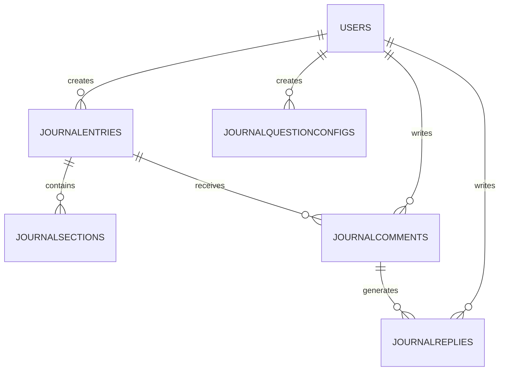

# 07 Journal de Bord Réflexif

**Version:** V1 Septembre 2026  
**Status:** 🟢 Spécification en cours  
**Effort estimé:** 40-50h (reduced from 45-55h: no tagging, simplified questions)  
**Timeline:** Semaines 9-11 (Phase V1.2)

---

## 📖 Vue d'Ensemble

### Objectif Métier

Le Journal de Bord Réflexif est un **espace personnel de réflexivité** où apprenants documentent manuellement leurs moments de réflexion sur leur apprentissage. 

Contrairement aux leçons EDRA où la partie "R" (Réflexion) est semi-automatisée, ce journal est un **vrai journal de bord** :
- Apprenant écrit ses propres analyses réflectives
- Enregistre ses apprentissages clés, difficultés, insights
- Coach peut superviser + commenter (optionnel selon supervision)
- Source de portfolio learning + dialogue coach-apprenant

**Lien EDRA :** Complète le framework EDRA (Expérience → Description → **Réflexion** → Action) en enrichissant la partie Réflexion avec des entrées libres et structurées.

### Qui l'Utilise (Rôles)

- **Apprenant** : Écrit, gère journal personnel, réfléchit sur son apprentissage
- **Coach** : Supervise, lit entrées, commente, oriente réflexion (optionnel)
- **Manager** : Vue synthétique optionnelle (insights apprenant si supervision activée)

### Scope — IN / OUT

#### ✅ IN (V1 Septembre 2026)

**Entrées Réflectives :**
- Créer entrée libre (texte, datetime)
- Entrée semi-structurée (3 questions guidées définies PER LESSON, réponses texte)
  - Questions configurées par Admin en BO lors création leçon
  - Questions variant selon contenu leçon (ex: "Prise de Décision" vs "SQL Avancé")
  - Visibles UNIQUEMENT dans journal de bord (pas en leçon)
- Ajouter mood/sentiment (optionnel : très positif → très difficile)
- Éditeur texte riche (bold, italics, listes, links)
- Brouillons (enregistrer sans publier)

**Supervision Coach :**
- Coach peut voir liste entrées apprenant (si supervision activée)
- Coach lit entrée + commente
- Notifications : apprenant averti si coach commente
- Apprenant répond aux commentaires (discussion asynchrone)

**Navigation & Recherche :**
- Timeline des entrées (newest first, filtrage par date)
- Recherche par keyword (titre + contenu)
- Export personnel (PDF de ses entrées)

**Analytics (Apprenant seul) :**
- Nombre entrées par mois (graphique trend)
- Tags les plus utilisés (word cloud)
- Sentiment distribution (mood chart)

#### ❌ OUT (Déféré V2+)

- Tags + tagging system → V2 (déféré, see Q3 decision)
- Partage avec autres apprenants (peer learning) → V2
- Sentiment analysis IA automatisée → V2
- Recommandations IA basées journal → V2
- Voice/audio entries (complexe) → V2+
- Document attachments → V2
- Templates prédéfinis → V2 (structure fixe pré-remplie)

---

## 🔐 Permission Model & Data Access

### Vue d'Ensemble

Le Journal de Bord Réflexif utilise un **modèle de partage global** où l'apprenant contrôle l'accès de son coach et de son manager entreprise à toutes ses entrées (passées et futures).

### Accès par Rôle

#### **Apprenant**
- Propriétaire de ses données
- Voit ses propres entrées (publiées + brouillons)
- Peut éditer/supprimer ses entrées
- Contrôle partage global avec Coach et Manager entreprise via toggles (activation/désactivation)
- Si partage activé : Coach/Manager voient toutes entrées passées et futures de cet apprenant
- Si partage désactivé : Coach/Manager n'ont AUCUN accès au journal

#### **Coach**
- Accès SEULEMENT si :
  - Assigné à apprenant ET
  - Apprenant a activé toggle "Partage avec Coach" dans son journal
- Si accès activé : Voit TOUTES les entrées de l'apprenant (passées + futures) + peut commenter
- Si accès désactivé : Aucun accès, pas de vue journal
- Ne peut pas éditer entrées apprenant

#### **Manager Entreprise**
- Accès SEULEMENT si :
  - Manager supervise l'apprenant AND
  - Apprenant a activé toggle "Partage avec Manager" dans son journal
- Si accès activé : Voit ONLY KPI aggregated data (nombre entrées/mois, sentiment trend, coach engagement) — NO case-by-case entries detail
- Si accès désactivé : Aucun accès, pas de données
- Ne peut pas commenter

#### **Super-Admin (Back-Office)**
- Accès FULL : Voit toutes entrées toutes apprenants en BO (pour support + audit)
- Peut configurer questions guidées pour tous types
- Peut activer/désactiver supervision per apprenant (BO interface)

### Sharing Model — Global Partage

**Mise en œuvre :** Table `user_journal_sharing` (voir Data Model)

Une fois apprenant active "Partage avec Coach" ou "Partage avec Manager" :
- Coach/Manager peuvent voir les entrées immédiatement
- Si apprenant désactive : Coach/Manager perdent accès immédiatement
- **Historique pas perdu** : Entrées existent en DB, juste accès révoqué

---

## 📌 Types d'Items & Questions Guidées

Le Journal de Bord affiche **13 types d'items** que l'apprenant peut créer ou qui sont créés automatiquement suite à ses activités. Chaque type a sa propre interface de réflexion et structure de questions.

### Tableau Récapitulatif

| # | Type | Déclenché | Interface Réflexion | Questions Configurées | Notes |
|---|------|-----------|-------------------|----------------------|-------|
| 1 | **Leçon** | Phase R (EDRA dans leçon) | Métabox "Réflexion" lors création leçon | 1+ questions par leçon (paramétrées dans leçon) | Questions différentes per leçon; peuvent être multiples |
| 2 | **Autres Items Learning** (modules, activités interactives, etc. — SAUF veilles) | Auto après completion | Modal "Entrer analyse réflexive" | Questions centralisées en BO (super-admin config) | Affichés en feed dans parcours; carte journal avec bouton |
| 3 | **Séances de Coaching 1-1** | Auto après séance | Modal "Entrer analyse réflexive" | Questions centralisées en BO (super-admin config) | Même interface que Items Learning |
| 4 | **Masterclass** | Auto après masterclass | Modal "Entrer analyse réflexive" | Questions centralisées en BO (super-admin config) | Même interface que Items Learning |
| 5 | **Classes Virtuelles** | Auto après classe | Modal "Entrer analyse réflexive" | Questions centralisées en BO (super-admin config) | Même interface que Items Learning |
| 6 | **Événement** (webinaire, atelier, etc.) | Auto après événement | Modal "Entrer analyse réflexive" | Questions centralisées en BO (super-admin config) | Même interface que Items Learning |
| 7 | **Mise à Jour Dreyfus** | Auto quand apprenant update niveau compétence | Notification carte "Augmentation niveau", puis modal "Entrer analyse réflexive" | Questions centralisées en BO (super-admin config) | Affichée comme notification; apprenant peut entrer reflexion |
| 8 | **Missions Apprenantes** | Auto après completion mission | Modal "Voir/Modifier réponses FAST" | 4 champs FAST (détails FO React) | Affiche réponses questionnaire FAST; bouton "Modifier" |
| 9 | **Fin d'un Parcours** | Auto quand parcours complété | Modal "Entrer analyse réflexive" | Questions centralisées en BO (super-admin config) | Même interface que Items Learning |
| 10 | **Fin d'une Étape** | Auto quand étape parcours complétée | Modal "Entrer analyse réflexive" | Questions centralisées en BO (super-admin config) | Même interface que Items Learning |
| 11 | **Fin d'un JAC** | Auto quand JAC complété | Modal "Entrer analyse réflexive" | Questions centralisées en BO (super-admin config) | Même interface que Items Learning |
| 12 | **Entrées Libres** | Manuel (apprenant clique "Nouvelle Entrée Libre") | Modal texte riche libre (aucune question guidée) | Placeholder configurable en BO (super-admin config) | Apprenant écrit ce qu'il veut; pas de structure imposée |
| 13 | **Situations de Travail** | Manuel (apprenant clique "Ajouter Situation Travail") | Modal avec 4 champs FAST (description + 4 phases analyse) | Champ description + 4 phases FAST (paramétrés en BO) | FAST = 4 champs structurés (phase 1, 2, 3, 4) |

### Interface de Réflexion — Détails par Groupe

#### **Groupe A : Leçons (Phase R EDRA)**
- **Où configuré :** Métabox "Réflexion" lors création leçon en BO
- **Structure :** 1+ questions (auteur leçon définit)
- **Affichage :** Dans écran leçon (EDRA-R) + reprise dans journal de bord
- **Exemple :** Q: "Qu'avez-vous appris des JOIN complexes?"

#### **Groupe B : Items Learning, Coaching, Masterclass, Classes Virtuelles, Événements, Dreyfus, Fin Parcours/Étape/JAC (Types 2-11)**
- **Où configuré :** **Interface BO centralisée** (voir section "Back-Office Questions Configuration" ci-dessous)
- **Structure :** Questions configurées par super-admin (1-3 questions ou plus selon besoin)
- **Affichage :** Modal "Entrer analyse réflexive"
- **Configuration :** Super-admin renseigne questions via interface BO; champs vides par défaut

#### **Groupe C : Entrées Libres (Type 12)**
- **Où configuré :** Placeholder configurable en BO
- **Structure :** Aucune question guidée; juste placeholder texte (modifiable en BO)
- **Affichage :** Modal texte riche libre
- **Default placeholder :** Vide (super-admin configure)

#### **Groupe D : Situations de Travail (Type 13)**
- **Où configuré :** Champ description en BO + structure FAST fixe (4 champs)
- **Structure :** 
  - Champ 1: Description tâche (question d'aide configurable en BO)
  - Champs 2-5: 4 phases FAST (structure fixe, libellés détaillés en FO React)
- **Affichage :** Modal avec 5 champs (1 description + 4 FAST)
- **Default Champ 1 :** Vide (super-admin configure description prompt)

### Back-Office Questions Configuration

**Rôle :** Super-Admin seul  
**Accès :** BO WordPress Admin > Journal de Bord > Configuration Questions

**Interface BO à créer :**
- Section "Configurer Questions Guidées"
- Tabs par type : Items Learning | Coaching | Masterclass | Classes Virtuelles | Événements | Dreyfus | Fin Parcours | Fin Étape | Fin JAC | Entrées Libres | Situations de Travail
- Pour chaque type : textarea pour chaque question (Question 1, Question 2, Question 3, etc.)
- Boutons : Aperçu FO | Enregistrer | Restaurer défaut
- **Defaults : VIDES** (super-admin configure questions de zéro, Option B)
  - Types 2-11 (Groupe B) : Champs vides
    ```
    Q1: [vide]
    Q2: [vide]
    Q3: [vide]
    ```
  - Type 12 (Entrées Libres) : Placeholder vide
    ```
    Default: [vide — super-admin rentre placeholder]
    ```
  - Type 13 (Situations de Travail) : Champ description vide
    ```
    Default: [vide — super-admin rentre description prompt]
    ```

**Validation :** Si super-admin essaie de publier questions vides → warning "Au moins 1 question requise pour ce type."

**Note :** Super-admin doit remplir questions avant que l'interface FO soit fonctionnelle pour ces types. Si questions vides → afficher message BO "À configurer".

---

## 📱 Écrans à Concevoir

### Front-Office (React)

| Écran | Rôle | Description | Priorité |
|-------|------|-------------|----------|
| **Journal Dashboard** | Apprenant | Vue principale : timeline entrées + bouton "Nouvelle Entrée" + stats miniatures (entrées ce mois, mood trend) | P0 |
| **Nouvelle Entrée** | Apprenant | Modal/Form : titre + texte libre + sections structurées (3 Q lesson-spécifiques) + mood + boutons Brouillon/Publier | P0 |
| **Détail Entrée** | Apprenant | Vue entrée complète : titre + contenu + metadata (date, mood) + commentaires coach + bouton Éditer/Supprimer | P0 |
| **Liste Supervisée** | Coach | Tableau entrées apprenant assigné : date, titre, sentiment, status (new/commented/replied) + clic pour détail | P1 |
| **Détail + Supervision** | Coach | Entrée apprenant + zone commentaires (coach write comment) + thread replies | P1 |
| **Search & Filter** | Apprenant | Recherche texte + filtres (date range, sentiment) + résultats timeline | P1 |

### Back-Office (WordPress Admin)

| Écran | Rôle | Description | Priorité |
|-------|------|-------------|----------|
| **BO Questions Configuration** | Super-Admin | Interface centrale pour configurer questions guidées pour tous types (Items Learning, Coaching, Masterclass, Classes Virtuelles, Événements, Dreyfus, Fin Parcours, Fin Étape, Fin JAC, Entrées Libres, Situations Travail) : tabs par type + textarea per question + preview FO + validation (min 1 Q par type) | P0 |
| **Journal Management (Admin)** | Super-Admin | Vue admin : statistiques globales (total entries, active users, avg sentiment), paramètres (supervisions enabled?, retention period?) | P2 |

---

## ⚙️ Fonctionnalités (V1)

### Core

1. **Créer Entrée Libre** - Apprenant saisit titre + contenu texte riche, publie ou enregistre brouillon
2. **Sections Structurées Optionnelles** - 3 questions guidées definies per lesson (configurées en BO), avec réponses texte
3. **Back-Office Questions Configuration** - Super-admin configure questions guidées pour tous types (Items Learning, Coaching, Masterclass, Classes Virtuelles, Événements, Dreyfus, Fin Parcours, Fin Étape, Fin JAC) via interface BO centralisée : tabs par type, textareas for each question, preview FO, validation rules
4. **Mood Selector** - Apprenant sélectionne mood (5 levels : très positif → très difficile)
5. **Timeline & Navigation** - Voir toutes entrées avec filtrage par date, recherche full-text
6. **Coach Comments** - Coach peut commenter entrée, apprenant répond, thread asynchrone
7. **Export Personnel** - Apprenant exporte entrées (PDF avec formatting)
8. **Brouillons** - Apprenant peut sauvegarder sans publier, continuer plus tard
9. **Partage Global avec Coach/Manager** - Apprenant active/désactive partage de ses entrées (tous types) avec Coach et/ou Manager entreprise via toggles; une fois activé, accès à toutes entrées passées et futures

### Secondary

9. **Stats Personnelles** - Dashboard stats : nombre entrées/mois, sentiment distribution (pie chart)
10. **Notifications** - Apprenant notifié si coach commente (toast + email optionnel)

---

## 🚀 Possible Évolutions (V2+)

### V2 (Janvier 2027+)

- **Peer Sharing** : Apprenant partage certaines entrées avec cohort pour peer learning
- **IA Sentiment Analysis** : Auto-detect sentiment si pas fourni manuellement
- **IA Recommendations** : Suggérer apprentissages basés sur entrées (intégrer avec Mistral)
- **Templates** : Suggestions de structures pré-remplies (ex: template "Post-Project Reflection")

### V3 (2027+)

- **Voice Entries** : Apprenant peut enregistrer audio + transcrire (complexe)
- **File Attachments** : Joindre docs/images aux entrées
- **Social Learning** : Groupe d'apprenants partage + commentaire cross-apprenant

---

## 👥 User Journeys (Format 3)

### User Journey #1 : Apprenant → Créer Entrée Réflective

**Acteur :** Apprenant (post-onboarding)  
**Déclencheur :** Fin de journée ou après moment pédagogique clé  
**Objectif :** Documenter une réflexion personnelle sur son apprentissage du jour

#### Étapes Détaillées

1. **Apprenant accède au Journal Dashboard**
   - Apprenant clique "Mon Journal" dans navigation principale
   - Route : `/apprenant/journal`
   - Système affiche timeline des entrées existantes + bouton "Nouvelle Entrée"
   - Feedback : Page load ~400ms (cached), affiche skeleton loading si données lentes
   - Durée : ~400ms

2. **Apprenant clique "Nouvelle Entrée"**
   - Bouton "Nouvelle Entrée" (CTA primaire, bleu)
   - Modal ouvre (smooth fade-in, 300ms)
   - Modal contient : Titre field + texte riche editor + sections structurées (3 Q) + tags + mood selector
   - Feedback : Modal centrée, focus auto sur champ titre, editor ready
   - Durée : ~300ms

3. **Apprenant entre titre**
   - Exemple : "Réflexion post-mission : Prise de décision en équipe"
   - Placeholder : "Titre de votre réflexion..."
   - Max 100 caractères
   - Real-time character counter
   - Feedback : Texte appears en temps réel, counter updates
   - Durée : instant

4. **Apprenant écrit contenu principal en zone texte libre**
   - Éditeur texte riche (Slate/Quill)
   - Supports : bold, italics, lists, links, line breaks
   - Placeholder : "Qu'avez-vous appris ? Quelles difficultés ? Quelles insights ?"
   - Min 20 characters (validation), max 5000
   - Auto-save toutes les 30s en brouillon (silencieux)
   - Feedback : Typing fluide, auto-save indicator (small checkmark en gris bas-droite)
   - Durée : Variable (user-paced, ~5-10 min pour 500 mots)

5. **Apprenant complète 3 sections structurées (optionnel)**
   - **Q1 :** "Qu'avez-vous appris de cette expérience ?" (textarea 500 chars)
   - **Q2 :** "Quelles difficultés avez-vous rencontrées ?" (textarea 500 chars)
   - **Q3 :** "Quelle action allez-vous prendre prochainement ?" (textarea 300 chars)
   - Affichage : 3 sections collapsibles (expandable accordion style)
   - Feedback : Chaque section peut être expanded/collapsed indépendamment
   - Validation : Optional, mais système encourage "Remplissez Q1 et Q3 pour meilleure réflexion"
   - Durée : ~500ms par Q expansion/collapse

6. **Apprenant sélectionne mood**
   - Mood selector : 5 radiobuttons (très positif → très difficile, avec émojis 😊😐😟😞😭)
   - Apprenant sélectionne 1 mood (obligatoire)
   - Feedback : Button highlight on select, visual feedback clear
   - Durée : ~10s pour mood selection

7. **Apprenant sauvegarde brouillon ou publie**
   - Boutons : "Enregistrer comme brouillon" (gris) + "Publier maintenant" (bleu)
   - Brouillon : entrée visible apprenant seul, non supervisable par coach, modifiable
   - Publie : entrée publiée, accessible coach (si supervision), non éditable (peut supprimer/créer nouvelle)
   - Validation : Titre requis. Contenu principal requis (min 20 chars). Sections optional. Mood optional.
   - Si validation échoue : Error toast (rouge, 5s) "Veuillez remplir titre + contenu"
   - Feedback : Button loading state (spinner), disabled pendant save
   - Durée : ~800ms (API call → DB save)

8. **Système crée entrée et affiche confirmation**
   - Backend : POST `/api/v1/journal/entries` with title, content, sections[], mood
   - Réponse : `{ id: UUID, created_at, status: "published" }`
   - Modal ferme, timeline refresh automatique
   - Toast succès : "Entrée publiée ! Votre coach peut la lire."
   - Apprenant voit nouvelle entrée en haut de timeline
   - Feedback : Toast vert (2s), nouvelle entrée highlight (light animation ~1s)
   - Durée : ~1s (close + refresh)

#### Conditions de Succès ✅

- [ ] Entrée crée en DB avec tous champs (titre, contenu, sections, tags, mood, user_id, created_at, published_at)
- [ ] Validation : titre requis + contenu min 20 chars (enforced)
- [ ] Brouillons sauvegardés dans "Drafts" (distinct status)
- [ ] Auto-save fonctionne en background (30s interval) sans interruption user
- [ ] Mood selector (5 levels) enregistre correctement (optional)
- [ ] Apprenant voit immédiatement nouvelle entrée en timeline
- [ ] Coach peut voir entrée dans liste (si supervision enabled)
- [ ] Load time modal <300ms, save <800ms

#### Erreurs & Edge Cases ❌

**Cas 1 : Apprenant retourne au journal avant de finir**
- Scénario : Apprenant écrit 300 mots, quitte modal avant de publier/brouillon
- Comportement attendu :
  - Modal close (X button ou Escape key)
  - System dialog : "Quitter sans enregistrer ? Votre brouillon sera perdu."
  - Options : Cancel (revenir modal) | Quitter quand même | Enregistrer brouillon d'abord
  - Si Cancel : revenir modal avec contenu intact
  - Si Enregistrer : sauvegarder brouillon + close modal
  - Si Quitter : close sans sauvegarder (avertissement final)
- Feedback : Dialog avec warning icon, 3 buttons clairs
- Impact : UX gentle, apprenant contrôle perte données

**Cas 2 : Erreur réseau pendant save**
- Scénario : Apprenant clique "Publier", connexion réseau perdue, POST échoue
- Comportement attendu :
  - Timeout 8s, API retourne error
  - Modal stay open, contenu preserved
  - Toast error (rouge) : "Erreur réseau. Veuillez réessayer."
  - Button "Publier" re-enabled après 2s
  - Apprenant peut corriger + réessayer
- Fallback : Brouillon local (localStorage) en backup
- Impact : Pas de perte données, user experience clear

**Cas 3 : Validation échoue (contenu <20 chars)**
- Scénario : Apprenant tape seulement "Test" et essaie de publier
- Comportement attendu :
  - API validation : content.length < 20 → return error
  - Error toast : "Votre réflexion doit faire au least 20 caractères."
  - Modal stay open, focus back on content field
  - User see inline error (red border on textarea)
- Impact : Encourage reflections substantielles, pas de journal entries triviales

**Cas 4 : Apprenant offline (mode avion)**
- Scénario : Apprenant write journal entry offline (Service Worker cache)
- Comportement attendu :
  - Editor fonctionne (offline)
  - User clique Publier → system détect offline
  - Toast warning : "Vous êtes hors ligne. Entrée sera publiée dès reconnexion."
  - Entrée en pending status (local queue)
  - Quand reconnecté : auto-submit queue (silencieux, success toast)
- Technical : Use IndexedDB + Service Worker queue
- Impact : Good UX offline, transparent sync

**Cas 5 : XSS dans entrée (script tags)**
- Scénario : Apprenant paste HTML avec <script> tags
- Comportement attendu :
  - Backend sanitize input (DOMPurify)
  - Script tags removed, content preserved
  - Coach sees cleaned content (no JS execution risk)
  - No error shown to user (silent sanitization)
- Impact : Security, no user friction

---

### User Journey #2 : Apprenant → Lire & Modifier Entrée Existante

**Acteur :** Apprenant  
**Déclencheur :** Apprenant clique sur entrée existante dans timeline  
**Objectif :** Relire sa réflexion, voir feedback coach (si existe), potentiellement éditer (si brouillon)

#### Étapes Détaillées

1. **Apprenant voit timeline des entrées**
   - Journal Dashboard : liste entrées chronologiques (newest first)
   - Chaque entrée : titre, date courte (ex: "Hier"), mood emoji, count commentaires (si existe)
   - Exemple card : "Réflexion post-mission : Prise de décision en équipe | Hier | 😊 | 2 commentaires coach"
   - Feedback : Card hover state (subtle shadow), cursor pointer
   - Durée : instant (cached)

2. **Apprenant clique entrée pour détail**
   - Clique card → route : `/apprenant/journal/:entryId`
   - Page ouvre (slide-in animation 200ms)
   - Affiche : titre + contenu full (avec formatting) + metadata (date, tags, mood) + sections remplies
   - Feedback : Page smooth transition, scroll to top
   - Durée : ~200ms

3. **Apprenant lit sa réflexion complète**
   - Voir texte formaté (bold, italics, lists préservés)
   - Voir 3 sections remplies (ou blank si optionnel pas fait)
   - Metadata : date créé, date modifié (si édité brouillon), mood emoji
   - Feedback : Content lisible, mood emoji visible, structure claire
   - Durée : Variable (user-paced, ~2-5 min lecture)

4. **Apprenant voit commentaires coach (si supervision activée)**
   - Section "Feedback Coach" (h3 heading)
   - Si pas de commentaires : "Votre coach n'a pas encore commenté."
   - Si commentaires : thread chronologique (oldest first)
   - Chaque commentaire : Coach name/avatar + date + texte + "Répondre" link
   - Feedback : Commentaires lisibles, distinct styling (light bg), link "Répondre"
   - Durée : instant

5. **Apprenant répond à commentaire coach (optionnel)**
   - Clique "Répondre" sous commentaire coach
   - Textarea ouvre (inline, avec cancel/submit buttons)
   - Texte riche editor (same as création entrée)
   - Placeholder : "Votre réponse à [Coach]..."
   - Validation : min 10 chars, max 2000
   - Feedback : Textarea focus, cursor prêt
   - Durée : ~500ms pour expande textarea

6. **Apprenant soumet réponse**
   - Clique "Envoyer réponse"
   - Backend : POST `/api/v1/journal/entries/:id/comments/:commentId/replies` with text
   - Réponse : `{ reply_id, created_at, author: apprenant }`
   - Textarea close, reply append to thread
   - Notification : Coach reçoit notification "Apprenant X a répondu"
   - Feedback : Reply appear smoothly, "Réponse envoyée" toast (2s)
   - Durée : ~600ms (API + append)

7. **Apprenant peut éditer entrée (si brouillon)**
   - Button "Éditer" visible uniquement pour brouillons (status = draft)
   - Clique Éditer → modal open avec contenu current (prefilled)
   - User modifie title/content/sections/tags/mood
   - Buttons : "Annuler" | "Enregistrer brouillon" | "Publier maintenant"
   - Feedback : Modal open, auto-focus first modified field
   - Durée : ~300ms

8. **Apprenant publie brouillon (optionnel)**
   - Si brouillon existant, button "Publier brouillon" visible
   - Clique → API : PUT `/api/v1/journal/entries/:id` with status: "published"
   - Entry devient visible coach
   - Feedback : Entry card update (status change), toast "Brouillon publié"
   - Durée : ~500ms

#### Conditions de Succès ✅

- [ ] Entrée affiche complète (titre, contenu, sections, tags, mood, metadata)
- [ ] Commentaires coach chargent et affichent correctement
- [ ] Replies fonctionnent (apprenant peut répondre coach)
- [ ] Brouillons peuvent être édités (repre-open modal, modify, save/publish)
- [ ] Entrées publiées CANNOT be edited (button "Éditer" hidden)
- [ ] Tags cliquables (filter timeline par tag)
- [ ] Formatting préservé (bold, italics, lists)
- [ ] Mood emoji visible
- [ ] Load time <600ms

#### Erreurs & Edge Cases ❌

**Cas 1 : Apprenant essaie accéder entrée inexistante**
- Scénario : URL directe `/apprenant/journal/invalid-id`
- Comportement : 404 page "Entrée non trouvée. Retour au journal ?"
- Impact : Graceful error handling

**Cas 2 : Entrée supprimée par apprenant après chargement partiel**
- Scénario : Apprenant A dans page entrée, apprenant appuie Supprimer
- Comportement : Page refresh, entrée disparaît, redirect journal home + toast "Entrée supprimée"
- Impact : Consistency

**Cas 3 : Coach commente pendant apprenant is reading**
- Scénario : Real-time : Coach adds comment while apprenant reading
- Comportement : Apprenant see "New comment from Coach" notification (toast ou badge)
- Option Reload : Apprenant peut cliquer pour reload + voir nouveau comment
- Impact : UX : apprenant aware new feedback

---

### User Journey #3 : Coach → Superviser Entrée Apprenant & Commenter

**Acteur :** Coach (avec supervision enabled pour apprenant)  
**Déclencheur :** Coach accède "Mes Apprenants" → sélectionne apprenant → voit liste entrées  
**Objectif :** Lire réflexion apprenant, commenter, guider réflexion, dialog asynchrone

#### Étapes Détaillées

1. **Coach accède Dashboard "Mes Apprenants"**
   - Coach clique "Mes Apprenants" dans navigation
   - Route : `/coach/apprenants`
   - Système affiche liste apprenants assignés (tableau ou cards)
   - Feedback : Load ~400ms, cached
   - Durée : ~400ms

2. **Coach sélectionne un apprenant**
   - Coach clique apprenant card/row
   - Route : `/coach/apprenants/:apprenant_id`
   - Affiche : Apprenant overview + tabs (Parcours | Journal | Missions | Stats)
   - Coach clique tab "Journal"
   - Feedback : Tab active, content load ~300ms
   - Durée : ~300ms

3. **Coach voit liste entrées apprenant (Supervision View)**
   - Tableau/liste : Date | Titre | Status (new/commented/replied) | Sentiment
   - Exemple row : "2026-05-10 | Réflexion post-mission : Prise de décision | NEW | 😊"
   - Filtres (optionnel) : date range, sentiment filter
   - Sorting : newest first (default)
   - Feedback : Tableau responsive, hover highlight rows
   - Durée : instant (cached)

4. **Coach clique entrée pour lire détail**
   - Clique row → route : `/coach/apprenants/:apprenant_id/journal/:entryId`
   - Affiche : Entrée complète (titre, contenu, sections, tags, mood, metadata)
   - En bas : existing comments + "Ajouter commentaire" textarea
   - Feedback : Page load ~400ms, scroll to comments
   - Durée : ~400ms

5. **Coach lit entrée apprenant**
   - Coach voit contenu complet, réfléchit
   - Peut voir sections structurées (Q1, Q2, Q3 réponses)
   - Peut voir tags apprenant a choisi
   - Peut voir mood apprenant a sélectionné
   - Feedback : Content lisible, clear formatting
   - Durée : Variable (coach-paced, ~3-10 min per entry)

6. **Coach ajoute commentaire de feedback**
   - Coach scroll to "Commentaires" section
   - Textarea : "Votre feedback..." (hint text)
   - Texte riche editor (same as apprenant)
   - Supports : bold, italics, lists (encourage structured feedback)
   - Max 3000 chars
   - Feedback : Textarea focus, cursor prêt
   - Durée : ~500ms (expand + focus)

7. **Coach écrit commentaire pertinent**
   - Exemple : "Super réflexion sur la prise de décision en équipe ! J'aime que tu aies noté les difficultés de consensus. **Point de discussion** : Comment gérerais-tu une situation où consensus impossible ?"
   - Coach utilise formatting pour clarity (bold points clés)
   - Auto-save : toutes les 30s (silent background)
   - Feedback : Typing fluide, auto-save indicator
   - Durée : Variable (~3-5 min pour 500 mots)

8. **Coach envoie commentaire**
   - Coach clique "Envoyer commentaire" (bleu button)
   - Backend : POST `/api/v1/journal/entries/:id/comments` with text, author: coach
   - Réponse : `{ comment_id, created_at, author: coach }`
   - Modal/form close ou append to comments thread (no reload)
   - Notification : Apprenant receives "Coach [Name] a commenté votre entrée"
   - Feedback : Comment appear top comments section, "Commentaire envoyé" toast (2s)
   - Durée : ~600ms

9. **Coach voit répliques apprenant (optionnel)**
   - Si apprenant a répondu au commentaire : thread showing
   - Coach voit reply indent, avec apprenant's text
   - Coach peut répondre à reply (threaded conversation)
   - Feedback : Thread structure clear (indent, avatar, chain)
   - Durée : instant (if loaded)

#### Conditions de Succès ✅

- [ ] Coach voit liste apprenants assignés
- [ ] Coach accède journal apprenant (si supervision enabled)
- [ ] Coach voit liste entrées apprenant
- [ ] Coach lit entrée complète
- [ ] Coach peut ajouter commentaire (texte riche)
- [ ] Commentaires persistent en DB
- [ ] Apprenant notifié quand coach commente
- [ ] Thread replies fonctionnent (coach reply, apprenant reply)
- [ ] Load time <600ms per entrée

#### Erreurs & Edge Cases ❌

**Cas 1 : Coach essaie accéder apprenant non-assigné**
- Scénario : Coach A tries URL `/coach/apprenants/different_coach_apprenant_id/journal`
- Comportement : 403 Forbidden "Vous n'avez pas accès à cet apprenant"
- Impact : Permission control

**Cas 2 : Supervision disabled pour apprenant**
- Scénario : Supervision toggle disabled en BO pour apprenant X
- Comportement : Coach no longer sees apprenant's journal entries
- Impact : Privacy control

**Cas 3 : Apprenant supprime entrée pendant coach reading**
- Scénario : Coach reading entry, apprenant delete entry
- Comportement : Page error "Entrée supprimée. Retour ?" + toast
- Impact : Graceful degradation

---

### User Journey #4 : Apprenant → Activer Partage Journal avec Coach

**Acteur :** Apprenant  
**Déclencheur :** Apprenant accède Journal Dashboard settings ou reçoit suggestion "Activer supervision"  
**Objectif :** Autoriser Coach à voir ses entrées journal pour feedback et guidance

#### Étapes Détaillées

1. **Apprenant accède Journal Dashboard**
   - Route : `/apprenant/journal`
   - Affiche : Timeline entries + stats + button "Paramètres Partage" (gear icon, top-right)
   - Feedback : Dashboard chargé ~400ms
   - Durée : ~400ms

2. **Apprenant clique "Paramètres Partage"**
   - Button "⚙️ Paramètres Partage" (top-right dashboard)
   - Modal ouvre : "Contrôler l'accès à vos entrées journal"
   - Affiche : 2 toggle sections (Coach + Manager)
   - Feedback : Modal centrée, toggles claire
   - Durée : ~300ms

3. **Apprenant voit statut partage actuel**
   - Section "Partage avec Coach" :
     - Toggle (OFF/ON) + description : "Votre coach peut lire toutes vos entrées et commenter"
     - Coach assigné affiché (ex: "Coach : Nadine Durand")
     - Statut : "Actuellement DÉSACTIVÉ" ou "ACTIVÉ depuis [date]"
   - Section "Partage avec Manager Entreprise" :
     - Toggle (OFF/ON) + description : "Votre manager peut voir vos statistiques journal (nombre entrées, sentiment trend)"
     - Manager assigné affiché (ex: "Manager : Jean Dubois")
     - Statut : "Actuellement DÉSACTIVÉ" ou "ACTIVÉ depuis [date]"
   - Feedback : Toggles clearly visible, statuses explicit
   - Durée : instant

4. **Apprenant active partage avec Coach (optionnel)**
   - Clique toggle "Partage avec Coach" → turn ON
   - Confirmation dialog : "Autoriser [Coach] à lire vos entrées journal ? Il/elle pourra : ✅ voir toutes vos entrées ✅ ajouter des commentaires"
   - Buttons : "Annuler" | "Autoriser"
   - Feedback : Clear explanation, warn apprenant coach will see all entries
   - Durée : ~500ms (dialog)

5. **Apprenant confirme partage**
   - Clique "Autoriser"
   - Backend : POST `/api/v1/journal/sharing` with `{ coach_sharing_enabled: true }`
   - DB update : `user_journal_sharing` table → `coach_sharing_enabled = true, updated_at = now()`
   - Notification (async) : Coach reçoit "Apprenant [Name] vous a autorisé à accéder son journal"
   - Feedback : Toggle flip to ON, toast vert "Partage activé avec [Coach]"
   - Durée : ~600ms (API + notification)

6. **Apprenant peut désactiver partage plus tard**
   - Si partage ON : toggle available
   - Clique toggle → turn OFF
   - Confirmation : "Désactiver le partage avec [Coach] ?"
   - Buttons : "Annuler" | "Désactiver"
   - Backend : PUT `/api/v1/journal/sharing` with `{ coach_sharing_enabled: false }`
   - Coach loses access immediately (entries not deleted, just access revoked)
   - Feedback : Toggle flip to OFF, toast "Partage désactivé"
   - Durée : ~500ms

7. **Apprenant active partage avec Manager Entreprise (optionnel)**
   - Même process que Coach mais pour Manager
   - Toggle "Partage avec Manager"
   - Confirmation : "Autoriser [Manager] à voir vos statistiques journal ? Il/elle pourra : ✅ voir nombre entrées ✅ voir sentiment trend ❌ NOT voir vos entrées en détail"
   - Feedback : Clear that manager sees only KPIs, not entries
   - Durée : ~500ms

#### Conditions de Succès ✅

- [ ] Modal "Paramètres Partage" ouvre sans erreur
- [ ] Toggle coach + manager affichés correctement
- [ ] Statuts courants (DÉSACTIVÉ/ACTIVÉ depuis date) affichés
- [ ] Confirmation dialogs avant activation/désactivation
- [ ] API updates `user_journal_sharing` table correctly
- [ ] Coach/Manager reçoivent notifications (ou email) quand partage activé
- [ ] Coach/Manager perdent accès immédiatement quand apprenant désactive
- [ ] Load time modal <300ms, toggle save <600ms

#### Erreurs & Edge Cases ❌

**Cas 1 : Apprenant sans coach assigné**
- Scénario : Apprenant try toggle "Partage avec Coach" mais no coach assigné
- Comportement : Toggle disabled (grayed out) + message "Vous n'avez pas de coach assigné."
- Impact : Clear UX, no confusion

**Cas 2 : Apprenant désactive partage avec Coach — Coach reading entry**
- Scénario : Coach reading entrée, apprenant désactive partage real-time
- Comportement : Coach page refresh warning "Vous n'avez plus accès à ce journal" + redirect apprenants list
- Impact : UX : Coach aware access lost

**Cas 3 : Erreur réseau lors toggle**
- Scénario : Apprenant clique toggle, réseau timeout
- Comportement : Toggle stay in current state (no flip), error toast "Erreur réseau. Veuillez réessayer." + retry button
- Impact : Pas de toggle partiel, apprenant aware erreur

**Cas 4 : Coach removes apprenant assignment — Sharing still active**
- Scénario : Manager removes Coach-Apprenant relationship en BO
- Comportement : Sharing toggle disabled in apprenant's modal (grayed out, message "Coach no longer assigned")
- Backend : Ignore coach_sharing_enabled (coach access revoked due to no assignment)
- Impact : Consistency, no orphan access

---

## 🗄️ Modèle de Données

### Entités Principales

#### 1. **JournalEntries** (Entrées du journal)

| Colonne | Type | Description |
|---------|------|-------------|
| `id` | UUID | Primary key |
| `user_id` | UUID | FK → Users (apprenant) |
| `title` | String(100) | Titre entrée |
| `content` | Text(5000) | Contenu principal (texte riche) |
| `status` | Enum | "draft" \| "published" \| "archived" |
| `mood` | Enum | "very_positive" \| "positive" \| "neutral" \| "difficult" \| "very_difficult" |
| `created_at` | DateTime | Timestamp création |
| `updated_at` | DateTime | Timestamp dernière modification |
| `published_at` | DateTime | Timestamp publication (null si draft) |
| `supervision_visible` | Boolean | Visible par coach ? (default true si coach assigned) |

#### 2. **JournalSections** (Sections structurées optionnelles)

| Colonne | Type | Description |
|---------|------|-------------|
| `id` | UUID | Primary key |
| `entry_id` | UUID | FK → JournalEntries |
| `section_type` | Enum | "what_learned" \| "difficulties" \| "next_actions" |
| `content` | Text(500) | Réponse texte à la question |
| `order` | Int | Position (1, 2, 3) |

#### 3. **JournalComments** (Commentaires coach)

| Colonne | Type | Description |
|---------|------|-------------|
| `id` | UUID | Primary key |
| `entry_id` | UUID | FK → JournalEntries |
| `author_id` | UUID | FK → Users (coach) |
| `content` | Text(3000) | Texte commentaire (texte riche) |
| `created_at` | DateTime | Timestamp |
| `updated_at` | DateTime | Last edit (si coach peut éditer) |

#### 4. **JournalReplies** (Réponses à commentaires - thread asynchrone)

| Colonne | Type | Description |
|---------|------|-------------|
| `id` | UUID | Primary key |
| `comment_id` | UUID | FK → JournalComments |
| `author_id` | UUID | FK → Users (apprenant ou coach) |
| `content` | Text(2000) | Texte réponse |
| `created_at` | DateTime | Timestamp |

#### 5. **JournalQuestionConfigs** (Configuration des questions guidées - Super-Admin)

| Colonne | Type | Description |
|---------|------|-------------|
| `id` | UUID | Primary key |
| `item_type` | Enum | Type d'item : "items_learning" \| "coaching" \| "masterclass" \| "classes_virtuelles" \| "evenement" \| "dreyfus" \| "fin_parcours" \| "fin_etape" \| "fin_jac" \| "entrees_libres" \| "situations_travail" |
| `question_number` | Int | Numéro question (1, 2, 3, etc.) |
| `question_text` | Text(500) | Texte de la question (null = vide, à configurer par super-admin) |
| `placeholder_text` | Text(500) | Texte placeholder affichage FO (optionnel) |
| `max_length` | Int | Longueur max réponse (ex: 500, 3000) |
| `is_required` | Boolean | Question obligatoire ? (default false) |
| `created_at` | DateTime | Timestamp création config |
| `updated_at` | DateTime | Timestamp dernière modification config |
| `created_by` | UUID | FK → Users (super-admin qui a créé) |

**Notes :**
- Tous les champs `question_text` commencent VIDES (null) — super-admin doit remplir
- Validation en BO : Au moins 1 question requise par type avant publication
- Les questions de LEÇONS sont configurées différemment (voir Cahier #1 Parcours) — pas dans cette table

#### 6. **UserJournalSharing** (Configuration partage journal apprenant)

| Colonne | Type | Description |
|---------|------|-------------|
| `id` | UUID | Primary key |
| `user_id` | UUID | FK → Users (apprenant) |
| `coach_sharing_enabled` | Boolean | Apprenant a autorisé Coach à voir journal ? (default false) |
| `manager_sharing_enabled` | Boolean | Apprenant a autorisé Manager Entreprise à voir KPIs journal ? (default false) |
| `shared_with_coach_id` | UUID | FK → Users (coach assigné, optionnel, for audit) |
| `shared_with_manager_id` | UUID | FK → Users (manager assigné, optionnel, for audit) |
| `created_at` | DateTime | Timestamp création partage config |
| `updated_at` | DateTime | Timestamp dernière modification |

**Notes :**
- 1 row per apprenant (unique user_id)
- Toggles sont idempotents (enable/disable multiple times OK)
- `shared_with_coach_id` et `shared_with_manager_id` captured pour audit trail
- Si coach/manager unassigned en BO : sharing ignored (access denied même si enabled)

### Relations

```
Users (1) ──→ (many) JournalEntries
JournalEntries (1) ──→ (many) JournalSections
JournalEntries (1) ──→ (many) JournalComments
JournalComments (1) ──→ (many) JournalReplies
JournalQuestionConfigs (config, not directly linked to entries — used to fetch questions at FO display time)
Users (1) ──→ (many) JournalQuestionConfigs (created_by = super-admin)
```

### Schéma Simplifié (Mermaid)



---

## 🔌 API / Endpoints

### Endpoints de Gestion Entrées

#### **GET /api/v1/journal/entries** - Lister entrées apprenant
- **Acteur :** Apprenant
- **Params :** `limit=20, offset=0, status=published, sort_by=created_at_desc`
- **Response :**
  ```json
  {
    "entries": [
      {
        "id": "uuid-1",
        "title": "Réflexion post-mission",
        "excerpt": "J'ai appris que...",
        "mood": "positive",
        "created_at": "2026-05-10T14:30:00Z",
        "comments_count": 2,
        "tags": ["équipe", "décision"]
      }
    ],
    "total": 15,
    "has_more": false
  }
  ```
- **Status Codes :** 200 OK, 401 Unauthorized

#### **POST /api/v1/journal/entries** - Créer entrée
- **Acteur :** Apprenant
- **Body :**
  ```json
  {
    "title": "Réflexion post-mission : Prise de décision en équipe",
    "content": "<p>Contenu riche HTML</p>",
    "sections": [
      { "type": "what_learned", "content": "..." },
      { "type": "difficulties", "content": "..." },
      { "type": "next_actions", "content": "..." }
    ],
    "mood": "positive",
    "status": "published"
  }
  ```
- **Response :** 201 Created, avec entry_id
- **Validation :** title required, content min 20 chars

#### **GET /api/v1/journal/entries/:id** - Détail entrée
- **Acteur :** Apprenant (own) ou Coach (si supervision)
- **Response :** Entrée complète + sections + tags + comments
- **Status Codes :** 200 OK, 403 Forbidden (no supervision), 404 Not Found

#### **PUT /api/v1/journal/entries/:id** - Éditer entrée (brouillon seulement)
- **Acteur :** Apprenant
- **Body :** Same as POST
- **Validation :** Only if status = "draft"
- **Response :** 200 OK, 403 Forbidden (if published)

#### **DELETE /api/v1/journal/entries/:id** - Supprimer entrée
- **Acteur :** Apprenant (own only)
- **Response :** 204 No Content
- **Note :** Soft delete (mark archived, don't delete DB)

### Endpoints de Commentaires

#### **POST /api/v1/journal/entries/:id/comments** - Coach ajoute commentaire
- **Acteur :** Coach
- **Body :**
  ```json
  {
    "content": "<p>Feedback riche HTML</p>"
  }
  ```
- **Response :** 201 Created, avec comment_id + trigger notification apprenant
- **Status Codes :** 201 Created, 401 Unauthorized, 403 Forbidden (no supervision)

#### **POST /api/v1/journal/entries/:id/comments/:comment_id/replies** - Apprenant répond
- **Acteur :** Apprenant ou Coach
- **Body :**
  ```json
  {
    "content": "<p>Réponse texte riche</p>"
  }
  ```
- **Response :** 201 Created, reply_id + trigger notification recipient
- **Status Codes :** 201, 401, 403, 404

#### **GET /api/v1/journal/entries/:id/comments** - Lister commentaires entrée
- **Acteur :** Apprenant (own) ou Coach
- **Response :** Array de comments + nested replies
- **Params :** `limit=50, offset=0, sort=created_at_asc`

### Endpoints Coach Supervision

#### **GET /api/v1/coach/apprenants/:apprenant_id/journal/entries** - Lister entrées apprenant (Coach)
- **Acteur :** Coach
- **Params :** `limit=20, offset=0, mood_filter=all, date_from, date_to`
- **Response :** Same as apprenant list, mais avec status "new", "commented", "replied"
- **Validation :** Coach must have apprenant assigned + supervision enabled

### Endpoints Admin — Questions Configuration

#### **GET /api/v1/admin/journal/questions** - Récupérer toutes questions configurées
- **Acteur :** Super-Admin
- **Params :** `item_type=items_learning` (optionnel, pour filtrer par type)
- **Response :**
  ```json
  {
    "questions": [
      {
        "item_type": "items_learning",
        "question_number": 1,
        "question_text": "Qu'avez-vous appris ?",
        "placeholder_text": "Décrivez vos apprentissages...",
        "max_length": 500,
        "is_required": true
      },
      {
        "item_type": "items_learning",
        "question_number": 2,
        "question_text": "Quelles difficultés ?",
        "placeholder_text": "...",
        "max_length": 500,
        "is_required": false
      }
    ]
  }
  ```
- **Status Codes :** 200 OK, 401 Unauthorized, 403 Forbidden (non-admin)

#### **PUT /api/v1/admin/journal/questions** - Mettre à jour questions (Super-Admin)
- **Acteur :** Super-Admin
- **Body :**
  ```json
  {
    "item_type": "items_learning",
    "questions": [
      { "number": 1, "text": "Qu'avez-vous appris ?", "max_length": 500, "required": true },
      { "number": 2, "text": "Quelles difficultés ?", "max_length": 500, "required": false },
      { "number": 3, "text": "Prochaines actions ?", "max_length": 300, "required": false }
    ]
  }
  ```
- **Validation :** At least 1 question per item_type
- **Response :** 200 OK + updated config
- **Status Codes :** 200 OK, 400 Bad Request (validation failed), 401, 403

#### **GET /api/v1/admin/journal/questions/:item_type** - Récupérer questions pour 1 type
- **Acteur :** Super-Admin
- **Response :** Array de questions pour ce type
- **Status Codes :** 200 OK, 401, 403, 404 Not Found

#### **DELETE /api/v1/admin/journal/questions/:item_type/:question_number** - Supprimer 1 question
- **Acteur :** Super-Admin
- **Validation :** Must have at least 1 question remaining per type
- **Response :** 204 No Content
- **Status Codes :** 204, 400 (validation), 401, 403, 404

---

## 📊 Analytics & Métriques

### Quoi Tracker (Events)

| Événement | Contexte | Valeur |
|-----------|----------|--------|
| `journal_entry_created` | Apprenant crée entrée | `entry_id, status, mood, sections_count` |
| `journal_entry_published` | Apprenant publie brouillon | `entry_id, time_draft` |
| `journal_comment_added` | Coach commente | `entry_id, comment_id, author_id` |
| `journal_reply_added` | Apprenant/Coach répond | `comment_id, reply_id, author_id` |
| `journal_entry_viewed` | Apprenant/Coach lit entrée | `entry_id, viewer_id, duration` |

### Dashboards par Rôle

#### Dashboard Apprenant
- **Metric 1 : Entrées ce mois** - Nombre entrées publiées mois courant (int)
- **Metric 2 : Trend sentiment** - Distribution mood (pie chart : %) last 3 months
- **Metric 3 : Tags populaires** - Nuage mots des tags (word cloud, size = frequency)
- **Metric 4 : Commentaires coach** - Nombre commentaires reçus (int)
- **Visualization :** 4-widget dashboard, responsive grid

#### Dashboard Coach
- **Metric 1 : Apprenants avec entrées** - Nombre apprenants qui ont écrit journal
- **Metric 2 : Entrées non-lues** - Count new entries (apprenant-specific)
- **Metric 3 : Sentiment distribution** - Overall cohort sentiment (pie)
- **Metric 4 : Avg engagement** - Avg replies per comment (float)

---

## ✅ Critères d'Acceptation MVP

### Fonctionnalités Core
- [x] Créer entrée libre (titre + contenu texte riche)
- [x] Sections structurées optionnelles (3 Q)
- [x] Tags + mood selector
- [x] Timeline entries (filter + search)
- [x] Coach comments + replies
- [x] Brouillons (draft management)
- [x] Support complet des 13 types d'items avec leurs interfaces réflexives respectives
- [x] Back-Office Questions Configuration interface (super-admin peut configurer toutes questions)

### Back-Office Configuration
- [x] Interface BO Questions Configuration accessible (WordPress Admin > Journal de Bord > Configuration)
- [x] Tabs pour chaque type : Items Learning, Coaching, Masterclass, Classes Virtuelles, Événements, Dreyfus, Fin Parcours, Fin Étape, Fin JAC, Entrées Libres, Situations Travail
- [x] Champs texte pour chaque question (Q1, Q2, Q3, etc.) — **commençant VIDES**
- [x] Boutons : Aperçu FO | Enregistrer | Restaurer défaut
- [x] Validation : Warning si tentative de sauvegarder type sans au moins 1 question
- [x] Message BO : "À configurer" affiché si questions vides pour cette type
- [x] Admin peut voir preview FO du type avec questions configurées

### Expérience Utilisateur
- [x] Modal créer entrée fluide, <300ms
- [x] Timeline load <400ms
- [x] Texte riche editor fonctionne (bold, italics, lists)
- [x] Mobile responsive (modal, form, timeline)
- [x] Notifications coach (toast, email)
- [x] Questions guidées affichées correctement par type (modal standard pour Types 2-11, structures spéciales pour Leçons/Missions/Situations de Travail)

### Données & Intégrité
- [x] Validation : titre required, content min 20 chars
- [x] XSS protection (sanitize HTML input)
- [x] Soft delete entrées (archive, don't delete)
- [x] Audit trail : created_at, updated_at, published_at
- [x] Privacy : Apprenant owns data, Coach supervision optional
- [x] JournalQuestionConfigs table créée avec tous champs (item_type, question_number, question_text, etc.)
- [x] Toutes configurations commencent VIDES — super-admin doit remplir

### Performance & Scalabilité
- [x] Database indexed : user_id, created_at, status
- [x] API pagination : limit + offset
- [x] Auto-save drafts (30s debounce)
- [x] Handles 100+ concurrent users
- [x] Questions configuration cached en FO (refresh quand admin update)

### Sécurité
- [x] Auth/authorization : Apprenant owns, Coach reads (if enabled)
- [x] Data access controlled by role + supervision flag
- [x] HTML sanitization (no XSS)
- [x] CSRF token on POST requests
- [x] Admin endpoints (/api/v1/admin/journal/questions) require super-admin role
- [x] Configuration changes logged (audit trail created_by, updated_at)

---

## 🔗 Dépendances Inter-Modules

### Dépend De

- **Module #1 (Parcours)** : Lien contextuel possible (apprenant peut référencer parcours dans journal)
- **Module #2 (Passeport)** : Optionnel : apprenant peut référencer compétences
- **Module #4 (Coaching)** : Coach supervision feature dépend rôle Coach défini

### Bloque

| Module | Raison | Impact |
|--------|--------|--------|
| None directly | Journal est feature autonome | Low dependency, peut être ajouté en isolation |

### Ordre Implémentation

```
✅ Phase MVP (Juillet 2026) : Cahiers #1-6
   └─ Core formation + passeport + coaching ready

⏳ Phase V1 (Septembre 2026) : Cahiers #7-9 + misc
   ├─ Cahier #7 (Journal) : Independent, low blockers
   ├─ Cahier #8 (Masterclass) : Low dependency
   └─ Cahier #9 (Déploiement IA) : Peut commencer en parallèle
```

---

## 📅 Planning & Budget Estimé

### Effort Total: 55-65 heures

#### Breakdown par Composant

| Composant | Effort (h) | Timeline | Owner |
|-----------|-----------|----------|-------|
| **DB Schema + Migration** (includes JournalQuestionConfigs table) | 7 | Semaine 9 (J1-2) | Backend |
| **API Endpoints** (CRUD, comments, replies + Admin config endpoints) | 15 | Semaine 9 (J2-4) | Backend |
| **BO Questions Configuration Interface** (WordPress Admin UI, tabs, textareas, preview, validation) | 10 | Semaine 9-10 (J3-4, J1-2) | Backend/Frontend |
| **FO Entry Creation Modal** (support all 13 item types) | 10 | Semaine 10 (J1-2) | Frontend |
| **FO Timeline + Search** | 6 | Semaine 10 (J2-3) | Frontend |
| **Coach Supervision Views** | 6 | Semaine 10 (J3-4) | Frontend |
| **Notifications** | 4 | Semaine 10 (J4) | Backend |
| **Testing** (unit + integration + e2e, including config validation) | 10 | Semaine 11 (J1-3) | QA |
| **Deployment + Docs** | 2 | Semaine 11 (J4) | Ops |
| **TOTAL** | **~60h** | **Weeks 9-11 (3 weeks)** | |

#### Dépendances Critiques

- Cahier #4 (Coaching) finalisé (pour coach role + supervision)
- Cahier #3 (Onboarding) finalisé (pour user roles)
- DB infrastructure ready

#### Précisions Nécessaires (À valider avec Pierre)

- [x] **13 types d'items et interfaces réflexives** — CLARIFIÉES & SPÉCIFIÉES (voir section "📌 Types d'Items & Questions Guidées")
- [x] **Back-Office Questions Configuration** — Interface centralisée super-admin pour configurer questions (voir section "Back-Office Questions Configuration")
- [x] **Default questions** — Option B (tous champs VIDES, super-admin configure from scratch)
- [x] **Leçons vs Other items** — Leçons ont questions différentes per leçon; autres types utilisent config centralisée BO
- [ ] Should apprenant see own draft count in dashboard?
- [ ] Should we support markdown in journal (in addition to text riche)?
- [ ] Retention policy : how long keep archived entries?
- [ ] Multi-language support pour placeholder questions en BO?

---

## 🚀 Prochaines Étapes

1. **Validation Pierre :** Structure cahier, user journeys, data model
2. **Clarifications :** 5 questions précisions (voir above)
3. **Finalisation :** Blockers tracking, DECISIONS_LOG update
4. **Dev Kickoff :** Assigner backend + frontend, start DB schema

---

## 📞 Questions Bloquantes

### Q1 : Questionnaire guidé — Exact questions & field constraints?

**Contexte :** UX dépend de la structure exacte des 3 questions optionnelles

**Options :**
1. **Approach A (Flexible, 3 open-ended):**
   - Q1 : "Qu'avez-vous appris ?" (textarea, max 500)
   - Q2 : "Difficultés rencontrées ?" (textarea, max 500)
   - Q3 : "Prochaines actions ?" (textarea, max 300)
   - Avantage : Simple, align EDRA framework (Experience → Description → Reflection → Action)
   - Inconvénient : Pas de guidance structurée (apprenant peut répondre flou)

2. **Approach B (Structured with examples):**
   - Q1 : "Qu'avez-vous appris ? (ex: technique, mindset, collaboration)" (textarea + hints, max 500)
   - Q2 : "Obstacles spécifiques ?" (textarea + checklist: communication, confiance, technique, etc., max 500)
   - Q3 : "Action concrète prochaine ?" (radio: immediate / this week / next month) (max 300)
   - Avantage : Plus structuré, guidance claire
   - Inconvénient : Complexe, plus de champs

3. **Approach C (Minimal, 1 question seulement):**
   - Q: "Votre réflexion clé ?" (textarea, max 1000)
   - Avantage : Minimal, apprenant decide structure
   - Inconvénient : Moins d'guidance, consistency issues

**Recommandation :** Approach A (EDRA-aligned, simple, proven framework)

**Impact :**
- Approach A : ~10h dev (simple fields)
- Approach B : ~15h dev (structured)
- Approach C : ~8h dev (minimal)

**Validation ?**

---

### Q2 : Supervision enabled by default ou must admin configure per apprenant?

**Contexte :** Coach visibility dépend de ce paramètre

**Options :**
1. **Option 1 (Default enabled)** : Si Coach assigné → peut voir journal automatically
   - Avantage : Simpler, coach supervise by default
   - Inconvénient : Privacy risk si apprenant préfère privé

2. **Option 2 (Default disabled, admin configures)** : Apprenant journal privé par défaut, admin(ou apprenant) opt-in supervision
   - Avantage : Privacy first, apprenant contrôle
   - Inconvénient : Setup complexity, apprenant must ask

3. **Option 3 (Configurable per apprenant)** : Super-Admin peut activer/désactiver per apprenant dans BO
   - Avantage : Flexible, adaptable per cohort/apprenant
   - Inconvénient : BO config screen needed

**Recommandation :** Option 3 (BO config per apprenant, default disabled privacy-first, but admin can enable)

**Impact :**
- Option 1 : 0h extra (already in design)
- Option 2 : +3h (privacy request flow)
- Option 3 : +5h (BO screen + config)

**Validation ?**

---

### Q3 : Should we auto-suggest tags based on content + existing tags?

**Contexte :** UX tagging : apprenant type tag vs system suggest

**Options :**
1. **Free input only** : Apprenant type tag manuellement, no suggestions
   - Avantage : Apprenant full control
   - Inconvénient : Inconsistent tags, hard to search

2. **Autocomplete from existing** : As apprenant type, suggest past tags (Apprenant's previous)
   - Avantage : Consistency, faster tagging
   - Inconvénient : Limited suggestions (only past ones)

3. **Autocomplete + IA suggestions** : Suggest tags basé on content (Mistral analyze entry text)
   - Avantage : Smart suggestions, faster UX
   - Inconvénient : Dépend Mistral hosting (P0-1 blocker), may misclassify

**Recommandation :** Option 2 (autocomplete from past tags, defer IA suggestions to V2 post-Mistral ready)

**Impact :**
- Option 1 : 0h (no changes)
- Option 2 : +3h (autocomplete feature)
- Option 3 : +5h (Mistral integration, but blocked P0-1)

**Validation ?**

---
