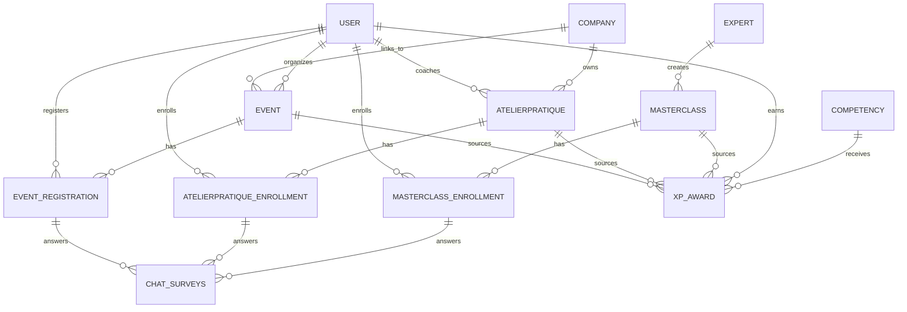

# 08 Masterclass, Atelier Pratique & Événements

**Version:** V1 Septembre 2026  
**Status:** 🟢 Spécification en cours  
**Effort estimé:** 280-350h  
**Timeline:** Semaines 9-16 (Phases 5-6, post-MVP)

---

## 📖 Vue d'Ensemble

### Contexte Global

Ce module regroupe **3 types de contenu vidéo/événementiel distinct** avec des publics, modèles économiques et workflows différents :

1. **Masterclass Premium** — Webinaires live 90min pour abonnés premium (B2C)
2. **Atelier Pratique** — Formations privées achetées par entreprises sur devis (B2B)
3. **Événements** — Événements publics/privés, distanciel/présentiel (B2C + B2B)

Chaque type a ses propres règles d'accès, capacités, pricing, et workflows post-session.

### Objectif Métier

- **Masterclass Premium** : Fidéliser abonnés premium via contenus exclusifs live avec experts, créer communauté d'apprentissage
- **Atelier Pratique** : Générer revenue B2B en proposant formations privées sur-mesure aux entreprises, avec authentification par entreprise et gestion de capacité stricte
- **Événements** : Élargir audience (public/privé) via événements flexibles (distanciel/présentiel), générer leads, créer communauté externe

### Qui l'Utilise (Rôles)

**Masterclass Premium :**
- **Apprenant premium** : Découvrir, s'inscrire, participer live, consulter replay
- **Expert interne** : Animer live webinaire
- **Super Admin** : Créer experts, planifier masterclasses, gérer inscriptions
- **Coach** : Recommander masterclasses complémentaires

**Atelier Pratique :**
- **Apprenant entreprise** : Consulter ateliers achetés par son entreprise, s'inscrire, participer
- **Manager entreprise** : Valider inscriptions, consulter participation, gérer overflow notifications
- **Super Admin** : Ajouter manuellement ateliers BO, gérer inscriptions, capacités
- **Coach entreprise** : Animer ateliers privés

**Événements :**
- **Public/Community** : Découvrir, s'inscrire (public), participer (distanciel/présentiel)
- **Company attendee** : S'inscrire événement lié à son entreprise (private)
- **Event organizer** : Créer/animer événements (Super Admin ou designated role)
- **Super Admin** : Gérer tous événements, capacités, locations

### Scope — IN / OUT

#### ✅ IN (V1 Septembre)

**Masterclass Premium (MVP complet):**
- Live 90min webinaires via Google Meet
- Premium subscriber auth via WooCommerce subscription + proprietary plugin
- Expert profiles (super admin creates, invites externally)
- Inscription 30j avant, fermeture J0 15:00
- Google Meet live avec Q&A + chat (recording OFF)
- Replay illimité sur Vimeo Pro avec iframe
- Matériaux via Google Meet docs + linked learning DB items
- XP award (fixed amount, different compétences)
- Satisfaction survey (1-5 + feedback text) → stored, displayed in Cahier #11
- Notifications (J-30, J-7, J-1, J0, 15min avant, post-live)
- Cadence 1 tous les 2 semaines (admin-scheduled)

**Atelier Pratique (MVP complet):**
- Private company-purchased (via devis, manually added by super admin)
- Max 12 participants (hard capacity limit)
- Company-authenticated access (apprenant sees only ateliers linked to their company)
- Distanciel (Google Meet) + Présentiel (location TBD, offline participation)
- Admin-validated inscriptions (Pending → Validated workflow)
- Overflow notifications to company manager (when registrations > capacity)
- Wait-list for overflow registrations
- One-time (non-recurring) scheduling
- Post-session resources (PDF, links uploaded by coach)
- Presence marking (admin or auto-tracking if possible)
- XP attribution (by compétence, amount)
- Satisfaction survey (same as Masterclass) → Cahier #11
- Google Meet for distanciel sessions

**Événements (MVP core):**
- Public + Private (company-linked) events
- Distanciel (Google Meet) + Présentiel (location specified)
- Created by super admin (organizer to be defined in future)
- Capacity limits (soft, with overflow handling)
- Open registration (public) or invite-based (private)
- No XP awards (focus on engagement, not credentials)
- Satisfaction survey (optional, basic)
- Post-event materials optional

#### ❌ OUT (Déféré)

- **Masterclass V2+** : External expert revenue sharing, auto-recording, auto-transcription, captions, FAQ generation, interactive transcripts, video translation
- **Atelier Pratique V2+** : Recurring ateliers, self-signup (vs admin validation), custom pricing per atelier
- **Événements V2+** : Ticketing system, sponsorship management, live streaming to external platforms, post-event networking features
- **All types** : Custom branding per event, live polls/surveys during session, speaker bios beyond name+photo

### Dépendances Critiques

**Dépend de:**
- **WooCommerce subscriptions + proprietary auth plugin** (Masterclass Premium access control) — doit être développé en parallèle ou existant
- **Google Meet API** (setup requis pendant développement)
- **Learning DB** (item linking pour Masterclass matériaux) — Module #1 (Formation)
- **Notification System** (email + in-app) — Système existant, intégration requise
- **XP Award System** (compétence-based) — Module #6 (Gamification)
- **Vimeo Pro account** (replay hosting) — Subscription existant, intégration API requise

**Bloque:**
- **Cahier #9 (Journal de Bord)** : Peut lier activités à Masterclass/Atelier participation
- **Cahier #11 (Back-Office & Analytics)** : Dashboard aggregates Masterclass + Atelier + Événements metrics
- **Cahier #14 (Chatbot & Q&R)** : FAQ generation depuis Masterclass Q&A (V2+)

---

## 📱 Écrans à Concevoir

### Masterclass Premium

#### Front-Office (React)

| Écran | Rôle | Description | Priorité |
|-------|------|-------------|----------|
| **Masterclass List** | Apprenant premium | Filters (Upcoming/Replays), card per masterclass (titre, expert photo, date, CTA "Register"/"View Replay") | P0 |
| **Masterclass Detail (Pre-Live)** | Apprenant premium | Expert photo, title, date/time/duration, description, [Register] button (if eligible), enrollment details (opens 30d before, closes J0 15:00) | P0 |
| **Masterclass Detail (Live)** | Apprenant premium | "EN DIRECT 🔴" badge, Google Meet embed OR link, Q&A + chat accessible | P0 |
| **Masterclass Detail (Post-Live)** | Apprenant premium | "REPLAY DISPONIBLE" badge, "You participated ✓", XP awarded (+amount), Vimeo iframe embed, materials (linked items + Google Meet docs), satisfaction survey (or "Thank you, you answered" if done), past responses visible | P0 |
| **Satisfaction Survey Modal** | Apprenant premium | Q1: Rating 5-point Likert emoji (😞 😐 🙂 😄 😍), Q2: Feedback text (optional), [Submit] | P0 |

#### Back-Office (WordPress Admin)

| Écran | Rôle | Description | Priorité |
|-------|------|-------------|----------|
| **Masterclass List** | Super Admin | Table: titre, expert name, date/time, enrolled/total, status (Draft/Scheduled/Live/Completed/Archived), [Edit] [Schedule] [Details] | P0 |
| **Masterclass Create/Edit** | Super Admin | Form: title, description, date/time, duration (90min default), expert dropdown (or invite new via email), max participants (unlimited), enrollment window dates (auto-calc 30d before), [Publish] [Schedule crons] | P0 |
| **Expert Management** | Super Admin | List: name, photo, email, creation date, [Invite] [Edit] [Delete], invite modal (send email link for expert to join platform if not member) | P0 |
| **Masterclass Analytics** | Super Admin | KPIs: enrolled, attended live, replay views, avg satisfaction; line chart (past 12 weeks), bar chart (satisfaction distribution), table detail (date, enrolled, attended, satisfaction avg) | P1 |

### Atelier Pratique

#### Front-Office (React)

| Écran | Rôle | Description | Priorité |
|-------|------|-------------|----------|
| **Atelier List** | Apprenant entreprise | Filters (Upcoming/Past), card per atelier (titre, coach name, date, location if présentiel, "Register"/"Pending"/"Participated"), company-filtered (only ateliers linked to apprenant's company) | P0 |
| **Atelier Detail (Pre-Live)** | Apprenant entreprise | Coach name+photo, title, date/time, mode (Distanciel/Présentiel), location (if présentiel), capacity indicator (X/12 enrolled), [Register] button (if slots available) OR "Waitlist" if full, capacité info, validation pending note | P0 |
| **Atelier Detail (Live - Distanciel)** | Apprenant entreprise | "EN DIRECT 🔴", Google Meet embed, resources section (coach-uploaded PDFs + links) | P0 |
| **Atelier Detail (Live - Présentiel)** | Apprenant entreprise | Location address, map, resources section, no Meet embed | P0 |
| **Atelier Detail (Post-Session)** | Apprenant entreprise | "COMPLETED ✓", coach name, XP awarded, resources downloadable, satisfaction survey, past feedback visible | P0 |
| **Waitlist Confirmation** | Apprenant entreprise | Modal: "You're on the waitlist (position #3). Manager notified of demand." | P0 |

#### Back-Office (WordPress Admin)

| Écran | Rôle | Description | Priorité |
|-------|------|-------------|----------|
| **Atelier List** | Super Admin | Table: titre, company, coach name, date, mode (Distanciel/Présentiel), enrolled/max (X/12), status (Draft/Published/Completed), waitlist count, [Edit] [Publish] [Manage Inscriptions] [Post-Session] | P0 |
| **Atelier Create/Edit** | Super Admin | Form: title, description, company (dropdown), coach (dropdown), date/time, mode, location (if présentiel), max 12 participants (fixed), [Publish] | P0 |
| **Atelier Inscriptions** | Super Admin | Table: user name, company role, registration date, status (Pending/Validated/Rejected/Waitlist), [Validate] [Reject] [Move to Waitlist], Manager notification toggle (notified when >12) | P0 |
| **Atelier Post-Session** | Super Admin | Section: [Mark Attendance] (checkbox list validated users), [Upload Resources] (PDF/links), [Assign XP] (dropdown compétence + amount), [View Survey Responses] | P0 |
| **Manager Notifications** | Super Admin | When atelier enrollment > capacity, auto-send to company manager: "Atelier [Name] overbooked. X users on waitlist." [View Details] | P1 |

### Updated FO Screens — Atelier & Masterclass

#### Screen: **Atelier Detail Page** (Learner)
- **Current:** Atelier info, "Register" button
- **NEW Addition:**
  - Credit cost: "Costs 3 credits" (prominent)
  - Balance check: "You have [X] credits"
  - If insufficient: "Register" button shows deficit + "Buy credits" button
  - Refund policy: "Cancellable until [Date] for full refund (7 days)"
- **Post-registration:** Shows "✅ Registered on [Date]" + calendar link
- **Cancel button:** If within 7d window, "Cancel & Refund" available
- **Priority:** P0

#### Screen: **Masterclass Detail Page** (Learner)
- **Current:** Masterclass info, "Register" button
- **Updates (Minimal):**
  - Shows "Included in subscription (0 credits)"
  - Registration instant (no modal)
  - "Register" button (green, always enabled)
- **Post-registration:** Shows "✅ Registered on [Date]"
- **NO refund available** (policy: subscription benefit, no refund)
- **Priority:** P0

#### Screen: **Atelier/Masterclass Calendar View** (Learner)
- **Shows:** All registered ateliers + masterclasses
- **Filters:** By date, type (atelier/masterclass), topic
- **Refund badges:** Shows "Refundable until [Date]" for ateliers <7d old
- **Priority:** P1

### Événements

#### Front-Office (React)

| Écran | Rôle | Description | Priorité |
|-------|------|-------------|----------|
| **Event List** | Public + Company users | Filters (Upcoming/Past, mode: Distanciel/Présentiel), card per event (title, date, mode, capacity indicator, "[Register Public]"/"[Register Private]") | P1 |
| **Event Detail (Pre-Event - Public)** | Public user | Title, description, date/time, organizer, mode, location (if présentiel), capacity (soft limit, non-blocking), [Register] | P1 |
| **Event Detail (Pre-Event - Private)** | Company user | Same as public + "Private event for [Company Name]", [Register] if eligible | P1 |
| **Event Detail (Live - Distanciel)** | Attendee | "EN DIRECT 🔴", Google Meet embed, resources (if provided) | P1 |
| **Event Detail (Post-Event)** | Attendee | "COMPLETED ✓", organizer info, resources download, basic satisfaction survey (optional) | P1 |

#### Back-Office (WordPress Admin)

| Écran | Rôle | Description | Priorité |
|-------|------|-------------|----------|
| **Event List** | Super Admin | Table: title, organizer, date, mode, public/private, enrolled, status (Draft/Scheduled/Live/Completed), [Edit] [Manage Registrations] [Post-Event] | P1 |
| **Event Create/Edit** | Super Admin | Form: title, description, date/time, organizer, mode (Distanciel/Présentiel), visibility (Public/Private), if Private: company link, location (if présentiel), [Publish] | P1 |
| **Event Registrations** | Super Admin | Table: user, registration date, attended (Y/N), [View Details] | P1 |
| **Event Post-Session** | Super Admin | [Upload Resources], [View Survey Responses], analytics section | P1 |

---

## ⚙️ Fonctionnalités (MVP)

### Masterclass Premium — Core
1. **Live 90min Webinaires** — Super admin schedules, Google Meet opens automatically 15min before, expert joins, apprenant can join and Q&A
2. **Expert Profile Management** — Super admin creates expert record (name, bio, photo), sends invitation email to expert to join platform
3. **Premium Subscriber Access** — WooCommerce subscription + proprietary plugin controls who can register (premium tier only)
4. **Registration & Enrollment** — Opens 30d before, closes J0 15:00, apprenant can register if premium + eligible
5. **Replay Hosting** — Google Meet recording (manually captured) OR auto-recording setup, uploaded to Vimeo Pro, iframe embedded on platform, unlimited retention
6. **Complementary Learning Items** — Link Formation DB items (parcours, lessons) to masterclass detail page for additional context
7. **XP Award System** — Fixed amount per masterclass, assignable to different compétences per attendee
8. **Satisfaction Survey** — Automated post-live survey (1-5 rating + feedback text), responses stored, displayed back to apprenant
9. **Notification Automation** — Email + in-app: J-30 (enrollment opens), J-7 (reminder), J-1 (final reminder), J0 morning (15min before live), post-live (survey + replay link)

### Atelier Pratique — Core
1. **Company-Linked Ateliers** — Super admin manually adds atelier to platform, links to specific company, apprenant sees only ateliers for their company
2. **Capacity Management** — Hard limit of 12 participants per atelier, no auto-expand, overflow creates wait-list
3. **Admin Validation Workflow** — Inscriptions start as Pending, super admin or company manager validates → Validated
4. **Wait-List & Overflow Notifications** — When atelier full, next registrations go to wait-list, manager notified of overflow demand
5. **Distanciel + Présentiel Support** — Choose mode at creation; distanciel uses Google Meet, présentiel specifies location (no virtual component)
6. **Resources Upload** — Post-session, coach uploads PDFs + links (Google Drive, external URLs) for distribution
7. **Presence Tracking** — Post-session, coach/admin marks attendance via checkbox list of validated registrants
8. **XP Attribution** — Post-session, coach/admin assigns XP by compétence + amount (flexible per session)
9. **Satisfaction Survey** — Same as Masterclass, post-session

### Atelier Registration with Credits & Refund Policy

1. **Atelier Cost & Availability**
   - Atelier included in all subscription plans (even free plan)
   - Costs 3 credits (hardcoded, per company pool or individual)
   - Masterclass included in subscription (0 credits)

2. **Atelier Registration**
   - Learner selects atelier, books seat
   - Cost deducted from wallet (individual) or company pool (company learner)
   - Inline purchase if insufficient (atomic transaction)

3. **Atelier Refund Window (7 days)**
   - Self-service cancellation <7 days before session
   - Auto-refund to wallet credit
   - No refund after 7 days (support review required)

### Masterclass (Included in Subscription — No Credits Required)

1. **Masterclass Availability**
   - Included in all subscription plans (even free plan)
   - No credit cost (costs 0 credits, not tracked as consumption)
   - Registration is simple confirmation (no payment flow)

2. **Masterclass Registration**
   - Learner views masterclass, clicks "Register"
   - Registration instant (no modal, no payment)
   - Calendar updated, confirmation email sent
   - No refund available (fixed policy)

### Événements — Core
1. **Public + Private Events** — Create event as public (anyone can register) or private (linked to company, only company members can register)
2. **Distanciel + Présentiel** — Mode choice, location optional (required for présentiel)
3. **Soft Capacity Limits** — Capacity defined but doesn't block registration (unlike Atelier 12-person hard limit)
4. **Registration Management** — Super admin views registrations, can export
5. **Optional Resources** — Post-event, organizer can upload materials (unlike Masterclass/Atelier where post-session resources are automatic)
6. **Basic Survey** — Optional satisfaction survey (simpler than Masterclass/Atelier, no XP tie-in)

### Secondary Features
- **Timezone Support** — All times displayed in apprenant's timezone (auto-convert from UTC storage)
- **Mobile Responsive** — All FO pages mobile-friendly (key for live access on phone/tablet)
- **Google Meet API Integration** — Auto-create Meet links, auto-open 15min before live, manage participants
- **Vimeo Pro API** — Upload recordings, get embed codes, set retention policies
- **Export Functionality** — Super admin can export registration lists, attendance, survey responses (CSV)

---

## 🚀 Possible Évolutions (V2+)

### V2 (Janvier 2027)

**Masterclass Premium:**
- **Auto-Recording & Transcription** — Google Meet auto-record, upload to Vimeo, auto-generate captions
- **FAQ Generation** — Parse Q&A from live session, auto-generate FAQ page per masterclass
- **Interactive Transcripts** — Click timestamp to jump to video moment
- **External Expert Revenue Sharing** — Non-internal experts can offer masterclasses, platform takes %, expert gets %
- **Notification Preferences** — Apprenant can opt-in/out by notification type (vs all mandatory)

**Atelier Pratique:**
- **Recurring Ateliers** — Support weekly/biweekly/monthly recurrence (not just one-time)
- **Self-Signup** — Atelier open for company members to self-register (vs admin validation)
- **Custom Pricing** — Different ateliers have different price points (tracked separately from subscription)

**Événements:**
- **Ticketing System** — Events can have ticket price, revenue tracking
- **Sponsorship Management** — Events can have sponsors, sponsor branding
- **Live Streaming to External Platforms** — Broadcast to YouTube/LinkedIn/etc simultaneously
- **Post-Event Networking** — Virtual networking room post-event (Gather.town or similar)

### V3 (Q2 2027+)

- **Video Translation** — Auto-subtitle in 4 languages
- **Speaker Bios** — Expandable expert/organizer bios beyond name+photo
- **Series/Tracks** — Group multiple masterclasses into learning tracks
- **Cohort-Based Ateliers** — Groups of ateliers sold as bundles

---

## 👥 User Journeys (Format 3 — CRITICAL SECTION)

### MASTERCLASS PREMIUM

---

### User Journey #1 : Apprenant Premium → Découverte & Inscription Masterclass

**Acteur :** Apprenant premium (utilisateur abonné au plan premium via WooCommerce)  
**Déclencheur :** Reçoit email J-30 "Une nouvelle masterclass premium disponible"  
**Objectif :** Découvrir masterclass, vérifier son intérêt, s'inscrire avant la limite J0 15:00

#### Étapes Détaillées

1. **Apprenant clique le lien dans l'email de notification J-30**
   - Email: "Inscriptions ouvertes : [Masterclass Title]" avec link vers FO
   - Clique → landing page se charge
   - Système charge liste masterclasses (cached si possible)
   - Affiche: toutes masterclasses avec filter "Upcoming" pré-sélectionné
   - Feedback : Page affiche 500ms, skeleton loading, puis contenu renderisé
   - Durée : ~500ms

2. **Apprenant localise la masterclass spécifique dans la liste**
   - Voit cards : titre, expert photo + nom, date/heure formatée (Paris timezone), CTA "Register"
   - Scroll ou search si plusieurs masterclasses
   - Clique sur card OR sur [Register] button
   - Système vérifie apprenant's WooCommerce subscription status (premium?) en arrière-plan
   - Feedback : Card a hover effect (slight shadow), clique → detail page load ~300ms
   - Durée : ~300ms

3. **Masterclass detail page s'ouvre (Pre-Live state)**
   - Expert photo (large, top), titre h1, date/heure formatée (Paris), durée "90 minutes"
   - Description (markdown rendered), tableau inscription infos:
     - "Inscriptions ouvertes le [J-30 date]"
     - "Inscriptions ferment le [J0 date] à 15:00"
     - "Vous êtes [subscriber status: Premium ✓ / Besoin premium]"
   - [S'inscrire] button prominent (if not registered + subscription valid + enrollment window open)
   - OR "Vous êtes inscrit ✓" badge (if already registered)
   - OR "Besoin abonnement premium" message + [Upgrade] link (if not premium)
   - Feedback : Green CTA, hover state = darker green, clique = loading spinner
   - Durée : Instant (already cached from list load)

4. **Apprenant clique [S'inscrire] button**
   - Système vérifie dernier fois : subscription valid? enrollment window open? not already registered?
   - Si OK : POST /api/masterclass/{id}/register → enrollment créé avec status "enrolled"
   - Système envoie confirmation email : "Vous êtes inscrit à [Masterclass]. Live le [date] à 14:00. Google Meet link sera envoyé à J-1."
   - Feedback : Button devient "Vous êtes inscrit ✓", page refreshe légèrement, toast notification "Inscription confirmée !"
   - Durée : ~500ms (API call + response)

5. **Apprenant reçoit rappels progressifs (J-7, J-1, J0)**
   - Emails automatiques via cron jobs (voir Scheduling & Notifications detail)
   - Email J-7 : "Masterclass dans 7 jours : [Title] — Vendredi 14h UTC. [Voir détails]"
   - Email J-1 9h : "[Title] DEMAIN À 14H ! Google Meet link : [link]. [Rejoindre]"
   - Email J0 8h : Final reminder (optionnel, configurable par super admin)
   - Email J0 13h45 : "Masterclass commence dans 15 minutes ! Rejoignez ici : [Meet link]"
   - In-app notifications parallèlement (bell icon, dropdown shows recent events)
   - Feedback : Emails + in-app badges, apprenant peut cliquer directement pour rejoindre
   - Durée : Automated, aucune action apprenant requise

#### Conditions de Succès ✅
- [ ] Apprenant premium reçoit email J-30 avec link valide
- [ ] Detail page charge en <800ms
- [ ] [S'inscrire] button visible si apprenant premium + dans enrollment window
- [ ] Inscription sauvegardée en DB avec timestamp
- [ ] Confirmation email envoyée immédiatement post-registration
- [ ] Rappels (J-7, J-1, J0) arrivés avec Google Meet link en J-1
- [ ] Apprenant peut voir son statut d'inscription sur detail page
- [ ] Timezone conversion correct (UTC → user timezone)

#### Erreurs & Edge Cases ❌

**Cas 1 : Apprenant non-premium tente de s'inscrire**
- Scénario : Utilisateur non-abonné accède detail page (via direct link ou vieux email), clique [S'inscrire]
- Comportement attendu :
  - Système détecte WooCommerce subscription missing/expired
  - [S'inscrire] button disabled, shows "Abonnement premium requis"
  - Modal/toast offers [Upgrade Plan] CTA
  - POST /api/masterclass/{id}/register returns 403 Forbidden si tentée via API
- Feedback : Clear message "Seuls les abonnés premium peuvent s'inscrire. [Voir plans]"
- Impact : Prevent invalid registrations, convert user to premium

**Cas 2 : Apprenant s'inscrit après J0 15:00 (enrollment window fermée)**
- Scénario : Apprenant clique lien email J-1 mais par erreur accède masterclass après 15:00 J0
- Comportement attendu :
  - Système détecte NOW > enrollment_close_time
  - [S'inscrire] button disabled, shows "Inscriptions fermées"
  - Message : "Masterclass commence à 14h. Si live en cours, accédez [Rejoindre le live]"
  - POST returns 410 Gone
- Feedback : Clear explanation, CTA to join live if masterclass started
- Impact : Maintain enrollment deadline integrity, but offer live access

**Cas 3 : Apprenant offline lors du cron job notification J-1**
- Scénario : Apprenant offline, email J-1 sent mais pas reçue
- Comportement attendu :
  - Email queued dans notification system avec retry logic (3x over 2h)
  - In-app notification queued, affiché quand apprenant reconnecté
  - Si pas received avant live, apprenant peut still join live (Google Meet link accessible sur detail page)
- Feedback : In-app notification appears when user logs back in, email retry transparent
- Impact : Ensure user doesn't miss masterclass due to connectivity

**Cas 4 : Apprenant tries to register twice**
- Scénario : Apprenant refreshes page, accidentally clique [S'inscrire] twice rapidly
- Comportement attendu :
  - 1st click → enrollment created, button changes to "Vous êtes inscrit ✓"
  - 2nd click → button disabled or shows "Déjà inscrit", POST returns 409 Conflict
  - No duplicate enrollment created (DB unique constraint on user_id + masterclass_id)
- Feedback : Button state updated immediately, no double confirmation
- Impact : Data integrity, prevent accidental duplicates

---

### User Journey #2 : Apprenant Premium → Participation Live & Replay

**Acteur :** Apprenant premium (inscrit)  
**Déclencheur :** Masterclass live commençant à 14h UTC (apprenant a reçu Google Meet link par email J-1 13h45)  
**Objectif :** Rejoindre live webinaire, participer à Q&A, éventuellement regarder replay si absent

#### Étapes Détaillées

1. **Apprenant reçoit email final 15min avant live (J0 13h45)**
   - Email subject : "Masterclass commence dans 15 minutes !"
   - Contenu : "Masterclass [Title] avec [Expert Name] commence à 14h. Rejoignez ici : [Google Meet link]"
   - Email also includes: tips ("Webcam recommended", "Arrive 5min early for Q&A")
   - Lien cliquable → Google Meet opens in new tab
   - Feedback : Email formaté, Meet link actif
   - Durée : Instant (email delivery)

2. **Apprenant clique Google Meet link, Meet tab ouvre**
   - Browser opens https://meet.google.com/[MEETING_ID]
   - Google Meet interface loads (~2s for Google services)
   - Affiche : prompt "Allow camera/microphone?" (user can allow or deny)
   - Expert déjà connecté, broadcast "Masterclass starting in 5 minutes! Welcome [Expert Name]"
   - Feedback : Video grid visible, expert visible or waiting room, chat sidebar
   - Durée : ~2s

3. **Apprenant joins meet, expert starts live webinaire**
   - Apprenant video tile appears (or audio-only if camera disabled)
   - Expert starts presentation (screen share common)
   - Chat enabled for Q&A moderation (admin/expert can manage)
   - Expert presents for ~80 minutes, apprenant can ask questions in chat
   - Feedback : Video/audio flowing, chat messages real-time, screen share responsive
   - Durée : 90 min total (80-90 presentation + 0-10 Q&A)

4. **Q&A happening live in Google Meet chat**
   - Apprenant types question in chat : "How does this apply to remote teams?"
   - Expert reads chat, responds verbally or types back
   - Other apprenants can "+1" questions (like feature support if available in Meet)
   - NO custom FO Q&A widget (all in Meet native chat)
   - Feedback : Chat history visible, new messages appear instantly
   - Durée : Throughout session

5. **Masterclass ends, expert leaves meet**
   - Expert : "Thank you all! Survey link sent to your email. Recording available in 30min."
   - Apprenant still in meet with other participants
   - Can optionally leave now or stay in open meet (Google Meet default behavior)
   - Feedback : Expert goodbye message, meeting still accessible for ~5 min after
   - Durée : 5 min post-session

6. **Apprenant receives post-live email (30min after end)**
   - Email subject : "Merci d'avoir participé au masterclass [Title]!"
   - Contenu :
     - Survey link : "[Répondre au sondage satisfaction]"
     - Replay link : "[Regarder le replay]"
     - Materials : "Slides et ressources : [link to Vimeo page with related learning items]"
     - XP confirmation : "Vous avez reçu +50 XP pour participation live"
   - Feedback : Email, links working, XP visible in profile if apprenant refreshes
   - Durée : Email sent automatically 30min post-end

7. **Apprenant answers satisfaction survey (optional but encouraged)**
   - Clique survey link → modal/page opens
   - Q1 : "Comment avez-vous trouvé ce masterclass ?" → 5-point emoji Likert (😞 😐 🙂 😄 😍)
   - Q2 : "Commentaires ou suggestions ?" → textarea (optional)
   - [Soumettre] button
   - Système stores responses in chat_surveys table (or dedicated table)
   - Feedback : "Merci pour votre retour !" confirmation
   - Durée : ~2 min to answer

8. **Apprenant views replay later (next day or weeks after)**
   - Visits masterclass detail page (via email link or navigating FO masterclass list)
   - Page state changed to "REPLAY DISPONIBLE" badge
   - Displays: "Vous aviez participé en live ✓"
   - XP already awarded from live, displayed
   - Vimeo iframe embed central (responsive, autoplay=false)
   - Below video : Materials section with linked learning DB items + Google Meet docs links
   - If not answered survey yet: [Répondre au survey]
   - If survey answered : shows past responses (rating + feedback)
   - Feedback : Vimeo player interactive, quality selection available, playback smooth
   - Durée : Instant (Vimeo iframe)

#### Conditions de Succès ✅
- [ ] Email J0 13h45 arrives with correct Google Meet link
- [ ] Google Meet link valid and opens successfully
- [ ] Apprenant appears in participant list on expert's end
- [ ] Chat Q&A functional (messages appear real-time for all)
- [ ] No recording stored on platform automatically (OFF per requirement)
- [ ] Post-live email (30min after) includes survey + replay + materials
- [ ] Survey responses stored and displayed back to apprenant
- [ ] XP awarded immediately post-live
- [ ] Replay iframe loads in <2s on detail page
- [ ] Materials (related items + docs) accessible on detail page
- [ ] Timezone conversions consistent throughout

#### Erreurs & Edge Cases ❌

**Cas 1 : Apprenant loses internet connection during live**
- Scénario : Apprenant connected 30min into masterclass, internet drops for 5min
- Comportement attendu :
  - Google Meet detects connection loss, shows "Reconnecting..." overlay
  - Apprenant can click [Reconnect] or close
  - If reconnects within ~10min : rejoins meet, sees history since disconnect
  - If leaves/timeout : can rejoin meet link again (Google Meet allows rejoin)
  - XP for live participation : awarded if >50% of session attended (threshold TBD with Pierre)
- Feedback : Google Meet native reconnect UI, apprenant option to rejoin or watch replay
- Impact : Graceful degradation, capture participation if possible, allow replay fallback

**Cas 2 : Apprenant attends live but skips satisfaction survey**
- Scénario : Apprenant participates, leaves meet, ignores post-live email + survey
- Comportement attendu :
  - XP still awarded (live attendance tracked independently)
  - Replay always accessible (survey not blocking)
  - Survey available anytime on detail page (no expiry)
  - Super admin can see "survey not completed" in analytics dashboard (Cahier #11)
- Feedback : Survey optional, no nagging, data tracked separately from XP
- Impact : Encourage participation, don't punish non-survey-answerers

**Cas 3 : Apprenant tries to access replay without being enrolled**
- Scénario : Apprenant not registered for masterclass (or premium subscription lapsed), tries to access detail page replay
- Comportement attendu :
  - Detail page loads, but Vimeo iframe NOT embedded
  - Message : "Seuls les participants live et abonnés premium peuvent regarder le replay"
  - CTA : "[S'inscrire à la masterclass]" (if next masterclass available)
  - OR : "[Renouveler abonnement]" (if premium subscription expired)
- Feedback : Clear access restriction, CTAs to resolve (self-serve or upgrade)
- Impact : Protect replay exclusivity, convert to premium or encourage re-registration

**Cas 4 : Expert no-shows (doesn't join Google Meet at scheduled time)**
- Scénario : Expert doesn't appear by 14h + 5min grace period
- Comportement attendu :
  - Super admin monitoring dashboards sees "expert not connected" alert
  - Super admin decision : reschedule OR cancel (no refund per decision)
  - If reschedule : apprenant gets email "Masterclass rescheduled to [new date]. Still registered. New Google Meet link : [link]"
  - If cancel : apprenant gets email "Masterclass [Title] cancelled. No XP awarded. No refund (subscription-based)."
  - Attendance tracking : apprenant marked "attended late" or "absent" based on when expert joined
- Feedback : Automated communication, apprenant kept informed
- Impact : Business continuity, set expectations (no refunds for subscription-based model)

---

### User Journey #3 : Expert Interne → Animer Masterclass Live

**Acteur :** Expert interne (coach or subject matter expert, invited by super admin)  
**Déclencheur :** Super admin créé expert account + scheduled masterclass 7 jours avant live  
**Objectif :** Préparer et animer masterclass live, répondre Q&A, fin avec apprenant feedback

#### Étapes Détaillées

1. **Super admin crée expert profile en BO**
   - BO Expert Management page : [Invite Expert] button
   - Form : first name, last name, email, bio (optional), photo upload
   - [Invite] → system sends email to expert
   - Email : "Vous avez été ajouté comme expert sur la plateforme Learning App. Cliquez ici pour créer votre compte : [Magic link]"
   - Feedback : Form validation (email required), photo resizable
   - Durée : ~2 min pour super admin

2. **Expert clique email link, crée compte**
   - Magic link → expert registration page
   - Pre-filled : email (from invite), name (from profile)
   - Expert fills : password, accepts T&Cs
   - [Create Account] → account created with role "expert"
   - Expert can login et voir son expert dashboard (future feature, MVP : expert peut voir email notification only)
   - Feedback : Confirmation "Account created!" + dashboard redirect
   - Durée : ~1 min

3. **Super admin schedules masterclass linked to expert (7 days before)**
   - BO Masterclass Create form :
     - Title : "Leadership in Crisis"
     - Expert dropdown : (selects [Expert Name])
     - Date/time : "May 15, 14:00 UTC"
     - Description, max participants (unlimited), enrollment window (30d before auto)
   - [Publish] → masterclass scheduled, cron jobs queued
   - Feedback : Confirmation toast "Masterclass scheduled. Expert invited."
   - Durée : ~3 min

4. **Expert receives email notification (7 days before)**
   - Email : "Vous animez un masterclass ! Leadership in Crisis — 15 mai à 14h UTC"
   - Content : masterclass title, date/time, expected participants (enrolled count auto-updated as apprenants register)
   - Inclut : "[Voir les détails]" link to expert dashboard where they can see participant list
   - Durée : Automated

5. **Expert reviews participant list & prepares content (day before)**
   - Expert logs into platform
   - Expert dashboard shows : "Upcoming Masterclass" with [Voir Détails]
   - Details page : participant count (e.g., 45 enrolled), participant list (can view attendee names/emails if permission granted — TBD)
   - Materials section : "You can share : [Upload Slides] [Paste links]" (vs uploading — materials shared via Google Meet docs or Vimeo)
   - Feedback : Clean dashboard, easy access to participant info
   - Durée : 30-60 min prep (variable)

6. **Expert logs into Google Meet 10-15 min before live (14:00 UTC)**
   - Expert receives email J0 13h45 : "Masterclass starts in 15 minutes! Google Meet : [link]"
   - Clicks link, Google Meet loads
   - Expert checks video/audio (tests mic, camera)
   - Expert can screen-share preparation (optional, TBD if want to start with video or screen)
   - Broadcast message pre-live : "Welcome! Masterclass starting in 5 minutes. Please enable video/audio if possible."
   - Feedback : Meet interface, participant count shown ("X participants waiting")
   - Durée : 10 min prep

7. **Expert presents & moderates Q&A live (90 min total)**
   - Expert starts screen share (slides/demo)
   - Expert presents content for ~80 min (structure : intro 10min, content 60min, Q&A 10min)
   - During session : expert watches chat for Q&A questions
   - Expert can : pause presentation, answer questions verbally, suggest learners post in chat
   - Expert can remove disruptive participants (Google Meet native moderation)
   - Chat moderation : expert + platform can delete inappropriate messages
   - Feedback : Screen share smooth, chat real-time, participant count visible
   - Durée : 90 min

8. **Expert ends masterclass, apprenant gets post-session email**
   - Expert : "Thank you all! Survey available — feedback helps us improve."
   - Expert leaves Google Meet
   - System triggers : 30min timer, then sends post-live email to all attendees (survey + replay link + materials + XP confirmation)
   - Feedback : Expert sees "Masterclass ended successfully. X participants attended. Survey responses incoming over next 24h."
   - Durée : Automated, immediate

#### Conditions de Succès ✅
- [ ] Expert invited and account created successfully
- [ ] Expert receives email notifications (scheduling, day-before, 15min before)
- [ ] Expert can view participant list and count
- [ ] Google Meet link functional for expert
- [ ] Expert can screen-share, moderate chat, remove participants
- [ ] All apprenants see expert in Meet and can interact
- [ ] Post-session communications sent (survey, replay, XP) within 30min
- [ ] Expert can provide feedback to super admin (e.g., tech issues) post-session

#### Erreurs & Edge Cases ❌

**Cas 1 : Expert account creation email not received**
- Scénario : Expert not in inbox, spam folder, or email typo by super admin
- Comportement attendu :
  - Super admin can resend invite email from expert management page [Resend Invite]
  - OR expert can use platform "Forgot Password" flow if they know their email
  - If 2 days before masterclass : super admin notified "Expert not activated" and can reschedule/cancel
- Feedback : Resend option visible, clear communication
- Impact : Ensure expert onboarding, catch issues early

**Cas 2 : Expert joins meet 5 min late (14:05 instead of 14:00)**
- Scénario : Expert delayed, apprenant already in meet, waiting
- Comportement attendu :
  - Expert joins, video/audio appears, "Expert has joined" system message in chat
  - Expert can assume control, start presentation
  - Masterclass continues (90 min clock starts when expert joins, or flexible TBD)
  - Apprenant stay in meet, no XP penalty for expert lateness
- Feedback : Transparent join notification, flow continues
- Impact : Handle real-world delays gracefully, don't penalize apprenant

**Cas 3 : Expert forgets to share screen/demo, need to restart**
- Scénario : Expert starts presentation but screen share fails first time
- Comportement attendu :
  - Expert can restart screen share (Google Meet native, no platform control)
  - Apprenant see "Screen share loading..." overlay
  - Masterclass continues without stopping (flexible timing allows this)
- Feedback : Native Google Meet UX, expert has control
- Impact : Technical issues handled by expert with Google Meet tools

---

### ATELIER PRATIQUE

---

### User Journey #4 : Apprenant Entreprise → Inscription & Participation Atelier Pratique

**Acteur :** Apprenant entreprise (employé, company-authenticated)  
**Déclencheur :** Apprenant's company purchased atelier "Communication Efficace" via devis; super admin added to platform and notified manager  
**Objectif :** Découvrir atelier, s'inscrire (validation), participer (distanciel ou présentiel), finaliser avec présence + XP

#### Étapes Détaillées

1. **Apprenant reçoit notification interne (company manager ou email)**
   - Company manager notified by super admin : "Atelier [Name] available for your team"
   - Manager forwards to apprenant OR apprenant discovers in FO atelier list (company-filtered)
   - Apprenant clicks notification OR navigates FO Atelier Pratique list
   - FO loads : Filters (Upcoming / Past), cards per atelier (company-filtered — apprenant only sees ateliers linked to their company)
   - Feedback : Cards show titre, coach name, date, mode icon (distanciel/présentiel), "Register" or "Waitlist" status
   - Durée : ~300ms page load

2. **Apprenant clicks atelier card → detail page**
   - Detail displays : coach photo + name, titre, date/time, mode (Distanciel / Présentiel)
   - If Présentiel : location address, map embed
   - Capacity indicator : "8/12 inscrits" (visual bar or number)
   - [S'inscrire] button prominent (if slots available)
   - OR if full : [Rejoindre waitlist] button
   - Text : "Inscription soumise à validation du coach/admin. Vous recevrez une confirmation."
   - Feedback : Detail page loads instantly, CTA button clear
   - Durée : Instant

3. **Apprenant clique [S'inscrire]**
   - Modal/form appears : "Confirmer inscription à [Atelier]?"
   - Shows : date, time, capacity, mode, location (if présentiel)
   - [Confirmer] button
   - Système : creates inscription with status "Pending" (not Validated yet), stores apprenant_id + atelier_id + timestamp
   - POST /api/atelierpratique/{id}/register → returns 200 OK + inscription_id
   - Feedback : Button changes to "Inscription en attente de validation", toast notification "Inscription soumise! Vous recevrez une confirmation."
   - Durée : ~500ms API call

4. **Apprenant receives confirmation email (same-day)**
   - Email : "Votre inscription à [Atelier Name] est en attente de validation"
   - Content : date, time, coach name, mode, location (if présentiel)
   - Note : "Vous recevrez un email de confirmation une fois votre inscription validée par l'admin."
   - Feedback : Clear status communication
   - Durée : Automated (within 1 hour)

5. **Admin/coach validates inscription (asynchronous, can be hours or days later)**
   - BO Atelier Inscriptions page : table of Pending registrations
   - Super admin OR coach clicks [Validate] on apprenant's row
   - Status changes : Pending → Validated
   - System triggers email to apprenant : "Votre inscription à [Atelier] est confirmée!"
   - Content : date, time, Google Meet link (if distanciel), location (if présentiel), contact coach email, "See you there!"
   - Feedback : Admin sees status update, apprenant gets confirmation email
   - Durée : Async (variable, hours to days)

6. **Apprenant attends atelier (day of event)**

   **6a. DISTANCIEL path (Google Meet):**
   - Apprenant receives reminder email (J-1 or morning-of) with Google Meet link
   - Clicks link → Google Meet tab opens 10-15 min before start
   - Coach already connected, participants trickling in
   - Apprenant joins, video/audio, coach starts presentation/activity
   - Format : could be lecture, Q&A, workshop, demo (depends on content, stored in apprenant notes)
   - Chat available for questions
   - Feedback : Meet video/audio flowing, coach visible, resources can be shared via chat or description
   - Durée : Depends on atelier (typically 2-3 hours, stored in atelier setup)

   **6b. PRÉSENTIEL path (in-person):**
   - Apprenant travels to location (address provided in advance)
   - Arrives at venue, checks in (check-in mechanism TBD : app QR code? manual list? coach notes?)
   - Coach leads session in-person
   - Apprenant participates in person
   - Feedback : Manual/digital checkin, apprenant present in room
   - Durée : Same timing as distanciel counterpart (typically 2-3h)

7. **Post-session : Coach/admin marks attendance & assigns XP**
   - BO Atelier Post-Session page : list of participants
   - Coach/admin checks boxes for attendees ("Présent" checkbox)
   - [Save Attendance]
   - Coach/admin selects competency dropdown + amount : e.g., "Communication" + 40 XP
   - [Assign XP] → system awards XP to all marked-present apprenanants
   - Feedback : Checkboxes updated, toast "Présence enregistrée et XP attribué"
   - Durée : ~5 min pour coach

8. **Apprenant receives post-session email + satisfaction survey**
   - Email (sent automatically when coach marks attendance) : "Merci d'avoir participé à [Atelier]!"
   - Content : coach name, date, "XP awarded : +40 for Communication", survey link
   - Q1 : Satisfaction 5-point emoji Likert
   - Q2 : Feedback text (optional)
   - Feedback : Email + survey modal/page, links working
   - Durée : Email sent immediately post-attendance marking

#### Conditions de Succès ✅
- [ ] Apprenant sees only ateliers linked to their company
- [ ] Detail page shows capacity (X/12) accurately
- [ ] [S'inscrire] disabled when capacity full, shows [Waitlist] instead
- [ ] Pending inscription status visible to apprenant until validated
- [ ] Admin can validate/reject inscriptions from BO
- [ ] Google Meet link functional for distanciel ateliers
- [ ] Attendance can be marked post-session
- [ ] XP assigned only to marked-present apprenants
- [ ] Satisfaction survey collected post-session
- [ ] Apprenant sees XP confirmation + survey in email

#### Erreurs & Edge Cases ❌

**Cas 1 : Apprenant tries to register after capacity full (12/12)**
- Scénario : 11 validated, 1 pending. Apprenant #13 clicks [S'inscrire]. While loading, apprenant #11 gets validated, moving to 12/12.
- Comportement attendu :
  - [S'inscrire] button already disabled (shows "Complet") at page load time
  - If apprenant somehow clicks : POST returns 409 "Atelier full"
  - Modal appears : "Cet atelier est complet. Rejoindre la liste d'attente ?"
  - [Oui] → creates waitlist entry, apprenant notified "Vous êtes en liste d'attente (position #2)"
  - Waitlist auto-managed : if someone cancels, next on waitlist can auto-move to validated slot (or requires admin action TBD)
- Feedback : Clear messaging, waitlist option transparent
- Impact : Enforce capacity limits, manage overflow fairly

**Cas 2 : Apprenant's company loses license/subscription before atelier**
- Scénario : Company's contract ends, ateliers should be removed or locked from FO
- Comportement attendu :
  - Super admin action : unpublish atelier OR mark as "Company no longer authorized"
  - Apprenant FO : atelier disappears from list OR shows "Not available"
  - Apprenant already registered : can still attend (sunk cost, let them finish) OR admin can reject registration and notify
  - Apprenant notified if registration rejected : "Atelier cancelled. Please contact your manager."
- Feedback : FO updates, admin control clear
- Impact : Handle subscription churn, prevent unauthorized access

**Cas 3 : Manager notified of overflow (atelier full, X on waitlist)**
- Scénario : Atelier registered 12/12, 3 more registrations pending on waitlist. Super admin configured "notify manager when waitlist exists"
- Comportement attendu :
  - System sends email to company manager : "Atelier [Name] is overbooked. 3 people on waitlist. [View Details]. [Book additional session?]"
  - Manager can opt to : request another session, cancel some apprenant registrations to make room, leave as-is
  - Manager CTA : "[Request additional atelier]" → creates demand/ticket for super admin follow-up
- Feedback : Manager informed, actionable CTAs
- Impact : Business development (upsell), customer satisfaction (handle overflow)

**Cas 4 : Apprenant registered but doesn't show up (no-show)**
- Scénario : Apprenant validated, but doesn't join Google Meet (distanciel) or show at location (présentiel)
- Comportement attendu :
  - Coach marks attendance : Apprenant NOT checked
  - Apprenant doesn't receive XP email (only attendees get XP)
  - Apprenant's BO record shows "Absent" status
  - Super admin can later review no-show rate by apprenant/company
- Feedback : No penalty to apprenant (MVP), but absence tracked
- Impact : Data collection for future features (e.g., V2 auto-remove for repeated no-shows)

---

### User Journey #5 : Super Admin → Ajouter Atelier via Devis & Gérer Inscriptions

**Acteur :** Super Admin  
**Déclencheur :** Company sends devis request "200 hours training, Communication skills, up to 5 sessions"; super admin approval & manual setup  
**Objectif :** Create multiple atelier records in BO, set capacity, enable company apprenant enrollment

#### Étapes Détaillées

1. **Super admin receives devis (external, email or CRM)**
   - Email from company : "We want 5 sessions of Communication training, max 10 people per session, starting June 1. Quote request."
   - Super admin reviews : company name, requested dates, topic, max participants per session
   - Devis approval (external process, not in platform) : super admin agrees to budget/timeline
   - Super admin opens BO Atelier Pratique create form
   - Feedback : External process, now entering platform setup
   - Durée : Variable (devis negotiation external)

2. **Super admin creates 1st atelier record in BO**
   - BO Create Atelier form :
     - Title : "Communication Efficace - Session 1"
     - Company : [dropdown] selects "CompanyName"
     - Coach : [dropdown] selects coach assigned to this company
     - Date : June 1, 2026
     - Time : 14:00 UTC
     - Mode : [Distanciel] OR [Présentiel]
     - If Présentiel : Location input (address, map if needed)
     - Max Participants : 10 (hard limit)
     - Description : brief overview of content
   - [Publish] → atelier created with status "Published", ready for enrollment
   - System does NOT auto-notify apprenants (company manager notifies or super admin sends bulk email)
   - Feedback : Confirmation toast "Atelier créé et publié!"
   - Durée : ~3 min per atelier

3. **Super admin creates 4 more atelier records (sessions 2-5)**
   - Repeats step 2 for June 8, 15, 22, 29 (5 sessions total)
   - BO List page now shows : 5 ateliers for company, all "Published", empty enrollment (0/10 each)
   - Feedback : List updates, all 5 visible
   - Durée : ~15 min total (3 min × 5)

4. **Super admin (optional) sends bulk notification to company members**
   - BO Atelier List page : [Send Notification] bulk action (if multiple selected)
   - Email template : "New training sessions available for your team : [List of 5 ateliers]. Sign up : [Platform link]"
   - Sent to all users with company="CompanyName"
   - OR : Super admin sends via email separately (external to platform)
   - Feedback : Email queue, status "Sent"
   - Durée : Automated

5. **Apprenants register (async, hours/days later)**
   - Apprenants discover ateliers in FO (company-filtered list or email notification)
   - Click [S'inscrire] → registration created as "Pending"
   - Apprenant receives email : "Inscription en attente"
   - Feedback : FO and email, apprenant informed
   - Durée : Async

6. **Super admin/coach validates registrations (before atelier date)**
   - BO Atelier Inscriptions page : table of registrations per atelier
   - For Session 1 (June 1) : 12 registrations pending, but max capacity 10
   - Super admin reviews list, decides who to validate
   - Approach 1 : Validate 10 (first come first served), rest → Waitlist
   - Approach 2 : Validate all 10, move next 2 to Waitlist, notify manager of overflow
   - Super admin clicks [Validate] on 10 rows
   - Status changes Pending → Validated
   - System sends confirmation email to 10 apprenants
   - 2 on waitlist receive email : "On waitlist (position #1). If space opens, you'll be notified."
   - Feedback : Status updates, emails sent
   - Durée : ~10 min (validate 12 registrations)

7. **Company manager receives overflow notification (if configured)**
   - Email : "Session 1 [Communication] overbooked. 2 people on waitlist. [View Details] [Book additional session]"
   - Manager can click [Book additional session] → creates request ticket for super admin
   - Super admin sees request : "Company requested additional Communication session for June 8 (overflow from June 1)"
   - Super admin decides : create 2nd session same day (June 1, 18:00) OR suggest June 8, 2nd coach
   - Feedback : Manager empowered, super admin aware of demand
   - Impact : Revenue opportunity (upsell)

#### Conditions de Succès ✅
- [ ] Super admin can create ateliers for any company
- [ ] Capacity (max 12) enforced at creation and enrollment
- [ ] Validations of pending registrations possible from BO
- [ ] Overflow notifications sent to manager when waitlist created
- [ ] Distanciel + Présentiel modes both functional
- [ ] Apprenants see only ateliers for their company in FO
- [ ] Validated apprenants receive confirmation email with Google Meet link (distanciel) or location (présentiel)

#### Erreurs & Edge Cases ❌

**Cas 1 : Super admin creates atelier with wrong company**
- Scénario : Super admin selects "CompanyA" dropdown but meant "CompanyB"
- Comportement attendu :
  - Atelier created with CompanyA link
  - CompanyA apprenants see atelier (searchable from FO)
  - CompanyB apprenant cannot see atelier (filtered by company)
  - Super admin can edit atelier BO record : change company to CompanyB [Edit] [Company dropdown] [Save]
  - If already published with wrong company : super admin can [Unpublish] then [Edit] then [Republish]
  - If registrations already exist : super admin notified "Cannot change company (registrations exist)" — must delete registrations or create new atelier
- Feedback : Clear error messaging, edit capability
- Impact : Data integrity, fix mistakes easily before enrollment

**Cas 2 : Coach not assigned when atelier published**
- Scénario : Super admin creates atelier but doesn't fill "Coach" field (leaves blank or selects "TBD")
- Comportement attendu :
  - [Publish] button disabled or shows warning : "Coach required to publish"
  - Super admin must assign coach before publishing
  - OR : [Publish as Draft] option, coach assigned later before 1 week before atelier
- Feedback : Form validation, clear requirement
- Impact : Ensure coach assigned before apprenants enroll

---

### ÉVÉNEMENTS (Brief, as lower priority)

---

### User Journey #6 : Public User → Discover Public Event & Register

**Acteur :** Public user (not company-authenticated, potential customer/community)  
**Déclencheur :** Event announced on Learning App platform or social media  
**Objectif :** Find event, understand content, register for public event (distanciel/présentiel)

#### Étapes Détaillées

1. **User navigates to Events list (FO)**
   - Filters : Upcoming / Past, Mode (Distanciel / Présentiel)
   - Cards : title, date, organizer, capacity indicator, "[Register Public]" button
   - Feedback : List loads ~300ms, cards responsive
   - Durée : Instant

2. **User clicks event card → detail page**
   - Title, description, date/time, organizer, mode
   - If Présentiel : location address, map
   - Capacity (soft limit) : "X/Y registered" (non-blocking)
   - [Register] button
   - Feedback : Detail page instant, CTA clear
   - Durée : Instant

3. **User clicks [Register]**
   - If not logged in : redirect to login/signup
   - If logged in : registration created, confirmation email sent
   - Apprenant receives email : "You're registered for [Event]! [Voir détails] [Add to calendar]"
   - Feedback : Email, confirmation toast
   - Durée : ~500ms

4. **User participates (day of event)**
   - Similar to masterclass/atelier (distanciel = Google Meet, présentiel = location-based)
   - Feedback : Event proceeds, apprenant participates
   - Durée : Event-defined

5. **Optional : User completes satisfaction survey (post-event)**
   - Email : Survey link (optional, less prominent than masterclass/atelier)
   - Apprenant can answer or skip (no XP tied to events)
   - Feedback : Survey stored for organizer analytics
   - Durée : Optional

#### Conditions de Succès ✅
- [ ] Public events visible to all users (not company-filtered)
- [ ] Private events visible only to company members
- [ ] Registration functional for public events
- [ ] Soft capacity limits don't block registration
- [ ] Google Meet or location available on event day

---

### User Journey #9 : Learner → Register for Atelier (3 Credits)

**Acteur:** Learner (individual or company)  
**Déclencheur:** Learner views atelier detail, clicks "Register", insufficient credits  
**Objectif:** Purchase credits inline if needed, register atomically

#### Étapes Détaillées

1. **Learner navigates to atelier detail page**
   - Shows: Atelier name, description, date, location, capacity, "Cost: 3 credits"
   - Button: "Register Now" (green if sufficient balance, orange if insufficient)
   - Balance shown: "You have [X] credits"
   - Durée: Instant

2. **Learner clicks "Register Now"**
   - System validates: balance < 3
   - IF insufficient → Modal "Buy Credits for Atelier" appears
   - IF sufficient → Direct registration (Step 5)
   - Feedback: Clear balance check
   - Durée: <1s

3. **Modal: "Buy Credits for Atelier"**
   - Shows: "3 credits needed to register for [Atelier Name]"
   - Packages: 50/200/500 credits
   - Stripe payment inline
   - Durée: Instant

4. **Learner selects package + pays**
   - Same as Modification #3-2 (Steps 5-7)
   - Durée: ~2-3s

5. **Registration + Credit Debit — Atomic**
   - BEGIN TRANSACTION
     - Verify credit balance ≥ 3
     - INSERT atelier_registration {user_id, atelier_id, status='registered'}
     - DEBIT credits: balance -= 3
     - CREATE credit_transaction {type='atelier_spent', amount=-3}
   - COMMIT
   - Feedback: "✅ Registered! 3 credits debited from wallet"
   - Durée: <2s

6. **Confirmation + Calendar Update**
   - Confirmation page: "Atelier registration confirmed"
   - Atelier added to learner's calendar
   - Email sent: "Atelier confirmed: [Atelier Name] on [Date]"
   - Wallet shows new balance
   - Durée: Instant

#### Conditions de Succès ✅
- [ ] Insufficient credit detected
- [ ] Modal appears if needed
- [ ] Atomic transaction: Credit + registration together
- [ ] Confirmation email sent
- [ ] Calendar updated
- [ ] Refund window tracked (7 days)

#### Erreurs & Edge Cases ❌

**Cas 1 : Atelier at capacity (fully booked)**
- Scénario: Learner tries to register but atelier full
- Comportement attendu:
  - Error: "This atelier is full. Join waitlist?"
  - No payment initiated
  - Waitlist option (optional MVP)
- Feedback: Clear availability message
- Impact: Capacity respected, no over-registration

**Cas 2 : Register within 7-day window, then cancel**
- Scénario: Registered for atelier 5 days ago, now cancels
- Comportement attendu:
  - Cancel button available: "Cancel registration (eligible for refund)"
  - Clicks cancel → Refund modal
  - Auto-approve if <7d → Credit restored instantly
  - (See refund flow details in Modification #4-3)
- Feedback: Clear refund window + status
- Impact: Self-service refund, wallet restored

---

## 🗄️ Modèle de Données

### Entités Principales

#### 1. **masterclass** (Masterclasses Premium live webinaires)

| Colonne | Type | Description |
|---------|------|-------------|
| `id` | UUID | Primary key |
| `title` | String | Masterclass title |
| `description` | Text | Detailed description |
| `expert_id` | UUID | FK to expert table |
| `scheduled_at` | DateTime | Live start time (UTC) |
| `duration_minutes` | Int | Always 90 |
| `max_participants` | Int | Unlimited (NULL = unlimited) |
| `enrollment_opens_at` | DateTime | Auto-calculated : scheduled_at - 30 days |
| `enrollment_closes_at` | DateTime | Auto-calculated : scheduled_at - 1 day 15:00 |
| `google_meet_link` | String | Meet URL (generated via API) |
| `google_meet_id` | String | Meet ID (for API management) |
| `vimeo_video_id` | String | Vimeo Pro video ID (after recording uploaded) |
| `vimeo_embed_code` | Text | Iframe embed code (for FO display) |
| `xp_amount` | Int | Fixed XP awarded for live attendance |
| `materials_json` | JSON | Linked learning DB items + Google Meet docs links |
| `status` | Enum | "draft" / "scheduled" / "live" / "completed" / "archived" |
| `created_at` | DateTime | Timestamp |
| `updated_at` | DateTime | Timestamp |
| `created_by` | UUID | FK to admin user |

#### 2. **expert** (Expert profiles)

| Colonne | Type | Description |
|---------|------|-------------|
| `id` | UUID | Primary key |
| `first_name` | String | Expert's first name |
| `last_name` | String | Expert's last name |
| `email` | Email | Expert email (unique) |
| `bio` | Text | Short bio/expertise |
| `photo_url` | String | URL to expert photo |
| `user_id` | UUID | FK to user table (if expert has account; NULL if external) |
| `is_internal` | Bool | true = internal team, false = external contractor |
| `created_at` | DateTime | Timestamp |
| `updated_at` | DateTime | Timestamp |

#### 3. **masterclass_enrollment** (Apprenant registrations for masterclass)

| Colonne | Type | Description |
|---------|------|-------------|
| `id` | UUID | Primary key |
| `masterclass_id` | UUID | FK to masterclass |
| `user_id` | UUID | FK to user (apprenant) |
| `status` | Enum | "enrolled" (live) / "completed" / "no_show" |
| `attended_live` | Bool | true if joined live, false if only replay |
| `xp_awarded` | Bool | true if live attendance XP given |
| `xp_competency` | UUID | FK to competency (which competency got the XP) |
| `created_at` | DateTime | Registration timestamp |
| `updated_at` | DateTime | Timestamp |

#### 4. **atelierpratique** (Company-purchased training sessions)

| Colonne | Type | Description |
|---------|------|-------------|
| `id` | UUID | Primary key |
| `title` | String | Atelier title |
| `description` | Text | Description |
| `company_id` | UUID | FK to company table (mandatory) |
| `coach_id` | UUID | FK to coach/user |
| `scheduled_at` | DateTime | Atelier date/time (UTC) |
| `duration_minutes` | Int | Atelier duration |
| `mode` | Enum | "distanciel" / "presentiel" |
| `location` | String | Address (if presentiel) |
| `max_participants` | Int | Capacity (hard limit, typically 12 for MVP) |
| `google_meet_link` | String | Meet URL (distanciel only) |
| `xp_amount` | Int | XP awarded per attendee |
| `status` | Enum | "draft" / "published" / "completed" / "archived" |
| `created_at` | DateTime | Timestamp |
| `updated_at` | DateTime | Timestamp |
| `created_by` | UUID | FK to admin user |

#### 5. **atelierpratique_enrollment** (Atelier registrations)

| Colonne | Type | Description |
|---------|------|-------------|
| `id` | UUID | Primary key |
| `atelierpratique_id` | UUID | FK to atelierpratique |
| `user_id` | UUID | FK to user |
| `status` | Enum | "pending" / "validated" / "rejected" / "waitlist" |
| `waitlist_position` | Int | Position on waitlist (if status=waitlist; NULL otherwise) |
| `attended` | Bool | true if marked present post-session |
| `xp_awarded` | Bool | true if XP given (only if attended=true) |
| `xp_competency` | UUID | FK to competency (which competency got XP) |
| `created_at` | DateTime | Registration timestamp |
| `validated_at` | DateTime | When admin validated (NULL if not yet validated) |
| `updated_at` | DateTime | Timestamp |

#### 6. **event** (Public/Private events)

| Colonne | Type | Description |
|---------|------|-------------|
| `id` | UUID | Primary key |
| `title` | String | Event title |
| `description` | Text | Description |
| `organizer_id` | UUID | FK to user (who created event) |
| `scheduled_at` | DateTime | Event date/time (UTC) |
| `duration_minutes` | Int | Duration |
| `mode` | Enum | "distanciel" / "presentiel" |
| `location` | String | Address (if presentiel) |
| `visibility` | Enum | "public" / "private" |
| `company_id` | UUID | FK to company (if private; NULL if public) |
| `max_participants` | Int | Soft capacity limit (doesn't block registration) |
| `google_meet_link` | String | Meet URL (distanciel only) |
| `status` | Enum | "draft" / "published" / "live" / "completed" |
| `created_at` | DateTime | Timestamp |
| `updated_at` | DateTime | Timestamp |

#### 7. **event_registration** (Event registrations)

| Colonne | Type | Description |
|---------|------|-------------|
| `id` | UUID | Primary key |
| `event_id` | UUID | FK to event |
| `user_id` | UUID | FK to user |
| `attended` | Bool | true if attended (tracked post-event) |
| `created_at` | DateTime | Registration timestamp |
| `updated_at` | DateTime | Timestamp |

#### 8. **chat_surveys** (Satisfaction surveys - all types use this)

| Colonne | Type | Description |
|---------|------|-------------|
| `id` | UUID | Primary key |
| `content_type` | Enum | "masterclass" / "atelierpratique" / "event" |
| `content_id` | UUID | FK to masterclass/atelierpratique/event |
| `user_id` | UUID | FK to user (who responded) |
| `rating` | Int | 1-5 satisfaction (question 1) |
| `feedback` | Text | Open feedback (question 2, optional) |
| `created_at` | DateTime | Survey submission timestamp |
| `updated_at` | DateTime | Timestamp |

#### 9. **xp_award** (XP attribution tracking)

| Colonne | Type | Description |
|---------|------|-------------|
| `id` | UUID | Primary key |
| `user_id` | UUID | FK to user |
| `competency_id` | UUID | FK to competency |
| `amount` | Int | XP amount awarded |
| `source_type` | Enum | "masterclass" / "atelierpratique" / "event" |
| `source_id` | UUID | FK to source (masterclass/atelier/event ID) |
| `awarded_at` | DateTime | When awarded (typically post-session) |
| `created_at` | DateTime | Timestamp |

### Relations

```
expert (1) ──→ (many) masterclass : expert_id
masterclass (1) ──→ (many) masterclass_enrollment : masterclass_id
user (1) ──→ (many) masterclass_enrollment : user_id

company (1) ──→ (many) atelierpratique : company_id
coach/user (1) ──→ (many) atelierpratique : coach_id
atelierpratique (1) ──→ (many) atelierpratique_enrollment : atelierpratique_id
user (1) ──→ (many) atelierpratique_enrollment : user_id

user (1) ──→ (many) event : organizer_id
company (1) ──→ (many) event : company_id (if private)
event (1) ──→ (many) event_registration : event_id
user (1) ──→ (many) event_registration : user_id

masterclass_enrollment (many) ──→ (1) xp_award (source_type="masterclass")
atelierpratique_enrollment (many) ──→ (1) xp_award (source_type="atelierpratique")
event_registration (many) ──→ (1) xp_award (source_type="event", if applicable)
```

### Schéma Simplifié (Mermaid)



---

## 🔌 API / Endpoints

### Atelier & Masterclass API

#### **POST /api/credits/register-atelier-with-purchase** (Learner)
**Purpose:** Register for atelier, purchasing credits if needed (atomic)

**Request:**
```json
{
  "atelier_id": "uuid",
  "package_credits": 50,
  "stripe_payment_method_id": "pm_..."
}
```

**Response (Success — 200):**
```json
{
  "status": "success",
  "registration_id": "uuid",
  "atelier": "Advanced Python Workshop",
  "date": "2026-05-25T10:00:00Z",
  "credits_purchased": 50,
  "credits_spent": 3,
  "credits_remaining": 47,
  "refund_eligible_until": "2026-06-01"
}
```

---

#### **POST /api/atelier/register-masterclass** (Learner)
**Purpose:** Register for masterclass (simple, no payment)

**Request:**
```json
{
  "masterclass_id": "uuid"
}
```

**Response (Success — 200):**
```json
{
  "status": "success",
  "registration_id": "uuid",
  "masterclass": "Leadership Masterclass",
  "date": "2026-05-30T19:00:00Z",
  "confirmation_email_sent": true
}
```

---

## ✅ Critères d'Acceptation MVP

### Fonctionnalités Core

**Masterclass Premium:**
- [x] Live 90-minute webinaires via Google Meet API
- [x] WooCommerce subscription auth works (super admin creates/invites experts)
- [x] Registration opens 30d before, closes J0 15:00
- [x] Replay accessible via Vimeo Pro iframe (unlimited retention)
- [x] XP awarded for live attendance (fixed amount, per competency)
- [x] Satisfaction survey collected post-live
- [x] Notification automation (J-30, J-7, J-1, J0, 15min before, post-live)

**Atelier Pratique:**
- [x] Company-linked ateliers, max 12 capacity (hard limit)
- [x] Admin-validated enrollment (Pending → Validated workflow)
- [x] Overflow wait-list + manager notifications
- [x] Distanciel (Google Meet) + Présentiel (location) support
- [x] Presence marking & XP attribution (by competency)
- [x] Satisfaction survey post-session
- [x] Apprenant see only ateliers for their company

**Événements:**
- [x] Public + Private event creation
- [x] Distanciel + Présentiel modes
- [x] Soft capacity limits (non-blocking)
- [x] Event registration functional
- [x] Optional satisfaction survey

**Atelier & Masterclass Registration:**

#### Atelier Registration
- [x] Atelier cost (3 credits) displayed on detail page
- [x] Insufficient credit detected before registration
- [x] Modal appears if credit insufficient
- [x] Atomic registration: Credit purchase + registration together
- [x] Capacity enforcement (no over-registration)
- [x] Refund window (7 days) tracked + enforced
- [x] Self-service cancellation available within window
- [x] Email confirmation sent

#### Masterclass Registration
- [x] Masterclass shown as "Included in subscription" (0 credits)
- [x] Registration instant (no payment modal)
- [x] Confirmation email sent
- [x] NO refund available (policy enforced)

#### Data Integrity
- [x] Registration status transitions correctly
- [x] Refund window calculated accurately (7 days from registration)
- [x] Credit transactions logged for all registrations + refunds
- [x] Capacity constraints enforced at DB level

### Expérience Utilisateur

- [x] FO pages load <800ms (cached data where possible)
- [x] Mobile responsive (live access via phone/tablet)
- [x] Clear CTAs, disabled states for invalid actions
- [x] Timezone conversion (UTC storage, user display)
- [x] Google Meet integration seamless (link generation + embedding)

### Données & Intégrité

- [x] All enrollments stored with timestamp
- [x] Attendance validation (only attended=true → XP awarded)
- [x] Survey responses linked back to user/content
- [x] Capacity limits enforced (hard for atelier, soft for event)
- [x] Company isolation (apprenant can't see other companies' ateliers)

### Performance & Scalabilité

- [x] Database indexes on masterclass_id, user_id, company_id
- [x] Cron jobs for notifications scale (batch email sending)
- [x] Google Meet API rate limits understood (typical <100 calls/hour)
- [x] Vimeo Pro API for replay hosting (delegated, no self-hosting)

### Sécurité

- [x] WooCommerce subscription auth enforced (Masterclass)
- [x] Company authentication enforced (Atelier company isolation)
- [x] XP awarded only to validated attendees
- [x] Google Meet links regenerated per session (no reuse)
- [x] Vimeo iframe embed controlled (no direct video exposure)

---

## 🔗 Dépendances Inter-Modules

### Dépend De

| Module | Raison | Impact |
|--------|--------|--------|
| **Formation (Module #1)** | Masterclass linked items from learning DB | Can proceed with masterclass MVP without Formation fully done; item linking can be added in Phase 6 if needed |
| **Notifications System (Existing)** | Email + in-app notifications (J-30, J-7, J-1, J0, etc.) | Must integrate with existing notifications infrastructure; no new notification system needed |
| **Gamification (Module #6)** | XP award system (competency-based) | Depends on competency model + XP table; Gamification module defines scoring rules |
| **Back-Office & Analytics (Module #11)** | Survey responses + analytics dashboards | Cahier #8 defines survey data model, Cahier #11 creates dashboards to visualize |
| **WooCommerce + Proprietary Auth Plugin** | Masterclass Premium access control (subscription auth) | Must be developed before Masterclass FO can enforce premium-only access |
| **Google Meet API** | Live sessions for Masterclass + Atelier Pratique (distanciel) | Setup during development; API credentials required; rate limits: ~100 calls/hour (sufficient for MVP) |
| **Vimeo Pro Account + API** | Replay hosting + iframe embedding | Subscription pre-existing; API integration straightforward; no vendor lock-in (can migrate if needed) |

### Bloque

| Module | Raison | Impact |
|--------|--------|--------|
| **Journal de Bord (Module #9)** | Can link activities to Masterclass/Atelier participation | Not critical to Cahier #8 MVP; Journal can launch without this linking feature in V1, add in V2 |
| **Cahier #11 (Back-Office & Analytics)** | Dashboard aggregates all 3 types (Masterclass, Atelier, Event) metrics | Cahier #8 defines data model; Cahier #11 builds on top. Slight sequential dependency, but can parallelize (Cahier #8 finalizes schema early) |
| **Chatbot & Q&R (V2+)** | FAQ generation from Masterclass Q&A | Not MVP-blocking; V2 feature only |

### Ordre Implémentation

```
✅ Phase 5 (Semaines 9-10) — Dépendances Resolves
  └─ WooCommerce + auth plugin ready (or auth mockup in place)
  └─ Google Meet API credentials configured
  └─ Vimeo Pro account + API key available
  └─ Competency model finalized (Gamification Module #6)

⏳ Phase 5-6 (Semaines 11-14)
  ├─ Module #8 Masterclass Premium
  ├─ Module #8 Atelier Pratique
  └─ Module #8 Événements

  ↓ Parallel (no strict dependency)

⏳ Phase 6 (Semaines 13-16)
  └─ Module #11 Back-Office & Analytics (can start once Cahier #8 schema finalized)
```

---

## 📊 Analytics & Métriques

### Quoi Tracker (Events)

| Événement | Contexte | Valeur |
|-----------|----------|--------|
| `masterclass_enrollment` | Apprenant s'inscrit | masterclass_id, user_id, timestamp |
| `masterclass_live_joined` | Apprenant joined Google Meet live | masterclass_id, user_id, joined_at |
| `masterclass_live_attended` | Apprenant marked attended post-live | masterclass_id, user_id, attended_at |
| `masterclass_replay_viewed` | Apprenant accessed replay (Vimeo embed loaded) | masterclass_id, user_id, view_count, watch_duration |
| `masterclass_survey_answered` | Apprenant submitted satisfaction | masterclass_id, user_id, rating, feedback_length |
| `atelierpratique_enrollment_pending` | Apprenant inscrit (pending validation) | atelierpratique_id, user_id, company_id, timestamp |
| `atelierpratique_enrollment_validated` | Admin validated | atelierpratique_id, user_id, validated_at |
| `atelierpratique_attendance_marked` | Coach marked present | atelierpratique_id, user_id, attended, xp_amount |
| `event_registration` | User registered for event | event_id, user_id, timestamp |
| `event_attended` | User attended event | event_id, user_id, attended_at |
| `xp_award` | XP given to user | user_id, competency_id, amount, source_type, source_id |

### Dashboards par Rôle

#### Dashboard Apprenant (FO)
- **My Masterclasses** : Upcoming registrations, past attended, replay available count
- **My Ateliers Pratiques** : Registered/validated/attended count, XP earned from ateliers
- **XP by Competency** : Bar chart showing XP earned in each competency (Masterclass + Atelier)
- **Survey Responses** : List of past surveys answered, ratings visible

#### Dashboard Coach (BO)
- **My Ateliers** : Upcoming sessions, attendance forecast, resources uploaded status
- **Attendance Overview** : Past sessions with attendance %, no-show rate
- **XP Distribution** : Total XP distributed by session + competency
- **Feedback Summary** : Aggregated ratings + comment themes (word cloud, sentiment simple)

#### Dashboard Super Admin (BO)
- **KPIs** :
  - Total masterclasses, total ateliers, total events
  - Enrollment rate (registered / available slots)
  - Attendance rate (attended / registered)
  - Average satisfaction rating (1-5 across all types)
- **Charts** :
  - Line chart : enrollments trend (past 12 weeks)
  - Bar chart : satisfaction distribution (1 / 2 / 3 / 4 / 5 star counts)
  - Pie chart : masterclass vs atelier vs event attendance breakdown
- **Detailed Tables** :
  - Masterclass table : title, expert, date, enrolled, attended, satisfaction avg, [View Details]
  - Atelier table : company, coach, date, enrolled, validated, attended, satisfaction avg
  - Event table : title, visibility, enrolled, attended, [View Details]
- **Company-Specific** (if viewing company dashboard) :
  - Atelier enrollment + attendance for that company
  - Apprenant registration trends
  - Manager overflow notifications sent

---

## 📅 Planning & Budget Estimé

### Effort Total: 280-350 heures

#### Breakdown par Composant

| Composant | Effort (h) | Timeline |
|-----------|-----------|----------|
| **Back-End (Core APIs + DB)** | 80-100 | Semaines 1-4 (Phase 5) |
| — Google Meet API integration | 20-25 | Week 1 |
| — WooCommerce + auth plugin integration | 15-20 | Week 1-2 |
| — Vimeo Pro API + embedding | 10-15 | Week 1 |
| — Enrollment + validation workflows | 20-25 | Week 2 |
| — XP + survey data models | 10-15 | Week 2 |
| — Notifications (cron jobs) | 10-15 | Week 3 |
| **Front-End (FO React Pages)** | 100-120 | Semaines 2-5 |
| — Masterclass list + detail page | 25-30 | Week 2 |
| — Atelier list + detail page | 25-30 | Week 3 |
| — Event list + detail page | 15-20 | Week 3 |
| — Satisfaction survey modal | 10-15 | Week 4 |
| — Vimeo iframe + materials display | 15-20 | Week 4 |
| — Mobile responsive polish | 10-15 | Week 5 |
| **Back-Office (WordPress Admin Pages)** | 60-80 | Semaines 3-5 |
| — Masterclass CRUD + scheduling | 20-25 | Week 3 |
| — Expert profile management | 10-15 | Week 3 |
| — Atelier CRUD + validation workflow | 20-25 | Week 4 |
| — Event CRUD | 10-15 | Week 4 |
| **Testing (Unit + Integration)** | 30-40 | Semaines 4-5 |
| — Google Meet API mocking | 8-10 | Week 4 |
| — Enrollment workflow edge cases | 10-12 | Week 4 |
| — Notification automation tests | 8-10 | Week 5 |
| — Survey data integrity | 4-8 | Week 5 |
| **Deployment & Documentation** | 10-15 | Week 6 |
| **TOTAL** | **280-350h** | **6 weeks (Phase 5-6)** |

#### Dépendances Critiques

- WooCommerce + auth plugin must be ready before dev starts (or auth mockup in place)
- Google Meet API credentials required (can parallelize with dev if credentials provided early)
- Competency model finalized (from Module #6 Gamification)
- Vimeo Pro account accessible

#### Précisions Nécessaires (À valider avec Pierre)

- [ ] WooCommerce + proprietary auth plugin status : ready? in progress? (impacts Masterclass auth logic)
- [ ] Google Meet API setup : who handles initial credentials & quota setup?
- [ ] Vimeo Pro : existing account + API key available?
- [ ] Competency model : is it finalized from Module #6, or do we need to coordinate?
- [ ] Survey data storage : use existing chat_surveys table or new dedicated table? (affects schema)
- [ ] Coach authentication for Atelier : super admin creates coach accounts, or coaches self-signup?
- [ ] Event organizer : super admin only, or can designated users create events?
- [ ] Replay auto-recording via Google Meet API (MVP) vs manual capture (simpler, less cost)?
- [ ] Notification system infrastructure : email queue existing? rate limits known?

---

## 🚀 Prochaines Étapes

1. **Valider** ce cahier avec Pierre (structure, scope, completeness)
2. **Clarifier** les "Précisions Nécessaires" ci-dessus
3. **Finaliser** dépendances (WooCommerce auth plugin, Google Meet API setup)
4. **Commencer** Phase 5 back-end développement (semaine suivante)
5. **Ajouter** ce cahier au CAHIERS_LIST.md avec status ✅ (une fois validé)
6. **Tracker** blockers dans BLOCKED_ITEMS_RECAP.md (si découverts pendant validation)

---

## 📞 Questions Bloquantes

*(None at this point — all major scope decisions cleared by Pierre. If issues arise during validation/dev, escalate to BLOCKED_ITEMS_RECAP.md for Phase 14 resolution.)*

---

**Cahier validé par:** ⏳ (en attente validation Pierre)  
**Date validation:** TBD  
**Effort final estimé:** 280-350h  
**Timeline:** Semaines 11-16 (Phase 5-6)
