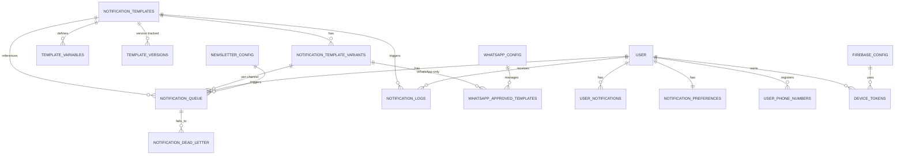

# 09 Notifications Management

**Version:** MVP Juillet 2026 + V1 Septembre 2026  
**Status:** 🟢 Spécification en cours  
**Effort estimé:** 170-200h (MVP 80h + V1 90h)  
**Timeline:** Semaines 9-18 (Phases 5-7, transversal)

---

## 📖 Vue d'Ensemble

### Objectif Métier

Concevoir et implémenter un **système de notifications complet et flexible** orchestrant emails transactionnels, newsletters hebdomadaires, rapports automatisés personnalisés (apprenants, coachs, admins), avec une **interface BO pour gérer les templates** et personnaliser via shortcodes dynamiques.

### Contexte

Notifications est un **module transversal** déclenché par TOUS les autres modules (Formation, Passeport, Coaching, Gamification, Masterclass, etc.). Doit être léger (in-house SMTP, 0 dépendance externe), flexible (shortcodes, personalization), et supporte **3 streams parallèles** :

1. **Notifications transactionnelles** (user actions) — emails immédiats
2. **Newsletters** (hebdo/mensuel) — contenu agrégé, broadcast/segmenté
3. **Rapports** (hebdo) — insights personnalisés, scheduled

### Qui l'Utilise (Rôles)

- **Apprenant** : reçoit notifs transactionnelles, newsletters, rapports perso
- **Coach** : reçoit notifs (sessions, JAC), rapports suivi apprenants
- **Content Creator** : reçoit notifs (contenu bloqué, nouveau parcours)
- **Expert Interne** : reçoit notifs (session booked, recap requests)
- **Super Admin** : gère templates, voit rapports platform, configure SMTP
- **Manager Client** : reçoit notifs (atelier overflow, new content for company)

### Scope — IN / OUT

#### ✅ IN (MVP + V1)

**Notifications Transactionnelles (MVP) :**
- Emails immédiats déclenchés par événements (lesson published, coaching booked, etc.)
- In-app bell icon (BO MVP, full center V1)
- Retry logic (3 tentatives, exponential backoff)
- Dead letter logging (failed notifications)

**Newsletters (V1) :**
- Newsletter Contenu (hebdo) : nouveaux parcours, articles veille, learning items
- Newsletter Features (mensuel) : nouvelles features, améliorations
- Newsletter Rapports (hebdo) : personnalisée apprenants actifs

**Rapports (V1) :**
- Rapport Apprenant (hebdo) : progression, XP, badges, recommandations
- Rapport Coach (hebdo) : apprenants suivi, sessions, à follow-up
- Rapport Admin (hebdo) : platform metrics, engagement trends, bottlenecks

**BO Management (V1) :**
- Page BO pour modifier templates email
- Shortcodes dynamiques ({{user_name}}, {{xp_earned}}, {{next_milestone}}, etc.)
- Preview email avant envoi
- Test send button
- Scheduling configuration (newsletters, rapports)

#### ❌ OUT (V2+)

- SMS notifications (non MVP)
- Push notifications (Firebase)
- WYSIWYG template builder (hardcoded templates + BO editor only, even V2+)
- Real-time WebSocket notifications (polling V1)
- Granular per-notification preferences (V2+)
- A/B testing templates
- Advanced bounce/complaint handling (basic MVP)

### Dépendances Critiques

**Dépend de :**
- Module #1 Parcours (events: lesson_published, parcours_completed)
- Module #1bis Items & Veille (events: item_published, article_published)
- Module #2 Passeport (events: jac_pending, jac_approved)
- Module #4 Coaching (events: session_booked, session_recap_ready)
- Module #5 Gamification (events: badge_earned)
- Module #6 Enterprise FO (events: company_new_content, manager_notifications)
- Module #8 Masterclass (events: enrollment_30d, enrollment_7d, live_15min_before)
- Onboarding Module (events: user_registered, premium_activated)

**Bloque :**
- Analytics/Reporting (notif tracking, open rates, click rates)
- Journal de Bord (rapports stored as journal entries — phase 14 decision)

---

## 📱 Écrans à Concevoir

### Front-Office (React)

| Écran | Rôle | Description | Priorité |
|-------|------|-------------|----------|
| **Notification Bell (BO)** | Apprenant | Bell icon avec unread count, click affiche list (MVP) | P0 |
| **Notification Center** | Apprenant | Full page /profile/notifications avec inbox, archive, preferences (V1) | P1 |
| **Preferences Panel** | Apprenant | On/off par catégorie (Learning Space, Veille, Coaching, Parcours, Badges, Onboarding) | P1 |

### Back-Office (WordPress Admin)

| Écran | Rôle | Description | Priorité |
|-------|------|-------------|----------|
| **Email Templates Manager** | Super Admin | CRUD templates, edit HTML + shortcodes, preview, test send | P0 |
| **Newsletter Config** | Super Admin | Configure frequency (hebdo/mensuel), content sources, filters, scheduling | P1 |
| **Rapports Config** | Super Admin | Configure rapports types (A/B/C), scheduling, segmentation (active users) | P1 |
| **Queue Monitor** | Super Admin | View pending notifications, dead letter queue, retry failed | P2 |
| **Notifications Log** | Super Admin | View sent, failed, bounced notifications (audit trail) | P1 |

---

## ⚙️ Fonctionnalités (MVP + V1)

### Core — Notifications Transactionnelles (MVP)

1. **Event-Driven Queue System (RabbitMQ Managed)** - Tous les modules déclenchent via `do_action('tls_notify', [...])`, notifications routées à RabbitMQ Managed (OVH/Scaleway) avec 3 priority queues (urgent/normal/low), worker @5min traite et envoie par canal. Message TTL = 48h (active consumers), Dead-Letter Queue retention = 30j. Retry logic: 3 attempts avec exponential backoff (immédiat, +5min, +30min). Monitoring avec alertes sur >5% failure rate ou >100 DLQ messages.

2. **Multi-Channel Notification System** - Même notification peut être envoyée par MULTIPLE canaux avec contenu variant per canal :
   - **Email (MVP)** : HTML unlimited, via **Brevo SMTP** (Provider: Brevo — supports analytics opens/clicks, bounce management, GDPR unsubscribe compliance. Decision P1-36: €0-20/mth for V1, scales to multi-company V2+)
   - **In-App (MVP)** : Plaintext 500 chars, bell icon notification
   - **WhatsApp (V1)** : Plaintext 160 chars max, via WhatsApp Business API Direct, templates must be Meta-approved
   - **Push iOS (V2 ready)** : Title 70 chars + body 240 chars, via Firebase Cloud Messaging
   - **Push Android (V2 ready)** : Title 65 chars + body 240 chars, via Firebase Cloud Messaging
   - **Slack (V2+ ready)** : Rich formatted messages
   
   Per-channel template variants stored in DB with constraint indicators (char limits, formatting rules).

3. **Template System with Channel Variants** - Templates en DB avec per-channel variants (email HTML, in-app plaintext, WhatsApp plaintext, push iOS/Android). Shortcodes dynamiques remplacés avant envoi ({{user_first_name}}, {{lesson_title}}, {{coaching_date}}, etc.), avec channel-aware variable recommendations.

4. **Email Engagement Tracking (V1)** - Dual-channel tracking for email engagement: Pixel-based open detection (transparent 1x1 pixel appended to HTML footer) + link-based click tracking on CTA buttons only. User opt-out capability with implicit consent via account creation/CGU (no explicit popup). Tracking IDs stored in notification_logs + dedicated email_engagement_events table for analytics. Open rate = pixels loaded, click rate = tracked CTA links clicked. User can disable tracking globally (notification_preferences table).

6. **Bounce Handling (V1)** - Hybrid approach leveraging Brevo's native hard bounce detection + local soft bounce tracking. Hard bounces (invalid/non-existent addresses) auto-detected by Brevo via webhook, contacts auto-blocklisted in Brevo system. Soft bounces (temporary failures) tracked locally: after 3-5 consecutive soft bounces, user quarantined + notified via email with action prompt (verify address or contact support). Audit trail logs all bounce events with timestamps + reasons. Admin dashboard shows bounce metrics + manual unblock capability via Brevo API integration.

5. **WhatsApp Integration (V1)** - WhatsApp Business API Direct with Meta template approval workflow. Admin submits templates for approval via BO, tracks approval status. V1 ready for <1K messages; scales to 10K+ by V3.

5. **Firebase Cloud Messaging Setup (V2 Ready)** - Infrastructure ready for iOS/Android push notifications. Device token management table populated in V2. No per-message costs (infrastructure only ~€10-50/month Blaze plan V3).

6. **Retry Logic & Dead Letter Queue** - 3 tentatives max per channel with exponential backoff. Failed notifications moved to Dead Letter Queue après 3 échecs, conservés 30j pour manual retry/audit.

7. **BO Multi-Channel Template Manager** - Page BO pour créer/modifier templates avec channel selector dropdown. Pour chaque canal: input field avec char limit indicator (e.g., "145/160 chars for WhatsApp"), preview rendering adapté au canal, variable insertion with channel recommendations, test send per canal.

8. **Notification History & Audit** - Table `notification_logs` avec per-channel sending status (sent, failed, bounced, skipped), timestamp, retry_count, error_reason. Complet audit trail pour compliance.

9. **In-app Bell Icon (BO MVP)** - Bell icon showing unread count, click affiche popover avec recent notifs (in-app channel seulement)

### Secondary — Newsletters (V1)

1. **Newsletter Content (Hebdo)** - Agrège parcours, articles veille, learning items publiés dernière semaine, envoie dimanche 18h à tous apprenants
2. **Newsletter Features (Mensuel)** - Features nouvelles + améliorations, envoie 1er lundi du mois à tous apprenants
3. **Newsletter Scheduling** - BO config pour fréquence, contenu filters (domaines, niveaux), test send
4. **Newsletter Templates** - HTML optimisé mobile, [Lire plus] links vers plateforme, unsubscribe link

### Secondary — Rapports Automatisés (V1)

1. **Rapport Apprenant (Hebdo, dimanche 10h)** - Progression semaine (XP, badges, parcours %), temps investi, jalons prochains, 3 recommandations contenu personnalisées
2. **Rapport Coach (Hebdo, lundi 8h)** - Apprenants suivi (progression, participation, inactifs), sessions prévues vs complétées, apprenants à follow-up, opportunités coaching
3. **Rapport Admin (Hebdo, lundi 9h)** - Metrics platform (total users, actifs, completion rates), trends engagement, bottlenecks identifiés, feature health
4. **Rapports Segmentation** - Envoyé UNIQUEMENT à apprenants actifs (min 1 login en 3 derniers mois)
5. **Rapports Scheduling** - BO config jour/heure, templates editable, test send

### Secondary — Notification Center (V1)

1. **Full Notification Inbox** - Liste toutes notifs avec dates, read/unread status, archive button
2. **Read/Unread Tracking** - Toggle read/unread, archiving feature
3. **Granular Preferences** - On/off par catégorie (6 catégories : Learning Space, Veille, Coaching, Parcours, Badges, Onboarding)
4. **Archive Management** - Archiver notifs individuelles ou par catégorie

---

## 🚀 Évolutions (V2+)

### V2 (2027)

- SMS notifications via Twilio (new channel)
- Push notifications via Firebase (mobile app)
- Granular per-notification type preferences (ultra-fine control)
- WYSIWYG template builder avec drag-drop (⚠️ **Attendre phase 14 confirmation** — actuellement hardcoded + BO editor only)
- Dead letter queue + manual retry BO page
- Real-time WebSocket notifications (vs polling)
- Advanced bounce/complaint handling
- Template A/B testing

### V3+ (Future)

- AI-powered recommendation engine pour newsletters
- Personalized digest by user behavior
- Multi-language templates
- SMS templates separate from email
- Notification preferences by time-of-day

---

## 👥 User Journeys (Format 3)

### User Journey #1 : Apprenant → Reçoit Notification Transactionnelle

**Acteur :** Apprenant  
**Déclencheur :** Contenu publié, coaching session confirmée, badge earned, etc.  
**Objectif :** Être notifié immédiatement et cliquer pour accéder au contenu/action pertinente

#### Étapes Détaillées

1. **Content Creator publie nouvelle leçon dans parcours apprenant**
   - Creator clique [Publier] dans FO
   - Système déclenche event `lesson_published` avec lesson_id, creator_id, apprenant_ids
   - Feedback: "Publication réussie ✓"
   - Durée: instant

2. **TLS Notifications reçoit event et crée notification**
   - Hook `tls_notify` déclenché avec {event_type: 'lesson_published', recipient_id: apprenant_id, template_id: 'lesson_published', data: {...}}
   - Notification ajoutée à Redis queue `tls:notifications:pending`
   - Feedback: (backend, no user feedback)
   - Durée: instant (~10ms)

3. **Worker cron @5min traite queue**
   - Worker lit 100 notifs pending
   - Pour chaque: charge template DB, remplace shortcodes ({{lesson_title}}, {{lesson_url}}, {{creator_name}})
   - Envoie email via SMTP
   - Success: retire de queue
   - Fail: retry_count++, remet en queue
   - Feedback: (backend logging)
   - Durée: ~1min pour 100 notifs

4. **Email arrive dans boîte apprenant**
   - Subject: "Nouvelle leçon : {{lesson_title}}" → "Nouvelle leçon : IA Fundamentals"
   - Body: HTML avec leçon détail, [Lire la leçon] CTA link
   - Feedback: Email visible, marque comme lu en FO après clic
   - Durée: <5min après event (target)

5. **Apprenant voit in-app bell notification (V1)**
   - Bell icon BO affiche unread count +1
   - Hover/click affiche popover avec notifs récentes
   - Feedback: Visual notification on platform
   - Durée: instant

6. **Apprenant clique sur notification ou email link**
   - Clique [Lire la leçon] dans email OU bell notification en app
   - Redirigé vers leçon detail page
   - Feedback: Leçon ouvre, notification marquée as read
   - Durée: <500ms page load

#### Conditions de Succès ✅
- [ ] Event déclenché correctement par tous les modules
- [ ] Notification ajoutée à queue en <50ms
- [ ] Email envoyé en <5min après event (95% SLA)
- [ ] Shortcodes remplacés correctement (no template variables left)
- [ ] Email HTML valide et mobile-responsive
- [ ] In-app notification visible immédiatement
- [ ] Read/unread status tracked
- [ ] Link clicks attributable pour analytics

#### Erreurs & Edge Cases ❌

**Cas 1 : Email invalid ou bounce**
- Scénario: Apprenant email invalide (typo, déactivé), SMTP reject
- Comportement attendu:
  - Notification reste en queue
  - Retry attempt 2 @5min later
  - Retry attempt 3 @30min later
  - Après 3 fails: move to dead letter
  - Log entry avec raison d'échec (invalid email, bounced, timeout)
- Feedback: (backend only, silent failure)
- Impact: Apprenant ne reçoit pas notif, mais retry logic protect contre SMTP transient failures

**Cas 2 : Queue overload (spike trafic)**
- Scénario: 1000 apprenants published en même temps, queue backlog
- Comportement attendu:
  - Worker traite 100 notifs @5min
  - Reste en queue, retraité prochains cycles
  - Pas de perte de données (queue persistent Redis)
  - Performance degrade but no data loss
- Feedback: (monitoring alert en V2)
- Impact: Notifs delayed jusqu'à queue processed, worst case ~25min pour 1000

**Cas 3 : Apprenant disabled notifications**
- Scénario: Apprenant désactivé category "Learning Space" en preferences
- Comportement attendu:
  - Worker check preferences avant envoi
  - Notif skipped (silently dropped, not retried)
  - Log: notification_skipped reason='preferences'
- Feedback: (no email sent)
- Impact: Apprenant ne reçoit pas notif comme désiré

**Cas 4 : Template not found**
- Scénario: Template ID incorrect ou supprimé depuis
- Comportement attendu:
  - Worker catch error, move to dead letter with reason='template_not_found'
  - Log admin alert
  - Fallback: use default generic template (tjs present)
- Feedback: (admin notified, apprenant gets generic email)
- Impact: Notif sent but unpersonalized

**Cas 5 : Shortcode typo or missing data**
- Scénario: Template has {{invalid_shortcode}} ou {{lesson_title}} missing in data
- Comportement attendu:
  - Worker leaves shortcode as-is (no replacement)
  - Apprenant reçoit email avec {{lesson_title}} literal (oops)
  - Log: warning-level log avec missing keys
  - Admin should fix template asap
- Feedback: Apprenant reçoit email avec typo, bad UX
- Impact: Template QA issue, must be caught in test

---

### User Journey #2 : Apprenant → Newsletter Contenu Hebdomadaire

**Acteur :** Apprenant (actif, subscribed)  
**Déclencheur :** Chaque dimanche 18h, cron job  
**Objectif :** Lire newsletter agrégée des nouveaux parcours, articles veille, learning items de la semaine précédente

#### Étapes Détaillées

1. **Cron job triggered dimanche 18h : gather_content_newsletter**
   - Récupère tous parcours publiés (samedi 18h - dimanche 18h)
   - Récupère tous articles veille publiés (même semaine)
   - Récupère tous learning items publiés (même semaine)
   - Feedback: (backend logging, cron executed)
   - Durée: ~30sec pour aggréger

2. **Filter par apprenant interests**
   - Pour chaque apprenant actif: filter contenu by domaines intérêt (passeport)
   - Segmente: si 0 contenu relevant → skip notif
   - Feedback: (backend decision)
   - Durée: ~1min pour 10k apprenants

3. **Generate newsletter HTML**
   - Template `newsletter_content_hebdo` loaded
   - Remplace shortcodes : {{user_first_name}}, {{content_list}}, {{week_date}}
   - {{content_list}} = loop générée pour chaque parcours/article/item
   - Feedback: (backend)
   - Durée: ~100ms par apprenant

4. **Add to queue & send**
   - Notifications ajoutées à queue
   - Worker picks up, sends email
   - Feedback: Email arrives in inbox dimanche 18h15-18h30
   - Durée: <30min après cron trigger

5. **Apprenant reçoit et ouvre newsletter**
   - Subject: "Votre newsletter hebdo : nouvelles content cette semaine"
   - Body: HTML avec list parcours/articles/items, [Lire plus] CTAs
   - Apprenant peut cliquer chaque [Lire] → vers content detail
   - Feedback: Email opens, click tracking (optional V1)
   - Durée: apprenant ouvre dans quelques heures/jours

#### Conditions de Succès ✅
- [ ] Cron executes exactly dimanche 18h (timezone-aware)
- [ ] Contenu correctement agrégé (no duplicates)
- [ ] Filtering par interests works (no irrelevant content)
- [ ] Newsletter generation <2min pour 10k users
- [ ] Email HTML optimisé pour mobile (newsletter format)
- [ ] [Lire] links direct to platform (deep links)
- [ ] Unsubscribe link présent (legal requirement)
- [ ] Tracking: open rates, click rates (optional)

#### Erreurs & Edge Cases ❌

**Cas 1 : Apprenant pas d'intérêt match**
- Scénario: Aucun contenu publié cette semaine n'est en domaines intérêt apprenant
- Comportement attendu:
  - Notification NOT sent (skip)
  - Logic: if(content_count==0) { skip; }
- Feedback: Apprenant ne reçoit pas email (ok, pertinence)
- Impact: Réduction spam, apprenant happy

**Cas 2 : Apprenant pas actif (no login en 3 mois)**
- Scénario: Inactive apprenant tooujours actifs en DB
- Comportement attendu:
  - Query filters : active_last_3months = true
  - Inactive apprenants skipped automatiquement
- Feedback: Newsletter not sent
- Impact: Reduce email volume pour churned users

**Cas 3 : Timezone mismatch pour 18h dimanche**
- Scénario: Apprenant en TZ différente (Singapore vs Paris)
- Comportement attendu:
  - Cron exécuté 1x (GMT/UTC standard)
  - Tout apprenants reçoivent même email même dimanche (no personalization de timing)
  - Alternative: store apprenant TZ, send @18h local (V2+ nice-to-have)
- Feedback: Apprenant reçoit newsletter mais heure varie
- Impact: Ok for MVP, V2 can personalize

**Cas 4 : Newsletter content list trop long (50+ items)**
- Scénario: Semaine productive, 50+ nouveaux items publiés
- Comportement attendu:
  - Template include top 10 only, [Voir tous] link vers learning space
  - HTML email reste <100KB (email size limit)
- Feedback: Newsletter affiche highlights, full list sur plateforme
- Impact: Good UX, email not bloated

---

### User Journey #3 : Super Admin → Manage Multi-Channel Notification Templates

**Acteur :** Super Admin  
**Déclencheur :** Besoin de créer, éditer, tester notification template avec variants par canal  
**Objectif :** Pouvoir modifier contenu templates (Email, In-App, WhatsApp, Push iOS/Android), tester per-canal, soumettre templates WhatsApp pour approbation Meta

#### Étapes Détaillées

1. **Super Admin accède BO → Notifications → Templates Manager**
   - Clique menu [Notifications] → [Templates Manager]
   - Page charge: liste 10+ templates (lesson_published, coaching_booked, jac_pending, etc.)
   - Chaque template card affiche: template name, channels supported (Email ✓ In-App ✓ WhatsApp ✓ Push ⏳), last_modified_date, [Edit] [Test] buttons
   - Feedback: Page loads avec liste templates
   - Durée: <1sec

2. **Admin clique [Edit] pour modifier template**
   - Page ouvre avec template detail + channel selector dropdown
   - Initial: Email channel selected
   - Feedback: Form loaded, channel selector visible
   - Durée: <500ms

3. **Admin configure EMAIL variant**
   - 3 fields pour Email:
     a) **Subject** : text input, ex "Nouvelle leçon : {{lesson_title}}"
     b) **Body** : HTML textarea avec syntax highlighting, support full HTML
     c) **Shortcodes Available** : Read-only list avec descriptions ({{lesson_title}}, {{creator_name}}, etc.)
   - Feedback: Textarea editable, auto-save every 30sec
   - Durée: ~5-10min pour éditer

4. **Admin switches to IN-APP channel**
   - Dropdown clique "In-App" → new form loads
   - 2 fields:
     a) **Title** : plaintext input, max 100 chars
     b) **Body** : plaintext textarea, max 500 chars (counter showing "234/500 chars")
   - Char limit indicator dynamique (colour changes: green <75%, orange 75-95%, red >95%)
   - Same shortcodes available
   - Feedback: Form changes context, counter visible
   - Durée: <300ms channel switch

5. **Admin switches to WHATSAPP channel (V1)**
   - Dropdown clique "WhatsApp" → new form loads
   - 2 fields:
     a) **Template Name** : text input (must match Meta approved template name)
     b) **Body** : plaintext textarea, max 160 chars (strict limit for SMS format)
     c) **Char counter** : Red if >160 chars (warning: "Exceeds WhatsApp 160 char limit")
   - Section: "Approval Status" shows whether template is Meta-approved or pending
   - Button: [Submit for Meta Approval] (triggers workflow, see step 10-12)
   - Shortcodes: only {{user_first_name}}, {{user_phone}}, {{quick_action_url}} supported (WhatsApp constraints)
   - Feedback: 160-char limit enforced visually
   - Durée: <300ms

6. **Admin switches to PUSH iOS (V2 Ready)**
   - Dropdown clique "Push iOS" → form loads
   - 3 fields:
     a) **Title** : max 70 chars (counter: "15/70 chars")
     b) **Body** : max 240 chars (counter: "85/240 chars")
     c) **Deep Link** : URL input (ex: /lessons/123)
   - Visual indicators per field (char limits)
   - Feedback: Form context switches, limits enforced
   - Durée: <300ms

7. **Admin switches to PUSH Android (V2 Ready)**
   - Dropdown clique "Push Android" → form loads
   - Similar to iOS but: Title 65 chars max, Body 240 chars max
   - Deep Link field same
   - Feedback: Form context switches
   - Durée: <300ms

8. **Admin clique [Preview All Channels]**
   - Modal affiche 5 preview tiles (Email, In-App, WhatsApp, Push iOS, Push Android)
   - Chaque tile:
     - Shortcuts replaced avec sample data ({{lesson_title}} → "IA Fundamentals")
     - Email: desktop + mobile email client rendering
     - In-App: iPhone/Android notification bubble style
     - WhatsApp: WhatsApp message bubble (green for sent)
     - Push: iOS/Android notification style with title + body
   - Toggle: [Desktop View] [Mobile View] for email preview
   - Feedback: 5-in-1 preview rendered
   - Durée: <1sec

9. **Admin tests per-channel sending**
   - Section: "Test Send"
   - Select channel dropdown (Email / In-App / WhatsApp / Push)
   - Input email/phone/device_token depending on channel
   - Clique [Send Test] → notification sent immediately (bypass queue)
   - WhatsApp test: requires E.164 phone number in system (admin can input temp for testing)
   - Feedback: "Test notification sent to {{recipient}} ✓"
   - Durée: <5sec per send

10. **Admin prepares WhatsApp template for Meta approval (V1)**
    - If channel = WhatsApp, new button appears: [Submit for Meta Approval]
    - Clique button → Approval workflow modal opens:
      - Step 1: Validate template meets Meta requirements
        - Check: no special formatting, no URLs (only {{quick_action_url}} allowed)
        - Check: grammatically sound French
        - Check: no marketing/promotional language
      - Step 2: Select category (ACCOUNT_UPDATE, PAYMENT_UPDATE, PERSONAL_FINANCE, etc.)
      - Step 3: Confirm submission
    - Feedback: "Template submitted to Meta. Status: PENDING_QUALIFICATION"
    - Durée: <5min workflow

11. **Meta approval tracking**
    - Template status updated: PENDING_QUALIFICATION → APPROVED (ou REJECTED)
    - BO shows status next to "Approval Status" field
    - If REJECTED: show reason (e.g., "Contains URL not allowed")
    - Admin can resubmit after fixes
    - Feedback: Approval status refreshed (polling every 60sec)

12. **Admin saves ALL channel variants**
    - Clique [Save All Channels]
    - System validates:
      - Email: HTML sanitization (strip scripts)
      - In-App: plaintext OK
      - WhatsApp: 160 char limit enforced
      - Push iOS: 70+240 char limits enforced
      - Push Android: 65+240 char limits enforced
      - All: Shortcodes valid per channel constraints
    - If validation passes:
      - Template + variants saved in DB
      - Feedback: "Template sauvegardé pour 5 canaux ✓"
      - Durée: <500ms
    - If validation fails: highlight errors, block save

13. **Admin quitte page**
    - Next notifications using this template = new content per channel
    - Old notifications (already sent) unchanged
    - Feedback: (no feedback, auto-applies to new)
    - Durée: immediate effect

#### Conditions de Succès ✅
- [ ] Multi-channel template editor loads
- [ ] Channel selector dropdown functional
- [ ] Email variant (HTML) editable + preview
- [ ] In-App variant (plaintext 500 chars) editable + preview
- [ ] WhatsApp variant (plaintext 160 chars) editable + char limit enforced + approval status shown
- [ ] Push iOS variant (title 70+body 240) editable + char limits enforced
- [ ] Push Android variant (title 65+body 240) editable + char limits enforced
- [ ] Shortcodes context-aware (different per channel)
- [ ] 5-in-1 preview renders correctly for all channels
- [ ] Test send works per channel (<5sec)
- [ ] WhatsApp Meta approval workflow functional
- [ ] All variants save atomically (all-or-nothing)
- [ ] Char limit indicators dynamic + helpful
- [ ] Mobile/desktop view toggle for email
- [ ] Template variables documented per channel

#### Erreurs & Edge Cases ❌

**Cas 1 : Shortcode not supported in channel**
- Scénario: Admin uses {{lesson_description}} in WhatsApp variant (160 char limit)
- Comportement attendu:
  - Warning on save: "{{lesson_description}} too long for WhatsApp (limit 160 chars)"
  - Suggest channel-appropriate shortcodes instead
  - Block save until fixed
- Feedback: Validation error, help text suggests alternatives
- Impact: Prevent channel-incompatible content

**Cas 2 : WhatsApp template rejected by Meta**
- Scénario: Admin submits template containing URL (not allowed by Meta)
- Comportement attendu:
  - Meta API returns: "Invalid content: URLs not permitted"
  - Status updated: REJECTED with reason
  - BO shows: "Approval Rejected: URLs not permitted in WhatsApp templates"
  - Admin can [Edit] and [Resubmit]
- Feedback: Clear rejection reason, resubmit button available
- Impact: Workflow loop until approved

**Cas 3 : HTML injection in Email channel**
- Scénario: Admin pastes `<script>alert('xss')</script>` in Email body
- Comportement attendu:
  - Sanitize HTML on save (strip scripts, only allow safe tags like <b>, <p>, <a>, <table>)
  - Content stored sanitized
  - Preview shows safe version
- Feedback: (silent sanitization)
- Impact: Security protected

**Cas 4 : Exceeding char limit in WhatsApp**
- Scénario: Admin types 180 chars in WhatsApp body (limit 160)
- Comportement attendu:
  - Real-time counter: "180/160 chars" in RED
  - Save button disabled (red icon, tooltip: "WhatsApp limit exceeded")
  - Admin must delete 20 chars to enable save
- Feedback: Visual blocker, clear message
- Impact: Enforce channel constraints before deployment

**Cas 5 : All variants not configured**
- Scénario: Admin saves template but only configured Email (skipped In-App/WhatsApp)
- Comportement attendu:
  - System creates minimal defaults for unconfigured channels:
    - In-App: first 100 chars of email subject as title
    - WhatsApp: not created (optional, requires explicit config)
    - Push iOS/Android: optional in MVP/V1 (V2+ required)
  - Warning on save: "WhatsApp variant empty (will not send)"
  - Save allowed but with warning flag
- Feedback: "Template saved with 2/5 channels fully configured"
- Impact: Flexibility + clarity

**Cas 6 : Shortcode missing data in variant**
- Scénario: Template has {{lesson_url}} but event data missing in event
- Comportement attendu:
  - Worker tries to replace, key not found → leave as {{lesson_url}} literal
  - Channel-specific: Email would show {{lesson_url}}, In-App would truncate, WhatsApp would error (char count changes)
  - Log: warning-level per channel
  - Fix: update event provider OR template
- Feedback: (silent failure, but logged per channel)
- Impact: Template + event provider must be in sync per channel

---

### User Journey #4 : Coach → Reçoit Rapport Hebdomadaire

**Acteur :** Coach  
**Déclencheur :** Chaque lundi 8h, cron job  
**Objectif :** Voir progression apprenants suivi, sessions prévues, inactifs, JAC waiting validation

#### Étapes Détaillées

1. **Cron job triggered lundi 8h : generate_coach_reports**
   - Pour chaque coach: query apprenants assignés
   - Calculate métriques: progression XP, badges earned, session completion, inactifs (no login >7j)
   - Gather events: JAC en attente, coaching sessions prévues, rapports à donner
   - Feedback: (backend logging)
   - Durée: ~2min pour 100 coaches

2. **Generate rapport personalisé**
   - Template `rapport_coach_hebdo` loaded
   - Remplace shortcodes : {{coach_name}}, {{apprenants_list}}, {{jac_pending}}, {{sessions_week}}, {{inactive_count}}
   - {{apprenants_list}} = table générée avec apprenant progression
   - Feedback: (backend)
   - Durée: ~200ms par coach

3. **Format HTML optimisé**
   - Table avec colonnes : Apprenant | XP gagnés | Badges | Sessions complétées | Inactifs (oui/non) | JAC status
   - Section: "Actions requises" avec JAC awaiting, coaching slots free, inactifs à follow-up
   - CTAs: [Voir apprenant] → profile detail, [Valider JAC] → JAC BO, [Voir session] → session detail
   - Feedback: (backend)
   - Durée: ~100ms

4. **Add to queue & send**
   - Rapports added to queue
   - Worker picks up lundi 8h15-8h30
   - Feedback: Email arrives
   - Durée: <30min après cron

5. **Coach reçoit et ouvre rapport**
   - Subject: "Rapport hebdo : suivi apprenants semaine 19"
   - Body: HTML table + actions requises section
   - Coach review progression, see inactifs à follow-up, JAC pending
   - Clique [Valider JAC] → redirected to BO JAC validation page
   - Feedback: Email visible, deep links redirect to platform
   - Durée: apprenant review dans 1-2h après reçu

#### Conditions de Succès ✅
- [ ] Cron executes lundi 8h exact
- [ ] Metrics correctement calculées (XP, badges, sessions, inactifs)
- [ ] Table rendu HTML correct (no breaks)
- [ ] Deep links to platform functional
- [ ] Report personnalisé par coach (only their apprenants)
- [ ] Actions requises section prominent
- [ ] Mobile-responsive email
- [ ] No PII exposed (email should be safe)

#### Erreurs & Edge Cases ❌

**Cas 1 : Coach pas d'apprenants assignés**
- Scénario: Nouveau coach, 0 apprenants suivi
- Comportement attendu:
  - Query returns 0 rows
  - Rapport NOT sent (skip)
  - Logic: if(apprenants_count==0) { skip; }
- Feedback: Coach ne reçoit pas rapport (ok)
- Impact: Reduce noise

**Cas 2 : Coach has 500+ apprenants**
- Scénario: Super coach ou admin coach watching whole cohort
- Comportement attendu:
  - Table affiche top 50 by priority (inactifs, JAC pending, low XP)
  - [Voir tous] link vers BO full list
  - Email size still <100KB
- Feedback: Highlights shown, full list on platform
- Impact: Good UX, manageable email size

**Cas 3 : JAC validation pending >7j**
- Scénario: Coach not validating JACs, apprenants waiting
- Comportement attendu:
  - Rapport highlights en rouge: "3 JACs en attente >7j"
  - Urgent section avec reminder to coach
  - Could add escalation (alert super admin if >14j unvalidated) V2
- Feedback: Prominent in rapport, coach notified
- Impact: Process improvement trigger

---

### User Journey #5 : Apprenant → Opt-Out Email Tracking

**Acteur :** Apprenant  
**Déclencheur :** User wants to disable email engagement tracking (privacy preference)  
**Objectif :** Désactiver le suivi des ouvertures et clics email au niveau global ou per-template

#### Étapes Détaillées

1. **Apprenant accède à ses préférences de notification**
   - Clique avatar/menu utilisateur → [Préférences] ou [Paramètres]
   - Navigation vers [Notifications] onglet
   - Page affiche 4 sections : Email, In-App, Push, WhatsApp
   - Feedback: Page charge ~500ms, préférences actuelles affichées
   - Durée: ~500ms

2. **Apprenant localise Email Tracking Toggle dans la section Email**
   - Section Email affiche : "Email Engagement Tracking" toggle switch
   - Description sous toggle : "Nous utilisons des pixels et des liens de tracking pour mesurer si vous avez lu nos emails et cliqué sur les liens. Vous pouvez désactiver cela."
   - Toggle position actuelle : "Activé" (green) avec icône 👁️ + 🔗
   - Feedback: Toggle visible, état actuel clair avec icônes visuelles
   - Durée: Instant

3. **Apprenant clique toggle pour désactiver tracking**
   - Clique le switch → État change à "Désactivé" (gray) avec icônes barrées
   - Modal de confirmation apparaît : "Tracking désactivé. Nous ne pourrons plus mesurer les ouvertures/clics, mais vous recevrez quand même les emails."
   - 2 boutons : [Confirmer Désactivation] [Annuler]
   - Feedback: Modal smooth animation, message clair expliquant implications
   - Durée: ~300ms animation + attente user

4. **Apprenant confirme désactivation**
   - Clique [Confirmer Désactivation]
   - Toast notification apparaît (bas droite) : "✓ Tracking email désactivé"
   - System enregistre préférence en DB → notification_preferences.email_tracking_disabled = true
   - Timestamp updaté : updated_at = NOW()
   - Backend arrête génération tracking IDs (open_tracking_id, click_tracking_id) pour nouveaux emails
   - Emails antérieurs : tracking pixels/links restent inactifs (déjà sent, just won't be tracked)
   - Feedback: Toast confirmation, préférence immédiatement appliquée
   - Durée: ~1-2s pour save DB

#### Conditions de Succès ✅
- [ ] Email section affiche tracking toggle avec description claire
- [ ] Toggle state reflects current DB value (disabled/enabled)
- [ ] Confirmation modal appears before save
- [ ] notification_preferences.email_tracking_disabled updated correctly
- [ ] No tracking IDs generated in notification_logs for new emails post-opt-out
- [ ] User receives confirmation toast within 1-2s

#### Erreurs & Edge Cases ❌

**Cas 1 : Apprenant re-enables tracking after disabling**
- Scénario: User clicks toggle again to re-enable tracking (changes mind)
- Comportement attendu:
  - Toggle state changes back to "Activé" (green)
  - Simpler confirmation (no modal needed): inline toast "Tracking email réactivé"
  - notification_preferences.email_tracking_disabled = false
  - New emails start including tracking IDs again
  - Previous untracked emails: remain untracked (retroactive change not possible)
- Feedback: Instant toggle + toast, user knows preference took effect
- Impact: User maintains control, can toggle multiple times

**Cas 2 : Concurrent preference change (admin bulk update + user toggle simultaneously)**
- Scénario: Super Admin pushing company-wide tracking policy while user toggling personal preference
- Comportement attendu:
  - User toggle wins (personal preference > company policy)
  - notification_preferences row has user_id + priority level
  - Query logic: Check user preference first, then company default
  - If user has explicit preference (user_id filled), use that; else use company default
- Feedback: No user-facing error, system resolves gracefully
- Impact: Personal preferences always override batch updates, no confusion

**Cas 3 : User offline when toggling, then reconnects**
- Scénario: Apprenant toggles tracking while offline, loses connection briefly
- Comportement attendu:
  - Toggle state changes in browser immediately (optimistic UI)
  - Request queued in local storage or IndexedDB
  - Once reconnected: System syncs preference to DB
  - If sync fails: Toast error "Préférence non sauvegardée, réessayez"
  - User can manually retry toggle
- Feedback: Offline-first approach, user sees immediate feedback + eventual sync confirmation
- Impact: Doesn't break experience offline, recovers on reconnect

---

### User Journey #6 : Super Admin → Configure Newsletter Scheduling

**Acteur :** Super Admin  
**Déclencheur :** Setup ou modify newsletter settings  
**Objectif :** Configurer fréquence, contenu filters, scheduling newsletter

#### Étapes Détaillées

1. **Super Admin accède BO → Notifications → Newsletter Config**
   - Clique menu [Notifications] → [Newsletter Config]
   - Page affiche 3 newsletter types : Content, Features, Rapports
   - Feedback: Page loads
   - Durée: <1sec

2. **Admin configure Newsletter Content (Hebdo)**
   - Clique [Edit] pour "Content Newsletter"
   - Form fields:
     a) **Fréquence** : radio button → "Hebdomadaire" (locked, not editable)
     b) **Jour/Heure** : select → "Dimanche 18h" (editable)
     c) **Content sources** : checkboxes → Parcours ✓, Articles Veille ✓, Learning Items ✓
     d) **Domain filters** : multi-select → [All] or specific domains (optional)
     e) **Test recipient** : email input pour test send
   - Feedback: Form loaded, editable
   - Durée: <500ms

3. **Admin teste newsletter**
   - Clique [Send Test]
   - Email sent immediately to test email
   - Feedback: "Email envoyé ✓"
   - Durée: <5sec

4. **Admin configure Newsletter Features (Mensuel)**
   - Clique [Edit] pour "Features Newsletter"
   - Form fields:
     a) **Fréquence** : radio button → "Mensuel" (locked)
     b) **Jour/Heure** : select → "1er lundi du mois 10h" (editable)
     c) **Content** : text area pour custom feature announcement (admin writes, not auto-generated)
     d) **Test recipient** : email input
   - Feedback: Form loaded
   - Durée: <500ms

5. **Admin configure Rapports (Hebdo A+B+C)**
   - Clique [Edit] pour "Rapports"
   - Form sections pour chaque rapport type:
     a) **Rapport Apprenant** :
        - Enabled: toggle ✓
        - Jour/Heure: "Dimanche 10h" (editable)
        - Content filter: "Active only (login >3 months)" ✓
     b) **Rapport Coach** :
        - Enabled: toggle ✓
        - Jour/Heure: "Lundi 8h" (editable)
        - Filter: "Coaches with apprenants" (auto-filtered)
     c) **Rapport Admin** :
        - Enabled: toggle ✓
        - Jour/Heure: "Lundi 9h" (editable)
        - Recipients: multi-select [Super Admin] (locked) or add more users
   - Feedback: Form loaded, editable
   - Durée: <500ms

6. **Admin clique [Save]**
   - Configurations saved in DB (`newsletter_config` table)
   - Next cron jobs use new settings
   - Feedback: "Configuration sauvegardée ✓"
   - Durée: instant

7. **Admin peut preview templates**
   - Clique [Preview Newsletter Content]
   - Modal shows exemple newsletter HTML avec sample content
   - Feedback: Preview rendered
   - Durée: <500ms

#### Conditions de Succès ✅
- [ ] Newsletter config page loads
- [ ] All 3 newsletter types configurable
- [ ] Scheduling editable (day/hour)
- [ ] Test send works
- [ ] Content sources selectable
- [ ] Domain filters optional
- [ ] Rapport types configurable
- [ ] Save persists changes
- [ ] Preview shows HTML
- [ ] Cron jobs use updated config

#### Erreurs & Edge Cases ❌

**Cas 1 : Scheduling conflict (2 newsletters same time)**
- Scénario: Admin sets Content newsletter same time as Rapports (dimanche 18h)
- Comportement attendu:
  - Warning on save: "Newsletter Content et Rapports scheduled same time"
  - Allow save but flag warning
  - Cron stagger them (Content first, then +15min Rapports)
- Feedback: Warning visible, but execution continues
- Impact: Manage load, slight delay

**Cas 2 : Invalid scheduling (heure invalide)**
- Scénario: Admin types "25:00" pour heure
- Comportement attendu:
  - Validation error on save: "Heure invalide (must be 00-23)"
  - Form highlights field rouge
  - Save blocked until fixed
- Feedback: Validation error message
- Impact: Prevent invalid cron setup

---

### User Journey #7 : Apprenant → Manage Notification Preferences (V1)

**Acteur :** Apprenant  
**Déclencheur :** Wants to disable certaines notifications ou newsletter  
**Objectif :** Control granular on/off par notification category

#### Étapes Détaillées

1. **Apprenant accède /profile/notifications**
   - Clique [Mon Profil] → [Notifications] ou bell icon → [Preferences]
   - Page loads avec 2 sections: Notifications + Newsletters
   - Feedback: Page loads
   - Durée: <500ms

2. **Manage Notification Preferences**
   - Section: "Quelles notifications voulez-vous recevoir ?"
   - Toggles pour 6 catégories :
     - Learning Space (parcours, lessons) : ON/OFF
     - Veille (articles, contenu externe) : ON/OFF
     - Coaching (sessions, rapports) : ON/OFF
     - Parcours (JAC, projets) : ON/OFF
     - Badges (achievements) : ON/OFF
     - Onboarding (signup confirmations) : ON/OFF
   - Feedback: Toggles interactive, save immediately (auto-save)
   - Durée: instant per toggle

3. **Manage Newsletter Preferences**
   - Section: "Newsletters"
   - Toggles:
     - Newsletter Contenu (hebdo) : ON/OFF
     - Newsletter Features (mensuel) : ON/OFF
     - Rapport Personnalisé (hebdo) : ON/OFF
   - Feedback: Toggles save immediately
   - Durée: instant

4. **View Notification Center Inbox**
   - Section: "Mon Inbox"
   - Affiche récentes notifs (last 20)
   - Chaque notification: subject, date, read/unread icon, archive button
   - Clique notification → affiche full text, [Mark as Read] button
   - Clique archive → move to "Archive"
   - Feedback: Notifs clickable, archive works
   - Durée: <500ms load

5. **Apprenant clique "Archive older than 30 days"**
   - Button auto-archives old notifs
   - Feedback: "10 notifications archivées ✓"
   - Durée: instant

#### Conditions de Succès ✅
- [ ] Preferences page loads
- [ ] All 6 notification categories toggleable
- [ ] Newsletter toggles work
- [ ] Changes auto-save (no manual save button)
- [ ] Notification inbox shows recent notifs
- [ ] Read/unread toggle works
- [ ] Archive functionality
- [ ] Mobile responsive
- [ ] Preferences persisted (affect future notifs)

#### Erreurs & Edge Cases ❌

**Cas 1 : Apprenant disables all notifications**
- Scénario: Apprenant toggles OFF tous les toggles
- Comportement attendu:
  - Setting saved
  - All future notifs skipped (silent drop)
  - Apprenant peut still access inbox (historical)
  - No warning ou confirmation
- Feedback: (silent, no warning)
- Impact: Apprenant choice respected

**Cas 2 : Notification archive older than 6 months**
- Scénario: Apprenant has 500+ old notifs, archive all
- Comportement attendu:
  - Archive query filters by date (>30d)
  - Batch archive (not delete, can access if needed)
  - Feedback: "500+ notifications archivées"
  - Durée: ~2-5sec (batch operation)
- Impact: Cleanup inbox

---

### User Journey #8 : Super Admin → Monitor & Manage Bounces (V1)

**Acteur :** Super Admin  
**Déclencheur :** Wants to monitor email deliverability + manually unblock bounced contacts  
**Objectif :** View bounce metrics, identify problematic emails, unblock quarantined contacts

#### Étapes Détaillées

1. **Super Admin accède BO → Notifications → Bounce Management**
   - Clique menu [Notifications] → [Bounce Management]
   - Page loads avec 2 main sections: Bounce Metrics + Bounced Contacts
   - Feedback: Dashboard rendered in <1sec
   - Durée: <1sec

2. **Admin voit bounce metrics dashboard**
   - Section 1: "Bounce Health Overview" affiche:
     - Total emails sent (today/week/month)
     - Hard bounce rate (%) with trend chart
     - Soft bounce rate (%) with trend chart
     - Unblock rate (%)
   - Section 2: "Hard Bounces (Brevo Managed)" shows:
     - Count of hard-bounced contacts
     - Brevo blocklist status (auto-managed by Brevo)
     - Visual indicator: 🔴 hard bounce (permanent)
   - Section 3: "Soft Bounces (Our System)" shows:
     - Count of contacts with 3+ soft bounces
     - Notification sent count (how many users were notified)
     - Visual indicator: 🟠 soft bounce (temporary)
   - Feedback: All metrics visible, charts load
   - Durée: instant

3. **Admin reviews bounced contacts list**
   - Table displays paginated list:
     - Columns: Email, Bounce Type, Bounce Reason, Count (for soft), Brevo Status, Last Bounce Date, Action
     - Example row: "john@invalid.com | Hard | Invalid address | — | Blocklisted | 2026-05-15 | [Unblock]"
     - Example row: "jane@corp.com | Soft | Server unavailable | 4 | Active | 2026-05-14 | [Retry]"
   - Filterable by: bounce type (hard/soft), date range, status
   - Sortable by: email, bounce date, bounce count
   - Feedback: List loads with <50 contacts per page
   - Durée: <1sec

4. **Admin filters/searches for specific email**
   - Input field: "Search email address"
   - Admin types "jane@corp.com"
   - System filters list in real-time
   - Feedback: List updates instantly
   - Durée: instant

5. **Admin clicks on bounced contact row for details**
   - Drawer opens (right side) showing bounce history for that contact:
     - Email address + user info (name, company, module)
     - Bounce timeline: chronological list of bounce events
       - Event 1: "2026-05-10 22:45 — Soft bounce: Server unavailable"
       - Event 2: "2026-05-12 14:20 — Soft bounce: Mailbox full"
       - Event 3: "2026-05-14 09:15 — Soft bounce: Connection timeout"
     - User notification status: "Quarantine notification sent 2026-05-14 13:30"
     - Manual retry option: [Retry Send] button
     - Unblock action: [Unblock & Retry] button (if hard bounce or quarantined)
   - Feedback: Drawer animates smoothly, history visible
   - Durée: ~300ms

6. **Admin chooses action: Unblock contact**
   - Clique [Unblock & Retry] button
   - Modal confirmation appears: "Unblock jane@corp.com and retry sending?"
   - 2 options: [Confirm Unblock] [Cancel]
   - Feedback: Modal appears
   - Durée: instant

7. **Admin confirms unblock**
   - Clique [Confirm Unblock]
   - System calls Brevo API: PUT /contacts/{email}/unblock
   - If hard bounce: Brevo removes contact from blocklist
   - If soft bounce: System resets soft bounce counter + clears notification sent flag
   - Toast confirmation appears: "✓ jane@corp.com unblocked + added to retry queue"
   - Contact re-enters notification queue for next eligible broadcast
   - Feedback: Toast + list updates (contact removed or status changes)
   - Durée: <2s per action

#### Conditions de Succès ✅
- [ ] Bounce metrics dashboard loads correctly
- [ ] Bounce rate calculations accurate (hard vs soft)
- [ ] Hard bounce contacts show Brevo blocklist status
- [ ] Soft bounce contacts show quarantine notifications sent
- [ ] Contact list paginated + filterable
- [ ] Bounce history visible in detail drawer
- [ ] Unblock action triggers Brevo API call
- [ ] Soft bounce counter resets on unblock
- [ ] Unblocked contacts re-enter retry queue
- [ ] Audit trail logs all unblock actions

#### Erreurs & Edge Cases ❌

**Cas 1 : Unblock fails (Brevo API error)**
- Scénario: Admin clicks [Unblock], Brevo API returns error (invalid token, rate limit)
- Comportement attendu:
  - Toast error: "Failed to unblock: Brevo API error. Try again later."
  - Log error with timestamp + details
  - Unblock button remains active for retry
  - No state changes in DB
- Feedback: Clear error message, state preserved
- Impact: Admin can retry unblock later

**Cas 2 : Contact already unblocked manually in Brevo**
- Scénario: Admin unblocks contact A in Brevo BO directly, then tries unblock in our system
- Comportement attendu:
  - System calls Brevo API
  - Brevo returns: "contact already unblocked"
  - Our system treats as success (idempotent)
  - Toast: "✓ jane@corp.com unblocked"
  - List updates (contact removed)
- Feedback: No error, graceful handling
- Impact: Sync'd state between systems

**Cas 3 : Soft bounce contact unblocked but bounces again immediately**
- Scénario: Admin unblocks soft bounce contact, system retries, bounces again
- Comportement attendu:
  - Soft bounce counter resets on unblock
  - New bounce increments counter from 1 again
  - Only when counter hits 3-5 again does user get re-notified
  - Audit trail shows: "Unblock 2026-05-15 10:00" → "Soft bounce #1 2026-05-15 10:05"
- Feedback: System handles gracefully, no duplicate notifications
- Impact: Prevent notification spam

**Cas 4 : Hard bounce contact tries to request unblock themselves**
- Scénario: User with hard-bounced address contacts support requesting to be unblocked
- Comportement attendu:
  - Admin receives support ticket
  - Admin verifies user identity + new email address (or fix)
  - Admin unblocks old email + updates user profile with new email
  - System retests delivery
- Feedback: Manual process, no self-service unblock
- Impact: Security + data integrity

---

## 🗄️ Modèle de Données (Multi-Channel Architecture)

### Entités Principales

#### 1. **notification_templates** (Template metadata — shared across channels)

| Colonne | Type | Description |
|---------|------|-------------|
| `id` | UUID | Primary key |
| `template_id` | VARCHAR(100) | Unique identifier (lesson_published, coaching_booked, jac_pending, etc.) |
| `name` | VARCHAR(255) | Display name (Nouvelle Leçon) |
| `description` | TEXT | Admin notes (what this template is for) |
| `event_type` | VARCHAR(100) | Triggering event type |
| `channels_supported` | JSON | ["email", "in_app", "whatsapp", "ios_push", "android_push"] per template |
| `created_at` | DATETIME | Creation timestamp |
| `updated_at` | DATETIME | Last modification |
| `created_by` | UUID | Super admin ID who created |
| `is_active` | BOOLEAN | Active/inactive |

#### 2. **notification_template_variants** (Per-channel content with constraints)

| Colonne | Type | Description |
|---------|------|-------------|
| `id` | UUID | Primary key |
| `template_id` | VARCHAR(100) | Reference to notification_templates |
| `channel` | VARCHAR(50) | email, in_app, whatsapp, ios_push, android_push |
| `subject` | TEXT | For email: HTML content. For in_app: title (max 100 chars). For WhatsApp/Push: null |
| `body` | LONGTEXT | For email: full HTML (unlimited). For in_app: plaintext (max 500 chars). For WhatsApp: plaintext (max 160 chars). For iOS push: max 240 chars. For Android push: max 240 chars |
| `title` | VARCHAR(255) | For push iOS: title (max 70 chars). For push Android: title (max 65 chars). Null for email/in_app/whatsapp |
| `deep_link` | VARCHAR(500) | For push: deep link URL. For email/in_app/whatsapp: null |
| `shortcodes_required` | JSON | List of shortcodes [{{lesson_title}}, {{creator_name}}] per channel |
| `char_limit` | INT | 160 for WhatsApp, 70/240 for iOS push, 65/240 for Android push, unlimited for email |
| `constraints` | JSON | Channel-specific rules (no URLs for WhatsApp, etc.) |
| `created_at` | DATETIME | Creation |
| `updated_at` | DATETIME | Last modification |
| `version` | INT | Auto-incremented for audit trail |

#### 3. **template_variables** (Channel-aware shortcodes)

| Colonne | Type | Description |
|---------|------|-------------|
| `id` | UUID | Primary key |
| `template_id` | VARCHAR(100) | Which template |
| `variable_name` | VARCHAR(100) | {{lesson_title}}, {{user_first_name}}, etc. |
| `supported_channels` | JSON | Channels this variable works in: ["email", "in_app", "whatsapp"] |
| `max_length_per_channel` | JSON | {"email": null, "in_app": 500, "whatsapp": 160} |
| `description` | TEXT | What this variable renders |
| `data_type` | VARCHAR(50) | string, integer, datetime, etc. |
| `required` | BOOLEAN | Must be present in event data |
| `example_value` | VARCHAR(255) | Sample value for preview |

#### 4. **template_versions** (Audit trail)

| Colonne | Type | Description |
|---------|------|-------------|
| `id` | UUID | Primary key |
| `template_id` | VARCHAR(100) | Which template |
| `variant_channel` | VARCHAR(50) | Which channel variant was changed |
| `previous_content` | LONGTEXT | Content before change |
| `new_content` | LONGTEXT | Content after change |
| `changed_by` | UUID | Admin who made change |
| `change_reason` | TEXT | Why change was made |
| `created_at` | DATETIME | When change made |

#### 5. **notification_queue** (RabbitMQ-backed, persisted in DB)

| Colonne | Type | Description |
|---------|------|-------------|
| `id` | UUID | Primary key |
| `user_id` | UUID | Recipient user ID |
| `event_type` | VARCHAR(100) | lesson_published, coaching_booked, etc. |
| `template_id` | VARCHAR(100) | Reference to notification_templates |
| `channel` | VARCHAR(50) | email, in_app, whatsapp, ios_push, android_push |
| `data` | JSON | Merge data {lesson_title: "...", creator_name: "..."} |
| `status` | VARCHAR(20) | pending, sent, failed, skipped |
| `priority` | VARCHAR(20) | urgent, normal, low (for RabbitMQ routing) |
| `retry_count` | INT | Current retry attempt (0-3) |
| `error_message` | TEXT | Failure reason (invalid email, bounced, whatsapp_not_approved, etc.) |
| `scheduled_at` | DATETIME | When to send (usually immediate) |
| `sent_at` | DATETIME | When actually sent (null if pending) |
| `created_at` | DATETIME | Queue entry timestamp |
| `rabbitmq_message_id` | VARCHAR(255) | RabbitMQ message ID for correlation |

#### 6. **notification_logs** (Audit trail of all notifications sent)

| Colonne | Type | Description |
|---------|------|-------------|
| `id` | UUID | Primary key |
| `user_id` | UUID | Recipient |
| `template_id` | VARCHAR(100) | Which template |
| `event_type` | VARCHAR(100) | Triggering event |
| `channel` | VARCHAR(50) | email, in_app, whatsapp, ios_push, android_push |
| `status` | VARCHAR(20) | sent, failed, bounced, skipped |
| `error_reason` | TEXT | If failed: why |
| `attempt_count` | INT | Total attempts made |
| `recipient_email` | VARCHAR(255) | Email address (if email channel) |
| `recipient_phone` | VARCHAR(20) | Phone number E.164 (if WhatsApp channel) |
| `recipient_device_token` | VARCHAR(500) | Firebase device token (if push channel) |
| `open_tracking_id` | VARCHAR(100) | Unique tracking ID for pixel-based open detection (email channel only, null for others) |
| `click_tracking_id` | VARCHAR(100) | Unique tracking ID for link-based CTA click tracking (email channel only, null for others) |
| `sent_at` | DATETIME | When sent |
| `created_at` | DATETIME | Log entry time |
| `metadata` | JSON | Additional tracking: whatsapp_status, push_provider_response, etc. |

#### 7. **email_engagement_events** (Email open/click tracking analytics)

| Colonne | Type | Description |
|---------|------|-------------|
| `id` | UUID | Primary key |
| `notification_log_id` | UUID | Reference to notification_logs (foreign key) |
| `user_id` | UUID | Apprenant receiving email (denormalized for query performance) |
| `event_type` | VARCHAR(50) | 'email_opened' or 'email_clicked' |
| `tracking_id` | VARCHAR(100) | Unique tracking ID (open_tracking_id or click_tracking_id from notification_logs) |
| `opened_at` | DATETIME | Timestamp when email first opened (pixel loaded), null if not opened |
| `clicked_at` | DATETIME | Timestamp when CTA link clicked, null if not clicked |
| `clicked_url` | VARCHAR(500) | Full URL of clicked link (if email_clicked event), null otherwise |
| `created_at` | DATETIME | Event record creation time |

#### 8. **bounce_events** (Email bounce tracking - Hard & Soft)

| Colonne | Type | Description |
|---------|------|-------------|
| `id` | UUID | Primary key |
| `notification_log_id` | UUID | Reference to notification_logs (email sent) |
| `user_id` | UUID | Apprenant recipient |
| `bounce_type` | VARCHAR(50) | 'hard_bounce' or 'soft_bounce' |
| `bounce_reason` | TEXT | Reason from Brevo (invalid_email, mailbox_full, etc.) |
| `bounce_count_soft` | INT | For soft bounces: running count of consecutive soft bounces (0 if hard bounce) |
| `brevo_blocklist_status` | VARCHAR(50) | 'blocklisted' (hard bounce detected by Brevo), 'pending_review' (manual review), 'active' (not blocklisted) |
| `notification_sent_to_user` | BOOLEAN | Whether quarantine notification was sent to apprenant (soft bounce only) |
| `created_at` | DATETIME | When bounce was detected |
| `updated_at` | DATETIME | Last update (e.g., when unblocked) |

#### 9. **soft_bounce_tracking** (Soft bounce counter per user)

| Colonne | Type | Description |
|---------|------|-------------|
| `id` | UUID | Primary key |
| `user_id` | UUID | Apprenant |
| `consecutive_soft_bounces` | INT | Running count of consecutive soft bounces (resets to 0 on hard bounce or successful delivery) |
| `last_soft_bounce_at` | DATETIME | Timestamp of last soft bounce event |
| `notification_sent_at` | DATETIME | When quarantine notification was sent (null if not sent) |
| `notification_response_at` | DATETIME | If apprenant responded to quarantine notif, null if no response |
| `created_at` | DATETIME | When soft bounce tracking record created |
| `updated_at` | DATETIME | When counter was incremented/reset |

#### 10. **user_notifications** (In-app notification inbox)

| Colonne | Type | Description |
|---------|------|-------------|
| `id` | UUID | Primary key |
| `user_id` | UUID | Recipient |
| `notification_type` | VARCHAR(100) | lesson_published, badge_earned, etc. |
| `template_id` | VARCHAR(100) | Reference template |
| `subject` | TEXT | In-app title |
| `body` | LONGTEXT | In-app body (plaintext, max 500 chars) |
| `link` | VARCHAR(500) | Deep link to platform |
| `is_read` | BOOLEAN | Read status |
| `is_archived` | BOOLEAN | Archived status |
| `created_at` | DATETIME | When notification created |
| `read_at` | DATETIME | When marked as read |
| `archived_at` | DATETIME | When archived |

#### 9. **notification_preferences** (Per-user, per-channel toggles)

| Colonne | Type | Description |
|---------|------|-------------|
| `id` | UUID | Primary key |
| `user_id` | UUID | Apprenant/Coach/Admin |
| `email_enabled` | BOOLEAN | Email channel enabled |
| `in_app_enabled` | BOOLEAN | In-app channel enabled |
| `whatsapp_enabled` | BOOLEAN | WhatsApp channel enabled |
| `ios_push_enabled` | BOOLEAN | iOS push enabled (V2+) |
| `android_push_enabled` | BOOLEAN | Android push enabled (V2+) |
| `slack_enabled` | BOOLEAN | Slack channel enabled (V2+) |
| `learning_space_category` | BOOLEAN | Category toggle: Learning Space |
| `veille_category` | BOOLEAN | Category toggle: Veille |
| `coaching_category` | BOOLEAN | Category toggle: Coaching |
| `parcours_category` | BOOLEAN | Category toggle: Parcours |
| `badges_category` | BOOLEAN | Category toggle: Badges |
| `onboarding_category` | BOOLEAN | Category toggle: Onboarding |
| `newsletter_content_enabled` | BOOLEAN | Content newsletter |
| `newsletter_features_enabled` | BOOLEAN | Features newsletter |
| `newsletter_rapport_enabled` | BOOLEAN | Rapport personnalisé |
| `created_at` | DATETIME | Creation |
| `updated_at` | DATETIME | Last modification |

#### 10. **newsletter_config** (Newsletter scheduling)

| Colonne | Type | Description |
|---------|------|-------------|
| `id` | UUID | Primary key |
| `newsletter_type` | VARCHAR(50) | content, features, rapport_apprenant, rapport_coach, rapport_admin |
| `enabled` | BOOLEAN | Active/inactive |
| `frequency` | VARCHAR(50) | hebdomadaire, mensuel |
| `day_of_week` | INT | 0-6 (dimanche-samedi) pour hebdo |
| `hour` | INT | 0-23 |
| `minute` | INT | 0-59 |
| `timezone` | VARCHAR(50) | UTC (standard) |
| `content_sources` | JSON | For content newsletter : [parcours, veille, items] |
| `domain_filters` | JSON | Optional filtering by domain IDs |
| `template_id` | VARCHAR(100) | Reference template |
| `created_at` | DATETIME | Creation |
| `updated_at` | DATETIME | Last modification |

#### 11. **whatsapp_config** (WhatsApp Business API integration)

| Colonne | Type | Description |
|---------|------|-------------|
| `id` | UUID | Primary key |
| `business_account_id` | VARCHAR(100) | Meta WhatsApp Business Account ID |
| `phone_number_id` | VARCHAR(100) | Meta phone number ID for sending |
| `access_token` | TEXT | Meta API access token (encrypted in DB) |
| `api_version` | VARCHAR(20) | WhatsApp API version (e.g., v18.0) |
| `message_rate_limit` | INT | Max messages per second (configured per account) |
| `is_active` | BOOLEAN | Active/inactive |
| `created_at` | DATETIME | Setup timestamp |
| `updated_at` | DATETIME | Last config update |

#### 12. **whatsapp_approved_templates** (Meta approval tracking)

| Colonne | Type | Description |
|---------|------|-------------|
| `id` | UUID | Primary key |
| `template_id` | VARCHAR(100) | Reference to notification_templates WhatsApp variant |
| `template_name` | VARCHAR(100) | Name submitted to Meta |
| `category` | VARCHAR(50) | Meta template category (ACCOUNT_UPDATE, PAYMENT_UPDATE, etc.) |
| `meta_template_id` | VARCHAR(100) | Meta-assigned template ID |
| `approval_status` | VARCHAR(50) | PENDING_QUALIFICATION, APPROVED, REJECTED, DISABLED |
| `rejection_reason` | TEXT | If REJECTED: why (URLs not allowed, grammar, etc.) |
| `submitted_at` | DATETIME | When submitted to Meta |
| `approved_at` | DATETIME | When Meta approved |
| `created_at` | DATETIME | Record creation |

#### 13. **user_phone_numbers** (WhatsApp opt-in tracking)

| Colonne | Type | Description |
|---------|------|-------------|
| `id` | UUID | Primary key |
| `user_id` | UUID | User who registered phone |
| `phone_number` | VARCHAR(20) | E.164 format (+33123456789) |
| `is_whatsapp_enabled` | BOOLEAN | User opted-in to WhatsApp |
| `verified_at` | DATETIME | When phone was verified |
| `created_at` | DATETIME | When phone added to system |

#### 14. **device_tokens** (Firebase Cloud Messaging for iOS/Android — V2+)

| Colonne | Type | Description |
|---------|------|-------------|
| `id` | UUID | Primary key |
| `user_id` | UUID | User who registered device |
| `device_token` | VARCHAR(500) | Firebase token |
| `platform` | VARCHAR(20) | ios, android |
| `os_version` | VARCHAR(50) | iOS 14.5, Android 11, etc. |
| `app_version` | VARCHAR(20) | App version (1.0.0, etc.) |
| `is_active` | BOOLEAN | Token still valid |
| `last_used_at` | DATETIME | Last time token used for sending |
| `created_at` | DATETIME | When registered |
| `updated_at` | DATETIME | When token refreshed |

#### 15. **firebase_config** (Firebase Cloud Messaging setup)

| Colonne | Type | Description |
|---------|------|-------------|
| `id` | UUID | Primary key |
| `project_id` | VARCHAR(100) | Firebase project ID |
| `api_key` | TEXT | Firebase API key (encrypted) |
| `sender_id` | VARCHAR(100) | Firebase Cloud Messaging sender ID |
| `is_active` | BOOLEAN | Config active/inactive |
| `created_at` | DATETIME | Setup timestamp |
| `updated_at` | DATETIME | Last update |

#### 16. **notification_dead_letter** (Failed notifications — 30 days retention)

| Colonne | Type | Description |
|---------|------|-------------|
| `id` | UUID | Primary key |
| `notification_queue_id` | UUID | Reference queue entry |
| `user_id` | UUID | Recipient |
| `event_type` | VARCHAR(100) | Triggering event |
| `channel` | VARCHAR(50) | email, in_app, whatsapp, ios_push, android_push |
| `reason` | TEXT | Why it failed (invalid_email, max_retries, template_not_found, whatsapp_not_approved, etc.) |
| `error_details` | JSON | Full error info (error_code, error_message, stack_trace) |
| `retry_count` | INT | Attempts made |
| `created_at` | DATETIME | When moved to DLQ |
| `expires_at` | DATETIME | 30 days after created_at (cleanup scheduled) |

### Relations

```
notification_templates (1) ──→ (many) notification_template_variants
notification_templates (1) ──→ (many) template_variables
notification_templates (1) ──→ (many) notification_queue
notification_templates (1) ──→ (many) notification_logs
notification_templates (1) ──→ (many) template_versions

notification_template_variants (1) ──→ (many) notification_queue (by template + channel)
notification_template_variants (1) ──→ (many) whatsapp_approved_templates

user (1) ──→ (many) notification_queue
user (1) ──→ (many) notification_logs
user (1) ──→ (many) user_notifications
user (1) ──→ (1) notification_preferences
user (1) ──→ (many) user_phone_numbers
user (1) ──→ (many) device_tokens

newsletter_config (1) ──→ (many) notification_queue
notification_queue (0..1) ──→ (1) notification_dead_letter

whatsapp_config (1) ──→ (many) whatsapp_approved_templates
firebase_config (1) ──→ (many) device_tokens
```

### Schéma Mermaid



---

## 🔌 API Endpoints

### Email Engagement Tracking Endpoints (V1)

#### 1. **GET /api/notifications/engagement/summary**
**Purpose:** Admin/Manager dashboard summary of email engagement metrics  
**Authentication:** JWT (Super Admin / Manager role)  
**Parameters:**
- `template_id` (optional): Filter by specific template
- `date_from` (optional): ISO 8601 datetime
- `date_to` (optional): ISO 8601 datetime
- `limit` (optional): Max results (default: 50, max: 500)

**Response (200 OK):**
```json
{
  "total_emails_sent": 5240,
  "total_opened": 2812,
  "open_rate": 0.537,
  "total_clicked": 1156,
  "click_rate": 0.221,
  "click_through_rate": 0.410,
  "engagement_by_template": [
    {
      "template_id": "lesson_published",
      "emails_sent": 1000,
      "opened": 650,
      "clicked": 300,
      "open_rate": 0.65,
      "click_rate": 0.30
    }
  ]
}
```

---

#### 2. **GET /api/notifications/email/:notification_id/engagement**
**Purpose:** Per-email engagement details (admin view, per-email dashboard in user profile)  
**Authentication:** JWT (Super Admin / Sender role / User viewing own notifications)  
**Parameters:**
- `notification_id` (path): UUID of the notification log entry

**Response (200 OK):**
```json
{
  "notification_id": "uuid",
  "template_id": "lesson_published",
  "user_id": "uuid",
  "recipient_email": "apprenant@example.com",
  "sent_at": "2026-05-15T10:00:00Z",
  "open_tracking_id": "open_track_xyz123",
  "click_tracking_id": "click_track_abc789",
  "opened": true,
  "opened_at": "2026-05-15T10:15:30Z",
  "clicked": true,
  "clicked_at": "2026-05-15T10:18:45Z",
  "clicked_url": "https://app.example.com/lesson/lesson-id/open-track-xyz123/click-track-abc789",
  "engagement_timeline": [
    {
      "event": "sent",
      "timestamp": "2026-05-15T10:00:00Z"
    },
    {
      "event": "opened",
      "timestamp": "2026-05-15T10:15:30Z"
    },
    {
      "event": "clicked",
      "timestamp": "2026-05-15T10:18:45Z",
      "clicked_url": "https://..."
    }
  ]
}
```

---

#### 3. **PUT /api/user/preferences/email-tracking**
**Purpose:** User opt-out/opt-in for email engagement tracking  
**Authentication:** JWT (User / Self only)  
**Request Body:**
```json
{
  "email_tracking_disabled": true
}
```

**Response (200 OK):**
```json
{
  "user_id": "uuid",
  "email_tracking_disabled": true,
  "updated_at": "2026-05-15T14:30:00Z",
  "message": "Email tracking preference updated successfully"
}
```

**Error Response (400 Bad Request):**
```json
{
  "error": "invalid_preference_value",
  "message": "email_tracking_disabled must be boolean"
}
```

---

### Bounce Handling & Hard Bounce Policy Endpoints (V1)

#### 4. **GET /api/admin/bounce/metrics**
**Purpose:** Admin dashboard summary of email bounce metrics (hard & soft)  
**Authentication:** JWT (Super Admin)  
**Parameters:**
- `date_from` (optional): ISO 8601 datetime
- `date_to` (optional): ISO 8601 datetime
- `limit` (optional): Max results (default: 50)

**Response (200 OK):**
```json
{
  "total_emails_sent": 5240,
  "hard_bounce_count": 156,
  "hard_bounce_rate": 0.0298,
  "soft_bounce_count": 287,
  "soft_bounce_rate": 0.0548,
  "blocklisted_contacts": 156,
  "unblock_rate": 0.05,
  "soft_bounce_threshold": 3,
  "contacts_in_quarantine": 45,
  "bounce_by_template": [
    {
      "template_id": "lesson_published",
      "emails_sent": 1000,
      "hard_bounces": 20,
      "soft_bounces": 35,
      "hard_bounce_rate": 0.02,
      "soft_bounce_rate": 0.035
    }
  ]
}
```

---

#### 5. **GET /api/admin/bounce/contacts**
**Purpose:** Paginated list of bounced contacts (hard & soft) with filtering  
**Authentication:** JWT (Super Admin)  
**Parameters:**
- `bounce_type` (optional): 'hard' or 'soft'
- `status` (optional): 'blocklisted', 'in_quarantine', 'active'
- `date_from` (optional): ISO 8601 datetime
- `date_to` (optional): ISO 8601 datetime
- `page` (optional): Page number (default: 1)
- `limit` (optional): Items per page (default: 20, max: 100)

**Response (200 OK):**
```json
{
  "total": 287,
  "page": 1,
  "limit": 20,
  "contacts": [
    {
      "user_id": "uuid",
      "email": "apprenant@example.com",
      "bounce_type": "hard",
      "bounce_reason": "invalid_email",
      "brevo_blocklist_status": "blocklisted",
      "consecutive_soft_bounces": 0,
      "last_bounce_at": "2026-05-15T10:30:00Z",
      "notified_at": null,
      "can_unblock": true
    },
    {
      "user_id": "uuid",
      "email": "apprenant2@example.com",
      "bounce_type": "soft",
      "bounce_reason": "mailbox_full",
      "brevo_blocklist_status": "active",
      "consecutive_soft_bounces": 2,
      "last_bounce_at": "2026-05-15T09:15:00Z",
      "notified_at": null,
      "can_unblock": false
    }
  ]
}
```

---

#### 6. **DELETE /api/admin/bounce/unblock/{email}**
**Purpose:** Unblock bounced contact and re-queue for notification retries  
**Authentication:** JWT (Super Admin)  
**Parameters:**
- `email` (path): Email address to unblock (URL encoded)

**Response (200 OK):**
```json
{
  "email": "apprenant@example.com",
  "user_id": "uuid",
  "unblocked_at": "2026-05-15T14:30:00Z",
  "brevo_status": "removed_from_blocklist",
  "requeue_status": "pending",
  "message": "Contact unblocked and re-queued for retries"
}
```

**Error Response (404 Not Found):**
```json
{
  "error": "contact_not_found",
  "message": "No bounced contact found for apprenant@example.com"
}
```

---

#### 7. **GET /api/admin/bounce/notifications-sent**
**Purpose:** List soft bounce quarantine notifications sent to apprenants  
**Authentication:** JWT (Super Admin)  
**Parameters:**
- `user_id` (optional): Filter by specific apprenant
- `status` (optional): 'sent', 'responded', 'no_response'
- `date_from` (optional): ISO 8601 datetime
- `date_to` (optional): ISO 8601 datetime
- `limit` (optional): Max results (default: 50)

**Response (200 OK):**
```json
{
  "total": 45,
  "notifications": [
    {
      "user_id": "uuid",
      "email": "apprenant@example.com",
      "notification_type": "soft_bounce_quarantine",
      "sent_at": "2026-05-15T10:45:00Z",
      "response_at": null,
      "response_action": null,
      "consecutive_bounces_at_time": 3,
      "message": "Your inbox is having delivery issues. Click here to update your email."
    },
    {
      "user_id": "uuid",
      "email": "apprenant2@example.com",
      "notification_type": "soft_bounce_quarantine",
      "sent_at": "2026-05-14T14:20:00Z",
      "response_at": "2026-05-14T15:10:00Z",
      "response_action": "email_updated",
      "consecutive_bounces_at_time": 4,
      "message": "Your inbox is having delivery issues. Click here to update your email."
    }
  ]
}
```

---

## ✅ Critères d'Acceptation MVP

### Fonctionnalités Core — RabbitMQ & Multi-Channel

- [ ] RabbitMQ Managed integration (OVH/Scaleway) avec 3 priority queues (urgent/normal/low)
- [ ] Message TTL = 48h (active), DLQ retention = 30j
- [ ] Retry logic: 3 attempts avec exponential backoff (immédiat, +5min, +30min)
- [ ] Monitoring avec alertes on >5% failure rate ou >100 DLQ messages

### Fonctionnalités Core — Multi-Channel Templates

- [ ] Email channel (MVP) : HTML templates, SMTP sending, rendering mobile-responsive
- [ ] In-App channel (MVP) : plaintext 500 chars, bell icon notification
- [ ] WhatsApp channel (V1) : plaintext 160 chars max, Business API Direct, Meta approval workflow
- [ ] Push iOS channel (V2 ready) : title 70 + body 240 chars, Firebase infrastructure
- [ ] Push Android channel (V2 ready) : title 65 + body 240 chars, Firebase infrastructure
- [ ] Template variants per channel stored in DB with channel-specific constraints
- [ ] Shortcodes context-aware (different per channel)
- [ ] All template variants save atomically (all-or-nothing)

### Fonctionnalités Core — BO Multi-Channel Manager

- [ ] Channel selector dropdown for template editing
- [ ] Email variant editor (HTML textarea + preview)
- [ ] In-App variant editor (plaintext 500 chars + live counter)
- [ ] WhatsApp variant editor (plaintext 160 chars + strict limit enforced + approval status)
- [ ] Push iOS/Android variant editors (title + body with char limits)
- [ ] 5-in-1 preview showing all channels (email desktop/mobile, in-app bubble, WhatsApp bubble, push iOS/Android styles)
- [ ] Per-channel test send functionality
- [ ] WhatsApp Meta approval submission workflow (template name, category, status tracking)
- [ ] Char limit indicators dynamic + color-coded (green <75%, orange 75-95%, red >95%)

### Fonctionnalités Core — Notifications & Audit

- [ ] Event-driven notification creation (all modules via `do_action('tls_notify', [...])`)
- [ ] Notification routing to RabbitMQ per channel & priority
- [ ] Template shortcodes replace correctly per channel (no literal shortcodes in sent notifs)
- [ ] Dead letter queue logging failures with detailed error reasons
- [ ] Notification history logged per channel (sent, failed, bounced, skipped, skipped_preferences)
- [ ] Per-channel user preferences respected (email_enabled, in_app_enabled, whatsapp_enabled, etc.)
- [ ] In-app notification inbox storage + read/unread tracking + archiving

### Email Engagement Tracking (V1)

- [ ] Pixel-based open detection appended to HTML email footer (1x1 transparent GIF)
- [ ] Link-based click tracking on principal CTA buttons only (not all links)
- [ ] Unique tracking IDs (open_tracking_id, click_tracking_id) generated per email + stored in notification_logs
- [ ] Tracking IDs encoded in URLs: `/open-track-{open_id}/click-track-{click_id}`
- [ ] User opt-out capability at account level (notification_preferences.email_tracking_disabled)
- [ ] Implicit consent via account creation/CGU (no explicit opt-in popup required)
- [ ] Email engagement events recorded in email_engagement_events table (opened_at, clicked_at, clicked_url)
- [ ] Admin dashboard showing engagement metrics (open rate, click rate, CTR, per-template breakdown)
- [ ] Per-email engagement details viewable in user profile + admin dashboard
- [ ] No tracking IDs generated for opted-out users (new emails post opt-out)
- [ ] Previous untracked emails remain untracked (retroactive changes not applied)
- [ ] Tracking functional for email channel only (null for other channels)

### Bounce Handling & Hard Bounce Policy (V1)

- [ ] Brevo webhook detects hard bounce and auto-blocklists contact (no local action required)
- [ ] Soft bounce counter incremented in soft_bounce_tracking table on each bounce event
- [ ] Hard bounce recorded in bounce_events table with bounce_type='hard_bounce' and brevo_blocklist_status='blocklisted'
- [ ] Soft bounce recorded in bounce_events table with bounce_type='soft_bounce' and consecutive count incremented
- [ ] Soft bounce threshold = 3-5 consecutive bounces (configurable, default 3)
- [ ] Quarantine notification sent to apprenant after soft bounce threshold exceeded (notification_preferences respected)
- [ ] User opt-out capability for soft bounce notifications (preference flag in user_preferences table)
- [ ] Audit trail logged for all bounce events with timestamp and reason (bounce_events table)
- [ ] Admin dashboard displays real-time bounce metrics (hard rate, soft rate, blocklisted count)
- [ ] Manual unblock capability via admin dashboard (DELETE /api/admin/bounce/unblock/{email} endpoint)
- [ ] Unblocked contacts removed from Brevo blocklist and re-entered into notification retry queue
- [ ] Bounce counter resets to 0 when contact is successfully delivered (no bounce on next send)
- [ ] Soft bounce counter persists across delivery attempts until successful delivery or hard bounce
- [ ] Bounce notifications sent flag prevents duplicate quarantine messages for same threshold breach

### Expérience Utilisateur

- [ ] In-app bell icon showing unread count (MVP)
- [ ] Email rendering mobile-responsive
- [ ] Template preview shows sample data for all channels
- [ ] Test send per channel arrives <5sec
- [ ] Shortcodes list visible & context-aware per channel
- [ ] Email + In-App links deep-link to platform correctly
- [ ] WhatsApp link uses {{quick_action_url}} for deep actions
- [ ] User notification preferences page with 6 category toggles + 6 channel toggles

### Données & Intégrité

- [ ] RabbitMQ queue persisted + monitored (no data loss)
- [ ] Templates + variants stored in DB with version tracking
- [ ] Notification logs auditable per channel
- [ ] User preferences atomically updated (all toggles or none)
- [ ] WhatsApp phone numbers stored securely (E.164 format)
- [ ] Device tokens for push (Firebase) secured
- [ ] SMTP/WhatsApp/Firebase credentials encrypted in DB (env vars or vault)
- [ ] HTML sanitization prevents XSS (email channel only)

### Performance & Scalabilité

- [ ] RabbitMQ processes 1000+ messages/sec with 3 priority queues
- [ ] Notifications sent <5min after event (95% SLA across all channels)
- [ ] Template rendering <100ms per notification (shortcode replacement)
- [ ] Batch newsletter generation <2min pour 10k users
- [ ] DB queries indexed: user_id, template_id, channel, status, created_at
- [ ] RabbitMQ dead-letter retention scalable to 30 days on 10K+ failures

### Sécurité

- [ ] HTML sanitization (email channel only, no XSS)
- [ ] Email validation (syntax + deliverability check)
- [ ] WhatsApp phone validation (E.164 format only)
- [ ] Firebase device token validation per platform
- [ ] Template editing restricted to Super Admin (role-based access)
- [ ] SMTP/WhatsApp/Firebase credentials encrypted (never logged)
- [ ] No PII in logs except recipient_email/recipient_phone/device_token (necessary for delivery)
- [ ] WhatsApp Meta approval status tracked (no unapproved templates sent)
- [ ] Audit trail on template changes (template_versions table)

---

## 🔗 Dépendances Inter-Modules

### Dépend De

| Module | Raison | Impact |
|--------|--------|--------|
| **#1 Parcours (Formation)** | Events: lesson_published, parcours_completed | Déclenche notifs Learning Space |
| **#1bis Items & Veille** | Events: item_published, article_published | Déclenche notifs Veille + newsletter content |
| **#2 Passeport** | Events: jac_pending, jac_approved | Déclenche notifs Parcours |
| **#4 Coaching** | Events: session_booked, session_recap_ready | Déclenche notifs Coaching |
| **#5 Gamification** | Events: badge_earned | Déclenche notifs Badges |
| **#8 Masterclass** | Events: enrollment_30d, enrollment_7d, live_15min_before | Déclenche notifs + newsletters |
| **Onboarding** | Events: user_registered, premium_activated | Déclenche notifs Onboarding |

### Bloque

| Module | Raison | Impact |
|--------|--------|--------|
| **Analytics/Reporting (Future)** | Notification tracking (open rates, click rates) | Depends on notification logs + metadata |
| **Journal de Bord (#7)** | Rapports stored as journal entries | Phase 14 decision: how to store rapports |

### Ordre Implémentation

```
Phase 5 (MVP Juillet) :
  └─ Notifications Management (Cahier #9)
     - Queue system (Redis)
     - SMTP integration
     - Email sending (transactionnal only)
     - BO template editor
     - Integration with modules #1-8 events

Phase 6 (V1 Septembre) :
  ├─ Newsletter system (content, features, rapports)
  ├─ Newsletter scheduling & cron jobs
  ├─ Notification center FO (full inbox, preferences)
  └─ BO Newsletter & Rapports config
     - Depends on all modules publishing events correctly
     - Depends on user data (passeport, coaching history, etc.)
```

---

## 📊 Analytics & Métriques

### Quoi Tracker (Events)

| Événement | Contexte | Valeur |
|-----------|----------|--------|
| `notification_sent` | Email sent successfully | user_id, template_id, event_type, channel |
| `notification_failed` | Email send failed (all retries) | user_id, template_id, reason, retry_count |
| `notification_skipped` | Notification not sent (preferences disabled) | user_id, template_id, reason='preferences_disabled' |
| `email_opened` | Recipient opened email (V1 tracking) | user_id, template_id, timestamp, tracking_id |
| `email_clicked` | Recipient clicked link in email (V1) | user_id, template_id, link_url, tracking_id, clicked_at |
| `email_tracking_consent` | User consents to email tracking (implicit via CGU) | user_id, timestamp, consent_method='account_creation' |
| `tracking_disabled` | User disables email engagement tracking | user_id, timestamp, preference_changed_from=true |
| `bounce_event_hard` | Hard bounce detected by Brevo | user_id, email, bounce_reason, timestamp |
| `bounce_event_soft` | Soft bounce detected (retry-able) | user_id, email, bounce_reason, consecutive_count, timestamp |
| `bounce_hard_contact_blocklisted` | Contact added to Brevo blocklist | user_id, email, blocklist_reason |
| `bounce_soft_threshold_reached` | Soft bounce threshold exceeded (3-5 bounces) | user_id, email, bounce_count, timestamp |
| `bounce_user_notified` | Quarantine notification sent to apprenant | user_id, email, notification_type, timestamp |
| `bounce_contact_unblocked` | Admin unblocked contact from Brevo list | user_id, email, unblocked_by_admin_id, timestamp |
| `notification_read` | In-app notification marked as read | user_id, notification_id |
| `notification_archived` | In-app notification archived | user_id, notification_id |
| `preference_changed` | User toggled notification preference | user_id, preference_type, new_value |
| `newsletter_sent` | Newsletter batch sent | newsletter_type, recipient_count, success_count |
| `rapport_sent` | Rapport sent to coach/admin | rapport_type, recipient_id, success |

### Dashboards par Rôle

#### Dashboard Super Admin
- **Total notifs sent (today/week/month)** : counter
- **Failed notifs rate** : % (goal: <1%)
- **Queue length** : current pending, trend chart
- **Dead letter queue** : failed notifs summary
- **Newsletter performance** : sent count, unsubscribe rate
- **Template health** : which templates failing most
- **Email health** : bounces, complaints, delivery rate

#### Dashboard Coach (V2+)
- **Rapports sent to me (week)** : count
- **My notifications (week)** : count by type
- **Apprenants reported** : table of apprenant metrics

#### Dashboard Apprenant (V2+)
- **My notifications (week)** : count by type
- **My rapport sent (week)** : view latest
- **Preferences** : current settings

#### Dashboard Admin — Email Engagement KPIs (V1)
- **Overall email performance (today/week/month)** :
  - Total emails sent (by date picker)
  - Open rate (%) with trend chart
  - Click rate (%)
  - Click-through rate (CTR %)
- **Per-template breakdown** :
  - Template name, emails sent, open rate, click rate, trend
  - Top 5 performing templates by engagement
  - Bottom 5 underperforming templates
- **Engagement timeline** :
  - Heatmap: hours of day vs open/click activity
  - Helps identify optimal send times
- **Audience engagement segments** :
  - High engagement (open rate >70%)
  - Medium engagement (30-70%)
  - Low engagement (<30%)
  - Opted-out tracking (count + %)

#### Dashboard Coach — Team Email Engagement (V1)
- **Apprenants in my team engagement metrics** :
  - Table: Apprenant name, emails received, open count, click count, last engagement date
  - Sortable by engagement level
  - Filter by engagement status (high/medium/low/opted-out)
- **Team aggregate metrics** :
  - Average open rate for team
  - Average click rate for team
  - Comparison vs company average
- **Content performance for team** :
  - Which emails to my team get best engagement
  - Which modules drive most email opens

#### Dashboard User Profile — Per-Email Engagement (V1)
- **My email engagement history** :
  - Table: Date sent, Template, Subject, Opened (Y/N + timestamp), Clicked (Y/N + URL), Status
  - Sortable by date, engagement status
  - Filter by: date range, template type, opened/clicked status
- **Engagement timeline** :
  - Timeline view: email sent → opened → clicked with timestamps
  - Visual indicator: ✓ opened, 🔗 clicked, — unengaged
- **Tracking preferences** :
  - Current opt-in/opt-out status for email tracking
  - Toggle to enable/disable tracking with confirmation
  - Explanation: "We use pixels and link tracking to measure opens and clicks. You can disable this at any time."
- **Privacy notice** :
  - "Your engagement data is private and only visible to admin/coach if they have access"
  - Clear statement on data retention

#### Dashboard Admin — Email Bounce Health (V1)
- **Overall bounce metrics (today/week/month)** :
  - Hard bounce rate (%) with trend chart
  - Soft bounce rate (%)
  - Blocklisted contacts (running count)
  - Unblock rate (% of blocklisted contacts that were unblocked)
- **Per-template bounce breakdown** :
  - Template name, emails sent, hard bounce count, soft bounce count, hard bounce rate, soft bounce rate
  - Identify templates with highest bounce rates
- **Soft bounce threshold tracking** :
  - Count of contacts in quarantine (waiting for threshold breach)
  - Count of contacts notified (quarantine message sent)
  - Count of contacts recovered (successful delivery after threshold)
- **Bounce reason analysis** :
  - Breakdown of hard bounce reasons (invalid_email, mailbox_full, domain_not_exist, etc.)
  - Soft bounce reasons (delivery_failed, rate_limited, etc.)
- **Brevo blocklist status** :
  - Current blocklist size
  - Auto-blocklisted today (new hard bounces)
  - Manually unblocked today (admin actions)

#### Dashboard Admin — Soft Bounce Notifications Sent (V1)
- **Notification tracking** :
  - Count of soft bounce quarantine notifications sent (today/week/month)
  - Count of users who responded to notification
  - Response rate (%)
  - Response actions breakdown (email_updated, account_disabled, unsubscribed, etc.)
- **Notification effectiveness** :
  - Users who fixed issue after notification (no subsequent bounces)
  - Users who did not fix issue (continued bouncing)
  - Recovery rate (% fixed after notification)
- **Timing analysis** :
  - Time to response (average, median)
  - Success within 24h of notification (%)
  - Success within 7d of notification (%)

---

## 📅 Planning & Budget Estimé (Multi-Channel)

### Effort Total: ~355-370 heures (includes V1 Email Tracking + Bounce Handling)

#### Breakdown par Phase

| Phase | Composant | Effort (h) | Timeline |
|-------|-----------|-----------|----------|
| **Phase 5 (MVP)** | | | |
| | RabbitMQ Managed Setup (OVH/Scaleway, monitoring) | 20 | Sem 9 (J1-2) |
| | SMTP Integration (config, setup, TLS) | 15 | Sem 9-10 (J1-2) |
| | Multi-Channel Template Architecture (DB schema, 15 tables) | 18 | Sem 10 (J2-3) |
| | Email Template System + In-App channel | 15 | Sem 10 (J3) |
| | WhatsApp Config Setup (V1 integration ready, not sending yet) | 10 | Sem 10 (J3) |
| | Firebase Config Setup (V2 ready, not active yet) | 8 | Sem 10 (J3-4) |
| | RabbitMQ Workers (Email + In-App, @5min cycles) | 18 | Sem 10-11 (J3-4) |
| | BO Multi-Channel Template Manager UI | 25 | Sem 11 (J4-5) |
| | Event Webhooks & Routing (tls_notify + priority routing) | 12 | Sem 11 (J4) |
| | User Preferences (6 channels + 6 categories) | 10 | Sem 11 (J4-5) |
| | Notification Logs & Audit Trail (per-channel) | 12 | Sem 11-12 (J4-5) |
| | In-app Bell Icon + read/unread tracking | 12 | Sem 12 (J5) |
| | Testing (unit + integration + multi-channel edge cases) | 20 | Sem 12-13 (J5-6) |
| | Email Tracking Infrastructure (pixel + link tracking ID generation, DB schema) | 12 | Sem 12 (J4-5) |
| | **Total MVP** | **~207h** | **5-6 weeks** |
| **Phase 6 (V1)** | | | |
| | Email Tracking Dashboards (admin KPI, coach team, user profile) | 15 | Sem 14 (J1-2) |
| | Email Engagement Analytics (email_engagement_events queries, aggregations) | 8 | Sem 14 (J2) |
| | User Email Tracking Preferences UI + Opt-Out | 12 | Sem 14-15 (J2-3) |
| | Email Tracking API Endpoints (3 endpoints: summary, per-email, preference update) | 8 | Sem 14 (J2) |
| | Email Bounce Infrastructure (webhook handler, soft bounce counter, audit logging) | 12 | Sem 15 (J2-3) |
| | Bounce Admin Dashboard & Metrics (bounce health KPIs, reason analysis) | 10 | Sem 15 (J3) |
| | Bounce Notification System (user quarantine workflow, response tracking) | 8 | Sem 15 (J3) |
| | Bounce API Endpoints (4 endpoints: metrics, contacts list, unblock, notifications-sent) | 8 | Sem 15 (J3) |
| | Manual Unblock UI & Brevo API Integration (bulk unblock capability) | 7 | Sem 16 (J1) |
| | WhatsApp Worker Implementation + Meta Approval Workflow | 20 | Sem 16 (J1-2) |
| | Newsletter Content system (multi-channel templates) | 15 | Sem 14 (J2-3) |
| | Newsletter Scheduling & cron | 12 | Sem 14-15 (J3) |
| | Rapports (A+B+C) generation (multi-channel) | 20 | Sem 15 (J3-4) |
| | BO Newsletter & Rapports config (multi-channel variants) | 12 | Sem 15 (J4) |
| | Notification Center FO (full inbox, multi-channel display) | 15 | Sem 16 (J1-2) |
| | Preferences UI (12 toggles: 6 channels + 6 categories) | 12 | Sem 16 (J2) |
| | Testing (newsletters, rapports, WhatsApp, bounce handling, multi-channel) | 18 | Sem 17-18 (J2-3) |
| | **Total V1 (incl. Bounce Handling)** | **~166h** | **5-6 weeks** |
| **Phase 7 (V2)** | | | |
| | Push Worker (iOS + Android via Firebase) | 15 | Sem 19+ |
| | Device Token Management (registration + refresh) | 10 | Sem 19+ |
| | Push Notification Scheduling + Deep Linking | 10 | Sem 19+ |
| | Testing (push, Firebase integration) | 10 | Sem 19+ |
| | **Total V2** | **~45h** | **2 weeks** |
| **TOTAL** | | **~405h** | **12-14 weeks** |
| | | **(MVP+V1+Bounce = ~361h)** | **(10-12 weeks)** |

#### Breakdown par Composant — Multi-Channel Impact

**Core Infrastructure:**
- RabbitMQ Managed: 20h (vs Redis 15h = +5h)
- Template Architecture (multi-channel DB): 18h (vs single-channel 15h = +3h)
- BO Manager (channel selector + per-channel editors): 25h (vs single-channel 20h = +5h)

**Channel-Specific:**
- Email Worker: 10h (part of 18h workers)
- In-App Worker: 8h (part of 18h workers)
- WhatsApp Worker (V1): 20h (NEW channel, not in original estimate)
- Push Workers (V2): 15h (NEW channel, infrastructure V2 ready, not in original MVP)

**User Preferences & UI:**
- Preferences (6 channels + 6 categories): 10h (vs single-channel 5h = +5h)
- BO Manager char limit indicators + validation: +10h
- Multi-channel preview rendering: +5h

**Monitoring & Compliance:**
- Per-channel audit trail: +5h
- RabbitMQ monitoring: +5h
- WhatsApp Meta approval tracking: +10h

#### Dépendances Critiques

- ✋ **Events from all modules** : modules #1, #1bis, #2, #4, #5, #8 must emit events correctly
- ✋ **User data availability** : pour rapports personnalisés, avoir passeport, coaching history, etc.
- ✋ **WhatsApp Business Account** : approved account required for V1 sending (setup before Phase 6)
- ✋ **Firebase Project** : Firebase project created (can be populated in V2, infrastructure ready in MVP)
- ✋ **RabbitMQ Managed** : must be provisioned with OVH/Scaleway (not self-hosted)

#### Décisions Finalisées (Phase 14)

✅ **P1-21 & P1-22 RESOLVED:**
- Queue: RabbitMQ Managed (OVH/Scaleway) avec 3 priority queues, 48h TTL, 30d DLQ
- Template Storage: PostgreSQL DB avec variant system per-channel
- Multi-Channel Support: Email (MVP), In-App (MVP), WhatsApp (V1), Push iOS/Android (V2 ready)
- WhatsApp Pricing: Business API Direct (€1-5 V1, €30-50 V3)
- Firebase Pricing: Free per-message, infrastructure only (~€10-50/month V3)

#### Précisions Finalisées

✅ **P1-21 - Queue Architecture:**
- Managed RabbitMQ (works with OVH or Scaleway)
- 3 queues: urgent, normal, low
- 48h message retention (active consumers)
- 30d DLQ retention
- Retry: 3 attempts exponential backoff
- Monitoring: alerts >5% failure or >100 DLQ

✅ **P1-22 - Template & Multi-Channel:**
- 12-15 email templates (fixed forms, variable content)
- Template storage: PostgreSQL DB (option A selected)
- Multi-channel support: Email, In-App, WhatsApp, Push iOS/Android
- BO customization: variables + text only (no WYSIWYG editor)
- WhatsApp: Business API Direct with Meta approval workflow

---

## 🚀 Prochaines Étapes

1. ✅ Valider Cahier #9 avec Pierre
2. ⏳ Phase 14 : Résoudre blockers (Q4, Q6, Q8, SMTP provider, etc.)
3. ⏳ Phase 5 : Implémentation MVP (queue, SMTP, email sending, BO editor)
4. ⏳ Phase 6 : Implémentation V1 (newsletters, rapports, center FO)
5. ⏳ Phase 7+ : Intégration analytics, SMS/push (V2+), WYSIWYG (future if needed)

---

## 📞 Questions Bloquantes

**Aucune — Toutes les questions arbitrées par Pierre (voir analyse + réponses ci-dessus)**

**Blockers à résoudre en Phase 14 :**
- Q4: Redis vs SQS (MVP=Redis, V1+ SQS optional)
- Q6: Template storage location (DB vs files)
- Q8: Verify tous events types modules
- Newsletter + Journal integration (rapports storage)
- SMTP provider selection
- Email tracking implementation (V2+)
- Bounce handling policy

---

## 📞 Clarification pour BO Template Editor

### Shortcodes Disponibles (par template)

Chaque template doit documenter ses shortcodes disponibles. Exemples:

**Template: lesson_published**
- `{{lesson_title}}` : Titre de la leçon
- `{{lesson_description}}` : Description courte
- `{{lesson_url}}` : Lien direct
- `{{creator_name}}` : Nom du créateur
- `{{course_name}}` : Nom du parcours
- `{{user_first_name}}` : Prénom apprenant
- `{{user_full_name}}` : Nom complet apprenant

**Template: rapport_apprenant_hebdo**
- `{{user_first_name}}` : Prénom apprenant
- `{{week_number}}` : Semaine XX
- `{{xp_earned}}` : XP gagnés cette semaine
- `{{total_xp}}` : Total XP accumulé
- `{{badges_earned}}` : Nombres badges gagnés cette semaine
- `{{parcours_progress}}` : % parcours en progression
- `{{next_milestone}}` : Prochain jalons (ex: JAC due)
- `{{recommendation_1}}` : 1ère recommandation contenu
- `{{recommendation_2}}` : 2e recommandation
- `{{recommendation_3}}` : 3e recommandation

### BO Editor Interface Requirements

**Template Editor Page :**

1. **Header** : Template name, last modified, created by
2. **Subject Field** :
   - Text input, allow shortcodes
   - Help text: "Utilisez {{shortcode}} pour données dynamiques"
   - Example: "Nouvelle leçon : {{lesson_title}}"

3. **Body Field** :
   - HTML textarea avec syntax highlighting
   - Allow all HTML tags (will be sanitized on save)
   - Help: "Shortcodes remplacés avant envoi"
   - Example: "Découvrez la nouvelle leçon {{lesson_title}} proposée par {{creator_name}}..."

4. **Shortcodes Panel** (Right side) :
   - List of available shortcodes pour ce template
   - Each with description
   - Click to insert in textarea (at cursor position)
   - Example: [Insert] {{lesson_title}} → Titre de la leçon

5. **Preview Button** :
   - Show email rendu with sample data
   - Desktop + Mobile view toggle
   - Shortcodes replaced with examples

6. **Test Send Button** :
   - Input email address
   - Send immediately
   - Feedback: "Email sent to admin@example.com"

7. **Save Button** :
   - Validate HTML (sanitize dangerous tags)
   - Validate shortcodes (warn if unrecognized)
   - Update DB
   - Feedback: "Template sauvegardé"

---

**Cahier #9 prêt pour validation ✅**
