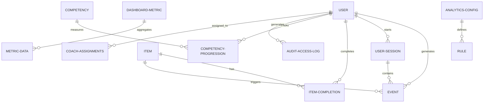

# 10 Analytics & Tracking System

**Version:** MVP Septembre 2026  
**Status:** 🟢 Spécification complète  
**Effort estimé:** 140-180h  
**Timeline:** Semaines 9-14 (Phase V1 Septembre + Phase 14 Consolidation)

---

## 📖 Vue d'Ensemble

### Objectif Métier

Système de tracking & analytics complet permettant à l'organisation de **capturer, analyser et exploiter les données d'apprentissage** avec granularité appropriée par rôle. L'objectif principal est de fournir une visibilité complète sur :

1. **Engagement & Consommation** : Qui apprend quoi, combien de temps, progression
2. **Qualité du Contenu** : NPS, feedback, identification contenus bloquants
3. **Positionnement & Progression** : Trajectoires individuelles vs objectives fixés
4. **Business Impact** : Revenue, utilization, ROI, forecasting

Ce système alimente la prise de décision stratégique (V2 go/no-go) en fournissant données fiables.

### Qui l'Utilise (Rôles)

- **Admin Plateau** : Accès COMPLET à tous dashboards (global + par company + business)
- **Coach** : Dashboard supervision équipe + fiche apprenant détaillée
- **Manager** : Vue limitée (satisfaction learner, team credit usage — TBD Cahier #3)
- **Apprenant** : Dashboard personnel (progression, badges, recommendations)

### Scope — IN / OUT

#### ✅ IN (MVP Septembre 2026)

**Event Tracking & Data Collection**
- Tous événements significatifs des modules #1-9
- Granularité: tous les 5% progression (paliers 25/50/75/100)
- Permission matrix (qui voit quoi par rôle)
- Real-time event capture (queued processing)

**Dashboards Admin (BO)**
- Dashboard global (engagement, performance contenus, financials)
- Dashboard qualité (NPS, feedback, heatmap content quality)
- Dashboard positionnement (Dreyfus initial vs final, progression, milestones, taux abandon)
- Dashboard business (subscriptions, MRR, coach utilization, ROI, forecast)
- Fiche Apprenant (historique, progression, Dreyfus radar, milestones, NPS, business metrics)

**Dashboards Coach (FO + BO)**
- Team supervision dashboard (lister apprenants, filtrer stuck/active/ahead)
- Fiche apprenant détaillée (accès coach limited)
- Identification strugglers (alerts abandons, flagging early warnings)

**Dashboards Learner (FO)**
- Personal dashboard (progression, badges, XP, recommendations)
- Radar compétences personnel (Dreyfus levels visuels)
- Progress timeline + milestones

**Data Exports & Integrations**
- CSV/JSON exports (avec anonymisation admin option)
- BI tool ready (API REST endpoints)
- WooCommerce integration (pull subscription data)

**Agrégations & Alertes**
- Daily snapshots (utilisateurs actifs, completions, metrics)
- Hourly batch dashboards (adaptive anomaly detection)
- Real-time learner dashboard (WebSocket live updates)

#### ❌ OUT (Déféré V2+)

- Journal integration (Phase 14 decision)
- Custom admin dashboard builder (V2, too complex MVP)
- Mobile analytics app (V2)
- Advanced predictive ML (beyond forecast, V3)
- Profitability deep analysis (V3)

---

## 📱 Écrans à Concevoir

### Front-Office (React)

| Écran | Rôle | Description | Priorité |
|-------|------|-------------|----------|
| **Dashboard Learner** | Apprenant | Vue personnelle : radar Dreyfus, XP total, badges earned, recommended items, recent milestones. Responsive mobile. | P0 |
| **Progress Detail View** | Apprenant | Click on competency → voir detailed progression (Dreyfus scale, objectives, milestones, feedback from coach), estimated time to next level | P0 |
| **Badge & Achievement Wall** | Apprenant | Showcase earned badges, certificates, achievements with timestamps + sharing options | P1 |
| **Coach Team Dashboard** | Coach | List apprenants (filterable by status: stuck, active, ahead) + quick view metrics (time invested, last activity, next milestone). Drill-down : click learner → see key metrics card + "View Activities" button → navigates to detail page showing all learner activities (learning history, quiz scores, feedback received). Batch hourly update. Filtres MVP : Status, assigned learner search. | P0 |
| **Fiche Apprenant (Coach View)** | Coach | Detail pour 1 apprenant : key metrics card (time invested, completion %, Dreyfus level) + "View Activities" button. Clicking button shows : historique complet consommation items, radar Dreyfus progression, feedback given by coach, messages thread. Batch hourly data refresh. | P0 |

### Back-Office (WordPress Admin Custom)

| Écran | Rôle | Description | Priorité |
|-------|------|-------------|----------|
| **Dashboard Global Analytics** | Admin | Vue 30k feet : plateforme stats (active users avec division par type de plan, time invested, completion rates, top contents, NPS trends). Filtres MVP : Period (date range picker), Company (multi-select), Coach/Learner (search), Competency (multi-select). Drill-down : click active user count → shows breakdown by plan type; click item → see engagement metrics. Batch hourly update. | P0 |
| **Dashboard Qualité** | Admin | NPS trends (global + per-item), feedback verbatims (searchable, sentiment-tagged), content quality heatmap (green/yellow/red), abandonment rate per content. NPS score displayed inline per item row; click row → modal shows full feedback verbatims (full-text searchable). Filtres MVP : Period, Company, Content. Batch hourly update. | P0 |
| **Dashboard Positionnement** | Admin | Dreyfus progression (initial vs final, per competency), learner journey predictions (expected vs actual trajectory), milestone completion rate, abandonment rate objectives. Filtres MVP : Period, Company, Competency. Drill-down : click learner segment → detail page with all learner activities + progression timeline. Batch hourly update. | P0 |
| **Dashboard Business** | Admin | Subscriptions (active/churn/MRR), revenue trends, coach utilization (hours/cost), cost per completion, ROI metrics, forecast next 3-6 months. Filtres MVP : Period (date range picker), Company (multi-select). No real-time updates; batch hourly aggregation. No scheduled email reports (V3+). | P0 |
| **Fiche Apprenant Complète** | Admin | All-in-one user view: personal info + learning history + radar competencies + Dreyfus progression chart + milestones achieved + objectives (met/abandoned) + NPS given + business metrics (cost, ROI). Filtres MVP : Available on accounts list view (filter "active users" to narrow scope). Drill-down : click activity → see detail. Batch hourly data. | P0 |
| **Content Performance Detail** | Admin | Single content drill-down: completion rate, time spent distribution, NPS breakdown, feedback list (full-text searchable on feedback text), learner segment analysis (who completes vs abandons). Filtres MVP : Period, learner cohort. Batch hourly update. | P1 |
| **Anomaly Alerts BO** | Admin | Dashboard de monitoring d'alerte (MVP) : Adaptive alerts (top X% worst performers) — contents with high abandon rate, learners under-performing trajectory, coaches with low satisfaction scores. Real-time alert dashboard (check every hour). No email notifications (V2+). | P1 |
| **Export Builder** | Admin | CSV/JSON exports: period selection, entity filter (user/content/team). Admin selects columns to export via modal paramètres (column picker). Anonymization toggle available. No PDF export, no scheduled reports. | P1 |
| **Settings Analytics** | Admin | Configure retention policy, permission matrix, alert thresholds, WooCommerce sync settings, forecast model parameters | P0 |

---

## ⚙️ Fonctionnalités (MVP)

### Core Tracking
1. **Event Capture** - Tous les événements modules #1-9 trackés en real-time (queue-based)
2. **Permission Matrix** - Système de contrôle d'accès par rôle + data filtering
3. **Aggregation Pipeline** - Daily snapshots, hourly batch dashboards, real-time learner updates
4. **Adaptive Anomaly Detection** - Percentile-based flagging (top 10% worst contents, underperforming learners)
5. **Journal Event Tracking** - Track all journal entry lifecycle events (created, published, commented, replied, sharing toggled on/off) for analytics dashboards + coach supervision

### Core Dashboards
4. **Admin Global Dashboard** - Vue plateforme complète (engagement, performance, trends)
5. **Admin Qualité Dashboard** - NPS + feedback + content quality heatmap + sentiment analysis
6. **Admin Positionnement Dashboard** - Dreyfus progression + trajectory prediction + milestones + abandonment tracking
7. **Admin Business Dashboard** - Subscriptions, revenue, utilization, ROI, 3-6 month forecast
8. **Fiche Apprenant BO** - All-in-one view (learning + business metrics)
9. **Coach Team Dashboard** - Supervision + struggles detection
10. **Learner Personal Dashboard** - Progress visualization (radar, timeline, badges, recommendations)
11. **Admin Journal Analytics Dashboard** - Journal engagement KPIs (% apprenants with entries, sentiment trends, coach engagement per team, sharing adoption rate, entry volume trends)

### Core Data Services
11. **Export System** - CSV/JSON avec anonymization option
12. **WooCommerce Sync** - Pull subscription tier data, sync with user records
13. **Business Forecast Model** - 3-6 month projections (subscriptions, revenue, usage trends)

### Secondary (if time allows)
14. **Real-time WebSocket Updates** - Live learner dashboard (not batch)
15. **Sentiment Analysis** - Parsing feedback verbatims → sentiment score
16. **Content Segment Analysis** - Drill-down who completes vs abandons per content
17. **Scheduled Report Export** - Automated CSV emails (monthly/weekly)

### MVP Interactivity & Filtering Rules

**Universal Filters (across all dashboards)**
- **Period Range Picker** : 24h, 7d, 30d, 90d, custom date range (validation prevents future dates)
- **Company Multi-Select** : Filter by company (Admin Plateau sees all; Company Admin sees own company only)
- **Coach/Learner Search** : Typeahead search by name/email, auto-completes
- **Competency/Content Multi-Select** : Multi-selection from predefined lists (dynamic load as needed)
- **Status Filter (Coach view)** : Stuck, Active, Ahead (learner categorization by trajectory)

**Drill-Down Mechanics (Limit to 3-4 clicks max)**
- **Level 1 (Dashboard)** : Summary cards, alerts, top-N lists
- **Level 2 (Click card/item)** : Detail view (modal or side-panel) with drill-down buttons
- **Level 3 (Click detail button)** : Segment analysis, comparisons, or activity timeline
- **Level 4 (Optional)** : Specific learner activity or feedback detail (rarely needed)
- **Design constraint** : No deep rabbit holes; users should reach answer in 3-4 clicks max

**Export MVP Specifications**
- **Formats** : CSV + JSON only (no PDF, no XLSX)
- **Column Picker** : Modal with checkbox list of available columns (user selects which to include)
- **Anonymization Toggle** : Optional checkbox "Anonymize learner data" (replace names with IDs)
- **File Naming** : Auto-generate descriptive names (e.g., `global_analytics_2026-05-10_company-ABC.csv`)
- **No Scheduling** : Exports on-demand only (no scheduled reports)

**Real-Time vs Batch Update Frequencies**
- **Admin Dashboards (Global, Qualité, Positionnement, Business)** : Batch hourly aggregation (no real-time)
- **Coach Dashboards (Team, Fiche Apprenant)** : Batch hourly aggregation
- **Learner Dashboard (Personal)** : WebSocket real-time (progressive v2, not MVP)
- **Anomaly Alerts Dashboard** : Hourly checks (not real-time event-driven)
- **All exports** : Generated from latest hourly batch

**Search & Alerting MVP Boundaries**
- **Full-Text Search** : Available on feedback verbatims (searchable sentiment-tagged feedback) + content names
- **Auto-Suggest** : Coach/Learner/Content search with typeahead + fuzzy matching
- **Anomaly Alerts** : Dashboard view of alerts (no auto-email notifications; V2+ feature)
- **Alert Configuration** : Percentile-based thresholds (top X% worst performers) configurable per admin

---

## 🚀 Possible Évolutions (V2+)

### V2 (Décembre 2026)
- **Custom Dashboard Builder** - Admin crée dashboards personalisés (drag-drop)
- **Advanced Predictive ML** - Au-delà forecast simple (churn prediction, content recommendations)
- **Mobile Analytics App** - Dashboards iOS/Android
- **Sentiment API** - Automated feedback classification
- **Journal Integration** - Réflexions trackées comme events (si Phase 14 OK)
- **Real-time Alerts** - Push notifications pour anomalies

### V3 (2027+)
- **Profitability Analysis** - Detailed cost breakdown par team, program, ROI per learner
- **Behavioral Segmentation** - Cohort analysis, learner personas
- **Content Marketplace Analytics** - If Cahier #18 launched

---

## 👥 User Journeys (Format 3 — CRITICAL SECTION)

### User Journey #1 : Admin → Analyser Performance Plateforme Globale

**Acteur :** Admin Plateau  
**Déclencheur :** Accès BO le matin, besoin vue état plateforme (KPIs for exec meeting)  
**Objectif :** Vérifier santé plateforme (engagement, performance contenus, financials) + identifier blocages/opportunités

#### Étapes Détaillées

1. **Admin se connecte BO et accède Dashboard Global Analytics**
   - Tape URL `/bo/analytics/global` ou clique menu "📊 ANALYTICS" → "Dashboards"
   - Système load données dernières 24h + comparaison semaine dernière
   - Feedback : Page load ~1.5s, données cached si offline
   - Durée : ~1.5s (cached) ou ~2.5s (fresh)

2. **Système affiche dashboard global (30k feet view)**
   - 6 sections principales (stacked cards) :
     - **Engagement** : Utilisateurs actifs hier, temps moyen session, sessions totales (vs semaine passée)
     - **Performance Contenus** : Top 5 contents par completion rate, overall NPS (trend chart 30j)
     - **Team Activity** : Coaches actifs, sessions completed, learners coached
     - **Business** : MRR, active subscriptions (by tier), revenue trend (7j chart)
     - **Anomalies** : Alerts (3 pires contents today, 2 learners under-trajectory, 1 coach low satisfaction)
     - **Quick Actions** : Boutons "Drill Down", "Export", "View Alerts"
   - Code couleur : 🟢 trending up, 🔴 red alerts, 🟠 trends
   - Feedback : Dashboard instantané (all cached), hover affiche details (tooltips ~200ms)
   - Durée : Instant

3. **Admin filtre dashboard par period (timeframe selection)**
   - Clique dropdown "Dernières 24h" → options : 7j, 30j, 90j, custom range
   - Exemple : Select "30j" (last 30 days)
   - Système update toutes les cards (fresh data from aggregations)
   - Feedback : Cards animate (100ms fade), load new data ~2-3s
   - Durée : ~2-3s

4. **Admin note NPS declining (6.2 vs 6.8 last week) → drill down**
   - Clique "View NPS Detail" button → navigate to Quality Dashboard
   - Dashboard Qualité open (voir Journey #2)
   - Feedback : Smooth navigation, breadcrumb shows path
   - Durée : ~1.5s page load

5. **Admin sees content performance alert (Video ABC = 62% abandon rate) → investigate**
   - Clique sur alert card ou search bar "Video ABC"
   - Navigate to Content Detail view (drill-down spécifique)
   - Voit : item name, completion %, time avg, NPS, feedback verbatims, learner segments (who abandoned = column chart)
   - Feedback : Detail modal opens, can close & return to global
   - Durée : ~1s

6. **Admin checks business KPIs (MRR, subscriptions, forecast)**
   - Scroll down to Business section (ou clique Business tab)
   - Voit : MRR trend chart (30j), subscription count by tier (pie), forecast next 90 days (line chart)
   - Hover on forecast line → tooltip "Predicted MRR €X assuming Y% churn"
   - Feedback : Charts interactive (Recharts library), hover details clear
   - Durée : Instant

7. **Admin exports dashboard data for exec email**
   - Clique "Export" → button → dropdown "CSV" / "JSON"
   - Select period & entities to include
   - Option : "Anonymize user data" (checkbox)
   - Clique "Generate" → file downloads
   - Feedback : Toast notification "Export ready: global_analytics_2026-05-10.csv"
   - Durée : ~2-3s (email after)

8. **Admin logs out**
   - Clique profil icon (top-right) → "Logout"
   - Feedback : Session cleared, redirect to login
   - Durée : Instant

#### Conditions de Succès ✅
- [ ] Dashboard loads in <2s (cached data)
- [ ] All 6 sections (Engagement, Performance, Team, Business, Anomalies, Actions) visible
- [ ] Filters (period, entity) work correctly + update all cards
- [ ] Color coding accurate (green/red alerts)
- [ ] Drill-down navigation smooth (no lag)
- [ ] Exports generate without errors
- [ ] Mobile responsive (if applicable)
- [ ] Offline mode shows cached data

#### Erreurs & Edge Cases ❌

**Cas 1 : Admin selects period with no data (e.g., future date)**
- Scénario : Admin mistakes and selects period "90j from today" (invalid)
- Comportement attendu :
  - System validates date range before fetching
  - Shows error message: "Invalid date range. Please select dates in the past or today."
  - Reverts to last valid selection (e.g., "Last 7 days")
  - Dashboard persists (doesn't break)
- Feedback : Toast error, dropdown reset
- Impact : UX protection from user mistake

**Cas 2 : Network disconnected while loading dashboard**
- Scénario : Admin's internet drops mid-fetch
- Comportement attendu :
  - Already-loaded cards show cached data
  - Unloaded cards show "No data" or skeleton loaders
  - Message: "Some data unavailable. Showing cached information."
  - Once reconnected: auto-refresh (or manual button)
- Feedback : Graceful degradation, no crash
- Impact : Offline resilience

**Cas 3 : Admin lacks permission for specific data (e.g., Company X data if Company Admin)**
- Scénario : Impossible for Admin Plateau but documented for edge cases
- Comportement attendu :
  - System filters data by user permissions automatically
  - If no data: "No data available for your permissions"
  - No error (silent filter)
- Feedback : Clear message
- Impact : Data security maintained

**Cas 4 : Forecast model lacks sufficient historical data (e.g., new platform)**
- Scénario : First week of platform, only 7 days of data, forecast requested
- Comportement attendu :
  - Forecast section shows warning: "Forecast requires 30+ days history. Current: 7 days"
  - Shows historical data only (no predictions yet)
  - Once 30d reached, forecast auto-enables
- Feedback : Clear warning, explains when it'll work
- Impact : UX clarity, no misleading predictions

**Cas 5 : Real-time WebSocket disconnects (live updates stop)**
- Scénario : WebSocket for learner dashboard real-time updates fails
- Comportement attendu :
  - Dashboard continues showing batch data (hourly)
  - Icon indicator shows "Last updated: 58 mins ago"
  - Manual "Refresh" button available
  - Auto-retry WebSocket in background
- Feedback : Visual indicator of freshness, no silent staleness
- Impact : Transparency about data age

---

### User Journey #2 : Admin → Monitor Contenu Quality & Feedback

**Acteur :** Admin Plateau  
**Déclencheur :** Received alert that course "Advanced Python" has low NPS (4.2/10), wants to investigate  
**Objectif :** Understand why content is underperforming, review learner feedback, identify improvement opportunities

#### Étapes Détaillées

1. **Admin navigates to Quality Dashboard**
   - From Global Dashboard, clicks "View NPS Detail" OR Menu "📊 ANALYTICS" → "Quality Dashboard"
   - System loads Quality Dashboard (all data, ~2-3s)
   - Feedback : Breadcrumb shows navigation path, page title clear
   - Durée : ~2-3s

2. **Quality Dashboard displays NPS summary + heatmap**
   - Top section : Overall NPS (6.2/10), trend chart (30d line chart), distribution (1-10 scale pie)
   - Middle section : **Heatmap NPS par contenu** (list all items, sorted by NPS)
     - Each row : item name | NPS score | sample size | color coding (green ≥8, yellow 6-7, red <5)
   - Bottom section : Feedback verbatims (latest, searchable)
   - Feedback : Heatmap color immediately visible, items clickable
   - Durée : Instant

3. **Admin clicks on "Advanced Python" item (NPS 4.2)**
   - Row opens side-panel or navigates to detail page
   - Shows : Item name, NPS breakdown (score distribution pie), sample size (n=45), trend (7d sparkline)
   - Next section : **Feedback Verbatims** (list recent feedback)
     - Example quotes: "Too fast paced", "Examples not realistic", "Need more practice exercises"
     - Each feedback : author anon ("Apprenant #123"), date, NPS score given, sentiment tag (positive/negative/neutral)
   - Feedback : Clear layout, sentiment colors (red = negative feedback)
   - Durée : ~1.5s

4. **Admin analyzes who gave low feedback (segment analysis)**
   - Clique "View Learner Segments" button
   - System shows breakdown : learner_level (débutant vs avancé), company, completion status
     - Example : "Beginners (n=15) : NPS 2.8 | Advanced (n=30) : NPS 5.1"
   - Insight : Beginners struggle, advanced find it ok
   - Feedback : Table sortable, highlights problematic segments
   - Durée : ~1s

5. **Admin reads full feedback list (filter options)**
   - Clique "Expand Feedback" → shows all verbatims (paginated, 10 per page)
   - Options to filter : sentiment (negative, neutral, positive), date range, learner segment
   - Example search : filter negative feedback only → shows 12/45 feedback items
   - Feedback : Filtering live (no reload), search box responsive
   - Durée : ~500ms per filter

6. **Admin identifies pattern : "Too fast paced" appears 7 times**
   - Recognizes theme from verbatims
   - Notes : Need to slow down video, add more pauses/exercises
   - Takes action : Adds note in BO (optional CMS task creation → TBD)
   - Feedback : Clear tagging/grouping would help (future enhancement)
   - Durée : 5-10 min reading

7. **Admin exports feedback report for content creator**
   - Clique "Export" → dropdown "CSV" or "PDF Report"
   - Selects : verbatim list + sentiment summary + segment analysis
   - Anonymization toggle ON (so creator doesn't see learner names)
   - Clique "Generate" → file ready
   - Feedback : Toast "Report ready: advanced_python_feedback_2026-05-10.csv"
   - Durée : ~2-3s

8. **Admin compares "Advanced Python" against similar content (benchmarking)**
   - Clique "Compare Items" → select category "Python Courses"
   - System shows all Python items + NPS ranks
   - Insight : "Advanced Python" (4.2) vs "Python Basics" (7.1) vs "Python Intermediate" (6.5)
   - Feedback : Comparative chart visible, insights clear
   - Durée : ~1.5s

#### Conditions de Succès ✅
- [ ] Quality Dashboard loads all NPS data <2.5s
- [ ] Heatmap displays all items with color coding correct
- [ ] Drill-down into item detail smooth + shows feedback
- [ ] Sentiment analysis tags accurate (manual verification needed)
- [ ] Segment analysis shows breakdown by learner characteristic
- [ ] Feedback export works, anonymization respected
- [ ] Comparative analysis available
- [ ] Search/filter responsive (<500ms)

#### Erreurs & Edge Cases ❌

**Cas 1 : Content with zero feedback (new item)**
- Scénario : Admin views item that just launched, 0 completions, 0 NPS data
- Comportement attendu :
  - Shows "No data available" gracefully
  - Message: "Item launched [date]. Waiting for learner feedback. Check back after 5+ completions."
  - Doesn't show in heatmap (or shows at bottom grayed out)
- Feedback : Clear communication, no confusion
- Impact : Prevents false alarms

**Cas 2 : Feedback contains PII or offensive language**
- Scénario : Apprenant gives feedback with learner name or inappropriate content
- Comportement attendu :
  - Before display : system flags if possible (automated)
  - Admin can mark for moderation
  - Anonymize PII (replace names with IDs)
  - Option to redact offensive feedback (BO tool)
- Feedback : Clear moderation workflow
- Impact : Data privacy + professionalism

**Cas 3 : Sentiment analysis error (misclassifies mood)**
- Scénario : Feedback "I LOVE this course but it's too fast" misclassified as negative (capital LOVE confuses NLP)
- Comportement attendu :
  - Admin can manually override sentiment tag (thumbs up/down?)
  - Feedback : Clickable sentiment tag, shows confidence %
  - Manual overrides inform model (future ML improvement)
- Impact : Accuracy over time, admin control

**Cas 4 : Very small sample size (n=3 feedback for item)**
- Scénario : Item has 50 completions but only 3 NPS ratings submitted
- Comportement attendu :
  - Shows NPS but includes caveat: "Sample size: 3/50 (6% response rate). Limited confidence."
  - Highlights in yellow instead of red/green (uncertain)
  - Suggests: "Wait for more feedback before major changes"
- Feedback : Statistical honesty, prevents over-reaction
- Impact : Data-driven decision making

**Cas 5 : Feedback is completely contradictory**
- Scénario : One learner: "Too slow and boring" | Another: "Too fast and complex" (both NPS < 3)
- Comportement attendu :
  - Shows all feedback, doesn't filter contradictions
  - Segment analysis might reveal: "Beginners say slow, Advanced say fast"
  - Insight: Item doesn't fit everyone, needs targeting or flexibility
- Feedback : Honest display of contradiction
- Impact : Better understanding of content-learner fit

---

### User Journey #3 : Coach → Monitor Team Progression & Identify Strugglers

**Acteur :** Coach  
**Déclencheur :** Weekly check-in time, wants to see team status + identify learners needing help  
**Objectif :** Quickly see who's progressing, who's stuck, where to focus coaching efforts

#### Étapes Détaillées

1. **Coach logs into BO and views Team Dashboard**
   - URL `/bo/coaching/team` or Menu "🎫 COACHING" → "Team Dashboard"
   - System loads team roster (coach's 10-15 apprenants)
   - Feedback : Page load ~1.5s, shows coach's name + team size
   - Durée : ~1.5s

2. **Team Dashboard displays roster with filters**
   - Table format : Learner name | Current objective | Progress % | Last activity | Status indicator
   - Status colors : 🟢 On-track (progressing normally) | 🟠 At-risk (slower than expected) | 🔴 Stuck (no activity 7d+)
   - Example breakdown : 7 on-track, 4 at-risk, 1 stuck
   - Feedback : Table sortable, color-coded status immediately visible
   - Durée : Instant

3. **Coach applies filter "Status = At-Risk"**
   - Dropdown filter "Status" → select "At-Risk"
   - Table updates to show 4 learners (only at-risk ones)
   - Feedback : Filter live, no page reload
   - Durée : ~300ms

4. **Coach clicks on "Marie" (at-risk learner)**
   - Row expands or navigates to Marie's detail page
   - Shows : Personal info + current objective + progress radar (where stuck) + recent activities
   - Example : "Marie's objective: Master Python loops (Dreyfus 3 target). Current: Dreyfus 2 (70% progress toward 3). Last activity: 3 days ago."
   - Predicted: "At current pace, will reach Dreyfus 3 in 21 days (expected 14d). 1 week behind."
   - Feedback : Clear visualization of progress vs expectation
   - Durée : ~1s

5. **Coach reviews Marie's learning history (last items completed)**
   - Section "Recent Activity" shows last 5 items Marie completed :
     - Item name | Completion date | Time spent | Score/Feedback given by Marie
   - Example : "Python Basics (3d ago, 45min, NPS 6)" → "Loops Part 1 (2d ago, 30min, NPS 4)"
   - Insight : NPS declining + time spent decreasing = losing engagement
   - Feedback : Timeline shows progression visually (sparkline trend)
   - Durée : Instant

6. **Coach checks if Marie submitted any objectives or milestones**
   - Section "Goals & Milestones" shows :
     - Current objective (above)
     - Milestones achieved : checkbox list (completed ✅ vs pending ⏳)
     - Example : "Milestone: Run basic loop program ✅ | Milestone: Refactor nested loop ⏳"
   - Insight : Marie completed 1/3 milestones for this objective
   - Feedback : Progress visualization clear, milestones showing
   - Durée : Instant

7. **Coach sends alert message to Marie**
   - Button "Send Message" or "Send Alert"
   - Type message : "Hi Marie, I noticed you're taking slightly longer on the Loops module. Want to do a quick 1:1 call this week to work through any blockers? Free Wed 2pm?"
   - Clique "Send"
   - Feedback : Toast "Message sent" + message appears in coaching chat thread
   - Durée : ~1.5s (notification to Marie immediately)

8. **Coach books 1:1 coaching session with Marie**
   - Clique "Schedule Session" button
   - Calendar opens : select date/time
   - Example : Wed 2pm-3pm (1 hour session)
   - Clique "Create" → session added to calendar
   - Feedback : Confirmation "Session booked" + notification sent to Marie
   - Marie receives notification (email + platform alert)
   - Durée : ~1s

9. **Coach reviews overall team metrics + forecast**
   - Scroll up to top or clique "Team Overview"
   - Section "Team KPIs" shows : avg team progress (60%), at-risk ratio (28%), milestone completion rate (64%), avg session frequency
   - Section "Forecast" : Prediction "At current pace, team will complete X objectives by [date]. On track for Q2 goals."
   - Feedback : Clear metrics, encouraging/concerning trends visible
   - Durée : Instant

10. **Coach exports team report for manager**
    - Clique "Export Team Report"
    - Options : Full report (all learners) vs At-Risk only, period (this week, month, quarter)
    - Select : "Month, All learners"
    - Clique "Download CSV"
    - Feedback : File ready, name = "team_report_Coach_Name_May2026.csv"
    - Durée : ~2-3s

#### Conditions de Succès ✅
- [ ] Team roster loads <1.5s
- [ ] Status colors accurate (on-track vs at-risk vs stuck logic correct)
- [ ] Filters (status, period) work + table updates live
- [ ] Drill-down into learner detail smooth
- [ ] Progress vs expectation visualization clear (what's expected vs actual)
- [ ] Milestones & goals displayed accurately
- [ ] Messages sent to learners immediately
- [ ] Forecast predicts correctly (validation needed post-launch)
- [ ] Report exports accurate
- [ ] Mobile responsive (if applicable)

#### Erreurs & Edge Cases ❌

**Cas 1 : Coach has no learners assigned yet (new coach)**
- Scénario : Fresh coach, team empty
- Comportement attendu :
  - Shows "No learners assigned" message
  - Button "Request assignment" or "View available learners"
  - Doesn't break, UX clear
- Feedback : Onboarding flow for empty state
- Impact : New coach doesn't get confused

**Cas 2 : Learner's objective is ambiguous (no clear Dreyfus target)**
- Scénario : Coach set objective "Improve leadership" but didn't specify Dreyfus level
- Comportement attendu :
  - Shows warning: "Objective missing Dreyfus target. Prediction unavailable."
  - Suggests: "Edit objective to specify target level (e.g., D3)?"
  - Coach can edit in-place
- Feedback : Clear guidance for fixing
- Impact : Data quality improves

**Cas 3 : Forecast confidence is low (not enough historical data)**
- Scénario : Learner just started, only 5 days history
- Comportement attendu :
  - Shows forecast but includes caveat: "Forecast confidence: 30% (needs 30+ days history)"
  - Mark forecast in lighter color (less certain)
  - "Check back next week for more accurate prediction"
- Feedback : Transparency about prediction quality
- Impact : Coach doesn't over-rely on unreliable forecast

**Cas 4 : Learner is completely inactive (missing 30+ days)**
- Scénario : Learner hasn't logged in for 30 days, clearly stuck
- Comportement attendu :
  - Status = 🔴 STUCK (clear indicator)
  - Alert message : "No activity for 30 days. Consider reaching out or removing from active roster?"
  - Coach can mark "Inactive" or "On leave" in status
- Feedback : Explicit alert, action suggestion
- Impact : Coach attention to disengaged learners

**Cas 5 : Milestone achieved but Coach doesn't see it (sync delay)**
- Scénario : Learner completed milestone 5 mins ago, but Coach dashboard not updated yet
- Comportement attendu :
  - Dashboard shows milestone as "In progress" (not yet synced)
  - Manual "Refresh" button available
  - Auto-refresh happens within 5 minutes (hourly batch)
  - Real-time WebSocket would show immediately (if available)
- Feedback : Transparency about freshness, manual refresh option
- Impact : Coach doesn't miss milestones

---

### User Journey #4 : Admin → Review Business Metrics & Forecast Growth

**Acteur :** Admin Plateau  
**Déclencheur :** Monthly exec meeting next week, needs business health metrics + growth forecast  
**Objectif :** Evaluate revenue, user growth, resource utilization, ROI; prepare forecast for next quarter

#### Étapes Détaillées

1. **Admin navigates to Business Dashboard**
   - Menu "📊 ANALYTICS" → "Business Dashboard"
   - System loads business metrics (all-time + last 30d)
   - Feedback : Page load ~2-3s, comprehensive data visible
   - Durée : ~2-3s

2. **Business Dashboard displays subscription overview**
   - Top section : **Subscription Metrics** (card layout)
     - Current active users : 245 total (tier breakdown pie : 60% Individual, 25% Team, 15% Enterprise)
     - MRR (Monthly Recurring Revenue) : €8,400 (trend chart last 6 months)
     - Churn rate : 2.1% (good trend, declining from 3% last month)
     - LTV (Lifetime Value) : €2,150 avg per user
   - Feedback : Cards show clear numbers, trend arrows (up/down/stable)
   - Durée : Instant

3. **Admin views revenue trends (6-month chart)**
   - Chart shows MRR line (6m) : Jan €6,200 → Feb €7,100 → ... → Jun €8,400
   - Trend : +35% growth over 6 months
   - Feedback : Interactive chart (Recharts), hover shows month detail
   - Durée : ~500ms hover

4. **Admin checks resource utilization (coaches)**
   - Section "Team Resources" :
     - Active coaches : 12 total
     - Billable hours last month : 1,240h
     - Cost per hour : €45 avg
     - Total coach cost : €55,800
     - Revenue per coach : €700 avg (€8,400 / 12)
     - Utilization ratio : 64% billable vs 36% internal/admin
   - Feedback : Clear breakdown, cost-benefit visible
   - Durée : Instant

5. **Admin calculates ROI metrics (content performance)**
   - Section "Learning ROI" :
     - Learners completed objectives : 89 (this month)
     - Cost per completion : €94 (€8,400 MRR / 89 completions)
     - Avg time per completion : 42 hours
     - Cost per hour of learning : €2.20
     - Estimated productivity gain per learner : €500+ (TBD, external study)
   - Feedback : Clear ROI story (minimal costs, high value)
   - Durée : Instant

6. **Admin views forecast (next 6 months)**
   - Section "6-Month Forecast" :
     - Model assumptions : current growth rate, seasonality, churn trend
     - Projected MRR (Sep-Dec 2026) : €8.4k (Jun) → €9.2k (Jul) → €10k (Aug) → €11k (Sep) → €12.5k (Dec)
     - Assumes : +8% monthly growth + -2% churn
     - Confidence interval : 85% confidence (based on 6m history)
   - Visual : Line chart (historical + forecast dashed line)
   - Feedback : Clear distinction between historical (solid) and predicted (dashed)
   - Durée : Instant

7. **Admin drills down on forecast assumptions**
   - Clique "View Model Details"
   - Shows :
     - Historical growth rate : 5.8% avg
     - Current trend : +8% (accelerating)
     - Churn assumption : -2% based on recent trend
     - Seasonal adjustment : None (flat business)
     - Sensitivity analysis : If growth slows to 4%, forecast = €11.8k. If accelerates to 10%, forecast = €13k.
   - Feedback : Transparent model, sensitivity ranges visible
   - Durée : ~1.5s

8. **Admin compares forecast vs targets**
   - Shows target vs forecast (example table) :
     - Target (Q3) : €10.5k MRR | Forecast : €10.2k (-2.9% miss)
     - Target (Q4) : €12.5k MRR | Forecast : €12.5k (✅ on-track)
   - Insight : On track for Q4, slight miss in Sep (but close)
   - Feedback : Traffic light colors (🟢 on-track, 🟠 at-risk, 🔴 miss)
   - Durée : Instant

9. **Admin exports business report for exec meeting**
   - Clique "Export Executive Report"
   - Options : Period (30d, 90d, YTD), format (PDF, CSV, PowerPoint slides)
   - Select : "90d, PDF"
   - Clique "Generate"
   - Feedback : Report includes charts, KPIs, forecast, insights
   - File ready ~3-5s : "business_report_Q2_2026.pdf"
   - Durée : ~3-5s

10. **Admin schedules data refresh + alerts**
    - Clique "Settings" → "Business Dashboard Config"
    - Options : Refresh frequency (hourly/daily), anomaly alerts (MRR drop > 5%?), forecast recalc frequency (weekly)
    - Confirms : "Daily refresh at 2am, alert if MRR drops > 5%"
    - Feedback : Clear config, no more manual refreshes
    - Durée : ~1.5s

#### Conditions de Succès ✅
- [ ] Business Dashboard loads all metrics <2.5s
- [ ] Subscription metrics accurate (pull from WooCommerce)
- [ ] Revenue trends calculated correctly (month-over-month)
- [ ] Resource utilization shows coaches + costs + billable hours
- [ ] ROI metrics calculated (cost per completion, productivity gain estimate)
- [ ] Forecast generates <3s, assumptions transparent
- [ ] Sensitivity analysis shows impact of assumptions
- [ ] Export produces professional report (PDF/CSV)
- [ ] Historical data (6m+) available for trend analysis
- [ ] Mobile responsive (if applicable)

#### Erreurs & Edge Cases ❌

**Cas 1 : WooCommerce sync fails (subscription data stale)**
- Scénario : Business Dashboard pulls subscription data from WooCommerce API, but API down for 2 hours
- Comportement attendu :
  - Dashboard shows cached data (from last successful sync)
  - Warning banner : "Subscription data last updated [timestamp]. Live sync unavailable. Check back in 30 mins."
  - System continues showing cached metrics (no crash)
  - Auto-retry sync in background
- Feedback : Clear communication about data freshness
- Impact : Business continuity despite integration issues

**Cas 2 : Forecast lacks confidence (insufficient historical data)**
- Scénario : Platform only 2 months old, too little history for reliable forecast
- Comportement attendu :
  - Forecast available but confidence = 35%
  - Message: "Forecast needs 30+ days history for reliable predictions. Current: 60 days. Check back."
  - Shows linear extrapolation as fallback (not ML-based)
  - Forecast dims/grays (lower confidence visual)
- Feedback : Transparency prevents over-reliance on unreliable predictions
- Impact : Better decision-making

**Cas 3 : Forecast model breaks (division by zero or NaN)**
- Scénario : Edge case in forecast calculation (e.g., zero learners)
- Comportement attendu :
  - Error caught gracefully
  - Message: "Forecast calculation error. Please check data or contact support."
  - Dashboard shows historical data only (no forecast)
  - No crash, UX continues
- Feedback : Clear error message, fallback data visible
- Impact : Robustness

**Cas 4 : Churn calculation anomaly (more cancellations than sign-ups)**
- Scénario : Data shows 50 cancellations but only 40 new users (unusual month)
- Comportement attendu :
  - Churn rate calculated correctly (even if negative growth)
  - Forecast reflects downturn assumption
  - Alert banner: "Churn rate higher than usual (4.2% vs 2% avg). Review causes."
  - Sensitivity shows: "If churn continues, MRR will decline 8-10% next month."
- Feedback : Honest data, alerts to investigate anomaly
- Impact : Early warning of potential problems

**Cas 5 : Export generation times out (large report, slow server)**
- Scénario : Admin requests 2-year historical export (huge dataset), server slow
- Comportement attendu :
  - Timeout at ~10s
  - Message: "Report generation took too long. Please try smaller period (e.g., last 90 days) or try again later."
  - Suggestion: "Or email admin@company.com for manual report."
  - UI doesn't freeze (async job)
- Feedback : Clear timeout + alternative options
- Impact : User doesn't get stuck

---

## 🗄️ Modèle de Données

### Entités Principales

#### 1. **Event** (événement tracké — base du système)
| Colonne | Type | Description |
|---------|------|-------------|
| `event_id` | UUID | Primary key |
| `user_id` | UUID | FK → User |
| `event_type` | String | e.g., "item_completed", "quiz_answered", "badge_earned" |
| `event_data` | JSON | Context-specific data (item_id, score, time_spent, etc.) |
| `timestamp` | DateTime | When event occurred (UTC) |
| `session_id` | UUID | FK → UserSession (links to session context) |
| `created_at` | DateTime | When recorded in DB |
| `_partition_key` | String | Month-YYYY for table partitioning (e.g., "2026-05") |

#### 2. **UserSession** (contexte de session)
| Colonne | Type | Description |
|---------|------|-------------|
| `session_id` | UUID | Primary key |
| `user_id` | UUID | FK → User |
| `start_time` | DateTime | Session start |
| `end_time` | DateTime | Session end (null if ongoing) |
| `duration_seconds` | Integer | Calculated (end - start) |
| `device_type` | String | "mobile" / "tablet" / "desktop" |
| `ip_location` | String | Geolocation (optional, privacy-safe) |
| `created_at` | DateTime | When recorded |

#### 3. **ItemCompletion** (item d'apprentissage complété)
| Colonne | Type | Description |
|---------|------|-------------|
| `completion_id` | UUID | Primary key |
| `user_id` | UUID | FK → User |
| `item_id` | UUID | FK → Item |
| `completion_date` | DateTime | When marked complete |
| `time_spent_seconds` | Integer | Total time on item |
| `score` | Decimal | If applicable (quiz: 0-100) |
| `nps_given` | Integer | NPS 1-10 (if provided) |
| `feedback_text` | Text | Optional learner feedback |
| `created_at` | DateTime | When recorded |

#### 4. **CompetencyProgression** (progression Dreyfus per compétence)
| Colonne | Type | Description |
|---------|------|-------------|
| `progression_id` | UUID | Primary key |
| `user_id` | UUID | FK → User |
| `competency_id` | UUID | FK → Competency |
| `current_level` | Integer | Dreyfus 1-5 |
| `target_level` | Integer | Objectif Dreyfus |
| `progress_percent` | Decimal | 0-100 (toward target) |
| `updated_at` | DateTime | Last progression update |
| `created_at` | DateTime | When first assessed |
| `history` | JSONB | Version history (optional, V2) |

#### 5. **DashboardMetric** (agrégation pré-calculée — optimisation perf)
| Colonne | Type | Description |
|---------|------|-------------|
| `metric_id` | UUID | Primary key |
| `metric_key` | String | e.g., "daily_active_users", "avg_completion_rate", "top_10_items" |
| `period` | String | "daily" / "weekly" / "monthly" |
| `period_date` | Date | Date of the period |
| `value` | JSON | Actual metric data (dynamic structure) |
| `computed_at` | DateTime | When calculated |
| `expires_at` | DateTime | When to recalculate (TTL) |

#### 6. **AnalyticsConfig** (configuration système)
| Colonne | Type | Description |
|---------|------|-------------|
| `config_id` | UUID | Primary key |
| `permission_matrix` | JSONB | Role-based access rules |
| `retention_policy` | JSONB | Event TTL (30d/90d/1y) + cold storage |
| `aggregation_schedule` | JSONB | Cron jobs (daily 2am, hourly, etc.) |
| `anomaly_thresholds` | JSONB | Alert rules (abandon rate > 50%, NPS < 3) |
| `forecast_params` | JSONB | Model assumptions (growth rate, churn, seasonality) |
| `updated_at` | DateTime | Last config change |
| `updated_by` | UUID | Admin who changed it |

#### 7. **audit_access_log** (Audit trail des accès analytics — P1-27)
| Colonne | Type | Description |
|---------|------|-------------|
| `id` | UUID | Primary key |
| `user_id` | UUID | FK to user who accessed data |
| `resource_type` | Enum | 'journal_entry', 'analytics_dashboard', 'learner_profile', 'coaching_metrics' |
| `resource_id` | UUID | ID of accessed resource |
| `action` | Enum | 'view', 'export', 'search', 'filter' |
| `timestamp` | DateTime | When access occurred |
| `reason` | String | Why access was granted (e.g., 'coach_assignment', 'super_admin_override') |
| `company_id` | UUID | FK to company (for filtering + multi-tenant isolation) |
| `created_at` | DateTime | Record creation timestamp |

#### 8. **coach_assignments** (Track coach-learner relationships with time windows — P1-27)
| Colonne | Type | Description |
|---------|------|-------------|
| `id` | UUID | Primary key |
| `coach_id` | UUID | FK to coach user |
| `learner_id` | UUID | FK to learner user |
| `company_id` | UUID | FK to company (for multi-company coaches) |
| `start_date` | DateTime | When assignment began |
| `end_date` | DateTime | When assignment ended (NULL if active) |
| `access_window_months` | Integer | How many months after end_date coach retains read access (default: 6) |
| `created_at` | DateTime | Record creation timestamp |
| `updated_at` | DateTime | Record update timestamp |

### Relations (Schéma Simplifié)

```
User (1) ──→ (many) Event
User (1) ──→ (many) UserSession
User (1) ──→ (many) ItemCompletion
User (1) ──→ (many) CompetencyProgression

Item (1) ──→ (many) ItemCompletion
Item (1) ──→ (many) Event

Competency (1) ──→ (many) CompetencyProgression

UserSession (1) ──→ (many) Event (session_id FK)
```

### Schéma Simplifié (Mermaid)



---

## 🔐 Permission Matrix — Edge Cases & Resolution (P1-27)

### Super-Admin Access
- **Rule:** Super-admin user sees ALL data across all companies/learners without sharing restrictions
- **Audit Trail:** audit_access_log table records all super-admin access (user_id, resource_type, resource_id, action, timestamp, reason)
- **UI:** Super-admin dashboard includes audit log viewer showing all access attempts
- **Compliance:** All super-admin actions logged for compliance audit

### Multi-Company Scope (Manager & Coach)
- **Dashboard Layout:** Separate tabs per company (Entreprise A | Entreprise B | etc.)
- **Manager:** Sees company-level KPIs aggregated per company tab, NOT cross-company mix
- **Coach:** Sees assigned learners ONLY per company tab (if coaching multiple companies, sees separate tabs)
- **Data Isolation:** Query filters by company_id; zero cross-company data leakage
- **Aggregate:** Learner count, entry count, sentiment % scoped per company

### Coach Historical Access (6-Month Window)
- **Rule:** When coach is unassigned from learner, coach retains READ-ONLY access for 6 months post-unassignment
- **Implementation:** coach_assignments table tracks end_date; permission check: `if (DATE_NOW - end_date <= 180 days) then allow_read`
- **After 6 months:** Access revoked completely (no entries visible, no drill-down possible)
- **Use case:** Coach feedback/review after learner moves to new coach; learning continuity

### Deleted Learner Data (Hard Delete + Anonymized Stats)
- **Rule:** When apprenant requests GDPR deletion, hard-delete all PII (name, email, personal entries)
- **Exception:** Keep anonymized aggregate counters for global stats (e.g., "N apprenants completed learning path this month")
- **Individual Visibility:** All individually-identifiable data disappears from manager/coach dashboards
- **Retention:** Data purged from DB; no soft-delete flag for GDPR compliance
- **Impact:** Manager/Coach queries return "No data" for deleted apprenant

### Revoked Journal Sharing (Immediate Silent Removal)
- **Rule:** Apprenant disables sharing_enabled_for_coach=false → Coach loses access IMMEDIATELY
- **Visibility:** Journal entries disappear silently (no "Access revoked" notification)
- **Data Persistence:** Entries remain in DB (soft-delete flag) for audit trail, not visible to coach
- **Exception:** Missions Apprenantes entries + Phase R lesson responses REMAIN VISIBLE even after sharing revoked (special case per learning continuity)
- **Impact:** Coach sees filtered entry list only for sharing_enabled_for_coach=true entries

### Audit Trail Role-Based Filtering (No Cross-Role Data Leakage)
- **Rule:** Audit trail (who accessed what, when) is filtered by user role & permissions
- **Coach Access:** Coach C sees only access logs for learners assigned to Coach C
- **Coach C2 Protection:** Coach C2 CANNOT see that Coach C1 accessed Apprenant X (prevents indirect data discovery)
- **Manager Access:** Manager sees audit logs for coaches under their supervision + company-scoped learner access
- **Super-Admin:** Sees all audit logs (no filtering)
- **Implementation:** audit_access_log queries include WHERE clause filtering by viewer's role & assignments

---

## ✅ Critères d'Acceptation MVP

### Fonctionnalités Core
- [x] Event tracking pour tous modules (#1-9) fonctionnel
- [x] Permission matrix appliquée (qui voit quoi par rôle)
- [x] All 4 Admin dashboards affichent données correctement (Global, Qualité, Positionnement, Business)
- [x] Coach dashboard supervision opérationnel
- [x] Learner personal dashboard affiche (radar, XP, badges, recommendations)

### Expérience Utilisateur
- [x] Dashboards load <2.5s (cached data)
- [x] Filters/drills work live (no page reload lag)
- [x] Mobile responsive (if applicable)
- [x] Offline mode shows cached data (graceful degradation)
- [x] Error handling (no silent failures, clear error messages)

### Données & Intégrité
- [x] Event timestamps accurate (UTC)
- [x] Progress calculations correct (all 5%, palier tracking)
- [x] Dreyfus levels mapped correctly
- [x] Permission filtering enforced (no data leakage)
- [x] NPS/feedback captured + displayed accurately
- [x] Milestones tracked + displayed

### Performance & Scalabilité
- [x] Database indexes on user_id, event_type, timestamp
- [x] Aggregation pipeline handles 10k+ events/day
- [x] Real-time learner dashboard <1s update (WebSocket or batch)
- [x] Batch admin dashboards compute hourly without locking

### Sécurité & Conformité
- [x] Auth/authorization enforced (role-based access)
- [x] Event data cannot be modified post-creation (immutable)
- [x] Audit trail logged (who accessed what data, when)
- [x] GDPR compliance (anonymization option, data retention policy)
- [x] Export respects permissions (no data leakage)

### Exports & Integrations
- [x] CSV/JSON exports work without errors
- [x] Exports respect permissions (anon option works)
- [x] WooCommerce sync (subscription data pull) functional
- [x] API endpoints ready for BI tools (REST)

### Forecast & Analytics
- [x] Forecast model generates predictions (6-month forward)
- [x] Confidence intervals shown (statistical transparency)
- [x] Sensitivity analysis available (assumption impact)
- [x] Anomaly detection flags adaptive percentile-based alerts

### Journal Events & Analytics
- [x] Journal entry lifecycle events captured (created, published, commented, replied, sharing toggled)
- [x] Journal Analytics Dashboard load <2.5s (cached data)
- [x] Engagement KPIs calculated (% with entries, sentiment trend, coach engagement, sharing metrics)
- [x] Permission model enforced (apprenant controls sharing, Coach/Manager see only if enabled)
- [x] Event timestamps accurate (UTC, consistent with other modules)
- [x] Journal entries audit trail logged (who accessed, when, what actions)

---

## 🔗 Dépendances Inter-Modules

### Cahier #10 dépend de:

| Module | Raison | Bloquant? |
|--------|--------|-----------|
| **Cahier #1** (Formation) | Must track item events (start, progress, complete, quiz) | OUI |
| **Cahier #2** (Passeport) | Must track competency progression, objectives, milestones | OUI |
| **Cahier #3** (Onboarding) | Must track profile creation, questionnaire, role assignment | OUI |
| **Cahier #4** (Coaching) | Must track sessions, feedback, messaging | OUI |
| **Cahier #5** (Gamification) | Must track XP gained, badges earned, leaderboard views | OUI |
| **Cahier #6** (Enterprise FO) | Must track company-level views, team metrics | OUI |
| **Cahier #7** (Journal) | Must track entry creation, reflection, publishing, comments, sharing | OUI |
| **Cahier #8** (Masterclass) | Must track class attendance, video watch time | OUI |
| **Cahier #9** (Notifications) | Must track email sent, opened, clicked, notifications read | OUI |
| **Cahier #11bis** (GDPR) | Audit trail, data retention, anonymization rules | OUI (Phase 14) |

### Cahier #10 bloque:

| Module | Raison | Impact |
|--------|--------|--------|
| **Cahier #10bis** (BO Organization) | Analytics screens must fit BO menu structure | MOD (informé) |
| **Cahier #11bis** (GDPR) | Must define audit trail for data access + retention policy | DEP (Phase 14) |
| **Dev Phase** | Cannot start dev until all module events defined | BLOCKER |

### Ordre Implémentation Conseillé:
```
✅ Phase V1 (Semaines 9-14)
  ├─ Modules #1-9 (cores) DONE by Sep 15
  ├─ Cahier #10 events finalized by Sep 20
  └─ Cahier #10 BO screens + dashboards (Semaines 11-14)

⏳ Phase 14 (Consolidation pre-launch)
  ├─ Cahier #11bis integration (audit trail, retention)
  ├─ Cahier #10bis integration (BO menu organization)
  ├─ Event enumeration inventory validation
  └─ Forecast model validation (real data test)
```

---

## 📊 Analytics & Métriques

### Quoi Tracker (Events — Énumération complète par module)

**À finaliser Phase 14 dans NOTIFICATION_EVENTS_INVENTORY.md, mais MVP liste :**

#### Formation Module (#1)
| Événement | Trigger | Valeur | Rôle accès |
|-----------|---------|--------|-----------|
| `item_started` | Apprenant ouvre item | item_id, timestamp | Admin, Coach |
| `item_progress_5pct` thru `item_progress_95pct` | Progression détectée | item_id, % | Admin only |
| `item_completed` | Item marqué done | item_id, time_spent, timestamp | Admin, Coach |
| `quiz_answered` | Réponse soumise | item_id, question_id, answer, score | Admin, Coach |
| `exercise_submitted` | Exercice complété | item_id, submission, attempt_num | Admin, Coach |

#### Passeport Module (#2)
| Événement | Trigger | Valeur |
|-----------|---------|--------|
| `competency_assessed` | Évaluation soumise | competency_id, dreyfus_level |
| `objective_set` | Objectif créé | competency_id, target_level, deadline |
| `objective_completed` | Objectif atteint | competency_id, dreyfus_final |
| `objective_abandoned` | Objectif abandonné | competency_id, reason (optional) |
| `milestone_reached` | Jalon franchi | milestone_id, competency_id |

#### Onboarding Module (#3)
| Événement | Trigger | Valeur | Rôle accès |
|-----------|---------|--------|-----------|
| `onboarding_questionnaire_started` | Apprenant commence questionnaire | learner_id, timestamp, manager_id | Admin, Manager, Coach |
| `onboarding_questionnaire_completed` | Questionnaire complété | learner_id, timestamp, responses_json, time_spent | Admin, Manager, Coach |
| `onboarding_questionnaire_abandoned` | Questionnaire abandonné (after 2+ attempts ou 72h timeout) | learner_id, timestamp, attempt_num, last_question | Admin, Manager, Coach |
| `profile_completion_step_completed` | Étape profil terminée | learner_id, step_name, timestamp | Admin, Manager, Coach |
| `profile_completed` | Profil complet 100% | learner_id, timestamp, total_steps_completed | Admin, Manager, Coach |
| `competency_auto_assigned` | Compétences auto-assignées (post-questionnaire) | learner_id, competency_ids[], dreyfus_levels[], timestamp | Admin, Manager, Coach |

#### Coaching Module (#4)
| Événement | Trigger | Valeur |
|-----------|---------|--------|
| `session_booked` | Séance réservée | coach_id, learner_id, date_time |
| `session_completed` | Séance complète | coach_id, learner_id, duration, notes |
| `feedback_provided` | Coach donne feedback | learner_id, content (JSON) |
| `message_sent` | Message coaching | from_id, to_id, content |

#### Gamification Module (#5)
| Événement | Trigger | Valeur |
|-----------|---------|--------|
| `badge_earned` | Badge gagné | badge_id, learner_id |
| `xp_gained` | XP awarded | learner_id, amount, source |
| `leaderboard_viewed` | Dashboard viewed | learner_id, leaderboard_type |

#### Notifications Module (#9)
| Événement | Trigger | Valeur |
|-----------|---------|--------|
| `email_sent` | Email dispatched | recipient_id, template, timestamp |
| `email_opened` | Email opened (tracked pixel) | recipient_id, email_id, timestamp |
| `email_clicked` | Link clicked in email | recipient_id, email_id, link_url |
| `notification_read` | Platform notification read | recipient_id, notification_id |

#### Journal Module (#7)
| Événement | Trigger | Valeur | Rôle accès |
|-----------|---------|--------|-----------|
| `journal_entry_created` | Apprenant crée nouvelle entrée | entry_id, user_id, timestamp | Admin, Coach (if sharing enabled) |
| `journal_entry_published` | Apprenant publie entrée (change status draft → published) | entry_id, timestamp | Admin, Coach (if sharing enabled) |
| `journal_comment_added` | Coach ajoute commentaire sur entrée | entry_id, comment_id, coach_id, timestamp | Admin, Coach (author only) |
| `journal_reply_added` | Apprenant répond à commentaire coach | entry_id, comment_id, reply_id, user_id, timestamp | Admin, Coach (if sharing enabled) |
| `journal_sharing_enabled` | Apprenant active partage (Coach ou Manager) | user_id, shared_with_role (coach/manager), timestamp | Admin, Coach, Manager |
| `journal_sharing_disabled` | Apprenant désactive partage | user_id, revoked_role, timestamp | Admin |

**[Plus détails complets PHASE 14 INVENTORY FILE]**

### Dashboards par Rôle

#### Dashboard Admin Global
- **Engagement** : utilisateurs actifs hier, avg session length, sessions (vs semaine), retention curve
- **Performance Contenus** : Top 10 items (completion %), overall NPS (30d trend), abandonment rate, sentiment summary
- **Team Activity** : coaches actifs, sessions completed, learners coached, client satisfaction
- **Business** : MRR, active subscriptions by tier, revenue trend, forecast 6m, ROI metrics
- **Journal Engagement** : % apprenants with ≥1 entry, avg entry/apprenant/week, sentiment trend (positive/neutral/negative %), coach supervision adoption (% with sharing enabled)
- **Anomalies** : Top 10% worst contents, underperforming learners, coaches low satisfaction
- **Frequ** : Real-time (data cached hourly, refreshable)

#### Dashboard Coach
- **Team Roster** : Learners list (filterable : stuck, at-risk, on-track), progress %, last activity, milestones
- **Strugglers Alert** : Learners with no activity >7d, or Dreyfus decreasing, or NPS <3
- **Quick Metrics** : Team avg progress, milestone completion %, session frequency
- **Frequ** : Real-time (batch updates hourly)

#### Dashboard Learner
- **Personal Progress** : Radar Dreyfus (current vs target), XP total, badges earned, recent milestones
- **Recommended Items** : Next learning items based on progression (algorithm TBD)
- **Achievement Wall** : Badges, certificates (with shareable links)
- **Frequ** : Live (WebSocket + real-time XP award notifications)

---

## 📅 Planning & Budget Estimé

### Effort Total: 170-210 heures (incl. Journal integration Phase 14)

#### Breakdown par Phase

| Phase | Composant | Effort (h) | Timeline |
|-------|-----------|-----------|----------|
| **Phase 1** | Event tracking system + DB schema + queuing | 35-40 | Semaine 9 (J1-3) |
| | Aggregation pipeline (daily/hourly jobs) + caching | 15-20 | Semaine 9 (J3-4) |
| **Phase 2** | Admin Global Dashboard + Qualité Dashboard | 25-30 | Semaine 10-11 (J1-5) |
| | Admin Positionnement Dashboard + Business Dashboard | 30-35 | Semaine 11-12 (J1-3) |
| | Fiche Apprenant complète (BO) | 15-20 | Semaine 12 (J3-5) |
| **Phase 3** | Coach Dashboard + team supervision | 20-25 | Semaine 12-13 (J1-3) |
| | Learner personal dashboard (FO) | 15-20 | Semaine 13 (J3-5) |
| **Phase 4** | Export system (CSV/JSON) + anonymization | 10-12 | Semaine 13-14 (J1-2) |
| | WooCommerce integration (subscription data) | 8-10 | Semaine 14 (J1-2) |
| | Forecast model (linear + sensitivity) | 12-15 | Semaine 14 (J2-4) |
| **Phase 14** | Journal Event Tracking integration | 12 | Semaine 14 |
| | Admin Journal Analytics Dashboard | 18 | Semaine 14 |
| **Testing** | Unit + integration + end-to-end tests | 25-30 | Semaine 14 (all) |
| **TOTAL** | | **~170-210h** | **Semaines 9-14 (6 weeks)** |

#### Dépendances Critiques
- Event tracking foundation (Phase 1) blocks all dashboards (Phase 2-4)
- All module #1-9 events must be finalized before Phase 1 completion
- WooCommerce integration timing depends on billing system readiness
- Forecast model validation requires 2+ weeks of live data (real env testing)

#### Précisions Nécessaires (À valider avec Pierre)
- [x] Event granularity (all 5%) — CONFIRMÉ
- [x] Adaptive anomaly detection thresholds — CONFIRMÉ (Option B)
- [x] Dashboard refresh strategy (hybrid live/batch) — CONFIRMÉ (Option C)
- [x] Data retention & tiered storage — CONFIRMÉ (Option C)
- [x] Dashboard coverage (all metrics in MVP) — CONFIRMÉ
- [ ] Forecast model complexity (linear vs advanced ML) — LINEAIR MVP, ML V2
- [ ] Export scheduling frequency (manual vs scheduled) — MVP: manual only
- [ ] Real-time WebSocket vs polling trade-off — HYBRID (learner live, admin batch)

---

## 🚩 Blockers Phase 14 — À Enregistrer

### [PHASE14-ANALYTICS-A] CRITICAL: Complete Notification Events Inventory
**Priority:** P0 (BLOCKING all modules)  
**Deliverable:** File `NOTIFICATION_EVENTS_INVENTORY.md`  
**Content:**
- Énumération exhaustive tous events (format : event_name | trigger | recipient_roles | channels | templates)
- Cross-module verification (modules #1-9 tous events couverts?)
- Notification mapping (which events → which templates → which roles)
- Email + SMS + platform notification matrix

**Timeline:** Must be done Week 1 of Phase 14 (before dev finalization)

---

### [PHASE14-ANALYTICS-B] Journal Integration Decision
**Priority:** P1  
**Decision Required:**
- Does Journal contribute to analytics? If yes, how?
- Réflexions trackées comme events? Ou just content storage?
- Questionnaire qualité built-in Journal?

**Impact:** If YES → +10h analytics for Journal integration  
**Timeline:** Week 2 Phase 14

---

### [PHASE14-ANALYTICS-C] Forecast Model Validation
**Priority:** P1  
**Activity:** Test forecast model with real data (4+ weeks of live platform)
- Validate historical accuracy (predicted vs actual)
- Adjust model assumptions if needed
- Document confidence intervals + sensitivity ranges

**Timeline:** Weeks 3-4 Phase 14

---

### [PHASE14-ANALYTICS-D] Permission Matrix Edge Cases
**Priority:** P1  
**Items to Clarify:**
- Can Company Admin see cross-company comparisons?
- Can Manager access other team data?
- Data filtering by company/team/user correct?

**Timeline:** Week 2 Phase 14

---

### [PHASE14-ANALYTICS-E] Dashboard Interactivity MVP Boundaries
**Priority:** P1  
**Decision Required:**
- Custom admin dashboards (builder UI) → V2?
- Real-time WebSocket for admin dashboards → batch OK?
- Anomaly alert thresholds → static or configurable?

**Timeline:** Week 1 Phase 14

---

## 🚀 Prochaines Étapes
1. ✅ Cahier #10 structure finalisée (you are here)
2. ⏳ Cahier #10bis (BO Organization & UX) — même process (propose → valide → create)
3. ⏳ Dev start (once all cahiers #1-10bis validated)
4. ⏳ Phase 14 resolution (blockers + decisions)

---

## 📞 Questions Finales pour Pierre
Aucune — cahier complet et validé selon tes réponses.

**Prêt à :**
1. Mettre à jour CAHIERS_LIST.md (marquer #10 en cours/validé)
2. Créer BLOCKED_ITEMS_RECAP entries pour les 5 Phase 14 blockers
3. Commencer Cahier #10bis (BO Organization)

Vas-tu en parallèle ou une fois #10bis terminé?

