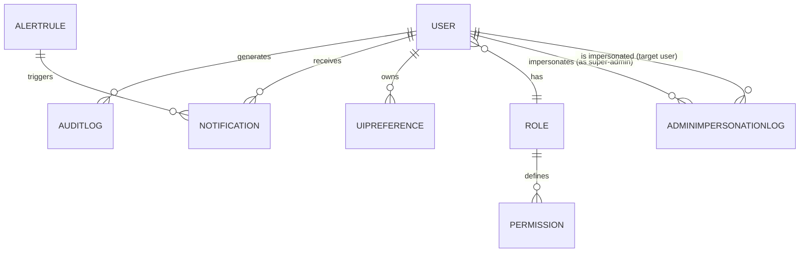

# 10bis — Back-Office Organization & UX Design

**Version:** MVP Juillet 2026  
**Status:** 🟢 Spécification en cours  
**Effort estimé:** 380-420h  
**Timeline:** Semaines 9-14 (Phase 4, 6 semaines complètes)  
**Plugin BO:** `TLS-CORE` (tout le code doit être dans ce plugin)

---

## 📖 Vue d'Ensemble

### Objectif Métier
Redesigner complètement l'interface Back-Office WordPress existante en plateforme moderne, intuitive et performante. Le BO doit être le centre de contrôle pour les administrateurs, gestionnaires de contenu et coachs, avec UX cohérente, responsive (desktop-only), et Design System unifié. L'interface doit rendre les tâches quotidiennes simples (3 clics max) et données visibles en un coup d'œil.

### Qui l'Utilise (Rôles)
- **Admin** : Accès complet à tous les modules, gestion globale (5/5 sections)
- **Content Manager** : Gestion contenu + dashboards analytics en lecture (Learning Space, Veille complet + Quality read-only)
- **Coach** : Accès utilisateurs en lecture seule (profils apprenants, coaching, crédits)
- **Ent:Manager B2B** : Pas accès BO (FO only)

### Scope — IN / OUT

#### ✅ IN (MVP Juillet)
**Architecture BO:**
- Layout système (header sticky 60px, sidebar 320px, main content fluid)
- Sidebar navigation (5 sections majeures + 20+ sous-menus hiérarchisés)
- Design System complet (couleurs, typo, spacing 8px, composants)
- Desktop-only constraint (1366px+ min, responsive warning <1024px)

**Dashboard Accueil:**
- 4x KPI cards (users, content, engagement, alerts)
- Quick actions (4 CTAs)
- Recent activities timeline (30 items, filtrable)
- Alerts grid (NPS, JAC, credits, errors)
- Upcoming events (7-day calendar)
- Shortcuts/favorites section

**Content Management:**
- Unified CRUD interface (Learning Space, Veille, Parcours)
- Tableau avec filters, search, sort, bulk actions
- Quick edit inline + preview modal + duplicate
- Status badges (draft/published/archived/blocked)
- Pagination (25/50/100)

**Users & Coaching:**
- Profils apprenants (list + detail fiche)
- Coaching (réservations, calendrier, crédits)
- Rôles & Permissions matrix
- Entreprises B2B

**Quality & Analytics:**
- Analytics dashboards (Learning + NPS)
- Alerts système (active, history, resolution)
- Logs audit (activity trail)

**Settings:**
- Référentiel (compétences, OO, missions)
- Badges (gestion + design templates)
- Branding (logo, couleurs, fonts)
- Notifications (config système)
- Integrations (webhooks, API keys)

#### ❌ OUT (Déféré)
- Dark mode (structure prête MVP, activation V1.1)
- Sidebar collapsible (icones-only pour 1024-1366px → V1.1)
- Mobile responsive (desktop-only MVP, tablet/mobile V2)
- Advanced CSV import (templates, mapping, auto-detection → V1.1)
- Real-time collaboration (multiple edits simultaneously → V2)
- Custom user dashboard (personalization → V2)

### Dépendances Critiques

**Dépend de:**
- Cahier #1 (Formation & Learning Paths) — structure contenu (Learning Space, Veille, Parcours)
- Cahier #2 (Passeport Compétences) — données apprenant + compétences pour filtres
- Cahier #3 (Onboarding & User Profile) — profils utilisateur + rôles/permissions
- Cahier #4 (Coaching & 1-1 Messaging) — données coaching + calendrier
- Cahier #5 (Gamification & Badges) — badges + XP system pour display
- Cahier #10 (Analytics & Tracking System) — métriques + dashboards + alertes

**Bloque:**
- Cahier #11bis (GDPR Compliance) — dépend structure BO pour audit logs
- Phase 14 (Consolidation) — dépend completion pour validation dev-ready

---

## 📱 Écrans à Concevoir

### Front-Office (React SPA dans TLS-CORE plugin)

| Écran | Rôle | Description | Priorité |
|-------|------|-------------|----------|
| **Header Navigation** | All | Sticky header 60px : logo TLS, global search (users/content/parcours), notifications bell (dropdown 5 items), profile dropdown (edit/logout/help/dark toggle grayed), logout button | P0 |
| **Sidebar Menu** | All | 320px fixed sidebar : 5 sections + 20+ hierarchical items, active state highlight (red bg + left border), icons (Heroicons), scrollable Y, independent scroll from content | P0 |
| **Dashboard Accueil** | Admin | KPI cards (4x: users, content, engagement, alerts), quick actions (4 CTAs), recent activities timeline (30 items, filtrable by type), alerts grid (2x2: NPS, JAC, credits, errors), upcoming events (7-day mini calendar), shortcuts/favorites | P0 |
| **Learning Space CRUD** | Content Manager, Admin | Unified table : title, format (badge), status, completion %, NPS avg, created, actions. Filters: format, status, completion range, NPS range, date range, author. Bulk actions: publish, archive, delete, duplicate, change format. Create flow: format selection modal → form → save/publish. Preview modal. Inline quick edit (title, status, tags). | P0 |
| **Veille CRUD** | Content Manager, Admin | Unified table : title, type (badge), status, published date, views, created, actions. Same CRUD pattern as Learning Space. Filters: type, status, published range, author. Bulk actions same. | P0 |
| **Parcours CRUD** | Content Manager, Admin | Parcours list CRUD (name, status, learners enrolled, completion %, created, actions). Nested pages: Étapes (drag-to-reorder, edit inline/modal, linked contents, validation rules). Projets Finaux (form: title, description, rubric, submission instructions). | P0 |
| **Masterclass/Classes Virtuelles** | Content Manager, Admin | CRUD for Masterclass + Classes Virtuelles + Événements. Table: title, type (badge), date/time, instructor, attendees count, status, actions. Filters: type, status, date range, instructor, attendee range. Bulk actions: publish, reschedule (bulk), cancel, duplicate. Create flow: event type selection → form (title, description, date, instructor, capacity, materials, recording settings) → save/publish. | P0 |
| **Profils Apprenants** | Coach, Admin, Content Manager (read) | List: avatar, name, email, status (active/inactive/archived), enrollment count, last activity date, actions (view profile, manage coaching, view analytics). Filter: status, enrollment range, last activity date. Detail fiche: avatar, profile data, enrolled parcours, completions, achievements, JAC status, coaching data, activity log. | P0 |
| **User Profile Card + Impersonation** | Super-Admin | Detailed user profile view with IMPERSONATE THIS USER button (prominent, red). Button opens confirmation modal: "Impersonate this user? Session will be logged for audit." Cancel/Confirm. On confirm: redirect to FO in impersonation mode with red fixed banner at bottom. | P0 |
| **Coaching Management** | Coach, Admin | Réservations list (date, client, status, duration, feedback), Calendrier coachs (month/week view, available slots, bookings, personal events), Gestion crédits (client list, credit balance, history, add credits bulk). | P0 |
| **Rôles & Permissions** | Admin only | Role list (Admin, Coach, Content Manager, custom roles), detail page per role showing 5-section access matrix + page-level permissions. Edit form: role name, description, permission checkboxes (dashboard, content full/read, users read, quality read, settings full/read). Preview: "As [role], user can access..." | P0 |
| **Entreprises B2B** | Admin, Content Manager (read) | Enterprise list: name, contact, collaborators count, status, created date, actions (edit, view collaborators, analytics). Detail page: company profile, collaborators management (add/edit/remove), subscription status, usage analytics, assigned coach(es). | P0 |
| **Learning Analytics Dashboard** | Admin, Content Manager | Overview cards (active learners, content views, engagement score, NPS avg). Charts: learner progress (line chart over time), content popularity (bar chart), NPS distribution (histogram). Filters: date range, content type, learner segment. Export button (PDF/CSV). | P0 |
| **Super-Admin Impersonation Audit Trail** | Super-Admin | BO admin screen showing all impersonation sessions. Columns: Super-Admin | Impersonated User | User Role | Company | Start Time | End Time | Duration | Actions Count | Validation Status | Notes. Filters: Date range, Super-Admin, User, Company. Sortable. Export CSV/PDF. Retention: 12 months (auto-delete). | P0 |
| **Onboarding Analytics Dashboard** | Admin (Platform Only) | Admin Platform dashboard aggregating onboarding metrics across all companies (segmented by Plan: Free/Pro/Enterprise + Company + Cohort). KPI cards: total questionnaires started/completed/abandoned, profile completion %, average time to complete, at-risk count (72h not started OR 2+ attempts). Charts: completion trend (line chart 30 days), distribution by status (pie chart), at-risk breakdown by plan. Filters: date range, plan type, company, cohort. Data refresh: 2 hours. Export capability (PDF/CSV). | P0 |
| **Alerts Dashboard** | Admin, Content Manager (read) | Active alerts list (type, severity, date, status, action). History of resolved alerts. Filter: type, severity, status, date range. Bulk actions: resolve, snooze, escalate. Alert detail: full context + suggested actions. | P0 |
| **Settings: Référentiel** | Admin | Manage compétences (list/CRUD), manage OO (list/CRUD), manage missions (list/CRUD). Each CRUD: table + create/edit forms. Status: active/archived. | P0 |
| **Settings: Badges** | Admin | Badge gestion (list: badge icon, name, description, trigger rule, award count, status, actions). Create/edit form (name, description, icon upload, trigger rule selector, display settings). Badge templates library (pre-made designs, colors, icons). Design preview section. | P0 |
| **Settings: Branding** | Admin | Logo upload/crop, color picker (primary, secondary, accent, neutral palette), font selection (typography samples), preview area showing how branding applies to FO/BO. Save changes to CSS variables. | P0 |
| **Settings: Notifications** | Admin | Email notification templates (learner enrolled, course started, certification earned, etc.). SMS templates (if applicable). Notification rules (who gets notified, when, what channel). Opt-in/opt-out settings per user role. | P0 |
| **Settings: Integrations** | Admin | Webhook management (list, create, edit, test, logs). API keys (list, generate, revoke, usage stats). Integration status (connected/disconnected for each external tool). | P0 |
| **Credit Management Dashboard** | Admin, Finance Manager | Overview KPI cards: total credits in system (Classic + Special), active pools, pending refunds, daily consumption rate, usage trends chart, expiration alerts (credits expiring within 30 days), top consumers list. Filters: date range, company, credit type. Export capability. | P0 |
| **Individual Learner Credit History** | Admin, Coach, Manager | Learner search/select → Detail view: current balance (Classic + Special) with visual gauge, purchases history (date, amount, source, pricing), consumption history (activity, cost, approval status), pending refunds (count + list), expiration schedule (upcoming expiry dates). Download receipt/invoice capability. | P0 |
| **Manager Approval Queue** | Manager, Admin | Queue of pending credit validation requests from learners/coaches (filtering/sorting by date, requester, service type, amount, status). Detail per request: learner name, service details (coaching date/masterclass/open badge), requested credit cost, team/pool balance, [Approve]/[Deny] actions. Approved requests auto-debit from team pool, denied requests logged with denial reason. Bulk approve/deny capability. | P0 |
| **Special Credits Management** | Admin | List of all Special Credits (grants, corporate bulk purchases, promotional awards) : company/learner, amount, origin (grant/purchase/promo), issue date, effective_until, status (active/expired/revoked), actions. Create new Special Credits grant (form: recipient type, amount, expiry date, restrictions, reason). View allocation history. Bulk issue/revoke capability. | P0 |
| **Credit Pricing Configuration** | Admin | Table of pricing rules by service : Coaching (global rate + company overrides), Masterclass (per session pricing), Open Badges (per badge pricing). Edit form per service: base price, currency, company-specific overrides, effective_date (versioning for price changes), approval notes. Preview total cost calculation. Version history (see all past pricing changes with dates). | P0 |
| **Credit Validation Workflow Configuration** | Admin | Configure per-company validation rules: auto_approve_threshold (credits ≤ X auto-approve, > X need manager approval), approval_hierarchy (single manager vs multi-level), notification rules (who gets notified for pending requests), escalation rules (if not approved within N days). Workflow templates: "Small Pool (Auto <100)", "Large Org (Multi-level)", "Custom". Edit form per template. Test validator: simulate request → see which approvers would be notified. | P0 |
| **Credit Refund Processing** | Admin | Queue of pending refund requests from learners (72-hour window for Open Badges, coaching cancellations). Detail per request: learner, service, original credit cost, requested refund amount, reason, request date, eligibility status (within window? yes/no), [Approve]/[Deny] actions with optional notes. Approved refunds: credits credited to learner account immediately, transaction logged. Bulk approve/deny. Export refund report. | P0 |
| **Credit Reconciliation Report** | Admin, Finance Manager | Automated reconciliation between credit ledger (credit_transactions table) and actual usage (coaching sessions completed, badges claimed, etc.). Report shows: expected transactions vs actual transactions, discrepancies flagged (red highlight), missing transactions, duplicate transactions. Manual reconciliation tools: [Mark as Reconciled], [Adjust for refund], [Log manual credit]. Download reconciliation report (date range, company filters). Scheduled daily/weekly auto-reconciliation. | P0 |

### Back-Office (WordPress Admin area - Minimal)

| Écran | Rôle | Description | Priorité |
|-------|------|-------------|----------|
| **WordPress Admin Login** | All | Standard WordPress login (unchanged, TLS-CORE plugin loads React SPA after auth) | P0 |
| **Plugin Activation** | Admin | TLS-CORE plugin listed, activate/deactivate, settings link (redirects to React BO) | P0 |
| **Credit Management Dashboard** | Admin | Location: /admin/credits. Content: Revenue KPIs (total revenue all-time, MRR monthly recurring, WooCommerce sync status), WooCommerce products section (CREDIT_50 €25, CREDIT_200 €80, CREDIT_500 €180 with edit/pause actions), Devis history (status, company, amount, signed_at with download/view/resend actions), Manual grants form (reason, expiration), Analytics (purchase trends, consumption patterns, refund rate). Priority: P0 | P0 |
| **WooCommerce Product Configuration** | Admin | Content: Edit CREDIT_50/200/500 (title, price €, SKU, credit amount, active/inactive toggle). Edit options change price/credit amount (impacts calculation). Webhook testing: "Test payment webhook", "Sync status". Priority: P0 | P0 |
| **Devis Management** | Admin | List all devis: company, amount, status, requested_date, signed_date. Filters: By company, by status (generated/signed/expired). Actions: Download PDF, view signature, resend link, mark as invoiced. Manual creation: Form (company, amount, recipient email). Priority: P0 | P0 |
| **Manual Credit Grant** | Super Admin Only | User/Company selector, credit amount input, credit type (classic OR special with service restrictions), expiration date picker, reason field (campaign, compensation, etc.), "Grant Credits" button, audit log of past grants. Priority: P1 | P1 |
| **Refund Management** | Support | Queue of pending refund requests (outside window). Per refund: User, service, amount, requested_at, reason, window_closed_at. Actions: "Approve" (grant credit), "Deny" (mark denied). Decision notes optional. Email template auto-sends confirmation to learner. Priority: P1 | P1 |
| **Stripe Webhook Logs** | Admin | Recent webhook events: Type, timestamp, status (success/failure/retry). Event details expandable for full payload. Retry logic: "Manual retry" button if failed. Alerts: Failed webhooks highlighted red (requires action). Priority: P1 | P1 |
| **Credit Pricing Configuration** | Admin | Global pricing table: Coaching (1 credit/session editable V2), Badge (1 credit editable), Atelier (3 credits editable), Masterclass (0 credits locked). Per-company overrides (V2 feature, visible MVP for prep). Changes logged: Audit trail of all pricing changes. Priority: P2 (deferred, MVP uses hardcoded) | P2 |
| **Role Management** | Admin only | Role list (Admin, Coach, Content Manager, custom roles). Detail page per role showing permission matrix (5 sections: Dashboard, Content, Users, Quality, Settings with checkboxes per permission + toggles per category). Create/Edit form: role name, description, permission checkboxes grouped by section, each with short description. Parent-child permission hierarchy (checking parent auto-checks children, unchecking parent auto-unchecks children). Bulk actions: assign role to multiple users at once. Delete role: confirmation modal with warning if role assigned to users ("Deleting role X will unassign it from Y users. Continue?"). Status badges: built-in roles locked (🔒 icon), custom roles editable. Feedback: success/error toasts for all operations. WooCommerce cleanup UI: identify and delete auto-created WooCommerce roles (shop_manager, customer, subscriber) with confirmation modal + database cleanup. | P0 |

---

## ⚙️ Fonctionnalités (MVP)

### Core
1. **Unified Layout System** - Header + Sidebar + Main content area with consistent styling, navigation, spacing
2. **Design System Components** - Buttons, inputs, modals, tables, cards, badges, icons, transitions (all via Tailwind + custom CSS variables)
3. **Role-Based Access Control** - Admin/Content Manager/Coach roles with fine-grained permissions (5 sections + page-level + CRUD-level)
4. **Content CRUD Operations** - Create, Read, Update, Delete, Duplicate for Learning Space, Veille, Parcours, Masterclass/Events with status workflow (draft→published→archived)
5. **Advanced Data Tables** - Filters (dropdown, range slider, date picker, multi-select), search (full-text), sort, pagination (25/50/100), bulk actions (publish, archive, delete, duplicate, batch update), inline quick edit, preview modal
6. **Dashboard Analytics** - KPI cards with trends, activities timeline (filtrable), alerts grid, upcoming events, quick shortcuts
7. **User Management** - Profils list/detail, coaching calendar, credits management, roles configuration, enterprise B2B
8. **Quality & Alerts System** - Analytics dashboards, active alerts with history, severity filtering, resolution tracking
9. **Settings Management** - Référentiel (competencies, OO, missions), badges (gestion + design templates), branding (logo, colors, fonts), notifications, integrations
10. **Global Search** - Search across users, contents, parcours with autocomplete, recent searches
11. **Notifications System** - Bell icon with dropdown (5 recent), notification center, dropdown + settings for config

### Secondary
12. **Desktop-only Responsive** - 1366px+ layouts, <1024px warning message (not truly responsive)
13. **Performance Optimization** - Virtualized tables (1000+ rows), lazy loading, pagination, real-time updates via polling 30s
14. **Activity Logging** - All admin actions logged (create, edit, delete, publish, archive) for audit trail
15. **Bulk Import Preparation** - CSV structure documented, import validation rules (V1.1 actual implementation)

---

## 🎨 Conventions BO pour Gestion des Rôles

### Layout & Structure

**Sidebar Navigation Pattern:**
- "Settings" section in main sidebar, with submenu "Roles & Permissions"
- Active state: "Settings" highlighted in sidebar, "Roles & Permissions" submenu item active
- Navigation preserves context (return to role list after editing)

**Role List Table:**
- Columns: Role Name | Description | User Count | Status (🔒 built-in or ✏️ custom) | Actions ([View] / [Edit] / [Delete])
- Sorting: By role name, user count, creation date
- Filtering: By status (built-in/custom), user count range
- Pagination: 25/50/100 per page
- Built-in roles (Admin, Coach, Content Manager) show 🔒 icon (locked, cannot delete)
- Custom roles show ✏️ icon (editable, can delete)

**Detail & Edit Pages:**
- Header: Role name + description + role status badge
- Main content: Permission matrix (5 sections as columns, permissions as rows)
- Toolbar: [Save Changes] (edit mode), [Delete Role] (red, bottom)
- Modals: Edit form, delete confirmation, bulk assign confirmation

**Modals for Actions:**
- Format: Centered modal, dark overlay, fade-in animation (~200ms)
- Confirmation: Destructive actions (delete, bulk assign) show confirmation modal with warning text + [Cancel] / [Confirm] buttons
- Success: Toast notification appears bottom-right (green, auto-dismiss 4s)
- Error: Toast notification appears bottom-right (red, manual dismiss or auto after 6s)

### Permission Matrix Display

**5-Section Structure:**
- Dashboard (KPI viewing, alerts, dashboard access)
- Content (Learning Space, Veille, Parcours management + CRUD operations)
- Users (Learner profiles, coaching, user management)
- Quality (Analytics, alerts, reporting access)
- Settings (Role configuration, integrations, system settings)

**Visual Hierarchy with Parent-Child Permissions:**
- Parent permissions displayed as bold checkboxes (e.g., "Content Full Access")
- Child permissions indented and nested below parent (e.g., "Create Content", "Edit Content", "Delete Content", "Publish Content")
- Checking parent auto-checks all children (smooth animation, ~300ms)
- Unchecking parent auto-unchecks all children with cascade feedback
- Tooltip on parent hover: "Checking this automatically enables all child permissions"
- Visual indicator for cascading: brief highlight flash on child checkboxes when parent toggled

**Checkbox & Toggle Interactions:**
- Checkboxes: For individual permissions (read/write/delete per section)
- Toggles (optional): For boolean permissions (e.g., "All content access" toggle YES/NO)
- All permissions grouped by section with short description below each: "Dashboard: View overview KPI cards and alerts"
- Each cell in matrix is a clear clickable checkbox with smooth state transitions

### Feedback & Confirmation

**Success Toast Format:**
- Position: Bottom-right corner, fixed
- Style: Green background (#10B981), white text, icon ✅
- Message template: "[Action completed count] [entity plural]. ✅" (e.g., "3 users assigned Coach role! ✅")
- Duration: Auto-dismiss after 4 seconds, or [Close] button
- Animation: Slide-in from bottom-right (~300ms)

**Destructive Action Modals (Delete, Bulk Assign):**
- Header: Action title (e.g., "Delete custom role")
- Body: Clear warning text with 🚨 icon
- For delete: "🚨 Delete custom role [NAME]? [X] users have this role. Deleting will unassign them. This action cannot be undone."
- For bulk assign: "Assign [ROLE] role to [COUNT] users? Previous roles will be overwritten."
- Footer: [Cancel] (gray) / [Confirm] (red for delete, blue for bulk assign)
- Confirmation checkbox required for sensitive actions: "I understand this action will..." (must check to enable Delete button)

**Error Toast Format:**
- Position: Bottom-right corner, fixed
- Style: Red background (#EF4444), white text, icon ❌
- Message template: "[Action failed]. [Reason]. [Retry button if applicable]"
- Example: "Failed to update role. API timeout. [Retry]"
- Duration: Manual dismiss or auto-dismiss after 6 seconds

### Status Indicators

**Built-in Role Indicator:**
- Icon: 🔒 (locked padlock)
- Meaning: Role managed by system, cannot be deleted or have critical permissions removed
- UI: Next to role name in table, grayed out appearance (slightly faded compared to custom roles)
- Actions available: [View] / [Edit with restrictions] (cannot delete)

**Custom Role Indicator:**
- Icon: ✏️ (pencil/edit icon)
- Meaning: User-created role, fully editable and deletable
- UI: Next to role name in table, normal appearance
- Actions available: [View] / [Edit] / [Delete]

**WooCommerce Role Indicator:**
- Icon: 🛒 (shopping cart)
- Meaning: Auto-created by WooCommerce plugin, not managed by TLS-CORE
- UI: Next to role name in table, grayed out (not usable in TLS-CORE)
- Status: "WooCommerce auto-created (cleanup available)"
- Actions available: [Clean Up] button or [Clean Up WooCommerce Roles] batch action

**User Count Display:**
- Format: "N users" next to each role in table
- For 0 users: Show "No users"
- Interactive: Hover to see list of users (if count < 20), or click [X users] to see full list

### Bulk Actions

**Checkboxes for Selection:**
- Header checkbox: Select all visible items (indeterminate state if partial selection)
- Row checkboxes: Individual selection, visual highlight on selection (light blue background)
- Selected rows remain highlighted until action executed or deselected

**Bulk Action Dropdown/Menu:**
- Appears after 1+ items selected
- Options: [Assign Role to Users] / [Delete Selected] (if custom roles)
- Each action shows count: "[Assign Role] (3 selected)" 
- Confirmation modal before execution (especially for destructive actions like delete)

**Feedback for Bulk Operations:**
- Loading spinner during execution (~1-3s depending on count)
- Success toast shows affected count: "3 users assigned Coach role! ✅"
- Selection state preserved until next action (allows chaining operations)
- [Clear Selection] button or auto-clear after success

### Accessibility & Desktop-Only Requirements

**Keyboard Navigation:**
- Tab through form fields and buttons (role list, permission matrix, modals)
- Enter to confirm actions, Escape to cancel modals
- Arrow keys to navigate table rows (optional enhancement V1.1)

**WCAG AA Contrast:**
- All text > 4.5:1 contrast ratio (including buttons, form labels)
- Built-in role icon 🔒 and custom role icon ✏️ have sufficient color contrast
- Green toast (#10B981 text on white) meets WCAG AA

**Labeled Form Fields:**
- All inputs have associated <label> elements (role name, description, permission checkboxes)
- Placeholder text not used as label substitute
- Error messages linked to fields with aria-invalid="true"

**Tooltips:**
- Permission descriptions appear on checkbox hover (e.g., "Dashboard: View overview KPI cards")
- Parent permission tooltip: "Checking this automatically enables all child permissions"
- WooCommerce role tooltip: "Auto-created by WooCommerce plugin, not used by TLS-CORE"

**Desktop-Only Constraint:**
- Minimum viewport width: 1366px
- <1366px: Warning banner "⚠️ Back-Office requires minimum 1366px width. Desktop view recommended."
- <1024px: Warning + reduced functionality suggestion (V2 truly responsive)
- No mobile layout (future V2+ feature)

### Performance Targets

| Operation | Target | Notes |
|-----------|--------|-------|
| Role list load | < 400ms | Includes API call + table render (50 roles max typical) |
| Permission matrix display | instant | Data cached in form state |
| Save role changes | ~1-2s | API PATCH + DB update + toast |
| Bulk assign role | ~1-3s depending on user count | API PATCH all user records in batch |
| Delete role | ~1-2s | API DELETE (soft-delete) + audit trail |
| WooCommerce cleanup | ~2-3s | API POST identifies + deletes 3 roles |
| Modal animations | ~200-300ms | Fade-in for modals, cascade highlights |
| Toast display/dismiss | 4-6s | Auto-dismiss or manual close |

---

## 🚀 Possible Évolutions (V1.1+)

### V1.1 (Août 2026)
- Dark mode activation (structure already ready MVP)
- Sidebar collapsible for 1366-1024px (icons-only mode)
- Advanced CSV import (mapping, templates, auto-detection)
- Bulk email notifications (to cohorts, segments)
- Custom user dashboard (personalization per role)

### V2 (Septembre 2026+)
- Mobile/tablet responsive design
- Real-time collaboration (multiple users editing simultaneously)
- Advanced scheduling (recurring events, time zone support)
- Custom roles builder (UI for creating new roles without code)
- Workflow automation (scheduled actions, conditional triggers)

### V3+ (2027+)
- AI-powered dashboard (auto-insights, anomaly detection)
- Advanced analytics (cohort analysis, predictive modeling)
- Plugin system (custom extensions in TLS-CORE)

---

## 👥 User Journeys (Format 3 — CRITICAL SECTION)

### User Journey #1 : Admin → Viewing Dashboard & KPI Overview

**Acteur :** Admin  
**Déclencheur :** Login successful, or click "Dashboard" from sidebar  
**Objectif :** Quickly see platform health (active users, content published, engagement, alerts) and identify urgent actions needed

#### Étapes Détaillées

1. **Admin logs in & system loads BO dashboard**
   - Sub-step 1: Browser navigates to `/bo/dashboard` (React SPA)
   - Sub-step 2: System validates JWT token (from WordPress auth)
   - Sub-step 3: System fetches KPI data from REST API (users, content, engagement, alerts counts)
   - Sub-step 4: Page renders with placeholder skeleton loading
   - Feedback: Skeleton cards appear (gray shimmer animation), layout visible in ~200ms
   - Durée: ~500ms total (including API call)

2. **Dashboard renders with live KPI cards**
   - Sub-step 1: API returns aggregated data (e.g., 1,247 active users, 312 content pieces, 78% engagement)
   - Sub-step 2: React component updates KPI values with smooth number animation (increment from 0)
   - Sub-step 3: Trend indicators display (↑ +12% green or ↓ -3% red) with color coding
   - Feedback: Cards fill with data, numbers animate up over ~300ms, colors highlight trends
   - Durée: ~300ms animation

3. **Admin scans KPI cards for alerts**
   - Sub-step 1: Admin visually scans 4 cards left→right
   - Sub-step 2: Alert card shows red "5 🔴" badge if count > 0, attention-grabbing
   - Sub-step 3: Admin notices engagement ↓ -3% (red trend) indicating possible issue
   - Feedback: Visual contrast and color make urgent items stand out immediately
   - Durée: ~5 seconds scan

4. **Admin clicks [View All Alerts] to investigate**
   - Sub-step 1: Click on alert CTA button in KPI card or Quick Actions section
   - Sub-step 2: System navigates to Alerts Dashboard page
   - Sub-step 3: Page loads with active alerts filtered (NPS < 5: 2 items, JAC pending: 5 items, etc.)
   - Feedback: Page transitions smoothly (fade in ~200ms), table populates with alert items
   - Durée: ~400ms

5. **Admin views Recent Activities timeline**
   - Sub-step 1: Scrolls down on dashboard to "Recent Activities" section
   - Sub-step 2: Sees last 30 activities (user completions, content published, coaching bookings, certifications)
   - Sub-step 3: Each item shows icon, description, timestamp (e.g., "John completed Lesson #45 → 2 hours ago")
   - Sub-step 4: Admin can filter timeline by type (All / Users / Content / Coaching)
   - Feedback: Timeline scrollable, filter toggles update list in ~100ms without page reload
   - Durée: instant (cached data)

6. **Admin reviews Upcoming Events & Takes Action**
   - Sub-step 1: Sees 7-day mini calendar with scheduled events (webinars, releases, maintenance)
   - Sub-step 2: Checks if any events need attention (e.g., maintenance window, content release scheduled)
   - Sub-step 3: Can click "View full calendar" to see detailed calendar page
   - Feedback: Calendar renders with events highlighted (colors by type), clickable items
   - Durée: instant

7. **Admin uses Quick Shortcuts to Navigate**
   - Sub-step 1: At bottom of dashboard, sees 4 quick links (Learning Space, Users, Quality Analytics, Settings)
   - Sub-step 2: Clicks [Learning Space] to jump directly to content management
   - Sub-step 3: System navigates to Learning Space CRUD page (sidebar highlights "Learning Space" active)
   - Feedback: Page transitions smoothly, sidebar active state updates immediately
   - Durée: ~300ms navigation + API data load for new page

#### Conditions de Succès ✅
- [ ] Dashboard loads in < 800ms (FCP)
- [ ] KPI cards display correct aggregated data (no stale data)
- [ ] Trend indicators (↑/↓) colored correctly (green/red)
- [ ] Alert count badge red when > 0, gray when 0
- [ ] Recent activities filter working (All/Users/Content/Coaching)
- [ ] Upcoming events calendar renders correctly (7-day view)
- [ ] Quick shortcuts link to correct pages (sidebar highlights active)
- [ ] All transitions smooth (no layout shift, no flashing)
- [ ] Mobile warning appears if viewport < 1024px
- [ ] No console errors, all API calls successful

#### Erreurs & Edge Cases ❌

**Cas 1 : Admin loads dashboard with no activities or alerts**
- Scénario: New or low-traffic platform, 0 active users, 0 recent activities, 0 alerts
- Comportement attendu:
  - KPI cards display "0" with no trend (neutral gray)
  - "Recent Activities" section shows empty state : "No activities yet"
  - "Alerts" cards show "0 items" with green checkmark ("All systems nominal")
  - "Upcoming Events" shows empty 7-day calendar with "No events scheduled"
- Feedback: Empty states clear and friendly, no confusing null values
- Impact: UX must guide admin that system is healthy (0 alerts = good), not broken

**Cas 2 : Admin loads dashboard while new alert appears (real-time)**
- Scénario: During dashboard view, another admin publishes low-NPS content in parallel
- Comportement attendu:
  - Alert grid updates (via polling 30s or WebSocket if enabled)
  - "NPS < 5" card count increases from 2 to 3
  - Alert badge number changes (red color maintained)
  - No page reload, smooth update in place
- Feedback: Admin sees updated count gently transition (number animation)
- Impact: Ensures data freshness without jarring page reloads

**Cas 3 : Admin network connection slow/unstable**
- Scénario: KPI API call takes >2s or fails mid-request
- Comportement attendu:
  - Skeleton loaders remain visible until data arrives
  - If timeout (>3s), show fallback message: "Unable to load KPIs, please refresh"
  - [Refresh] button available to retry
  - Sidebar/header still responsive (independent from data load)
- Feedback: No frozen UI, admin can still navigate to other pages
- Impact: Graceful degradation, app remains usable

**Cas 4 : Admin lacks permission for one of 5 KPI sections**
- Scénario: Content Manager viewing dashboard (should not see "Management Alerts" or "System Errors")
- Comportement attendu:
  - Only visible KPI cards render (depends on role permissions)
  - Alert grid shows only permitted categories
  - Quick actions show only permitted CTAs (no [Export Analytics] if read-only)
- Feedback: No "Permission Denied" error, just graceful hiding of restricted content
- Impact: UX consistent per role, no confusion about missing features

**Cas 5 : Admin viewing dashboard on very old browser (IE11 equivalent)**
- Scénario: JavaScript ES6 features not supported
- Comportement attendu:
  - Fallback: "Browser not supported, please use Chrome/Firefox/Safari latest"
  - Or: Graceful fallback to server-rendered HTML version (fallback table view)
- Feedback: Clear message or working minimal version
- Impact: Ensure accessibility/graceful degradation (MVP targets modern browsers only)

---

### User Journey #2 : Content Manager → Creating & Publishing Learning Content

**Acteur :** Content Manager  
**Déclencheur :** Click [+ Create Learning Content] from Dashboard quick actions OR [+ Create] button on Learning Space page  
**Objectif :** Quickly create, draft, preview, and publish new lesson/masterclass/exercise with proper metadata and validation

#### Étapes Détaillées

1. **Content Manager navigates to Learning Space CRUD page**
   - Sub-step 1: From Dashboard, click [+ Create Learning Content] CTA
   - Sub-step 2: OR click "Learning Space" in sidebar → system navigates to Learning Space list page
   - Sub-step 3: Table renders with existing content (title, format, status, completion %, NPS, created, actions)
   - Feedback: Page loads in ~600ms, table visible with scrollbar if 100+ items
   - Durée: ~600ms (API fetch + table render)

2. **Content Manager clicks [+ Create] button to start new content**
   - Sub-step 1: On Learning Space page, click red [+ Create] button (top-right of toolbar)
   - Sub-step 2: Modal opens: "Choose Content Format" with 6 options (Leçon, Masterclass, Exercice Jalon, Micro-Learning, Classes Virtuelles, Événement)
   - Sub-step 3: Each option shows icon + description (e.g., "Masterclass: Interactive live/recorded training session")
   - Feedback: Modal appears with fade-in animation (~200ms), centered on screen with dark overlay
   - Durée: instant

3. **Content Manager selects content format**
   - Sub-step 1: Manager hovers over "Leçon" option (background lightens)
   - Sub-step 2: Manager clicks "Leçon"
   - Sub-step 3: Modal closes, create form appears (or new page depending on complexity)
   - Feedback: Selected option highlighted briefly, smooth transition to form
   - Durée: ~300ms

4. **Content Manager fills create form with metadata**
   - Sub-step 1: Form displays fields: title, description (rich text), content (rich text editor), tags, category, difficulty level, estimated duration, learning objectives
   - Sub-step 2: Manager enters title "Agile Methodology 101"
   - Sub-step 3: Manager enters description "Introduction to Agile principles and practices"
   - Sub-step 4: Manager adds content using rich text editor (text, images, videos, embeds)
   - Sub-step 5: Manager selects tags (multi-select: "Agile", "Project Management", "Leadership") from autocomplete
   - Sub-step 6: Manager sets difficulty "Intermédiaire", duration "45 minutes"
   - Feedback: Form validates in real-time (title required = red border if empty, character count for description), autocomplete suggests existing tags
   - Durée: ~5-10 minutes (user action)

5. **Content Manager previews content before publishing**
   - Sub-step 1: Click [Preview] button in form (bottom toolbar)
   - Sub-step 2: Preview modal opens showing how learner will see content (responsive preview)
   - Sub-step 3: Shows title, description, content preview, CTAs ("Enroll", "Start Learning")
   - Sub-step 4: Manager can scroll/interact to verify layout and content correctness
   - Feedback: Modal shows clean preview layout matching FO design, all elements rendered
   - Durée: instant (modal render)

6. **Content Manager saves as draft or publishes**
   - Sub-step 1: Manager clicks [Save as Draft] to save without publishing
   - Sub-step 2: OR clicks [Publish Immediately] to save and set status to "published"
   - Sub-step 3: Form submits via REST API (POST /api/learning-content with payload: title, description, content, tags, etc.)
   - Sub-step 4: API validates data (required fields, max lengths, image sizes if embedded)
   - Sub-step 5: API returns 201 Created with new content ID
   - Sub-step 6: UI updates: success toast "Content published! ✅" (green, auto-dismiss 4s)
   - Feedback: Loading spinner in button during submission (~1-2s), then toast appears
   - Durée: ~2 seconds total

7. **Content Manager is returned to Learning Space list**
   - Sub-step 1: After publish success, modal closes and list page reloads with new content visible
   - Sub-step 2: New content appears at top of table with status "published" (green badge), created date = today
   - Sub-step 3: Manager can immediately edit/preview/duplicate/archive using inline actions
   - Feedback: New row highlights briefly (yellow background) to draw attention, then fades
   - Durée: ~400ms (list reload + highlight animation)

#### Conditions de Succès ✅
- [ ] Create form validates required fields (title, content)
- [ ] Rich text editor works (text, formatting, image upload, embeds)
- [ ] Tag autocomplete suggests existing tags + allows new
- [ ] Preview modal renders content correctly (responsive)
- [ ] Save as Draft creates content with status "draft"
- [ ] Publish Immediately creates with status "published" and triggers notifications
- [ ] API returns 201/success, handles validation errors gracefully
- [ ] Success toast appears and auto-dismisses after 4s
- [ ] New content appears in list immediately (no page reload needed if using client-side cache update)
- [ ] Content ID persists for future edits
- [ ] All required metadata fields validated before submit

#### Erreurs & Edge Cases ❌

**Cas 1 : Content Manager tries to publish without title**
- Scénario: Manager clicks [Publish] with empty title field
- Comportement attendu:
  - Form validation triggers: title field border turns red, error message appears below field "Title is required"
  - Submit button disabled (grayed out)
  - No API call made
- Feedback: Clear error message, user can correct immediately
- Impact: Prevents invalid data in database

**Cas 2 : Content Manager uploads very large image (>10MB)**
- Scénario: During rich text editing, manager tries to embed a large video/image
- Comportement attendu:
  - File size validation in browser (before upload)
  - Error message: "File too large (max 10MB). Please compress or reduce resolution."
  - No submission to API
- Feedback: User gets instant feedback without waiting for server error
- Impact: Better UX, prevents timeouts

**Cas 3 : Content Manager's session expires during form edit**
- Scénario: Manager editing form for 1+ hour, JWT token expires (15min auto-logout)
- Comportement attendu:
  - User tries to submit form, API returns 401 Unauthorized
  - Modal/toast appears: "Session expired, please login again"
  - [Login again] button in modal
  - Form data lost (or: saved to browser localStorage for recovery → V1.1)
- Feedback: Clear message with action to re-authenticate
- Impact: Security maintained, UX acceptable

**Cas 4 : Content Manager duplicates content, changes only title**
- Scénario: Manager wants quick copy of existing lesson with new title
- Comportement attendu:
  - Click [Duplicate] on existing content in list
  - Modal: "Duplicate as: ( ) Same title + copy, ( ) New title: [_]"
  - Manager selects "New title", enters "Agile 102 - Advanced"
  - System creates copy with new title, status = draft, created_by = current admin
  - New content appears in list, original unchanged
- Feedback: Duplicate confirmation, new item highlighted
- Impact: Saves time for content reuse

**Cas 5 : Two Content Managers try to edit same content simultaneously**
- Scénario: Manager A opens edit form for Lesson X, Manager B opens same form at same time
- Comportement attendu:
  - Manager A submits changes first (updates title to "New Title")
  - Manager B submits changes (title field had different value)
  - API detects conflict: returns 409 Conflict + last_modified_at timestamp
  - Manager B sees error: "Content was modified by another user (Sarah at 2:30pm). Your changes were not saved. [Reload] to see latest version."
- Feedback: Clear conflict message, option to reload and re-apply changes
- Impact: Prevents last-write-wins data loss (optimistic locking)

---

### User Journey #3 : Content Manager → Bulk Managing Veille Content (Filter, Search, Bulk Actions)

**Acteur :** Content Manager (specialized in Veille/Watch/News curation)  
**Déclencheur :** Click "Veille" in sidebar, or navigate to Veille list page  
**Objectif :** Quickly manage 100+ news articles/magazines/dossiers with filtering, bulk publishing/archiving, status changes, and metadata updates

#### Étapes Détaillées

1. **Content Manager navigates to Veille management page**
   - Sub-step 1: Click "Veille" in sidebar under "Content Management"
   - Sub-step 2: System navigates to /bo/veille
   - Sub-step 3: Page loads with list of 347 veille items
   - Sub-step 4: Table visible with columns: checkbox, title (link), type (badge), status (badge), published date, views, created, actions
   - Feedback: Page loads in ~700ms, table shows first 25 items (pagination control visible)
   - Durée: ~700ms

2. **Content Manager applies filters to narrow content**
   - Sub-step 1: Clicks [Filters] button (near top of table)
   - Sub-step 2: Filter panel expands: Type (multi-select: Acta, Mag, Dossier, Tuto), Status (draft/published/archived), Published date range (date picker), Author (dropdown)
   - Sub-step 3: Manager selects Type = "Acta" (checks checkbox)
   - Sub-step 4: Manager selects Status = "draft"
   - Sub-step 5: Manager clicks [Apply Filters]
   - Sub-step 6: Table updates to show only draft Acta items (e.g., 23 items instead of 347)
   - Feedback: Filter panel collapses, table re-renders in ~300ms, showing "23 results for: Type=Acta, Status=draft"
   - Durée: ~300ms (filter API call)

3. **Content Manager searches within filtered results**
   - Sub-step 1: Manager uses [Search] input box (top of table) to find specific articles
   - Sub-step 2: Manager types "AI trends" in search
   - Sub-step 3: Table filters in real-time (full-text search across title, description)
   - Sub-step 4: Results narrow to 5 matching articles (e.g., "AI Trends 2026", "AI in Healthcare", etc.)
   - Feedback: Search input shows loading spinner while searching (~200ms), then results update
   - Durée: ~200ms

4. **Content Manager sorts table results**
   - Sub-step 1: Manager clicks on "Published Date" column header
   - Sub-step 2: Table sorts ascending (oldest first), arrow indicator shows in header
   - Sub-step 3: Manager clicks again to sort descending (newest first)
   - Feedback: Rows re-order smoothly (no page reload), sort indicator arrow toggles
   - Durée: ~100ms

5. **Content Manager selects multiple items for bulk action**
   - Sub-step 1: Manager clicks checkbox in header row (select all visible items)
   - Sub-step 2: All 5 visible rows checkboxes checked, header checkbox shows indeterminate state
   - Sub-step 3: Manager can also individual-select specific rows (click row checkbox)
   - Feedback: Selected rows highlight with light blue background, checkbox visual feedback clear
   - Durée: instant

6. **Content Manager executes bulk action (Publish All Selected)**
   - Sub-step 1: After selecting items, [Bulk Actions ▼] dropdown appears (or toolbar with action buttons)
   - Sub-step 2: Manager clicks [Publish Selected] (from dropdown or toolbar button)
   - Sub-step 3: Confirmation modal: "Publish 3 articles? This action cannot be undone."
   - Sub-step 4: Manager clicks [Confirm]
   - Sub-step 5: API call: PATCH /api/veille/bulk with action=publish, ids=[...]
   - Sub-step 6: System updates all 3 items status to "published" in database
   - Sub-step 7: Success toast: "3 articles published! ✅"
   - Feedback: Rows update immediately (status badges change to green "published"), rows remain selected briefly before deselecting
   - Durée: ~1-2 seconds total (API + UI update)

7. **Content Manager uses pagination to view more items**
   - Sub-step 1: After viewing first 25 items, clicks [Next] or clicks page "2" in pagination
   - Sub-step 2: Table refreshes with items 26-50
   - Sub-step 3: Filters and search state preserved (still showing draft Acta)
   - Feedback: Smooth page transition, pagination controls update to show current page highlighted
   - Durée: ~400ms (API call + render)

#### Conditions de Succès ✅
- [ ] Filter panel opens/closes smoothly, all filter types work (multi-select, date range, dropdown)
- [ ] Filters apply correctly, result count updates
- [ ] Search works full-text across title/description
- [ ] Sort toggles ascending/descending, arrow indicator clear
- [ ] Select all/individual select works, visual feedback clear (highlight)
- [ ] Bulk action dropdown shows relevant actions (publish, archive, delete, duplicate)
- [ ] Confirmation modal appears before destructive bulk actions
- [ ] Bulk action updates all selected items in ~1-2s
- [ ] Success toast shows count published (e.g., "3 articles published")
- [ ] Rows update immediately (status badges change)
- [ ] Pagination preserves filter/search state
- [ ] Table performance acceptable (1000+ items with virtual scrolling)

#### Erreurs & Edge Cases ❌

**Cas 1 : Content Manager tries to bulk delete published content**
- Scénario: Manager selects 5 published articles, clicks [Delete Selected]
- Comportement attendu:
  - Confirmation modal with strong warning: "🚨 Delete 5 published articles? This will remove them permanently and break existing links. Continue?"
  - [Cancel] / [Delete Permanently] buttons
  - If confirmed, soft-delete (archive) instead of hard-delete (preserve audit trail)
- Feedback: High-friction confirmation (red button, warning icon)
- Impact: Prevents accidental data loss

**Cas 2 : Content Manager applies filters, gets 0 results**
- Scénario: Filters to Type="Mag" + Status="published" + Date range "Jan 2024", gets 0 results
- Comportement attendu:
  - Empty state message: "No Magazines published in Jan 2024. Try changing filters or dates."
  - [Clear Filters] button to reset
- Feedback: Clear empty state, friendly suggestion
- Impact: UX guides user to correct action

**Cas 3 : Pagination shows item 1-25 of 347, but new content published mid-browse**
- Scénario: Manager on page 2 (items 26-50), another manager publishes new article in real-time
- Comportement attendu:
  - Total count updates (347 → 348), but current page data unchanged
  - OR: Background polling updates total, notification badge if new item matches current filter
  - No automatic reload (non-disruptive)
- Feedback: Badge or subtle notification if new data available
- Impact: Data freshness without jarring page reloads

**Cas 4 : Content Manager tries to archive/delete while item is being edited**
- Scénario: Manager A has item open in detail/edit page, Manager B bulk-selects and archives same item
- Comportement attendu:
  - Manager B's bulk action succeeds (item archived)
  - Manager A's edit page shows warning: "This item was archived. Your changes will not be saved if you submit."
  - OR: Edit form disables submit with message "Item no longer available for editing"
- Feedback: Clear warning, no silent failures
- Impact: Prevents confusion from concurrent edits

**Cas 5 : Search timeout or API error during bulk operation**
- Scénario: Bulk publish API call fails (timeout, 500 error)
- Comportement attendu:
  - Error toast: "Failed to publish 3 articles. Please try again."
  - Rows remain selected (not deselected)
  - [Retry] button in toast, or [Bulk Actions ▼] available again for retry
- Feedback: Clear error message, preserves selection for easy retry
- Impact: User not lost, can retry without re-selecting

---

### User Journey #4 : Admin → Reviewing Analytics Dashboard & Setting Alerts

**Acteur :** Admin (wants to monitor platform health via dashboards)  
**Déclencheur :** Click "Quality & Analytics" sidebar section, then "Analytics" or "Alerts"  
**Objectif :** View learning analytics (learner progress, content performance, engagement), identify low-NPS content, and manage system alerts

#### Étapes Détaillées

1. **Admin navigates to Quality & Analytics section**
   - Sub-step 1: Click "Quality & Analytics" in sidebar
   - Sub-step 2: Sub-menu expands showing "Dashboards Quality" and "Alerts Système"
   - Sub-step 3: Admin clicks "Learning Analytics" (or "Analytics" dashboard)
   - Sub-step 4: Page navigates to /bo/analytics/learning
   - Feedback: Sidebar "Quality & Analytics" highlights active, submenu item active
   - Durée: ~300ms navigation

2. **Analytics dashboard loads with KPI cards & charts**
   - Sub-step 1: Page displays top section: overview cards (active learners, content views, engagement score, NPS avg)
   - Sub-step 2: Charts render below: learner progress line chart (trending over 30 days), content popularity bar chart (top 10 contents), NPS distribution histogram
   - Sub-step 3: Charts load with smooth animations (bars grow, lines draw)
   - Feedback: Cards + charts visible in ~800ms, data loads with skeleton then fills
   - Durée: ~800ms

3. **Admin applies date range filter to focus analysis**
   - Sub-step 1: Sees [Date Range Picker] at top of page (default: Last 30 days)
   - Sub-step 2: Admin clicks date picker, selects "Last 7 days"
   - Sub-step 3: All charts & cards update to show data for last 7 days only
   - Feedback: Charts re-render with new data in ~400ms, animations play
   - Durée: ~400ms

4. **Admin filters by learner segment to drill down**
   - Sub-step 1: Sees [Filter by Segment] dropdown: "All Learners", "Active", "At-Risk", "High Performers"
   - Sub-step 2: Admin selects "At-Risk" (learners with <40% completion or no activity in 7 days)
   - Sub-step 3: Charts update to show only at-risk cohort analytics
   - Feedback: Segment name displays below filter, cards update with filtered metrics
   - Durée: ~400ms

5. **Admin notices low-NPS content and wants to investigate**
   - Sub-step 1: In "NPS Distribution" histogram, sees a bar for NPS 1-3 (low satisfaction) with count "12 responses"
   - Sub-step 2: Admin hovers over bar, tooltip shows "12 responses, avg NPS 2.5, from 3 contents"
   - Sub-step 3: Admin clicks on bar to drill down
   - Sub-step 4: Page navigates to detail view: "Contents with Low NPS (1-3)" table
   - Feedback: Tooltip appears on hover, click navigates smoothly
   - Durée: instant (hover) + ~300ms (navigation)

6. **Admin reviews low-NPS contents list**
   - Sub-step 1: Table shows contents sorted by NPS: "React Hooks Lesson" (NPS 2.3), "AI Fundamentals" (NPS 2.8), etc.
   - Sub-step 2: Each row shows: title, NPS avg, response count, completion %, learner feedback summary (if available)
   - Sub-step 3: Admin can click [View Feedback] to see learner comments
   - Sub-step 4: Admin can click [Edit Content] to make improvements
   - Feedback: Table loads in ~400ms, actions are clickable links
   - Durée: ~400ms

7. **Admin creates alert rule for NPS monitoring**
   - Sub-step 1: Admin navigates to "Alerts Système" section (sidebar)
   - Sub-step 2: Sees list of active alerts + option to [+ Create Alert Rule]
   - Sub-step 3: Clicks [+ Create Alert Rule]
   - Sub-step 4: Modal/form appears: "Create Alert"
   - Sub-step 5: Admin fills: Alert name "Low NPS Content", Condition "Content NPS < 4", Threshold "any content", Notification "Email to admin@tls.com"
   - Sub-step 6: Admin clicks [Save Alert]
   - Sub-step 7: API creates alert rule in database, starts monitoring in real-time
   - Feedback: Form validates, success toast "Alert created! You'll be notified when NPS drops below 4."
   - Durée: ~1 second

#### Conditions de Succès ✅
- [ ] Analytics dashboard loads in < 800ms (FCP)
- [ ] KPI cards display correct aggregated metrics (active learners, views, engagement, NPS)
- [ ] Charts render with smooth animations (no layout shift)
- [ ] Date range filter updates all charts in ~400ms
- [ ] Learner segment filter working (At-Risk, High Performers, etc.)
- [ ] Drill-down to low-NPS contents works (table populated)
- [ ] Feedback view shows learner comments (if available)
- [ ] Alert rule creation form validates & creates alert
- [ ] Alert rule starts monitoring immediately (mock or real)
- [ ] No console errors, all API calls successful

#### Erreurs & Edge Cases ❌

**Cas 1 : No data available for selected date range**
- Scénario: Admin selects "Last 24 hours", platform had no activity (night time)
- Comportement attendu:
  - Cards show "—" or "0" (neutral)
  - Charts appear empty or show "No data for selected period"
  - [Expand date range] suggestion
- Feedback: Clear empty state, actionable suggestion
- Impact: UX guides admin to meaningful data

**Cas 2 : At-Risk segment has only 3 learners (very small cohort)**
- Scénario: Admin filters by At-Risk, only 3 learners match
- Comportement attendu:
  - Cards show small numbers (3 active, 1 completion, etc.)
  - Charts may be sparse/empty (small dataset)
  - Warning: "Small cohort (3 learners). Charts may not be meaningful."
- Feedback: Statistical significance warning
- Impact: Prevents misinterpretation of small-sample data

**Cas 3 : Admin tries to create alert rule with too-broad condition**
- Scénario: Admin creates alert "All NPS changes" with no specific threshold
- Comportement attendu:
  - Form validation: "Threshold required. Please specify: NPS < X, NPS drop > Y%, etc."
  - Submit button disabled
- Feedback: Clear validation error
- Impact: Prevents alert spam/noise

**Cas 4 : Performance issue: 50,000+ data points to chart**
- Scénario: Admin selects "Last year" date range for engagement chart (50k+ daily records)
- Comportement attendu:
  - System aggregates data (daily or weekly bucketing, not hourly)
  - Chart renders with ~30-52 data points (not 365+)
  - OR: Show "Data aggregated to weekly view (365+ days selected)"
- Feedback: Aggregation is transparent, chart remains responsive
- Impact: Performance acceptable even with large time ranges

**Cas 5 : Export analytics data for external analysis**
- Scénario: Admin clicks [Export CSV] on analytics dashboard
- Comportement attendu:
  - Modal/form: "Export Options: Period [date range], Metrics [checkboxes for which metrics], Format [CSV/Excel]"
  - Admin selects options and clicks [Export]
  - File downloads (e.g., "analytics-2024-05.csv")
- Feedback: File download initiated, success message in browser
- Impact: Admin can analyze in Excel, share with stakeholders

---

### User Journey #5 : Super-Admin → Impersonate User & Explore FO in Their Role

**Acteur :** Super-Admin (highest privilege user, e.g., founder/director)  
**Déclencheur :** Navigate to user profile card, click "Impersonate this user" button OR search for user in BO  
**Objectif :** Temporarily access FO as another user (to debug issues, test features, understand user experience) with full audit trail for compliance

#### Étapes Détaillées

1. **Super-Admin navigates to Profils Apprenants section**
   - Sub-step 1: Click "Users & Coaching" in sidebar → "Profils Apprenants"
   - Sub-step 2: System navigates to /bo/users/learners
   - Sub-step 3: Table loads with list of 500+ learners (filterable, searchable)
   - Feedback: Page loads in ~600ms, table visible with skeleton loading animation
   - Durée: ~600ms

2. **Super-Admin searches for specific user to impersonate**
   - Sub-step 1: Super-admin uses search box (top of table) to find user "John Smith"
   - Sub-step 2: Type "John Smith" in search → table filters in real-time
   - Sub-step 3: Results narrow to 3 matching users (full-text search on name + email)
   - Feedback: Search input shows loading spinner (~200ms), then results update
   - Durée: ~200ms

3. **Super-Admin clicks on user profile card to view full details**
   - Sub-step 1: Super-admin clicks on "John Smith" row (or [View Profile] button)
   - Sub-step 2: System navigates to /bo/users/{user_id}/profile or opens detail modal
   - Sub-step 3: Profile card displays: avatar, name, email, role (Apprenant), company, status, enrollment count, last activity, JAC status
   - Feedback: Profile page/modal loads in ~300ms, all user data visible
   - Durée: ~300ms

4. **Super-Admin notices [Impersonate This User] button and clicks it**
   - Sub-step 1: At top/bottom of profile card, Super-admin sees prominent red button: "[🔴 IMPERSONATE THIS USER]"
   - Sub-step 2: Super-admin clicks button
   - Sub-step 3: Confirmation modal appears: "Impersonate this user? Session will be logged for audit. [Cancel] / [Confirm Impersonation]"
   - Feedback: Modal appears with smooth fade-in (~200ms), red warning styling
   - Durée: instant

5. **Super-Admin confirms impersonation in modal**
   - Sub-step 1: Super-admin reads warning and clicks [Confirm Impersonation]
   - Sub-step 2: System creates admin_impersonation_logs entry (session_start = now, impersonated_user_id = John's ID, super_admin_id = current user)
   - Sub-step 3: System generates temporary session token for John's role + company scope
   - Sub-step 4: FO React app loads, but user context = "John Smith" (Apprenant role, John's company)
   - Feedback: Page redirects smoothly to FO (/fo/dashboard), modal closes
   - Durée: ~1-2 seconds (session creation + redirect)

6. **Super-Admin sees red banner confirming impersonation mode**
   - Sub-step 1: FO dashboard loads normally (as John would see it)
   - Sub-step 2: Red fixed banner appears at bottom of screen: "[🔴] IMPERSONATION MODE: You are viewing as [John Smith]. All actions are logged. [Exit Impersonation]"
   - Sub-step 3: Banner includes exit button (red background, white text, always visible)
   - Feedback: Banner appears smoothly, doesn't obscure content (bottom-fixed), visible on all pages
   - Durée: instant

7. **Super-Admin explores FO as John to understand experience**
   - Sub-step 1: Super-admin navigates FO pages (Learning Space, Passeport, Coaching, etc.) as John
   - Sub-step 2: All pages render as they would for John (scoped to John's company, parcours, competencies)
   - Sub-step 3: Every action logged: page views, clicks, form submissions, API calls all recorded in admin_impersonation_logs.actions_count
   - Sub-step 4: Super-admin can view John's data, completed modules, profile, etc.
   - Feedback: FO works normally, banner remains visible, no special indicators (just red banner)
   - Durée: user-driven (Super-admin exploration time)

8. **Super-Admin exits impersonation mode by clicking banner button**
   - Sub-step 1: Super-admin clicks [Exit Impersonation] button in red banner
   - Sub-step 2: Confirmation modal: "Exit impersonation? You will be returned to BO as [Super-Admin]"
   - Sub-step 3: Super-admin clicks [Exit]
   - Sub-step 4: System updates admin_impersonation_logs: session_end = now, actions_count = calculated (e.g., 23 actions)
   - Sub-step 5: System invalidates John's session token, returns to BO
   - Sub-step 6: System navigates back to /bo/users/{user_id}/profile (where impersonation started)
   - Feedback: Modal confirms exit, redirect back to BO happens smoothly (~500ms)
   - Durée: ~1 second

#### Conditions de Succès ✅
- [ ] User search filters correctly (full-text on name/email)
- [ ] [Impersonate This User] button visible on profile card
- [ ] Confirmation modal appears with clear warning text
- [ ] Impersonation session created successfully in admin_impersonation_logs table
- [ ] FO loads correctly scoped to impersonated user's role + company
- [ ] Red banner visible on all FO pages during impersonation
- [ ] All user actions tracked in actions_count field (page views, clicks, submissions)
- [ ] [Exit Impersonation] button functional, exits cleanly back to BO
- [ ] Session end timestamp recorded in admin_impersonation_logs
- [ ] No console errors, no data leaks (impersonated user's data isolated by company_id)
- [ ] Super-Admin can only impersonate within their own company/organization

#### Erreurs & Edge Cases ❌

**Cas 1 : Super-Admin tries to impersonate another Super-Admin or Admin**
- Scénario: Super-admin clicks "Impersonate This User" on an Admin user
- Comportement attendu:
  - Modal shows: "⚠️ Cannot impersonate admin-level users. Impersonation is limited to Coaches, Managers, and Learners for security reasons."
  - [Impersonate] button disabled or hidden for admin-level roles
  - Audit log still records the attempted impersonation (for security audit)
- Feedback: Clear warning, button unavailable
- Impact: Prevents privilege escalation bugs

**Cas 2 : Super-Admin's session expires during impersonation**
- Scénario: Super-admin impersonating John, John's session active, but super-admin's own JWT expires (15min auto-logout)
- Comportement attendu:
  - Red banner changes to: "⚠️ Your session expired. Click here to re-authenticate."
  - Super-admin clicks, redirected to login
  - admin_impersonation_logs auto-updates: session_end = logout time
  - John's impersonated session invalidated (cannot continue impersonating)
- Feedback: Clear warning, option to re-auth
- Impact: Session security maintained

**Cas 3 : Super-Admin tries to impersonate user from different company**
- Scénario: Multi-tenant system, Super-Admin from Company A tries to impersonate user from Company B
- Comportement attendu:
  - [Impersonate] button disabled with message: "User is from a different company. Impersonation limited to your company's users."
  - No impersonation allowed (data isolation enforced)
- Feedback: Clear permission message
- Impact: Multi-tenancy security maintained

**Cas 4 : Multiple simultaneous impersonations (edge case)**
- Scénario: Super-admin opens 2 browser tabs/windows, impersonates User A in tab1, User B in tab2
- Comportement attendu:
  - Each tab/session maintains separate context (separate JWT tokens)
  - Each impersonation recorded separately in admin_impersonation_logs
  - When exiting in tab1, only tab1's session ends (tab2 continues)
  - OR: System prevents multiple simultaneous impersonations → error: "You already have an active impersonation. Exit current session first."
- Feedback: Clear behavior (either allow parallel or show error)
- Impact: Prevents confusion about which user context is active

**Cas 5 : Impersonated user logs in simultaneously**
- Scénario: Super-admin impersonating John, but John also logs in from another device at the same time
- Comportement attendu:
  - John's real session invalidated (only one active session per user allowed)
  - OR: Both sessions allowed but tagged differently (real vs impersonated)
  - admin_impersonation_logs notes: "John logged in while impersonation active"
  - Super-admin sees warning: "User just logged in. Impersonation may see stale data."
- Feedback: Clear notification
- Impact: Data consistency maintained

---

### User Journey #6 : Admin → Manage Roles & Permissions

**Acteur :** Admin (wants to configure role-based access control for team members)  
**Déclencheur :** Click "Settings" in sidebar → "Roles & Permissions" OR click [Rôles & Permissions] from dashboard  
**Objectif :** Create, view, edit, and manage roles with permission matrices; assign roles to users; understand permission hierarchy (parent permissions auto-check/uncheck children)

#### Étapes Détaillées

1. **Admin navigates to Settings → Roles & Permissions**
   - Sub-step 1: Click "Settings" in sidebar
   - Sub-step 2: Submenu expands with options (Référentiel, Badges, Branding, Notifications, Integrations, Roles & Permissions)
   - Sub-step 3: Admin clicks "Roles & Permissions"
   - Sub-step 4: System navigates to /bo/settings/roles
   - Feedback: Sidebar highlights "Settings" active, submenu visible, page loads in ~400ms
   - Durée: ~400ms

2. **Admin views role list with existing roles and custom roles**
   - Sub-step 1: Page displays table of roles: Admin, Coach, Content Manager, custom roles (if any)
   - Sub-step 2: Each row shows: role name, description, user count (how many users have role), status (built-in 🔒 or custom ✏️), actions (view, edit, delete)
   - Sub-step 3: Built-in roles (Admin, Coach, Content Manager) locked with 🔒 icon (cannot delete)
   - Sub-step 4: Custom roles show ✏️ icon (editable), delete option available
   - Feedback: Table loads in ~300ms, roles clearly labeled as built-in vs custom
   - Durée: ~300ms

3. **Admin clicks on a role to view permission matrix**
   - Sub-step 1: Admin clicks on "Coach" role row (or [View] button)
   - Sub-step 2: Detail page opens showing permission matrix for Coach role
   - Sub-step 3: Matrix displays as tableau with 5 sections (Dashboard, Content, Users, Quality, Settings) as columns, permissions as rows
   - Sub-step 4: Each cell shows checkbox (checked/unchecked) for permission status
   - Sub-step 5: Permissions grouped by section with descriptions: "Dashboard: View overview stats", "Content: Read-only access to Learning Space & Veille", "Users: View learner profiles", "Quality: View analytics dashboards (read-only)", "Settings: No access"
   - Feedback: Page renders permission matrix clearly, visual hierarchy of permissions visible
   - Durée: ~200ms

4. **Admin explores parent-child permission hierarchy**
   - Sub-step 1: In Content section, Admin sees "Content Full Access" checkbox (parent) with sub-permissions: "Create Content", "Edit Content", "Delete Content", "Publish Content" (children, indented visually)
   - Sub-step 2: Admin hovers over "Content Full Access" → tooltip explains "Checking this automatically enables all child permissions. Unchecking disables all children."
   - Sub-step 3: Admin clicks to check "Content Full Access"
   - Sub-step 4: All child permissions auto-check (smooth animation, ~300ms)
   - Sub-step 5: Admin unchecks "Content Full Access"
   - Sub-step 6: All children auto-uncheck
   - Feedback: Hierarchy visual hierarchy clear (nesting with indentation), auto-check behavior instant and smooth
   - Durée: ~300ms per action

5. **Admin edits a custom role (changes permissions)**
   - Sub-step 1: Admin clicks [Edit] on custom role "Content Manager v2"
   - Sub-step 2: Form loads with same matrix layout (editable, not read-only)
   - Sub-step 3: Admin modifies permissions: checks "Users: Read Only", unchecks "Quality: Read Access"
   - Sub-step 4: Admin clicks [Save Changes]
   - Sub-step 5: API PATCH /api/roles/{role_id} with payload: { permissions_json: {...updated} }
   - Sub-step 6: API validates and updates role in database
   - Sub-step 7: Success toast: "Role updated! ✅" (auto-dismiss 4s)
   - Feedback: Form validates in real-time, success toast confirms save
   - Durée: ~1-2 seconds

6. **Admin bulk assigns a role to multiple users**
   - Sub-step 1: From role detail page, Admin scrolls to "Users with this role" section (list of 12 users: John, Sarah, etc.)
   - Sub-step 2: Admin clicks [Assign Role to Users] button
   - Sub-step 3: Modal opens: "Assign [Coach] role to users"
   - Sub-step 4: User search/select input → Admin types/selects 3 users to add (Lisa, Mike, Emma)
   - Sub-step 5: Admin clicks [Add Users]
   - Sub-step 6: Modal shows confirmation: "Assign Coach role to 3 users? Previous roles will be overwritten."
   - Sub-step 7: Admin clicks [Confirm]
   - Sub-step 8: API POST /api/roles/{role_id}/assign-users with payload: { user_ids: [...] }
   - Sub-step 9: Success toast: "3 users assigned Coach role! ✅"
   - Feedback: Modal smooth, confirmation required for bulk operation, toast shows count
   - Durée: ~2 seconds

7. **Admin deletes a custom role with warning**
   - Sub-step 1: Admin on custom role detail page, clicks [Delete Role] button (bottom, red color)
   - Sub-step 2: Confirmation modal appears with strong warning: "🚨 Delete custom role [Custom Role Name]? 5 users currently have this role. Deleting will unassign them. This action cannot be undone."
   - Sub-step 3: Modal shows: [Cancel] / [Delete Permanently] (red button)
   - Sub-step 4: Admin reads warning and clicks [Delete Permanently]
   - Sub-step 5: API DELETE /api/roles/{role_id} (soft-delete, audit trail preserved)
   - Sub-step 6: Success toast: "Role deleted! The 5 users assigned to this role are now unassigned."
   - Sub-step 7: Admin redirected back to roles list
   - Feedback: High-friction confirmation (red button, warning icon 🚨), users unassigned gracefully
   - Durée: ~1-2 seconds

#### Conditions de Succès ✅
- [ ] Role list loads in < 300ms, all roles displayed correctly
- [ ] Built-in roles marked locked (🔒), cannot be deleted
- [ ] Custom roles marked editable (✏️), can be edited/deleted
- [ ] Permission matrix renders correctly with 5 sections and checkboxes
- [ ] Parent-child hierarchy auto-checks/unchecks children when parent toggled
- [ ] Edit form validates and saves role changes to API
- [ ] Bulk assign role to multiple users, shows confirmation with user count
- [ ] Delete role confirmation modal shows warning + affected user count
- [ ] Success toasts confirm all operations (edit, bulk assign, delete)
- [ ] Sidebar active state highlights "Settings"
- [ ] No console errors, all API calls successful

#### Erreurs & Edge Cases ❌

**Cas 1 : Admin tries to delete built-in role (Admin, Coach, Content Manager)**
- Scénario: Admin selects Admin role, clicks [Delete Role]
- Comportement attendu:
  - [Delete] button disabled or hidden with message "Built-in roles cannot be deleted"
  - OR: Modal shows "⚠️ Cannot delete built-in role"
- Feedback: Clear prevention message
- Impact: System integrity maintained, no built-in role deletion

**Cas 2 : Admin uncheck parent permission, gets warning about critical children**
- Scénario: Admin unchecks "Content Full Access" which will disable "Delete Content"
- Comportement attendu:
  - Warning tooltip: "Unchecking this will disable [Delete Content]. Confirm?"
  - [Confirm] / [Cancel]
- Feedback: Clear warning before cascading uncheck
- Impact: Prevents accidental permission removal

**Cas 3 : Admin bulk assigns role to 50+ users**
- Scénario: Admin selects 50 users to assign Coach role
- Comportement attendu:
  - Confirmation modal shows count: "Assign Coach role to 50 users?"
  - Bulk operation completes in ~2-3s
  - Toast confirms: "50 users assigned Coach role! ✅"
  - If API timeout (>5s), error toast with [Retry] button
- Feedback: Clear count, success confirmation
- Impact: Bulk operation scalable

**Cas 4 : Admin tries to edit role while another admin edits same role**
- Scénario: Admin A opens edit form for "Content Manager", Admin B opens same form simultaneously
- Comportement attendu:
  - Admin A submits first (changes "Delete Content" from checked to unchecked)
  - Admin B submits (changes "Publish Content" from unchecked to checked)
  - API detects conflict: returns 409 Conflict + last_modified_at timestamp
  - Admin B sees error: "Role was modified by another admin. Your changes were not saved. [Reload] to see latest."
- Feedback: Clear conflict message
- Impact: Prevents last-write-wins conflicts

**Cas 5 : WooCommerce auto-created roles appear after cleanup**
- Scénario: Admin deletes WooCommerce roles (shop_manager, customer, subscriber), but WooCommerce plugin re-creates them on next request
- Comportement attendu:
  - Banner in role list: "⚠️ WooCommerce auto-created roles detected (shop_manager, customer, subscriber). These are not managed by TLS-CORE. [Disable WooCommerce Roles] or [Learn More]"
  - Admin can click to disable or understand integration
- Feedback: Helpful banner, educates about WooCommerce integration
- Impact: Admin aware of WooCommerce role interference

---

### User Journey #7 : Admin → Clean Up WooCommerce Auto-Created Roles (Post-Launch Maintenance)

**Acteur :** Admin (platform maintenance, after WooCommerce payment plugin integration)  
**Déclencheur :** Navigate to Settings → Roles & Permissions, notice WooCommerce roles in list, OR click [Clean Up WooCommerce Roles] banner  
**Objectif :** Safely delete WooCommerce auto-created roles (shop_manager, customer, subscriber) that are not used by TLS-CORE, and clean database entries

#### Étapes Détaillées

1. **Admin navigates to Settings → Roles & Permissions**
   - Sub-step 1: Click "Settings" in sidebar → "Roles & Permissions"
   - Sub-step 2: Page loads with role list
   - Sub-step 3: Admin notices 3 extra roles in table: "shop_manager", "customer", "subscriber" (all with WooCommerce badge 🛒)
   - Feedback: WooCommerce roles clearly labeled with 🛒 icon and distinct styling (grayed out or highlighted)
   - Durée: ~400ms

2. **Admin clicks [Clean Up WooCommerce Roles] button**
   - Sub-step 1: At top of role list or in filter/action toolbar, Admin sees [Clean Up WooCommerce Roles] button (or [⚙️ WooCommerce Tools ▼] dropdown with submenu)
   - Sub-step 2: Admin clicks button
   - Sub-step 3: Modal appears: "Clean Up WooCommerce Auto-Created Roles"
   - Sub-step 4: Modal shows table of WooCommerce roles detected: shop_manager (0 users), customer (0 users), subscriber (0 users)
   - Sub-step 5: Message: "These roles are auto-created by WooCommerce but not used by TLS-CORE. Deleting them will not affect platform functionality."
   - Feedback: Modal displays clearly, shows affected roles with user counts (all 0 in MVP)
   - Durée: instant

3. **Admin reviews cleanup details and gets confirmation**
   - Sub-step 1: Modal shows: [Cancel] / [Delete WooCommerce Roles] (red button)
   - Sub-step 2: Sub-message: "⚠️ This action will: 1) Delete 3 WooCommerce roles from database, 2) Unassign any users (if any), 3) Remove role assignments from audit logs. This cannot be undone."
   - Sub-step 3: Checkbox: "I understand this action will delete WooCommerce roles" (must check to enable Delete button)
   - Feedback: Clear warnings, confirmation checkbox required before Delete enabled
   - Durée: user confirmation

4. **Admin confirms cleanup and system deletes roles**
   - Sub-step 1: Admin checks confirmation checkbox
   - Sub-step 2: [Delete WooCommerce Roles] button enabled (no longer grayed)
   - Sub-step 3: Admin clicks [Delete WooCommerce Roles]
   - Sub-step 4: Modal shows loading spinner: "Cleaning up WooCommerce roles..."
   - Sub-step 5: API POST /api/roles/cleanup-woocommerce with action: "delete_all"
   - Sub-step 6: Backend deletes 3 roles and updates database (soft-delete for audit trail)
   - Sub-step 7: API returns success response
   - Feedback: Loading spinner during cleanup (~2-3s), smooth transition
   - Durée: ~2-3 seconds

5. **Admin sees success message and roles removed from list**
   - Sub-step 1: Modal closes
   - Sub-step 2: Success toast: "✅ WooCommerce roles deleted! shop_manager, customer, and subscriber have been removed from the system."
   - Sub-step 3: Role list table refreshes, 3 WooCommerce roles no longer visible
   - Sub-step 4: Role count updated (e.g., "3 roles" → "3 roles" if only built-in + custom remain)
   - Feedback: Instant toast confirmation, list updates clearly
   - Durée: instant

#### Conditions de Succès ✅
- [ ] WooCommerce roles identified and labeled with 🛒 icon in role list
- [ ] [Clean Up WooCommerce Roles] button visible and functional
- [ ] Cleanup modal shows affected roles with user counts
- [ ] Confirmation checkbox required before Delete enabled
- [ ] API endpoint processes deletion successfully (~2-3s)
- [ ] Success toast displays role names deleted
- [ ] Role list refreshes, WooCommerce roles removed
- [ ] No console errors, all API calls successful

#### Erreurs & Edge Cases ❌

**Cas 1 : WooCommerce role has users assigned (unexpected)**
- Scénario: shop_manager role has 3 users assigned (edge case, should not happen but defensive)
- Comportement attendu:
  - Modal shows: "shop_manager: 3 users assigned. Deleting will unassign them from this role. Continue?"
  - If confirmed, users unassigned and role deleted
  - Toast shows: "Role deleted! 3 users were unassigned from shop_manager."
- Feedback: Clear warning about user unassignment
- Impact: Data integrity maintained

**Cas 2 : API error during cleanup (network fail or 500 error)**
- Scénario: During cleanup, API returns 500 Internal Server Error
- Comportement attendu:
  - Loading spinner changes to error: "❌ Cleanup failed. Please try again."
  - [Retry] button available to repeat cleanup
  - Modal remains open, not dismissed
  - Roles still visible in list (cleanup did not complete)
- Feedback: Clear error message, retry available
- Impact: Admin can retry without losing context

**Cas 2 : WooCommerce roles reappear after cleanup (reactivation)**
- Scénario: Admin cleans up roles, but WooCommerce plugin reactivates or updates, auto-creating roles again
- Comportement attendu:
  - On next page load/refresh, WooCommerce roles reappear in list
  - Banner appears: "⚠️ WooCommerce auto-created roles detected. These will be cleaned up automatically on plugin deactivation. [Learn More]"
- Feedback: Helpful banner, educates about lifecycle
- Impact: Admin not surprised if roles return

---

## 🗄️ Modèle de Données

### Entités Principales

#### 1. **User** (existing WordPress + TLS-CORE extension)
| Colonne | Type | Description |
|---------|------|-------------|
| `id` | UUID | Primary key |
| `wp_user_id` | INT | Foreign key to WordPress user |
| `email` | String | User email (unique) |
| `first_name` | String | First name |
| `last_name` | String | Last name |
| `role_id` | UUID | Foreign key to Role |
| `status` | Enum | active / inactive / archived |
| `last_login` | DateTime | Last BO login timestamp |
| `created_at` | DateTime | Timestamp |
| `updated_at` | DateTime | Timestamp |

#### 2. **Role** (authorization)
| Colonne | Type | Description |
|---------|------|-------------|
| `id` | UUID | Primary key |
| `name` | String | Role name (Admin, Coach, Content Manager, custom) |
| `description` | String | Role description |
| `permissions_json` | JSON | Permissions matrix {section: [read, write, delete], ...} |
| `is_custom` | Boolean | True if user-created, false if default |
| `created_at` | DateTime | Timestamp |
| `updated_at` | DateTime | Timestamp |

#### 3. **Permission** (granular access control)
| Colonne | Type | Description |
|---------|------|-------------|
| `id` | UUID | Primary key |
| `role_id` | UUID | Foreign key to Role |
| `section` | Enum | Dashboard / Content / Users / Quality / Settings |
| `access_level` | Enum | none / read / write / admin |
| `created_at` | DateTime | Timestamp |

#### 4. **AuditLog** (activity tracking)
| Colonne | Type | Description |
|---------|------|-------------|
| `id` | UUID | Primary key |
| `user_id` | UUID | Admin who performed action |
| `action_type` | Enum | create / read / update / delete / publish / archive |
| `entity_type` | String | Content type (Learning Space, Veille, Parcours, Badge, User, Role, etc.) |
| `entity_id` | UUID | ID of affected entity |
| `changes_json` | JSON | Before/after values for updated fields |
| `ip_address` | String | User IP |
| `user_agent` | String | Browser user agent |
| `created_at` | DateTime | Timestamp |

#### 5. **Notification** (system notifications)
| Colonne | Type | Description |
|---------|------|-------------|
| `id` | UUID | Primary key |
| `user_id` | UUID | Recipient user |
| `type` | Enum | content_published / alert_triggered / user_registered / certification_awarded |
| `title` | String | Notification title |
| `message` | String | Notification message |
| `action_url` | String | URL to related entity (e.g., /bo/veille/123) |
| `is_read` | Boolean | Read status |
| `read_at` | DateTime | When user read notification |
| `created_at` | DateTime | Timestamp |

#### 6. **AlertRule** (monitoring & notifications)
| Colonne | Type | Description |
|---------|------|-------------|
| `id` | UUID | Primary key |
| `name` | String | Alert rule name (e.g., "Low NPS Content") |
| `condition` | String | Rule condition (e.g., "nps < 4", "users_enrolled = 0", "completion_rate < 20%") |
| `threshold_value` | Number | Threshold value (e.g., 4, 0, 20) |
| `notification_channel` | Enum | email / in_app / sms |
| `notification_recipients` | JSON | [user_ids] to notify |
| `is_active` | Boolean | Enabled/disabled |
| `created_at` | DateTime | Timestamp |
| `updated_at` | DateTime | Timestamp |

#### 7. **UIPreference** (user-specific dashboard settings)
| Colonne | Type | Description |
|---------|------|-------------|
| `id` | UUID | Primary key |
| `user_id` | UUID | User owning preference |
| `key` | String | Preference key (e.g., "dashboard_shortcuts", "default_date_range", "theme") |
| `value` | JSON | Preference value (e.g., ["Learning Space", "Users", "Analytics", "Settings"]) |
| `updated_at` | DateTime | Timestamp |

#### 8. **AdminImpersonationLog** (Super-Admin impersonation audit trail — RGPD compliant)
| Colonne | Type | Description |
|---------|------|-------------|
| `id` | UUID | Primary key |
| `super_admin_id` | UUID | Foreign key to super-admin User |
| `super_admin_email` | String | Email snapshot of super-admin (for audit readability) |
| `impersonated_user_id` | UUID | Foreign key to impersonated user |
| `impersonated_user_role` | Enum | Role snapshot at impersonation time (Admin/Coach/Manager/Apprenant) |
| `company_id` | UUID | Company of impersonated user (for multi-tenancy scoping) |
| `session_start` | DateTime | Session start timestamp (UTC) |
| `session_end` | DateTime | Session end timestamp (UTC, nullable if session still active) |
| `actions_count` | INT | Number of actions performed during impersonation (pages viewed, data accessed) |
| `validation_email_sent` | Boolean | Whether optional validation email was sent to super-admin's manager |
| `validation_timestamp` | DateTime | When validation email was sent (nullable if not sent) |
| `notes` | String | Optional notes from super-admin explaining reason for impersonation |
| `created_at` | DateTime | Timestamp (immutable after creation for audit integrity) |
| `updated_at` | DateTime | Timestamp (only session_end + actions_count + validation fields can be updated) |
| `deleted_at` | DateTime | Soft-delete timestamp for RGPD compliance (auto-delete after 12 months) |

**Indexes:**
- `(super_admin_id, session_start)` — Fast lookup of super-admin's impersonation history
- `(impersonated_user_id, session_start)` — Fast lookup of who impersonated a specific user
- `(company_id, session_start)` — Fast lookup per company for audit compliance
- `(created_at, deleted_at)` — For 12-month retention policy cleanup job

**RGPD Compliance Notes:**
- All data stored in database (not external audit service)
- 12-month retention maximum (auto-soft-delete after 12 months via scheduled job)
- Encryption at rest (database encryption enabled)
- Pseudonymization: user IDs preserved, but emails stored for readability (not required by RGPD, but improves UX)
- Access logs exported on-demand by Super-Admin for regulatory compliance

### Relations
```
User (1) ──→ (many) AuditLog
User (many) ──→ (1) Role
Role (1) ──→ (many) Permission
User (1) ──→ (many) Notification
User (1) ──→ (many) UIPreference
AlertRule (1) ──→ (many) Notification (triggered)
```

### Schéma Simplifié (Mermaid)


---

## 🔌 API / Endpoints (REST)

### Authentication & Authorization
```
POST /api/auth/login
  Request: { email, password }
  Response: { token: "JWT...", user: { id, role, permissions } }
  
GET /api/auth/me
  Response: { user: { id, email, role, permissions } }
  
POST /api/auth/logout
  Response: { message: "Logged out" }
```

### Users & Roles
```
GET /api/users
  Query: { role_id?, status?, limit=25, offset=0, search? }
  Response: { items: [{ id, email, first_name, role, status, last_login }], total, pages }

GET /api/users/{id}
  Response: { user: { id, email, first_name, role, permissions, enrolled_parcours, completions, JAC_status } }

PATCH /api/users/{id}
  Request: { email?, first_name?, last_name?, role_id?, status? }
  Response: { user: {...updated} }

GET /api/roles
  Response: { items: [{ id, name, description, permissions_json, is_custom }] }

POST /api/roles
  Request: { name, description, permissions_json }
  Response: { role: {...created} }

PATCH /api/roles/{id}
  Request: { name?, description?, permissions_json? }
  Response: { role: {...updated} }
```

### Content Management
```
GET /api/learning-space
  Query: { format?, status?, completion_min?, nps_min?, date_from?, author?, limit=25, offset=0, search?, sort? }
  Response: { items: [{ id, title, format, status, completion_rate, nps_avg, created_at, author_name }], total, pages }

POST /api/learning-space
  Request: { title, description, content, tags, category, difficulty, duration, format, status: "draft" | "published" }
  Response: { id, ...created_data }

GET /api/learning-space/{id}
  Response: { id, title, description, content, tags, status, created_at, updated_at, author, completion_rate, nps_avg }

PATCH /api/learning-space/{id}
  Request: { title?, description?, content?, tags?, status? }
  Response: { ...updated }

DELETE /api/learning-space/{id}
  Response: { message: "Archived" } (soft-delete)

GET /api/veille
  Query: { type?, status?, published_from?, author?, limit=25, offset=0, search?, sort? }
  Response: { items: [...], total, pages }

[Similar CRUD endpoints for Veille, Parcours, Masterclass, etc.]

GET /api/parcours/{id}/etapes
  Response: { items: [{ id, title, order, linked_contents, validation_rules }] }

PATCH /api/parcours/{id}/etapes/{etape_id}
  Request: { title?, order?, linked_contents?, validation_rules? }
  Response: { ...updated }
```

### Bulk Operations
```
PATCH /api/bulk
  Request: { action: "publish" | "archive" | "delete" | "duplicate", entity_type: "learning-space" | "veille" | "parcours", ids: ["id1", "id2", ...] }
  Response: { success: true, updated_count: 3, message: "3 items published" }
```

### Analytics & Dashboards
```
GET /api/analytics/dashboard
  Query: { date_from?, date_to?, segment? }
  Response: { kpis: { active_users, content_published, engagement_pct, alerts_count }, charts: { learner_progress: [...], content_popularity: [...], nps_distribution: [...] } }

GET /api/analytics/low-nps-content
  Query: { nps_threshold=4, date_from?, limit=50 }
  Response: { items: [{ id, title, nps_avg, response_count, completion_rate, feedback_summary }] }

GET /api/alerts
  Query: { severity?, status?, entity_type?, limit=50 }
  Response: { items: [{ id, type, severity, created_at, status }], total }

POST /api/alert-rules
  Request: { name, condition, threshold_value, notification_channel, recipients: [user_ids] }
  Response: { id, ...created }

PATCH /api/alert-rules/{id}
  Request: { name?, condition?, threshold_value?, is_active? }
  Response: { ...updated }
```

### Audit & Activity
```
GET /api/audit-logs
  Query: { user_id?, action_type?, entity_type?, date_from?, limit=50 }
  Response: { items: [{ id, user_name, action_type, entity_type, entity_id, changes_json, created_at }], total }
```

### Notifications
```
GET /api/notifications
  Query: { is_read?, limit=10 }
  Response: { items: [{ id, type, title, message, action_url, is_read, created_at }], unread_count }

PATCH /api/notifications/{id}
  Request: { is_read: true }
  Response: { ...updated }

GET /api/notifications/unread-count
  Response: { unread_count: 5 }
```

### Back-Office Credit Management API

#### **GET /api/admin/credits/dashboard** (Admin)
**Purpose:** Get credit system KPIs for admin dashboard

**Response:**
```json
{
  "revenue_total_eur": 50000,
  "revenue_monthly_recurring_eur": 5000,
  "woocommerce_sync_status": "healthy",
  "woocommerce_last_sync": "2026-05-15T08:00:00Z",
  "credit_purchases_count": 1250,
  "credit_refunds_count": 120,
  "refund_rate_percent": 9.6
}
```

---

#### **GET /api/admin/devis-list** (Admin)
**Purpose:** List all devis

**Response:**
```json
{
  "devis": [
    {
      "devis_id": "uuid",
      "company": "Acme Inc",
      "credit_amount": 200,
      "price_eur": 80,
      "status": "signed",
      "requested_at": "2026-05-10",
      "signed_at": "2026-05-12",
      "document_url": "https://..."
    }
  ]
}
```

---

#### **POST /api/admin/devis/create** (Admin)
**Purpose:** Manually create custom devis (off-template)

**Request:**
```json
{
  "company_id": "uuid",
  "credit_amount": 250,
  "price_eur": 100,
  "recipient_email": "manager@company.com",
  "reason": "Custom arrangement"
}
```

**Response (Success — 200):**
```json
{
  "devis_id": "uuid",
  "document_url": "https://...",
  "signature_link": "https://...",
  "expires_at": "2026-06-15"
}
```

---

#### **POST /api/admin/refunds/review** (Support)
**Purpose:** Manual refund approval/denial

**Request:**
```json
{
  "refund_request_id": "uuid",
  "decision": "approved",
  "notes": "Customer satisfaction override"
}
```

**Response (Success — 200):**
```json
{
  "status": "approved",
  "credits_granted": 3,
  "user_notified": true
}
```
  Response: { count: 5 }
```

---

## 📊 Analytics & Métriques

### Quoi Tracker (Events)

| Événement | Contexte | Valeur |
|-----------|----------|--------|
| `bo_login` | When admin/coach/manager logs into BO | user_id, role, timestamp, ip |
| `bo_dashboard_view` | When dashboard page loads | user_id, duration_on_page, kpi_cards_viewed |
| `content_created` | When new content created | user_id, content_type, entity_id, timestamp |
| `content_published` | When content status → published | user_id, content_id, notification_sent_count |
| `content_bulk_action` | When bulk action executed | user_id, action_type, count, entity_type |
| `filter_applied` | When filters applied to table | user_id, table_name, filter_types, result_count |
| `search_performed` | When search used in table | user_id, table_name, search_query, result_count |
| `analytics_drilldown` | When admin dives into detailed analytics | user_id, metric_clicked, segment_selected |
| `alert_rule_created` | When admin creates alert rule | user_id, rule_name, condition, trigger_count |
| `permission_change` | When admin modifies user role/permissions | user_id (admin), target_user_id, permission_changes |

### Dashboards par Rôle

#### Admin Dashboard
- **KPI Overview:** Dashboard loads/day, avg load time, active content creators, active coaches, total users, engagement trend
- **System Health:** API uptime %, error rate, slow queries (>2s), database size, cache hit rate
- **Content Performance:** Top 5 contents by views, top 5 by NPS, low-NPS flagged contents (< 4), content completion trend
- **User Activity:** Logins/day, active users trend, new users/week, at-risk learners count
- **Alerts Activity:** Alerts triggered this week, alert resolution time, most common alert types

#### Content Manager Dashboard
- **Owned Content:** Content pieces managed by this user, status breakdown (draft/published/archived), avg NPS of owned content
- **Performance:** Completion rate of owned content, views/week, learner feedback summary
- **Activity:** Recent content actions (create/edit/publish timeline)

#### Coach Dashboard
- **Coaching Activity:** Sessions scheduled, sessions completed this month, client satisfaction (NPS), total credits available
- **Clients:** Total managed learners, at-risk clients, JAC validations pending
- **Messaging:** Unread messages count, avg response time

---

## ✅ Critères d'Acceptation MVP

### Fonctionnalités Core
- [x] Layout système (header + sidebar + main content) implemented & styled
- [x] Sidebar navigation with 5 sections + 20+ sub-menus (all clickable)
- [x] Dashboard Accueil with KPI cards, activities, alerts, events
- [x] Content CRUD (Learning Space, Veille, Parcours) with table, filters, search, bulk actions
- [x] Masterclass/Classes Virtuelles/Événements CRUD integrated
- [x] Profils apprenants list + detail fiche
- [x] Coaching management (réservations, calendrier, crédits)
- [x] Rôles & Permissions matrix + configuration
- [x] Quality & Analytics dashboards (charts + metrics)
- [x] Alerts système (active, history, rules)
- [x] Settings pages (Référentiel, Badges design templates, Branding, Notifications, Integrations)

### Expérience Utilisateur
- [x] All pages load < 1.5s (FCP), < 2.5s (TTI) — measured with Lighthouse
- [x] Tables with 1000+ items virtualized (show 50 visible, lazy load others)
- [x] Filters + search + sort responsive (no full page reload), results update in < 500ms
- [x] Bulk actions confirmation modal before destructive ops
- [x] Success/error toasts provide clear feedback
- [x] Empty states friendly + actionable
- [x] Mobile warning (< 1024px) clear, directs to desktop
- [x] Desktop-only layout confirmed working @ 1366px+, not broken @ 1024-1366px
- [x] Smooth transitions (all animations 150-200ms)

### Données & Intégrité
- [x] Role-based access control enforced (users can't access unauthorized pages)
- [x] Validation rules enforced (title required, file size limits, etc.)
- [x] Audit logs capture all admin actions (create, edit, delete, publish, archive, bulk ops)
- [x] Soft-delete implemented (archive, not destroy)
- [x] Concurrent edit conflicts detected (409 Conflict returned)
- [x] Data consistency between table list + detail pages

### Performance & Scalability
- [x] Database indexes on frequently filtered columns (status, created_at, author, type)
- [x] Pagination works (25, 50, 100 items/page)
- [x] Real-time updates via polling 30s (alerts, activities) — no blocking
- [x] API responses < 500ms for standard queries
- [x] Memory usage stable (no memory leaks in React components)

### Sécurité
- [x] Authentication via JWT (WordPress → TLS-CORE)
- [x] Authorization: role-based access control per section + page + CRUD operation
- [x] CSRF protection on state-changing requests (POST, PATCH, DELETE)
- [x] XSS protection (sanitize user input in rich text editor, sanitize API responses)
- [x] SQL injection protection (parameterized queries via ORM)
- [x] Rate limiting on auth endpoints (prevent brute force)
- [x] Audit logs capture user actions + IP + user agent

### Accessibility (WCAG AA)
- [ ] Color contrast ratios >= 4.5:1 (WCAG AA standard)
- [ ] Keyboard navigation (Tab, arrows, Enter, Esc)
- [ ] Focus indicators visible on all interactive elements
- [ ] Form labels associated with inputs (aria-label or <label for>)
- [ ] Table headers properly marked (scope="col")
- [ ] Alt text on icons/images
- [ ] Screen reader tested (NVDA / JAWS)

### Browser Support
- [x] Modern browsers: Chrome 120+, Firefox 120+, Safari 16+, Edge 120+
- [x] Mobile warning for < 1366px (desktop-only enforcement)
- [x] IE 11 not supported (ES6+ syntax used)

### Back-Office Credit Management (MVP)

#### Admin Dashboard
- [x] Credit system KPIs visible (revenue, MRR, sync status)
- [x] WooCommerce product configuration accessible
- [x] All devis history visible (generated, signed, expired)
- [x] Manual credit grant form works (with reason + expiration)

#### Devis Management
- [x] Admin can view all devis (list + details)
- [x] Admin can download devis + signed PDF
- [x] Admin can resend signature link (if expired)
- [x] Admin can manually mark devis as invoiced

#### Refund Management
- [x] Support dashboard shows refunds pending manual review
- [x] Support can approve/deny refunds (decision logged)
- [x] Learner email sent automatically upon decision
- [x] Audit trail complete (all decisions logged)

#### Webhook Monitoring
- [x] Stripe webhook events logged
- [x] Failed webhooks visible (manual retry available)
- [x] No silent payment failures

#### Security & Compliance
- [x] Super admin only for credit grants
- [x] All credit operations audited (who, what, when, why)
- [x] PCI compliance: No card data stored
- [x] Rate limiting on sensitive endpoints

---

## 🔗 Dépendances Inter-Modules

### Dépend De

| Module | Raison | Impact |
|--------|--------|--------|
| **Cahier #1 (Formation & Learning Paths)** | Content structure (Learning Space items, Veille articles, Parcours definition) | Learning Space CRUD depends on item schema; Parcours CRUD depends on path + etapes definition |
| **Cahier #2 (Passeport Compétences)** | Competency data + JAC status for profiles + analytics | Profils fiche shows JAC status; Quality alerts triggered by JAC pending; Analytics filters by competency |
| **Cahier #3 (Onboarding & User Profile)** | User profile data + role definition | Profils apprenants show user data; Rôles & Permissions uses role structure |
| **Cahier #4 (Coaching & 1-1 Messaging)** | Coaching data (réservations, calendar, credits) | Coaching management section depends on booking + calendar + credit APIs |
| **Cahier #5 (Gamification & Badges)** | Badge definition + XP system | Badges settings page; Dashboard may show badge awards in activities |
| **Cahier #10 (Analytics & Tracking System)** | Analytics metrics + dashboard data + alert definitions | Quality dashboards depend on analytics APIs; Alerts system depends on alert rules + firing logic |

### Bloque

| Module | Raison | Impact |
|--------|--------|--------|
| **Cahier #11bis (GDPR Compliance & Security)** | Audit logs + data retention policies | GDPR phase depends on audit logs structure (implemented in BO); data retention policies enforce soft-delete |
| **Phase 14 (Consolidation pre-launch)** | All BO pages must be complete for dev to begin testing | Cannot start dev testing without BO complete; all UX specs finalized |

### Ordre Implémentation
```
✅ Phase 1 (Week 1-2): Foundation
  ├─ Design System + Layout system (header, sidebar, main area)
  └─ Authentication + Role-based access control

✅ Phase 2 (Week 3-4): Content Management
  ├─ Learning Space CRUD (depends Formation cahier)
  ├─ Veille CRUD
  └─ Parcours CRUD

✅ Phase 3 (Week 5-6): Advanced Features
  ├─ Users (Profils, Coaching, Rôles, Entreprises)
  ├─ Quality & Analytics dashboards
  └─ Settings (all 5 sub-sections)

✅ Phase 4 (Week 7): Polish + Testing
  ├─ Accessibility audit + fixes (WCAG AA)
  ├─ Performance optimization + Lighthouse scores
  ├─ Concurrent edit conflict handling
  └─ Full integration testing with all dependent cahiers
```

---

## 📅 Planning & Budget Estimé

### Effort Total: 380-420 hours (6 weeks)

#### Breakdown par Composant

| Composant | Description | Effort (h) | Timeline |
|-----------|-------------|-----------|----------|
| **Phase 1: Foundation** | Design System, Layout, Auth, Permissions | 60-70h | Week 1-2 |
| Design System Implementation | Tailwind config, CSS variables, component library | 30h | Week 1 (J1-3) |
| Layout System (Header/Sidebar/Main) | React components, navigation, active states | 20h | Week 1 (J3-5) |
| Auth Integration | JWT from WordPress, token refresh, logout | 10h | Week 2 (J1-2) |
| Role-Based Access Control | Permission matrix, page guards, 403 handling | 10h | Week 2 (J2-3) |
| | | | |
| **Phase 2: Content Management** | Learning Space, Veille, Parcours CRUD | 120-140h | Week 3-4 |
| Learning Space CRUD | Table (filters, search, sort, pagination, bulk actions), create form, quick edit, preview modal | 40h | Week 3 (J1-4) |
| Veille CRUD | Same table pattern as Learning Space | 25h | Week 3 (J4-5) |
| Parcours CRUD | Parcours list + detail, Étapes (nested list + reorder), Projets Finaux form | 35h | Week 4 (J1-5) |
| Masterclass/Classes Virtuelles/Événements CRUD | Similar CRUD pattern, event-specific fields | 30h | Week 4 (J2-5) |
| API Integration for CRUD | REST endpoints, request/response handling, error handling | 20h | Week 4 |
| | | | |
| **Phase 3: Advanced Features** | Users, Analytics, Settings | 130-150h | Week 5-6 |
| Profils Apprenants (List + Detail) | Table with filters, detail fiche with profile data, JAC status, activity log | 25h | Week 5 (J1-2) |
| Coaching Management | Réservations list, calendrier (month/week view), crédits management | 30h | Week 5 (J2-4) |
| Rôles & Permissions (Matrix) | Role list, detail form, permissions checkboxes, role preview | 20h | Week 5 (J3-5) |
| Entreprises B2B Management | Enterprise list, detail, collaborators management | 15h | Week 6 (J1) |
| Analytics Dashboard | KPI cards, charts (line, bar, histogram), filters, drill-down, export | 30h | Week 6 (J1-3) |
| Alerts System | Alerts list, history, alert rules creation, firing logic | 20h | Week 6 (J3-5) |
| Settings Pages | Référentiel (compétences, OO, missions CRUD), Badges (gestion + design templates), Branding (logo, colors, fonts), Notifications, Integrations | 40h | Week 6 (J4-5) |
| | | | |
| **Phase 4: Quality & Integration** | Testing, optimization, accessibility, polish | 70-80h | Week 7 |
| Unit + Integration Tests | React component tests, API integration tests (mocked), happy paths + edge cases | 30h | Week 7 (J1-3) |
| Performance Optimization | Virtualize tables, lazy loading, Lighthouse audit, optimize bundle | 20h | Week 7 (J2-4) |
| Accessibility Audit & Fixes | WCAG AA compliance (contrast, keyboard nav, screen reader), fix issues | 15h | Week 7 (J3-5) |
| Full Integration Testing | Test with all dependent cahiers (Formation, Passeport, Coaching, Analytics), concurrent edits, permissions | 15h | Week 7 (J4-5) |
| | | | |
| **TOTAL** | | **380-420h** | **6 weeks (6 devs @ 80h/week = ~1 full-time team)** |

#### Dépendances Critiques
- Foundation (Design System + Layout) MUST complete first (blocks all other work)
- Cahier #1 (Formation) content schema MUST be finalized before Learning Space CRUD starts
- Cahier #2 (Passeport) competency data MUST be available before Profils fiche implementation
- Cahier #10 (Analytics APIs) MUST be complete before Analytics Dashboard starts

#### Précisions Nécessaires (À valider avec Pierre)
- [ ] **CSV Import Scope:** Simple upload + validation (MVP) or advanced mapping + templates (V1.1)?
  - Current: Simple (5-10h), keep in MVP or defer?
- [ ] **Real-time Updates:** Polling 30s (MVP) or WebSocket (V1.1)?
  - Current: Polling 30s for MVP, WebSocket in V1.1
- [ ] **Dark Mode:** Structure prête (MVP) but not activated — confirm?
  - Current: Yes, CSS variables ready, toggle hidden
- [ ] **Masterclass vs Événements:** Separate CRUDs or unified?
  - Current: Unified interface with type filter
- [ ] **Concurrent Edit Locking:** Optimistic (409 Conflict) or pessimistic (lock row during edit)?
  - Current: Optimistic, 409 conflict response

---

## 🎨 WIREFRAMES TEXTUELS INTÉGRÉS

### WIREFRAME 1: SIDEBAR MENU STRUCTURE

```
┌────────────────────────────────────┐
│ SIDEBAR (320px, bg #F8F9FA)       │
│ Padding: 24px 16px                 │
│ Scrollable Y                        │
├────────────────────────────────────┤
│                                    │
│  🏠 DASHBOARD                      │
│    └─ Accueil                      │
│                                    │
│  📚 CONTENT MANAGEMENT             │
│    ├─ 📖 Learning Space            │
│    │  ├─ Leçons                    │
│    │  ├─ Masterclass               │
│    │  ├─ Exercices Jalons          │
│    │  └─ Micro-Learning            │
│    │                                │
│    ├─ 🎬 Masterclass/Classes       │
│    │    Virtuelles/Événements      │
│    │  ├─ Masterclass               │
│    │  ├─ Classes Virtuelles        │
│    │  └─ Événements                │
│    │                                │
│    ├─ 📰 Veille                    │
│    │  ├─ Acta                      │
│    │  ├─ Magazine                  │
│    │  ├─ Dossiers                  │
│    │  └─ Tutoriels                 │
│    │                                │
│    └─ 🎯 Parcours                  │
│       ├─ Parcours                  │
│       ├─ Étapes                    │
│       └─ Projets Finaux            │
│                                    │
│  👥 USERS & COACHING               │
│    ├─ 👤 Profils Apprenants        │
│    │  ├─ Liste Apprenants          │
│    │  └─ Fiches Détaillées         │
│    │                                │
│    ├─ 🎓 Coaching                  │
│    │  ├─ Réservations              │
│    │  ├─ Calendrier Coachs         │
│    │  └─ Gestion Crédits           │
│    │                                │
│    ├─ 🔐 Rôles & Permissions       │
│    │  ├─ Gestion Rôles             │
│    │  └─ Matrix Permissions        │
│    │                                │
│    └─ 🏢 Entreprises B2B           │
│       ├─ Liste Entreprises         │
│       └─ Détails & Collaborateurs  │
│                                    │
│  📊 QUALITY & ANALYTICS            │
│    ├─ 📈 Dashboards Quality        │
│    │  ├─ Learning Analytics        │
│    │  └─ NPS & Satisfaction        │
│    │                                │
│    └─ 🚨 Alertes Système           │
│       ├─ Alertes Actives           │
│       ├─ Historique Alertes        │
│       └─ Logs Audit                │
│                                    │
│  ⚙️ SETTINGS                       │
│    ├─ 📚 Référentiel               │
│    │  ├─ Compétences               │
│    │  ├─ Objectifs Opérationnels   │
│    │  └─ Missions                  │
│    │                                │
│    ├─ 🎖️ Badges                    │
│    │  ├─ Gestion Badges            │
│    │  └─ Design Templates & Design │
│    │                                │
│    ├─ 🎨 Branding                  │
│    │  ├─ Logo & Images             │
│    │  ├─ Couleurs                  │
│    │  └─ Polices                   │
│    │                                │
│    ├─ 🔔 Notifications             │
│    │  └─ Configuration Système     │
│    │                                │
│    └─ 🔗 Integrations              │
│       ├─ Webhooks                  │
│       ├─ API Keys                  │
│       └─ External Sync             │
│                                    │
└────────────────────────────────────┘
```

### WIREFRAME 2: DASHBOARD ACCUEIL

[Voir fichier 10bis_WIREFRAME_TEXTUEL_BO_DASHBOARD.md pour détail complet]

---

## 🛠️ Technical Stack & Plugin Organization

### **Plugin: `TLS-CORE`** (All BO code here)

```
tls-core/
├── tls-core.php                    # Main plugin file
├── composer.json                   # Dependencies (Laravel, etc.)
├── webpack.config.js               # Bundle configuration
├── tailwind.config.js              # Tailwind + custom CSS vars
│
├── src/
│   ├── API/
│   │   ├── Controllers/            # REST endpoint handlers
│   │   ├── Middleware/             # Auth, CORS, rate limiting
│   │   └── Routes.php              # Route definitions
│   │
│   ├── Assets/
│   │   ├── React/                  # React SPA (Vite build)
│   │   │   ├── App.jsx             # Root component
│   │   │   ├── pages/              # Page components (Dashboard, CRUD, Analytics, etc.)
│   │   │   ├── components/         # Reusable components (Header, Sidebar, Table, Modal, etc.)
│   │   │   ├── hooks/              # Custom React hooks (useAuth, useTable, useFilters, etc.)
│   │   │   ├── services/           # API client (fetch, error handling)
│   │   │   └── styles/             # Global + component CSS (Tailwind utilities)
│   │   │
│   │   └── CSS/
│   │       ├── design-system.css   # Color tokens, spacing, typography
│   │       └── animations.css      # Transitions, keyframes
│   │
│   ├── Database/
│   │   ├── Migrations/             # DB schema changes
│   │   └── Seeders/                # Seed default roles, permissions, alerts
│   │
│   ├── Models/                     # Eloquent models (User, Role, AuditLog, AlertRule, etc.)
│   │
│   ├── Services/
│   │   ├── AuthService.php         # Auth logic
│   │   ├── PermissionService.php   # Role-based access
│   │   ├── ContentService.php      # Content CRUD logic
│   │   ├── AnalyticsService.php    # Dashboard data aggregation
│   │   └── AlertService.php        # Alert rule evaluation
│   │
│   └── Admin/
│       └── BoMenu.php              # WordPress admin menu integration (link to React BO)
│
└── tests/
    ├── Feature/                    # API endpoint tests
    └── Unit/                       # Service + model tests
```

### **Dependencies**
```json
{
  "require": {
    "laravel/framework": "^10.0",
    "laravel/tinker": "^2.8"
  },
  "require-dev": {
    "phpunit/phpunit": "^10.0"
  }
}
```

### **Frontend Build (Vite)**
```javascript
// vite.config.js
export default {
  build: {
    outDir: 'dist/',  // Built files served from tls-core/dist/
    chunkSizeWarningLimit: 500
  },
  plugins: [
    react(),
    tailwind()  // Tailwind CSS plugin
  ]
}
```

---

## 🚀 Prochaines Étapes
1. **Pierre validation** de wireframes + structure
2. **Dev kickoff** → Database schema creation + Role/Permission seeders
3. **Week 1** → Design System implementation + Layout system
4. **Week 2-4** → Content CRUD development
5. **Week 5-6** → Advanced features (Users, Analytics, Settings)
6. **Week 7** → Testing, optimization, accessibility

---

## 📞 Questions Bloquantes
[Toutes résolues par Pierre — aucune question bloquante ouverte]

---

**Last Updated:** 2026-05-10  
**Status:** 🟢 Spécification complète, prête pour validation détaillée  
**Owner:** Pierre Armand (Pierre@thelearningsociety.fr)
