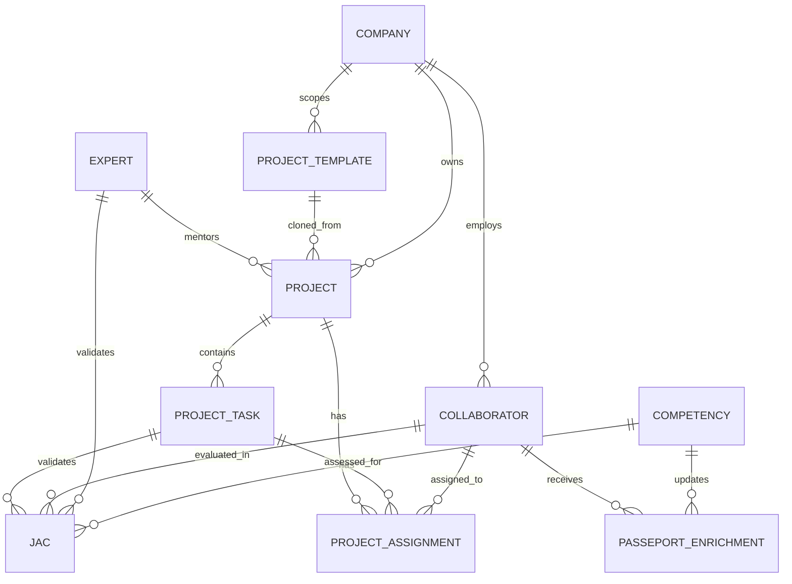

# 11 Projects SBO

**Version:** MVP Septembre 2026  
**Status:** 🟢 Spécification en cours (Format 3)  
**Effort estimé:** 280-380h  
**Timeline:** Septembre 2026 (8-12 semaines)  
**Owner:** Pierre Armand

---

## 📖 Vue d'Ensemble

### Objectif Métier

Projects SBO transforme TLS d'une **plateforme de formation** en **Workforce Intelligence Engine** — en opérationnalisant la boucle **Learn → Do → Match → Enrich Passeport**.

**Pourquoi Projects SBO existe :**
- Formation crée demand + remplit Passeports (fondation)
- Projects SBO crée revenue + données réelles (validation)
- Passeports enrichis deviennent asset stratégique (moat compétitif)
- Network effects : projets plus riches → meilleur matching → plus de projets

**Impact sur apprentissage/organisation :**
- Organisations : Visibilité en temps réel sur skill gaps, mobility, innovation capacity
- Collaborateurs : Proof of real competence (pas juste certs) + career clarity
- Experts TLS : Demand source + revenue stream + mentoring opportunities

### Qui l'Utilise (Rôles)

| Rôle | Usage |
|------|-------|
| **Consultant TLS** | Crée projets, assigne experts, gère timeline, validates outcomes |
| **Client Admin** | Configure paramètres projet, gère équipe, suit progress |
| **Collaborateur Client** | Exécute project tasks, complète JACs, enrichit son Passeport |
| **Expert TLS / Marketplace** | Mentor, assigne tasks, valide JAC et compétences réelles |
| **Manager Client** | Surveille progress équipe, détecte risks, fait escalades |
| **Admin TLS** | Manage templates, expert pool, client animation, reporting |

### Scope — IN / OUT

#### ✅ IN (MVP Septembre 2026)

**3 Project Types (Client-Facing Offerings)**
- Upskilling Projects : Développer compétences collaborateurs via Formation + Application réelle
- STRIDE IA Deployment : Déployer IA en client avec méthode STRIDE
- Custom IA Tools + Training : Prestation externe gérée via plateforme

**Core Features**
- Project creation (manual, TLS-driven)
- Task assignment to collaborators + TLS experts (manual matching)
- Dreyfus 3+ gating (can't start without prerequisites)
- JAC (Jalons d'Application Critique) validation workflow
- Template management (Admin creates, can be cloned)
- Manager cockpit (progress, budget, risks, skill gaps visibility)
- Passeport enrichment (automatic, on JAC validation)
- Final project report (validated Passeport snapshot)

**Integrations**
- ❌ NO external systems (deferred to V2+)
- ✅ Formation module (for upskilling content)
- ✅ Passeport module (input for gating, output for enrichment)

#### ❌ OUT (Déféré)

**V2+ Features**
- Chatbot IA project auto-configuration (ultimate innovation)
- Expert Marketplace integration (separate cahier)
- External system integrations (Jira, Slack, Notion, etc.)
- Two-way sync with external tools
- Self-service template selection + IA recommendations
- Advanced analytics (skill velocity, atrophy prediction)

### Dépendances Critiques

**Dépend de:**
- **Module #2 (Passeport Compétences)** : Source de vérité pour Dreyfus levels, skill inventory, gating logic
- **Module #1 (Formation Learning Paths)** : Upskilling projects leverage Formation content
- **Module #3 (Coaching)** : Experts + managers from Coaching pool

**Bloque:**
- **Expert Marketplace** (Module #13+) : Projects SBO generates demand for expert services
- **IA Chatbot** (V2+) : Built on top of Projects SBO data + patterns
- **Advanced Analytics** (V2+) : Depends on rich project execution history

---

## 🏢 Multi-Tenant Architecture Decision (MVP + Future-Proofing)

### MVP Strategy : Strict Company Isolation
**Decision:** Option A (Approved by Pierre 2026-05-15)

**Architecture:**
- **MVP Scope:** Single-company projects (one client = one company)
- **Database Isolation:** `company_id` (NOT NULL) on all project-related entities
  - Project → company_id identifies which client owns the project
  - ProjectTask → inherited from Project (implicit)
  - JAC → inherited from ProjectTask (implicit)
  - ProjectTemplate → can be global (no company_id) OR company-specific (with company_id)

**Isolation Enforcement:**
- All project queries filtered by authenticated user's company_id
- Expert TLS can see/manage projects across all companies (role-based override)
- Manager can ONLY see projects in their company
- Collaborators can ONLY see their assigned projects (within their company)

**Future-Proofing (V2+):**
- `is_shared` Boolean + `shared_with_companies` JSON array reserved on Project table
- Enables future multi-company project sharing (e.g., "Shared Upskilling" across subsidiary companies)
- No code changes needed to support V2 expansion (schema ready)

**Data Isolation Model (MVP):**
```
Companies
  ├─ Company 1
  │  ├─ Projects (company_id = Company 1)
  │  │  ├─ Project A (internal Upskilling)
  │  │  └─ Project B (STRIDE deployment)
  │  └─ Team Members (linked to Company 1)
  │
  └─ Company 2
     ├─ Projects (company_id = Company 2)
     │  └─ Project C (Upskilling)
     └─ Team Members (linked to Company 2)

Experts (TLS) → Can access ALL companies' projects (no company_id isolation for experts)
```

**Impact:**
- Prevents data leakage between companies (security)
- Enables scaling (future V2: share projects across subsidiaries)
- No extra complexity in MVP (straightforward filtering)
- Future-proof: `is_shared` + `shared_with_companies` ready when needed

---

## 💡 THE ULTIMATE INNOVATION — IA-Driven Project Configuration (V2+ Vision)

*This section documents the strategic vision for V2+ (2027+). MVP doesn't include this, but it's the game-changer that justifies the entire platform.*

### The Problem (Today, Without Projects SBO)

Traditional project management is **skill-agnostic** :
- Client says "I need a chatbot"
- Manager assigns whoever's available
- Mismatches happen → delays, rework, frustration
- No data feedback (what skill was actually used? Did people learn?)

### The Solution (V2+ with IA-Driven Config)

Chatbot IA becomes the **project architect** :

```
[CLIENT DESCRIBES PROJECT]
  "We need to deploy customer support chatbot in Q3"
  "Team: 5 people, 2 good with Python, others mid-level"
  
        ↓
        
[CHATBOT ANALYZES REQUIREMENTS]
  → Extracts needed skills (Python, NLP, ChatOps, Testing, etc.)
  → Queries client team Passeports (real Dreyfus levels)
  → Detects gaps: "Need Dreyfus 3+, have mostly Dreyfus 2"
  
        ↓
        
[INTELLIGENT RECOMMENDATIONS]
  Option A: "Person X closest to Python 3 (now 2.5)"
    → Parallel Upskilling path (2 weeks intensive)
    → Pair with TLS expert during project (mentoring)
    → JAC validation on real deliverable
    
  Option B: "Hire expert from TLS Marketplace"
    → Delivers + mentors team
    → Knowledge transfer built-in
    
  Option C: "Use AI Agent (Mistral) for Python components"
    → Pair with least-skilled human (learning + delivery)
    → Expert overseeing + validating
    
        ↓
        
[PROJECT AUTO-CONFIGURATION]
  ✅ Task breakdown (estimated duration + Dreyfus level)
  ✅ Each task assigned to: [Collaborator] + [Mentor/AI]
  ✅ Timeline with milestones
  ✅ JAC checkpoints (real competence validation)
  ✅ Success criteria per task
  ✅ Risk flags (people below required level, tight timeline, etc.)
  
        ↓
        
[ROADMAP READY]
  Project structure complete with everyone/everything assigned
  Client can execute in Learning App OR export to Jira/Notion/etc.
  
        ↓
        
[EXECUTION + DATA COLLECTION]
  Real project work → Task completion → Skill usage tracked
  JAC validation → Expert verification → Data quality assured
  
        ↓
        
[PASSEPORT ENRICHMENT (Continuous)]
  ✅ Task completion → skill usage recorded
  ✅ JAC validation → Dreyfus level confirmed
  ✅ Expert verification → integrity ensured
  ✅ Passeport updated (real, not theoretical)
  
        ↓
        
[NETWORK EFFECTS COMPOUND]
  Next project uses enriched Passeport
  Better matching → Optimal task assignments
  Loop repeats → Platform becomes irreplaceable strategic asset
```

### Why This is the Moat

1. **Data Interoperability :** Formation + Passeport + Projects create continuous loop
2. **Switching Costs :** Years of competency cartography = too valuable to abandon
3. **Competitive Fusion :** IA (Mistral matching) + TLS pedagogical expertise (no competitors have both)
4. **Network Effects :** Each project makes Passeport richer, Passeport makes projects better

---

## 🎯 DESCRIPTION — How a Skills-Based Oriented Project Works (vs Traditional)

### Traditional Project Management

```
PROJECT SCOPE
  ↓
ASSIGN AVAILABLE PEOPLE
  ↓
EXECUTE (hope people have right skills)
  ↓
DELIVER + MOVE ON
  ↓
❌ No skill data captured
❌ No learning feedback
❌ People stuck in "usual role"
❌ Next project repeats same mistakes
```

### Skills-Based Oriented Project (SBO Model)

```
MISSION / BUSINESS NEED
  ↓
ANALYZE REQUIRED SKILL PROFILE
  (What Dreyfus levels needed for each competency?)
  
        ↓
        
DIAGNOSTIC vs TEAM PASSEPORTS
  (Who's at required level? Who's close? Who needs stretch?)
  
        ↓
        
INTELLIGENT MATCHING + GAP CLOSURE
  • Dreyfus 3+ required → can start immediately
  • Dreyfus 2.5-2.9 → offer parallel upskilling path
  • Dreyfus 1-2 → pair with expert mentor (binôme)
  • Skill not in team → hire from Marketplace OR use AI Agent
  
        ↓
        
PROJECT STRUCTURE = LEARNING + DELIVERY
  Each task is BOTH:
  • A deliverable (mission needs)
  • A competency proof (Dreyfus validation opportunity)
  
  Example: "Build API integration"
    → Deliverable: Integration works
    → Competency: Dreyfus 3 in "API Design" proven via code review + JAC
    
        ↓
        
EXECUTION WITH VALIDATION
  • Real work happens (not sandbox training)
  • Expert or TLS validates competence (not just "task done")
  • JAC = proof point in portfolio
  
        ↓
        
PASSEPORT ENRICHMENT (Automatic)
  Task completion → Dreyfus level confirmed
  Passeport updates with real project data
  (not "completed a course" but "proved competence in production")
  
        ↓
        
MOBILITY UNLOCKED
  "Person has proven Dreyfus 3 in API Design (with real deliverable proof)"
  → Can be assigned to ANY project needing that skill
  → Career path clearer (not stuck in "usual role")
  
        ↓
        
ORGANIZATIONAL INTELLIGENCE
  "We have X people at Dreyfus 3+ in Python, Y at 2, Z at 1"
  "Gap for upcoming mission : need Z more people at 3+"
  "Recommendation: upskilling plan for 3 people (2 weeks)"
  → Strategic workforce decisions, not gut feel
  
        ↓
        
NEXT PROJECT LOOP
  Enriched Passeports → Better matching
  Better matching → Optimal task assignments
  Optimal assignments → Higher success rate → More enriched Passeports
  (Network effects compound)
```

### Key Differences : SBO vs Traditional

| Aspect | Traditional | SBO |
|--------|-------------|-----|
| **Project Input** | Business scope only | Business scope + skill requirements |
| **Assignment Logic** | "Who's available?" | "Who can grow + deliver?" |
| **Skill Capture** | None | Continuous (task + JAC + Passeport) |
| **Learning** | Separate from work | Integrated (real project = proof) |
| **Mobility** | Role-based (slow) | Skill-based (fluid) |
| **Next Project** | Same matching mistakes | Better matching (enriched data) |
| **Org Intelligence** | Guesswork | Data-driven (real competency maps) |

---

## 📱 Écrans à Concevoir

### Front-Office (React) — Client-Facing

| Écran | Rôle | Description | Priorité |
|-------|------|-------------|----------|
| **Project Dashboard** | Collaborateur/Manager | Real-time view of assigned tasks, JAC status, Passeport updates | P0 |
| **Task Detail + Execution** | Collaborateur | Full task spec, checklist, submission, feedback from expert | P0 |
| **JAC Validation Form** | Expert/Manager | Evaluate if Dreyfus 3+ achieved, approve/request changes | P0 |
| **Team Overview** | Manager | All team members, current tasks, Dreyfus levels, progress, risk flags | P0 |
| **Skill Gap Analysis** | Manager | Compare team Dreyfus levels vs mission requirements, upskilling recommendations | P1 |
| **Passeport Enrichment Feed** | Collaborateur | See skills updated in real-time as projects validate competencies | P1 |

### Back-Office (WordPress Admin)

| Écran | Rôle | Description | Priorité |
|-------|------|-------------|----------|
| **Project Creation Wizard** | TLS Consultant | Guide-based form: project type → client → skills required → team selection → expert assignment → timeline → launch | P0 |
| **Expert Assignment Interface** | TLS Admin/Consultant | Search TLS experts by skill/Dreyfus level, assign to projects, manage availability | P0 |
| **Template Management** | Admin | Create/edit/clone project templates, set parameters (skill requirements, duration, phases), preview | P0 |
| **Client Configuration Panel** | Admin | Set client company params, approve projects, manage user access, see high-level progress | P1 |
| **JAC Management** | Expert/Admin | Create JAC checkpoints, approval workflows, Passeport enrichment trigger settings | P1 |
| **Project Monitoring Dashboard** | Admin/TLS | See all active projects, status, risks, timeline adherence, team capacity | P1 |
| **Report Generation** | Admin/TLS | Export final project report (deliverables + Passeport snapshot) for client | P1 |

---

## ⚙️ Fonctionnalités (MVP)

### Core

1. **Project Creation (Manual, TLS-Driven)**
   - TLS consultant fills form : project type, client, required skills, duration, client team selection
   - System creates project structure (tasks from template or custom)
   - Expert assignment (manual, TLS selects based on availability + skill match)
   - Timeline generation
   - Project launch (sends notifications to collaborators + experts)

2. **Task Management & Execution**
   - Each task specifies : deliverable, Dreyfus level required, estimated duration, success criteria
   - Collaborator sees task detail, completes work, submits
   - Expert/manager reviews, provides feedback, approves or requests changes
   - Task completion triggers Passeport enrichment flag (pending JAC validation)

3. **JAC (Jalons d'Application Critique) Validation**
   - Expert evaluates if Dreyfus 3+ demonstrated on task
   - JAC approval = Passeport level confirmed
   - JAC rejection = rework + re-evaluation
   - Validated JAC = Passeport automatically enriched

4. **Dreyfus 3+ Gating**
   - Collaborator can't start project if Dreyfus < 3 for any critical skill
   - System shows : "You're at Dreyfus 2.5 for Python (need 3+)"
   - Offers : parallel upskilling path OR expert mentoring option
   - Manager/TLS approves gating exception or confirms upskilling prerequisite

5. **Template Management**
   - Admin creates project templates (name, description, task list, skill requirements, duration)
   - Templates can be parameterized (e.g., "Upskilling 5 people" vs "Upskilling 20 people")
   - Templates cloneable (coach creates, can be reused by others)
   - Version control (update template, note if clones update automatically or independently — deferred to Phase 14)

6. **Manager Cockpit**
   - Real-time progress per collaborator (task status, Dreyfus level, JAC count)
   - Budget tracking (per-person cost, ROI if applicable)
   - Risk flags (who's behind, who's at risk of not reaching Dreyfus 3, timeline risks)
   - Skill gap analysis (team vs mission requirement)
   - Escalation (flag issue, notify TLS, request intervention)

7. **Passeport Enrichment (Automatic)**
   - Task completion + JAC validation → Passeport Dreyfus level updated
   - Each enrichment logged with timestamp + project context
   - Passeport feed shows real-time updates
   - Data quality verified by expert (prevents inflation)

8. **Final Project Report**
   - Generated at project completion
   - Includes : deliverables summary, team Passeport snapshot, JACs achieved, cost/ROI, lessons learned
   - Client receives PDF + platform copy
   - Passeport snapshot archived (baseline for next project)

### Secondary

9. **Expert Performance Tracking** (Admin)
   - How many JACs validated per expert
   - Success rate (how many validations required rework)
   - Mentoring feedback (team sentiment on expert's help)
   - (Informs V2 expert matching AI)

10. **Project Cloning**
    - Client can "repeat" successful project (same template, new team)
    - Pre-fills tasks, timeline, estimated costs
    - Updates assigned experts (availability check)

11. **Upskilling Parallel Path**
    - If gating blocks start, system suggests : Formation module section + project task with expert mentor
    - Parallel path : 2-week intensive + task application
    - Success = Dreyfus 3+ achieved → project unblocked

---

## 🚀 Possible Évolutions (V2+)

### V2 (2027)

- **Chatbot IA for Project Auto-Configuration**
  - Client describes project → IA extracts skill requirements
  - IA queries team Passeports → detects gaps
  - IA recommends task assignments (collaborator + mentor/AI balancing)
  - Timeline auto-generated
  - Project ready to launch after TLS approval

- **Advanced Analytics**
  - Skill velocity (how fast people improve)
  - Atrophy prediction (who might lose skills without refresher)
  - Team composition optimization (for future missions)
  - ROI metrics (cost per Dreyfus level gained)

### V3 (2028+)

- **Self-Service Project Selection**
  - Client browses mission templates (pre-built project blueprints)
  - Selects one → IA customizes for their team
  - Client approves → launches without TLS consultant (eventually)

- **Binôme AI Agent** (Advanced)
  - Mistral agent assigned alongside human expert
  - Agent handles documentation, code review, some mentoring
  - Human validates, makes judgment calls
  - Augmentation, not replacement

- **Internal Mobility Marketplace**
  - Org-wide visibility : "Person X is now Dreyfus 3 in Python"
  - Managers can request transfers (if Passeport matches)
  - Internal career transitions based on real competency proof
  
- **Marketplace Expert Integration**
  - Assign external experts to projects
  - Revenue sharing (TLS takes %, expert takes %)
  - Expert Passeport verification (automated via stored Passeport levels)

- **External System Integrations**
  - One-way export (Project → Jira/Notion/Asana)
  - Two-way sync (changes in external tools reflected back)
  - API webhooks (external system task completion → Passeport update)


---

## 👥 User Journeys (Format 3)

### User Journey #1 : TLS Consultant → Project Creation (Upskilling)

**Acteur :** TLS Consultant (managing client engagement)  
**Déclencheur :** Client company signs contract for Upskilling project  
**Objectif :** Create project structure with correct skill requirements, assign expert, set timeline, launch for client team

#### Étapes Détaillées

1. **Consultant accède Projects SBO et sélectionne "Create New Project"**
   - Clicks button "Create Project"
   - Modal/form opens with project type selection (Upskilling / STRIDE / Custom)
   - Feedback: Form loads ~300ms, no lag
   - Durée: Instant

2. **Consultant choisit type "Upskilling" et saisit infos de base**
   - Inputs: Client company name, project title, description, duration estimate (weeks)
   - Selects: Formation module + parcours to recommend (pre-filled for client to follow)
   - Feedback: Auto-save every input (~500ms), form validation real-time
   - Durée: ~2 minutes for consultant to fill

3. **Consultant définit "Skill Profile Requis"**
   - Adds required skills (e.g., "Python Development", "API Design", "Testing")
   - For each: Specifies Dreyfus level needed (e.g., "3 for Python, 2 for Testing")
   - Specifies count: "Need 3 people at Python 3, 4 people at Testing 2"
   - Feedback: Skill search auto-completes, level selector shows definition tooltips
   - Durée: ~3 minutes

4. **Consultant sélectionne "Client Team Members" depuis Passeport**
   - **Company Isolation:** System filters team members by client's company_id (only shows people in this company)
   - Displays client's collaborator list (linked via company account)
   - Shows each person's current Dreyfus levels (from Passeport)
   - Consultant checks who to include in project
   - System highlights: "Person A: Python 2.5 (need 3) — flag: will need upskilling first"
   - Feedback: Green checks for fit, yellow warnings for gaps, red for major mismatches
   - **Security Note:** Consultant cannot see collaborators from other companies (company_id enforced in query)
   - Durée: ~2 minutes

5. **Système détecte les skill gaps et propose options**
   - Alert: "3 people below required level for Python"
   - Consultant can:
     - Option A: Approve gating (can't start until upskilling)
     - Option B: Assign expert mentor (pair with TLS expert for support)
     - Option C: Skip person (adjust project team)
   - Feedback: Clear UI with radio buttons, explanations of each option
   - Durée: ~1 minute decision

6. **Consultant assigne expert TLS (expert mentor)**
   - Clicks "Assign Expert Mentor" for project
   - **No Company Isolation for Experts:** Search by skill: "Python 3" → displays ALL available TLS experts (pool-wide, not company-specific)
   - Shows expert: Name, Dreyfus levels, current project load, availability, company assignment (e.g., "TLS Internal", or "Prestataire XYZ")
   - Consultant selects expert, calendar shows available hours/weeks
   - Feedback: Confirmation: "Expert X assigned to project, notified"
   - **Expert Access Rule:** Expert can see all projects they're assigned to (across any company_id) + projects shared by other companies
   - Durée: ~2 minutes

7. **Système génère Task Breakdown à partir du template Formation**
   - Uses selected Formation parcours as blueprint
   - Breaks into project tasks: "Learn module 1", "Apply in task 1", "Submit for JAC", etc.
   - For each task: Specifies deliverable, Dreyfus level tested, success criteria, JAC checkpoint
   - Consultant can edit/customize task list
   - Feedback: Preview of full task timeline, estimated duration per task
   - Durée: ~3 minutes (auto-generated, consultant tweaks)

8. **Consultant crée Timeline et définit jalons**
   - Inputs: Start date, end date
   - System calculates: weeks needed, task sequence, JAC milestones
   - Consultant adjusts if needed (compress, extend, add phases)
   - Feedback: Gantt-like visualization, risk flags if too tight
   - Durée: ~2 minutes

9. **Consultant lance le projet et notifie les participants**
   - Clicks "Launch Project"
   - System sends notifications:
     - Client admin: "Project activated, your team can now see tasks"
     - Collaborators: "You're assigned to Upskilling project, see tasks"
     - Expert: "You're mentor for X project, 4 collaborators"
   - Feedback: Success message, email confirmations sent
   - Durée: Instant

#### Conditions de Succès ✅
- [ ] Project created with correct skill profile
- [ ] All team members assigned
- [ ] Expert mentor assigned + notified
- [ ] Task breakdown accurate to Formation parcours
- [ ] Timeline realistic (no red flags)
- [ ] All gating decisions documented (if people below Dreyfus 3)
- [ ] Project visible to client + collaborators
- [ ] Notifications sent successfully

#### Erreurs & Edge Cases ❌

**Cas 1 : Team member already at/above Dreyfus 3**
- Scénario: Person A already Dreyfus 3 in Python (no upskilling needed)
- Comportement attendu:
  - System shows: "Person A ready, no gating needed"
  - Consultant assigns directly to project (can start immediately)
  - No upskilling recommendation
- Feedback: Green check, task starts day 1
- Impact: Project launches faster for ready people

**Cas 2 : Expert TLS unavailable during project timeline**
- Scénario: Selected expert has conflict/leave during project
- Comportement attendu:
  - System alerts: "Expert X unavailable weeks 3-4, overlap risk"
  - Consultant can: Reschedule project, select alternate expert, or proceed with warning
  - If warning: Expert coverage manually managed
- Feedback: Clear conflict visualization, options with impact
- Impact: Project launch delayed or expert reassigned

**Cas 3 : Client team members < skill requirement size**
- Scénario: Client only has 2 people, project needs 3 at Dreyfus 3 Python
- Comportement attendu:
  - System flags: "Team size insufficient for project scope"
  - Options:
    - Reduce project scope (fewer people, fewer skills)
    - Add external experts from Marketplace (V2 feature, not MVP)
    - Offer upskilling path (2 people from 2.5 → 3)
  - Consultant chooses option + adjusts scope/timeline
- Feedback: Clear warning with recommended actions
- Impact: Project modified or offered alternative engagement

**Cas 4 : Formation parcours doesn't map to project skills**
- Scénario: Consultant wants "API Design" but Formation only has "Web Basics"
- Comportement attendu:
  - System alerts: "Selected parcours doesn't cover all required skills"
  - Options:
    - Use different parcours
    - Supplement with custom tasks (non-Formation)
    - Recommend new Formation module creation (out of scope MVP)
  - Consultant adjusts selection
- Feedback: Clear mismatch indication, suggested parcours list
- Impact: Consultant selects appropriate Formation + custom tasks

**Cas 5 : Consultant tries to launch with unresolved gating (people below Dreyfus 3)**
- Scénario: Person B at Dreyfus 2 for required skill, no upskilling option selected
- Comportement attendu:
  - System blocks project launch: "Unresolved gating for 1 person"
  - Forces choice: Approve gating OR assign upskilling OR exclude person
  - Can't proceed without resolution
- Feedback: Clear blocker message, options to resolve
- Impact: Project integrity maintained (no unqualified people start)

---

### User Journey #2 : Collaborator → Project Execution + JAC Validation

**Acteur :** Collaborateur client (learning + doing)  
**Déclencheur :** Upskilling project launches, collaborator assigned  
**Objectif :** Complete project tasks, apply learning in real work, get JAC validated, enrich Passeport

#### Étapes Détaillées

1. **Collaborateur reçoit notification projet et accède au dashboard**
   - Email: "You're assigned to Python Upskilling project"
   - Clicks link → logs into Learning App → Projects tab
   - **Company Isolation:** Dashboard filters projects by collaborator's company_id (only shows projects in their company)
   - Sees: "Upskilling Project: Python Development (8 weeks, 4 tasks, 1 expert)"
   - **Access Control:** Collaborator can ONLY see their own assigned projects (within their company, not cross-company)
   - Feedback: Dashboard loads ~500ms, clear project card with CTA "View Tasks"
   - Durée: Instant

2. **Collaborateur voit son projet dashboard avec dépendances**
   - Shows: Formation parcours progress (if in progress) + Project tasks + Expert mentor profile + Timeline
   - Color-coded: Green (ready), Yellow (in progress), Red (blocked/overdue)
   - Expert mentor card: Name, profile, "Message expert", office hours
   - Feedback: Real-time sync, visual progress bar
   - Durée: Instant

3. **Collaborateur commence Formation parcours (linked to project)**
   - Clicks "Start Formation"
   - Opens Formation module (separate but integrated)
   - Completes lessons: videos, quizzes, reading materials
   - Each lesson completion → progress bar updates (~1-2 weeks, depending on intensity)
   - Feedback: Instant completion notification, XP gained, skills preview updated
   - Durée: 1-2 weeks (depending on parcours)

4. **Après Formation, collaborateur commence Task 1 : "Build API Endpoint"**
   - Formation complete → Task 1 unlocked (dependency)
   - Clicks "Start Task"
   - Sees task spec: "Build REST API for customer data (with tests)"
   - Success criteria: "Endpoint functional, 80%+ test coverage, code review approval"
   - Deliverable: Code pushed to repo + test results
   - Expert mentor assignment shown (who will validate)
   - Feedback: Full task spec, checklist, tips from Formation, links to relevant docs
   - Durée: ~3 days to complete

5. **Collaborateur travaille + se contact avec expert mentor**
   - Writes code, creates pull request, mentions expert in code review
   - Clicks "Ask Expert" → opens chat/meeting scheduler
   - Expert responds: "Code looks good, one issue in error handling (line 45). Review and resubmit"
   - Collaborator fixes, resubmits
   - Feedback: Real-time expert availability shown (office hours, response time estimate)
   - Durée: ~2-3 days of iteration

6. **Expert valide la tâche et déclenche JAC Evaluation**
   - Expert approves task: "Code quality good, test coverage excellent, API design solid"
   - Clicks "Approve Task + Initiate JAC"
   - JAC form opens: "Evaluates if Dreyfus 3 demonstrated: API Design"
   - Expert assesses against Dreyfus criteria (Competent level)
   - Feedback: Clear JAC form with rubric, examples of Dreyfus 3 vs 2 behavior
   - Durée: ~15 minutes (expert evaluation)

7. **JAC Validation & Passeport Enrichment**
   - Expert submits JAC: "Dreyfus 3 achieved for API Design"
   - System: Passeport updated automatically (Dreyfus level for "API Design" → 3)
   - Collaborator notification: "API Design validated at Dreyfus 3! Check Passeport"
   - Feedback: Celebration moment (visual reward, email, XP boost), Passeport feed updated
   - Durée: Instant

8. **Collaborator voit Passeport enrichissement & continue next task**
   - Clicks Passeport → sees "API Design: Dreyfus 3 (validated via Project Task, 2026-05-10)"
   - Includes: Project context, task name, expert validation, date
   - Task 2 now unlocked (dependency)
   - Feedback: Passeport shows real competency proof (not self-reported)
   - Durée: Instant

#### Conditions de Succès ✅
- [ ] Collaborator completes all project tasks (4 tasks)
- [ ] All tasks JAC-validated (Dreyfus 3+ achieved)
- [ ] Passeport enriched (4 new Dreyfus 3 levels confirmed)
- [ ] Project completed on timeline (8 weeks)
- [ ] Expert feedback integrated + acted upon
- [ ] Final project report generated

#### Erreurs & Edge Cases ❌

**Cas 1 : Collaborateur en retard sur timeline**
- Scénario: Task 2 deadline passed, collaborator hasn't started
- Comportement attendu:
  - Day 1 overdue: Notification to collaborator ("Task 2 due, contact expert for help")
  - Day 3 overdue: Manager notified ("Person X 3 days late, recommend escalation")
  - Day 5+ : TLS admin flagged (Project at risk)
  - Expert offers: Fast-track session, deadline extension, or scope reduction
- Feedback: Red flag visible on dashboard, escalation path clear
- Impact: Catch delays early, enable support before project fails

**Cas 2 : Collaborateur demande help pendant la tâche**
- Scénario: Stuck on API error, sends "Ask Expert" message
- Comportement attendu:
  - Expert gets notification (chat + email)
  - Expert can: Reply async, schedule sync call, or provide written guidance
  - Response time goal: <24 hours (during project hours)
  - If expert unavailable: Auto-suggest alternate mentor or TLS support
- Feedback: Clear escalation, multiple help channels
- Impact: Support available, task doesn't stall

**Cas 3 : JAC Validation rejected (Dreyfus 2, not 3)**
- Scénario: Expert reviews Task 2, says "Code works but design is immature (Dreyfus 2)"
- Comportement attendu:
  - Expert declines JAC: "Needs improvement in error handling"
  - Provides specific feedback (rubric + examples)
  - Task status: "Needs Rework"
  - Collaborator resubmits after fixes
  - Expert re-evaluates (Dreyfus 3 this time)
- Feedback: Clear feedback on Dreyfus 2 vs 3 gap, path to remediation
- Impact: Quality maintained (no inflated Dreyfus levels)

**Cas 4 : Collaborateur fait demande d'extension**
- Scénario: Personal circumstances, needs 2-week delay
- Comportement attendu:
  - Requests extension via dashboard
  - Manager + expert notified
  - Manager approves (or denies with rationale)
  - If approved: Timeline adjusted, new due dates set
  - If denied: Escalation to TLS + client discussion
- Feedback: Clear workflow, decisions logged
- Impact: Flexible but accountable (not arbitrary delays)

**Cas 5 : Formation parcours prerequisite not complete**
- Scénario: Collaborator tries to start Task 1 before finishing Formation
- Comportement attendu:
  - System blocks: "Complete Formation module first (2 lessons remaining)"
  - Shows progress bar, estimated time to complete
  - Can't bypass (gating enforced)
- Feedback: Clear blocker, path forward
- Impact: Quality of application ensured (theory → practice)

---

### User Journey #3 : Manager → Project Monitoring + Risk Intervention

**Acteur :** Manager client (overseeing team development)  
**Déclencheur :** Upskilling project ongoing for 3 weeks  
**Objectif :** Monitor team progress, detect risks, intervene if needed, ensure project success

#### Étapes Détaillées

1. **Manager accède au Project Cockpit**
   - Logs in → Projects tab → Clicks "My Team's Projects"
   - Sees: "Upskilling Project (Week 3/8), 4 team members, status: On Track"
   - Feedback: Dashboard loads ~300ms, color-coded status (Green = on track, Yellow = warning, Red = risk)
   - Durée: Instant

2. **Voir overview de l'équipe : progress, deadlines, risks**
   - Shows 4x cards per team member:
     - Name, current task, progress (%), deadline, Dreyfus progression
     - Example: "Person A: Task 1 (85% done, due 2 days), Dreyfus 2.5→3 expected"
   - Risk flags: "Person B: Task 2 overdue (3 days), needs help"
   - Feedback: Real-time data, color coding, "Need Help" flags
   - Durée: ~1 minute overview

3. **Manager détecte Person B en retard et veut comprendre**
   - Clicks on Person B's card
   - Opens detail view: Task spec, deadline (3 days past), current status, expert feedback
   - Expert note: "Person B is struggling with async API calls, offered help but no response"
   - Feedback: Full context, expert input, timeline visualization
   - Durée: ~1 minute

4. **Manager choisit d'intervenir : message + meeting**
   - Clicks "Check In With Person B"
   - Opens message composer → "Hey, I see you're stuck on Task 2. Let's sync up tomorrow morning?"
   - Schedules 30-min call → calendar invite sent
   - Expert (mentor) is added to meeting (optional, can observe or help)
   - Feedback: Meeting scheduled, participants notified, agenda visible
   - Durée: ~2 minutes

5. **During meeting : Manager + Person B + Expert discuss**
   - Manager: "What's blocking? What do you need?"
   - Person B: "API calls confusing, tried tutorials but still stuck"
   - Expert: "I explained async callbacks, let me show live debugging"
   - Decision: Extra 1-on-1 session with expert tomorrow, deadline extended 2 days
   - Feedback: Meeting notes recorded, action items logged
   - Durée: 30 minutes

6. **Après meeting : Manager met à jour le projet**
   - Logs follow-up: "Provided support, extended deadline to May 25 (agreed with TLS)"
   - Updates Person B's timeline in system
   - Sends email summary (manager, person, expert, TLS) confirming changes
   - Feedback: Changes immediately visible on dashboard
   - Durée: ~2 minutes

7. **Manager voit risque #2 : Person A progressing trop vite**
   - Notice: "Person A 100% Task 1, only 1.5 weeks in (budget was 2 weeks)"
   - Manager thinks: "They might be rushing, quality risk?"
   - Clicks on Person A → sees JAC status: "Pending expert review"
   - Feedback: Expert's JAC decision visible, quality check in progress
   - Durée: ~1 minute

8. **Manager escalade au expert : ask for accelerated review**
   - Clicks "Request Expert Review" → Adds note: "Person A ready early, can we fast-track JAC?"
   - Expert gets notification, agrees to review today (vs. original schedule)
   - Feedback: Escalation logged, expert response time shown
   - Durée: ~1 minute

9. **Manager vérifie Team Skill Gaps vs Mission**
   - Clicks "Skill Gap Analysis" tab
   - Shows: Team vs Project Requirements
     - Python 3: Need 3, have 2 at Dreyfus 3 + 1 in progress (Person A)
     - API Design: Need 4, have 1 complete (Person A) + 3 in progress
     - Testing: Need 4, have 3 in progress (on track)
   - Feedback: Green/yellow/red indicators, recommendations
   - Durée: ~1 minute

10. **Manager réfléchit sur Passeport enrichissement trend**
    - Sees: "Current trajectory: 4 people will have +3 new Dreyfus 3 levels by end of project"
    - Impact: Team's capability score increases from 2.3 → 2.8 (measurable)
    - Future: Next project will have more skilled team (better matching)
    - Feedback: Strategic insight, ROI visualization
    - Durée: ~1 minute reflection

#### Conditions de Succès ✅
- [ ] Manager detects all project risks in real-time
- [ ] Timely interventions prevent scope creep/timeline issues
- [ ] Team stays motivated (support offered when needed)
- [ ] JAC quality maintained (no rushing)
- [ ] Final team capability improvement measurable

#### Erreurs & Edge Cases ❌

**Cas 1 : Manager tries to override deadline without TLS approval**
- Scénario: Manager wants to extend Person B's deadline by 4 weeks
- Comportement attendu:
  - System allows request, but flags: "TLS approval required for large extension"
  - Manager submits request with rationale
  - TLS reviews (ensures it doesn't impact client commitments)
  - TLS approves or counters (e.g., "2 weeks ok, 4 weeks impacts other client")
  - Both parties notified
- Feedback: Accountability maintained, collaboration required
- Impact: Timeline integrity + flexibility balanced

**Cas 2 : Manager requests Person A be reassigned to another project**
- Scénario: Manager wants to pull Person A (highest performer) mid-project
- Comportement attendu:
  - System blocks: "Can't reassign mid-project (breaks team + Passeport enrichment goal)"
  - Offers alternative: "Person A can help other project AFTER this one completes (Week 8)"
  - Explains: "Early exit = incomplete Passeport validation"
- Feedback: Project integrity enforced, alternatives suggested
- Impact: Project completion prioritized over short-term convenience

**Cas 3 : Manager sees inconsistent Expert feedback**
- Scénario: Expert gave Person C "Dreyfus 2" on Task 1, then "Dreyfus 3" on similar Task 2
- Comportement attendu:
  - Manager flags: "Feedback consistency issue, ask expert"
  - Expert reviews both tasks, clarifies: "Task 2 showed more independence (Dreyfus 3), Task 1 was more dependent (Dreyfus 2)"
  - Manager understands nuance (Dreyfus isn't all-or-nothing)
- Feedback: Context provided, learning opportunity
- Impact: Better understanding of skill development progression

---

### User Journey #4 : Admin → Template Creation & Management

**Acteur :** TLS Admin  
**Déclencheur :** New project type needs standard template (e.g., "Standard Upskilling for 5 people")  
**Objectif :** Create reusable project template, configure parameters, enable cloning for future projects

#### Étapes Détaillées

1. **Admin clicks "Create New Template"**
   - Form opens: Template name, description, project type (Upskilling/STRIDE/Custom)
   - Feedback: Clean form, auto-save enabled
   - Durée: Instant

2. **Admin definit paramètres du template**
   - Duration (8 weeks default, parameterizable to 4-12 weeks)
   - Team size (5 people default, parameterizable to 3-20)
   - Required skills (e.g., "Python, API Design, Testing")
   - Dreyfus levels (e.g., "Python 3, others 2+")
   - Expert type (e.g., "Python expert + QA mentor")
   - Feedback: Field validation, tooltips, previews
   - Durée: ~5 minutes

3. **Admin crée task breakdown (template)**
   - Inputs formation parcours link (e.g., "Python Fundamentals")
   - System auto-generates task structure from parcours
   - Admin can customize: Add/remove tasks, adjust durations, update success criteria
   - Example tasks: "Module 1 completion", "Build API project", "Submit for JAC", etc.
   - Feedback: Visual timeline, task dependencies
   - Durée: ~10 minutes

4. **Admin définit JAC checkpoints**
   - For each task: Specify what Dreyfus level is being validated
   - Define success rubric (e.g., "Dreyfus 3 = code quality + independence + design maturity")
   - Feedback: Template preview shows where JACs occur
   - Durée: ~5 minutes

5. **Admin configure les paramètres "variables"**
   - Team size: "For 5 people, use this task sequence. For 10 people, split into 2 cohorts"
   - Duration flexibility: "4-week sprint mode" vs "8-week full mode"
   - Expert assignment: "Default = 1 Python mentor, can add more for larger teams"
   - Feedback: Parameterization preview, different scenarios shown
   - Durée: ~3 minutes

6. **Admin revoit le template et le met en "Active"**
   - Full preview of completed template
   - Timeline visualization
   - Task checklist, JACs, skill outcomes
   - Clicks "Activate Template"
   - Feedback: Confirmation, template now available for cloning
   - Durée: ~2 minutes

7. **Admin peut now cloner ou copier le template**
   - Other admins can search for "Upskilling 5-person template"
   - Clone it → customize for next client (different Formation + skills + duration)
   - Cloned templates tracked (original → clones)
   - Feedback: Clone chain visible (version history)
   - Durée: ~2 minutes per clone

#### Conditions de Succès ✅
- [ ] Template created with clear parameters
- [ ] Task breakdown maps to Formation parcours
- [ ] JAC checkpoints defined + rubrics clear
- [ ] Template reusable for multiple projects (10+ uses)
- [ ] Clones can be customized without breaking original

#### Erreurs & Edge Cases ❌

**Cas 1 : Admin tries to create template with no Formation parcours**
- Scénario: Wants "Custom Upskilling" but no relevant parcours exists
- Comportement attendu:
  - System recommends: "Create Formation module first OR build custom tasks"
  - Can proceed with custom tasks (less ideal, but possible)
  - Flag: "Custom tasks lack pedagoigcal foundation"
- Feedback: Warning, alternatives suggested
- Impact: Quality guidance (Formation-backed preferred)

**Cas 2 : Admin updates template, unsure if clones should auto-update**
- Scénario: Fixes typo in template task description
- Comportement attendu:
  - System shows: "6 active clones of this template"
  - Ask: "Update original only OR propagate to all clones?"
  - If propagate: Notifies all clone users (change log)
  - If original only: Clones remain unchanged (independent versions)
- Feedback: Clear decision point, future updates controlled
- Impact: Version control (important for Phase 14 decision)

---

## 🗄️ Modèle de Données

### Entités Principales

#### 1. **Project** (Client project engagement)

| Colonne | Type | Description |
|---------|------|-------------|
| `id` | UUID | Primary key |
| `company_id` | UUID | FK to Company (client). NOT NULL — MVP strict isolation. V2+ reserved for future multi-company sharing |
| `type` | ENUM | 'upskilling' \| 'stride' \| 'custom' |
| `title` | String | Project name |
| `description` | Text | Full project specification |
| `status` | ENUM | 'planned' \| 'active' \| 'completed' \| 'archived' |
| `start_date` | DateTime | Project start |
| `end_date` | DateTime | Project end |
| `expert_id` | UUID | FK to Expert (primary mentor). Can be expert from any company (TLS pool) |
| `budget` | Decimal | Total project budget (if per-project pricing) |
| `passeport_enrichment_count` | Integer | How many Dreyfus levels expected to be gained |
| `is_shared` | Boolean | Default FALSE. V2+: TRUE enables multi-company access (when shared_with_companies populated) |
| `shared_with_companies` | JSON Array | Default NULL/[]. V2+ only: array of company_ids that can access (e.g., ["company-2-id", "company-3-id"]) |
| `created_by` | UUID | FK to TLS Consultant who created |
| `created_at` | DateTime | Timestamp |
| `updated_at` | DateTime | Timestamp |

#### 2. **ProjectTask** (Individual task within project)

| Colonne | Type | Description |
|---------|------|-------------|
| `id` | UUID | Primary key |
| `project_id` | UUID | FK to Project |
| `title` | String | Task name ("Build API", "Complete JAC", etc.) |
| `description` | Text | Full task specification |
| `dreyfus_level_required` | Integer | Dreyfus 1-5 needed to succeed |
| `formation_module_id` | UUID | FK to Formation (if linked) |
| `deliverable_spec` | JSON | What constitutes "complete" |
| `success_criteria` | JSON | Checklistof success (code quality, test coverage, etc.) |
| `assigned_to` | UUID | FK to Collaborator (assigned team member) |
| `estimated_hours` | Integer | Hours to complete |
| `status` | ENUM | 'not_started' \| 'in_progress' \| 'submitted' \| 'approved' \| 'rework' |
| `due_date` | DateTime | Task deadline |
| `submission_date` | DateTime | When collaborator submitted |
| `created_at` | DateTime | Timestamp |
| `updated_at` | DateTime | Timestamp |

#### 3. **JAC** (Jalons d'Application Critique)

| Colonne | Type | Description |
|---------|------|-------------|
| `id` | UUID | Primary key |
| `task_id` | UUID | FK to ProjectTask (what is being validated) |
| `competency_id` | UUID | FK to Competency (what skill is validated) |
| `collaborator_id` | UUID | FK to Collaborator (who is being evaluated) |
| `expert_id` | UUID | FK to Expert (who validates) |
| `dreyfus_level_achieved` | Integer | 1-5 (what level was demonstrated) |
| `status` | ENUM | 'pending' \| 'approved' \| 'rejected' \| 'rework_submitted' |
| `expert_feedback` | Text | Detailed evaluation + reasoning |
| `rubric_score` | JSON | Scores on Dreyfus criteria |
| `validated_at` | DateTime | When JAC was approved |
| `created_at` | DateTime | Timestamp |

#### 4. **ProjectTemplate** (Reusable project blueprint)

| Colonne | Type | Description |
|---------|------|-------------|
| `id` | UUID | Primary key |
| `name` | String | Template name |
| `description` | Text | What is this template for |
| `type` | ENUM | 'upskilling' \| 'stride' \| 'custom' |
| `formation_module_id` | UUID | FK to Formation (base parcours) |
| `duration_weeks_default` | Integer | Default duration |
| `duration_weeks_min` | Integer | Min flexibility |
| `duration_weeks_max` | Integer | Max flexibility |
| `team_size_default` | Integer | Default team size |
| `team_size_min` | Integer | Min flexibility |
| `team_size_max` | Integer | Max flexibility |
| `skill_profile_required` | JSON | Required skills + Dreyfus levels |
| `task_template` | JSON | Task breakdown (cloned into ProjectTask per project) |
| `jac_checkpoints` | JSON | Where JACs occur + what skills validated |
| `created_by` | UUID | FK to Admin (creator) |
| `status` | ENUM | 'draft' \| 'active' \| 'deprecated' |
| `cloned_count` | Integer | How many projects use this template |
| `created_at` | DateTime | Timestamp |
| `updated_at` | DateTime | Timestamp |

#### 5. **ProjectAssignment** (Task assignment to collaborator OR AI agent)

| Colonne | Type | Description |
|---------|------|-------------|
| `id` | UUID | Primary key |
| `task_id` | UUID | FK to ProjectTask |
| `assignee_type` | ENUM | 'collaborator' \| 'ai_agent' \| 'expert' |
| `assignee_id` | UUID | FK to appropriate entity (Collaborator/AIAgent/Expert) |
| `role` | ENUM | 'primary_executor' \| 'mentor' \| 'reviewer' |
| `status` | ENUM | 'assigned' \| 'in_progress' \| 'completed' |
| `created_at` | DateTime | Timestamp |

#### 6. **PasseportEnrichment** (Audit trail of Passeport updates from projects)

| Colonne | Type | Description |
|---------|------|-------------|
| `id` | UUID | Primary key |
| `collaborator_id` | UUID | FK to Collaborator (whose Passeport) |
| `competency_id` | UUID | FK to Competency (which skill) |
| `old_dreyfus_level` | Integer | Previous level (1-5) |
| `new_dreyfus_level` | Integer | New level (1-5) |
| `source_type` | ENUM | 'project_task' \| 'jac' \| 'manual' |
| `source_id` | UUID | FK to ProjectTask or JAC or manual entry |
| `project_id` | UUID | FK to Project (context) |
| `verified_by` | UUID | FK to Expert (who verified) |
| `verified_at` | DateTime | When verified |
| `created_at` | DateTime | Timestamp |

### Relations (Mermaid)



---

## 🔒 Permission Model (Multi-Tenant MVP)

### Company Isolation Rules (Enforced at Query Level)

#### Access Control Matrix

| Role | Can View | Can Create | Can Edit | Can Delete | Company Isolation |
|------|----------|-----------|----------|-----------|------------------|
| **TLS Consultant** | All projects (any company) | Projects for any company | Own projects + assigned company projects | No | No — TLS-wide access |
| **TLS Admin** | All projects (any company) | Templates (global or company-specific) | All projects, templates | All | No — TLS-wide access |
| **Company Manager** | Projects in OWN company only | ❌ No (TLS creates) | Projects in own company (timeline, team, notes) | ❌ No | YES — `company_id` filter |
| **Collaborator** | Own assigned tasks + projects in own company | ❌ No | Own task submissions | ❌ No | YES — `company_id` filter |
| **Expert (TLS)** | Projects assigned to them (any company) | ❌ No | JAC validations only | ❌ No | Partial — can access cross-company if assigned |

### Data Isolation Implementation

#### Query Filtering by Role

**For Collaborators & Company Managers:**
```sql
-- Example: Get projects for User in Company A
SELECT * FROM projects 
WHERE company_id = {user.company_id}
AND (
  {user.id} IN (SELECT assigned_to FROM project_assignments WHERE project_id = projects.id)
  OR {user.role} = 'manager'
)
```

**For TLS Experts:**
```sql
-- Experts see projects they're assigned to (any company)
SELECT * FROM projects 
WHERE {expert.id} = expert_id
OR is_shared = TRUE AND {expert.id} IN (SELECT * FROM jsonb_array_elements_text(shared_with_companies))
```

**For TLS Consultants/Admins:**
```sql
-- TLS can see all projects (no company filter)
SELECT * FROM projects
```

### Multi-Company Sharing (V2+ Reserved)

**MVP:** All projects have `is_shared = FALSE` + `shared_with_companies = NULL`
- Projects are strictly isolated by company_id

**V2+ Future:** When `is_shared = TRUE`:
```json
{
  "company_id": "company-1-id",
  "is_shared": true,
  "shared_with_companies": ["company-2-id", "company-3-id"]
}
```
- Project owned by Company 1, but readable by Companies 2 & 3
- Collaborators in Companies 2 & 3 can see + work on tasks
- Passeport enrichment still scoped to individual's company Passeport

### Expert Assignment Across Companies

**MVP Rules:**
- Any TLS Expert can be assigned to projects in any company
- Expert sees ALL their projects (expert_id match, no company filter)
- Expert validates JACs regardless of company_id (TLS-wide certification)
- Expert feedback is stored with expert_id (not company-scoped)

**Example Scenario:**
- Expert Maria (TLS) mentors Project A (Company 1) + Project B (Company 2)
- Maria sees both projects in her "Expert Dashboard"
- Maria validates JACs for both companies (TLS certification is TLS-wide)

### Security Notes

1. **Company Data Leakage Prevention:** All queries must include `company_id` filter for non-TLS roles
2. **Expert Privacy:** Experts can see only their assigned projects + shared projects (not all projects in a company)
3. **Passeport Isolation:** Enrichments linked to individual's company (future: cross-company enrichment for shared projects in V2+)
4. **Audit Trail:** All project access logged with `company_id`, role, timestamp

---

## 🔌 API REST — Unified

### Project Management

#### **POST /projects** — Create new project
```
Request:
{
  "client_id": "UUID",
  "type": "upskilling",
  "title": "Python Upskilling Q2",
  "description": "...",
  "start_date": "2026-05-20",
  "end_date": "2026-07-15",
  "expert_id": "UUID",
  "team_members": ["UUID1", "UUID2", "UUID3"],
  "formation_module_id": "UUID",
  "required_skills": [
    {"skill_id": "UUID", "dreyfus_level": 3, "count": 3},
    {"skill_id": "UUID", "dreyfus_level": 2, "count": 2}
  ]
}

Response: 201 Created
{
  "project_id": "UUID",
  "status": "active",
  "tasks": [...],
  "timeline": {...}
}
```

#### **GET /projects/:id** — Retrieve project details
```
Response: 200 OK
{
  "project": {...},
  "tasks": [{...}, {...}],
  "team": [{...}, {...}],
  "progress": {
    "completed_tasks": 2,
    "total_tasks": 4,
    "jacs_validated": 1,
    "passeport_enrichment_expected": 4
  },
  "risks": [...]
}
```

#### **PUT /projects/:id** — Update project (timeline, scope, team)
```
Request:
{
  "end_date": "2026-07-22",  // Extended by 1 week
  "team_members_add": ["UUID4"],
  "notes": "Extended for upskilling needs"
}

Response: 200 OK
{
  "project": {...},
  "changes_applied": [...]
}
```

### Task Management

#### **GET /projects/:id/tasks** — List all tasks in project
```
Response: 200 OK
[
  {
    "id": "UUID",
    "title": "Build API Endpoint",
    "status": "in_progress",
    "assigned_to": "UUID",
    "due_date": "2026-05-30",
    "dreyfus_level_required": 3,
    "jac_status": "pending"
  },
  ...
]
```

#### **PUT /tasks/:id/submit** — Collaborator submits completed task
```
Request:
{
  "deliverable_url": "https://github.com/...",
  "notes": "API built with full test coverage"
}

Response: 200 OK
{
  "task": {...},
  "status": "submitted",
  "expert_notified": true,
  "jac_pending": true
}
```

### JAC Validation

#### **POST /jacs** — Create JAC evaluation
```
Request:
{
  "task_id": "UUID",
  "competency_id": "UUID",
  "dreyfus_level_achieved": 3,
  "expert_feedback": "Code quality excellent, independence shown",
  "rubric_scores": {...}
}

Response: 201 Created
{
  "jac_id": "UUID",
  "status": "approved",
  "passeport_enrichment_triggered": true
}
```

#### **PUT /jacs/:id/reject** — Expert rejects JAC (needs rework)
```
Request:
{
  "feedback": "Error handling incomplete, needs work on edge cases",
  "suggested_rework": "Review error handling patterns, resubmit"
}

Response: 200 OK
{
  "jac": {...},
  "status": "rework_requested",
  "task_status": "rework"
}
```

### Passeport Enrichment

#### **GET /collaborators/:id/passeport-enrichment-feed** — Real-time updates
```
Response: 200 OK
[
  {
    "event_id": "UUID",
    "competency": "API Design",
    "old_level": 2,
    "new_level": 3,
    "source": "Project Task (Build API Endpoint)",
    "verified_by": "Expert Name",
    "timestamp": "2026-05-15T14:30:00Z"
  },
  ...
]
```

### Templates

#### **POST /templates** — Create project template
```
Request:
{
  "name": "5-Person Upskilling Template",
  "type": "upskilling",
  "formation_module_id": "UUID",
  "duration_weeks": 8,
  "team_size": 5,
  "skill_profile": [...],
  "tasks": [...]
}

Response: 201 Created
{
  "template_id": "UUID",
  "status": "active"
}
```

#### **POST /templates/:id/clone** — Clone template for new project
```
Request:
{
  "new_project_name": "Python Upskilling Q3",
  "team_size": 8,  // Override default
  "duration_weeks": 6,  // Compress
  "formation_module_id": "UUID"  // Different formation
}

Response: 201 Created
{
  "new_template_id": "UUID",
  "cloned_from": "UUID",
  "changes_applied": [...]
}
```

---

## ✅ Critères d'Acceptation MVP

### Fonctionnalités Core
- [x] 3 project types working (Upskilling, STRIDE, Custom)
- [x] Manual project creation (TLS consultant)
- [x] Task breakdown from Formation templates
- [x] Expert assignment + notifications
- [x] Dreyfus 3+ gating + warnings

### JAC & Passeport
- [x] JAC approval/rejection workflow
- [x] Passeport enrichment on JAC approval
- [x] Enrichment audit trail (source, expert, timestamp)
- [x] Data quality verification (no inflated levels)

### Cockpits & Visibility
- [x] Manager cockpit (team progress, risk flags, skill gaps)
- [x] Collaborator project dashboard (tasks, timeline, Passeport updates)
- [x] Admin project monitoring (all projects, risks, timeline adherence)
- [x] Real-time notifications (all parties)

### Templates & Reusability
- [x] Template creation + parameterization
- [x] Template cloning (customizable)
- [x] Task auto-generation from Formation

### Data & Integrity
- [x] Project + Task + JAC + Assignment + Passeport enrichment entities
- [x] Proper foreign keys + audit trails
- [x] Data consistency (gating enforced, JAC quality validated)
- [x] Timeline integrity (delays flagged early)

### Performance & Scalability
- [x] Dashboard loads <800ms
- [x] Real-time updates (notifications, progress)
- [x] Handles 100+ concurrent projects

### Security
- [x] Auth/authorization enforced (role-based access)
- [x] Data access controlled by client + expert roles
- [x] Passeport enrichment only via validated JACs (prevents fraud)

---

## 🔗 Dépendances Inter-Modules

### Dépend De

| Module | Raison | Impact |
|--------|--------|--------|
| **#2 Passeport Compétences** | Source of Dreyfus levels for gating + enrichment target | Critical: Projects can't gate without Passeport data |
| **#1 Formation Learning Paths** | Task blueprint for Upskilling projects, Formation content for upskilling paths | Critical: Upskilling projects depend on Formation completion |
| **#3 Coaching** | Expert pool, 1-1 messaging for expert-collaborator interaction | Important: Expert feedback requires messaging |

### Bloque

| Module | Raison | Impact |
|--------|--------|--------|
| **#13+ Expert Marketplace** | Projects SBO generates demand + revenue for marketplace experts | Medium: Marketplace can't launch without Projects SBO data |
| **V2+ IA Chatbot** | Built on project patterns + Passeport correlation data from MVP | Medium: Chatbot needs MVP project history to train |

### Ordre Implémentation

```
✅ Phase 9 (Septembre 2026 — V1 START)
  → Module #2 (Passeport) ✅ MUST be complete
  → Module #1 (Formation) ✅ MUST be complete
  
   ↓ Foundation Ready

📌 CAHIER #11 (Projects SBO MVP) — Weeks 1-10 of Phase 9
  ├─ Project creation (manual, TLS)
  ├─ Task management + Execution
  ├─ JAC validation + Passeport enrichment
  └─ Manager cockpit

   ↓ Projects operational

⏳ Phase 10 (2027)
  → Cahier #12, #13, #14 (V1 extensions)
  → Expert Marketplace depends on Projects SBO data
```

---

## 📊 Analytics & Métriques

### Quoi Tracker (Events)

| Événement | Contexte | Valeur |
|-----------|----------|--------|
| `project_created` | When consultant launches project | project_id, type, team_size, expert_id |
| `task_submitted` | When collaborator submits task | task_id, project_id, collaborator_id, quality_score |
| `jac_approved` | When expert validates competence | jac_id, competency_id, dreyfus_level, expert_id |
| `jac_rejected` | When expert requests rework | jac_id, reason, expert_feedback |
| `passeport_enriched` | When level is updated | collaborator_id, competency_id, old_level, new_level |
| `project_completed` | When project delivers | project_id, team_size, jacs_total, days_ahead_or_behind |
| `template_cloned` | When template reused | template_id, new_project_id |
| `task_overdue` | When task deadline passes | task_id, days_overdue |
| `expert_feedback` | When expert provides guidance | expert_id, collaborator_id, feedback_type |

### Dashboards par Rôle

#### **TLS Admin Dashboard**
- **Metric 1:** Project pipeline (active projects, completed, planned)
- **Metric 2:** Expert utilization (how many projects per expert, capacity)
- **Metric 3:** Team Passeport enrichment (total Dreyfus 3+ gains per month)
- **Metric 4:** Project success rate (% completed on time, on budget)
- **Chart/Viz:** Gantt of all projects, expert capacity bar chart, Passeport enrichment trend

#### **Manager Dashboard**
- **Metric 1:** Team progress (% of tasks complete per person)
- **Metric 2:** Skill improvement (how many Dreyfus 3+ achieved, target vs actual)
- **Metric 3:** Timeline health (days ahead/behind per person)
- **Metric 4:** Team readiness (skill gap vs next mission requirements)
- **Chart/Viz:** Individual progress bars, skill gap heatmap, timeline Gantt

#### **Collaborator Dashboard**
- **Metric 1:** Project progress (current task, deadline, expected duration)
- **Metric 2:** Passeport growth (how many new Dreyfus 3+ skills expected from project)
- **Metric 3:** Formation completion (if prerequisite, % done)
- **Metric 4:** JAC status (pending, approved, rework)
- **Chart/Viz:** Task timeline, skill progression preview, Passeport enrichment preview

---

## 📅 Planning & Budget Estimé

### Effort Total: 280-380 heures

#### Breakdown par Phase

| Phase | Composant | Effort (h) | Timeline |
|-------|-----------|-----------|----------|
| **Phase 1** | Data models + API design | 40 | Semaine 1 (J1-2) |
| | Database schema + migrations | 20 | Semaine 1 (J2-3) |
| **Phase 2** | Project CRUD + TLS interface | 60 | Semaines 2-3 (J1-5) |
| | Task management + assignment logic | 50 | Semaines 3-4 (J1-5) |
| **Phase 3** | JAC validation workflow | 40 | Semaine 4-5 (J1-3) |
| | Passeport enrichment integration | 35 | Semaine 5 (J4-5) |
| **Phase 4** | Manager cockpit (real-time dashboard) | 55 | Semaines 6-7 (J1-5) |
| | Collaborator project dashboard | 30 | Semaine 7 (J1-3) |
| **Phase 5** | Template management + cloning | 25 | Semaine 8 (J1-3) |
| | Notifications + email alerts | 15 | Semaine 8 (J4-5) |
| **Testing** | Unit + integration tests | 35 | Semaine 9 (J1-5) |
| | UAT with TLS + sample client | 20 | Semaine 10 (J1-3) |
| | Bug fixes + polish | 15 | Semaine 10 (J4-5) |
| **TOTAL** | | **~350-380h** | **10 weeks (2.5 months)** |

#### Dépendances Critiques
- Formation module MUST be complete (task templates depend on it)
- Passeport module MUST be complete (gating + enrichment depend on it)
- Coaching/Expert module for expert pool + messaging

#### Précisions Nécessaires (À valider avec Pierre)
- [ ] Expert assignment UI complexity (search, filter, capacity planning)?
- [ ] Manager cockpit real-time vs delayed (refresh frequency)?
- [ ] Passeport enrichment webhook/async vs synchronous?
- [ ] Template versioning (clones auto-update or independent)?
- [ ] Reporting (PDF export format + detail level)?

---

## 🚀 Prochaines Étapes

1. ✅ Valider scope + architecture avec Pierre
2. ⏳ Validate Format 3 user journeys (realism, completeness)
3. ⏳ Refine data model (relationships, constraints)
4. ⏳ Create API spec (OpenAPI/Swagger)
5. ⏳ Identify Phase 14 blockers
6. ⏳ Schedule development kickoff

---

## 📞 Questions Bloquantes

**Q1: Multi-Tenant Architecture (Phase 14 deferral)**
- How should Projects SBO handle multiple company clients accessing same platform?
- Need DB/permission strategy by Phase 14

**Q2: Custom IA Tools Delivery Model (Clarification needed)**
- External prestation tracked in platform = just logging project + deliverables?
- Or richer integration with tool builder UI?

**Q3: Passeport Enrichment Quality Gates (Process)**
- Who verifies expert's JAC decision (is TLS second-guessing or just trusting)?
- Escalation path if disagreement?

---

## 💡 V2+ VISION (Deferred, Documented for Context)

### The Ultimate Innovation — IA-Driven Project Configuration
*Full details in "THE ULTIMATE INNOVATION" section above (Post-MVP, critical for strategic value)*

### External Integrations (Two-Way Sync)
- Jira (task updates sync both directions)
- Notion (documentation sync)
- Asana, Linear, etc. (extensible)
- Webhook + API architecture

### Expert Marketplace
- Self-serve expert profile (Passeport-backed)
- Skill-based matching
- Revenue sharing (% per project)

### Advanced Analytics
- Skill velocity (rate of improvement)
- Atrophy prediction (who might lose skills?)
- Team composition optimization
- ROI metrics (cost per Dreyfus gain)

---

**Status:** Ready for Pierre validation ✅  
**Next Step:** Formal approval + Phase 14 blocker identification

