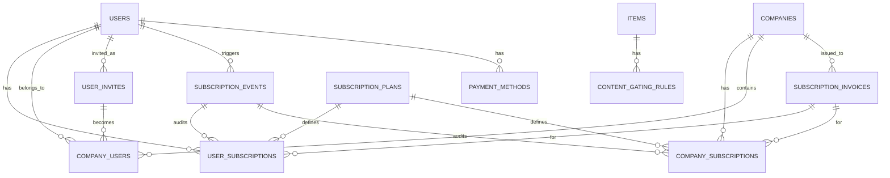

# 11bis Subscription Management System

**Version:** MVP Juillet 2026 + V1 Septembre 2026  
**Status:** 🟡 En cours de création (Phase 3)  
**Effort estimé:** 140-180h  
**Timeline:** Semaines 5-8 (Phase 3-4)

---

## 📖 Vue d'Ensemble

### Objectif Métier
Implémenter un système de gestion d'abonnements flexible permettant :
- **Apprenants individuels** : Accès au contenu par tiers (gratuit 10%, ou plans payants 1/2/3 via Stripe)
- **Apprenants entreprise** : Comptes provisionés par entreprise avec plans dédiés, gestion de comptes additionnels
- **Super Admin** : Création d'entreprises, attribution de plans, gestion des Company Managers
- **Company Manager** : Gestion des comptes utilisateurs, achat de comptes additionnels, facturation
- **Monétisation** : Modèle SaaS B2B2C (vente directe + vente par entreprise)

### Qui l'Utilise (Rôles)
- **Apprenant Individuel** : Sélectionne plan en onboarding, accès au contenu selon plan, peut acheter crédits
- **Apprenant Entreprise** : Compte créé par super admin/company manager, accès déterminé par plan entreprise
- **Company Manager** : Gère users entreprise, achète/renouvelle comptes, consulte facturation
- **Super Admin** : Crée entreprises, attribue plans, assigne Company Managers/Team Leaders
- **System** : Gestion des renouvellements automatiques, synchronisation Stripe, permission gating via TLS-Core

### Scope — IN / OUT

#### ✅ IN (MVP Juillet 2026)
- **Plans individuels** (4 types) :
  - Plan Gratuit : 10% du contenu, pas IA, possibilité acheter crédits
  - Plan 1 : Accès complet au contenu
  - Plan 2 : Accès complet + IA (chatbot, matching)
  - Plan 3 : Accès complet + IA + 1 crédit/mois
- **Plans entreprise** (base) :
  - Création par super admin : limite comptes initiaux
  - Company Manager ajoute comptes (achat additionnel)
  - Stripe recurring pour renouvellements
- **Métabox de contenu** :
  - Marquer items Formation/Veille/Parcours/Masterclass/Événements comme "gratuit"
  - Filtre FO selon plan apprenant
- **Gestion de compte** :
  - Apprenant sélectionne plan fin onboarding (déjà en CDC #3, détails ici)
  - Company Manager ajoute users (provisionning)
  - Synchronisation permissions via TLS-Core plugin
- **Paiement** :
  - WPSubscriptions Pro (€89/y) + Stripe gateway
  - Abonnement récurrent (auto-renewal)
  - Webhook Stripe pour validation paiement
- **Upgrade/Downgrade Plan** :
  - Upgrade mid-cycle : calcul prorata, paiement différence
  - Downgrade : crédit prorata (V1 implementation, approval-based)
- **Factures Téléchargeables** :
  - Generation factures basic (Stripe-hosted PDF, pas design avancée)
  - Invoice records en DB, downloadable par users
- **Dunning Management** :
  - Auto-retry paiements échoués (3 tentatives, délai exponential : 3j, 5j, 7j)
  - Dunning email templates (before retry, after final failure) — **Envoyées via Brevo SMTP** (Provider décidé en Blocker P1-36)
    - Analytics : Tracking dunning email opens/clicks (corrélation avec payment success)
    - Bounce handling : Email invalide flagged automatiquement, excluded from future dunning
    - GDPR compliance : Si user unsubscribed, pas de dunning emails envoyés (respect unsubscribe list)
  - Super Admin tracking failed payments dashboard
- **Subscription Pause & Resume** :
  - Company Manager peut "freeze" subscription temporairement
  - Suspend company users (pas accès), réactiver quand désiré
  - Audit trail pour pause/resume events
- **Données & Analytics** :
  - Synchronisation subscription data → CDC #10 dashboards
  - Tracking events (plan_selected, subscription_created, renewal, cancel, account_added, upgrade, downgrade, pause, resume)

#### ❌ OUT (V1 Septembre ou plus tard)
- Multi-currency (EUR seulement MVP)
- Usage-based billing (fixed plans MVP)
- Advanced invoice design (custom-branded templates, watermarks, multi-language — basic MVP)
- Marketplace (expert marketplace déféré, not relevant ici)
- Mobile app subscriptions (iOS/Android in-app purchases)
- Dunning webhooks (Stripe smart retries are MVP, custom webhook logic V2+)

### Dépendances Critiques

**Dépend de :**
- **CDC #3 (Onboarding)** : Plan selection flow en fin onboarding (Steps 11-12 User Journey #1a)
- **CDC #1 (Formation)** : Métabox contenu sur items Formation/Parcours/Veille
- **CDC #5 (Masterclass)** : Métabox contenu Masterclass, permission gating
- **CDC #7 (Événements)** : Métabox contenu événements, permission gating
- **CDC #10 (Analytics)** : Synchronisation subscription data, dashboards Super Admin/Company Manager
- **CDC #10bis (Back-Office)** : Screens Super Admin/Company Manager pour gestion comptes/plans

**Bloque :**
- **CDC #10 (Analytics)** : Dashboards nécessitent subscription data (super admin metrics, company manager metrics)
- **CDC #1/5/7 (Formation/Masterclass/Événements)** : Métabox content gating dépend de cette CDC

---

## 📱 Écrans à Concevoir

### Front-Office (React)

| Écran | Rôle | Description | Priorité |
|-------|------|-------------|----------|
| **Plan Selection Modal** | Apprenant Individuel | Fin d'onboarding : affiche 4 options plan (Gratuit/1/2/3), pricing, features, CTA "Sélectionner" → Stripe Checkout | P0 |
| **Plan Details Page** | Apprenant (any) | Vue complète plan actuel, features incluses, prochain renouvellement, option "Changer de plan" | P0 |
| **Stripe Checkout Embed** | Apprenant Individuel | Paiement sécurisé via Stripe, card/bank details, 3D Secure si besoin | P0 |
| **Content Gating Error** | Apprenant Gratuit | "Contenu réservé : upgrade plan ou acheter crédits", CTA "Voir plans" | P0 |
| **Account Provisionning Confirmation** | Apprenant Entreprise (nouveau) | "Votre compte a été créé par [Company Name]", plan assigné, accès disponible | P1 |

### Back-Office (WordPress Admin) — Super Admin

| Écran | Rôle | Description | Priorité |
|-------|------|-------------|----------|
| **Companies Management** | Super Admin | CRUD entreprises : créer, edit plan/max_accounts, list with active users, status | P0 |
| **Create Company** | Super Admin | Form : nom, plan (Entreprise), max_accounts initial, paiement Stripe (devis/auto), assigner Company Manager | P0 |
| **Company Details** | Super Admin | View : nom, plan, max_accounts/current_accounts, Company Manager assigné, paiement method, list des users/team leaders | P0 |
| **Company Accounts Management** | Super Admin | List users pour une entreprise, add/remove users, bulk invite, reset password, status | P1 |
| **Add Company User** | Super Admin | Form : email, role (company_manager/team_leader/learner), team assignment, send invite | P1 |

### Back-Office (React) — Company Manager

| Écran | Rôle | Description | Priorité |
|-------|------|-------------|----------|
| **Dashboard Entreprise** | Company Manager | Summary : active users, renouvellement date, comptes restants, quick links (add user, upgrade plan) | P0 |
| **Users Management** | Company Manager | List users, add/remove, bulk invite, assign teams, filter par team/status | P0 |
| **Add User** | Company Manager | Form : email, role (team_leader/learner), team, auto-send invite | P0 |
| **Subscription & Billing** | Company Manager | Plan actuel, renouvellement date, max_accounts/used, historique paiements, CTA "Acheter comptes additionnels" | P0 |
| **Buy Additional Accounts** | Company Manager | Form : nombre de comptes à ajouter, pricing transparent (X EUR par compte pour Y mois), Stripe Checkout, confirmation | P1 |
| **Invoices & History** | Company Manager | List paiements/factures, download PDF (basic, pas design avancée MVP), receipt emails | P1 |

---

## ⚙️ Fonctionnalités (MVP)

### Core
1. **Plan Selection & Onboarding** - Apprenant individuel choisit plan Gratuit/1/2/3 en fin onboarding, paiement via Stripe, subscription créée en DB
2. **Subscription Management** - Super Admin crée entreprise avec plan + max comptes, Company Manager ajoute comptes, renouvellements auto via Stripe
3. **Content Gating** - Métabox sur items Formation/Veille/Parcours/Masterclass/Événements marque "gratuit", FO filtre selon plan apprenant, edge cases gérées (IA features, crédits)
4. **Permission Gating via TLS-Core** - Plugin propriétaire applique règles d'accès selon plan utilisateur, intégration DB + REST API
5. **Account Provisioning** - Company Manager/Super Admin créent comptes avec bulk invite, utilisateurs reçoivent email avec lien setup, premier login vs account déjà créé
6. **Stripe Webhook Handling** - Paiement successful = subscription active, failed = invitation to retry, renewal = extend subscription_end_date
7. **Subscription Renewal** - Auto-renewal tous les mois pour individual plans, tous les 12 mois pour company plans (configurable)
8. **Company Accounts Upgrade** - Company Manager achète comptes additionnels via Stripe Checkout, prorate calculation pour cycle en cours
9. **Plan Upgrade Mid-Cycle** - Apprenant peut upgrade vers plan supérieur, paiement différence prorata, subscription immédiate mise à jour
10. **Dunning Management** - Auto-retry failed payments (3 tentatives avec délai exponential 3j/5j/7j), dunning email templates (pre-retry, post-failure), payment method re-attempt workflow
11. **Subscription Pause & Resume** - Company Manager peut "pause" subscription (suspend users access), puis "resume" plus tard, audit trail pour actions, notifications
12. **Invoice Download** - Factures téléchargeables (basic generation, Stripe-hosted PDF), invoice records en DB, email avec PDF, accessible via dashboard utilisateur/company manager
13. **Analytics Data Sync** - Subscription events (created, renewed, cancelled, upgraded, downgraded, paused, resumed, payment_failed, dunning_attempt) → CDC #10 dashboards, audit trail complet

### Secondary
14. **Plan Downgrade Mid-Cycle** - User downgrade plan = crédit prorata (MVP approval-based, V2+ automatic)
15. **Usage Analytics** - Dashboard pour Super Admin/Company Manager : features utilisés par plan, ROI content, engagement par tier, churn analysis

---

## 🚀 Évolutions (V1+ & V2+)

### V1 (Septembre 2026)
- **Plan Downgrade Automatic** : Plan downgrade sans intervention (MVP = manual/approval-based, V1+ = automatic with credit routing)
- **Advanced Invoice Design** : Custom-branded invoice templates, watermarks, multi-language support (MVP = basic Stripe PDF)
- **Outlook Calendar Sync** : Ajout Outlook en plus Google (liée à Coaching, affiche events réservés pour Masterclass si subscription)
- **Multi-language Pricing** : Afficher pricing dans langue de l'utilisateur (mais paiement EUR seul)

### V2 (Q1-Q2 2027)
- **Multi-Currency** : Supporter USD, GBP, CHF, CAD en plus EUR
- **Advanced Analytics** : Cohort analysis, LTV calculation, churn prediction par plan
- **Usage-Based Billing** : Credits "pay-as-you-go" pour advanced features, overage charges
- **Dunning Webhooks** : Smart Stripe dunning workflows, custom retry sequences, failure analytics

### V3+ (2027+)
- **Partner Program** : Affiliate/reseller subscriptions (discount tiers)
- **Marketplace Integration** : Vendre expert services via subscription add-on
- **Mobile App Subscriptions** : iOS/Android in-app purchase integration

---

## 👥 User Journeys (Format 3)

### User Journey #1 : Apprenant Individuel → Sélection Plan en Onboarding

**Acteur :** Apprenant individuel (nouvel utilisateur)  
**Déclencheur :** Fin d'onboarding, étape "Sélection plan & paiement"  
**Objectif :** Choisir un plan d'accès au contenu, effectuer paiement Stripe, créer subscription

#### Étapes Détaillées

1. **Apprenant arrive sur écran plan selection modal**
   - Context : Après 10-12 steps onboarding (profil, objectifs, préférences)
   - Modal ouvre : titre "Accédez au contenu Learning App"
   - Affiche 4 options plan en cards horizontales :
     - Plan Gratuit : "10% du contenu" + "Pas d'IA" + "0 EUR/mois" + "Essayer gratuitement"
     - Plan 1 : "Accès complet" + "Pas d'IA" + "29 EUR/mois" + "Sélectionner"
     - Plan 2 : "Accès complet + IA" + "49 EUR/mois" + "Populaire" badge + "Sélectionner"
     - Plan 3 : "Accès complet + IA + 1 crédit/mois" + "79 EUR/mois" + "Sélectionner"
   - Chaque card : hover effect, features détaillées au click
   - Feedback : Cards rendus instantanément (cached), transitions smooth
   - Durée : Instant

2. **Apprenant clique sur "Voir détails" pour comparer features (optional)**
   - Modal expand → affiche tableau comparatif : Plan Gratuit / Plan 1 / Plan 2 / Plan 3
   - Colonnes : "Feature", "Gratuit", "Plan 1", "Plan 2", "Plan 3"
   - Rows : "Contenu disponible", "Features IA (Chatbot)", "Features IA (Matching)", "Crédits/mois", "Support", "Prix/mois"
   - Checkmarks (✓) ou "–" ou valeur (ex "1 crédit")
   - Feedback : Tableau render ~300ms, scroll fluide si besoin
   - Durée : ~300ms

3. **Apprenant sélectionne un plan (ex Plan 2)**
   - Click sur "Sélectionner" du plan 2
   - Backend call : `/api/subscriptions/select-plan` avec plan_id=plan_2
   - Validation : plan_id existe, utilisateur non déjà subscribed
   - Feedback : Button devient "Chargement..." pendant ~500ms
   - Durée : ~500ms API call

4. **Système affiche résumé paiement avant Stripe Checkout**
   - Écran récap : "Récapitulatif de votre commande"
   - Détails :
     - Plan sélectionné : "Plan 2 - Accès Complet + IA"
     - Fréquence : "Renouvellement automatique mensuel"
     - Montant : "49 EUR/mois"
     - First payment : "49 EUR aujourd'hui"
     - Prochain renouvellement : "[Date+1mois]"
   - Conditions : Checkbox "J'accepte les conditions d'utilisation et politique de confidentialité" (required)
   - CTAs : "Procéder au paiement" (primary), "Retour aux plans" (secondary)
   - Feedback : Écran affichage instant
   - Durée : Instant

5. **Apprenant clique "Procéder au paiement"**
   - CTA validation : conditions checkbox cochée? Si non, error message "Veuillez accepter les conditions"
   - Si OK : redirect vers Stripe Checkout embed (pas nouvelle page, iframe intégré)
   - Feedback : Loading spinner pendant redirect ~300ms
   - Durée : ~300ms

6. **Stripe Checkout embed s'affiche avec paiement card**
   - Forme Stripe (hosted, secure) : email, card number, exp date, CVC
   - 3D Secure possible si issuer requires
   - Feedback : Validation real-time (card type icon, invalid input styling)
   - Durée : ~2s pour load, <1s per field validation

7. **Apprenant entre details paiement et clique "Payer maintenant"**
   - Submission au Stripe API
   - Stripe traite paiement (card auth, 3D Secure si requis)
   - Webhook reçu par backend : payment_intent.succeeded
   - Backend met à jour DB :
     - Crée/update subscription record : user_id, plan_id=plan_2, status=active, start_date=now, end_date=now+1month, stripe_subscription_id=[from Webhook], auto_renewal=true
     - Crée user_subscription_event : type=subscription_created, plan_id=plan_2, amount=49, timestamp
     - Met à jour user credits : add 0 crédits (plan 2 = 0 crédits/mois, plan 3 seul a 1)
   - Feedback : Stripe form close, redirect vers "Merci" page ~2-3s
   - Durée : ~3-5s (API call + processing + redirect)

8. **Apprenant voir page "Bienvenue à bord" confirmation**
   - Affiche : "Paiement réussi !"
   - Détails :
     - "Votre subscription Plan 2 est maintenant active"
     - "Renouvellement : [date+1mois]"
     - "Vous pouvez maintenant accéder au contenu complet + IA"
   - CTA primary : "Commencer à explorer le contenu"
   - CTA secondary : "Voir ma subscription"
   - Email confirmation envoyé (async) avec receipt Stripe
   - Feedback : Confetti animation, success message toast top
   - Durée : Instant (page load ~500ms)

#### Conditions de Succès ✅
- [ ] Tous 4 plans affichés avec pricing/features corrects
- [ ] Plan selection crée subscription record en DB
- [ ] Stripe paiement traité sans error
- [ ] Webhook reçu et DB mis à jour atomiquement
- [ ] Email confirmation envoyé après paiement
- [ ] User peut accéder contenu selon plan immédiatement après
- [ ] Crédits initialisés (0 pour plan 1/2, 1 pour plan 3)
- [ ] Pas de double payment (idempotency Stripe)
- [ ] Subscription auto-renewal configuré

#### Erreurs & Edge Cases ❌

**Cas 1 : Plan Gratuit sélectionné**
- Scénario : Apprenant clique "Essayer gratuitement" sur Plan Gratuit
- Comportement attendu :
  - Step 3-4 skippées (pas de paiement)
  - Étape 4 alt : système affiche "Plan Gratuit sélectionné"
  - Message : "Vous accédez à 10% du contenu. Upgrade pour déverrouiller la suite."
  - Backend : créé subscription record avec status=active, plan_id=plan_gratuit, stripe_subscription_id=null, amount=0
  - Crédits : 0
  - Feedback : Immediate confirmation, redirect vers dashboard apprenant
- Impact : ~30 secondes total, pas de paiement

**Cas 2 : Paiement échoué (carte refusée)**
- Scénario : Apprenant entre card refusée par Stripe (insufficient funds, lost card, etc.)
- Comportement attendu :
  - Stripe retourne error code (card_declined, etc.)
  - Frontend affiche message d'erreur : "Votre paiement a échoué. Raison : [code], Réessayer ou changer de méthode"
  - Bouton "Réessayer" → reste sur Stripe form, peut réenter card
  - Bouton "Changer de plan" → retour aux 4 plans selection
  - Backend : crée event (type=payment_failed, plan_id=plan_2, error_code=card_declined)
  - Subscription NOT créée
  - Feedback : Error message rouge, suggestions claires
- Impact : Apprenant doit retry ou changer plan

**Cas 3 : Apprenant déjà subscribed (retry onboarding)**
- Scénario : User avait déjà sélectionné Plan 1 hier, aujourd'hui ouvre onboarding again
- Comportement attendu :
  - Backend détecte existing active subscription (user_id exists en user_subscriptions)
  - Affiche message : "Vous avez déjà une subscription active (Plan 1). Cliquer ici pour gérer"
  - Option "Changer de plan" → redirect vers plan upgrade flow (V1 feature)
  - Option "Continuer onboarding" → skip plan selection, aller au step suivant
  - Feedback : Clear warning, no payment form shown
- Impact : ~10 secondes, pas de double subscription

**Cas 4 : Timeout Stripe Checkout**
- Scénario : Apprenant porte payment details mais Stripe Checkout plante/timeout
- Comportement attendu :
  - Après 10s timeout : affiche fallback "Paiement en cours... S'il vous plaît ne pas rafraîchir"
  - Webhook Stripe arrive tout de même (asynchrone)
  - Backend gère webhook : payment réussi → subscription créée même si FO crashé
  - User peut vérifier statut : GET `/api/subscriptions/status` → "active"
  - Feedback : Graceful error, not Lost transaction
- Impact : Apprenant doit retry ou check statut manuellement

**Cas 5 : Currency mismatch**
- Scénario : Frontend affiche EUR mais Stripe webhook arrive en USD (data discrepancy)
- Comportement attendu :
  - Stripe webhook toujours "source of truth"
  - Backend vérifie : stripe_subscription.currency == 'eur', amount == 4900 (in cents)
  - Si mismatch : log error, alert devops, BUT subscription créée anyway (money taken, can't reverse)
  - User voit EUR 49 en dashboard (matched avec plan definition)
  - Email receipt montre exact Stripe currency
  - Feedback : Transparent, no confusion to user
- Impact : Accounting catch, not user-facing normally

**Cas 6 : Apprenant clique retour brower pendant paiement**
- Scénario : User en Stripe Checkout, clique back button brower
- Comportement attendu :
  - Retour à plan selection page
  - Message : "Paiement interrompu, vous pouvez réessayer quand vous voulez"
  - Stripe payment_intent créé mais NOT complété (ne sera jamais chargé)
  - Backend peut cleanup : delete abandoned payment_intents après 1h TTL
  - Subscription NOT créée
  - Feedback : No charge, clear message, easy retry
- Impact : ~5 secondes, aucun dommage

---

### User Journey #2 : Company Manager → Ajouter Comptes Additionnels

**Acteur :** Company Manager (utilisateur existant)  
**Déclencheur :** Dashboard entreprise, click "Ajouter comptes" ou "Acheter comptes supplémentaires"  
**Objectif :** Acheter X comptes additionnels pour l'entreprise, paiement Stripe, provisionner users

#### Étapes Détaillées

1. **Company Manager accède Dashboard Entreprise**
   - Page affiche : nom entreprise, plan actuel, max_accounts=50, current_accounts=32, comptes_restants=18
   - Cards affichent :
     - "Utilisateurs actifs : 32"
     - "Renouvellement : [Date]"
     - "Comptes restants : 18"
   - CTA primary : "Ajouter des utilisateurs"
   - CTA secondary : "Acheter comptes supplémentaires"
   - Feedback : Dashboard load ~800ms, data cached (refresh possible)
   - Durée : ~800ms

2. **Company Manager clique "Acheter comptes supplémentaires"**
   - Navigation vers page "Achat comptes additionnels"
   - Affiche form : "Combien de comptes voulez-vous ajouter ?"
   - Input field : nombre (ex 20), slider 1-100
   - Pricing transparent :
     - "Prix par compte : [calculé basé sur plan entreprise]"
     - Exemple : "Plan Entreprise standard = 45 EUR/compte/an"
     - Input 20 comptes → "Coût total : 900 EUR"
     - Proration displayed : "Période restante : [X mois], Montant proraté : [Y EUR]"
   - CTAs : "Continuer vers paiement", "Annuler"
   - Feedback : Form fields interactive, pricing update real-time au input change
   - Durée : Instant

3. **Company Manager entre nombre (ex 20) et clique "Continuer"**
   - Form validation : nombre between 1-100, positive integer
   - Backend call : `/api/company/calculate-upgrade-cost` avec company_id, add_accounts=20
   - Backend calcule :
     - Plan pricing: 45 EUR/compte/an
     - Période restante : 8 mois (renouvelle en 4 mois, reste 8 avant next renewal)
     - Proration : (45 EUR / 12 months) * 8 months = 30 EUR par compte
     - Total : 20 * 30 = 600 EUR
   - Response : { total_price: 600, currency: 'eur', proration_breakdown: {...}, new_max_accounts: 70 }
   - Feedback : Résumé affichage ~500ms, total pricing clear
   - Durée : ~500ms API call

4. **Système affiche résumé avant Stripe Checkout**
   - Écran "Confirmer achat comptes additionnels"
   - Détails :
     - "Comptes à ajouter : 20"
     - "Plan : [Plan Entreprise standard]"
     - "Prix unitaire : 45 EUR/compte/an"
     - "Période restante : 8 mois"
     - "Coût proraté : 30 EUR/compte"
     - "Coût total : 600 EUR"
     - "Vous aurez : 50 (actuel) + 20 (nouveau) = 70 comptes max"
   - Checkbox : "Je confirme cette commande"
   - CTA : "Procéder au paiement", "Retour"
   - Feedback : Totaux transparents, no surprises
   - Durée : Instant

5. **Company Manager confirme et clique "Procéder au paiement"**
   - Validation checkbox
   - Redirect vers Stripe Checkout (similaire à User Journey #1, Step 5-6)
   - Context : Company Manager peut payer via card ou compte entreprise si enregistré
   - Feedback : Loading spinner, ~300ms
   - Durée : ~300ms

6. **Stripe Checkout process**
   - Même que Journey #1 Steps 6-7
   - Durée : ~3-5s

7. **Paiement successful → Webhook traité**
   - Stripe webhook : payment_intent.succeeded
   - Backend mise à jour :
     - Update company record : max_accounts = 70 (ancien 50 + 20)
     - Create company_subscription_event : type=accounts_purchased, quantity=20, cost=600, timestamp
     - Create subscription invoice record pour facturation (basic, downloadable V1+)
   - Trigger async : email confirmation à Company Manager avec receipt + facture + breakdown proraté
   - Feedback : Redirect vers "Achat confirmé" page ~2-3s
   - Durée : ~2-3s

8. **Company Manager voit confirmation**
   - Affiche : "Achat confirmé !"
   - Détails :
     - "20 comptes supplémentaires ont été ajoutés"
     - "Vos comptes max passent de 50 à 70"
     - "Vous avez 50 comptes restants disponibles"
     - "Prochaine facturation : [date renouvellement+8mois]"
   - CTA : "Ajouter des utilisateurs" (quick link), "Voir dashboard", "Retour"
   - Email async en arrière-plan avec receipt Stripe
   - Feedback : Success message, clear next steps
   - Durée : Instant

#### Conditions de Succès ✅
- [ ] Pricing calculation correct (prorata par mois)
- [ ] Stripe paiement traité
- [ ] Company max_accounts mis à jour
- [ ] Email confirmation envoyé avec receipt et breakdown
- [ ] Company Manager peut immédiatement ajouter des users (max_accounts=70, current=32, available=38)
- [ ] Audit trail créé (subscription_event)
- [ ] Pas de double payment

#### Erreurs & Edge Cases ❌

**Cas 1 : Nombre invalide saisi**
- Scénario : Company Manager saisit 0, 101, ou chaîne de caractères au lieu du nombre
- Comportement attendu :
  - Frontend validation : min 1, max 100, numbers only
  - Error message inline : "Veuillez entrer un nombre entre 1 et 100"
  - Input field highlight red
  - Button "Continuer" disabled until correction
  - Feedback : Instant
- Impact : Pas d'appel API, user retrie facilement

**Cas 2 : Max accounts limit atteint**
- Scénario : Company Manager veut ajouter 50 comptes, mais system max est 500 (impossible dépasser)
- Comportement attendu :
  - Frontend slider/input limité à max 500 total
  - Message : "Limite max de l'entreprise : 500 comptes. Vous avez 50, pouvez ajouter jusque 450"
  - Input max=450 affiché
  - Feedback : Transparent limit, no error
- Impact : Ajoute 450 au lieu de 50

**Cas 3 : Paiement échoué (Stripe error)**
- Même que Journey #1 Cas 2
- Comportement attendu :
  - Company Manager peut retry (reste sur page paiement)
  - Ou retour pour changer montant
  - Subscription upgrade NOT appliquée tant que paiement pas successful
- Impact : ~3-5 minutes, aucun changement DB

**Cas 4 : Company Manager sans permission (lowered role)**
- Scénario : User initialement Company Manager, but Super Admin retire permission
- Comportement attendu :
  - Backend checks : is user.role == 'company_manager' for company_id ?
  - Si non : 403 Forbidden, message "Vous n'avez pas permission pour cette action"
  - FO hides "Acheter comptes" button (if role checked on load)
  - Feedback : Clear error, no confusion
- Impact : Pas d'accès, utilisateur comprend raison

**Cas 5 : Subscription en expiration imminente**
- Scénario : Company subscription expire dans 2 jours (renouvellement pas encore traité)
- Comportement attendu :
  - Purchase allowed (Stripe traite avant expiration)
  - Backend détecte : current_date + 2j > subscription_end_date
  - Message warning : "⚠️ Votre subscription expire bientôt. Ce paiement est fortement recommandé."
  - Paiement successful → allonge subscription_end_date par 12 mois (standard renewal cycle)
  - Feedback : Warning visible, but transaction allowed
- Impact : Apprenant reste actif après renouvellement

**Cas 6 : Duplicate request (race condition)**
- Scénario : Company Manager clique "Procéder au paiement" 2x rapidement
- Comportement attendu :
  - Frontend : button disabled après first click until response
  - Backend idempotency : stripe_idempotency_key = hash(company_id, request_timestamp, amount)
  - Stripe rejects 2nd request avec same key (idempotent API)
  - Only one Webhook processed
  - DB update happens once only
  - Feedback : Button shows "Traitement..." then "Confirmé"
- Impact : Pas de double charge

---

### User Journey #3 : Super Admin → Créer Entreprise avec Plan Entreprise

**Acteur :** Super Admin  
**Déclencheur :** Dashboard super admin, click "Créer nouvelle entreprise"  
**Objectif :** Créer compte entreprise, assigner plan entreprise, définir max comptes initiaux, assigner Company Manager

#### Étapes Détaillées

1. **Super Admin accède section "Entreprises"**
   - Page affiche : list entreprises (sortées par création date, avec filtres)
   - Chaque card : nom, plan, active users, renouvellement date, actions (edit, delete, manage users)
   - CTA primary : "Créer nouvelle entreprise"
   - Feedback : List load ~1s (paginated si >50 companies)
   - Durée : ~1s

2. **Super Admin clique "Créer nouvelle entreprise"**
   - Modal ouvre : "Créer une entreprise"
   - Form fields :
     - "Nom de l'entreprise" (text input, required)
     - "Pays" (select, default France)
     - "Secteur" (select : Tech, Finance, Education, Santé, etc.)
     - "Nombre de comptes initial" (number input, 1-100, default 10)
     - "Plan Entreprise" (select : Standard, Premium, Custom — détails pricing)
     - "Company Manager assigné" (dropdown/search utilisateur existant ou email nouveau)
     - "Valider les conditions" (checkbox)
   - Détails pricing affichés : "Plan Standard = 45 EUR/compte/an = 450 EUR/an pour 10 comptes"
   - Feedback : Form fields interactive, pricing update real-time
   - Durée : ~500ms

3. **Super Admin remplit form**
   - Exemples :
     - Nom : "Tech Innovations SAS"
     - Pays : "France"
     - Secteur : "Tech"
     - Comptes initiaux : 25
     - Plan : "Standard" (45 EUR/compte/an)
     - Company Manager : "marie.dupont@email.com" (dropdown suggestion si existe, ou invite nouveau)
   - Auto-calculation : "Coût premier paiement : 1125 EUR (25 comptes * 45 EUR)"
   - Validation règles : nom non-vide, comptes 1-100, Company Manager assigned
   - Feedback : Suggestions real-time pour Company Manager email (si existe en système)
   - Durée : ~2-3 minutes (human input)

4. **Super Admin valide form et clique "Créer"**
   - Frontend validation : tous fields requis complétés
   - Backend call : `/api/super-admin/create-company` avec payload :
     ```
     {
       "name": "Tech Innovations SAS",
       "country": "FR",
       "sector": "tech",
       "max_accounts": 25,
       "plan_id": "plan_enterprise_standard",
       "company_manager_email": "marie.dupont@email.com"
     }
     ```
   - Feedback : Button "Création en cours..." ~500ms
   - Durée : ~500ms + API processing

5. **Backend processe création**
   - Validation :
     - plan_id existe dans DB
     - max_accounts between 1-500
     - company_manager_email valide (check format)
   - DB transactions :
     - Create company record : id, name, country, sector, max_accounts=25, current_accounts=0, plan_id=plan_enterprise_standard, status=active, created_at=now
     - If Company Manager exists (user_id) : link user to company avec role=company_manager
     - If Company Manager doesn't exist : create pending invite, send email invite (lien signup)
     - Create company_subscription record : company_id, plan_id, status=pending_payment, created_at=now
     - Create company_subscription_event : type=company_created, amount=1125 (initial payment pending)
   - Email async : send "Entreprise créée" to Super Admin (confirmation), and "Vous êtes assigné Company Manager" to Company Manager
   - Feedback : Response JSON avec company_id, status="pending_payment", next_step="payment"
   - Durée : ~1-2s

6. **Super Admin voit écran "Paiement entreprise"**
   - Affiche détails :
     - "Entreprise créée : Tech Innovations SAS"
     - "Plan : Standard (25 comptes)"
     - "Coût initial : 1125 EUR"
     - "Prochaine facturation : [date+1an]"
     - "Company Manager : marie.dupont@email.com"
   - CTAs : "Procéder au paiement", "Retour", "Continuer sans payer (admin seulement)" (pour demo)
   - Feedback : Clear summary, next steps
   - Durée : Instant

7. **Super Admin clique "Procéder au paiement"**
   - Redirect vers Stripe Checkout (similaire Journeys #1/#2)
   - Context : Super Admin peut payer via corporate card ou bank account
   - Durée : ~3-5s (Stripe processing)

8. **Paiement successful**
   - Webhook : payment_intent.succeeded
   - Backend updates :
     - company_subscription.status = active
     - company_subscription.stripe_subscription_id = [from Stripe]
     - company_subscription.subscription_end_date = now + 12 months
     - company.status = active (already was, just confirm)
   - Email : "Entreprise activée, paiement reçu" to Super Admin
   - Email : "Bienvenue Company Manager" to marie.dupont@email.com avec lien dashboard
   - Feedback : "Entreprise activée !" page avec next steps
   - Durée : ~2-3s

9. **Confirmation & Next Steps**
   - Affiche : "Entreprise créée et activée !"
   - Details:
     - "Entreprise : Tech Innovations SAS"
     - "Company Manager : marie.dupont@email.com"
     - "Comptes disponibles : 25"
     - "Renouvellement automatique : [date+1an]"
   - CTAs : "Ajouter utilisateurs", "Voir dans dashboard", "Créer autre entreprise"
   - Feedback : Success confirmation, easy next actions
   - Durée : Instant

#### Conditions de Succès ✅
- [ ] Company record créé avec toutes fields
- [ ] Stripe paiement traité avec montant correct (25 * 45 = 1125)
- [ ] Company Manager assigné et notifié
- [ ] Subscription record créé avec status=active et stripe_subscription_id
- [ ] Emails confirmations envoyés à Super Admin et Company Manager
- [ ] Company Manager peut immédiatement ajouter 25 utilisateurs
- [ ] Renouvellement auto configuré pour +1an

#### Erreurs & Edge Cases ❌

**Cas 1 : Company Manager email invalid**
- Scénario : Super Admin saisit "marie.invalid-email" (pas @ valid)
- Comportement attendu :
  - Frontend validation : regex email check
  - Error message : "Email invalide"
  - Input field highlight red
  - Button disabled until fixed
- Impact : ~10 secondes, user retrie

**Cas 2 : Company Manager doesn't exist in system**
- Scénario : Email "new.manager@external.com" saisie, n'existe pas en DB
- Comportement attendu :
  - Backend détecte : no user record found
  - Create pending invite : invite_token, invite_email, status=pending
  - Email sent : "Vous êtes assigné Company Manager pour [Company Name]" + link signup
  - Invite valid pour 30 jours
  - Company créée avec company_manager_id=null initially, set after invite accepted
  - Feedback : Message "Email d'invitation envoyé à [email]"
- Impact : Company créée, Company Manager doit accepter invite pour activer

**Cas 3 : Plan inexistant sélectionné**
- Scénario : Attaque: POST avec plan_id="invalid_plan"
- Comportement attendu :
  - Backend validation : plan_id dans list valid plans
  - Reject : 400 Bad Request, message "Plan invalide"
  - DB transaction rollback (aucun company créé)
  - Log incident (potential attack)
  - Feedback : Error message to Super Admin, form reset
- Impact : Pas de company créée, sécurité maintenue

**Cas 4 : Paiement échoué**
- Même que Journey #1 Cas 2
- Comportement attendu :
  - Company record créé mais status=pending_payment
  - Company Manager peut pas ajouter users (status check)
  - Super Admin peut retry paiement
  - After 7 jours sans paiement : company status=suspended, message d'alert
- Impact : Company créée mais non-active jusque paiement

---

### User Journey #4 : Company Manager → Ajouter Utilisateurs à l'Entreprise

**Acteur :** Company Manager  
**Déclencheur :** Dashboard, click "Ajouter utilisateurs"  
**Objectif :** Ajouter un ou plusieurs utilisateurs à l'entreprise via single invite ou bulk CSV

#### Étapes Détaillées

1. **Company Manager accède page "Ajouter utilisateurs"**
   - Page affiche deux options : 
     - "Ajouter un utilisateur" (single form)
     - "Importer en masse (CSV)" (bulk form)
   - Single add form fields : email, first_name, last_name, role (team_leader/learner), team (select from company teams)
   - Feedback : Page load ~500ms
   - Durée : ~500ms

2. **Company Manager saisit email nouveau user (ex jean@company.fr)**
   - Form validation : email format, not already exists en company
   - Auto-check : backend checks `user` table, if email exists globalement → warning "Cet utilisateur existe déjà, un nouveau compte sera lié à cette entreprise"
   - Feedback : Real-time validation feedback
   - Durée : Instant

3. **Company Manager complète form**
   - First name : "Jean"
   - Last name : "Martin"
   - Role : "Team Leader"
   - Team : "Equipe 1"
   - CTAs : "Envoyer invitation", "Annuler"
   - Feedback : Form fields interactive
   - Durée : ~1-2 minutes (human input)

4. **Company Manager clique "Envoyer invitation"**
   - Frontend validation : tous fields requis
   - Backend call : `/api/company/invite-user` avec payload :
     ```
     {
       "email": "jean@company.fr",
       "first_name": "Jean",
       "last_name": "Martin",
       "role": "team_leader",
       "team_id": "team_1"
     }
     ```
   - Backend process :
     - Check : company_manager_id can access this company (authorization)
     - Check : max_accounts not exceeded (current_accounts < max_accounts)
     - If email exists globally (user.email) :
       - Get user_id
       - Check if already linked to company (company_users record exists) → if yes, error "User already in company"
       - If no → create company_users record : user_id, company_id, role, team_id, status=active
       - Send email "Vous avez été ajouté à [Company]"
     - If email doesn't exist :
       - Create user_invite record : invite_token, email, first_name, last_name, company_id, role, team_id, status=pending, expires_at=now+30days
       - Send email "Vous êtes invité à rejoindre [Company]" + link signup avec pre-fill first_name, last_name
   - Feedback : Button "Invitation en cours..." ~500ms
   - Durée : ~500ms + API

5. **Invitation email sent (async)**
   - Email to jean@company.fr :
     - Subject : "Vous êtes invité à [Company Name]"
     - Body : "Bienvenue sur Learning App. Cliquez pour rejoindre : [lien + token]"
     - Lien valid 30 jours
   - Durée : <1 second (async queue)

6. **Company Manager voit confirmation**
   - Affiche : "Invitation envoyée à jean@company.fr"
   - Message : "Utilisateur recevra email d'invitation. Vérifier acceptance dans 24-48h."
   - CTAs : "Ajouter autre utilisateur", "Voir liste utilisateurs"
   - Feedback : Success message, next steps clear
   - Durée : Instant

7. **Alternative : Bulk invite via CSV**
   - Company Manager clique "Importer en masse"
   - Modal upload CSV :
     - Template :
       ```
       email,first_name,last_name,role,team
       jean1@company.fr,Jean,Martin,team_leader,Equipe 1
       marie1@company.fr,Marie,Dupont,learner,Equipe 1
       pierre1@company.fr,Pierre,Lefevre,learner,Equipe 2
       ```
     - Validation : column names required, role must be team_leader/learner, team must exist, email format valid
     - Drag-drop ou file picker
   - CTA : "Importer" (processes all rows)
   - Feedback : Progress bar durante processing, results summary après
   - Durée : ~2-3s per 100 rows

8. **Bulk import processing**
   - Backend processes chaque row :
     - Validation per row : email, role, team
     - For each valid row : same as Step 4 (create user_invite or link existing user)
     - For invalid rows : collect errors, return summary avec failures
   - Response : "Importation complétée. 47 invitations envoyées. 3 erreurs (voir détails)"
   - Erreurs affichées : "Ligne 5 : email invalide", "Ligne 10 : équipe non-existante"
   - Feedback : Clear success + error summary
   - Durée : ~3-5s

#### Conditions de Succès ✅
- [ ] Single invite sends email avec lien setup
- [ ] Bulk CSV imports et envoie emails en batch
- [ ] Utilisateurs existants linkés à company immédiatement
- [ ] New utilisateurs can accept invite et create account
- [ ] Role et team assignés correctement
- [ ] Company max_accounts validation respected
- [ ] Email notifications sent
- [ ] Audit trail créé pour chaque addition

#### Erreurs & Edge Cases ❌

**Cas 1 : Utilisateur déjà exists dans company**
- Scénario : Jean exists en DB et est déjà lié à cette company
- Comportement attendu :
  - Backend détecte : company_users record exists pour (company_id, user_id)
  - Error : "Jean est déjà membre de [Company]"
  - No email sent, no duplicate account
  - Feedback : Clear error message
- Impact : ~5 secondes, user retrie avec autre email

**Cas 2 : Max accounts dépassé**
- Scénario : Company a max_accounts=10, current_accounts=10, user veut ajouter 1
- Comportement attendu :
  - Backend détecte : current_accounts >= max_accounts
  - Error : "Vous avez atteint la limite de comptes (10/10). Acheter des comptes additionnels pour continuer."
  - CTA : "Acheter comptes" (link to Journey #2)
  - No user ajouté, no email
  - Feedback : Clear limit, easy upgrade path
- Impact : ~10 secondes, user complet upgrade puis retry

**Cas 3 : CSV malformé**
- Scénario : CSV uploaded sans header ou colonnes manquantes
- Comportement attendu :
  - Frontend ou backend validation : check headers (email, first_name, last_name, role, team)
  - Error : "Format CSV invalide. Télécharger template et réessayer."
  - Button "Télécharger template" : génère CSV example correct
  - No import attempted
  - Feedback : Clear error, help provided
- Impact : ~30 secondes (download template, fix format, retry)

**Cas 4 : Email already exists, but assigned à autre company**
- Scénario : jean@company.fr exists en DB linked to Company A, Company Manager B tries invite same email
- Comportement attendu :
  - Backend détecte : user.email exists, user linked to different company (company_id != current)
  - Allowed action : create separate company_users link (user can belong to multiple companies)
  - Send email : "Vous avez été ajouté à [Company B]. Vous êtes maintenant membre de 2 entreprises."
  - Dashboard shows both companies au prochain login
  - Feedback : Success, multi-company context explained
- Impact : Jean a maintenant accès à 2 companies

**Cas 5 : Invite expires sans acceptance**
- Scénario : Invite sent 35 jours ago, invite_token expired
- Comportement attendu :
  - User clicks lien in old email
  - Backend détecte : invite_token.expires_at < now
  - Error : "Lien d'invitation expiré. Contactez votre manager pour nouvelle invitation."
  - CTA : "Envoyer nouveau lien" (if manager-facing) ou "Contacter support"
  - Original invite record can be deleted (cleanup après 90 jours)
  - Feedback : Clear expiry message, recovery path
- Impact : ~5 minutes (new invite sent)

---

### User Journey #5 : Apprenant → Upgrade Plan Mid-Cycle

**Acteur :** Apprenant avec subscription active (ex Plan 1)  
**Déclencheur :** Dashboard > "Mon abonnement" > click "Changer de plan"  
**Objectif :** Upgrader vers plan supérieur, payer différence prorata, accès immédiat aux nouvelles features

#### Étapes Détaillées

1. **Apprenant accède dashboard "Mon Abonnement"**
   - Affiche : plan actuel (Plan 1), prix (29 EUR/mois), end_date, features incluses
   - CTA : "Changer de plan" → ouvre modal "Sélectionner nouveau plan"
   - Feedback : Page load instant, modal smooth
   - Durée : Instant

2. **Modal affiche options upgrade disponibles**
   - Grayed-out options : Plan 1 (current), Plan Gratuit (downgrade, V1+)
   - Available upgrades : Plan 2 (Upgrade), Plan 3 (Upgrade)
   - Chaque card affiche : prix, features, badge "Upgrade" + info "Paiement X EUR pour [Y jours restants]"
   - Click plan → affiche détails + pricing calc
   - Feedback : Real-time pricing update
   - Durée : Instant

3. **Apprenant sélectionne Plan 2 (49 EUR/mois)**
   - Backend call : `/api/subscriptions/calculate-upgrade-cost` avec new_plan_id=plan_2
   - Backend calcule proration :
     - Plan 1 : 29 EUR/mois, fin subscription dans 18 jours (reste 6 jours du mois)
     - Plan 2 : 49 EUR/mois, fin subscription dans 18 jours
     - Proration : (49-29) EUR = 20 EUR for 6 days = ~4 EUR
     - Actual charge : 4 EUR (upgrade fee proraté)
   - Response : { upgrade_cost: 4, new_plan: plan_2, credit_applied: 0 }
   - Feedback : Pricing displayed, ~500ms
   - Durée : ~500ms

4. **Écran récap avant paiement**
   - Affiche :
     - Plan actuel : "Plan 1 - 29 EUR/mois"
     - Nouveau plan : "Plan 2 - 49 EUR/mois"
     - Période restante : "6 jours"
     - Montant à payer : "4 EUR (proraté)"
     - Fin subscription : "[Même date que Plan 1, pas changement]"
   - Checkbox : "Valider upgrade"
   - CTAs : "Procéder au paiement", "Annuler"
   - Feedback : Clear summary
   - Durée : Instant

5. **Apprenant clique "Procéder au paiement"**
   - Redirect vers Stripe Checkout (similaire journeys précédentes)
   - Durée : ~3-5s

6. **Paiement successful → Webhook + upgrade**
   - Webhook : payment_intent.succeeded
   - Backend updates :
     - Update user_subscription : plan_id = plan_2, features updated
     - Create subscription_event : type=plan_upgraded, old_plan=plan_1, new_plan=plan_2, amount=4
   - Feedback : "Upgrade confirmé !" page, avec accès immédiat à Plan 2 features
   - Durée : ~2-3s

#### Conditions de Succès ✅
- [ ] Proration calc correct (pro-rata par jour restant)
- [ ] Paiement traité pour montant proraté
- [ ] Plan changé immédiatement, pas d'attente renouvellement
- [ ] Features Plan 2 accessibles (IA, etc.) immédiatement
- [ ] Subscription end_date reste identique (pas affected)
- [ ] Email confirmation avec receipt

#### Erreurs & Edge Cases ❌

**Cas 1 : Plan Downgrade sélectionné (AUTOMATIC, no credit MVP)**
- Scénario : Apprenant veut downgrade de Plan 2 (49 EUR/mois) vers Plan 1 (29 EUR/mois)
- Comportement attendu (MVP) : 
  - Downgrade AUTORISÉ immédiatement, pas de crédit prorata
  - Message : "Downgrade confirmé. Vous accédez à Plan 1 à partir de maintenant. Prochain renouvellement : [date]. Vous serez facturé 29 EUR/mois."
  - Plan basculé immédiatement (perte d'IA features si existaient)
  - Subscription end_date inchangée (renouvellement à même date)
  - Pas de remboursement pour différence (Plan 2 → Plan 1, différence 20 EUR perdue)
  - Feedback : Clear warning "Vous perdrez accès à [features Plan 2]" before confirmation
  - Email confirmation envoyé
  - Note : NO prorated credit refund, apprenant perd montant différence

**Cas 2 : Paiement échoué sur upgrade**
- Scénario : Carte refusée lors upgrade
- Comportement attendu :
  - Error message avec retry option
  - Plan reste inchangé (Plan 1)
  - Notification : "Upgrade échoué, veuillez réessayer"

---

### User Journey #6 : Company Manager → Pause/Resume Subscription

**Acteur :** Company Manager  
**Déclencheur :** Dashboard Entreprise > "Options" > "Mettre en pause"  
**Objectif :** Pause temporaire subscription (freeze users), puis resume quand ready

#### Étapes Détaillées

1. **Company Manager accède Dashboard Entreprise**
   - Affiche status : "Active", renouvellement date, users actifs
   - Section "Options" avec CTA : "Mettre en pause (...)  Reprendre"
   - Feedback : Instant
   - Durée : Instant

2. **Company Manager clique "Mettre en pause"**
   - Modal ouvre : "Pause subscription"
   - Message : "Les utilisateurs seront suspendus (pas accès) mais restent dans le système"
   - Form : "Raison de pause" (optional select : budget reduction, no longer needed, temporary, other)
   - Checkbox : "J'comprends que les users seront suspendus"
   - CTAs : "Confirmer pause", "Annuler"
   - Feedback : Clear confirmation
   - Durée : Instant

3. **Company Manager confirme pause**
   - Backend call : `/api/company/pause-subscription` avec company_id, reason
   - Backend actions :
     - Update company_subscription : status = paused, paused_at = now
     - Update all company_users : status = suspended (or access_level = 0)
     - Create subscription_event : type=subscription_paused, reason=[...]
     - Send email to Company Manager : "Subscription paused. X users suspended."
     - Email to all company users : "Your access has been suspended by [Company]"
   - Feedback : "Subscription paused !" confirmation
   - Durée : ~500ms

4. **Users experience suspension**
   - When they try to login : message "Your access has been suspended by [Company]. Contact your manager."
   - Dashboard shows : "Subscription paused since [date]"
   - No content access, no function available
   - Feedback : Clear message, no confusion

5. **Company Manager resumes later**
   - Dashboard shows : "Subscription: Paused" + CTA "Reprendre"
   - Click "Reprendre" → confirmation modal
   - Message : "Restoration will re-activate X users"
   - Checkbox : "Confirmer"
   - CTAs : "Reprendre subscription", "Annuler"
   - Durée : Instant

6. **Resume processing**
   - Backend call : `/api/company/resume-subscription` avec company_id
   - Backend actions :
     - Update company_subscription : status = active, paused_at = null
     - Update all company_users : status = active (restore previous status)
     - Create subscription_event : type=subscription_resumed
     - Send email to Company Manager + users : "Subscription resumed"
   - Feedback : "Subscription active again !" 
   - Durée : ~500ms

#### Conditions de Succès ✅
- [ ] Pause stops user access immediately
- [ ] Users notified of suspension
- [ ] Resume restores access immediately
- [ ] Audit trail logged (pause/resume events)
- [ ] Billing continues during pause (still charges EUR even if paused)
- [ ] Email notifications sent to all stakeholders

#### Erreurs & Edge Cases ❌

**Cas 1 : Resume after pause expires**
- Scénario : Subscription paused, but renewal date passes while paused
- Comportement attendu :
  - Renewal still processes (Stripe auto-renewal)
  - Subscription status = paused → active (renewel)
  - Company notified : "Subscription renewed while paused"
  - Users still suspended until manual resume

**Cas 2 : Company downgrade during pause**
- Scénario : Pause subscription, then downgrade plan during pause
- Comportement attendu :
  - Downgrade allowed
  - New plan pricing applies to next renewal (after resume + next cycle)
  - No impact on paused state

---

## 🗄️ Modèle de Données

### Entités Principales

#### 1. **companies** (Entreprises)
| Colonne | Type | Description |
|---------|------|-------------|
| `id` | UUID | Primary key |
| `name` | String(255) | Nom de l'entreprise |
| `country` | String(2) | Code ISO pays (ex "FR", "US") |
| `sector` | String(50) | Secteur (tech, finance, education, santé, etc.) |
| `plan_id` | UUID | FK → subscription_plans(id), plan enterprise assigné |
| `max_accounts` | Integer | Nombre max de comptes autorisés |
| `current_accounts` | Integer | Nombre d'utilisateurs actifs liés à cette company |
| `status` | Enum | active / suspended / cancelled / pending_payment |
| `created_at` | DateTime | Timestamp création |
| `updated_at` | DateTime | Last update |
| `deleted_at` | DateTime | Soft delete timestamp |

#### 2. **user_subscriptions** (Abonnements utilisateur)
| Colonne | Type | Description |
|---------|------|-------------|
| `id` | UUID | Primary key |
| `user_id` | UUID | FK → users(id) |
| `plan_id` | UUID | FK → subscription_plans(id), plan sélectionné |
| `previous_plan_id` | UUID | FK → subscription_plans(id) [nullable], ancien plan avant upgrade |
| `status` | Enum | active / pending / cancelled / expired / paused |
| `start_date` | DateTime | Date début subscription |
| `end_date` | DateTime | Date fin subscription (ex +1 month for monthly plans) |
| `upgraded_at` | DateTime | Timestamp last upgrade [nullable] |
| `auto_renewal` | Boolean | true = renewal automatique, false = one-time |
| `stripe_subscription_id` | String | ID Stripe subscription (recurring) |
| `stripe_customer_id` | String | ID Stripe customer (pour factures, méthodes de paiement) |
| `payment_method_id` | String | ID Stripe PaymentMethod (card/bank) |
| `dunning_attempt_count` | Integer | Nombre de tentatives de recouvrement (0 = no failures) |
| `last_dunning_attempt_at` | DateTime | Timestamp dernière tentative recouvrement [nullable] |
| `created_at` | DateTime | Timestamp création |
| `updated_at` | DateTime | Last update |

#### 3. **company_subscriptions** (Abonnements entreprise)
| Colonne | Type | Description |
|---------|------|-------------|
| `id` | UUID | Primary key |
| `company_id` | UUID | FK → companies(id) |
| `plan_id` | UUID | FK → subscription_plans(id) |
| `status` | Enum | active / pending_payment / suspended / cancelled / paused |
| `start_date` | DateTime | Date début subscription |
| `end_date` | DateTime | Date fin (ex +12 months for yearly plans) |
| `paused_at` | DateTime | Timestamp pause [nullable, set when status=paused] |
| `paused_reason` | String | Raison de la pause (budget, temporary, other) [nullable] |
| `auto_renewal` | Boolean | true = auto-renouvellement +12mois |
| `stripe_subscription_id` | String | ID Stripe subscription |
| `stripe_customer_id` | String | ID Stripe customer |
| `dunning_attempt_count` | Integer | Nombre tentatives recouvrement (0 = no failures) |
| `last_dunning_attempt_at` | DateTime | Timestamp dernière tentative [nullable] |
| `created_at` | DateTime | Timestamp création |
| `updated_at` | DateTime | Last update |

#### 4. **subscription_plans** (Définitions plans)
| Colonne | Type | Description |
|---------|------|-------------|
| `id` | UUID | Primary key |
| `name` | String(100) | Plan Gratuit / Plan 1 / Plan 2 / Plan 3 / Plan Entreprise |
| `type` | Enum | individual / company / free |
| `price_per_month` | Decimal(8,2) | Prix EUR/mois (0 pour gratuit) |
| `price_per_year` | Decimal(8,2) | Prix EUR/an pour company plans |
| `price_per_account` | Decimal(8,2) | Prix EUR/compte/an pour company plans |
| `credits_per_month` | Integer | Crédits inclus/mois (0, 0, 0, 1 for 1/2/3, null for company) |
| `features_json` | JSON | {"chatbot_ia": true, "matching_ia": false, "content_percentage": 10} |
| `content_percentage` | Integer | % du contenu accessible (10, 100, 100, 100) |
| `has_ai_chatbot` | Boolean | true/false |
| `has_ai_matching` | Boolean | true/false |
| `description` | Text | Description pour UI |
| `created_at` | DateTime | Timestamp création |

#### 5. **company_users** (Liaison utilisateur-entreprise)
| Colonne | Type | Description |
|---------|------|-------------|
| `id` | UUID | Primary key |
| `company_id` | UUID | FK → companies(id) |
| `user_id` | UUID | FK → users(id) |
| `role` | Enum | super_admin / company_manager / team_leader / learner |
| `team_id` | UUID | FK → teams(id) [nullable pour company_manager] |
| `status` | Enum | active / suspended / pending |
| `added_at` | DateTime | Timestamp ajout à l'entreprise |
| `added_by_user_id` | UUID | FK → users(id), qui a ajouté ce user |
| `updated_at` | DateTime | Last update |

#### 6. **user_invites** (Invitations utilisateur en attente)
| Colonne | Type | Description |
|---------|------|-------------|
| `id` | UUID | Primary key |
| `invite_token` | String(255) | Token unique (random) |
| `email` | String(255) | Email du destinataire |
| `first_name` | String(100) | Prénom pré-rempli |
| `last_name` | String(100) | Nom pré-rempli |
| `company_id` | UUID | FK → companies(id) [nullable pour company signup] |
| `role` | Enum | team_leader / learner / company_manager |
| `team_id` | UUID | FK → teams(id) [nullable] |
| `status` | Enum | pending / accepted / expired / revoked |
| `created_at` | DateTime | Timestamp création |
| `expires_at` | DateTime | Date expiration (now + 30 days) |
| `accepted_at` | DateTime | Timestamp acceptance [nullable] |
| `accepted_user_id` | UUID | FK → users(id) [nullable, set lors acceptance] |

#### 7. **subscription_events** (Audit trail)
| Colonne | Type | Description |
|---------|------|-------------|
| `id` | UUID | Primary key |
| `user_id` | UUID | FK → users(id) [nullable pour company events] |
| `company_id` | UUID | FK → companies(id) [nullable pour user events] |
| `event_type` | Enum | subscription_created, subscription_renewed, subscription_cancelled, plan_upgraded, plan_downgraded, subscription_paused, subscription_resumed, account_added, account_removed, payment_failed, payment_successful, dunning_attempt, dunning_failed, invoice_created |
| `plan_id` | UUID | FK → subscription_plans(id) [nullable] |
| `amount` | Decimal(10,2) | Montant EUR [nullable] |
| `currency` | String(3) | EUR [nullable] |
| `stripe_event_id` | String | ID Stripe webhook [nullable] |
| `details_json` | JSON | Extra data (ex {"old_plan": "plan_1", "new_plan": "plan_2", "proration": 4.50, "dunning_attempt": 2, "error_code": "card_declined"}) |
| `created_at` | DateTime | Timestamp event |

#### 8. **content_gating_rules** (Métabox items)
| Colonne | Type | Description |
|---------|------|-------------|
| `id` | UUID | Primary key |
| `item_id` | UUID | FK → items(id) (Formation, Parcours, Veille, Masterclass, Événement) |
| `is_free` | Boolean | true = accessible pour Plan Gratuit, false = payant |
| `min_plan_required` | Enum | free / plan_1 / plan_2 / plan_3 / none |
| `requires_credits` | Boolean | true = nécessite crédits en plus |
| `credits_cost` | Integer | Coût en crédits [nullable] |
| `created_at` | DateTime | Timestamp création |
| `updated_at` | DateTime | Last update |

#### 9. **subscription_invoices** (Factures)
| Colonne | Type | Description |
|---------|------|-------------|
| `id` | UUID | Primary key |
| `user_id` | UUID | FK → users(id) [nullable pour company] |
| `company_id` | UUID | FK → companies(id) [nullable pour individual] |
| `stripe_invoice_id` | String | ID Stripe invoice |
| `amount` | Decimal(10,2) | Montant EUR |
| `currency` | String(3) | EUR |
| `status` | Enum | draft / sent / paid / void / uncollectible |
| `issue_date` | DateTime | Date facturation |
| `due_date` | DateTime | Date échéance |
| `paid_date` | DateTime | Date paiement [nullable] |
| `pdf_url` | String | URL PDF facture (Stripe hosted) |
| `created_at` | DateTime | Timestamp création |

#### 10. **payment_methods** (Méthodes de paiement)
| Colonne | Type | Description |
|---------|------|-------------|
| `id` | UUID | Primary key |
| `stripe_payment_method_id` | String | ID Stripe PaymentMethod |
| `user_id` | UUID | FK → users(id) [nullable pour company] |
| `company_id` | UUID | FK → companies(id) [nullable pour individual] |
| `type` | Enum | card / sepa_debit / bank_account |
| `card_brand` | String | visa / mastercard / amex [nullable pour non-card] |
| `card_last_4` | String(4) | Derniers 4 chiffres [nullable] |
| `is_default` | Boolean | true = méthode par défaut pour paiements |
| `status` | Enum | active / expired / deleted |
| `created_at` | DateTime | Timestamp création |
| `updated_at` | DateTime | Last update |

### Relations



---

## 🔌 API / Endpoints

### Frontend → Backend (REST)

#### Individual Subscription Endpoints

**POST /api/subscriptions/select-plan**
- Request : { plan_id: UUID }
- Response : { subscription_id: UUID, status: "pending_payment", stripe_payment_intent: {...} }
- Auth : Apprenant authenticated

**GET /api/subscriptions/status**
- Response : { plan_id, plan_name, price, credits_remaining, end_date, auto_renewal, can_upgrade: bool }
- Auth : Apprenant authenticated

**PUT /api/subscriptions/upgrade-plan** (V1+)
- Request : { new_plan_id: UUID }
- Response : { old_plan, new_plan, prorata_credit/charge: Decimal, new_subscription: {...} }
- Auth : Apprenant authenticated

**DELETE /api/subscriptions/cancel** (V1+)
- Request : { reason: String }
- Response : { cancellation_date, refund_issued: bool }
- Auth : Apprenant authenticated

#### Company Subscription Endpoints (Company Manager)

**GET /api/company/dashboard**
- Response : { company_name, plan, max_accounts, current_accounts, renewal_date, users: [{...}], recent_events: [{...}] }
- Auth : Company Manager

**POST /api/company/calculate-upgrade-cost**
- Request : { add_accounts: Integer }
- Response : { total_price: Decimal, proration_breakdown: {...}, new_max_accounts: Integer }
- Auth : Company Manager

**POST /api/company/buy-additional-accounts**
- Request : { add_accounts: Integer }
- Response : { payment_intent: {...}, order_id: UUID }
- Auth : Company Manager

**POST /api/company/invite-user**
- Request : { email, first_name, last_name, role, team_id }
- Response : { invite_id: UUID, invite_sent: true, user_status: "pending"|"active" }
- Auth : Company Manager

**POST /api/company/bulk-invite-users**
- Request : FormData (CSV file)
- Response : { imported: Integer, errors: [...], summary: String }
- Auth : Company Manager

**GET /api/company/users**
- Query : ?page=1&limit=20&role=learner&team_id=X&search=email
- Response : { users: [{user_id, email, name, role, team, status, added_date}], total: Integer }
- Auth : Company Manager

**DELETE /api/company/users/{user_id}**
- Response : { removed: true, user: {...} }
- Auth : Company Manager

**GET /api/company/invoices**
- Query : ?page=1&limit=20&status=paid
- Response : { invoices: [{id, date, amount, status, pdf_url}], total: Integer }
- Auth : Company Manager

#### Super Admin Endpoints

**POST /api/super-admin/create-company**
- Request : { name, country, sector, max_accounts, plan_id, company_manager_email }
- Response : { company_id: UUID, payment_intent: {...}, status: "pending_payment" }
- Auth : Super Admin

**GET /api/super-admin/companies**
- Query : ?page=1&limit=20&status=active&search=name
- Response : { companies: [{...}], total: Integer }
- Auth : Super Admin

**PUT /api/super-admin/companies/{company_id}**
- Request : { plan_id, max_accounts, company_manager_user_id, status }
- Response : { updated_company: {...} }
- Auth : Super Admin

**POST /api/super-admin/add-company-user**
- Request : { company_id, user_email, role, team_id }
- Response : { invite_id|user_id: UUID, status: "pending"|"active" }
- Auth : Super Admin

### Stripe Webhooks

**POST /webhooks/stripe**
- Events handled :
  - `payment_intent.succeeded` : créé subscription
  - `payment_intent.payment_failed` : log failure, notify user
  - `customer.subscription.updated` : mise à jour plan
  - `customer.subscription.deleted` : cancel subscription
  - `invoice.payment_succeeded` : renewal successful

---

## 📊 Analytics & Métriques

### Quoi Tracker (Events)

| Événement | Contexte | Données |
|-----------|----------|---------|
| `subscription_created` | User sélectionne plan en onboarding | user_id, plan_id, amount, timestamp |
| `subscription_renewed` | Auto-renewal réussit | subscription_id, plan_id, amount, timestamp |
| `subscription_cancelled` | User cancel subscription | user_id, plan_id, reason, timestamp |
| `plan_upgraded` | User upgrade plan (V1+) | user_id, old_plan_id, new_plan_id, prorate_amount |
| `payment_failed` | Stripe reject payment | subscription_id, error_code, retry_count |
| `company_created` | Super Admin create company | company_id, plan_id, max_accounts, initial_cost |
| `accounts_purchased` | Company Manager add accounts | company_id, quantity, cost, timestamp |
| `user_invited` | Company add user via invite | company_id, email, role, invited_by_user_id |
| `user_accepted_invite` | User accepte company invite | user_id, company_id, timestamp |
| `content_gated` | User tries access restricted content | user_id, item_id, plan_required, has_access |

### Dashboards par Rôle

#### Dashboard Super Admin

**KPIs :**
- Total revenue (EUR) : sum user_subscriptions.amount + company_subscriptions.amount
- Active subscriptions : count where status=active
- Churn rate : (cancelled / total) per month
- Average customer lifetime value (LTV)
- New companies (per month)
- Revenue by plan type

**Charts :**
- Revenue trend (line chart, monthly)
- Subscriptions by plan (pie chart)
- Churn by plan (bar chart)
- Company growth (line chart)

#### Dashboard Company Manager

**KPIs :**
- Active users : count company_users where status=active
- Comptes restants : max_accounts - current_accounts
- Renouvellement : subscription_end_date
- Total spent : sum company_subscription_events where type=payment_successful

**Charts :**
- Users by role (pie)
- Team breakdown (bar)
- Renewal timeline (calendar)

#### Dashboard Apprenant (in CDC #10)

**KPIs :**
- Plan actuel : plan_name
- Fin subscription : end_date
- Credits restants : credits_remaining
- Next renewal : renewal_date

---

## ✅ Critères d'Acceptation MVP

### Fonctionnalités Core
- [x] Plan Gratuit sélectionnable (10% contenu, pas IA)
- [x] Plans 1/2/3 sélectionnables avec Stripe paiement
- [x] Subscription créée en DB après paiement successful
- [x] Auto-renewal mensuel configuré pour individual plans
- [x] Company creation (Super Admin) avec plan + max accounts
- [x] Company Manager ajoute users (single + bulk CSV)
- [x] Company comptes additionnels (achat via Stripe)
- [x] Métabox contenu (Formation, Veille, Parcours, Masterclass, Événements)
- [x] Content gating FO (filtre selon plan apprenant)
- [x] TLS-Core plugin integration (permission gating)
- [x] Stripe webhook handling (payment success/failure)
- [x] Stripe recurring subscriptions (auto-renewal)
- [x] Subscription events audit trail
- [x] Analytics data sync → CDC #10

### Expérience Utilisateur
- [x] Plan selection modal clear et simple (fin onboarding)
- [x] Pricing transparent (avec proration pour company)
- [x] Error messages clairs (payment failed, plan limite, etc.)
- [x] Email confirmations (subscription created, renewal, etc.)
- [x] Dashboard apprenant : plan actuel, renewal date
- [x] Company Manager dashboard : users, comptes restants, invoices
- [x] Super Admin dashboard : companies, revenue, metrics

### Données & Intégrité
- [x] Subscription records créés atomiquement (DB + Stripe)
- [x] Webhook idempotency (pas de double-charge)
- [x] Audit trail complet (subscription_events)
- [x] Soft-delete support (companies, users, subscriptions)
- [x] Timestamps (created_at, updated_at)

### Paiement & Sécurité
- [x] Stripe integration PCI-compliant (no card data in DB)
- [x] Payment intents créés avant checkout
- [x] Webhook signature verification (Stripe secret key)
- [x] Stripe customer records créés et sauvegardés
- [x] Payment method storage (Stripe tokenization)
- [x] 3D Secure support (si issuer requires)

### Performance & Scalabilité
- [x] Subscription endpoints respond <500ms (cached)
- [x] Batch imports handle 1000+ rows (async job)
- [x] Database indexed (user_id, company_id, plan_id)
- [x] Webhook processing <5s (async queue)
- [x] No blocking I/O (async email, Stripe calls)

---

## 🔗 Dépendances Inter-Modules

### Dépend De
- **CDC #3 (Onboarding)** : Plan selection flow Steps 11-12, User Journey #1a (déjà documenté, CDC #11bis détaille côté subscription)
- **CDC #1 (Formation)** : Métabox items Formation/Parcours/Veille, content gating rules
- **CDC #5 (Masterclass)** : Métabox items Masterclass, subscription-based access control
- **CDC #7 (Événements)** : Métabox items Événements, permission gating

### Bloque
| Module | Raison | Impact |
|--------|--------|--------|
| **CDC #10 (Analytics)** | Dashboards nécessitent subscription data (KPIs Super Admin/Company Manager, revenue trends, churn) | High — Analytics MVP incomplet sans subscription sync |
| **CDC #1/5/7 (Formation/Masterclass/Événements)** | Content gating dépend de métabox + TLS-Core permission rules | Medium — FO affichage contenu selon plan |

### Ordre Implémentation

```
✅ Phase 3 (Semaine 5-8)
  ├─ CDC #11bis Subscription System (dépendances prêtes)
  │  ├─ WPSubscriptions + Stripe integration
  │  ├─ User/Company models DB
  │  ├─ APIs endpoints
  │  └─ Analytics events sync

   ↓ Dépendances

⏳ Phase 4 (Semaine 9-10)
  ├─ CDC #10 Analytics (reçoit subscription data)
  │  ├─ Super Admin dashboard (revenue, churn, LTV)
  │  └─ Company Manager dashboard (users, renewal, spend)
  
  └─ CDC #1/5/7 Content Gating (utilise métabox + TLS-Core)
     ├─ Formation items avec métabox gratuit/payant
     ├─ Masterclass plan-gated
     └─ FO filtre selon plan apprenant
```

---

## 📅 Planning & Budget Estimé

### Effort Total: 190-250h

#### Breakdown par Phase

| Phase | Composant | Effort (h) | Timeline |
|-------|-----------|-----------|----------|
| **Phase 1 : Backend Core** | WPSubscriptions setup + Stripe config | 20-25 | Semaine 5 (J1-3) |
| | Database schema + migrations | 15-20 | Semaine 5 (J3-5) |
| | User subscription endpoints (select, status, etc.) | 25-30 | Semaine 6 (J1-4) |
| | Company subscription endpoints | 20-25 | Semaine 6 (J4-5) + Semaine 7 (J1) |
| **Phase 2 : Payment Integration** | Stripe webhook handling | 15-20 | Semaine 7 (J1-3) |
| | Auto-renewal setup (Stripe recurring) | 10-15 | Semaine 7 (J3-5) |
| | Idempotency + error handling | 10-15 | Semaine 8 (J1-2) |
| **Phase 2b : Advanced Payment Features (MVP)** | Plan upgrade mid-cycle (proration logic) | 10-15 | Semaine 8 (J2-3) |
| | Dunning management (retry logic, templates, audit) | 15-20 | Semaine 8 (J3-5) |
| | Subscription pause/resume (state machine, notifications) | 10-15 | Semaine 9 (J1-2) |
| | Invoice generation + download (PDF, storage, email) | 15-20 | Semaine 9 (J2-4) |
| **Phase 3 : Content Gating** | Métabox implementation (WordPress) | 10-15 | Semaine 7 (J5) + Semaine 8 (J1-2) |
| | TLS-Core permission plugin integration | 20-25 | Semaine 8 (J2-5) |
| | Content gating FO (filter by plan) | 15-20 | Semaine 8 (J5) + Dev continues |
| **Phase 4 : Admin UI** | BO (WordPress) screens (companies, users CRUD) | 25-30 | Semaine 9-10 |
| | FO Company Manager dashboard + forms | 20-25 | Semaine 10 |
| | FO Dunning/Pause management screens | 10-15 | Semaine 10 (J4-5) |
| **Phase 5 : Testing** | Unit + integration tests (core + advanced features) | 25-30 | Semaine 10-11 |
| | End-to-end flows (payment, upgrade, dunning, pause) | 20-25 | Semaine 11 |
| **TOTAL** | | **~190-250h** | **7-8 weeks (Phase 3-4)** |

#### Dépendances Critiques
- WPSubscriptions Pro license (€89/y, délai 24h)
- Stripe API keys + webhook configuration (gratuit, délai <1h)
- TLS-Core plugin development (si plugin propriétaire, timeline à clarifier avec dev)
- Content gating metabox (dépend CDC #1 metabox architecture)

#### Précisions Nécessaires (Validées avec Pierre — 2026-05-15)
- [x] **TLS-Core plugin scope** : PARTIAL — Plugin existe, extension nécessaire pour rules subscription-based
- [x] **Content gating priority** : ALL ITEMS MVP — Formation, Veille, Parcours, Masterclass, Événements (coverage complet)
- [x] **Company invoices PDF** : STRIPE AUTO-GENERATED — Utiliser native Stripe invoice PDF, pas de design avancée
- [x] **Email service** : DÉFÉRÉ à Blocker P1-36 (décision cross-modules, not here)
- [x] **Plan Downgrade** : AUTOMATIC — Downgrade immédiat, prix moins chère mois d'après (pas de crédit prorata)
- [x] **Pause billing** : NO CHARGE — Pause skip renewal, charge resumes après resume
- [x] **Bulk CSV limit** : SMALL (50 rows max)

---

## 🚀 Prochaines Étapes
1. ✅ Valider cahier structure avec Pierre (2026-05-15)
2. ✅ Clarifier TLS-Core plugin scope (PARTIAL, extend existing)
3. ✅ Clarifier Content gating scope (ALL ITEMS MVP)
4. ✅ Clarifier technical decisions (Stripe PDF, automatic downgrade, no pause charges, 50-row CSV limit)
5. ⏳ Obtenir WPSubscriptions Pro license (€89/y from Elegant Themes)
6. ⏳ Démarrer Phase 1 (Backend core — Week 5)
7. ⏳ Paralléliser CDC #10 analytics (sync subscription data Week 7+)
8. ⏳ Dev team reviews CDC #11bis, flags any ambiguities

---

## 📝 DÉCISIONS VALIDÉES (2026-05-15)

| Décision | Option Choisie | Impact | Notes |
|----------|---|---|---|
| **TLS-Core Plugin** | PARTIAL (exists, needs extension) | +5-10h pour subscription-based rules | Dev team à clarifier scope extension |
| **Content Gating MVP** | ALL ITEMS (Formation, Veille, Parcours, Masterclass, Événements) | Scope complet, effort ~20-25h | Métabox sur tous content types |
| **Invoice PDF** | Stripe Auto-Generated (no custom design) | 0 effort added, basic PDF | Satisfait MVP requirements |
| **Email Service** | DÉFÉRÉ à Blocker P1-36 | TBD (SendGrid/Brevo/SES) | Cross-module decision, not here |
| **Plan Downgrade** | AUTOMATIC, no prorated credit | Simpler UX, no refund logic needed | Price adjustment next cycle only |
| **Pause Billing** | NO CHARGE (skip renewal during pause) | Complex renewal logic, but customer-friendly | Resume = charge next cycle normally |
| **Bulk CSV Import** | SMALL (max 50 rows) | Simpler validation, lower async complexity | Adequate for MVP company sizes |

---

## ✅ CDC #11bis — STATUT FINAL

**🟢 PRÊT POUR DÉVELOPPEMENT (Ready for Dev)**

Toutes clarifications validées par Pierre (2026-05-15). Cahier complet en Format 3, ready for handoff to dev team.

**Prêt pour Phase 1 (Backend core) — Semaine 5! 🚀**
