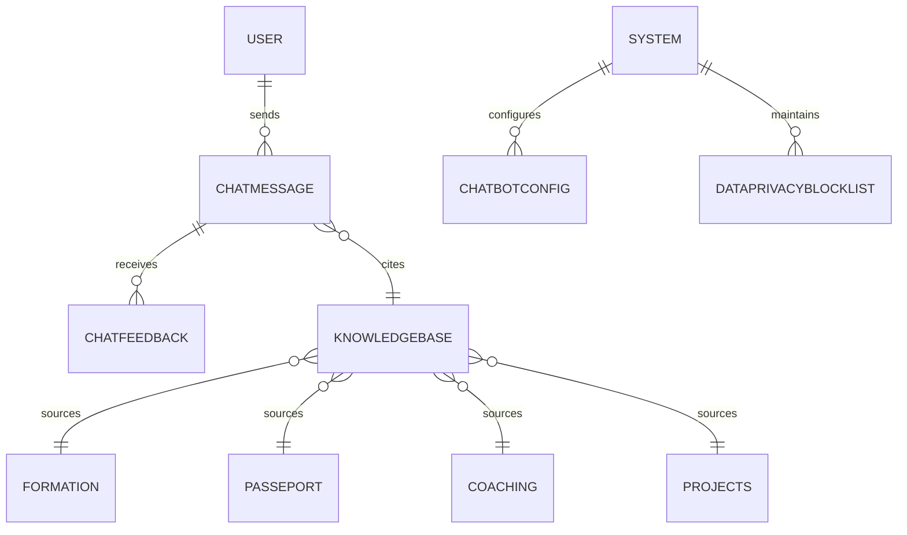

# 12 Chatbot IA & Q&R

**Version:** V1 (Septembre 2026)  
**Status:** 🟢 Spécification en cours  
**Effort estimé:** 140-180h  
**Timeline:** Semaines 11-14 (Phase V1)  
**Priorité:** Complétude IA-Native platform

---

## 📖 Vue d'Ensemble

### Objectif Métier

Transformer Learning App en **plateforme IA-Native** en offrant un chatbot IA conversationnel qui répond aux questions sur le contenu d'apprentissage. Au-delà de la simple interface de conversation, cette fonctionnalité :

- Positionne TLS comme plateforme d'apprentissage légitime avec IA intégrée (vs SaaS classique)
- Réduit la charge cognitive des apprenants (FAQ auto-résolues, guidance immédiate)
- Crée une monocle de valeur : **tout le monde peut avoir un chatbot IA, mais notre chatbot apprenant est limité à notre contenu curé** (légitimité + contrôle qualité)
- Fondation pour la couche IA Enhancement Layer (#12bis) qui augmente d'autres fonctionnalités

### Qui l'Utilise (Rôles)

- **Apprenant** : Pose des questions sur la Formation, Passeport, projets, exercices → reçoit guidance contextualisée + recommendations
- **Manager** : Pose des questions sur métriques, distributions de compétences, progression équipes + forecasts + recommandations de plan formation

### Scope — IN / OUT

#### ✅ IN (V1 Septembre)

**Contenu indexé :**
- Contenu Formation (leçons, objectifs, ressources)
- Passeport Compétences (définitions, niveaux Dreyfus, critères)
- Coaching guidance (session types, best practices)
- Missions Apprenantes (description, critères validation)
- Veille en ligne (ressources externes curées par Pierre)
- System FAQs (types exercices disponibles, types missions, plateforme mechanics)

**Capacités :**
- Répondre questions sur contenu indexé (sémantique search + RAG)
- Recommander contenu ("Quel parcours je devrais faire?")
- Recommander coach ("Qui contacter pour X?")
- Citer sources (lien vers leçon, mission, ressource)
- Collecter feedback utilisateur ("Was this helpful?")

**Limitations :**
- ❌ Pas de web search (réponses basées UNIQUEMENT sur contenu indexé)
- ❌ Pas de données confidentielles clients (bloquer explicitement)
- ❌ Pas de lien avec système support (pas d'auto-ticket création)

#### ❌ OUT (V1)

- **Help Center IA** : Reste sans IA (manuel, static FAQ)
- **Chatbot personnel par apprenant** : V2+ (custom KB per user)
- **Multilingual support** : V2+ (MVP = FR uniquement)
- **Custom KB per company** : V2+ (fine-tuning par client)
- **Integration support tickets** : V2+ (no auto-escalation MVP)
- **Analytics dashboard Chatbot** : V2+ (logging only MVP)

### Dépendances Critiques

**Dépend de:**
- **Formation (#1)** : Contenu leçons, ressources, objectifs (knowledge base source)
- **Passeport (#2)** : Définitions compétences, niveaux Dreyfus, critères (knowledge base source)
- **Coaching (#4)** : Guidance coaching, best practices (knowledge base source)
- **Projects SBO (#11)** : Description projets, critères validation (knowledge base source)
- **Mistral LLM** : Modèle IA pour RAG + generation (voir DECISIONS_LOG P0-1)
- **Vector DB** : Semantic search via embeddings (infrastructure TBD Phase 14)

**Bloque:**
- **IA Enhancement Layer (#12bis)** : Chatbot est feature 1 de la couche IA; #12bis s'appuie sur patterns établis ici

---

## 📱 Écrans à Concevoir

### Front-Office (React)

| Écran | Rôle | Description | Priorité |
|-------|------|-------------|----------|
| **Chat Interface** | Apprenant, Manager | Input zone (text + send button), conversation history, typing indicator, sources panel | P0 |
| **Chat History Panel** | Apprenant, Manager | List of past conversations per session, search in history, delete conversation, export | P1 |
| **Feedback Modal** | Apprenant, Manager | "Was this helpful?" yes/no buttons, optional suggestion text field | P0 |
| **Sources Drawer** | Apprenant, Manager | List of cited sources with direct links (lesson, mission, resource), module breadcrumbs | P0 |
| **Confidence Warning** | Apprenant, Manager | When confidence score < threshold: "I'm not sure. Contact support or your coach" message | P0 |
| **Data Blocker Warning** | Apprenant, Manager | When attempting to ask about confidential data: "I can't answer this question for privacy reasons" | P0 |

### Back-Office (WordPress Admin)

| Écran | Rôle | Description | Priorité |
|-------|------|-------------|----------|
| **KB Management Dashboard** | Admin | View indexed content, sources (auto vs manual), sync status, version | P1 |
| **Chatbot Logs** | Admin, TLS Consultant | View all questions asked, answers given, confidence scores, feedback collected | P1 |
| **Mistral Config** | Admin, Dev | Model version, parameters (temperature, top_k, etc.), system prompt management | P1 |
| **Data Privacy Blacklist** | Admin | List of forbidden topics/keywords, patterns to block (confidential data) | P1 |

---

## ⚙️ Fonctionnalités (V1 MVP)

### Core

1. **Chatbot Conversationnel** - Apprenant/Manager pose question en langage naturel, chatbot comprend intent et retourne réponse basée sur contenu indexé (RAG)

2. **Indexation Automatique** - Contenu Formation, Passeport, Coaching, Missions, Veille importée auto-indexée dans knowledge base au déploiement + updated quand contenu change

3. **Semantic Search + RAG** - Question → embeddings → vector search dans KB → retrieval docs → pass to Mistral → generate response grounded in docs

4. **Source Citation** - Chaque réponse inclut lien vers source (leçon, mission, ressource, doc) + module breadcrumb

5. **Feedback Collection** - User feedback ("helpful?") stocké pour continuous improvement

6. **Confidence Scoring** - Mistral output incluant score confiance; si < threshold → display fallback message ("Contact coach/support")

7. **Intent Classification** - Question categorized (Formation? Passeport? Projects? System?) pour contexte-aware answers

8. **Conversation History** - Chat history per user per session, searchable, exportable

### Secondary

9. **Recommendation Engine** - When applicable, suggest next content ("You should try X lesson next")

10. **Coach Recommendation** - When applicable, suggest coach contact ("For this topic, contact Coach Jane")

11. **Content Freshness** - Track age of cited sources, flag if > 6 months old in knowledge base

---

## 🚀 Possible Évolutions (V2+)

### V2 (Décembre 2026+)

- **Multi-turn conversation** : Better context tracking across multiple questions
- **Chat personalization per user** : Remember learner history, tailor recommendations
- **Analytics dashboard** : Full metrics on chatbot effectiveness, learner satisfaction
- **Integration support tickets** : Fallback → auto-create support ticket (linked to coach)
- **Multilingual support** : Support EN, DE, ES in addition to FR

### V3 (Q1-Q2 2027)

- **Custom KB per company** : V2+ (fine-tuning Mistral per client context)
- **Chatbot AI per learner** : Personal chatbot trained on learner's specific content + progress
- **Advanced intent routing** : Send complex questions to actual coaches vs handle internally

### V4 (2027+)

- **Integration with help center** : Chatbot answers power static FAQ suggestions
- **Batch analysis** : Analyze common questions across learner base → insights for content creators

---

## 👥 User Journeys (Format 3 — CRITICAL SECTION)

### User Journey #1 : Apprenant → Question Formation avec Réponse Satisfaisante

**Acteur :** Apprenant (learning in Formation module)  
**Déclencheur :** Apprenant a une question pendant sa leçon ou après  
**Objectif :** Obtenir réponse rapide à sa question sans quitter la plateforme

#### Étapes Détaillées

1. **Apprenant ouvre le chatbot depuis la page Formation**
   - Apprenant clique sur icône Chatbot en bas-droite (toujours visible)
   - Ou appel via clavier shortcut (Cmd+K ou Ctrl+K)
   - Modal/drawer slide-in depuis la droite
   - Feedback : Smooth animation, focus sur input field
   - Durée : ~300ms

2. **Chatbot affiche interface vide avec greeting + contexte**
   - Message initial : "Bonjour! Je peux répondre tes questions sur ce cours. Que veux-tu savoir?"
   - Input field active (cursor blinking)
   - Suggestion buttons : "Qui peut m'aider?", "Quel est le prochain contenu?", "Définir une compétence"
   - Feedback : Instant (prefetched greeting)
   - Durée : Instant

3. **Apprenant tape sa question**
   - Exemple question : "Quelle est la différence entre Dreyfus 2 et Dreyfus 3?"
   - As typing: No real-time suggestions (keep simple MVP)
   - Feedback : Text appears as typed
   - Durée : ~500ms (user typing)

4. **Apprenant appuie Send ou Enter**
   - Question envoyée à backend
   - Input field disabled (prevent double-send)
   - Typing indicator ("Chatbot is thinking..." with animated dots)
   - Feedback : Clear visual state change (greyed input, typing indicator)
   - Durée : Instant (send completes <100ms)

5. **Système processe question (backend)**
   - Convert question to embeddings
   - Vector search in KB (retrieve top 5 similar docs)
   - Rank by relevance
   - Send to Mistral with retrieved docs as context
   - Mistral generates response + confidence score
   - Feedback: User sees typing indicator (transparent processing)
   - Durée : ~2-3 secondes (vector search + LLM)

6. **Chatbot affiche réponse avec sources**
   - Response appears in conversation (left-aligned, neutral styling)
   - Response includes: Answer text + [Source: Leçon 3.2 - Dreyfus Levels] links
   - Sources clickable → navigate to source or open preview
   - Confidence score: If < 0.6, display fallback: "Je ne suis pas certain. Contacte ton coach Jane pour une réponse précise."
   - Feedback: Smooth fade-in, highlight sources
   - Durée : ~500ms (animation)

7. **Apprenant reads response + evaluates**
   - Response visible in chat
   - If satisfied: Continue or ask follow-up
   - If not satisfied: Click "Was this helpful? No" button
   - Feedback : User can click Helpful/Not immediately
   - Durée : ~30-60 secondes (user reading)

8. **Apprenant clicks "Helpful? Yes"**
   - Yes/No buttons appear below response
   - Apprenant clicks "Yes"
   - Feedback : Button highlights briefly, feedback recorded silently
   - System logs: question + answer + helpful=true
   - Durée : Instant

9. **Session continues or closes**
   - If apprenant closes chatbot: Conversation saved to history
   - If continues: New input field ready for next question
   - Feedback : Chat history accessible later (menu → "Chat History")
   - Durée : Varies

#### Conditions de Succès ✅

- [ ] Réponse générée en <3 secondes
- [ ] Sources citées avec liens valides
- [ ] Confidence score > 0.7 (sinon fallback message)
- [ ] Chat history saved and searchable
- [ ] Mobile responsive (drawer, full-screen on small)
- [ ] No UI jank or layout shift (smooth animations)
- [ ] Input clears after send
- [ ] User can export conversation

#### Erreurs & Edge Cases ❌

**Cas 1 : Apprenant pose question hors-scope (pas dans Formation/Passeport)**
- Scénario : "Quel est le meilleur restaurant près de Paris?"
- Comportement attendu :
  - Mistral confidence < 0.4
  - Fallback message : "Cette question n'est pas dans mon domaine. Je peux répondre sur la Formation, Passeport, ou Coaching. Essaie une autre question?"
  - No source cited
  - Feedback : Clear message, helpful suggestion
- Impact : User stays on platform, tries again (vs frustration)

**Cas 2 : Apprenant pose question que chatbot hallucinerait**
- Scénario : "Est-ce que je peux sauter Dreyfus 1 et aller directement à Dreyfus 3?" (not documented in KB)
- Comportement attendu :
  - Mistral confidence < 0.5
  - Fallback : "Je ne suis pas sûr. Contacte Coach Jane pour cette question spécifique."
  - Option to auto-create support ticket (V2)
  - Feedback : Honest about uncertainty
- Impact : Prevent misinformation; user contacts expert

**Cas 3 : Apprenant tente de ask about confidential data**
- Scénario : "Combien de data Pierre a vendu?" ou "Quels clients utilisent Learning App?"
- Comportement attendu :
  - Content blocker detects sensitive keywords
  - Response : "Je ne peux pas répondre à cette question pour des raisons de confidentialité."
  - No attempt to RAG or use Mistral
  - Feedback : Clean rejection
- Impact : Data privacy maintained

**Cas 4 : Apprenant offline**
- Scénario : Chatbot opened, then network lost
- Comportement attendu :
  - Message field greyed out : "No connection. Check your internet."
  - Previous conversation visible (cached)
  - Once reconnected : Auto-attempt to send pending message
  - Feedback : Clear status
- Impact : Graceful degradation

**Cas 5 : Mistral API timeout**
- Scénario : Backend calls Mistral, no response after 5 seconds
- Comportement attendu :
  - Typing indicator stops after 5s
  - Fallback : "I'm taking too long. Please try again or contact support."
  - Option to retry
  - Feedback : User knows issue isn't their fault
- Impact : Better UX than silent hang

---

### User Journey #2 : Manager → Questions Métriques Équipe + Forecasts + Plans Formation

**Acteur :** Manager (team/company level)  
**Déclencheur :** Manager checking team skill distribution, progress, forecasts, or training recommendations  
**Objectif :** Get actionable insights + forecasts + training plans without manual analysis

#### Étapes Détaillées

1. **Manager opens Chatbot from Analytics dashboard**
   - Greeting: "Hi [Manager]. Je peux répondre sur la distribution des compétences, les prévisions de progression, et recommander des plans de formation pour ton équipe."
   - Feedback : Context-aware, professional tone
   - Durée : Instant

2. **Manager asks question about team metrics**
   - Example: "Quelle est la distribution de la compétence 'Communication' dans mon équipe?"
   - System recognizes Manager role + team_id context
   - Feedback : Input active
   - Durée : ~500ms (typing)

3. **System queries Analytics DB + KB**
   - Question sent with role=Manager + team_id context
   - Query Analytics DB: `SELECT skill_distribution WHERE team_id=X AND competency='Communication'`
   - Vector search for: Competency definitions, interpretation guidelines
   - Send to Mistral with aggregated data + context
   - Feedback : Typing indicator
   - Durée : ~2-3s

4. **Response includes data + interpretation**
   - Response example: "Ton équipe a: 30% Dreyfus 2, 50% Dreyfus 3, 20% Dreyfus 4. C'est solide — 70% de ton équipe est compétente. Prochaine étape: développer les Dreyfus 2 vers Dreyfus 3."
   - Source: "See Analytics dashboard → Team Distribution"
   - Confidence: High (data-backed)
   - Feedback : Clear data, interpretation, actionable insight
   - Durée : ~500ms

5. **Manager asks follow-up: Forecast + Recommendations**
   - Example: "Si mon équipe suit 2-3 formations, quand atteindront-ils Dreyfus 4?"
   - System queries: Historical progression data + current state
   - Calls Mistral forecast model: Based on [team composition, past velocity, available courses], predict timeline
   - Response: "At current pace, with 2 courses in Q3 2026, ~40% of your team will reach Dreyfus 4 by Q4 2026."
   - Durée : ~2-3s

6. **Manager asks: Training plan recommendation**
   - Example: "Quels cours recommandes-tu pour accélérer la progression?"
   - System queries: Available Formation courses, team's current skills, recommended progression paths
   - Mistral generates personalized recommendations: "For your team composition, prioritize: [Course A - 6 people], [Course B - 4 people]. Estimated time: 4-6 weeks."
   - Links to specific courses on Formation module
   - Durée : ~2-3s

7. **Manager reviews insights + can export**
   - If satisfied: Can export chat summary or full report (V1: simple text, V2: PDF with charts)
   - If wants deeper analysis: Follow-up questions (e.g., "Show me per-person breakdown", "Compare vs other teams")
   - Feedback : Clear next steps available
   - Durée : Varies

#### Conditions de Succès ✅

- [ ] Manager can access aggregated team data (not individual learner data)
- [ ] Analytics DB queries fast + integrated (<3s latency)
- [ ] Confidence high for data-backed questions
- [ ] Forecast model functional (v0 = simple linear, v1+ = ML-based)
- [ ] Training recommendations relevant + linked to actual courses
- [ ] Export/reporting available (V1: text summary, V2+: PDF with charts)
- [ ] Interpretation helpful (not just raw data)

#### Erreurs & Edge Cases ❌

**Cas 1 : Manager tries to access individual learner data**
- Scénario: "Qui n'est pas assez compétent en Communication?"
- Comportement attendu:
  - Blocked by privacy rules
  - Response: "Je ne peux pas identifier les individus. Contact le Coach pour une discussion 1:1."
  - Feedback: Privacy-first explanation
- Impact: GDPR compliance

**Cas 2 : Insufficient historical data for forecast**
- Scénario: New team with only 2 weeks of data
- Comportement attendu:
  - Forecast model detects low data confidence
  - Response: "Je n'ai pas assez de données historiques pour une prévision précise. Reviens dans 4-6 semaines."
  - Fallback: Simple linear projection based on current pace
  - Feedback: Honest about uncertainty
- Impact: User knows forecast reliability

**Cas 3 : No matching courses for recommendation**
- Scénario: Team needs skill not covered in Formation MVP
- Comportement attendu:
  - System detects gap
  - Response: "Je recommande la compétence X, mais aucun cours n'existe actuellement. Contacte Pierre pour proposer un contenu."
  - Feedback: Clear escalation
- Impact: Identifies content gaps

**Cas 4 : Manager asks for comparison with other teams**
- Scénario: "Comment mon équipe se compare aux autres équipes?"
- Comportement attendu (V1):
  - Privacy rules + benchmarking not available V1
  - Response: "Les comparaisons cross-team ne sont pas disponibles en V1. Feature V3+."
  - Feedback: Clear timeline
- Impact (V3+): Benchmarking enabled

---

## 🗄️ Modèle de Données

### Entités Principales

#### 1. **ChatMessage** (conversation history)

| Colonne | Type | Description |
|---------|------|-------------|
| `id` | UUID | Primary key |
| `user_id` | UUID | Who asked the question |
| `role` | ENUM(apprenant, manager) | Role of asker (for context, MVP only) |
| `session_id` | UUID | Groups messages in conversation |
| `message_type` | ENUM(user_question, chatbot_response) | Direction of message |
| `content` | TEXT | Actual message text |
| `question_embedding` | VECTOR(1536) | Embedding of question (for search) |
| `confidence_score` | DECIMAL(0-1) | Mistral confidence on response |
| `intent_category` | STRING | Classified intent (Formation? Passeport? System?) |
| `sources_cited` | JSON | Array of {source_id, module, relevance_score} |
| `created_at` | DateTime | Timestamp |
| `updated_at` | DateTime | Timestamp |

#### 2. **ChatFeedback** (learning from user feedback)

| Colonne | Type | Description |
|---------|------|-------------|
| `id` | UUID | Primary key |
| `message_id` | UUID | References ChatMessage (response) |
| `user_id` | UUID | Who gave feedback |
| `helpful` | ENUM(yes, no, skip) | User rating |
| `suggestion_text` | TEXT | Optional suggestion if "no" |
| `follow_up_action` | ENUM(contact_coach, create_ticket, try_again) | User's next action |
| `created_at` | DateTime | Timestamp |

#### 3. **KnowledgeBase** (indexed content for RAG)

| Colonne | Type | Description |
|---------|------|-------------|
| `id` | UUID | Primary key |
| `source_module` | STRING | Origin (Formation, Passeport, Coaching, Projects, Veille) |
| `source_id` | UUID | FK to original content (lesson_id, competency_id, etc.) |
| `title` | STRING | KB entry title |
| `content` | TEXT | Indexed content |
| `embedding` | VECTOR(1536) | Semantic embedding for search |
| `content_type` | ENUM(lesson, definition, faq, guide, resource, project) | Type classification |
| `is_auto_indexed` | BOOLEAN | True if auto-generated from Formation, False if manual FAQ |
| `last_updated_from_source` | DateTime | When KB was last synced from source |
| `created_at` | DateTime | Timestamp |
| `updated_at` | DateTime | Timestamp |

#### 4. **ChatbotConfig** (system configuration)

| Colonne | Type | Description |
|---------|------|-------------|
| `id` | UUID | Primary key |
| `config_key` | STRING | Setting name (e.g., "confidence_threshold", "max_sources") |
| `config_value` | JSON | Setting value |
| `active` | BOOLEAN | Enabled? |
| `created_at` | DateTime | Timestamp |
| `updated_at` | DateTime | Timestamp |

#### 5. **DataPrivacyBlocklist** (forbidden topics)

| Colonne | Type | Description |
|---------|------|-------------|
| `id` | UUID | Primary key |
| `keyword` | STRING | Keyword or regex pattern to block |
| `reason` | STRING | Why it's blocked (confidential, PII, etc.) |
| `block_type` | ENUM(keyword, pattern, sentiment) | Type of block |
| `active` | BOOLEAN | Enabled? |
| `created_at` | DateTime | Timestamp |

### Relations

```
ChatMessage (1) ──→ (many) ChatFeedback
ChatMessage (many) ──→ (many) KnowledgeBase (via sources_cited JSON)
KnowledgeBase references Formation, Passeport, Coaching, Projects, Veille content
ChatbotConfig (1) ──→ (1) System
DataPrivacyBlocklist (1) ──→ (1) System
```

### Schéma Simplifié (Mermaid)



---

## 🔌 API / Endpoints

### Chatbot Interaction

**POST `/api/v1/chatbot/messages`**
- Send question, get answer
- Request: `{ user_id, role, question, session_id?, context?, team_id? }`
- Response: `{ message_id, response, sources, confidence_score, fallback_applied }`
- Rate limit: 10 requests/min per user (prevent spam)
- **Manager-specific:** If role=manager + team_id included, system automatically queries Analytics DB for team metrics (skill distribution, progression, forecasts)

**GET `/api/v1/chatbot/history?user_id=X&session_id=Y`**
- Retrieve conversation history
- Response: `[ { message_id, role, content, timestamp, helpful? } ]`
- Pagination: Default 20 items, max 100

**POST `/api/v1/chatbot/feedback`**
- Submit "was this helpful?" feedback
- Request: `{ message_id, helpful (yes/no/skip), suggestion_text? }`
- Response: `{ feedback_id, recorded }`

**DELETE `/api/v1/chatbot/history/{session_id}`**
- Delete conversation
- Response: `{ deleted: true }`

### Knowledge Base Management (Admin)

**GET `/api/v1/admin/kb/status`**
- Check KB sync status, last updated, coverage
- Response: `{ total_indexed, modules: { Formation: X, Passeport: Y, ... }, last_sync, health }`

**POST `/api/v1/admin/kb/reindex`**
- Manually trigger full reindex (or trigger on Formation/Passeport/etc. update)
- Response: `{ job_id, status: "in_progress" }`

**GET `/api/v1/admin/kb/logs?limit=50`**
- View KB indexing logs
- Response: `[ { timestamp, action, module, status, errors } ]`

**POST `/api/v1/admin/kb/manual-entry`**
- Admin adds custom FAQ entry to KB
- Request: `{ title, content, category, tags }`
- Response: `{ kb_id, embedding_status }`

### Analytics Data Integration (Manager Queries)

**POST `/api/v1/chatbot/analytics/team-metrics`**
- Query aggregated team analytics data for Manager's team
- Request: `{ team_id, competency?, date_range?, metric_type? }`
- Response: `{ team_size, skill_distribution, avg_level, progression_velocity, forecast_timeline }`
- Used internally by chatbot to answer Manager questions about team metrics
- Note: Only returns aggregated team-level data; no individual learner data exposed

**POST `/api/v1/chatbot/forecast/progression`**
- Forecast team skill progression timeline
- Request: `{ team_id, competency, projected_courses?, pace? }`
- Response: `{ current_avg, projected_timeline, confidence, assumptions }`
- Used by chatbot to answer "When will my team reach Dreyfus 4?" type questions

**POST `/api/v1/chatbot/recommendations/training-plan`**
- Generate recommended training plan for Manager's team
- Request: `{ team_id, competency, team_composition?, available_courses? }`
- Response: `{ recommended_courses, effort_estimate, expected_timeline, rationale }`
- Used by chatbot to answer "What courses should we take?" type questions

### Configuration (Admin)

**GET `/api/v1/admin/chatbot/config`**
- Get all chatbot settings
- Response: `{ confidence_threshold, max_sources, fallback_message, blocklist_active }`

**PUT `/api/v1/admin/chatbot/config`**
- Update settings
- Request: `{ config_key, config_value }`
- Response: `{ updated: true }`

**GET `/api/v1/admin/privacy/blocklist`**
- Get forbidden topics
- Response: `[ { keyword, reason, block_type, active } ]`

**POST `/api/v1/admin/privacy/blocklist`**
- Add forbidden keyword
- Request: `{ keyword, reason, block_type }`
- Response: `{ blocklist_id, active }`

### Analytics (Admin, TLS Consultant)

**GET `/api/v1/admin/chatbot/analytics?period=week`**
- Dashboard metrics
- Response: `{ total_conversations, avg_satisfaction, fallback_rate, top_topics, response_time_p95 }`

**GET `/api/v1/admin/chatbot/logs?user_role=apprenant&limit=100`**
- Detailed conversation logs (filtered by role)
- Response: `[ { user_id, question, response, confidence, helpful?, timestamp } ]`

---

## 📊 Analytics & Métriques

### Quoi Tracker (Events)

| Événement | Contexte | Paramètres | Importance |
|-----------|----------|-----------|-----------|
| `chatbot.question_asked` | User sends question | user_id, role, intent_category | HIGH |
| `chatbot.answer_provided` | System generates answer | message_id, confidence_score, sources_count | HIGH |
| `chatbot.feedback_provided` | User rates answer | message_id, helpful (yes/no), follow_up_action | HIGH |
| `chatbot.confidence_fallback` | Answer confidence too low | message_id, confidence_score, fallback_type | MEDIUM |
| `chatbot.privacy_block` | Question blocked by privacy | blocked_keyword, user_role | HIGH (security) |
| `chatbot.response_latency` | Response generation time | message_id, latency_ms | MEDIUM |
| `chatbot.kb_source_cited` | Source cited in answer | kb_id, module, relevance_score | LOW |
| `chatbot.conversation_closed` | User closes chat | session_id, message_count, duration | LOW |

### Dashboards par Rôle

#### Dashboard Admin (Daily + Weekly)
- **Total conversations** (trend)
- **User satisfaction rate** (% helpful = yes)
- **Fallback rate** (% confidence < threshold)
- **Top 10 questions asked** (by frequency)
- **Top 5 source modules cited** (Formation vs Passeport vs Coaching)
- **Privacy blocks triggered** (daily count, keywords)
- **Response time p95** (should be <3s)
- **KB health** (coverage by module, last sync time)

#### Dashboard Manager
- **Team's top questions** (aggregated from team members, with anonymity)
- **Common topics** (what team is confused about)
- **Satisfaction trends** (helpfulness %)

#### Dashboard Apprenant (Personal, V1)
- **Your chat history** (search, export)
- **Helpful % on your questions** (personal satisfaction metric)

---

## ✅ Critères d'Acceptation MVP

### Fonctionnalités Core
- [x] Chatbot responds to questions within 3 seconds
- [x] Semantic search finds relevant KB entries (top 5)
- [x] Sources cited correctly with clickable links
- [x] Confidence scoring implemented + fallback at <0.6
- [x] Privacy blocker prevents data leakage (manual test)
- [x] Chat history saved and searchable
- [x] Feedback collection (helpful/not helpful)

### Expérience Utilisateur
- [x] Chat interface mobile responsive (drawer on desktop, full-screen on mobile)
- [x] No UI jank (smooth animations, no layout shifts)
- [x] Input clears after send
- [x] Typing indicator visible during processing
- [x] Sources drawer doesn't obscure response

### Données & Intégrité
- [x] Chat messages encrypted at rest
- [x] Audit trail for all conversations (admin can view)
- [x] Feedback data stored correctly
- [x] KB sync doesn't lose content (migration tested)
- [x] Soft-delete for chat history (GDPR)

### Performance & Scalabilité
- [x] Handle 100+ concurrent chatbot sessions
- [x] Vector DB performs <500ms for 10K+ embeddings
- [x] Mistral API calls timeout gracefully after 5s
- [x] KB reindex doesn't block platform (async job)
- [x] Chat history pagination efficient (1M+ messages)

### Sécurité
- [x] Privacy blocklist enforced (no data leakage)
- [x] Rate limiting (10 requests/min per user)
- [x] Admin can view all conversations (audit)
- [x] No sensitive data in logs
- [x] API auth required (same as platform auth)

---

## 🔗 Dépendances Inter-Modules

### Dépend De

| Module | Raison | Type Dépendance |
|--------|--------|-----------------|
| **Formation (#1)** | Contenu leçons, ressources, objectifs (KB source) | Data |
| **Passeport (#2)** | Définitions compétences, niveaux Dreyfus (KB source) | Data |
| **Coaching (#4)** | Guidance coaching, best practices (KB source) | Data |
| **Projects SBO (#11)** | Description projets, critères validation (KB source) | Data |
| **Mistral LLM** | Model for RAG + generation (DECISIONS_LOG P0-1) | Infrastructure |
| **Vector DB** | Semantic search embeddings | Infrastructure |

### Bloque

| Module | Raison | Impact |
|--------|--------|--------|
| **IA Enhancement Layer (#12bis)** | Chatbot patterns (conversation, RAG, feedback) serve as template for other IA features | Architectural |

### Ordre Implémentation

```
✅ Phase V1 (Semaines 11-14)
  └─ Cahier #12 : Chatbot IA & Q&R (this cahier)
     - Week 11: Backend (API, KB indexing, Mistral integration)
     - Week 12: Frontend (chat interface, feedback)
     - Week 13: Testing + integration with Formation/Passeport
     - Week 14: Refinement + Phase 14 blockers

   ↓ Dépendances résolues

⏳ Phase V1 (Semaines 15-18)
  └─ Cahier #12bis : IA Enhancement Layer
     - Dépend de patterns établis dans #12
     - Utilise même Mistral instance
     - Réutilise KB infrastructure
```

---

## 📊 Analytics & Métriques (Admin Dashboard)

### Quoi Tracker

- Total conversations per day/week/month
- User satisfaction rate (% "helpful" = yes)
- Fallback rate (% confidence < threshold)
- Top 10 questions asked
- Top 5 source modules cited
- Privacy blocks triggered
- Response time p95
- KB coverage by module

### Success Metrics (KPIs)

- **User adoption** : >30% of learners use chatbot within 3 months
- **Satisfaction** : >70% of responses rated helpful
- **Fallback rate** : <10% (high confidence)
- **Response time** : p95 < 3 seconds
- **Privacy** : 0 security incidents
- **Reduction in coach tickets** : >20% reduction in FAQ-type questions

---

## 📅 Planning & Budget Estimé

### Effort Total: 140-180 heures

#### Breakdown par Phase

| Phase | Composant | Effort (h) | Timeline |
|-------|-----------|-----------|----------|
| **Phase 1 (Semaine 11)** | API design + Mistral integration | 30 | J1-2 |
| | KB indexing + Vector DB setup | 25 | J2-3 |
| | Data model + DB migrations | 15 | J3-4 |
| **Phase 2 (Semaine 12)** | Frontend chat interface | 30 | J1-3 |
| | Feedback collection UI | 10 | J3-4 |
| **Phase 3 (Semaine 13)** | Integration with Formation/Passeport data | 20 | J1-2 |
| | Privacy blocker implementation | 10 | J2-3 |
| | Admin dashboard (analytics + config) | 15 | J3-4 |
| **Phase 4 (Semaine 14)** | Testing (unit + integration) | 20 | J1-3 |
| | Mistral fine-tuning + prompt optimization | 15 | J3-4 |
| **TOTAL** | | **~170h** | **4 weeks** |

#### Dépendances Critiques

- [ ] Mistral hosting decision (Phase 14 P0-1)
- [ ] Vector DB infrastructure ready (before indexing)
- [ ] Formation/Passeport content freeze (for KB indexing)
- [ ] Confidence scoring + hallucination prevention (Phase 14)

#### Précisions Nécessaires (À valider avec Pierre)

- [ ] **Mistral hosting**: Self-hosted VM? AWS? Docker? (impacts deployment timeline)
- [ ] **Hallucination prevention strategy**: Solution pour éviter réponses fausses (Phase 14)
- [ ] **Data privacy blocklist**: List of forbidden keywords to block (security review)
- [ ] **KB curation**: Who manages manual FAQ entries? (admin? dedicated content role?)
- [ ] **Multi-language support timing**: MVP FR only or also EN/DE/ES?

---

## 🚀 Prochaines Étapes

1. **Validation structure Cahier #12** ← Attendre feedback Pierre
2. **Clarification Phase 14 blockers** ← Identifier decisions à prendre (Mistral hosting, hallucination strategy)
3. **Cahier #12bis (IA Enhancement Layer)** ← Once Pierre answers Q1-Q5 from memory
4. **Planning détaillé** ← Ajouter micromilestones weekly si Pierre demande

---

## 📞 Questions Bloquantes

**Pas de questions bloquantes pour Cahier #12** — toutes clarifications reçues de Pierre. Questions Phase 14 documentées dans BLOCKED_ITEMS_RECAP.md.

---

**Status:** 🟢 Cahier complet — En attente validation Pierre
