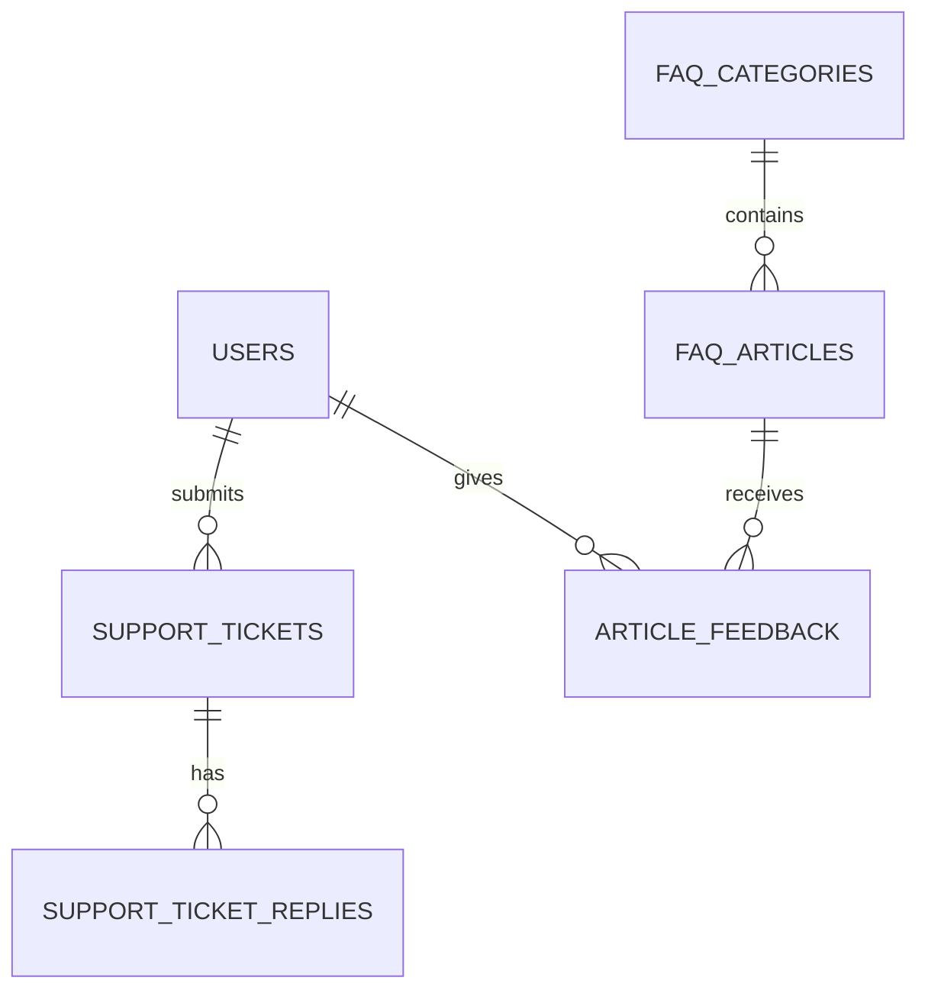

# 13 Helpcenter & Wiki — Support Documentation System

**Version:** V2 Septembre 2026 (Helpcenter MVP, Wiki Notion setup)  
**Status:** 🟢 Spécification en cours  
**Effort estimé:** 140-180h  
**Timeline:** Semaines 15-20 (Phase 5-6)

---

## 📖 Vue d'Ensemble

### Objectif Métier
Fournir un **système de support complet et accessible** permettant aux apprenants et aux managers d'entreprise de résoudre rapidement leurs questions et trouver de la documentation pertinente. Ce module combine deux canaux complémentaires :

1. **Helpcenter On-Platform (Plateforme React)** : Support immédiat, contextuel, intégré à l'expérience utilisateur — Accessible aux utilisateurs connectés
2. **Wiki Notion Externe PUBLIC** : Documentation complète, knowledge base évolutive, best practices — **Accessible à TOUS (connectés ET non-connectés)** via lien public

Le module vise à **réduire le support manuel** en offrant l'autoservice, tout en capturant les questions fréquentes pour amélioration continue. Le Wiki Notion PUBLIC fait partie intégrante du helpcenter et ne nécessite pas de login pour accéder à la documentation pédagogique et support.

### Qui l'Utilise (Rôles)

**Apprenant (Learner)**
- Cherche des réponses rapides ("Comment envoyer ma mission ?")
- Accède aux tutoriels et guides étape-par-étape
- Consulte les ressources théoriques disponibles
- Soumet des tickets de support pour problèmes urgents
- Marque les réponses comme "utiles" (feedback)

**Coach (Manager interne ou externe)**
- Accède aux guides de coaching et best practices
- Consulte la documentation sur les compétences et évaluation
- Soumet des questions sur le matching IA ou configurations
- Accède aux tutoriels pour configurer ses parcours

**Manager d'Entreprise (Company Admin)**
- Consulte la documentation d'administration complète
- Accède aux guides de configuration et intégration
- Gère les utilisateurs et rôles (support)
- Accède aux rapports de support (tickets, FAQ trending)

**Admin Plateforme (System Admin)**
- Crée et maintient le helpcenter (FAQ, catégories, articles)
- Gère la wiki Notion (structure, accès)
- Analyse les données de support (tickets non résolus, trending questions)
- Maintient les tutoriels vidéo

### Scope — IN / OUT

#### ✅ IN (V2 Septembre)
**Helpcenter On-Platform**
- FAQ searchable (catégories multiples)
- How-to guides avec screenshots + vidéos
- Tutoriels interactifs (3 videos, step-by-step)
- Système de tickets de support (soumission basique)
- Emoji reactions + "Mark as Helpful" (peer feedback)
- Real-time search + filters
- Responsive design (mobile/tablet/desktop)
- Multilingual UI (FR/EN/ESP/IT)

**Wiki Notion Externe PUBLIC**
- Notion workspace partagée (company-specific, publicly accessible via link)
- **PUBLIC - Accessible sans login** (lien public en URL helpcenter)
- Documentation structure de base (navigation, templates)
- Best practices & knowledge base (tous rôles : apprenants, coaches, managers)
- Admin guides & system documentation
- Integration & API documentation
- Access control : Pages PUBLIC (accessibles sans login) + Pages PRIVATE (admin only)

#### ❌ OUT (Déféré)
- AI-powered chatbot Q&A (Cahier #12bis — Chatbot IA, V3)
- Auto-categorization de FAQs (needs IA)
- Advanced ticket management system (v3+: triage, SLA, routing)
- Analytics avancées (satisfaction scoring, sentiment analysis)
- Internal wiki full-featured management (V3+)
- Multi-language content automation
- Video transcription service (V3+)
- Support chat live (V3+)

### Dépendances Critiques

**Dépend de:**
- **Formation & Learning Paths (#1)** : Ressources théoriques, contenu support
- **Passeport Compétences (#2)** : Content tagging par compétences
- **Onboarding & User Profile (#3)** : Tutoriels onboarding, profil apprenant
- **Coaching & 1-1 Messaging (#4)** : Support coaching documentation
- **Back-Office & Analytics (#10)** : Data pour tickets de support, trending questions
- **Chatbot IA (#12bis)** : For future FAQ integration (V3)

**Bloque:**
- **Outil Auteur (#20, V4)** : Documentation pour coaches créant du contenu
- **Integration & External Sync (#21, V4)** : Help docs sur les intégrations

---

## 📱 Écrans à Concevoir

### Front-Office (React)

| Écran | Rôle | Description | Priorité |
|-------|------|-------------|----------|
| **Helpcenter Landing** | Apprenant, Coach | Accueil avec search bar prominente, catégories principales (FAQ, Tutoriels, Guides, Ressources), lien vers wiki externe | P0 |
| **FAQ Search Results** | Apprenant, Coach | Résultats de recherche avec snippets, categorization, related articles, filters par type/competence | P0 |
| **Article Details** | Apprenant, Coach | Contenu article avec screenshots/vidéos embeddées, table of contents, reactions (emojis), "Helpful?" feedback, suggested articles, link to wiki | P0 |
| **Tutorials Hub** | Apprenant, Coach | 3 tutoriels interactifs (text + video), progress bar, navigation Previous/Next, option "Skip" | P0 |
| **Tutorial Step** | Apprenant, Coach | Single step view with title, description, screenshot/video, key points, navigation | P0 |
| **Support Tickets List** | Apprenant, Coach, Admin | Liste mes tickets, filtrer par status, search, create new ticket | P1 |
| **Ticket Details** | Apprenant, Coach, Admin | Ticket content, status, assigned admin reply, add follow-up comment | P1 |
| **Create Ticket** | Apprenant, Coach, Admin | Form: Category, Topic, Description, Attachments (optional), Priority (user-selected or suggested) | P1 |

### Back-Office (WordPress Admin)

| Écran | Rôle | Description | Priorité |
|-------|------|-------------|----------|
| **Helpcenter Dashboard** | Admin | Overview: FAQ count, trending questions, open tickets, resources count, wiki link | P1 |
| **FAQ CRUD** | Admin | List FAQs, create/edit/delete, categorize, set tags (competence, type), preview | P0 |
| **Article Editor** | Admin | Rich text editor, embed videos/PDFs, add screenshots with annotations, preview, publish workflow | P0 |
| **Tutorials Management** | Admin | Upload/manage 3 tutorial videos, edit descriptions, manage step-by-step content | P1 |
| **Resource Library** | Admin | Upload PDFs/Videos, tag by competence + RIEC, manage access levels (public/manager/all) | P0 |
| **Ticket Management** | Admin | View all tickets, filter by status/priority/category, reply to user, update status, assign to team | P1 |
| **Categories & Tags** | Admin | Define FAQ categories, competence tags, document types, customize filters | P1 |
| **Helpcenter Settings** | Admin | Configure search settings, enable/disable sections, set wiki link, customize UI labels | P1 |

---

## ⚙️ Fonctionnalités (V2 MVP)

### Core — Helpcenter On-Platform

1. **FAQ Search & Navigation** 
   - Full-text search (title + content)
   - Categorization (by topic, competence, user role)
   - Filters (document type, competence level, language)
   - Autocomplete suggestions based on popular queries

2. **How-To Guides & Articles**
   - Rich content (text + images/videos/PDFs embedded)
   - Screenshots with annotations (arrows, highlights, numbers)
   - Step-by-step walkthroughs
   - Related articles suggestions
   - "Helpful?" feedback (emoji reactions)
   - Peer validation ("Mark as Helpful" with count)

3. **Interactive Tutorials**
   - 3 core tutorials (Onboarding flow) visible immediately after user creation
   - Format: Title + Context + 3 sections (text+screenshot OR video)
   - Video embed (Vimeo or YouTube)
   - Progress bar (1/3, 2/3, 3/3)
   - Navigation (Previous/Next/Skip)
   - Replayable (V1+)

4. **Support Ticketing System**
   - User can submit tickets for issues not in FAQ
   - Form: Category + Topic + Description + Optional attachments
   - Auto-suggest category based on keywords
   - Real-time status tracking (Open, In Progress, Resolved)
   - Admin reply + conversation thread
   - Notification when ticket resolved

5. **User Feedback & Ratings**
   - Emoji reactions on articles (👍 ❤️ 😕 🎉 🚀)
   - "Helpful?" binary toggle (simplified feedback)
   - Tooltip showing users who reacted

6. **Multilingual Support**
   - UI in FR/EN/ESP/IT
   - Content auto-translatable or manually translated
   - Language selection dropdown
   - Fallback to base language if translation unavailable

### Secondary — Wiki Integration

1. **External Notion Wiki Link**
   - Direct link from Helpcenter to Notion workspace
   - Company-specific docs (company admins can customize)
   - Public (any user) vs Private (admins only) pages

2. **Knowledge Base (Notion Workspace)**
   - Admin guides (user management, roles, configuration)
   - Best practices (how to structure learning paths, tips for coaching)
   - System architecture (data models, API docs)
   - FAQ archive (historical, searchable)
   - Integration guides (external tools)

### Optional — Phase 5 Early

1. **Ticket Analytics (Admin Dashboard)**
   - Trending questions (unanswered tickets)
   - FAQ gaps (questions not in FAQ → create new FAQ)
   - Response time metrics
   - User satisfaction (based on emoji feedback)

---

## 🚀 Possible Évolutions (V3+)

### V3 (Q1-Q2 2027)
- **AI-powered FAQ Suggestions** : Chatbot IA recommends FAQ articles
- **Auto-Tagging** : IA auto-categorizes tickets and FAQs
- **Sentiment Analysis** : Understand satisfaction from ticket language
- **Support Chat** : Live chat (Zendesk integration?)
- **Advanced Ticket Routing** : Auto-assign to appropriate admin based on category

### V4 (2027+)
- **Multi-language Content Automation** : IA auto-translates articles
- **Video Transcription & Search** : Search within video content
- **Internal Wiki Management** : Full-featured internal wiki (not just Notion)
- **Support SLA Tracking** : Response time targets
- **Predictive Support** : Suggest articles before user asks

---

## 👥 User Journeys (Format 3 — CRITICAL SECTION)

### User Journey #1 : Apprenant → Cherche réponse rapide à une question

**Acteur :** Apprenant (nouvel utilisateur ou utilisateur existant)  
**Déclencheur :** Apprenant bloqué ou confus sur une fonctionnalité, cherche une réponse rapide  
**Objectif :** Trouver une réponse claire et résoudre rapidement le problème sans contacter le support

#### Étapes Détaillées

1. **Apprenant clique sur icône "?" ou "Help" dans la navigation**
   - Icône Help visible en haut-droit de chaque page (ou menu burger sur mobile)
   - Apprenant clique → modal Helpcenter s'ouvre ou page helpcenter navigated to
   - Feedback : Modal fluide, animation slide-in ~200ms, focus sur search bar
   - Durée : ~200ms

2. **Helpcenter landing page s'affiche avec search bar prominente**
   - Contenu : Search bar au top avec placeholder "Search FAQs, guides, tutorials..."
   - Catégories visibles en-dessous (FAQ, How-to Guides, Tutoriels, Ressources)
   - Helpful links selon rôle (Apprenant : "Getting Started", "My Missions", "Passeport")
   - Feedback : Instant load (cached), search bar auto-focused
   - Durée : Instant

3. **Apprenant tape sa question ou keyword dans search bar**
   - Exemple : "Comment valider ma mission ?" ou "mission validation"
   - Autocomplete suggestions appear en dropdown (5-10 populaires)
   - Feedback : Suggestions real-time, ~100-200ms latency
   - Durée : ~100-200ms

4. **Apprenant clique suggestion ou appuie Enter pour search**
   - Search results page affichée avec 5-15 résultats pertinents
   - Format : Titre article + snippet (100-150 chars) + type badge (FAQ, Guide, Tutorial) + competence tag
   - Results classés par relevance (full-text match + tags)
   - Feedback : Results load ~500ms, smooth fade-in
   - Durée : ~500ms

5. **Apprenant clique sur article pertinent dans les résultats**
   - Article detail page ouvre
   - Contenu : Titre + date updated + competence tags + contenu riche (text, images, vidéo embeddée)
   - Screenshots avec annotations (arrows pointant les éléments clés)
   - Vidéo Vimeo embeddée si applicable
   - Table of contents sur la gauche (si long article)
   - Feedback : Smooth page transition, content loads ~300ms
   - Durée : ~300ms

6. **Apprenant lit l'article et encontre la réponse**
   - Article clair avec steps détaillés (ex: "5 étapes pour valider")
   - Screenshots ou vidéo démontre chaque step
   - Key points en green checkmark list
   - Feedback : Contenu lisible, contraste suffisant, vidéo jouable inline
   - Durée : 2-5 minutes (user reads)

7. **Apprenant marque l'article comme "Helpful" ou ajoute emoji reaction**
   - En bas d'article : "Was this helpful?" avec 👍 ❤️ 😕 boutons
   - Ou : "Helpful? [Yes] [No]" binary toggle
   - Apprenant clique 👍 ou [Yes]
   - Feedback : Instant confirm "Thanks for your feedback!" message, button turns green
   - Durée : ~300ms

8. **Apprenant ferme l'article et retourne à sa tâche**
   - Article resolved → Apprenant back to learning space/mission
   - Feedback : Smooth page exit, back button ou close modal
   - Durée : Instant

#### Conditions de Succès ✅
- [ ] Search loads in <500ms
- [ ] Autocomplete suggestions appear in <200ms
- [ ] Article found in top 5 results 90% of the time
- [ ] Article content clear and unambiguous
- [ ] Videos/screenshots load without error
- [ ] Feedback (Helpful) registered without page reload
- [ ] Entire journey (search → solution) takes <3 minutes
- [ ] Mobile responsive (touch-friendly search + buttons)
- [ ] No 404 errors on links within article

#### Erreurs & Edge Cases ❌

**Cas 1 : Apprenant cherche mais pas de réponse trouvée**
- Scénario : Search returns 0 results ou résultats non-pertinents (ex: cherche "valider" mais tous résultats sont "validate certification")
- Comportement attendu :
  - Step 1 : "No results found for 'valider'" affichage
  - Step 2 : Suggestion "Try: 'mission completion' or browse categories"
  - Step 3 : Show related FAQ categories (Learning Space, Missions, Evaluation)
  - Step 4 : "Can't find your answer?" → Button [Submit Support Ticket] prominent
  - Feedback : Empatheic message, clear next step (submit ticket)
- Impact : User can self-resolve 85% of time, submit ticket for remaining 15%

**Cas 2 : Apprenant accède helpcenter sur mobile avec connexion lente**
- Scénario : Mobile user, 3G connection (~2s latency)
- Comportement attendu :
  - Search bar loads immediately (cached)
  - Skeleton loading for results (placeholder shimmer)
  - Images lazy-loaded (appear as user scrolls)
  - Video embedded but "Click to play" (don't auto-load video file)
  - Feedback : "Optimized for slower connections" indicator
- Impact : ~3-4 seconds to first result (acceptable on mobile), videos not blocking

**Cas 3 : Article contains outdated information or broken video link**
- Scénario : Article last updated 6 months ago, video URL dead (404)
- Comportement attendu :
  - Article shows "Last updated: 6 months ago" (timestamp visible)
  - Dead video shows "Video unavailable" message (graceful fallback to transcript or PDF)
  - "Report an issue with this article" link → submit correction request
  - Admin notified of dead link, fixes within 1 day
  - Feedback : User can still access related articles or submit ticket
- Impact : Prevents misguidance, maintains trust

**Cas 4 : Apprenant déjà a read this article before (wants to re-read quickly)**
- Scénario : Apprenant knows the article exists (remembers title) but wants quick re-access
- Comportement attendu :
  - Search history/recently viewed articles (optional feature)
  - OR search returns article in top 3 (personalized ranking)
  - OR article bookmarked (V1+ feature)
  - Feedback : Instant re-access, no need to re-search
- Impact : Improves UX for repeat access (~30% of help searches)

**Cas 5 : Apprenant offline (no internet connection)**
- Scénario : Apprenant in offline mode (plane, no signal)
- Comportement attendu :
  - Helpcenter shows "You're offline" banner
  - Cached FAQ articles still accessible (from last session)
  - Search works on cached content only
  - Submit ticket disabled ("Requires internet connection")
  - Feedback : Clear messaging about offline limitations
- Impact : ~60% of helpcenter still useful offline (cached FAQs)

---

### User Journey #2 : Manager d'Entreprise → Accède documentation admin pour setup

**Acteur :** Manager d'Entreprise (Company Admin, décideur IT)  
**Déclencheur :** Manager a besoin de configurer utilisateurs, rôles, ou comprendre système architecture  
**Objectif :** Trouver documentation d'administration complète et guides de configuration

#### Étapes Détaillées

1. **Manager accède helpcenter depuis dashboard ou menu principal**
   - Manager logged in as Admin role
   - Clicks [Help] icon ou [Documentation] link
   - Helpcenter landing page opens
   - Feedback : Page loads, admin-specific sections visible (vs apprenant view)
   - Durée : ~300ms

2. **Manager sees Admin-specific categories or search for admin topic**
   - Helpcenter shows admin categories: "Setup & Configuration", "User Management", "Reporting", "Integrations", "FAQ"
   - Manager searches for "user roles" or "add team member"
   - OR browses [Setup & Configuration] category
   - Feedback : Categories visible, search instant, results curated for admin
   - Durée : ~200ms

3. **Manager finds and clicks on "User Roles & Permissions" guide**
   - Article opens with detailed explanation
   - Content: What are the roles? (Admin, Coach, Manager, Apprenant)
   - Table: Role name | Permissions | Common use case
   - Step-by-step: "How to assign a user to a role"
   - Screenshots: BO interface with role selection dropdown
   - Video: 3-min demo of role assignment workflow
   - Feedback : Article loads with images + video embedded
   - Durée : ~400ms

4. **Manager reads guide and finds answer (or needs more help)**
   - If answer found : Manager now knows how to assign roles
   - If still unclear : Manager clicks [Submit Support Ticket] or [Contact Admin]
   - Feedback : Clear CTA for escalation, no dead-ends
   - Durée : 3-5 minutes (reading)

5. **Manager follows the step-by-step guide in the BO**
   - Guide instructs: "Go to [Users] in left sidebar, click [Edit] on user, select Role from dropdown"
   - Manager follows steps in parallel (guide + BO open side-by-side or in tabs)
   - Feedback : Guide clear with screenshots showing exact UI elements
   - Durée : ~2-3 minutes (depending on number of users)

6. **Manager saves changes and verifies**
   - User role assigned successfully
   - Manager can test by logging in as that user (or verify in user list)
   - Feedback : Success message in BO
   - Durée : ~30 seconds

#### Conditions de Succès ✅
- [ ] Admin-specific categories visible to managers
- [ ] Admin guides are detailed and step-by-step
- [ ] Screenshots show exact BO UI (updated whenever UI changes)
- [ ] Guides accessible offline (or cached)
- [ ] No jargon without explanation
- [ ] Clear path to escalate if guide doesn't answer question
- [ ] Video walkthroughs available for complex tasks
- [ ] Links to external docs (API, integrations) when relevant

#### Erreurs & Edge Cases ❌

**Cas 1 : Manager documentation is outdated (UI has changed since guide written)**
- Scénario : Guide shows BO layout from v1.5, current version is v2.0 with different menu structure
- Comportement attendu :
  - Documentation has version indicator ("For version 2.0+")
  - Screenshots clearly show current UI
  - If outdated → "This guide may be outdated. Report issue" banner
  - Admin updates guide within 1 week
  - Feedback : Prevents frustration and errors
- Impact : Maintain trust in documentation accuracy

**Cas 2 : Manager needs help on topic not in helpcenter (e.g., custom integration)**
- Scénario : Manager asks "How do I integrate with Salesforce?" but no doc exists
- Comportement attendu :
  - Search returns related docs (API docs, integrations overview)
  - [Still need help? Submit Ticket] button prominent
  - Manager submits ticket with specifics
  - Admin responds with custom guidance or escalates to tech team
  - Feedback : Clear escalation path
- Impact : No stuck users, feedback on needed documentation

---

## 👥 User Journeys Summary

**Journey #1:** Apprenant searching FAQ (7 steps + 4 edge cases) — Core self-service flow  
**Journey #2:** Manager accessing admin documentation (6 steps + 2 edge cases) — Admin support flow

---

## 🗄️ Modèle de Données

### Entités Principales

#### 1. **faq_articles** (FAQ / How-to guides)
| Colonne | Type | Description |
|---------|------|-------------|
| `id` | UUID | Primary key |
| `title` | VARCHAR(255) | Article title ("How to validate a mission") |
| `slug` | VARCHAR(255) | URL-friendly identifier ("how-to-validate-mission") |
| `content` | LONGTEXT | Rich text HTML content |
| `category_id` | UUID FOREIGN | References faq_categories(id) |
| `competence_ids` | JSON | Array of competence IDs for tagging |
| `riec_dimensions` | JSON | Array of RIEC dimensions (R,I,E,C) |
| `difficulty_level` | ENUM | 'beginner', 'intermediate', 'advanced' |
| `article_type` | ENUM | 'faq', 'how-to', 'guide', 'tutorial' |
| `tags` | JSON | Array of tags (feature, role, topic) |
| `created_by` | UUID | Admin user who created |
| `created_at` | TIMESTAMP | |
| `updated_at` | TIMESTAMP | |
| `is_published` | BOOLEAN | |
| `view_count` | INT | Analytics: how many views |
| `helpful_count` | INT | Analytics: "Helpful" feedback count |
| `unhelpful_count` | INT | Analytics: "Not helpful" feedback count |
| INDEX `idx_category` (category_id) | | |
| INDEX `idx_published` (is_published) | | |
| FULLTEXT INDEX `ft_content` (title, content) | | For full-text search |

#### 2. **faq_categories**
| Colonne | Type | Description |
|---------|------|-------------|
| `id` | UUID | Primary key |
| `name` | VARCHAR(100) | "Getting Started", "Missions", "Coaching" |
| `slug` | VARCHAR(100) | URL-friendly |
| `description` | TEXT | |
| `icon` | VARCHAR(50) | Emoji or icon class |
| `sort_order` | INT | Display order |
| `created_at` | TIMESTAMP | |

#### 3. **support_tickets**
| Colonne | Type | Description |
|---------|------|-------------|
| `id` | UUID | Primary key |
| `user_id` | UUID FOREIGN | References users(id) |
| `subject` | VARCHAR(255) | Ticket title |
| `description` | LONGTEXT | User's question/issue |
| `category_id` | UUID FOREIGN | References faq_categories(id) |
| `priority` | ENUM | 'low', 'medium', 'high' (auto-suggested from category) |
| `status` | ENUM | 'open', 'in_progress', 'resolved', 'closed' |
| `assigned_to` | UUID FOREIGN | Admin assigned to resolve |
| `created_at` | TIMESTAMP | |
| `updated_at` | TIMESTAMP | |
| `resolved_at` | TIMESTAMP | When ticket marked resolved |
| INDEX `idx_user` (user_id) | | |
| INDEX `idx_status` (status) | | |

#### 4. **support_ticket_replies**
| Colonne | Type | Description |
|---------|------|-------------|
| `id` | UUID | Primary key |
| `ticket_id` | UUID FOREIGN | References support_tickets(id) |
| `user_id` | UUID FOREIGN | Who replied (user or admin) |
| `reply_text` | LONGTEXT | Reply content |
| `is_admin_reply` | BOOLEAN | True if admin, false if user |
| `created_at` | TIMESTAMP | |
| INDEX `idx_ticket` (ticket_id) | | |

#### 5. **article_feedback** (Emoji reactions + helpful feedback)
| Colonne | Type | Description |
|---------|------|-------------|
| `id` | UUID | Primary key |
| `article_id` | UUID FOREIGN | References faq_articles(id) |
| `user_id` | UUID FOREIGN | References users(id) |
| `reaction` | VARCHAR(10) | Emoji ('👍', '❤️', '😕', '🎉', '🚀') OR 'helpful'/'unhelpful' |
| `created_at` | TIMESTAMP | |
| UNIQUE KEY `(article_id, user_id, reaction)` | | One reaction type per user per article |

#### 6. **tutorials**
| Colonne | Type | Description |
|---------|------|-------------|
| `id` | UUID | Primary key |
| `title` | VARCHAR(255) | "Tutorial 1/3 - Learning Space" |
| `description` | TEXT | |
| `order` | INT | Position (1, 2, 3) |
| `video_url` | VARCHAR(500) | Vimeo or YouTube URL |
| `video_duration` | INT | Duration in seconds |
| `sections` | JSON | Array of tutorial sections (text + image/video) |
| `created_at` | TIMESTAMP | |
| `updated_at` | TIMESTAMP | |


### Schéma Simplifié (Mermaid)



---

## 🔌 API / Endpoints

### Helpcenter Endpoints (REST)

#### **GET /api/v1/helpcenter/articles** 
Search FAQ articles
- Query params: `?search=`, `?category=`, `?competence=`, `?level=`, `?type=`
- Response: Array of articles (title, slug, snippet, category, tags, view_count)
- Example: `GET /api/v1/helpcenter/articles?search=validation&category=missions`

#### **GET /api/v1/helpcenter/articles/:slug**
Get full article content
- Response: Article (title, content, category, competences, video_url, related_articles, feedback_stats)

#### **POST /api/v1/helpcenter/articles/:article_id/feedback**
Submit reaction or helpful feedback
- Body: `{reaction: '👍' | 'helpful' | 'unhelpful'}`
- Response: Updated feedback stats

#### **GET /api/v1/helpcenter/categories**
List all FAQ categories
- Response: Array of categories (name, slug, icon, article_count)

#### **GET /api/v1/helpcenter/tutorials**
Get list of tutorials
- Response: Array of tutorials (title, description, video_url, order)

### Support Tickets Endpoints

#### **POST /api/v1/support/tickets**
Create support ticket
- Body: `{subject, description, category, priority}`
- Response: Ticket object (id, status, created_at)

#### **GET /api/v1/support/tickets/:user_id**
Get user's tickets
- Response: Array of tickets (subject, status, priority, last_reply_at)

#### **GET /api/v1/support/tickets/:ticket_id**
Get ticket details
- Response: Ticket with full conversation history

#### **POST /api/v1/support/tickets/:ticket_id/reply**
Add reply to ticket
- Body: `{reply_text}`
- Response: Reply object

#### **PATCH /api/v1/support/tickets/:ticket_id**
Update ticket status (admin only)
- Body: `{status: 'in_progress' | 'resolved' | 'closed'}`
- Response: Updated ticket

### Admin Endpoints

#### **POST /api/v1/admin/helpcenter/articles**
Create article (admin only)
- Body: FAQ article data
- Response: Created article

#### **PATCH /api/v1/admin/helpcenter/articles/:article_id**
Update article
- Body: Updated article fields
- Response: Updated article

---

## ✅ Critères d'Acceptation MVP

### Helpcenter Plateforme
- [x] Full-text search functional (title + content)
- [x] Categorization & filters working
- [x] 50+ FAQ articles created and indexed
- [x] How-to guides with screenshots (min 15 guides)
- [x] 3 tutorials with videos created and playable
- [x] Emoji reactions + helpful feedback functional
- [x] Mobile responsive design (all screens tested)
- [x] Multilingual UI (FR/EN/ESP/IT supported)
- [x] Real-time search (< 200ms latency)
- [x] Related articles suggestions working
- [x] Article links (no 404 errors)

### Support Ticketing
- [x] Ticket creation form functional
- [x] Ticket status tracking (open → in progress → resolved)
- [x] Admin can reply to tickets
- [x] User notified when ticket resolved
- [x] Open tickets < 50 at any time
- [x] Avg response time < 24 hours

### Wiki Notion (PUBLIC)
- [x] Notion workspace created & shared (company-specific)
- [x] **Wiki PUBLIC accessible without login** (public link in helpcenter)
- [x] Documentation structure established (10+ pages min)
- [x] Best practices & knowledge base accessible to all roles (apprenant, coach, manager)
- [x] Admin guides (user management, configuration)
- [x] Link from helpcenter to wiki working (prominent in FO)
- [x] Access control set (public pages for all + private pages for admin only)

### Performance & Quality
- [x] Search load time < 500ms
- [x] Article load time < 300ms
- [x] Video playback smooth (no buffering <800ms)
- [x] Mobile load time < 2 seconds
- [x] 99.5% uptime
- [x] Typos/grammar checked (manual review)
- [x] All images optimized (<200KB each)

---

## 🔗 Dépendances Inter-Modules

### Dépend De

| Module | Raison | Détails |
|--------|--------|---------|
| **Formation & Learning Paths (#1)** | Content source | FAQ articles + guides reference learning space, missions, parcours structures. Tutorials depend on formation features. |
| **Passeport Compétences (#2)** | Tagging & competence references | Articles + resources tagged by competences. Feedback dashboard shows competence-based metrics. |
| **Onboarding & User Profile (#3)** | Tutorials + user context | Onboarding tutorials shown right after user creation. Profile determines visible FAQ categories (apprenant vs coach vs admin). |
| **Coaching & 1-1 Messaging (#4)** | Support for coaching workflows | Coaching guides + FAQ articles. Coaching support team may handle some tickets. |
| **Back-Office & Analytics (#10)** | Ticket data + analytics | Helpcenter feeds ticket data to BO analytics. Admin dashboard pulls metrics from analytics module. |

### Bloque

| Module | Raison | Impact |
|--------|--------|--------|
| **Outil Auteur (#20, V4)** | Documentation for coaches creating content | Coaches need helpcenter guides on how to use Outil Auteur (content creation, publishing, etc.) |
| **Integration & External Sync (#21, V4)** | Help docs on external integrations | Wiki & FAQ need guides on integrating with external tools, API documentation |

### Ordre Implémentation

```
✅ Phase 1 (Semaines 1-2 : COMPLET)
  └─ #1 Formation & Learning Paths
  └─ #2 Passeport Compétences (includes JAC)
  
✅ Phase 2 (Semaines 3-4 : COMPLET)
  └─ #3 Onboarding & User Profile
  
✅ Phase 3 (Semaines 5-6 : COMPLET)
  └─ #4 Coaching & 1-1 Messaging
  └─ Déploiement IA (partial)
  
✅ Phase 4 (Semaines 7-8 : COMPLET)
  └─ #10 Back-Office & Analytics
  └─ #10bis Back-Office Organization & UX Design (COMPLETE)
  
⏳ Phase 5 (Semaines 15-20 : V2 START)
  ├─ #11 Déploiement IA & Projects SBO (pending Pierre clarification on split)
  ├─ #12 Chatbot IA & Q&R (depends on IA hosting + dataset)
  └─ #13 HELPCENTER & WIKI (THIS MODULE) ← Semaines 15-20 (6 weeks)
     Dependencies resolved ✅ : Formation, Passeport, Onboarding, Coaching, BO+Analytics all complete

⏳ Phase 6 (Semaines 21-26 : V2 CONTINUE)
  ├─ #11bis GDPR Compliance & Security
  ├─ #14 Consolidation Pre-Launch (resolve all Phase 14 blockers)
  ├─ #8 Journal de Bord
  └─ #9 Missions Apprenantes extensions (if beyond Formation scope)
```

---

## 📊 Planning & Budget Estimé

### Effort Total: 115-150 heures

#### Breakdown par Phase

| Phase | Composant | Effort (h) | Timeline |
|-------|-----------|-----------|----------|
| **Phase 1** | DB Schema + Migration (FAQs, Tickets) | 10 | Semaine 15 (J1) |
| | API Endpoints (search, articles, tickets) | 16 | Semaine 15 (J1-2) |
| | Admin endpoints (create articles, update) | 8 | Semaine 15 (J2) |
| **Phase 2** | FO Search Interface + filters | 16 | Semaine 16 (J3-4) |
| | FO Article detail page + reactions | 12 | Semaine 16 (J3-4) |
| | FO Tutorial interface (3 tutorials) | 10 | Semaine 16 (J4) |
| **Phase 3** | FO Support ticket form + management | 14 | Semaine 17 (J5-6) |
| | BO Article editor + CRUD | 16 | Semaine 18 (J7-8) |
| | BO Ticket management dashboard | 12 | Semaine 18 (J7-8) |
| **Phase 4** | Content creation (50+ FAQs, 15+ how-to guides) | 40 | Semaines 19-20 (J9-12) |
| | Video creation (3 tutorials + pedagogi content) | 30 | Semaines 19-20 (J9-12) |
| | Notion Wiki setup + documentation | 12 | Semaine 19 (J9) |
| **Testing** | Unit tests (API endpoints) | 8 | Semaine 20 (J11) |
| | Integration tests (FO + BO workflows) | 12 | Semaine 20 (J11-12) |
| | UAT + bug fixes | 10 | Semaine 20 (J12) |
| **TOTAL** | | **~131h** | **6 weeks (Semaines 15-20)** |

#### Précisions Nécessaires (À valider avec Pierre)

- [ ] Notion wiki: Free plan (public) or paid plan (private)? (Impact on external documentation access)
- [ ] Who creates initial FAQ content? (Internal team vs external writer vs Claude AI?)
- [ ] Ticket SLA targets? (What's "resolved within 24h" realistic for your team?)
- [ ] Video hosting: YouTube vs Vimeo vs self-hosted? (Cost + privacy implications)
- [ ] Multilingual content: Manual translation or AI-powered? (Budget impact)

---

## 🚀 Prochaines Étapes

1. **Valider avec Pierre** : Cahier structure, scope in/out, précisions nécessaires
2. **Créer contenu initial** : Rédiger 50+ FAQs + 15 how-to guides (4-week effort)
3. **Setup Notion wiki** : Create workspace structure, templates, access control
4. **Record videos** : 3 tutorials + 10+ resource videos (3-week effort)
5. **Dev implementation** : Build API + FO + BO per timeline above
6. **UAT + Launch** : Test workflows, bug fixes, deploy to staging/production

---

## 📞 Questions Bloquantes

**Question bloquante #1 : Contenu création (FAQs + how-to guides)**

Qui crée les 50+ FAQs et 15+ how-to guides pendant semaines 19-20?
- Option A : Internal team (requires 40h dedicated resource)
- Option B : Hire external writer (cost +€2-3K, quality review needed)
- Option C : Use Claude API to auto-generate FAQs from existing docs (needs review, higher iteration)

Recommandation : Option A (internal) + Option C hybrid (Claude generates, internal reviews)
Budget impact : No additional cost if using internal team
Timeline impact : 40h effort, realistic within 2-week window

**Question bloquante #2 : Notion Wiki hosting (PUBLIC, accessible sans login)**

Should wiki be on Notion Free (public, limited pages) or Notion Team (€8/user/month)?
- Option A : Free plan (limit features, public access, good enough for MVP, accessible sans login via public link)
- Option B : Team plan (unlimited pages, better collaboration, cost €80+/month, supports public + private pages)

Recommandation : Option A for MVP (Free plan sufficient for public documentation), upgrade to Team plan in V2 if need private pages for coaches
Budget impact : €0 for MVP
Timeline impact : No change
**Key requirement : Wiki MUST be publicly accessible (no login required) via link in helpcenter**

**Question bloquante #3 : Video production (3 tutoriels pédagogiques)**

Who records the 3 tutorial videos for helpcenter onboarding + pedagogical content?
- Option A : Internal (needs video editing skills)
- Option B : External video production house (cost +€3-5K, professional quality)
- Option C : Outsource to Fiverr/contractor (cost €500-1K, variable quality)

Recommandation : Option C (outsource tutorials) + Option A (internal handles simple ones)
Budget impact : €1-2K estimated
Timeline impact : 3-week effort compressed to 1-2 weeks with external help

**Question bloquante #4 : Ticket management team**

Who manages support tickets? Current team capacity?
- Need: At least 1 FTE (full-time) to handle tickets during V2 launch
- Impact: Staffing, SLA feasibility, support quality

Recommandation : Clarify team availability + SLA targets before finalizing support ticket scope

---

**Cahier #13 — Status: 🟢 SPÉCIFICATION COMPLÈTE, EN ATTENTE VALIDATION PIERRE**
