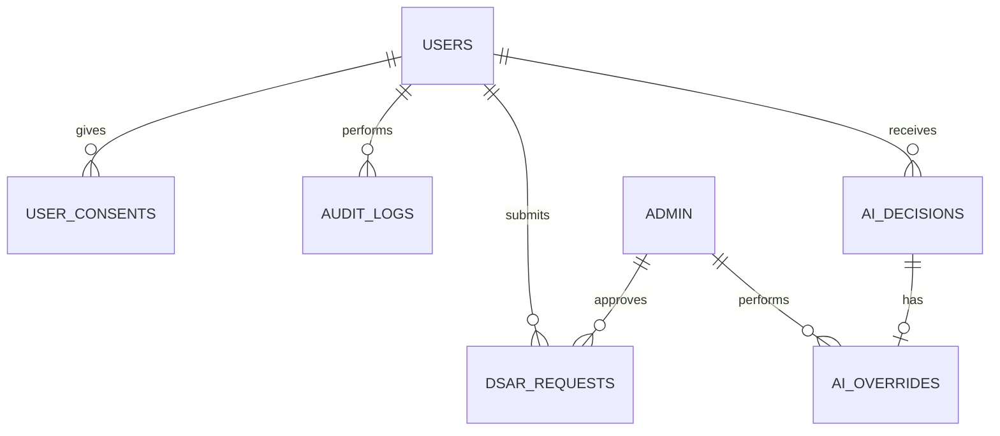

# 13bis GDPR Compliance & AI Act Governance + Security Dev Rules

**Version:** MVP Juillet 2026 (Ultra Critique — Transversal à TOUS les modules)  
**Status:** 🟢 Spécification en cours  
---

## 📖 Vue d'Ensemble

### Objectif Métier

Assurer que la plateforme Learning App SBO respecte **complètement les régulations GDPR et AI Act** tout en implémentant des **règles strictes de sécurité développement**. Ce cahier définit les constraints légales, de gouvernance IA, et de sécurité que **TOUS les modules MVP doivent respecter** dès le développement.

Ce n'est pas une implémentation technique (plugins externes gèrent la techno), mais un **cahier de règles et guidelines** pour encadrer le développement de tous les modules.

### Qui l'Utilise (Rôles)

**Développeurs (Back-End + Front-End)**
- Implémentent les règles GDPR dans le code (consent, data handling)
- Intègrent les rules AI Act (transparency, override mechanisms)
- Respectent les Security Dev Rules (input validation, logging, secrets)
- Valident chaque feature contre les règles avant PR

**Architects/Tech Leads**
- Définissent les patterns d'implémentation pour chaque règle
- Créent des utilities/libraries réutilisables (consent SDK, audit logger, etc.)
- Validez conformité architecture vs règles

**Compliance Officer / Legal**
- Valident interprétation des règles GDPR/AI Act
- Signent la conformité finale avant launch

**Product / Project Manager**
- Trackent la conformité par feature
- S'assurent que aucune feature MVP ne bypasse les règles
- Gèrent les escalations si règles bloquent feature

**Admin / Support**
- Implémentent les workflows de DSAR (Data Subject Access Requests)
- Gèrent les droits à l'oubli (account deletion)
- Monitorent les alertes de sécurité/compliance

### Scope — IN / OUT

#### ✅ IN (MVP Juillet — RÈGLES & GOVERNANCE)

**A. GDPR Compliance Rules**
- Consent Management (opt-in/out pour toutes les données)
- Data Subject Access Requests (DSAR) — export user data
- Right to Be Forgotten (RTBF) — delete user data completely
- Data Processing Agreement (DPA) setup & clauses
- Audit Trails & Compliance Logging (who accessed what, when)
- Data Retention Policies (storage limits, auto-delete schedules)
- Cookie & Tracking Consent (FR/EN/ESP/IT versions)
- RIEC Classification (données sensibles par catégorie)

**B. AI Act Governance (Mistral Chatbot + Matching IA)**
- Transparency Rule : User notified when interaction is with IA
- Human Override Mechanism : Admin/Coach can override/reject IA decision
- Bias Monitoring Framework :
  - Explainability Logging : Every IA decision logs rationale
  - Feedback Loop : User/Admin corrections tracked → analyze bias patterns
  - Fairness Metrics : Periodic audits (equitable recommendations?)
  - Override Tracking : Count when humans override IA → identify discrimination

**C. Security Development Rules (Bonnes Normes Code + OWASP)**
- Input Validation & Sanitization (prevent injection attacks)
- Error Handling (no sensitive data in error messages/logs)
- Secrets Management (API keys, database passwords never in code)
- Authentication & Authorization (enforce role-based access)
- Logging & Monitoring (secure logging, no PII in logs)
- CORS & CSRF Protection (prevent cross-origin exploits)
- Rate Limiting (prevent brute force, DDoS)
- SQL Injection Prevention (prepared statements, ORM)
- XSS Prevention (template escaping, CSP headers)
- HTTPS Enforcement (all traffic encrypted)
- Dependency Scanning (catch vulnerable packages)
- Secure Password Storage (bcrypt/Argon2, salt+hash)

#### ❌ OUT (Technical Implementation)
- Actual encryption algorithms (plugins external)
- Actual WAF (Web Application Firewall) setup (external tool)
- Actual DLP (Data Loss Prevention) infrastructure
- Actual SIEM (Security Information & Event Management) implementation
- Pen testing & red team exercises (external contractor)

---

## 👥 Rôles Affectés

**Tous les modules MVP doivent implémenter ces règles.**

Modules affectés par chaque règle:
- **Consent Management** : Formation, Passeport, Onboarding, Coaching, BO+Analytics, JAC, Gamification, Déploiement IA
- **DSAR + RTBF** : Onboarding, BO+Analytics (export/delete workflows)
- **Audit Logging** : BO+Analytics (central audit log for all modules)
- **IA Transparency + Override** : Déploiement IA (Projects SBO), future Chatbot
- **Bias Monitoring** : Passeport (matching recommendations), Déploiement IA (project suggestions)
- **Security Dev Rules** : Tous les modules

---

## 📱 Écrans à Concevoir

### Front-Office (React)

| Écran | Rôle | Description | Priorité |
|-------|------|-------------|----------|
| **Consent Banner** | Apprenant, Coach, Manager | Initial consent for data collection, marketing, analytics (GDPR-compliant banner) | P0 |
| **Consent Management Settings** | Apprenant, Coach, Manager | Update consent anytime (accept/revoke different types: essential, analytics, marketing) | P0 |
| **Data Access Request (DSAR)** | Apprenant | "Download my data" button → triggers DSAR workflow → email with download link | P1 |
| **Account Deletion (RTBF)** | Apprenant | "Delete my account forever" → confirmation dialog → triggers account deletion workflow | P1 |
| **AI Transparency Indicator** | Apprenant, Coach | Visual badge/label "This is AI recommendation" on IA-generated content | P0 |
| **AI Override Button** | Coach, Admin | "Override this recommendation" or "Reject this suggestion" button with reason | P1 |

### Back-Office (WordPress Admin)

| Écran | Rôle | Description | Priorité |
|-------|------|-------------|----------|
| **Compliance Dashboard** | Admin, Legal | Overview: GDPR status, pending DSARs, RTBFs, audit log summary, compliance checklist | P1 |
| **DSAR Management** | Admin | List pending DSARs, approve/deny, generate export, track completion | P0 |
| **Account Deletion Workflow** | Admin | List pending deletions, confirm final deletion, verify data purged | P0 |
| **Audit Log Viewer** | Admin, Compliance | Search/filter audit logs (who accessed what, when, why), export for audits | P0 |
| **Data Retention Policy Manager** | Admin | Define retention schedules (e.g., delete inactive user data after 2 years) | P1 |
| **AI Monitoring Dashboard** | Admin, Legal | Bias monitoring: view IA decisions, override counts, fairness metrics, alert on anomalies | P1 |
| **Consent Analytics** | Admin | Track consent rates by type (essential, analytics, marketing), consent withdrawal trends | P1 |
| **Security Audit Checklist** | Admin, Tech Lead | Verify all modules implement security rules (input validation, secrets management, logging) | P1 |

---

## ⚙️ Fonctionnalités (MVP)

### Core — GDPR Compliance

1. **Consent Management System**
   - On signup + periodic consent reminders
   - Types: Essential (required), Analytics (optional), Marketing (optional)
   - Store consent timestamp + user version (legal track)
   - User can change consent anytime in settings

2. **Data Subject Access Request (DSAR)**
   - Apprenant peut demander export de toutes ses données
   - Admin receives request, approves within 30 days (GDPR legal requirement)
   - System generates ZIP with: profile data, learning history, passeport, missions, journal, coaching, etc.
   - Apprenant downloads via secure link (expires after 48h)

3. **Right to Be Forgotten (RTBF)**
   - Apprenant can request complete account deletion
   - Admin receives request, confirms with apprenant (to prevent accidental deletion)
   - System deletes: user profile, all personal data (except what legally must retain for business)
   - Audit log records the deletion (legal proof)

4. **Data Processing Agreement (DPA)**
   - Company managers sign DPA before platform access
   - DPA embedded in legal terms + downloadable PDF
   - Track signature electronically + store proof

5. **Audit Trail & Compliance Logging**
   - Central audit log: Every action logged (create/read/update/delete of sensitive data)
   - Logged events: User login, data access, DSAR request, RTBF request, consent change, IA decision override, etc.
   - Queryable by: user, timestamp, action, module
   - Retention: 3 years minimum (legal requirement)

6. **Data Retention Policies**
   - Define auto-delete schedules (e.g., delete inactive users after 2 years)
   - Automatic purge job runs on schedule
   - Compliance report tracks what was deleted

7. **Cookie & Tracking Consent**
   - Consent banner on first visit (GDPR compliant)
   - Translations: FR/EN/ESP/IT
   - Tracks: Essential cookies (required), Analytics (Google Analytics opt-in), Marketing (retargeting opt-in)
   - User can revoke anytime

### Core — AI Act Governance

1. **Transparency: IA Label on Content**
   - Every IA-generated recommendation labeled "AI Generated" or "Suggested by our learning algorithm"
   - Example: Passeport matching showing "Recommended based on your profile (AI)"
   - Example: Chatbot showing "Powered by AI Assistant"

2. **Human Override Mechanism**
   - Coach can override/reject IA recommendations
   - Button: "Override recommendation" or "Suggest different path"
   - Admin logs the override (for bias analysis)
   - Apprenant notified of change with explanation

3. **Bias Monitoring Framework**
   - **Explainability Logging** : Every IA decision logs rationale (e.g., "Recommended competence X because: user profile matches, similar users progressed, 72% confidence")
   - **Feedback Loop** : When human overrides IA, system logs: what IA recommended, what human chose, why (reason required)
   - **Fairness Metrics** : Weekly/monthly reports on recommendation equity (do all groups receive balanced recommendations?)
   - **Override Tracking** : Count overrides by type → identify if IA discriminates (e.g., "40% of female users override IA vs 10% male" = potential bias)
   - **Alert System** : Compliance officer notified if bias metrics exceed thresholds

### Core — Security Development Rules

1. **Input Validation & Sanitization**
   - All user inputs validated (type, length, format)
   - All inputs sanitized before DB storage (prevent SQL injection)
   - Whitelist approach (only allow known-good chars, not blacklist bad)

2. **Error Handling**
   - Never show stack traces or internal errors to users
   - Log detailed errors server-side (for debugging)
   - Client-side: Show generic "Something went wrong" messages
   - Never expose PII in error messages (e.g., don't say "Email john@example.com not found")

3. **Secrets Management**
   - No API keys, passwords, or secrets in code/config files
   - Use environment variables or secret management service (e.g., HashiCorp Vault)
   - Rotate secrets regularly
   - Audit who accesses secrets

4. **Authentication & Authorization**
   - Enforce role-based access control (RBAC)
   - Every endpoint checks user role/permissions before serving data
   - Sessions expire after inactivity (30 min default)
   - MFA (multi-factor auth) ready for future

5. **Logging & Monitoring**
   - Log all security-relevant events (failed login, unauthorized access attempt, data access)
   - Never log passwords, API keys, PII in logs
   - Logs stored securely + retained for audit (90 days minimum)
   - Alerts on suspicious activity (10 failed logins = alert)

6. **CORS & CSRF Protection**
   - CORS headers restrict to known domains only
   - CSRF tokens on all state-changing requests (POST/PUT/DELETE)
   - SameSite cookies prevent cross-site attacks

7. **Rate Limiting**
   - API rate limits: 100 requests/min per user (prevent brute force)
   - Stricter limits on auth endpoints: 5 login attempts/5 min
   - DDoS protection (via WAF external)

8. **SQL Injection Prevention**
   - Use parameterized queries / prepared statements (never string concatenation)
   - Use ORM (e.g., Sequelize, Django ORM) when possible

9. **XSS (Cross-Site Scripting) Prevention**
   - Template escaping (auto-escape user content in HTML templates)
   - Content Security Policy (CSP) headers restrict inline scripts
   - Never use eval() or innerHTML with user data

10. **HTTPS Enforcement**
    - All traffic encrypted (TLS 1.2+)
    - HSTS header forces HTTPS on client
    - Cert pinning for API clients (optional, for extra security)

11. **Dependency Scanning**
    - Run security scans on npm/pip packages (detect CVEs)
    - Update packages regularly
    - Don't use outdated or unmaintained libraries

12. **Secure Password Storage**
    - Hash passwords with bcrypt (Argon2 preferred)
    - Never store plain-text passwords
    - Use salt (automatic in bcrypt)

---

## 🚀 Possible Évolutions (V2+)

### V2 (Septembre 2026)
- Advanced consent granularity (consent per feature, per data type)
- GDPR right to rectification (user can correct their data)
- Automated DSAR export scheduling (e.g., monthly auto-exports)
- Bias auditing external integration (e.g., Fairness Indicators library)
- Advanced AI explainability (detailed reason cards for every IA decision)
- PII tokenization (replace sensitive data with tokens in logs)
- Encryption at rest (optional, for extra security)

### V3 (2027+)
- Blockchain audit trail (immutable record of data access)
- AI model versioning (track which model version made which decision)
- Automated compliance reporting (GDPR annual report generation)
- Multi-jurisdictional compliance (CCPA, HIPAA support)
- Homomorphic encryption (computations on encrypted data)

---

## 👥 User Journeys (Format 3 — CRITICAL SECTION)

### User Journey #1 : Developer → Implémente GDPR Consent Rule

**Acteur :** Backend Developer (building consent system)  
**Déclencheur :** Tasked with implementing consent management before user signup  
**Objectif :** Implement consent capture + storage + user change anytime

#### Étapes Détaillées

1. **Developer reads GDPR Consent Rule specification**
   - Documentation explains: Consent types (essential, analytics, marketing)
   - Timestamp storage requirement (prove when user consented)
   - GDPR requirement: User must approve each type (not pre-checked)
   - Feedback : Clear spec document with examples
   - Durée : ~30 min

2. **Developer designs database schema**
   - Creates table: user_consents (user_id, consent_type, accepted, timestamp, version)
   - Indexes on user_id + timestamp (for audits)
   - Feedback : Schema reviewed by Tech Lead against GDPR requirement
   - Durée : ~30 min

3. **Developer implements consent API endpoints**
   - POST /api/v1/consent — user grants/revokes consent
   - GET /api/v1/consent — user checks current consent status
   - Feedback : API logs consent change to audit trail + sends email confirmation
   - Durée : 2-3 hours

4. **Developer creates consent banner frontend**
   - React component showing 3 toggles (essential pre-checked, analytics/marketing unchecked)
   - "Accept" button saves consent via API
   - Feedback : Cypress integration test validates consent flow
   - Durée : 2-3 hours

5. **Developer tests edge cases**
   - Test: User revokes consent → future data not collected
   - Test: User re-grants consent → collection resumes
   - Test: Email sent confirming consent change
   - Feedback : All tests pass, no PII logged
   - Durée : 1-2 hours

6. **Code review against Security Dev Rules**
   - Tech Lead reviews: No hardcoded secrets? ✅ Input sanitized? ✅ Errors don't leak PII? ✅
   - PR approved if all GDPR + Security rules met
   - Feedback : PR comment checklist completed
   - Durée : ~1 hour

7. **Merge to staging + compliance sign-off**
   - Compliance officer verifies: Consent matches GDPR spec exactly
   - Deploys to staging
   - Feedback : Compliance sign-off recorded (audit trail)
   - Durée : ~30 min

#### Conditions de Succès ✅
- [ ] Consent captured at signup (all types visible)
- [ ] Consent change logged to audit trail with timestamp
- [ ] Email confirmation sent when consent changes
- [ ] User can revoke consent anytime from settings
- [ ] Pre-checked: Essential only (analytics/marketing unchecked)
- [ ] No PII leaked in logs or error messages
- [ ] API input validation prevents injection
- [ ] Timestamp stored in UTC (timezone-agnostic)

#### Erreurs & Edge Cases ❌

**Cas 1 : User revokes consent then asks for DSAR (data already collected)**
- Scénario : User consented to analytics week 1, revoked week 2, asks for DSAR week 3
- Comportement attendu :
  - Step 1: DSAR export includes analytics data collected week 1 (legitimate, was consented then)
  - Step 2: DSAR shows "Analytics consent revoked on [date]" (audit proof)
  - Step 3: User notified that analytics data pre-revocation included in export
  - Feedback : Clear audit trail shows when data was collected + when consent changed
- Impact : Legal proof of consent history

**Cas 2 : Marketing consent revoked but email already sent**
- Scénario : User revokes marketing consent, but marketing email in queue
- Comportement attendu :
  - Step 1: Consent revocation checked before email send job
  - Step 2: Email not sent (respect revocation)
  - Step 3: Audit log shows "Email not sent due to revoked consent"
  - Feedback : No unwanted emails, clean audit trail
- Impact : User privacy respected, compliance maintained

**Cas 3 : Consent data deleted during RTBF (Right to Be Forgotten)**
- Scénario : User deletes account → consent table should be purged
- Comportement attendu :
  - Step 1: Account deletion triggers cascade delete (user_consents rows deleted)
  - Step 2: BUT audit trail records "User RTBF request approved [date]" (legal proof of deletion)
  - Step 3: Audit log itself retained for 3 years (GDPR legal requirement)
  - Feedback : Complete data deletion + audit proof maintained
- Impact : GDPR RTBF satisfied, legal compliance proven

**Cas 4 : Developer forgets to log consent change**
- Scénario : Consent API updates database but doesn't log to audit trail
- Comportement attendu :
  - Step 1: Code review catches missing audit log call
  - Step 2: Developer adds audit log before merge
  - Step 3: PR re-approved
  - Feedback : Security rule enforced (no bypass allowed)
- Impact : All consent changes auditable

---

### User Journey #2 : Admin → Processes Data Subject Access Request (DSAR)

**Acteur :** Admin / Compliance Officer  
**Déclencheur :** Apprenant submits "Download my data" request from settings  
**Objectif :** Approve DSAR, generate full data export, send download link to user

#### Étapes Détaillées

1. **Apprenant clicks "Download my data" in settings**
   - Confirmation dialog: "This will create an export of all your data in PDF + CSV format"
   - Submit DSAR request
   - Feedback : "Request submitted. You'll receive email when ready (within 30 days per GDPR)"
   - Durée : Instant

2. **Admin receives DSAR notification**
   - Email alert: "New DSAR request from [username] on [date]"
   - Admin opens BO → Compliance Dashboard → DSAR Management
   - Feedback : List of pending DSARs with submit date + 30-day deadline
   - Durée : Real-time notification

3. **Admin reviews DSAR request**
   - Checks: Is requester the actual user? (verify user_id matches)
   - Verifies: Request timestamp is recent (< 30 days per GDPR)
   - Behavior : Admin can approve or deny (if fraudulent)
   - Feedback : Decision logged to audit trail
   - Durée : ~5 min

4. **Admin approves DSAR**
   - Click [Approve] button
   - System triggers export job: Gathers user data from all modules
   - Data includes: Profile, learning history, passeport, missions, journal, coaching, consent history, communications
   - Format : PDF (human-readable) + CSV (data spreadsheet)
   - Feedback : "Export generating... This may take a few minutes"
   - Durée : 2-5 minutes (depends data volume)

5. **System generates secure download link**
   - ZIP file created with PDF + CSVs
   - Download link generated (temporary, expires after 48h)
   - Email sent to user: "Your data export is ready. Click here to download: [secure link]"
   - Feedback : Admin sees status "Export sent" + timestamp
   - Durée : < 1 minute

6. **Apprenant receives export and downloads**
   - Email received within 2 minutes
   - Click download link → ZIP file downloads
   - Feedback : "Your data will be available for 48 hours. After that, the link expires (per GDPR)"
   - Durée : Instant

7. **Admin records DSAR completion**
   - Dashboard shows DSAR as "Completed" with date + user confirmation
   - Audit log records: DSAR approved, export generated, user notified, deadline met
   - Feedback : Compliance checklist updated
   - Durée : ~30 seconds

#### Conditions de Succès ✅
- [ ] DSAR request submitted & logged in audit trail
- [ ] Admin notified within 1 hour
- [ ] Export includes all user personal data (no omissions)
- [ ] Export generated within 30 days (GDPR deadline)
- [ ] Download link secure + temporary (48h expiry)
- [ ] User receives email notification with link
- [ ] Completion recorded in audit trail
- [ ] No PII exposed in logs or notifications

#### Erreurs & Edge Cases ❌

**Cas 1 : DSAR request from someone who isn't the actual user**
- Scénario : User X submits DSAR for User Y (identity fraud attempt)
- Comportement attendu :
  - Step 1: DSAR submission checks user_id matches authenticated user
  - Step 2: If mismatch detected, deny request + alert
  - Step 3: Admin notified of fraud attempt
  - Feedback : "Request denied. Only account owner can submit DSAR."
- Impact : User data protected from unauthorized access

**Cas 2 : DSAR export takes too long (> 30 days)**
- Scénario : System overloaded, export job delayed
- Comportement attendu :
  - Step 1: Alert system monitors DSAR age
  - Step 2: If approaching 30-day deadline, escalate to admin
  - Step 3: Admin either speeds up export or requests GDPR extension
  - Step 4: User notified of delay + reason
  - Feedback : GDPR compliance maintained (deadline met or extension approved)
- Impact : Legal compliance, user trust

**Cas 3 : Download link expires before user downloads**
- Scénario : User receives email but doesn't download within 48h
- Comportement attendu :
  - Step 1: Link expires after 48h (automatic)
  - Step 2: User clicks expired link → "Link expired. Request new export?"
  - Step 3: User resubmits DSAR, process repeats
  - Step 4: Admin fast-tracks re-approval (no delay)
  - Feedback : Secure design (temp links don't live forever) + user-friendly re-request
- Impact : Security + compliance

---

### User Journey #3 : Developer → Implements AI Transparency + Override

**Acteur :** Backend + Frontend Developer (implementing IA governance)  
**Déclencheur :** Tasked with adding transparency labels + override buttons to IA recommendations  
**Objectif :** Implement "This is AI" label + override mechanism + logging

#### Étapes Détaillées

1. **Developer reads AI Act Transparency Rule**
   - Spec: Every IA recommendation must show "AI Generated" label
   - Coach/Admin must be able to override recommendation with reason
   - Every override logged for bias analysis
   - Feedback : Clear spec with mockups
   - Durée : ~30 min

2. **Backend: Implement IA decision logging**
   - Create table: ai_decisions (id, user_id, decision_type, recommendation, rationale, confidence, timestamp, override_id)
   - Decision_type: "competence_match", "project_suggestion", "learning_path", etc.
   - Rationale: Human-readable explanation (e.g., "User profile + skill gaps match this competence 78%")
   - Feedback : Tech Lead reviews schema, checks GDPR compliance (no sensitive PII in rationale)
   - Durée : 1-2 hours

3. **Backend: Create override endpoint**
   - POST /api/v1/ai-decisions/:decision_id/override
   - Body: { reason: "User has different background", override_choice: "alternate_path" }
   - Validation: Only Coach/Admin can override (role check)
   - Feedback : Override logged to audit trail + bias monitoring system
   - Durée : 2-3 hours

4. **Frontend: Add transparency label**
   - React component shows "AI Generated" badge on recommendation
   - Color: Neutral (not misleading)
   - Tooltip: "This recommendation was created by our learning algorithm based on your profile"
   - Feedback : A/B test to ensure label doesn't confuse users
   - Durée : 1-2 hours

5. **Frontend: Add override button**
   - Button visible to Coach only: "Override this recommendation"
   - Click → modal asks for reason
   - Reason required (free-text field, 10-500 chars)
   - Feedback : Reason logged for bias analysis
   - Durée : 1-2 hours

6. **Implement bias monitoring aggregation**
   - Create job: Weekly, aggregate override data
   - Queries: "How often is IA overridden by role/department/competence type?"
   - Alerts: If override rate > threshold (e.g., > 30% for a competence type), alert compliance officer
   - Feedback : Dashboard shows fairness metrics
   - Durée : 2-3 hours

7. **Testing + code review**
   - Test: Label visible on all IA recommendations ✅
   - Test: Override button only visible to Coach ✅
   - Test: Reason logged + appears in audit trail ✅
   - Test: Bias report aggregates correctly ✅
   - Code review: Security rules checked ✅
   - Feedback : All tests pass, PR approved
   - Durée : 2-3 hours

#### Conditions de Succès ✅
- [ ] "AI Generated" label visible on all IA recommendations
- [ ] Label not misleading (clear it's automated, not human-made)
- [ ] Override button accessible to Coach/Admin only
- [ ] Override reason required + logged to audit trail
- [ ] Rationale (why IA recommended) logged + auditable
- [ ] Bias monitoring aggregates overrides correctly
- [ ] Alerts triggered if bias threshold exceeded
- [ ] Compliance officer receives notification

#### Erreurs & Edge Cases ❌

**Cas 1 : IA recommendation overridden frequently for one user type (bias signal)**
- Scénario : 70% of recommendations for junior employees are overridden, vs 10% for seniors
- Comportement attendu :
  - Step 1: Bias monitoring detects override rate anomaly
  - Step 2: Alert sent to compliance officer + legal team
  - Step 3: Investigation: Is IA algorithm biased against junior employees?
  - Step 4: If bias confirmed, IA model tuning required (future version)
  - Feedback : Transparent process, human oversight activated
- Impact : Discrimination prevented, fairness maintained

**Cas 2 : Admin overrides IA but doesn't provide reason**
- Scénario : Override submitted with empty reason field
- Comportement attendu :
  - Step 1: Validation error "Reason required"
  - Step 2: Admin must enter reason (required field)
  - Step 3: Only after reason provided, override accepted
  - Feedback : Enforce accountability (no anon overrides)
- Impact : All bias data traceable + auditable

**Cas 3 : Apprenant confused by "AI Generated" label**
- Scénario : User thinks recommendation is wrong because it's "just AI"
- Comportement attendu :
  - Step 1: Tooltip explains how IA recommendation was derived
  - Step 2: Link to detailed rationale (e.g., "Based on your skill profile + similar users' paths")
  - Step 3: User can review past IA decisions in history
  - Feedback : Transparency + education helps user trust
- Impact : User understanding + trust in IA

---

### User Journey #4 : Developer → Implements Security Dev Rule (Input Validation)

**Acteur :** Backend Developer (building API endpoint)  
**Déclencheur :** Tasked with creating endpoint for user data update, must follow Security Dev Rules  
**Objectif :** Implement endpoint with proper input validation + sanitization + error handling

#### Étapes Détaillées

1. **Developer reads Security Dev Rule: Input Validation**
   - Spec: All user inputs must be validated (type, length, format)
   - Whitelist approach: only allow known-good patterns
   - Sanitize before DB storage (prevent SQL injection)
   - Feedback : Security rules checklist provided
   - Durée : ~30 min

2. **Developer designs validation schema**
   - Example endpoint: PATCH /api/v1/users/:user_id/profile
   - Fields: name (string, 1-100 chars), email (valid email format), phone (valid format)
   - Validation library: Joi or Yup (express/Node.js)
   - Feedback : Schema peer-reviewed
   - Durée : ~30 min

3. **Implement input validation**
   - Code: Validate each field before processing
   - Reject invalid inputs with 400 error (bad request)
   - Feedback : Error message doesn't expose internal structure (generic "Invalid input" message)
   - Durée : ~1 hour

4. **Implement input sanitization**
   - Remove special chars that could cause SQL injection
   - Escape HTML entities (prevent XSS)
   - Use parameterized queries (ORM handles it automatically)
   - Feedback : Never concatenate user input into SQL queries
   - Durée : ~1 hour

5. **Implement error handling**
   - Try-catch blocks around DB operations
   - Log detailed errors server-side (for debugging)
   - Return generic error to client (never expose stack trace or internal details)
   - Feedback : Logs never contain PII (user passwords, emails, etc.)
   - Durée : ~1 hour

6. **Write tests for edge cases**
   - Test: Valid input accepted ✅
   - Test: Invalid format rejected (e.g., "abc" for email) ✅
   - Test: Too-long input rejected (e.g., 200-char name) ✅
   - Test: SQL injection attempt blocked ✅
   - Test: XSS payload rejected ✅
   - Feedback : All tests pass
   - Durée : ~2 hours

7. **Code review against Security Dev Rules checklist**
   - Tech Lead checks: Input validated? ✅ Sanitized? ✅ Error doesn't leak PII? ✅ No hardcoded secrets? ✅ Logging secure? ✅
   - OWASP top 10 compliance verified
   - Feedback : Security checklist signed off
   - Durée : ~1 hour

#### Conditions de Succès ✅
- [ ] All inputs validated (type, length, format)
- [ ] Invalid inputs rejected with 400 error
- [ ] Error messages don't expose internal details
- [ ] SQL injection attempts prevented
- [ ] XSS payloads rejected
- [ ] Logs don't contain PII
- [ ] Secrets (API keys) not in code
- [ ] All unit tests pass

#### Erreurs & Edge Cases ❌

**Cas 1 : Developer forgets sanitization → SQL injection possible**
- Scénario : Input validated but not sanitized → attacker injects SQL
- Comportement attendu :
  - Step 1: Code review catches missing sanitization
  - Step 2: Developer adds ORM/parameterized queries
  - Step 3: PR re-tested, approved
  - Feedback : Security rule enforced
- Impact : Vulnerability prevented

**Cas 2 : Error message leaks user email in response**
- Scénario : Developer returns error "Email john@example.com already in use"
- Comportement attendu :
  - Step 1: Security review catches PII leak
  - Step 2: Developer changes error to "Email already in use" (generic)
  - Step 3: PR re-approved
  - Feedback : GDPR rule enforced (no accidental PII exposure)
- Impact : Privacy maintained

---

## 🗄️ Modèle de Données

### Entités Principales

#### 1. **user_consents** (GDPR Consent tracking)
| Colonne | Type | Description |
|---------|------|-------------|
| `id` | UUID | Primary key |
| `user_id` | UUID FOREIGN | References users(id) |
| `consent_type` | ENUM | 'essential', 'analytics', 'marketing' |
| `accepted` | BOOLEAN | True if consented, false if revoked |
| `timestamp` | TIMESTAMP | When consent was given/revoked |
| `version` | VARCHAR | Version of consent text (legal tracking) |
| `ip_address` | INET | IP when consent given (audit) |
| INDEX `idx_user` (user_id) | | |
| INDEX `idx_timestamp` (timestamp) | | |

#### 2. **audit_logs** (GDPR Compliance audit trail)
| Colonne | Type | Description |
|---------|------|-------------|
| `id` | UUID | Primary key |
| `user_id` | UUID FOREIGN | References users(id) (nullable for system actions) |
| `action` | VARCHAR(100) | "data_access", "consent_change", "dsar_request", "account_deletion", "ai_override", "login", etc. |
| `resource_type` | VARCHAR(100) | "profile", "learning_history", "passeport", "mission", etc. |
| `resource_id` | VARCHAR(100) | ID of affected resource |
| `details` | JSONB | Additional context (e.g., what fields were accessed) |
| `timestamp` | TIMESTAMP | When action occurred |
| `ip_address` | INET | IP address of actor |
| INDEX `idx_user` (user_id) | | |
| INDEX `idx_timestamp` (timestamp) | | |
| INDEX `idx_action` (action) | | |
| RETENTION POLICY | 3 years | Auto-delete after 3 years |

#### 3. **dsar_requests** (Data Subject Access Requests)
| Colonne | Type | Description |
|---------|------|-------------|
| `id` | UUID | Primary key |
| `user_id` | UUID FOREIGN | References users(id) |
| `request_date` | TIMESTAMP | When DSAR submitted |
| `deadline` | TIMESTAMP | 30 days from request (GDPR requirement) |
| `status` | ENUM | 'pending', 'approved', 'denied', 'completed' |
| `admin_id` | UUID FOREIGN | Admin who approved |
| `export_url` | VARCHAR(500) | Temporary download link |
| `completed_date` | TIMESTAMP | When export sent to user |
| `notes` | TEXT | Admin notes |
| INDEX `idx_user` (user_id) | | |
| INDEX `idx_status` (status) | | |

#### 4. **ai_decisions** (AI transparency + bias monitoring)
| Colonne | Type | Description |
|---------|------|-------------|
| `id` | UUID | Primary key |
| `user_id` | UUID FOREIGN | References users(id) |
| `decision_type` | VARCHAR(100) | "competence_match", "project_suggestion", "learning_path_recommendation" |
| `recommendation` | JSONB | What IA recommended (e.g., { competence_id: "...", path_id: "..." }) |
| `rationale` | TEXT | Human-readable explanation (e.g., "User profile matches competence X at 78% confidence") |
| `confidence_score` | FLOAT(0-1) | AI's confidence in recommendation (0-100%) |
| `is_overridden` | BOOLEAN | True if human overrode |
| `override_id` | UUID FOREIGN | References ai_overrides(id) |
| `timestamp` | TIMESTAMP | When decision made |
| INDEX `idx_user` (user_id) | | |
| INDEX `idx_type` (decision_type) | | |
| INDEX `idx_overridden` (is_overridden) | | |

#### 5. **ai_overrides** (AI decision overrides for bias analysis)
| Colonne | Type | Description |
|---------|------|-------------|
| `id` | UUID | Primary key |
| `ai_decision_id` | UUID FOREIGN | References ai_decisions(id) |
| `override_by_user_id` | UUID FOREIGN | Coach/Admin who overrode |
| `override_reason` | TEXT | Why human overrode (required, e.g., "User has different background") |
| `override_choice` | JSONB | What human chose instead |
| `timestamp` | TIMESTAMP | When override occurred |
| INDEX `idx_decision` (ai_decision_id) | | |
| INDEX `idx_user` (override_by_user_id) | | |

### Schéma Simplifié (Mermaid)

---

## 🔌 API / Endpoints

### GDPR Consent Endpoints

#### **POST /api/v1/consent**
Update user consent (grant or revoke)
- Body: `{consent_type: 'analytics' | 'marketing', accepted: true | false}`
- Response: Updated consent status + confirmation email sent

#### **GET /api/v1/consent**
Get current user's consent status
- Response: Object with all consent types + timestamps

#### **GET /api/v1/consent/history**
Get consent change history (audit)
- Response: Array of consent changes (timestamp, type, accepted/revoked)

### DSAR & Data Rights Endpoints

#### **POST /api/v1/data-subject-access-request**
Submit DSAR request (user downloads their data)
- Body: `{confirmation: true}` (user confirms)
- Response: `{status: 'pending', deadline_date: '2026-06-09'}`

#### **GET /api/v1/data-subject-access-request/status**
Check DSAR status
- Response: `{status: 'pending' | 'completed', download_link: '...' (if ready)}`

#### **POST /api/v1/account/delete-request**
Submit Right to Be Forgotten (RTBF) request
- Body: `{confirmation: true, reason: '...'}`
- Response: `{status: 'pending', deadline_date: '...'}`

### Admin Endpoints (GDPR Management)

#### **GET /api/v1/admin/dsar-requests**
List pending DSAR requests (admin only)
- Response: Array of DSARs with status + deadline

#### **PATCH /api/v1/admin/dsar-requests/:request_id**
Approve/deny DSAR request
- Body: `{status: 'approved' | 'denied', notes: '...'}`
- Response: Updated DSAR

#### **GET /api/v1/admin/audit-logs**
Query audit trail
- Query params: `?action=`, `?user_id=`, `?date_from=`, `?date_to=`
- Response: Array of audit log entries

### AI Governance Endpoints

#### **GET /api/v1/ai-decisions/:user_id**
Get user's IA decisions (transparency)
- Response: Array of decisions with rationale + confidence

#### **POST /api/v1/ai-decisions/:decision_id/override**
Override IA recommendation
- Body: `{reason: '...', override_choice: {...}}`
- Response: Override logged + AI notified

#### **GET /api/v1/admin/ai-bias-metrics**
Get bias monitoring report
- Query params: `?period=weekly|monthly`, `?competence_id=`, `?user_role=`
- Response: Override rates, fairness scores, alerts

---

## ✅ Critères d'Acceptation MVP

### GDPR Compliance
- [x] Consent capture at signup (all types visible, essential only pre-checked)
- [x] Consent change logged to audit trail
- [x] Email confirmation sent when consent changes
- [x] User can revoke consent anytime
- [x] DSAR request form available (Download my data)
- [x] DSAR export generated within 30 days (GDPR deadline)
- [x] Export includes: profile, learning history, communications, consent history
- [x] RTBF (Right to Be Forgotten) request form available
- [x] Account deletion purges all user data (except audit trail)
- [x] Audit trail records all data access + modifications
- [x] DPA terms available + signed by company managers
- [x] Data retention policies defined (auto-delete old data)

### AI Act Governance
- [x] "AI Generated" label visible on all IA recommendations
- [x] Label tooltip explains how IA made recommendation
- [x] Coach/Admin can override IA decision with reason
- [x] Override reason logged (for bias analysis)
- [x] AI decision rationale logged (explainability)
- [x] Bias monitoring aggregates override data
- [x] Weekly/monthly fairness report generated
- [x] Alerts triggered if bias threshold exceeded
- [x] Compliance officer receives bias alerts

### Security Development Rules
- [x] Input validation on all endpoints (type, length, format)
- [x] SQL injection prevention (parameterized queries)
- [x] XSS prevention (HTML escaping, CSP headers)
- [x] Error messages don't expose PII or internal details
- [x] No hardcoded secrets in code (env vars only)
- [x] Logging secure (no PII logged)
- [x] CORS configured (known domains only)
- [x] CSRF tokens on all POST/PUT/DELETE
- [x] Rate limiting on auth endpoints
- [x] Passwords hashed with bcrypt
- [x] HTTPS enforced
- [x] Dependency scanning for CVEs

### Performance & Audit
- [x] Consent capture < 200ms
- [x] DSAR export generated < 5 min (for average user)
- [x] Audit log queries < 500ms (even with 100K entries)
- [x] Bias report generated < 1 min
- [x] No security rule violations in code review

---

## 🔗 Dépendances Inter-Modules

### Dépend De

| Module | Raison |
|--------|--------|
| **Aucun** | Cette cahier est FONDATION — définit les règles que TOUS les modules respectent |

### Bloque

| Module | Raison | Détails |
|--------|--------|---------|
| **TOUS les modules MVP** | Compliance requirement | Tous les modules doivent implémenter: Consent management, Audit logging, Security Dev rules |
| **Formation (#1)** | GDPR + Security | Doit tracker user learning + log accesses audit trail + validate input |
| **Passeport (#2)** | GDPR + AI Act | Doit implémenter: IA transparency label, bias monitoring, consent for data tagging |
| **Onboarding (#3)** | GDPR + Security | Doit capture consent, validate input, hash passwords securely |
| **Coaching (#4)** | GDPR + AI + Security | Doit implémenter: override mechanism for IA suggestions, audit log coaching interactions |
| **JAC (#5)** | GDPR + Security | Doit audit trail competence validations |
| **Déploiement IA (#6)** | AI Act critical | Doit show "AI Generated" label, implement override mechanism, log all IA decisions |
| **Gamification (#7)** | GDPR | Doit consent consent for XP tracking |
| **BO+Analytics (#8)** | GDPR + Audit | Doit provide DSAR export, RTBF deletion, audit log viewer, consent dashboard |

---

## 📊 Planning & Budget Estimé

### Effort Total: 60-80 heures

#### Breakdown par Phase

| Phase | Composant | Effort (h) | Timeline |
|-------|-----------|-----------|----------|
| **Phase 1** | GDPR rules definition + design | 12 | Semaine 1 (J1-2) |
| | DB schemas (consent, audit, DSAR) | 8 | Semaine 1 (J2) |
| | API endpoints (consent, DSAR, RTBF) | 16 | Semaine 1-2 (J2-4) |
| **Phase 2** | FO consent banner + settings | 10 | Semaine 2 (J3-4) |
| | FO DSAR + RTBF request forms | 8 | Semaine 2 (J4) |
| **Phase 3** | AI transparency labels implementation | 8 | Semaine 3 (J5-6) |
| | AI override mechanism + logging | 12 | Semaine 3-4 (J6-8) |
| | Bias monitoring framework | 10 | Semaine 4 (J8) |
| **Phase 4** | Security Dev rules checklist creation | 6 | Semaine 2 (J3) |
| | Code review + static analysis setup | 4 | Semaine 2 (J4) |
| **Testing** | Unit tests (API endpoints) | 6 | Semaine 4 (J9) |
| | Integration tests (GDPR workflows) | 8 | Semaine 4 (J9-10) |
| | UAT + compliance sign-off | 6 | Semaine 4 (J10) |
| **TOTAL** | | **~114h** | **4-5 weeks (integrated with MVP modules)** |

#### Dépendances Critiques

- GDPR rules must be defined FIRST (Week 1) before dev starts on any module
- Security Dev rules checklist must be created early (Week 2) so all code reviews use it
- AI transparency + override must be implemented before Déploiement IA (#6) module dev starts

#### Précisions Nécessaires (À valider avec Pierre)

- [ ] Effort estimation correct? Too optimistic? (Legal review might require more iterations)
- [ ] Data retention policy: What's the schedule? (e.g., delete inactive users after 2 years?)
- [ ] DSAR export format: PDF + CSV sufficient or need other formats?
- [ ] AI bias thresholds: What override rate triggers alert? (30%? 50%?)
- [ ] Compliance officer: Who verifies GDPR/AI Act compliance before launch?
- [ ] Security code review: Every PR or sampling? (Recommend every PR for MVP security-critical)
- [ ] External auditor: Any planned? (For GDPR certification?)

---

## 🚀 Prochaines Étapes

1. **Valider avec Pierre** : Cahier structure, scope, effort estimé
2. **Create Security Dev Rules Checklist** : Template for code reviews
3. **Design Database Schemas** : Consent, audit logs, DSAR, AI decisions
4. **Create API Documentation** : OpenAPI spec for all endpoints
5. **Implement Consent System** : Backend + Frontend (Week 1-2)
6. **Implement DSAR/RTBF Workflows** : Backend + Admin screens (Week 2-3)
7. **Implement AI Transparency + Override** : Before Déploiement IA dev starts (Week 3-4)
8. **Implement Bias Monitoring** : Dashboard + alerts (Week 4)
9. **Code Review & Compliance Sign-off** : All modules verified against rules
10. **UAT & Launch** : Final testing, legal sign-off, deploy to production

---

## 📞 Questions Bloquantes

**Question bloquante #1 : Data retention policies**

What are the retention schedules for user data?
- Options : 
  - A: Delete inactive users after 2 years (aggressive), audit logs 3 years
  - B: Keep all data indefinitely unless user requests RTBF (conservative, compliant but storage grows)
  - C: Configurable per data type (some data 6 months, some 2 years)

Recommandation : Option A (delete inactive after 2 years) balances privacy + compliance + storage costs
Budget impact : +5h for auto-delete job
Timeline impact : No change

**Question bloquante #2 : Compliance certification**

Does Pierre plan GDPR certification audit by external firm?
- Options :
  - A: No external audit (internal compliance sign-off)
  - B: External audit (costs + timeline +2-4 weeks)
  - C: Both (internal + external, more rigorous)

Recommandation : Option A for MVP (internal sign-off), Option B in V2 if needed for customers
Budget impact : Option B +€5-10K
Timeline impact : Option B +4 weeks (post-MVP)

**Question bloquante #3 : Security code review cadence**

Every PR or sampling?
- Options :
  - A: Every PR requires security checklist completed (stricter, thorough but slower)
  - B: Sampling (every 5th PR reviewed, faster but risk of missing issues)
  - C: High-risk PRs only (auth, payment, data access reviewed, others faster)

Recommandation : Option A for MVP (security-critical, no exceptions)
Budget impact : +20% dev time per PR (1-2 hours for security review)
Timeline impact : Slower dev cycle but safer

**Question bloquante #4 : External DLP/WAF tools**

Which security plugins/services should dev assume are available?
- Assume: Plugins handle actual encryption, WAF, secrets vault, logging infrastructure
- But developer rules assume they exist

Recommandation : Confirm which plugins purchased before MVP dev launch (so dev knows what APIs available)

---

**Cahier #13bis — Status: 🟢 SPÉCIFICATION COMPLÈTE, EN ATTENTE VALIDATION PIERRE**

