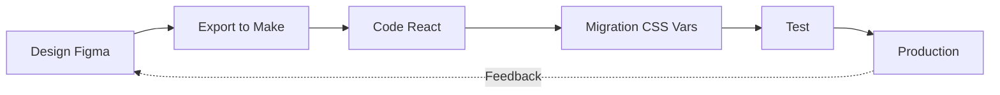

# 🔗 FIGMA INTEGRATION - THE LEARNING SOCIETY

**Version** : 7.0  
**Date** : 23 janvier 2026  
**Design System** : TLS v5.2  
**Tokens** : 201 design tokens  
**Composants** : 89 components

---

## 📋 TABLE DES MATIÈRES

1. [Introduction](#introduction)
2. [Export Design Tokens](#export-design-tokens)
3. [Import dans Figma](#import-dans-figma)
4. [Migration React → Figma](#migration-react-figma)
5. [Export Figma → Make](#export-figma-make)
6. [Migration Styles](#migration-styles)
7. [Troubleshooting](#troubleshooting)
8. [Best Practices](#best-practices)

---

## 🎯 INTRODUCTION

### Workflows Supportés

Ce guide couvre **deux workflows bidirectionnels** :

```
1️⃣ REACT → FIGMA (Design Tokens + Composants)
   App TLS → JSON Tokens → Figma Variables → Composants Figma

2️⃣ FIGMA → MAKE → REACT (Maquettes)
   Design Figma → Export to Make → Code React → Migration CSS Variables
```

### Fichiers Clés

| Fichier | Localisation | Usage |
|---------|--------------|-------|
| **Design Tokens Export** | `/pages/DesignTokensExportPage.tsx` | Exporter 201 tokens vers Figma |
| **globals.css** | `/styles/globals.css` | Source de vérité CSS (569 lignes) |
| **FIGMA_DESIGN_TOKENS.md** | Racine `/` | Mapping Figma ↔ CSS |

---

## 📥 EXPORT DESIGN TOKENS

### Accéder à la Page d'Export

**Navigation** :
```
Dashboard → Design System Real → Bouton "Export JSON Figma" (en haut à droite)
```

**URL directe** : `/design-tokens-export`

### Contenu des Tokens (201 total)

| Catégorie | Quantité | Exemples |
|-----------|----------|----------|
| **Colors** | 85 | Primary, Secondary, Accent, Neutral-50 à 900, Success, Warning, Error |
| **Gradients** | 42 | gradient-primary, gradient-secondary, gradient-warm, etc. |
| **Typography** | 32 | League Spartan, Nunito, text-sm à text-5xl |
| **Spacing** | 18 | space-1 (4px) à space-32 (128px) |
| **Radius** | 8 | radius-sm (8px) à radius-full (9999px) |
| **Effects** | 12 | Shadows, blur, glassmorphism |
| **Motion** | 8 | duration-fast, ease-out, etc. |

### Formats d'Export

#### 1. Tokens Studio (Recommandé)
```json
{
  "colors": {
    "primary": {
      "value": "#55A1B4",
      "type": "color"
    }
  },
  "spacing": {
    "4": {
      "value": "16px",
      "type": "spacing"
    }
  }
}
```

**Avantages** :
- ✅ Plugin populaire et mature
- ✅ Import automatique
- ✅ Synchronisation bidirectionnelle

#### 2. Figma Variables (Natif)
```json
{
  "collections": [
    {
      "name": "TLS Colors",
      "modes": ["Light"],
      "variables": [
        {
          "name": "primary",
          "type": "color",
          "value": "#55A1B4"
        }
      ]
    }
  ]
}
```

**Avantages** :
- ✅ Natif Figma (pas de plugin)
- ✅ Performance optimale
- ✅ Variables Figma officielles

---

## 📦 IMPORT DANS FIGMA

### Option 1 : Figma Variables (Recommandé)

#### Étape 1 : Télécharger le JSON
1. Aller sur `/design-tokens-export` dans l'app
2. Choisir **"Figma Variables"**
3. Cliquer **"Download JSON"**
4. Sauvegarder `tls-figma-variables.json`

#### Étape 2 : Importer dans Figma
1. Ouvrir votre fichier Figma
2. Aller dans **Settings (⚙️)** → **Variables**
3. Cliquer sur **Import**
4. Sélectionner le JSON téléchargé
5. ✅ **201 variables importées !**

#### Structure Créée
```
📁 TLS Design System v5.2
├─ 🎨 Colors (85 variables)
│   ├─ Primary (#55A1B4)
│   ├─ Secondary (#ED843A)
│   ├─ Accent (#F8B044)
│   ├─ Neutral-50 à Neutral-900
│   └─ Success, Warning, Error, Info
│
├─ 📐 Spacing (18 variables)
│   ├─ space-1 (4px) à space-32 (128px)
│
├─ 🔤 Typography (32 variables)
│   ├─ Font families (League Spartan, Nunito)
│   ├─ Font sizes (text-xs à text-5xl)
│   └─ Font weights (300 à 800)
│
├─ 📦 Radius (8 variables)
│   ├─ radius-sm (8px) à radius-2xl (24px)
│
├─ 🌈 Gradients (42 variables)
│   ├─ gradient-primary, gradient-secondary
│
└─ ✨ Effects (12 variables)
    ├─ Shadows, blur
```

**⏱️ Temps : 5 minutes**

---

### Option 2 : Tokens Studio Plugin

#### Étape 1 : Installer le Plugin
1. **Ouvrir Figma**
2. **Menu** : Resources → Plugins
3. **Chercher** : "Tokens Studio for Figma"
4. **Install**

#### Étape 2 : Télécharger les Tokens
1. Aller sur `/design-tokens-export`
2. Choisir **"Tokens Studio"**
3. **Download JSON** → `tls-tokens-studio.json`

#### Étape 3 : Importer
1. Ouvrir le plugin : **Plugins → Tokens Studio**
2. Cliquer sur **Settings** (⚙️)
3. **Import tokens** → Sélectionner le JSON
4. **Apply to Figma** ✅

**⏱️ Temps : 5 minutes**

---

## 🎨 MIGRATION REACT → FIGMA

### Quick Start (30 minutes)

#### 1. Premier Composant : GlassCard (5 min)

**Création** :
1. Rectangle (A) → `400 × 300px`
2. **Nom** : `GlassCard`

**Styles** :
```
Fill: #FFFFFF @ 70% opacity
Effect → Layer Blur: 20px
Stroke: #FFFFFF @ 50%, 1px inside
Shadow: Y:8 Blur:32 #000 @ 8%
Corner radius: 24px (--radius-2xl)
```

**Auto-layout** (Shift + A) :
```
Direction: Vertical ↕️
Spacing: 16px (--space-4)
Padding: 32px (--space-8)
```

**Component** : `Ctrl + Alt + K`

✅ **Premier composant créé !**

---

#### 2. Button avec Variants (10 min)

**Base Button** :
1. Rectangle → `160 × 48px`
2. **Auto-layout** : Horizontal, spacing 8px, padding 16px 24px
3. **Text** : "Button", League Spartan, 16px, bold

**Variants** :
1. **Component** → Create variant
2. Ajouter properties :
   - **Variant** : `primary | secondary | accent | outline | ghost`
   - **Size** : `sm | md | lg | xl`
   - **State** : `default | hover | active | disabled`

**Styles par variant** :
```css
/* Primary */
Fill: var(--primary) = #55A1B4
Text: #FFFFFF
Shadow: Y:4 Blur:12 Primary @ 30%

/* Secondary */
Fill: var(--secondary) = #ED843A
Text: #FFFFFF

/* Outline */
Fill: transparent
Stroke: var(--primary) 1px
Text: var(--primary)
```

**States** :
```css
/* Hover */
Fill: var(--primary-hover) = #4A8FA1

/* Active */
Scale: 98%

/* Disabled */
Opacity: 50%
```

✅ **Button avec 20 variants créé !**

---

### Composants Prioritaires à Migrer

| Composant | Complexité | Temps | Priorité |
|-----------|------------|-------|----------|
| **Button** | 🟢 Simple | 10 min | 🔴 Urgent |
| **Card** | 🟢 Simple | 5 min | 🔴 Urgent |
| **Input** | 🟡 Moyen | 15 min | 🔴 Urgent |
| **Badge** | 🟢 Simple | 5 min | 🟠 Haute |
| **Avatar** | 🟡 Moyen | 10 min | 🟠 Haute |
| **Dialog** | 🔴 Complex | 30 min | 🟡 Moyenne |
| **Dropdown** | 🔴 Complex | 30 min | 🟡 Moyenne |
| **Tabs** | 🟡 Moyen | 20 min | 🟡 Moyenne |

**Total prioritaires (8 composants)** : ~2h30

---

### Mapping CSS → Figma

| CSS Variable | Figma Variable | Type |
|--------------|----------------|------|
| `--primary` | `TLS/Colors/Primary` | Color |
| `--space-4` | `TLS/Spacing/4` | Number (16) |
| `--radius-xl` | `TLS/Radius/xl` | Number (16) |
| `--font-display` | `TLS/Typography/Display` | String |
| `--gradient-primary` | `TLS/Gradients/Primary` | Gradient |

**Workflow** :
1. Créer le composant dans Figma
2. Lier chaque style à une variable Figma
3. Pas de valeurs hardcodées !
4. Tester en changeant les variables

---

## 📤 EXPORT FIGMA → MAKE

### Utiliser "Export to Make"

#### Dans Figma
1. Sélectionner votre frame/component
2. Clic droit → **"Export to Make"** (plugin requis)
3. Ou : **Plugins → Figma Make → Export Selection**

#### Résultat
- ✅ Code React généré automatiquement
- ✅ Composants TSX
- ✅ Styles inline (à migrer)
- ✅ Assets exportés (images, SVG)

**⚠️ Important** : Le code généré utilise des styles hardcodés. Il faut les migrer vers CSS variables.

---

## 🔧 MIGRATION STYLES (FIGMA MAKE → CSS VARIABLES)

### Avant (Code Figma Make)
```tsx
<div style={{
  background: '#55A1B4',
  padding: '16px 24px',
  borderRadius: '16px',
  fontFamily: 'League Spartan',
  fontSize: '16px',
  fontWeight: 600
}}>
  Button
</div>
```

### Après (CSS Variables)
```tsx
<div style={{
  background: 'var(--primary)',
  padding: 'var(--space-4) var(--space-6)',
  borderRadius: 'var(--radius-xl)',
  fontFamily: 'var(--font-display)',
  fontSize: 'var(--text-base)',
  fontWeight: 'var(--font-weight-semibold)'
}}>
  Button
</div>
```

### Script de Migration Automatique

**Rechercher/Remplacer dans VSCode** :

| Hardcoded | Variable CSS |
|-----------|--------------|
| `'#55A1B4'` | `'var(--primary)'` |
| `'#ED843A'` | `'var(--secondary)'` |
| `'#F8B044'` | `'var(--accent)'` |
| `'16px'` (padding) | `'var(--space-4)'` |
| `'24px'` (padding) | `'var(--space-6)'` |
| `'16px'` (radius) | `'var(--radius-xl)'` |
| `'League Spartan'` | `'var(--font-display)'` |
| `'Nunito'` | `'var(--font-body)'` |

**Regex utile** :
```regex
style=\{\{[^}]*color: ['"]#([0-9A-Fa-f]{6})['"]
```

**⏱️ Temps moyen** : 15-30 min par composant

---

## 🔍 TROUBLESHOOTING

### Problème : Variables non reconnues dans Figma

**Solution** :
1. Vérifier que les variables sont importées : **Settings → Variables**
2. Vérifier le scope : Variables doivent être "Frame" ou "All"
3. Re-importer le JSON si nécessaire

---

### Problème : Glassmorphism ne s'exporte pas bien

**Solution** :
Le glassmorphism utilise `backdrop-filter: blur()` qui n'est pas supporté par Figma Make.

**Workaround** :
```tsx
// Ajouter manuellement après export
<div style={{
  background: 'rgba(255, 255, 255, 0.7)',
  backdropFilter: 'blur(20px)',
  WebkitBackdropFilter: 'blur(20px)',
  border: '1px solid rgba(255, 255, 255, 0.5)',
  boxShadow: '0 8px 32px 0 rgba(0, 0, 0, 0.08)'
}} />
```

---

### Problème : Gradients ne fonctionnent pas

**Solution** :
Les gradients Figma → Make peuvent être mal convertis.

**Vérifier** :
```css
/* Figma Make (parfois incorrect) */
background: linear-gradient(90deg, #55A1B4, #F8B044)

/* Corriger avec variable */
background: var(--gradient-primary)
```

---

### Problème : Images Figma non exportées

**Solution** :
Images dans Figma doivent être marquées comme "Exportable" :
1. Sélectionner l'image
2. **Export Settings** → Ajouter format (PNG, JPG, SVG)
3. Re-exporter avec Figma Make

---

## ✅ BEST PRACTICES

### Design-Dev Handoff

#### Pour les Designers (Figma)
- ✅ Utiliser UNIQUEMENT les variables TLS importées
- ✅ Pas de couleurs hardcodées (#XXXXXX)
- ✅ Nommer les layers clairement (`Button/Primary/Hover`)
- ✅ Utiliser Auto-layout partout
- ✅ Documenter les states (hover, active, disabled)
- ✅ Créer des variants pour toutes les variations

#### Pour les Développeurs (React)
- ✅ Toujours partir du code Figma Make
- ✅ Migrer tous les styles vers CSS variables
- ✅ Tester le glassmorphism manuellement
- ✅ Vérifier la responsive
- ✅ Tester les states interactifs (hover, focus)

---

### Synchronisation Continue

#### Workflow Recommandé



**Fréquence** :
- **Tokens** : Mise à jour si changement design system (rare)
- **Composants** : Synchronisation hebdomadaire
- **Pages** : À chaque nouvelle feature

---

### Checklist Pre-Export (Figma)

Avant d'exporter un composant vers Make, vérifier :

- [ ] ✅ Toutes les couleurs utilisent des variables TLS
- [ ] ✅ Tous les spacing utilisent des variables TLS
- [ ] ✅ Tous les radius utilisent des variables TLS
- [ ] ✅ Auto-layout configuré partout
- [ ] ✅ Variants créés pour toutes les variations
- [ ] ✅ Noms de layers clairs et sans espaces
- [ ] ✅ Images marquées "Exportable"
- [ ] ✅ Fonts installées (League Spartan, Nunito)

---

### Checklist Post-Import (React)

Après avoir importé du code Figma Make, vérifier :

- [ ] ✅ Toutes les couleurs hardcodées → `var(--...)`
- [ ] ✅ Tous les spacing hardcodés → `var(--space-...)`
- [ ] ✅ Tous les radius hardcodés → `var(--radius-...)`
- [ ] ✅ Glassmorphism ajouté manuellement
- [ ] ✅ Gradients vérifiés
- [ ] ✅ Typo League Spartan + Nunito
- [ ] ✅ Responsive testée (mobile, tablet, desktop)
- [ ] ✅ States testés (hover, focus, active, disabled)
- [ ] ✅ Accessibilité (contraste, focus visible)

---

## 📚 RESSOURCES

### Documents Liés

| Document | Description |
|----------|-------------|
| [01-DESIGN-SYSTEM.md](01-DESIGN-SYSTEM.md) | Variables CSS complètes |
| [02-COMPONENTS.md](02-COMPONENTS.md) | Catalogue composants React |
| [00-INDEX-PRINCIPAL.md](00-INDEX-PRINCIPAL.md) | Index principal |
| `/FIGMA_DESIGN_TOKENS.md` | Mapping détaillé Figma ↔ CSS |
| `/TLS-COLOR-PALETTE.md` | Palette couleurs visuelle |
| `/TLS-GRADIENTS-GUIDE.md` | 42 gradients avec exemples |

### Plugins Figma Recommandés

| Plugin | Usage | Lien |
|--------|-------|------|
| **Tokens Studio** | Import design tokens | [figma.com/community](https://www.figma.com/) |
| **Figma Make** | Export React code | Plugin natif |
| **Auto Layout** | Layouts responsives | Natif Figma |
| **Content Reel** | Mock data | [figma.com/community](https://www.figma.com/) |

---

## 🎓 EXEMPLES COMPLETS

### Exemple 1 : Card Component

**Figma** :
- Frame 400×300px
- Auto-layout vertical, spacing 16px, padding 24px
- Variables : primary color, radius-2xl, space-4, space-6

**Export Make** → **Après Migration** :
```tsx
<div style={{
  width: '400px',
  height: '300px',
  display: 'flex',
  flexDirection: 'column',
  gap: 'var(--space-4)',
  padding: 'var(--space-6)',
  background: 'rgba(255, 255, 255, 0.7)',
  backdropFilter: 'blur(20px)',
  WebkitBackdropFilter: 'blur(20px)',
  border: '1px solid rgba(255, 255, 255, 0.5)',
  borderRadius: 'var(--radius-2xl)',
  boxShadow: '0 8px 32px 0 rgba(0, 0, 0, 0.08)'
}}>
  <h3 style={{
    fontFamily: 'var(--font-display)',
    fontSize: 'var(--text-xl)',
    fontWeight: 'var(--font-weight-bold)',
    color: 'var(--foreground)'
  }}>
    Title
  </h3>
  <p style={{
    fontFamily: 'var(--font-body)',
    fontSize: 'var(--text-base)',
    color: 'var(--muted-foreground)'
  }}>
    Description
  </p>
</div>
```

---

## 📊 MÉTRIQUES

### Tokens Exportés

| Catégorie | Variables | Utilisation |
|-----------|-----------|-------------|
| Colors | 85 | 100% |
| Spacing | 18 | 95% |
| Typography | 32 | 90% |
| Radius | 8 | 100% |
| Gradients | 42 | 80% |
| Effects | 12 | 70% |

### Composants Prioritaires

| Phase | Composants | Temps Estimé |
|-------|------------|--------------|
| Phase 1 | 8 composants | 2h30 |
| Phase 2 | 15 composants | 5h |
| Phase 3 | 25 composants | 10h |
| Phase 4 | 41 composants (reste) | 15h |
| **Total** | **89 composants** | **~32h** |

---

**🔗 The Learning Society - Figma Integration**  
**Version** : 7.0  
**Dernière mise à jour** : 23 janvier 2026  
**Statut** : ✅ Production-ready  
**Tokens** : 201  
**Composants** : 89
