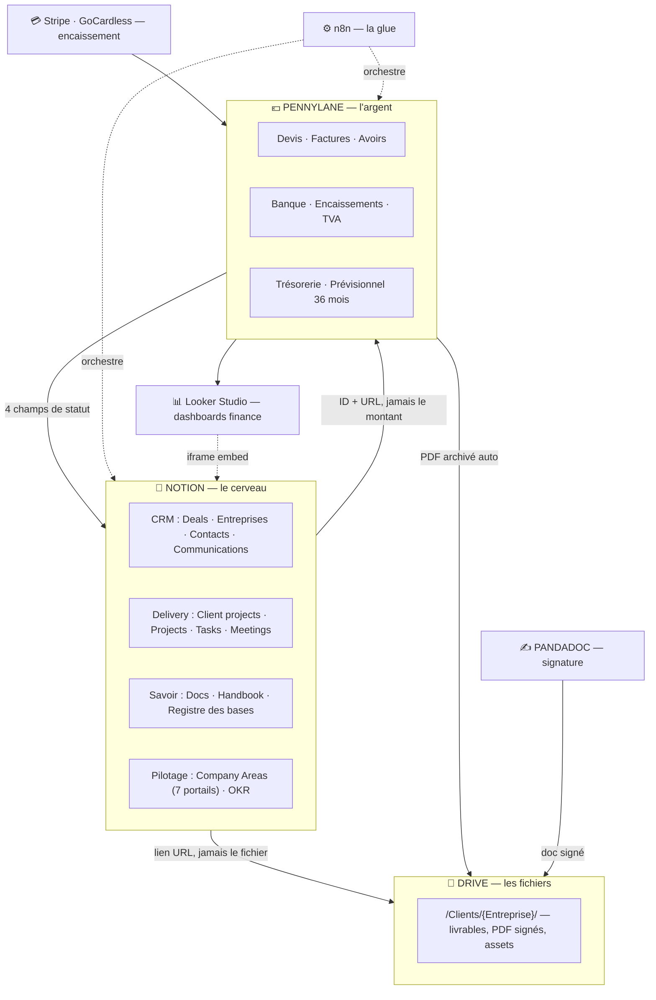
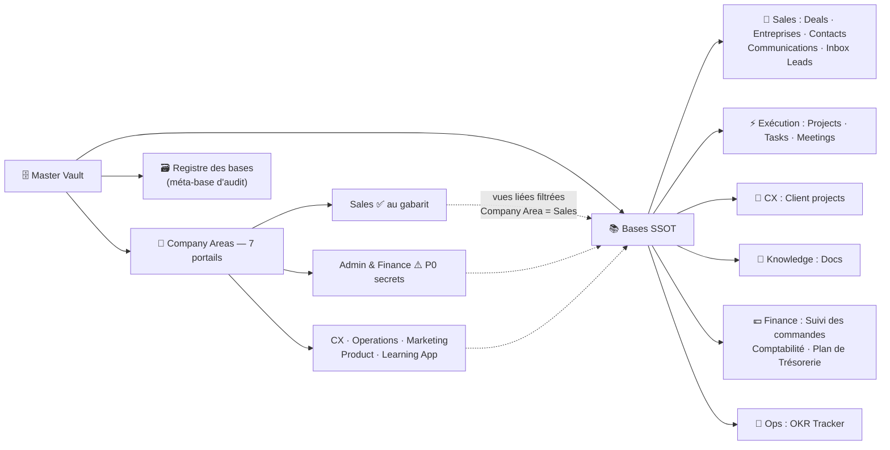
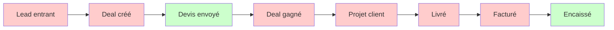
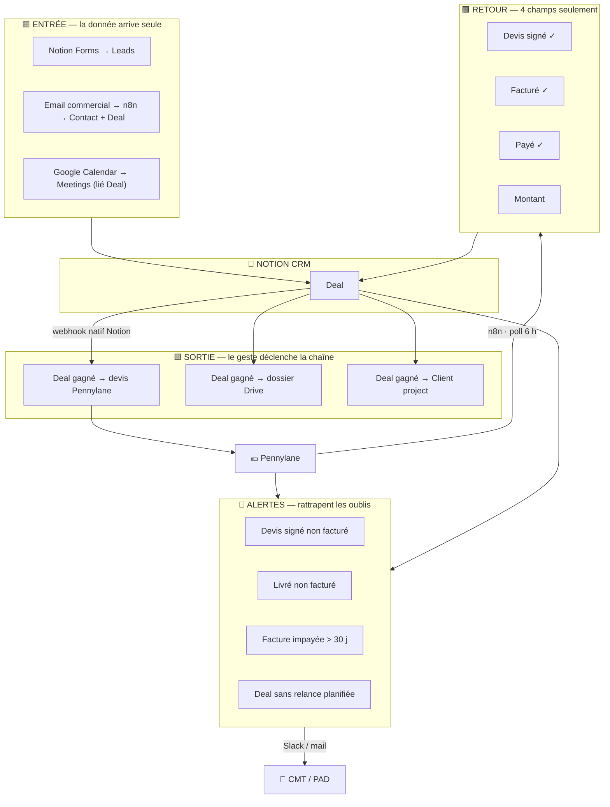

# Carte du système TLS — outils, bases, process

> **Objet :** voir en un écran **où vit quoi**, **ce qui circule tout seul** et **ce qui dépend encore d'une main humaine**.
> **Date :** 25 juillet 2026 · **Statut :** v1 · **Usage :** interne.
> Les schémas sont en **Mermaid** : lisibles ici, et collables tels quels dans Notion (bloc `/code` → langage *Mermaid*).
> **Docs liés :** [`REORG-OPS-DONNEES-STACK-H2-2026.md`](REORG-OPS-DONNEES-STACK-H2-2026.md) · [`GABARIT-PORTAILS-AREA-NOTION.md`](GABARIT-PORTAILS-AREA-NOTION.md)

**Légende commune :** 🟩 automatique · 🟥 manuel (dépend de la discipline) · 🟦 outil/source de vérité

---

## 1. Vue d'ensemble — qui possède quoi

Un artefact, un seul domicile. Le reste **pointe**, ne recopie jamais.

**La frontière à ne jamais franchir :**

| | Notion | Pennylane |
|---|---|---|
| Pilote | **l'ENGAGEMENT** (devis en cours, commande, livraison) | **l'ARGENT** (facturé, encaissé, tréso) |
| Les € y sont | **déclaratifs** — libellé obligatoire | **réels** |
| Fait foi pour | le pipeline commercial | la compta, le CA, le cash |

> ⚠️ **Point à trancher (§5)** : il existe aussi des bases Notion **Devis** et **Factures Clients** (reliées aux Deals). Elles doublonnent Pennylane.

---

## 2. Arborescence Notion

> ✅ **Règle confirmée :** une page Area ne contient **que des vues liées** des bases SSOT, filtrées sur `Company Area`. Elle n'héberge jamais sa propre base.
> ⚠️ L'API Notion affiche ces vues liées comme des « bases enfants » avec un ID propre — **ce n'est pas un doublon**.

---

## 3. Le flux commercial bout-en-bout — où ça casse aujourd'hui

**État réel, étape par étape :**

| Étape | Aujourd'hui | Symptôme mesuré | Cible |
|---|---|---|---|
| Lead entrant | 🟥 saisie manuelle | leads perdus | 🟩 Notion Forms + email→n8n |
| Deal créé | 🟥 manuel | **56 % Lead Source vide** | 🟩 source héritée du canal |
| Devis | 🟩 Pennylane | — | 🟩 + lien auto sur le Deal |
| **Deal gagné** | 🟥 bouton sans effet | `pennylane_id` et `drive:` **vides** · **Client projects ↔ Deals 0/23** | 🟩 → devis + dossier Drive + projet |
| Livraison | 🟥 statut à la main | **17/23 projets sans date de fin** | 🟩 dérivé des Tasks |
| **Facturé** | 🟥 dépend de la mémoire | **~35 K€ facturé sur ~117 K€ commandé** | 🟩 alerte « livré non facturé » |
| Encaissé | 🟩 Pennylane (banque) | ~53 K€ | 🟩 + relance auto (Essentiel) |

> 🔴 **Le point de rupture n°1 est « Deal gagné »** : rien ne se déclenche. Tout ce qui suit repart d'une saisie, donc se perd. **Une seule automatisation répare 4 symptômes.**

---

## 4. Cible — les flux qui alimentent Notion tout seul

**Le seul geste manuel qui reste : faire avancer un Deal d'une étape (1 clic).** Et même celui-là se déduit en partie (devis signé côté Pennylane → étape « Signé »).

**Pourquoi 4 champs et pas tout :** l'ancien sync Pennylane→Notion échouait parce qu'il mirrorait l'intégralité de la compta. Léger = fiable. Les agrégats (CA, encaissé, prévisionnel) ne transitent **jamais** — ils se lisent dans Looker/Pennylane.

---

## 5. Les zones grises à trancher

| # | Question | Enjeu | Reco |
|---|---|---|---|
| 1 | **Bases Notion « Devis » et « Factures Clients »** (reliées aux Deals) vs Pennylane | deux vérités sur l'argent | **Les vider de leur rôle** : garder au plus un miroir en lecture (n° + statut + lien), jamais un montant saisi |
| 2 | **« Suivi des commandes »** (carnet) vs Pennylane | doublon partiel | Le carnet devient le **book commercial** (engagement) ; l'argent réel = Pennylane |
| 3 | **Qui facture** : TLS en direct vs **C-Campus** (référencé achats grands comptes) | fausse toute lecture « non facturé » | Ajouter une propriété **« Facturé par »** sur le Deal |
| 4 | Bases orphelines `Untitled` (Operations) · `Mon travail` (Product) | bruit | Supprimer après vérification |
| 5 | **PandaDoc** | redondant si usage = devis/e-sign | Pennylane Essentiel signe les devis → retirer |

---

## 6. Ce que la carte dit en une phrase

> **Les outils sont bons, les bases sont saines, la stratégie tient. Ce qui manque, ce sont les 6 câbles entre les boîtes** — et le premier (« Deal gagné → devis + dossier + projet ») répare à lui seul la moitié des symptômes.

---

*Fin — v1, 25 juillet 2026. Schémas Mermaid réutilisables dans Notion.*
