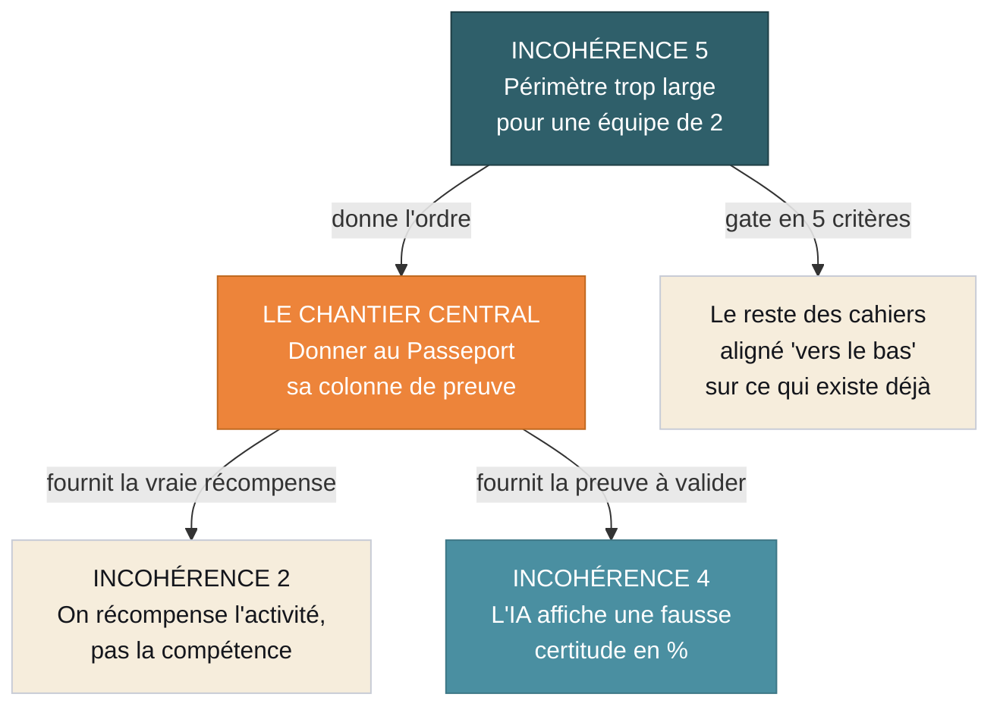
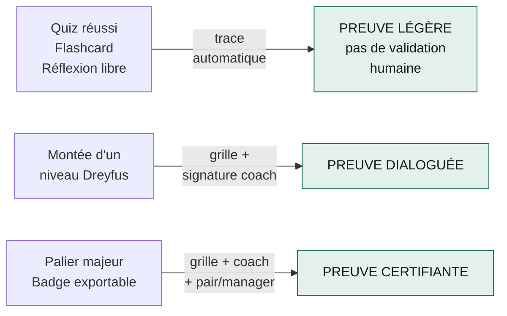
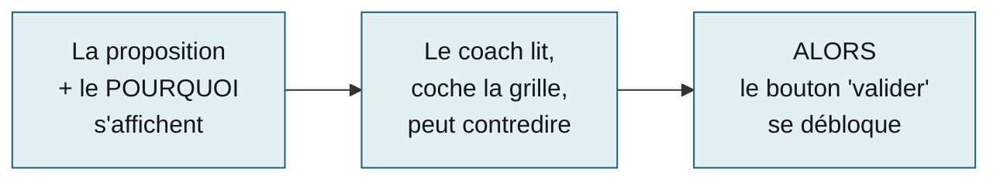
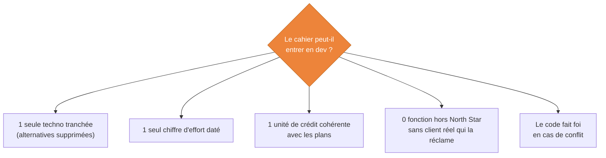

# Learning App — cinq chantiers de cohérence avant de coder

**Note de travail · Chloé → Pierre-Armand · 2026-07-23**

> 📎 **Études détaillées derrière ce rapport** : [`SOLUTIONS-00-SYNTHESE`](SOLUTIONS-00-SYNTHESE.md) (index) → un dossier par incohérence (`SOLUTIONS-01`→`05`). Ce document-ci est la **synthèse exécutive pour décision** ; les SOLUTIONS sont les **études de solutions** (options évaluées sous 6 lentilles). Les deux se complètent, ne se dupliquent pas.

> **Pourquoi ce document.** J'ai relu nos 16 cahiers en entier, croisés avec le code réel de
> l'app et l'état de l'art (sciences de l'apprentissage, design, droit). Ce rapport n'est **pas**
> une liste de reproches : nos specs sont sérieuses et souvent en avance sur ce que fait le marché.
> Ce sont des **incohérences** — des endroits où deux parties de nos cahiers se contredisent, où
> une pièce manque au milieu d'une chaîne, ou où une bonne intention produit l'effet inverse. On
> les corrige *avant* de coder, parce que corriger un cahier coûte une réunion, corriger du code
> coûte un mois.
>
> Le mot que je remplace partout : « défaut » → **« incohérence »** ou **« tension »**. C'est plus
> juste, et c'est ce que c'est vraiment.

---

## 1. La vue d'ensemble en une image

On a listé cinq incohérences. En les regardant ensemble, on découvre qu'elles **ne sont pas cinq
chantiers séparés** : trois n'en font qu'un, deux sont des règles à appliquer partout, et une
gouverne l'ordre de tout le reste.

**Ce que ça veut dire pour nous, concrètement :** on n'a pas cinq gros travaux devant nous. On a
**un** travail de fond (la preuve), **deux** règles de bon sens à tenir partout, et **une** discipline
de périmètre. C'est jouable à deux.

---

## 2. Le fil rouge — une phrase qui résume tout

En regardant les cinq incohérences, la même ligne de faille revient :

> **Partout, le problème est une automatisation qui trompe.
> Partout, la solution est de refaire de la place à l'humain.**

| Là où ça cloche | La correction |
|---|---|
| Un niveau de compétence affiché sans preuve derrière | L'apprenant devient **co-auteur** de sa preuve |
| Des points qui font croire qu'on a progressé | La **compétence attestée** devient la vraie récompense |
| Le coach qui « valide » d'un clic | Le coach qui **analyse** avec une grille |
| L'IA qui annonce « 92 % de certitude » (un chiffre inventé) | L'IA qui dit honnêtement **« je ne sais pas, vois ton coach »** |
| Des specs qui promettent une usine | L'équipe de 2 qui construit **l'essentiel d'abord** |

Ce n'est pas un hasard de conception : **c'est notre positionnement SBO pris au mot.** Une
organisation par les compétences repose sur des compétences *démontrées et attestées par des
humains*, pas sur des scores calculés par une machine. Corriger ces cinq points, ce n'est pas
réparer des bugs — c'est faire coïncider le produit avec ce qu'on vend. Et c'est *exactement* le
principe pédagogique pour les adultes : **l'apprenant reste l'auteur de son apprentissage.**

---

## 3. Les cinq incohérences, une par une

Pour chacune : ce que vit l'apprenant aujourd'hui · pourquoi c'est un problème (ce que dit la
science) · les cahiers touchés · les alternatives · ma reco · comment ça se traduit à l'écran.

---

### Incohérence 1 — Le Passeport affiche un niveau sans preuve derrière

> **Nature : chaînon manquant (le plus important).** C'est la colonne vertébrale du produit.

**Ce que vit l'apprenant.** Son Passeport affiche « Niveau 3 en ingénierie pédagogique ». Mais
rien, nulle part, ne dit *pourquoi* il est niveau 3, sur quoi ça repose, ni qui l'a validé. Le
niveau est un simple nombre. S'il le montre à son manager ou l'exporte sur LinkedIn, il ne peut
rien produire à l'appui.

**Pourquoi c'est un problème.** Un « niveau » sans preuve, ce n'est pas un passeport de
compétences — c'est un compteur. Or c'est *précisément* la preuve qui nous distingue d'un LMS
classique. Trois conséquences en chaîne : notre argument de vente s'effondre (rien à montrer au
DRH) ; le RGPD nous rattrape (un niveau qui « affecte » une personne doit être justifiable) ; et
notre projet « Learning Buddy » (l'app en situation de travail) devient impossible, puisqu'il
repose sur l'idée que *chaque échange devient une preuve*.

**La bonne nouvelle — la pièce existe déjà, au mauvais endroit.** Dans le code du module Projets,
il y a déjà exactement le bon modèle : un objet qui enregistre « niveau passé de X à Y, sur telle
preuve, validé par telle personne, à telle date » *(techniquement : `PasseportEnrichment` et
`Jac.rubricScores`, vérifié dans le code)*. Il est juste cantonné aux projets et jamais relié au
Passeport général. **On n'a pas à inventer — on a à généraliser.**

**Cahiers touchés :** 02 (Passeport), 01 (positionnement), 01bis (quiz, missions), 04 (coaching),
07 (journal). Cinq cahiers, un seul objet de données.

**Les alternatives étudiées :**

| Option | En clair | Verdict |
|---|---|---|
| **A — Niveau calculé** | Le système additionne des preuves et calcule le niveau tout seul | ⚠️ Léger, mais retire à l'apprenant la maîtrise de son niveau, et « calculé par une machine » = piège RGPD |
| **B — Portfolio** | L'apprenant assemble son dossier, argumente, un coach valide | ✅ La meilleure pour l'apprentissage et la conformité, mais coûte du temps de coach |
| **C — Grille de critères** | Chaque niveau adossé à une grille explicite signée | ✅ La plus solide et vendable, mais lourde à écrire |

**Ma reco : les trois, mais gradués selon l'enjeu.** Un même registre de preuves, avec une exigence
qui monte avec l'importance du palier :

On ne met pas une grille lourde sur une flashcard, ni un simple tampon sur un badge certifiant.
**L'effort de preuve est proportionné à ce que le niveau engage.**

**Un principe non négociable, dans les trois cas :** ce que l'apprenant s'auto-attribue (le
questionnaire de départ) **n'écrit jamais son niveau réel**. Ça vit dans un champ séparé, « ta
perception ». *(Fondement : le biais de Dunning-Kruger — on est un mauvais juge de sa propre
compétence.)* Mieux : en croisant plus tard « ce que tu pensais » avec « ce que tes preuves
montrent », on obtient un formidable outil de prise de conscience (« tu te sous-estimais »).

**Sur l'app — l'expérience visée.** Sous chaque compétence, un **dossier vivant** : la frise de ses
preuves, cliquables (« ce niveau, c'est *cette* mission + *cette* réflexion validée »). Le niveau
n'est plus un chiffre tombé du ciel, c'est une histoire qu'on peut dérouler. Pour l'adulte,
*constituer ce dossier est en soi un acte d'apprentissage* (il sélectionne, relie, justifie —
c'est de la métacognition). Design : sobre, éditorial, chaque preuve = une carte datée, pas un
badge criard.

---

### Incohérence 2 — On récompense l'activité, pas la compétence

> **Nature : tension de conception. Une bonne intention (motiver) qui produit l'effet inverse.**

**Ce que vit l'apprenant.** Il écrit une réflexion dans son journal → **+20 points** *(vérifié dans
le code)*. Il se connecte plusieurs jours de suite → une « série » (streak) qu'il a peur de casser.
Son badge de compétence peut être **rétrogradé** automatiquement s'il ne pratique pas pendant 90
jours. Et pour *réclamer* un badge qu'il a mérité, il doit **payer un crédit**.

**Pourquoi c'est un problème — et c'est contre-intuitif.** Récompenser par des points une activité
qu'on aime déjà **détruit** l'envie de la faire. C'est un des résultats les mieux établis de la
psychologie de la motivation *(théorie de l'autodétermination, Deci & Ryan ; effet de
sur-justification, Lepper)* : une récompense tangible et attendue transforme « je réfléchis parce
que ça m'aide » en « je réfléchis pour les points » — et le jour où les points ne suffisent plus,
on arrête. **On gamifie exactement les deux activités qu'il ne faut pas** : la réflexion et
l'apprentissage, les plus intrinsèquement motivées.

Et trois mécaniques se retournent contre nous :
- **La rétrogradation de badge** est un contresens. Un badge atteste un *fait daté* (« a démontré
  le niveau 4 le 15 mars ») — ça reste vrai le 15 juin. Dire à un manager que son badge a *baissé*
  parce qu'il a livré du vrai travail pendant trois mois, c'est vexant et faux. Et ça contredit
  notre propre promesse d'« Open Badge permanent partageable sur LinkedIn ».
- **Le claim payant** brouille tout : on *gagne* le badge par la preuve, puis on *paye* pour
  l'avoir. Gagné ou acheté ?
- **Les tableaux de bord entreprise mesurent la présence** (taux de connexion, d'activité), pas
  l'apprentissage. Optimiser la présence pousse les managers à harceler — ce qui fait fuir.

**Cahiers touchés :** 05 (Gamification), 07 (Journal), 06 (Entreprise).

**Ma reco : l'attestation *est* la récompense.** La vraie récompense de l'apprenant, c'est de voir
sa compétence *attestée* dans son Passeport (ce que débloque l'incohérence 1). C'est une
récompense « informationnelle » — elle dit « tu as progressé, voici la preuve » — et *ce type-là*
ne corrompt pas la motivation, au contraire.

Concrètement, deux temps :

1. **Tout de suite (rien à construire, juste à retirer) :** on enlève les +20 points sur la
   réflexion, on **ne code pas** la rétrogradation de badge ni le claim payant (ils n'existent
   qu'en spec — donc c'est « ne pas faire », pas « défaire »). Bonne nouvelle : dans le code,
   les points sont *déjà* séparés du niveau de compétence — le pare-feu est à moitié posé.
2. **Ensuite :** on garde une petite couche de jeu, mais **subordonnée et bienveillante**. Une
   « série » qui pardonne (un jour manqué se répare, façon Duolingo), réservée aux débutants qui
   ont besoin de prendre l'habitude. Et côté entreprise, on ajoute un indicateur qui compte
   vraiment : **la compétence démontrée**, pas le temps passé.

**Le remplacement de l'atrophie punitive.** Une compétence non pratiquée *peut* rouiller (c'est
vrai neurologiquement). Mais au lieu de *punir* (« ton badge baisse »), on *invite* : un discret
signal de **fraîcheur** — « dernière pratique il y a 92 jours, envie d'un rafraîchissement ? ». Le
credential reste intact, l'invitation est douce et réversible. *(Le champ « jours depuis la
dernière activité » existe déjà dans le code — il suffit de le présenter comme une invitation, pas
une sanction.)*

**Sur l'app.** Le moment fort, ce n'est plus une pluie de points ni un pop-up de célébration —
c'est le passage d'une preuve dans le dossier, sobre et net. Pas de casino. Le registre visuel
premium (éditorial, pas ludique-enfantin) sert directement ce message : on atteste, on ne joue pas.

---

### Incohérence 3 — La validation du coach n'est pas conçue (et le droit nous rattrape)

> **Nature : chaînon manquant + risque juridique immédiat.** C'est la même pièce que l'incohérence 1, vue côté coach.

**Ce que vit le coach.** Il corrige le travail d'un apprenant, estime qu'il a atteint un niveau
supérieur, le pose sur un curseur à l'écran… et **au moment de valider, cette estimation est
jetée** *(vérifié dans le code : le curseur de niveau existe, mais rien ne l'enregistre)*. La
montée de niveau se fait « quelque part », sans trace de qui l'a décidée ni pourquoi. Le cahier
lui-même laisse la question ouverte, écrite noir sur blanc « à décider ».

**Pourquoi c'est un problème — deux fois.**
- **Pédagogiquement** : un « niveau supérieur » sans le *pourquoi* prive l'apprenant du feedback
  qui l'aiderait à progresser. Or un feedback *élaboré* (qui explique) fait bien plus progresser
  qu'un simple « validé ».
- **Juridiquement (et ça, c'est pour maintenant, pas 2027)** : le RGPD interdit qu'une décision qui
  affecte une personne soit prise par une machine seule. La parade, c'est l'**intervention humaine
  significative**. Mais « significative » a un sens précis : un coach qui valide d'un clic, sans
  analyse, **ne compte pas**. Notre validation-tampon actuelle nous *donne l'apparence* de la
  conformité sans la substance — c'est pire que rien.

**Cahiers touchés :** 04 (Coaching), 02 (Passeport), 13bis (RGPD/AI Act).

> **Fact-check express** — le calendrier réglementaire *(sources : texte de l'AI Act, cabinets Gibson
> Dunn & Freshfields ; CNIL pour le RGPD)* :
> - **RGPD article 22** (décision automatisée) : **s'applique aujourd'hui.**
> - **AI Act haut risque** (dont les plateformes de compétences peuvent relever) : **reporté au 2
>   décembre 2027** par le « Digital Omnibus » signé le 8 juillet 2026. *(J'avais initialement écrit
>   « échéance dans 10 jours » — c'était faux, corrigé.)*
> - Nuance importante : nous serions **fournisseur** (on construit et on vend), donc côté exigeant —
>   mais il existe un **allègement PME** à surveiller. Et la qualification dépend de *l'usage* :
>   un passeport d'auto-développement n'est pas un outil de promotion. **À faire trancher par un
>   juriste** — je ne le suis pas.

**Ma reco : une grille de validation obligatoire pour toute montée de niveau.** Le coach ne pose
pas juste un curseur : il coche une **grille de critères** (« sait faire X sans aide, sait adapter
Y… ») et justifie. Cette grille scorée + sa signature *deviennent* la preuve — le même objet que
l'incohérence 1. **Un seul chantier data règle les deux.** La question laissée « à décider » dans
le cahier se résout ainsi : pas de mise à jour automatique du Passeport — *c'est la validation
signée qui est la mise à jour.*

**Une règle d'or, valable partout où un humain valide une proposition de la machine :**

Le **rationale s'affiche AVANT le bouton**, jamais après. *(Fondement : le biais d'automatisation —
on approuve machinalement ce qu'une machine propose, surtout si le bouton est là en premier.)*
Corollaire : on suit le **taux de contradiction** du coach comme un indicateur de *sérieux de la
validation*, jamais de performance — un coach qui valide tout à 100 % n'est pas un bon coach, c'est
un tampon.

**Sur l'app.** L'écran de correction met la grille au centre, le curseur de niveau ne se déverrouille
qu'après. Côté apprenant, recevoir « niveau 3 validé + voici les 4 critères remplis et le mot du
coach » est infiniment plus formateur — et plus motivant — qu'un simple badge qui apparaît.

---

### Incohérence 4 — L'IA affiche une fausse certitude

> **Nature : erreur technique répétée, avec un effet cognitif pervers.**

**Ce que vit l'utilisateur.** Le chatbot répond et affiche « confiance : 92 % ». Une mission
proposée affiche « adéquation : 87 % ». Un tableau manager affiche « risque de départ : 78 % ». Ces
chiffres *ont l'air* de mesures précises. **Ils sont inventés.**

**Pourquoi c'est un problème.** Un modèle de langage (Mistral, comme tout LLM) **ne sait pas
mesurer sa propre fiabilité** — un score qu'il s'attribue est souvent le plus élevé *quand il se
trompe le plus* (il « hallucine » avec aplomb). Pire, sur le plan cognitif : un chiffre précis
inspire une **confiance imméritée** *(biais de fausse précision, Moore & Healy ; biais
d'automatisation, Parasuraman & Riley)*. « 92 % » désarme l'esprit critique de l'apprenant au
moment où il devrait le garder. On *apprend* à l'utilisateur à faire confiance à un nombre creux.

Plus large : on demande à Mistral des choses pour lesquelles ce n'est **pas le bon outil** — calculer
un risque de départ, agréger des données d'équipe, faire une prévision. Ce sont des calculs
(tableurs, statistiques), pas du langage. Les confier à une IA générative, c'est cher, non
reproductible, et ça hallucine.

**Cahiers touchés :** 12 (Chatbot), 12bis (fonctions IA).

**Ma reco — un principe simple :** *l'IA produit du langage, jamais un nombre-mesure ni une
décision.*
- **Aucun « % de confiance » à l'écran.** À la place, le vrai geste honnête : l'**abstention**. Si
  la réponse n'est pas solidement dans notre contenu, le chatbot dit « je ne trouve pas ça de façon
  fiable — ton coach saura », et c'est un *bon* comportement, pas un échec. *(Le code a déjà un
  embryon de ça.)*
- **Les chiffres sortent de l'IA** : le risque de départ = un petit modèle statistique explicable
  + **un humain qui décide** (jamais un mail automatique) ; les agrégats d'équipe = un calcul de
  base de données ; la prévision = une projection. L'IA ne fait que *mettre en phrase* le résultat
  déjà calculé.

**Sur l'app — et c'est un choix pédagogique.** Un bon assistant pour adulte ne *mâche pas la
réponse* : il questionne, fait produire, oriente vers la source *(effet de génération — on retient
ce qu'on produit soi-même, pas ce qu'on reçoit)*. Le chatbot en « mode étayage » (il aide à trouver
plutôt qu'il ne donne) + l'abstention honnête, c'est à la fois plus fiable, plus conforme, et plus
formateur. À l'écran : un registre qualitatif et sobre (« réponse bien ancrée dans nos contenus » /
« à recouper »), jamais un pourcentage.

---

### Incohérence 5 — Des cahiers dimensionnés pour une grande équipe

> **Nature : incohérences de spec + sur-dimensionnement. La discipline qui protège les quatre autres.**

**Le constat, chiffré.** Chaque cahier donne **3 à 4 estimations d'effort contradictoires** dans le
même fichier. Le cahier Notifications décrit **trois technologies incompatibles** pour la même
fonction et **six canaux** (email, in-app, WhatsApp, push ×2, Slack). L'économie de crédits ne
**boucle pas** : une session de coaching coûte « 1, 10 ou 50 crédits » selon la page, alors qu'un
plan en donne 0,5 à 2 par mois. On spécifie un wiki public en 4 langues, un moteur de rôles
sur-mesure, un badge cryptographique fait maison — **pour une équipe de deux.**

**Pourquoi c'est un problème.** Le coût, ce n'est pas de construire tout ça — c'est de le
**maintenir**. Chaque fonctionnalité en trop est une dette qui se paie chaque mois en bugs, en
temps, en attention *(la charge cognitive vaut aussi pour ceux qui maintiennent, pas seulement pour
l'apprenant)*. Un produit trop lourd finit par mal servir l'apprenant — parce qu'on passe le temps
à réparer au lieu d'améliorer.

**Ma reco : construire le squelette, aligner le reste « vers le bas ».** Un constat récurrent et
encourageant de ma relecture : **le code a souvent tranché plus juste que le cahier** (il a déjà
choisi les bonnes options, plus sobres). Donc on ne réécrit pas 16 cahiers à froid (six mois
perdus) — on grave les bons choix dans ce qui existe, cahier par cahier.

Et on se donne une **règle d'entrée en développement** — un cahier ne consomme pas une heure de dev
tant qu'il n'a pas :

**Sur l'app.** Concrètement, on coupe : Notifications = email + in-app seulement (le reste en
attente) ; un seul moyen de paiement ; rôles standards (pas de moteur sur-mesure) ; FR d'abord.
Tout ce qu'on coupe part dans un « plus tard », rouvert *quand un client le demande* — pas avant.

---

## 4. Fact-check — ce qui étaye ce rapport

Par honnêteté intellectuelle, voici le statut de chaque affirmation importante.

| Affirmation | Statut | Source |
|---|---|---|
| Le bon modèle de preuve existe déjà dans le code (module Projets) | ✅ **vérifié** | `src/types/projects.ts` (`PasseportEnrichment`, `rubricScores`) |
| La réflexion de journal donne +20 points | ✅ **vérifié** | `src/data/gamification.ts` ligne 181 |
| La rétrogradation de badge n'est pas encore codée (juste en spec) | ✅ **vérifié** | aucun `downgrade`/`lost_at` dans le code |
| Le curseur de niveau du coach n'est pas enregistré | ✅ **vérifié** | `CoachCorrectionInterface.tsx` |
| RGPD art. 22 applicable aujourd'hui ; AI Act haut risque reporté à déc. 2027 | ✅ **vérifié** | AI Act + Digital Omnibus (08/07/2026), cabinets Gibson Dunn/Freshfields |
| Récompenser une activité intrinsèquement motivée la dévalue | ✅ **établi** | théorie de l'autodétermination (Deci & Ryan) ; sur-justification (Lepper et al.) |
| On est mauvais juge de sa propre compétence | ✅ **établi** | effet Dunning-Kruger |
| Un LLM ne produit pas de score de confiance fiable | ✅ **établi** | littérature sur la calibration des LLM (Kadavath et al.) |
| Un chiffre précis inspire une confiance imméritée | ✅ **établi** | biais de fausse précision (Moore & Healy) ; automatisation (Parasuraman & Riley) |
| Le marché SBO : moins d'1 organisation sur 5 adopte, +63 % de performance | ✅ **citable avec attribution** | Deloitte, Global Human Capital Trends 2026 |
| xAPI / profil HR Open Standards permet un passeport portable | ✅ **vérifié** | ADL / HR Open Standards |

> **Ce que j'écarte volontairement** *(ce sont des mythes tenaces, on ne s'appuie jamais dessus
> dans nos contenus)* : les « styles d'apprentissage » (VARK), les « 8 secondes d'attention », le
> « cerveau triunique », et la « dette cognitive » de Kosmyna (source contestée, non validée par
> les pairs).

---

## 5. Récapitulatif par cahier

Où chaque incohérence se manifeste, et ce qu'on y fait.

| Cahier | Incohérence(s) | Ce qu'on applique |
|---|---|---|
| **01 Parcours** | Le positionnement « calcule » un niveau qui n'est qu'auto-déclaré | Le niveau auto-déclaré ne s'écrit **jamais** comme niveau réel (→ « ta perception ») |
| **01bis Items** | Les missions (le meilleur !) ne relient pas leur preuve au Passeport ; 13 types dispersés | Brancher la preuve de mission au registre ; consolider ~13 types → ~5 familles |
| **02 Passeport** | Le niveau est un nombre sans dossier | **Le chantier central** : le registre de preuves graduées |
| **04 Coaching** | La validation du coach est jetée, non tracée | Grille obligatoire → devient la preuve (même objet que 02) |
| **05 Gamification** | On paie l'activité ; atrophie punitive ; claim payant | Attestation = récompense ; retirer les points sur la réflexion ; fraîcheur ≠ punition |
| **06 Entreprise** | Tableaux de bord de présence ; surveillance | Ajouter la North Star « compétence démontrée » ; nudges vers le coach, pas le manager |
| **07 Journal** | Le lien vers le Passeport est à sens unique | Rendre le lien bidirectionnel (une compétence montre ses réflexions) |
| **09 Notifications** | 3 technos, 6 canaux, 4 chiffres d'effort | Email + in-app ; une techno ; digest par défaut (respect de l'attention) |
| **12 / 12bis IA** | Faux « % de confiance » ; Mistral pour des calculs | Aucun % ; abstention ; sortir les chiffres/décisions du LLM |
| **13 Helpcenter** | Wiki public multilingue exposant de la doc sensible | FR d'abord ; rien de sensible en public |
| **03 Onboarding** | Paiement daté (Stripe legacy) ; crédits incohérents | Un rail conforme ; une unité de crédit (décision Vague 0) |

---

## 6. Les décisions à trancher ensemble — la « Vague 0 »

**Le principe de la Vague 0 : décider, pas coder.** Ce sont des choix qui ne coûtent que quelques
réunions, mais qui débloquent tout le reste. J'ai mis une **reco par défaut** pour chacun — pour
qu'on parte d'une proposition à valider ou corriger, pas d'une page blanche.

### A. Architecture (choisir *une* option, supprimer les autres du cahier)

| # | Décision | Ma reco par défaut |
|---|---|---|
| A1 | Moyen de paiement | **PaymentIntents** (conforme SCA/Europe) — abandonner l'API Charges (obsolète). *À vérifier : lequel est déjà le plus câblé dans le code.* |
| A2 | File de notifications | **Une table + une tâche planifiée** — abandonner RabbitMQ/Redis/SQS (surdimensionné pour nous) |
| A3 | Modèle des ateliers | **Un seul** : validation admin **ou** crédits, pas les deux |

### B. Économie

| # | Décision | Ma reco par défaut |
|---|---|---|
| B1 | Unité de crédit | Fixer **un seul barème** cohérent avec les plans (ex. une session = N crédits, un plan en donne M/mois, avec N ≤ quelques M). Les *prix* restent gelés ; c'est le **ratio** qu'on tranche. |

### C. Invariants produit (gratuits à décider, structurants)

| # | Décision | Ma reco par défaut |
|---|---|---|
| C1 | L'auto-déclaration écrit-elle le niveau ? | **Non, jamais.** Champ séparé « perception ». |
| C2 | Le jeu peut-il toucher un niveau / rétrograder un badge / payer la réflexion ? | **Non aux trois.** Firewall immédiat. |
| C3 | Affiche-t-on un « % de confiance » IA ? Une action RH auto ? | **Non aux deux.** Abstention + humain décideur. |
| C4 | North Star des tableaux de bord | **Compétence démontrée**, à côté (ou à la place) de l'engagement |

### D. Gouvernance & externe

| # | Décision | Ma reco par défaut |
|---|---|---|
| D1 | Adopte-t-on le « gate en 5 critères » comme règle d'entrée en dev ? | **Oui** — c'est ce qui nous protège du sur-scope |
| D2 | Qui tient le « plus tard » (backlog fermé) et sur quel signal un item en sort ? | À définir entre nous — proposition : sur **demande client nommée** |
| D3 | Lance-t-on l'analyse d'impact RGPD (AIPD) + une consultation juridique ? | **Oui**, c'est le sujet applicable *maintenant* |

### E. Pédagogique (à trancher, coûtent du travail humain réel)

| # | Décision | Note |
|---|---|---|
| E1 | Le barème des régimes de preuve (quel palier = léger / dialogué / certifiant) | Décision métier — proposition : intra-niveau = léger, changement de niveau = dialogué, palier majeur/badge = certifiant |
| E2 | Le rôle du **pair** dans la validation (ouvrir, ou coach seul) | Le pair est moins coûteux et andragogiquement riche — à arbitrer |
| E3 | **Écrire les grilles de critères**, compétence par compétence | ⚠️ **Le vrai coût caché.** Humain, pas technique. C'est *notre* expertise pédagogique — personne d'autre ne peut le faire. À planifier. |

---

## 7. Ce que je propose pour cette semaine

1. **Se caler 1 h** sur les décisions A/B/C ci-dessus — la plupart, on peut trancher à deux en une
   réunion.
2. **Le firewall gamification** (retirer les points sur la réflexion, ne pas coder l'atrophie ni le
   claim payant) : c'est de la soustraction, je peux le faire tout de suite après ton feu vert.
3. **Décider si on lance l'AIPD** et si on prend un premier rendez-vous juridique — c'est le seul
   sujet daté « maintenant ».
4. Le reste (le chantier central de la preuve, les grilles) se planifie *après* ces décisions —
   c'est la Vague 1.

Rien de tout ça n'est urgent au sens panique. Mais tout est plus simple à trancher *avant* de
coder qu'après. Et le fil est clair : **on fait de la place à l'humain, et on construit l'essentiel
d'abord.**

---

*Documents détaillés (pour qui veut creuser) : la synthèse des solutions et les cinq études par
incohérence sont dans `docs/product/SOLUTIONS-*`. La revue des 16 cahiers est dans
`REVUE-TRANSVERSALE-CDC`. Le cadre juridique dans `REGLEMENTAIRE-ET-SBO`.*
