# TLS — User Flows / User Journeys

> **Source de vérité** des parcours utilisateur de la plateforme The Learning Society.
> Le board FigJam **miroir** ce fichier — toute modification de flow se fait ici d'abord, puis est poussée vers FigJam.
>
> 📋 **FigJam board** : https://www.figma.com/board/FVKxVsqxUkHmrUU5g7nFPx
> 🗂️ **Plan key** : `team::1496831231161753934`
> 🔑 **File key** : `FVKxVsqxUkHmrUU5g7nFPx`

---

## Légende globale (couleurs TLS)

Toutes les diagrammes partagent ce code couleur, aligné sur les design tokens TLS (`src/index.css` @theme).

| Couleur | Hex | Token | Signification |
|---------|-----|-------|---------------|
| 🔷 Dark teal | `#3D7786` | `primary-700` | Point d'entrée / sortie (auth, action déclenchante) |
| 🔵 Teal | `#55A1B4` | `primary-500` | Écran clé / hub central |
| 🟦 Bleu clair | `#E8F4F7` (stroke `#55A1B4`) | `primary-50` | Écran / page secondaire |
| 🟡 Amber | `#F8B044` | `accent-400` | Décision / branchement conditionnel |
| 🟠 Orange | `#ED843A` | `secondary-500` | Store persisté / effet de bord (Zustand + localStorage) |
| 🟢 Sage | `#9DBEBA` | `success-base` | Succès / résultat positif |
| 🔴 Coral | `#F28559` | `danger-base` | Erreur / blocage / chemin négatif |

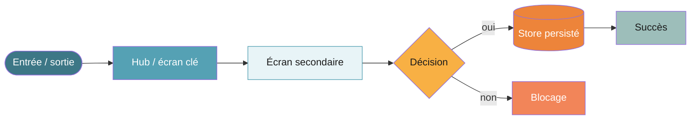

---

## Matrice de couverture — 15 flows

| # | Flow | Cahier CDC | Routes FO clés | Board FigJam | Statut doc |
|---|------|-----------|----------------|:---:|:---:|
| 1 | Onboarding Particulier | 03 | `/onboarding/*` | ✅ | ✅ |
| 2 | Subscription Management | 11bis | `/subscriptions`, `/billing/*` | ✅ | ✅ |
| 3 | Coaching & Booking | 04 | `/coaching/*`, `/coach/*` | ✅ | ✅ |
| 4 | Parcours & Learning Space | 01 | `/learning-paths/*`, `/lesson/*` | ✅ | ✅ |
| 5 | Journal de Bord Réflexif | 07 | `/journal/*` | ✅ | ✅ |
| 6 | Gamification & Badges | 05 | `/dashboard/badges`, `/badge/:id` | ✅ | ✅ |
| 7 | Passeport Compétences | 02 | `/passeport/*`, `/coach/passeport` | ✅ | ✅ |
| 8 | Chatbot IA & QAR | 12 | `/chatbot/*` | ✅ | ✅ |
| 9 | Enterprise FO Space | 06 | `/enterprise/*` | ✅ | ✅ |
| 10 | Notifications Management | 09 | `/notifications/*` | ✅ | ✅ |
| 11 | Projects SBO | 11 | `/projects/*`, `/project/:id/*` | ✅ | ✅ |
| 12 | Helpcenter Wiki Support | 13 | `/help/*` | ✅ | ✅ |
| 13 | GDPR / AI Act / Security | 13bis | `/privacy/*` | ✅ | ✅ |
| 14 | Masterclass & Événements | 08 | `/events`, `/event/:id/*` | ✅ | ✅ |
| 15 | Veille & Newsletter | 01bis | `/veille/*`, newsletter | ✅ | ✅ |

> ✅ **Board complet** — 15 flows + légende poussés sur FigJam le 2026-06-09.

### Cahiers sans flow FO dédié (et pourquoi)

| Cahier | Raison |
|--------|--------|
| 10 — Analytics Tracking | Infrastructure backend / dashboard BO ; pas de parcours apprenant FO. |
| 10bis — Back-Office Org UX | Hors scope FO React (plugin WordPress BO séparé). |
| 12bis — IA Features Framework | Transversal — overlay IA réparti sur les flows 1, 3, 8 (positionnement, matching coach, chatbot RAG), pas un parcours autonome. |

> ✅ **Couverture complète** : 15 flows couvrent l'intégralité des parcours utilisateur FO (apprenant + manager). Les 3 cahiers ci-dessus n'ont volontairement pas de flow FO.

---

## 1 — Onboarding Particulier `CDC/03`

Parcours d'inscription : profil → positionnement Dreyfus → abonnement → tutoriel → dashboard.

```mermaid
flowchart TB
    START(["Inscription / Magic Link"]) --> PROFIL["/onboarding — Profil : prenom / role / secteur"]
    PROFIL --> OBJ["Objectifs d apprentissage"]
    OBJ --> RYTHME["Rythme d apprentissage"]
    RYTHME --> CONFIRM["Confirmation + parcours suggere IA"]
    CONFIRM --> S1[("profileStore.set — onboardingStep: questionnaire")]
    S1 --> QUEST["/onboarding/questionnaire — 8 questions Dreyfus"]
    QUEST --> S2[("Seed passeportStore + positioningStore")]
    S2 --> PAY["/onboarding/payment — 4 formules"]
    PAY --> FREE{"Plan gratuit ?"}
    FREE -->|"Oui"| COMMIT[("commitPlan — tier free, step: tutorial")]
    FREE -->|"Payant"| CB["Formulaire CB + ConfirmModal"]
    CB --> COMMIT
    COMMIT --> TUTO["/onboarding/tutorial — visite guidee"]
    TUTO --> SUCCESS["/onboarding/success"]
    SUCCESS --> S3[("isOnboarded: true + badge first-login +150 XP")]
    S3 --> DASH["/dashboard — empty state premiere visite"]

    style START fill:#3D7786,color:#ffffff
    style DASH fill:#55A1B4,color:#ffffff
    style FREE fill:#F8B044,color:#1a1a1a
    style PROFIL fill:#E8F4F7,stroke:#55A1B4,color:#1a1a1a
    style OBJ fill:#E8F4F7,stroke:#55A1B4,color:#1a1a1a
    style RYTHME fill:#E8F4F7,stroke:#55A1B4,color:#1a1a1a
    style CONFIRM fill:#E8F4F7,stroke:#55A1B4,color:#1a1a1a
    style QUEST fill:#E8F4F7,stroke:#55A1B4,color:#1a1a1a
    style PAY fill:#E8F4F7,stroke:#55A1B4,color:#1a1a1a
    style CB fill:#E8F4F7,stroke:#55A1B4,color:#1a1a1a
    style TUTO fill:#E8F4F7,stroke:#55A1B4,color:#1a1a1a
    style SUCCESS fill:#9DBEBA,color:#1a1a1a
    style S1 fill:#ED843A,color:#ffffff
    style S2 fill:#ED843A,color:#ffffff
    style S3 fill:#ED843A,color:#ffffff
    style COMMIT fill:#ED843A,color:#ffffff
```

---

## 2 — Subscription Management `CDC/11bis`

Gestion d'abonnement : upgrade / downgrade / annulation + facturation + relances (dunning).

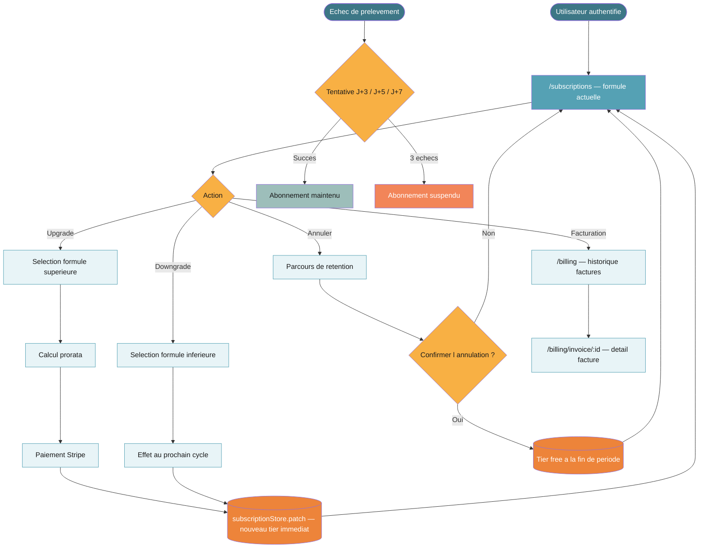

---

## 3 — Coaching & Booking `CDC/04`

Accompagnement 1:1 : assignation coach → réservation (check crédits) → session → corrections.

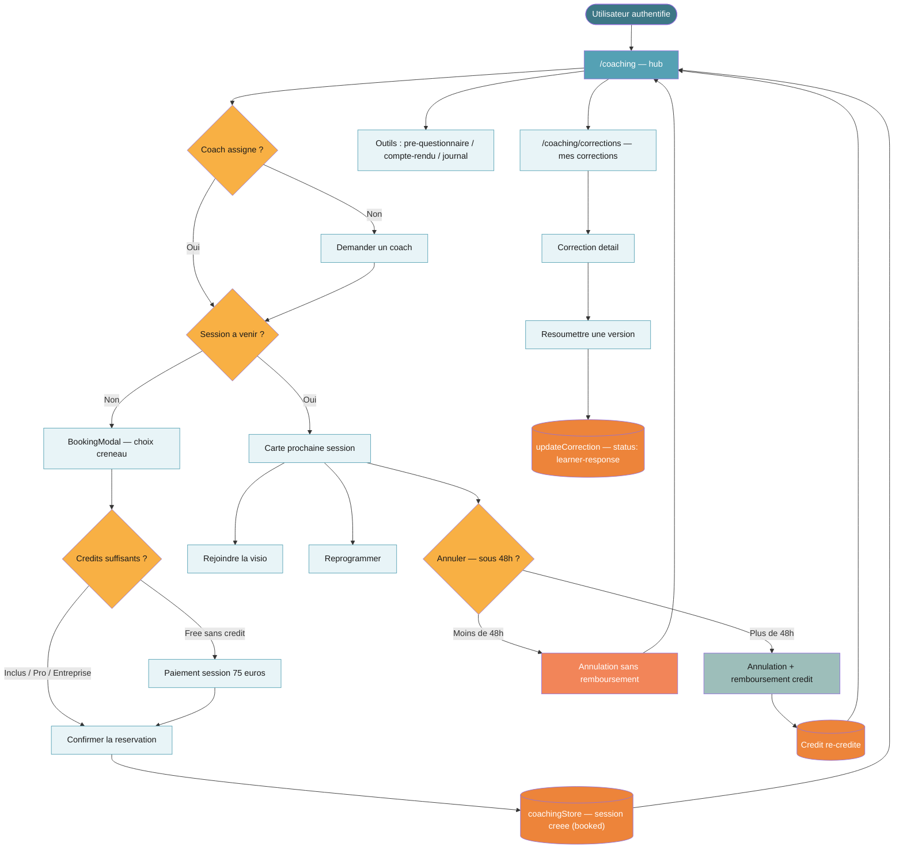

---

## 4 — Parcours & Learning Space `CDC/01`

Navigation parcours : positionnement → reprise → étapes → leçons (6 types) → progression.

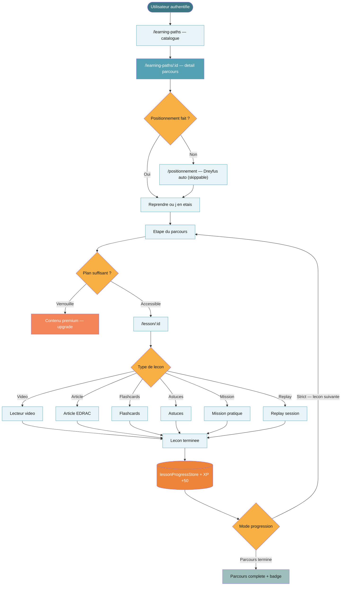

---

## 5 — Journal de Bord Réflexif `CDC/07`

Écriture réflexive : type → mood → EDRA-R → auto-save → publication. Pré-remplissage contextuel.

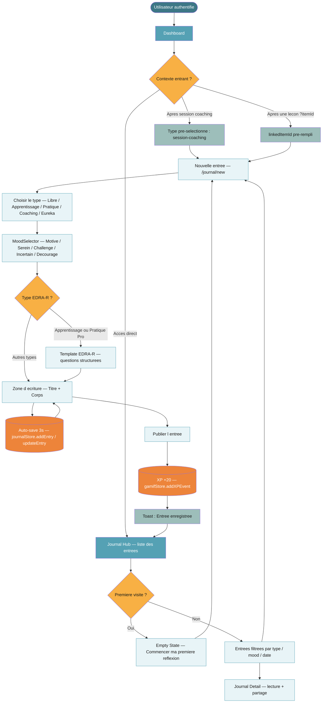

---

## 6 — Gamification & Badges `CDC/05`

Ledger XP append-only → badges auto-attribués → streaks → leaderboard → export Open Badges.

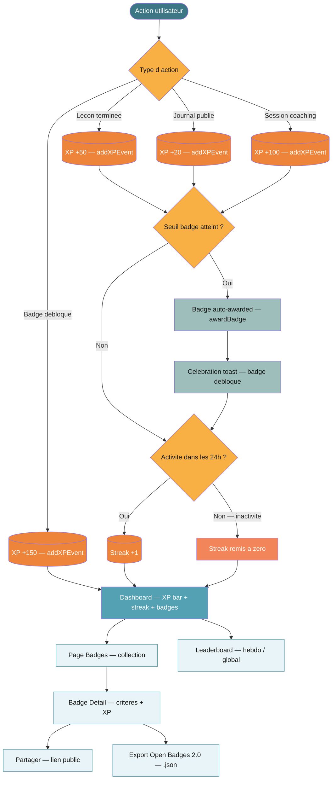

---

## 7 — Passeport Compétences `CDC/02`

Modèle Dreyfus (1-5) → preuves → objectifs → JAC (validation coach) → montée de niveau.

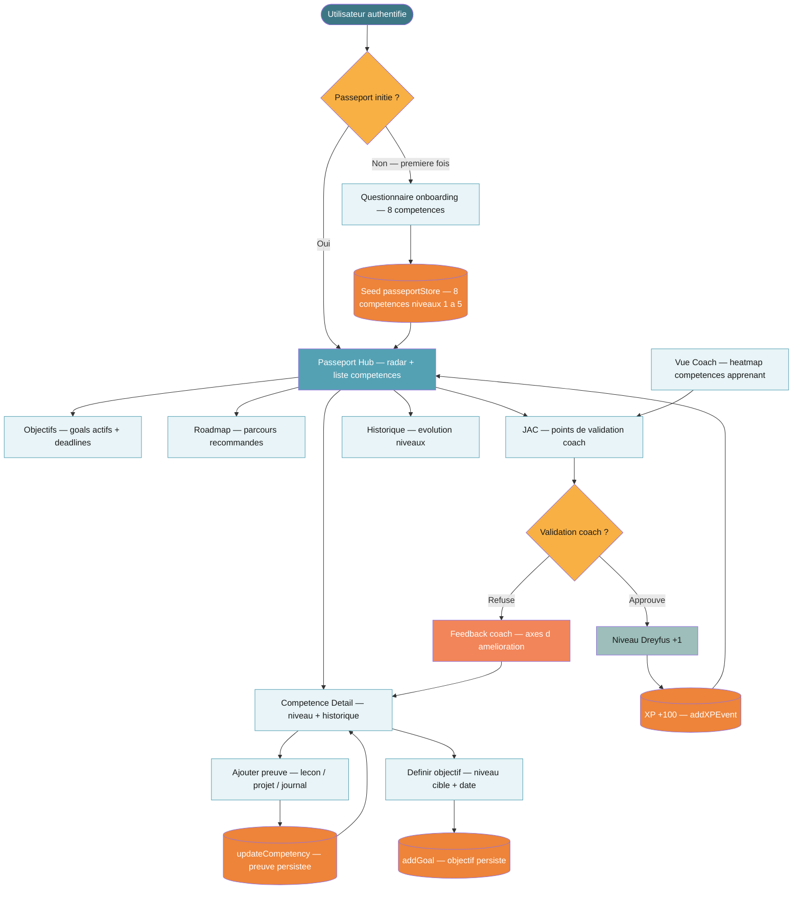

---

## 8 — Chatbot IA & QAR `CDC/12`

Points d'entrée → filtrage PII → injection contexte → QAR / Mistral RAG → persistance thread.

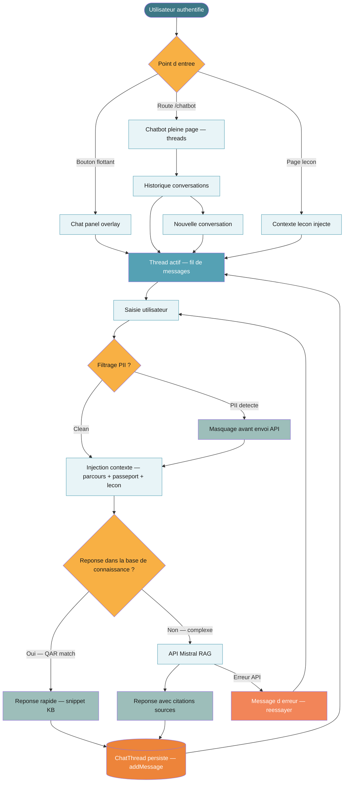

---

## 9 — Enterprise FO Space `CDC/06` ⏳

Espace organisation : équipes → membres (RBAC) → pool de crédits → workflow d'approbation → analytics.

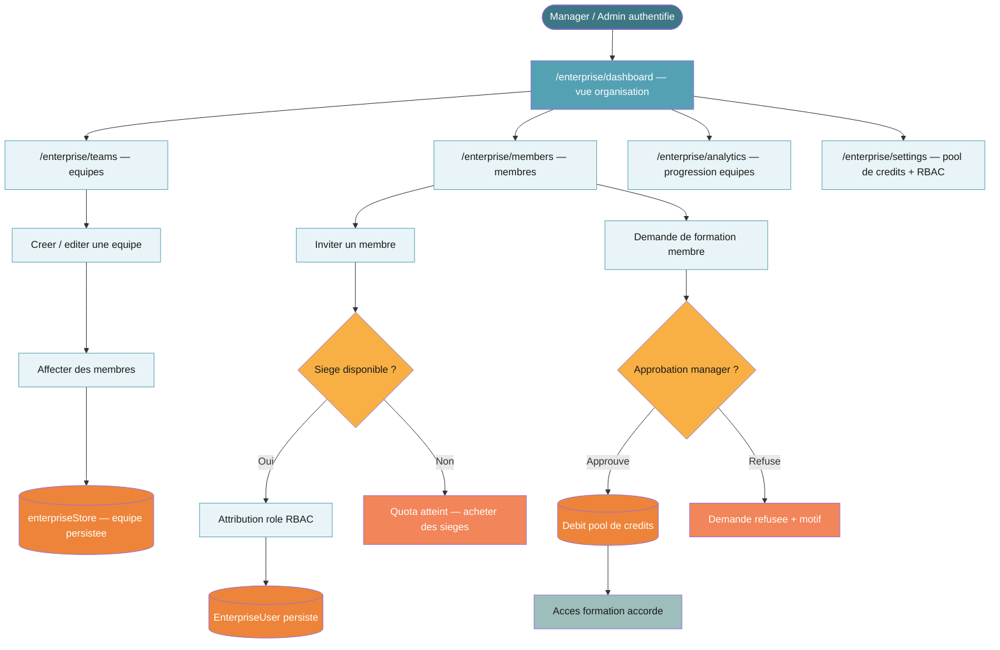

---

## 10 — Notifications Management `CDC/09` ⏳

Événement → création notification → routage par canal → préférences → centre de notifications.

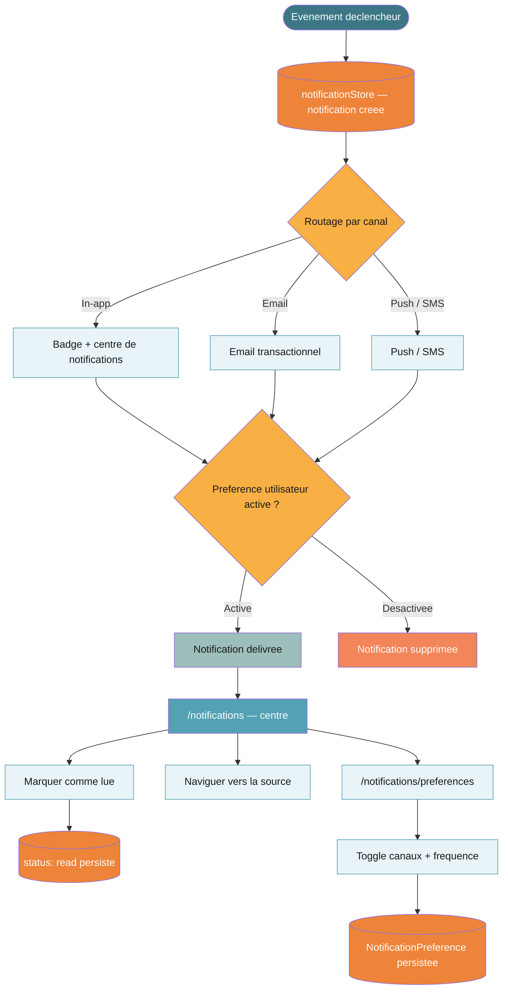

---

## 11 — Projects SBO `CDC/11` ⏳

Projets (Upskilling / STRIDE / Custom) → gating compétence → tâches → soumission → JAC.

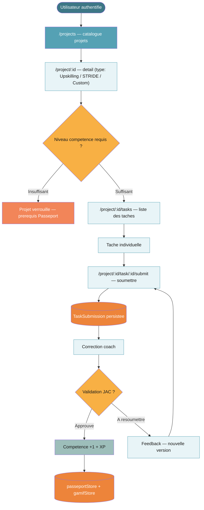

---

## 12 — Helpcenter Wiki Support `CDC/13` ⏳

Centre d'aide : FAQ → recherche fulltext → article → utile ? → ticket support.

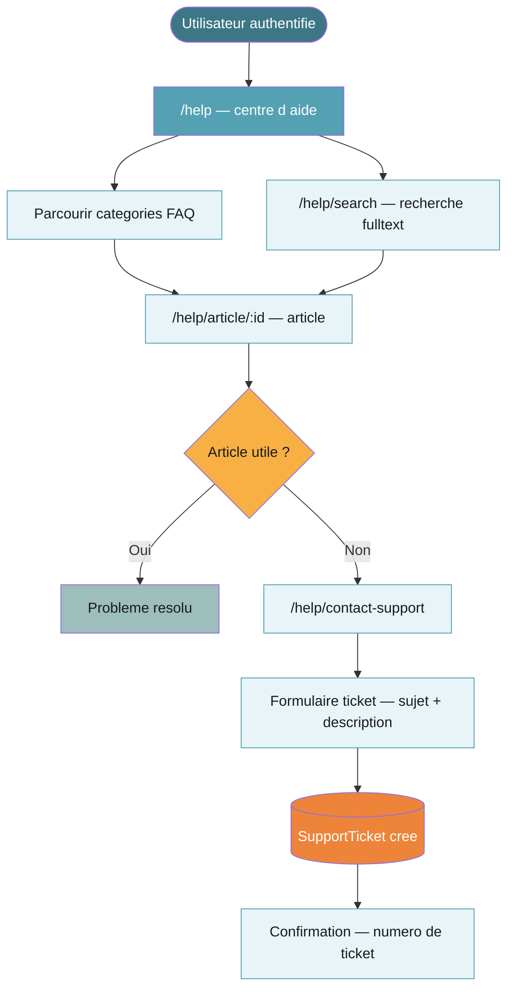

---

## 13 — GDPR / AI Act / Security `CDC/13bis` ⏳

Confidentialité : consentements → DSAR (export ZIP, token 7j) → export données → suppression compte.

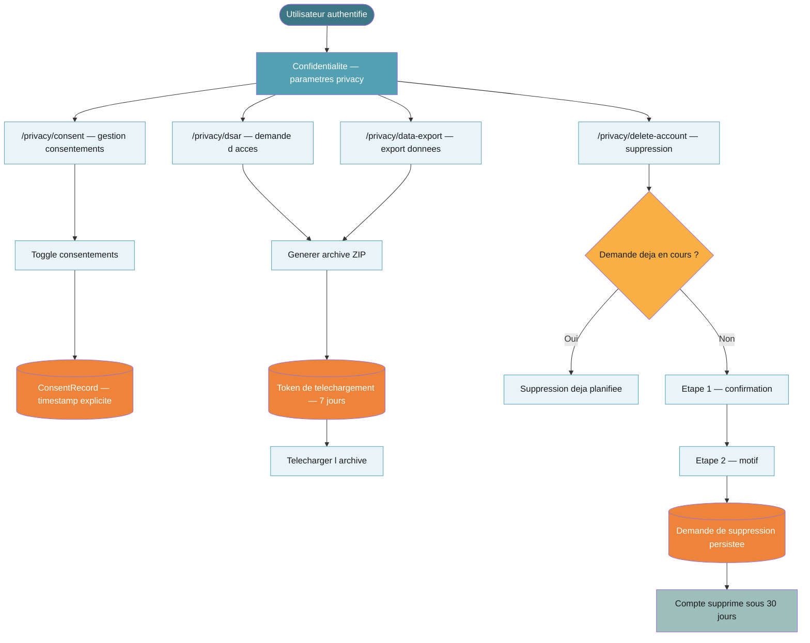

---

## 14 — Masterclass & Événements `CDC/08` ⏳

Événements live : catalogue → détail → réservation (gating plan) → participation live/replay → feedback.

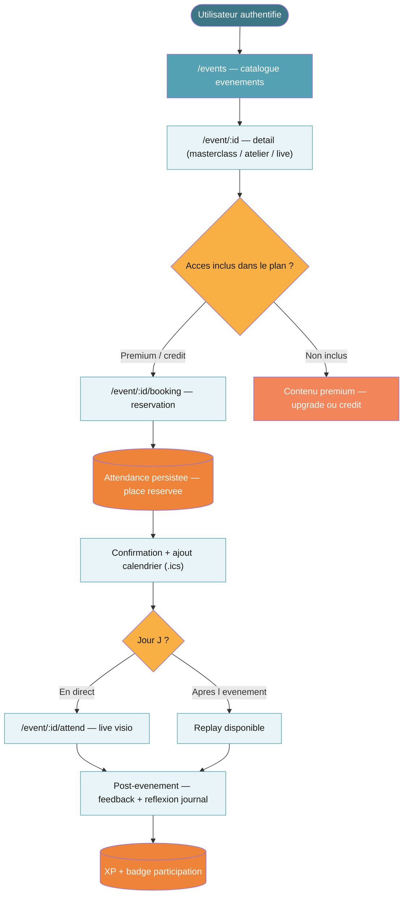

---

## 15 — Veille & Newsletter `CDC/01bis` ⏳

Veille apprenante : hub → formats (article / vidéo / newsletter / agrégé IA) → gating plan → sauvegarde + abonnement newsletter.

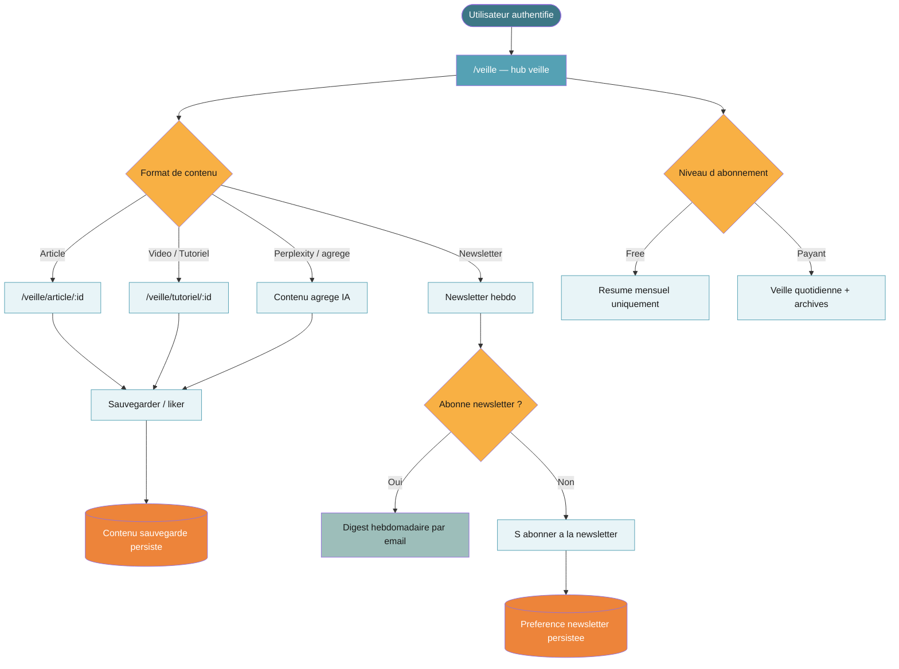

---

## Procédure de synchronisation FigJam

Quand le connecteur Figma est actif, pousser les flows `⏳` vers le board :

1. `generate_diagram` avec `fileKey: FVKxVsqxUkHmrUU5g7nFPx`, `planKey: team::1496831231161753934`
2. Coller le `mermaidSyntax` exact depuis ce fichier (parité doc ↔ board garantie)
3. Mettre à jour la colonne **Board FigJam** de la matrice de couverture (⏳ → ✅)
4. Ajouter un nœud légende sur le canvas si absent (cf. section Légende globale)

> **Règle** : ce fichier est la source de vérité. En cas de divergence doc ↔ board, le board est régénéré depuis le Mermaid de ce fichier.
